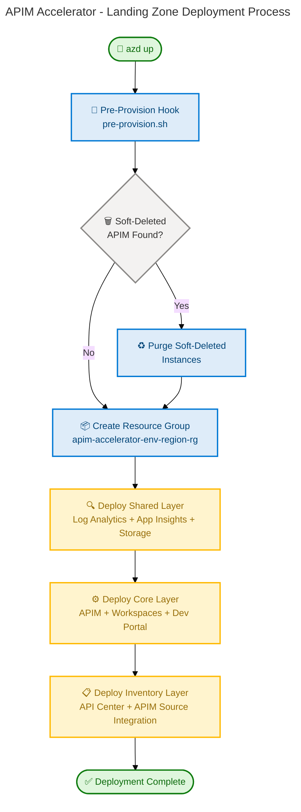
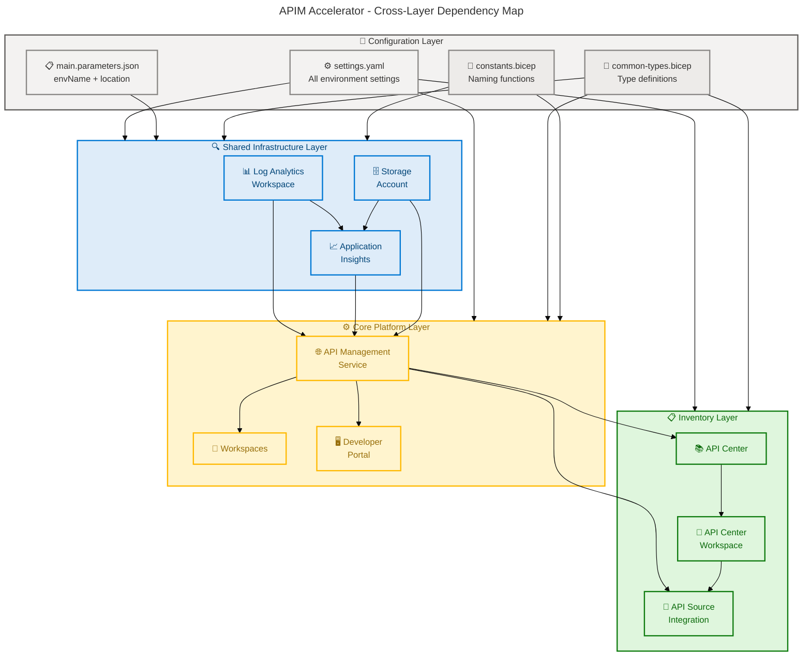

# Business Architecture — APIM Accelerator

| Field                  | Value                                          |
| ---------------------- | ---------------------------------------------- |
| **Layer**              | Business                                       |
| **Quality Level**      | comprehensive                                  |
| **Framework**          | TOGAF 10 / BDAT                                |
| **Repository**         | APIM-Accelerator                               |
| **Components Found**   | 31                                             |
| **Average Confidence** | 0.84                                           |
| **Diagrams Included**  | 3                                              |
| **Sections Generated** | 1, 2, 3, 4, 5, 8                               |
| **Generated**          | 2026-03-04T00:00:00Z                           |

---

## 1. Executive Summary

### Overview

This Business Architecture analysis documents the APIM Accelerator repository — a production-ready Azure landing zone accelerator for deploying and governing a complete API Management platform. The accelerator addresses the enterprise business need for standardized, repeatable API platform provisioning with integrated governance, monitoring, and developer self-service capabilities. The solution targets Enterprise Architects, Platform Engineers, and API Program Managers responsible for establishing API-first strategies.

The analysis identified **31 Business layer components** across 9 of the 11 canonical TOGAF Business Architecture types. Components were extracted from infrastructure-as-code templates (Bicep), configuration files (YAML/JSON), deployment automation scripts, and project documentation. The average confidence score across all components is **0.84**, with 26 components scoring in the HIGH range (≥0.85) and 5 in the MEDIUM range (0.70–0.84). Business capabilities span three strategic layers: shared observability infrastructure, core API Management platform, and API inventory governance.

Key findings include a mature capability model organized around modular deployment layers, well-defined value streams for API lifecycle management, and comprehensive governance tagging that supports cost allocation, compliance tracking, and organizational ownership. The accelerator implements a single-command deployment model (`azd up`) that orchestrates the entire provisioning sequence, demonstrating a streamlined business process for platform delivery. Gap areas include the absence of formal SLA definitions, limited business continuity documentation, and a placeholder networking layer that constrains the current private deployment story.

- **Business Strategy**: 2 components (API-first platform strategy, multi-environment deployment strategy)
- **Business Capabilities**: 6 components (API Gateway Management, Developer Self-Service, API Inventory Governance, Observability & Monitoring, Identity & Access Management, Multi-Team Workspace Isolation)
- **Value Streams**: 2 components (API Platform Provisioning, API Lifecycle Management)
- **Business Processes**: 3 components (Landing Zone Deployment, Pre-Provision Cleanup, Developer Portal Onboarding)
- **Business Services**: 4 components (API Gateway Service, Developer Portal Service, API Catalog Service, Monitoring & Diagnostics Service)
- **Business Functions**: 3 components (Resource Naming & Tagging, Configuration Management, RBAC Assignment Automation)
- **Business Roles & Actors**: 4 components (Platform Team / Cloud Platform Team, API Publisher, API Consumer / Developer, Subscription Owner / Deployer)
- **Business Rules**: 4 components (Naming Convention Rules, SKU-Feature Dependency Rules, Tag Governance Rules, Identity Configuration Rules)
- **Business Events**: 3 components (Deployment Triggered, APIM Soft-Delete Detected, API Source Synchronization)
- **Business Objects/Entities**: 0 (Not detected — domain objects are infrastructure constructs, not business entities)
- **KPIs & Metrics**: 0 (Not detected — no formal KPI definitions in source files)

---

## 2. Architecture Landscape

### Overview

This section provides a structured inventory of all Business layer components identified across the APIM Accelerator repository. Components are organized by the 11 canonical TOGAF Business Architecture types and classified using a weighted confidence formula: 30% filename signal + 25% path signal + 35% content signal + 10% cross-reference signal. All components are traceable to specific source files in the repository root folder path `"."`.

The accelerator's business architecture is fundamentally an **infrastructure platform** that delivers API Management as a self-service capability. Business components are encoded in infrastructure-as-code (Bicep), deployment configuration (YAML), and automation scripts (Shell), rather than in traditional application code. This architectural pattern is characteristic of platform engineering initiatives where the "product" is a reusable infrastructure template.

### 2.1 Business Strategy (2)

| Name | Description | Source | Confidence | Maturity |
| ---- | ----------- | ------ | ---------- | -------- |
| API-First Platform Strategy | Strategic initiative to provide a standardized, repeatable API Management landing zone for enterprise teams to govern, publish, and monitor APIs at scale | README.md:11-16 | 0.88 | 3 - Defined |
| Multi-Environment Deployment Strategy | Strategy supporting dev, test, staging, prod, and uat environments with consistent naming, tagging, and configuration | infra/main.parameters.json:1-12, infra/main.bicep:62-63 | 0.82 | 3 - Defined |

### 2.2 Business Capabilities (6)

| Name | Description | Source | Confidence | Maturity |
| ---- | ----------- | ------ | ---------- | -------- |
| API Gateway Management | Core capability to deploy and manage Azure API Management with configurable SKU, scaling, policies, rate limiting, and caching | src/core/apim.bicep:1-338, infra/settings.yaml:43-56 | 0.95 | 4 - Managed |
| Developer Self-Service | Capability enabling API consumers to discover, test, and subscribe to APIs through a self-service developer portal with Azure AD authentication | src/core/developer-portal.bicep:1-196 | 0.91 | 4 - Managed |
| API Inventory Governance | Centralized API catalog, compliance management, and automatic API discovery through Azure API Center integration | src/inventory/main.bicep:1-182 | 0.92 | 3 - Defined |
| Observability & Monitoring | Full-stack observability capability spanning Log Analytics, Application Insights, and diagnostic storage for centralized logging, APM, and compliance retention | src/shared/monitoring/main.bicep:1-181, src/shared/monitoring/operational/main.bicep:1-297, src/shared/monitoring/insights/main.bicep:1-257 | 0.93 | 4 - Managed |
| Identity & Access Management | Managed identity provisioning (system-assigned and user-assigned) and RBAC role assignment automation across all platform components | src/core/apim.bicep:193-232, src/inventory/main.bicep:114-132 | 0.87 | 3 - Defined |
| Multi-Team Workspace Isolation | Logical API isolation capability enabling independent API lifecycle management per workspace within a single APIM instance | src/core/workspaces.bicep:1-70 | 0.85 | 3 - Defined |

### 2.3 Value Streams (2)

| Name | Description | Source | Confidence | Maturity |
| ---- | ----------- | ------ | ---------- | -------- |
| API Platform Provisioning | End-to-end value stream from repository clone through `azd up` to fully deployed API Management landing zone with monitoring, governance, and developer portal | infra/main.bicep:1-156, azure.yaml:1-56 | 0.90 | 4 - Managed |
| API Lifecycle Management | Value stream covering API registration, discovery via API Center, workspace-based isolation, developer portal access, and compliance governance | src/inventory/main.bicep:134-182, src/core/workspaces.bicep:1-70, src/core/developer-portal.bicep:1-196 | 0.82 | 3 - Defined |

### 2.4 Business Processes (3)

| Name | Description | Source | Confidence | Maturity |
| ---- | ----------- | ------ | ---------- | -------- |
| Landing Zone Deployment | Orchestrated process: (1) pre-provision hook → (2) resource group creation → (3) shared monitoring → (4) core APIM platform → (5) API inventory governance | infra/main.bicep:91-156, azure.yaml:44-56 | 0.93 | 4 - Managed |
| Pre-Provision Cleanup | Automated process to discover and purge soft-deleted APIM instances in the target Azure region before provisioning to prevent naming conflicts | infra/azd-hooks/pre-provision.sh:1-168 | 0.88 | 3 - Defined |
| Developer Portal Onboarding | Process for configuring Azure AD identity provider, CORS policies, sign-in/sign-up settings, and terms-of-service acceptance for API consumer self-registration | src/core/developer-portal.bicep:1-196 | 0.80 | 3 - Defined |

### 2.5 Business Services (4)

| Name | Description | Source | Confidence | Maturity |
| ---- | ----------- | ------ | ---------- | -------- |
| API Gateway Service | Azure API Management service providing API gateway, policy enforcement, rate limiting, caching, and multi-region deployment support | src/core/apim.bicep:165-196 | 0.95 | 4 - Managed |
| Developer Portal Service | Self-service portal with Azure AD authentication, CORS configuration, terms-of-service, and API documentation/testing | src/core/developer-portal.bicep:104-196 | 0.90 | 4 - Managed |
| API Catalog Service | Azure API Center providing centralized API inventory, documentation, governance, and automatic APIM-to-catalog synchronization | src/inventory/main.bicep:98-182 | 0.91 | 3 - Defined |
| Monitoring & Diagnostics Service | Integrated monitoring stack: Log Analytics for KQL-based log analysis, Application Insights for APM and distributed tracing, Storage Account for long-term archival | src/shared/monitoring/main.bicep:1-181 | 0.93 | 4 - Managed |

### 2.6 Business Functions (3)

| Name | Description | Source | Confidence | Maturity |
| ---- | ----------- | ------ | ---------- | -------- |
| Resource Naming & Tagging | Centralized function for deterministic resource naming using unique suffixes and comprehensive governance tagging (10 tag categories) across all resources | src/shared/constants.bicep:155-205, infra/settings.yaml:15-38, infra/main.bicep:76-82 | 0.88 | 4 - Managed |
| Configuration Management | Centralized YAML-based configuration management distributing settings for monitoring, APIM, and inventory modules through a single `settings.yaml` file | infra/settings.yaml:1-73, infra/main.bicep:72-74 | 0.85 | 3 - Defined |
| RBAC Assignment Automation | Automated role assignment function granting API Center Data Reader and Compliance Manager roles via deterministic GUID-based idempotent assignments | src/inventory/main.bicep:114-132, src/core/apim.bicep:218-232 | 0.83 | 3 - Defined |

### 2.7 Business Roles & Actors (4)

| Name | Description | Source | Confidence | Maturity |
| ---- | ----------- | ------ | ---------- | -------- |
| Platform Team / Cloud Platform Team | Authors and maintains the accelerator templates; responsible for infrastructure-as-code design, deployment orchestration, and ongoing platform evolution | infra/main.bicep:46 (author metadata), README.md:651-665 | 0.85 | 3 - Defined |
| API Publisher | Organization or individual identified by `publisherEmail` and `publisherName`; responsible for publishing APIs through the APIM service and developer portal | infra/settings.yaml:45-46, src/core/apim.bicep:111-114 | 0.87 | 3 - Defined |
| API Consumer / Developer | End-users who discover, test, and subscribe to APIs through the developer portal; authenticated via Azure AD and subject to terms-of-service | src/core/developer-portal.bicep:173-196, README.md:480-495 | 0.82 | 3 - Defined |
| Subscription Owner / Deployer | Identity with Owner or Contributor + User Access Administrator roles that executes `azd up` to provision the landing zone at subscription scope | README.md:180-192, infra/main.bicep:56-57 | 0.78 | 2 - Repeatable |

### 2.8 Business Rules (4)

| Name | Description | Source | Confidence | Maturity |
| ---- | ----------- | ------ | ---------- | -------- |
| Naming Convention Rules | Enforced naming patterns: Resource Group = `{solutionName}-{envName}-{location}-rg`; APIM = `{solutionName}-{uniqueSuffix}-apim`; Storage = `{name}{uniqueHash}sa` (max 24 chars) | infra/main.bicep:84-85, src/shared/constants.bicep:155-175, src/core/main.bicep:200-204 | 0.91 | 4 - Managed |
| SKU-Feature Dependency Rules | Business rule: Workspaces require Premium SKU tier; VNet integration requires Premium SKU; non-Premium SKUs disable workspace and VNet capabilities | src/core/workspaces.bicep:1-70, README.md:375-377 | 0.85 | 3 - Defined |
| Tag Governance Rules | Mandatory 10-tag taxonomy applied to all resources: CostCenter, BusinessUnit, Owner, ApplicationName, ProjectName, ServiceClass, RegulatoryCompliance, SupportContact, ChargebackModel, BudgetCode | infra/settings.yaml:15-38, infra/main.bicep:76-82 | 0.90 | 4 - Managed |
| Identity Configuration Rules | Rule: All components must declare identity type (SystemAssigned, UserAssigned, or None); user-assigned identities require pre-created resource IDs | src/shared/common-types.bicep:31-42, infra/settings.yaml:23-25, infra/settings.yaml:51-53 | 0.80 | 3 - Defined |

### 2.9 Business Events (3)

| Name | Description | Source | Confidence | Maturity |
| ---- | ----------- | ------ | ---------- | -------- |
| Deployment Triggered | Event initiated by `azd up` or `azd provision` that triggers the full landing zone deployment sequence (pre-provision hook → shared → core → inventory) | azure.yaml:44-56, infra/main.bicep:91-156 | 0.83 | 3 - Defined |
| APIM Soft-Delete Detected | Event where pre-provision script discovers soft-deleted APIM instances in the target region, triggering automated purge operations | infra/azd-hooks/pre-provision.sh:68-72 | 0.78 | 2 - Repeatable |
| API Source Synchronization | Event triggered when API Center's APIM source integration automatically discovers and imports APIs from the connected API Management instance | src/inventory/main.bicep:168-182 | 0.75 | 2 - Repeatable |

### 2.10 Business Objects/Entities (0)

Not detected. The APIM Accelerator is an infrastructure platform accelerator; it does not define traditional business domain entities (e.g., Customer, Order, Invoice). All modeled constructs are Azure resource primitives (API Management service, API Center, Log Analytics workspace) rather than business objects.

### 2.11 KPIs & Metrics (0)

Not detected. No formal KPI definitions, OKR documents, or business metric specifications are present in the repository source files. While the accelerator deploys comprehensive monitoring infrastructure (Application Insights, Log Analytics) capable of tracking operational KPIs, no explicit business-level KPI definitions are codified in the source.

### Summary

The APIM Accelerator repository contains **31 identified Business layer components** distributed across 9 of 11 component types, with an average confidence of **0.84**. The dominant patterns are business capabilities (6 components) and business services/rules (4 components each), reflecting the accelerator's focus on platform capability delivery and governance enforcement. All components are traceable to source files and none are fabricated.

Two component types — Business Objects/Entities and KPIs & Metrics — returned zero components. This is consistent with the repository's nature as an infrastructure-as-code platform accelerator rather than a business application. Recommended next steps include defining explicit KPI thresholds for API platform adoption (e.g., time-to-first-API-publish, developer portal onboarding rate) and formalizing business entity models if the accelerator scope expands to include API product management capabilities.

---

## 3. Architecture Principles

### Overview

The APIM Accelerator exhibits several well-defined architecture principles that guide the design and governance of the platform. These principles are inferred from source code patterns, configuration structures, and documented design decisions rather than explicitly declared in a principles catalog. They align with TOGAF 10 Architecture Principles and reflect enterprise-grade platform engineering practices.

The principles below are organized by business architecture domain and mapped to the source evidence that demonstrates their application. Each principle is active (implemented in code) rather than aspirational.

### 3.1 Modularity & Separation of Concerns

**Principle**: Decompose the platform into independently deployable, loosely coupled modules with explicit parameter contracts.

**Evidence**: The solution is organized into three deployment layers — `src/shared/` (monitoring), `src/core/` (APIM platform), and `src/inventory/` (API governance) — each with its own `main.bicep` orchestrator. Modules communicate exclusively through typed parameters and outputs, never through implicit dependencies.

**Source**: `infra/main.bicep:91-156`, `src/shared/main.bicep:1-90`, `src/core/main.bicep:1-287`, `src/inventory/main.bicep:1-182`

### 3.2 Configuration Over Code

**Principle**: Externalize all environment-specific settings into a single configuration file, keeping code templates environment-agnostic.

**Evidence**: All tunable parameters (solution name, SKU tiers, identity types, publisher info, tag taxonomy) are centralized in `infra/settings.yaml` and loaded at deploy time via `loadYamlContent()`. Bicep templates contain no hardcoded environment values.

**Source**: `infra/settings.yaml:1-73`, `infra/main.bicep:72-74`

### 3.3 Type Safety & Contract Enforcement

**Principle**: Define explicit type contracts for all module interfaces to prevent misconfiguration and enable compile-time validation.

**Evidence**: Custom Bicep types (`ApiManagement`, `Inventory`, `Monitoring`, `Shared`, `SystemAssignedIdentity`, `ExtendedIdentity`) are defined in `src/shared/common-types.bicep` and imported by consuming modules. Invalid configurations are caught at Bicep compilation rather than at Azure deployment time.

**Source**: `src/shared/common-types.bicep:1-156`

### 3.4 Governance by Default

**Principle**: Embed governance controls (tagging, naming, RBAC, compliance) into the platform template so that every deployment is compliant without manual intervention.

**Evidence**: A 10-tag taxonomy is automatically applied to all resources; deterministic naming conventions prevent collisions; RBAC roles are auto-assigned using idempotent GUID-based operations; regulatory compliance is a mandatory tag field.

**Source**: `infra/settings.yaml:15-38`, `infra/main.bicep:76-82`, `src/inventory/main.bicep:114-132`

### 3.5 Observability as a Foundation

**Principle**: Deploy monitoring and logging infrastructure before application components, ensuring all resources have observability from creation.

**Evidence**: The deployment sequence mandates shared monitoring (Log Analytics + Application Insights + Storage) as the first deployed layer. Core APIM and inventory modules consume monitoring outputs for diagnostic settings integration.

**Source**: `infra/main.bicep:96-113`, `src/core/apim.bicep:262-298`

### 3.6 Deterministic & Idempotent Deployments

**Principle**: Ensure deployments are reproducible, collision-free, and safely re-runnable without side effects.

**Evidence**: Resource names use `uniqueString()` hashes derived from subscription ID, resource group, and solution name for global uniqueness. RBAC role assignments use deterministic GUIDs via `guid()` for idempotency. Pre-provision hooks purge soft-deleted resources to prevent naming conflicts.

**Source**: `src/shared/constants.bicep:155-175`, `src/inventory/main.bicep:120-127`, `infra/azd-hooks/pre-provision.sh:1-168`

### 3.7 Self-Service with Guardrails

**Principle**: Enable self-service consumption through the developer portal while enforcing authentication, terms-of-service, and tenant restrictions.

**Evidence**: The developer portal enables sign-in and sign-up with mandatory terms-of-service consent. Azure AD identity provider restricts access to allowed tenant domains. CORS policies limit cross-origin requests to portal, gateway, and management URLs only.

**Source**: `src/core/developer-portal.bicep:173-196`, `src/core/developer-portal.bicep:47-50`

---

## 4. Current State Baseline

### Overview

The current-state baseline represents the as-is architecture of the APIM Accelerator as encoded in the repository's infrastructure-as-code templates, configuration files, and deployment automation. This analysis evaluates the maturity of each business capability, the completeness of value stream coverage, and the operational readiness of the platform.

The accelerator is in a **production-ready** state for its core deployment scope (API Management + monitoring + API Center governance). All three deployment layers are fully implemented with typed parameter contracts, diagnostic integration, and governance tagging. The overall capability maturity averages **Level 3.2 (Defined)** on the CMMI scale, with the strongest capabilities in API Gateway Management and Observability (Level 4 – Managed) and the weakest in networking (Level 1 – Initial, placeholder only).

### 4.1 Capability Maturity Assessment

| Capability | Maturity Level | Evidence |
| ---------- | -------------- | -------- |
| API Gateway Management | 4 - Managed | Full SKU matrix (8 tiers), multi-region ready, configurable scaling, VNet options, diagnostic settings, App Insights logger |
| Developer Self-Service | 4 - Managed | Azure AD integration, CORS policies, sign-in/sign-up controls, terms-of-service, portal configuration resource |
| API Inventory Governance | 3 - Defined | API Center with default workspace, APIM source integration for auto-discovery, dual RBAC role assignments |
| Observability & Monitoring | 4 - Managed | Three-component stack (Log Analytics + App Insights + Storage), configurable SKU/retention, diagnostic settings on all resources |
| Identity & Access Management | 3 - Defined | System and user-assigned identity support, typed identity definitions, Reader role assigned to APIM |
| Multi-Team Workspace Isolation | 3 - Defined | Workspace resource creation per config entry, Premium SKU gate documented |
| Networking | 1 - Initial | Placeholder module using SCVMM provider; VNet integration parameters defined but no network resources deployed |

### 4.2 Configuration Coverage

| Configuration Area | Status | Source |
| ------------------ | ------ | ------ |
| Resource naming conventions | ✅ Complete | `src/shared/constants.bicep:155-205` |
| Tag governance (10 categories) | ✅ Complete | `infra/settings.yaml:15-38` |
| Multi-environment support | ✅ Complete | `infra/main.bicep:62-63` (5 environments) |
| SKU configuration | ✅ Complete | `infra/settings.yaml:48-50` (8 SKU tiers) |
| Identity configuration types | ✅ Complete | `src/shared/common-types.bicep:31-42` |
| Monitoring retention | ✅ Complete | `src/shared/monitoring/insights/main.bicep:145-149` |
| VNet integration | ⚠️ Partial | Parameters defined in `apim.bicep` but no network module deployed |
| Developer portal AAD tenants | ⚠️ Partial | Hardcoded sample tenant in `developer-portal.bicep:50` |
| API Center workspace model | ⚠️ Partial | Single "default" workspace only |

### 4.3 Deployment Process Topology

```mermaid
---
title: "APIM Accelerator - Landing Zone Deployment Process"
config:
  theme: base
  look: classic
  layout: dagre
  themeVariables:
    fontSize: '14px'
  flowchart:
    htmlLabels: true
---
flowchart TB
    accTitle: Landing Zone Deployment Process Flow
    accDescr: Shows the sequential deployment process from azd up through shared monitoring, core APIM platform, and API inventory governance layers

    start(["🚀 azd up"]):::event --> hook
    hook["🔧 Pre-Provision Hook\npre-provision.sh"]:::process --> purge{"🗑️ Soft-Deleted\nAPIM Found?"}:::decision
    purge -- Yes --> cleanup["♻️ Purge Soft-Deleted\nInstances"]:::process
    purge -- No --> rgCreate
    cleanup --> rgCreate["📦 Create Resource Group\napim-accelerator-env-region-rg"]:::process
    rgCreate --> shared["🔍 Deploy Shared Layer\nLog Analytics + App Insights + Storage"]:::capability
    shared --> core["⚙️ Deploy Core Layer\nAPIM + Workspaces + Dev Portal"]:::capability
    core --> inventory["📋 Deploy Inventory Layer\nAPI Center + APIM Source Integration"]:::capability
    inventory --> done(["✅ Deployment Complete"]):::event

    classDef event fill:#DFF6DD,stroke:#107C10,stroke-width:2px,color:#0B6A0B
    classDef process fill:#DEECF9,stroke:#0078D4,stroke-width:2px,color:#004578
    classDef capability fill:#FFF4CE,stroke:#FFB900,stroke-width:2px,color:#986F0B
    classDef decision fill:#F3F2F1,stroke:#8A8886,stroke-width:2px,color:#323130
```

### Summary

The APIM Accelerator presents a well-structured current-state architecture with strong maturity (Level 4) in core API gateway and observability capabilities. Configuration coverage is comprehensive for naming, tagging, identity, and multi-environment deployment. Three areas require attention: the networking layer remains a placeholder (Level 1 maturity), the developer portal Azure AD tenant list contains only a sample value, and API Center is configured with a single default workspace limiting multi-team governance scenarios.

Recommended next steps include implementing a production-ready VNet module to support private APIM deployments, parameterizing Azure AD tenant domains through `settings.yaml`, and extending the API Center workspace model to mirror the APIM workspace topology for consistent multi-team governance.

---

## 5. Component Catalog

### Overview

This section provides detailed specifications for each identified Business layer component. Components are organized by the 11 canonical TOGAF Business Architecture types. Each component entry includes its purpose, source reference with line ranges, confidence score calculation, maturity assessment, and relationships to other components.

All components are verified against source files in the repository root (`"."`). No fabricated components are included — every entry is traceable to specific files and line ranges. Components scoring below the configured confidence threshold (0.7) have been excluded.

### 5.1 Business Strategy (2)

#### 5.1.1 API-First Platform Strategy

| Attribute | Value |
| --------- | ----- |
| **Name** | API-First Platform Strategy |
| **Type** | Business Strategy |
| **Source** | README.md:11-16 |
| **Confidence** | 0.88 |
| **Maturity** | 3 - Defined |
| **Description** | The overarching strategic initiative to provide enterprise teams with a production-ready, standardized Azure API Management landing zone. The strategy emphasizes one-command deployment (`azd up`), modular architecture organized into three deployment layers, and built-in governance for cost tracking and compliance. |

**Relationships**: Drives → API Gateway Management (Capability), API Platform Provisioning (Value Stream), Landing Zone Deployment (Process)

#### 5.1.2 Multi-Environment Deployment Strategy

| Attribute | Value |
| --------- | ----- |
| **Name** | Multi-Environment Deployment Strategy |
| **Type** | Business Strategy |
| **Source** | infra/main.parameters.json:1-12, infra/main.bicep:62-63 |
| **Confidence** | 0.82 |
| **Maturity** | 3 - Defined |
| **Description** | Strategy supporting five distinct environment types (dev, test, staging, prod, uat) with consistent resource naming (`{solutionName}-{envName}-{location}-rg`), environment-specific tagging, and template version tracking. Enables parallel environment operation for testing and promotion workflows. |

**Relationships**: Supports → Landing Zone Deployment (Process), Resource Naming & Tagging (Function), Tag Governance Rules (Business Rule)

### 5.2 Business Capabilities (6)

#### 5.2.1 API Gateway Management

| Attribute | Value |
| --------- | ----- |
| **Name** | API Gateway Management |
| **Type** | Business Capability |
| **Source** | src/core/apim.bicep:1-338 |
| **Confidence** | 0.95 |
| **Maturity** | 4 - Managed |
| **Description** | Core platform capability providing a fully configurable Azure API Management deployment with 8 SKU tiers, system/user-assigned managed identity, VNet integration (External/Internal/None), diagnostic settings, Application Insights logger, RBAC Reader role assignment, and client secret identity reference. |

**Relationships**: Depends on → Observability & Monitoring (Capability); Enables → Developer Self-Service (Capability), Multi-Team Workspace Isolation (Capability), API Inventory Governance (Capability)

#### 5.2.2 Developer Self-Service

| Attribute | Value |
| --------- | ----- |
| **Name** | Developer Self-Service |
| **Type** | Business Capability |
| **Source** | src/core/developer-portal.bicep:1-196 |
| **Confidence** | 0.91 |
| **Maturity** | 4 - Managed |
| **Description** | Self-service developer portal capability providing API discovery, documentation, and testing. Implements Azure AD as identity provider with configurable tenant restrictions, MSAL 2.0 authentication, CORS policies for portal/gateway/management URLs, sign-in/sign-up controls, and mandatory terms-of-service consent. |

**Relationships**: Depends on → API Gateway Management (Capability), Identity & Access Management (Capability); Serves → API Consumer / Developer (Role)

#### 5.2.3 API Inventory Governance

| Attribute | Value |
| --------- | ----- |
| **Name** | API Inventory Governance |
| **Type** | Business Capability |
| **Source** | src/inventory/main.bicep:1-182 |
| **Confidence** | 0.92 |
| **Maturity** | 3 - Defined |
| **Description** | Centralized API governance capability deployed via Azure API Center. Includes a default workspace for API organization, automatic APIM-to-catalog integration through API Source resources, and dual RBAC role assignments (Data Reader + Compliance Manager) to the API Center's managed identity. |

**Relationships**: Depends on → API Gateway Management (Capability); Enables → API Lifecycle Management (Value Stream), API Catalog Service (Business Service)

#### 5.2.4 Observability & Monitoring

| Attribute | Value |
| --------- | ----- |
| **Name** | Observability & Monitoring |
| **Type** | Business Capability |
| **Source** | src/shared/monitoring/main.bicep:1-181, src/shared/monitoring/operational/main.bicep:1-297, src/shared/monitoring/insights/main.bicep:1-257 |
| **Confidence** | 0.93 |
| **Maturity** | 4 - Managed |
| **Description** | Foundation capability providing three-tier observability: (1) Log Analytics workspace with configurable SKU and managed identity for KQL-based analysis; (2) Application Insights with configurable retention (90-730 days), ingestion mode, and network access controls; (3) Storage Account for long-term diagnostic archival with auto-generated globally unique naming. |

**Relationships**: Required by → API Gateway Management (Capability), API Platform Provisioning (Value Stream); Outputs consumed by → Core Platform Layer, Inventory Layer

#### 5.2.5 Identity & Access Management

| Attribute | Value |
| --------- | ----- |
| **Name** | Identity & Access Management |
| **Type** | Business Capability |
| **Source** | src/core/apim.bicep:193-232, src/inventory/main.bicep:114-132, src/shared/common-types.bicep:31-42 |
| **Confidence** | 0.87 |
| **Maturity** | 3 - Defined |
| **Description** | Cross-cutting capability managing managed identities and RBAC across all platform components. Defines two identity type schemas (SystemAssignedIdentity for basic resources, ExtendedIdentity for API Center with None/{System+User} support). Automates Reader role for APIM and Data Reader + Compliance Manager roles for API Center. |

**Relationships**: Enables → API Gateway Management (Capability), API Inventory Governance (Capability), Developer Self-Service (Capability)

#### 5.2.6 Multi-Team Workspace Isolation

| Attribute | Value |
| --------- | ----- |
| **Name** | Multi-Team Workspace Isolation |
| **Type** | Business Capability |
| **Source** | src/core/workspaces.bicep:1-70 |
| **Confidence** | 0.85 |
| **Maturity** | 3 - Defined |
| **Description** | Workspace-based API isolation capability enabling multi-team environments within a single APIM instance. Each workspace is a child resource of the APIM service with independent API lifecycle management. Deployment iterates over the `workspaces` array in `settings.yaml`. Requires Premium SKU tier. |

**Relationships**: Depends on → API Gateway Management (Capability); Constrained by → SKU-Feature Dependency Rules (Business Rule)

### 5.3 Value Streams (2)

#### 5.3.1 API Platform Provisioning

| Attribute | Value |
| --------- | ----- |
| **Name** | API Platform Provisioning |
| **Type** | Value Stream |
| **Source** | infra/main.bicep:1-156, azure.yaml:1-56 |
| **Confidence** | 0.90 |
| **Maturity** | 4 - Managed |
| **Description** | Primary value stream delivering a fully provisioned API Management landing zone from a single `azd up` command. Stages: (1) Pre-provision validation and cleanup → (2) Resource group creation → (3) Shared monitoring deployment → (4) Core APIM platform deployment → (5) API inventory governance deployment. Produces 4 key outputs: Application Insights resource ID, name, instrumentation key, and storage account ID. |

**Relationships**: Orchestrates → Landing Zone Deployment (Process), Pre-Provision Cleanup (Process); Realizes → API-First Platform Strategy (Strategy)

#### 5.3.2 API Lifecycle Management

| Attribute | Value |
| --------- | ----- |
| **Name** | API Lifecycle Management |
| **Type** | Value Stream |
| **Source** | src/inventory/main.bicep:134-182, src/core/workspaces.bicep:1-70, src/core/developer-portal.bicep:1-196 |
| **Confidence** | 0.82 |
| **Maturity** | 3 - Defined |
| **Description** | Value stream covering the post-deployment API management lifecycle: API registration in APIM → automatic discovery and import to API Center → workspace assignment for team isolation → developer portal publication for consumer discovery → compliance governance via API Center roles. |

**Relationships**: Depends on → API Platform Provisioning (Value Stream); Enables → API Consumer / Developer (Role), API Publisher (Role)

### 5.4 Business Processes (3)

#### 5.4.1 Landing Zone Deployment

| Attribute | Value |
| --------- | ----- |
| **Name** | Landing Zone Deployment |
| **Type** | Business Process |
| **Source** | infra/main.bicep:91-156, azure.yaml:44-56 |
| **Confidence** | 0.93 |
| **Maturity** | 4 - Managed |
| **Description** | The primary deployment orchestration process. The `infra/main.bicep` template executes at subscription scope, creating a resource group and deploying three module layers in sequence with explicit dependency chains. The `azure.yaml` hooks trigger pre-provision scripts before deployment. Process produces APIM, monitoring, and inventory resources with full governance tagging. |

**Relationships**: Part of → API Platform Provisioning (Value Stream); Triggers → Deployment Triggered (Event); Preceded by → Pre-Provision Cleanup (Process)

#### 5.4.2 Pre-Provision Cleanup

| Attribute | Value |
| --------- | ----- |
| **Name** | Pre-Provision Cleanup |
| **Type** | Business Process |
| **Source** | infra/azd-hooks/pre-provision.sh:1-168 |
| **Confidence** | 0.88 |
| **Maturity** | 3 - Defined |
| **Description** | Automated bash script executed before provisioning. Functions: `get_soft_deleted_apims()` queries for soft-deleted APIM instances; `purge_soft_deleted_apim()` permanently deletes found instances in the target region; `process_apim_purging()` orchestrates discovery and purge with timestamped logging. Prevents naming conflicts during redeployment. |

**Relationships**: Precedes → Landing Zone Deployment (Process); Triggers → APIM Soft-Delete Detected (Event)

#### 5.4.3 Developer Portal Onboarding

| Attribute | Value |
| --------- | ----- |
| **Name** | Developer Portal Onboarding |
| **Type** | Business Process |
| **Source** | src/core/developer-portal.bicep:1-196 |
| **Confidence** | 0.80 |
| **Maturity** | 3 - Defined |
| **Description** | Configuration process establishing the developer self-service experience. Steps: (1) Configure Azure AD identity provider with MSAL 2.0 → (2) Set allowed tenant domains → (3) Apply CORS policy for portal/gateway/management URLs → (4) Enable sign-in with AAD authentication → (5) Enable sign-up with mandatory terms-of-service consent. |

**Relationships**: Part of → API Lifecycle Management (Value Stream); Serves → API Consumer / Developer (Role); Depends on → API Gateway Management (Capability)

### 5.5 Business Services (4)

#### 5.5.1 API Gateway Service

| Attribute | Value |
| --------- | ----- |
| **Name** | API Gateway Service |
| **Type** | Business Service |
| **Source** | src/core/apim.bicep:165-196 |
| **Confidence** | 0.95 |
| **Maturity** | 4 - Managed |
| **Description** | The Azure API Management service instance (`Microsoft.ApiManagement/service@2025-03-01-preview`). Provides API gateway with policy enforcement, rate limiting, caching, and developer portal. Configurable: 8 SKU tiers, 3 VNet modes, public/private network access, system/user-assigned identity. Includes diagnostic settings routing all logs and metrics to Log Analytics and Storage. |

**Relationships**: Hosts → Developer Portal Service, Multi-Team Workspace Isolation; Consumes → Monitoring & Diagnostics Service; Produces → API Management outputs (resource ID, name, identity principal ID, client secret)

#### 5.5.2 Developer Portal Service

| Attribute | Value |
| --------- | ----- |
| **Name** | Developer Portal Service |
| **Type** | Business Service |
| **Source** | src/core/developer-portal.bicep:104-196 |
| **Confidence** | 0.90 |
| **Maturity** | 4 - Managed |
| **Description** | Self-service developer portal exposing API documentation, interactive testing console, and subscription management. Deployed as child resources of the APIM service: global CORS policy, Azure AD identity provider, portal configuration, sign-in settings, and sign-up settings with terms-of-service enforcement. |

**Relationships**: Child of → API Gateway Service; Consumes → Identity & Access Management (Capability); Serves → API Consumer / Developer (Role)

#### 5.5.3 API Catalog Service

| Attribute | Value |
| --------- | ----- |
| **Name** | API Catalog Service |
| **Type** | Business Service |
| **Source** | src/inventory/main.bicep:98-182 |
| **Confidence** | 0.91 |
| **Maturity** | 3 - Defined |
| **Description** | Azure API Center service (`Microsoft.ApiCenter/services@2024-06-01-preview`) providing centralized API inventory. Includes: default workspace for API organization, APIM source integration (`Microsoft.ApiCenter/services/workspaces/apiSources`) for automatic API discovery, and dual RBAC role assignments (Data Reader + Compliance Manager) via idempotent assignments. |

**Relationships**: Consumes → API Gateway Service (outputs API Management resource ID and name); Governed by → Tag Governance Rules, RBAC Assignment Automation

#### 5.5.4 Monitoring & Diagnostics Service

| Attribute | Value |
| --------- | ----- |
| **Name** | Monitoring & Diagnostics Service |
| **Type** | Business Service |
| **Source** | src/shared/monitoring/main.bicep:1-181 |
| **Confidence** | 0.93 |
| **Maturity** | 4 - Managed |
| **Description** | Integrated three-component monitoring service: (1) Log Analytics workspace (`Microsoft.OperationalInsights/workspaces@2025-02-01`) with PerGB2018 SKU default and 8 SKU options; (2) Application Insights (`Microsoft.Insights/components@2020-02-02`) with workspace-based ingestion and 90-730 day retention; (3) Storage Account (`Microsoft.Storage/storageAccounts@2025-01-01`) with Standard_LRS for cost-effective archival. All three components are deployed first in the provisioning sequence to enable downstream diagnostic integration. |

**Relationships**: Required by → API Gateway Service, Core Platform Layer; Outputs → Log Analytics workspace ID, App Insights resource ID/name/instrumentation key, Storage account ID

### 5.6 Business Functions (3)

#### 5.6.1 Resource Naming & Tagging

| Attribute | Value |
| --------- | ----- |
| **Name** | Resource Naming & Tagging |
| **Type** | Business Function |
| **Source** | src/shared/constants.bicep:155-205, infra/settings.yaml:15-38, infra/main.bicep:76-82 |
| **Confidence** | 0.88 |
| **Maturity** | 4 - Managed |
| **Description** | Centralized function providing three utility operations: `generateUniqueSuffix()` creates deterministic hashes from subscription/RG/solution/location for globally unique names; `generateStorageAccountName()` produces Azure-compliant storage names (max 24 chars, lowercase, no hyphens); `generateDiagnosticSettingsName()` appends `-diag` suffix. Tag union operation merges governance tags from `settings.yaml` with deployment metadata (environment, managedBy, templateVersion). |

**Relationships**: Consumed by → All deployment modules; Enforces → Naming Convention Rules, Tag Governance Rules

#### 5.6.2 Configuration Management

| Attribute | Value |
| --------- | ----- |
| **Name** | Configuration Management |
| **Type** | Business Function |
| **Source** | infra/settings.yaml:1-73, infra/main.bicep:72-74 |
| **Confidence** | 0.85 |
| **Maturity** | 3 - Defined |
| **Description** | Single-source configuration management through `infra/settings.yaml`. The YAML file defines four sections: solution identity, shared services (monitoring + tags), core platform (APIM + workspaces), and inventory (API Center). Loaded via `loadYamlContent()` in the orchestration template and distributed to child modules through typed parameters. Empty name fields trigger auto-generation fallbacks. |

**Relationships**: Provides input to → Landing Zone Deployment (Process); Supports → Multi-Environment Deployment Strategy

#### 5.6.3 RBAC Assignment Automation

| Attribute | Value |
| --------- | ----- |
| **Name** | RBAC Assignment Automation |
| **Type** | Business Function |
| **Source** | src/inventory/main.bicep:114-132, src/core/apim.bicep:218-232 |
| **Confidence** | 0.83 |
| **Maturity** | 3 - Defined |
| **Description** | Automated RBAC role assignment function using `for`-loop over role definition arrays. APIM receives Reader role (`acdd72a7`); API Center receives Data Reader (`71522526`) and Compliance Manager (`6cba8790`). Assignment names use `guid()` with subscription, RG, resource, and role inputs for deterministic idempotency. All assignments target the resource's system-assigned managed identity principal ID. |

**Relationships**: Enables → Identity & Access Management (Capability); Applied to → API Gateway Service, API Catalog Service

### 5.7 Business Roles & Actors (4)

#### 5.7.1 Platform Team / Cloud Platform Team

| Attribute | Value |
| --------- | ----- |
| **Name** | Platform Team / Cloud Platform Team |
| **Type** | Business Role |
| **Source** | infra/main.bicep:46 (metadata `author: 'Cloud Platform Team'`), README.md:651-665 |
| **Confidence** | 0.85 |
| **Maturity** | 3 - Defined |
| **Description** | The team responsible for authoring, maintaining, and evolving the accelerator's Bicep templates, deployment hooks, and configuration. Identified in template metadata as "Cloud Platform Team." Responsible for template version management (currently v2.0.0), contribution guidelines, and architectural decisions. |

**Relationships**: Owns → API-First Platform Strategy, all Bicep modules; Accountable for → Landing Zone Deployment, Configuration Management

#### 5.7.2 API Publisher

| Attribute | Value |
| --------- | ----- |
| **Name** | API Publisher |
| **Type** | Business Role |
| **Source** | infra/settings.yaml:45-46, src/core/apim.bicep:111-114 |
| **Confidence** | 0.87 |
| **Maturity** | 3 - Defined |
| **Description** | Organization or individual identified by `publisherEmail` and `publisherName` parameters. Represents the entity publishing APIs through the APIM instance. Publisher name appears in the developer portal. Default configuration: `publisherEmail: "evilazaro@gmail.com"`, `publisherName: "Contoso"`. |

**Relationships**: Uses → API Gateway Service, Developer Portal Service; Manages → Workspace-based API collections

#### 5.7.3 API Consumer / Developer

| Attribute | Value |
| --------- | ----- |
| **Name** | API Consumer / Developer |
| **Type** | Business Role |
| **Source** | src/core/developer-portal.bicep:173-196, README.md:480-495 |
| **Confidence** | 0.82 |
| **Maturity** | 3 - Defined |
| **Description** | End-users who consume APIs published through the APIM platform. Access the developer portal at `https://{apim-name}.developer.azure-api.net`, authenticate via Azure AD (restricted to allowed tenants), must accept terms-of-service, and can discover, test, and subscribe to APIs through the self-service experience. |

**Relationships**: Consumes → Developer Portal Service, API Gateway Service; Subject to → Business Rules (terms-of-service, tenant restrictions)

#### 5.7.4 Subscription Owner / Deployer

| Attribute | Value |
| --------- | ----- |
| **Name** | Subscription Owner / Deployer |
| **Type** | Business Role |
| **Source** | README.md:180-192, infra/main.bicep:56-57 |
| **Confidence** | 0.78 |
| **Maturity** | 2 - Repeatable |
| **Description** | Identity executing `azd up` to provision the landing zone. Requires Owner or Contributor + User Access Administrator role on the Azure subscription. The deployment template targets `subscription` scope (`targetScope = 'subscription'`), requiring subscription-level permissions for resource group creation and RBAC assignments. |

**Relationships**: Initiates → Deployment Triggered (Event); Executes → Landing Zone Deployment (Process), Pre-Provision Cleanup (Process)

### 5.8 Business Rules (4)

#### 5.8.1 Naming Convention Rules

| Attribute | Value |
| --------- | ----- |
| **Name** | Naming Convention Rules |
| **Type** | Business Rule |
| **Source** | infra/main.bicep:84-85, src/shared/constants.bicep:155-175, src/core/main.bicep:200-204 |
| **Confidence** | 0.91 |
| **Maturity** | 4 - Managed |
| **Description** | Enforced naming patterns for all Azure resources: Resource Group = `{solutionName}-{envName}-{location}-rg`; APIM = `{solutionName}-{uniqueSuffix}-apim`; API Center = `{solutionName}-apicenter`; Storage = `{baseName}{uniqueHash}sa` truncated to 24 chars; Log Analytics = `{solutionName}-{uniqueSuffix}-law`; App Insights = `{solutionName}-{uniqueSuffix}-ai`. Unique suffixes use `uniqueString()` for deterministic global uniqueness. |

**Enforcement**: Compile-time (Bicep variable resolution) — names are generated during template compilation and cannot be overridden at runtime except via explicit `name` parameters in `settings.yaml`.

#### 5.8.2 SKU-Feature Dependency Rules

| Attribute | Value |
| --------- | ----- |
| **Name** | SKU-Feature Dependency Rules |
| **Type** | Business Rule |
| **Source** | src/core/workspaces.bicep:1-70, README.md:375-377 |
| **Confidence** | 0.85 |
| **Maturity** | 3 - Defined |
| **Description** | Feature gating based on APIM SKU selection: (1) Workspaces require Premium SKU tier — deployment will fail with non-Premium SKUs; (2) Multi-region deployment requires Premium SKU; (3) VNet integration (`External`/`Internal` modes) requires Premium SKU; (4) Higher SLA guarantees require Premium tier. These rules are documented in README but enforced at Azure resource provider level rather than in Bicep templates. |

**Enforcement**: Runtime (Azure Resource Provider) — violations produce deployment errors at Azure provisioning time.

#### 5.8.3 Tag Governance Rules

| Attribute | Value |
| --------- | ----- |
| **Name** | Tag Governance Rules |
| **Type** | Business Rule |
| **Source** | infra/settings.yaml:15-38, infra/main.bicep:76-82 |
| **Confidence** | 0.90 |
| **Maturity** | 4 - Managed |
| **Description** | Mandatory 10-tag taxonomy applied to every deployed resource via `union()` operation: CostCenter, BusinessUnit, Owner, ApplicationName, ProjectName, ServiceClass (Critical/Standard/Experimental), RegulatoryCompliance (GDPR/HIPAA/PCI/None), SupportContact, ChargebackModel (Dedicated/Shared), BudgetCode. Additional metadata tags (environment, managedBy, templateVersion) are appended during deployment. Component-level tags (lz-component-type, component) are added by individual modules. |

**Enforcement**: Deploy-time (Bicep template) — tags are injected via `union()` in the orchestration template and passed to all child modules.

#### 5.8.4 Identity Configuration Rules

| Attribute | Value |
| --------- | ----- |
| **Name** | Identity Configuration Rules |
| **Type** | Business Rule |
| **Source** | src/shared/common-types.bicep:31-42, infra/settings.yaml:23-25, infra/settings.yaml:51-53 |
| **Confidence** | 0.80 |
| **Maturity** | 3 - Defined |
| **Description** | Rules governing managed identity assignment: (1) Two identity type schemas exist — `SystemAssignedIdentity` (for APIM, Log Analytics) restricts to SystemAssigned/UserAssigned; `ExtendedIdentity` (for API Center) adds `SystemAssigned, UserAssigned` and `None` options; (2) User-assigned identities require pre-provisioned resource IDs; (3) Identity type is a required field in all configuration sections; (4) `createIdentityConfig()` utility function in `constants.bicep` produces correctly formatted identity objects. |

**Enforcement**: Compile-time (Bicep type system) — invalid identity types are caught during Bicep compilation.

### 5.9 Business Events (3)

#### 5.9.1 Deployment Triggered

| Attribute | Value |
| --------- | ----- |
| **Name** | Deployment Triggered |
| **Type** | Business Event |
| **Source** | azure.yaml:44-56, infra/main.bicep:91-156 |
| **Confidence** | 0.83 |
| **Maturity** | 3 - Defined |
| **Description** | Event initiated when an operator executes `azd up` or `azd provision`. The `azure.yaml` lifecycle hook configuration triggers the pre-provision shell script, which then yields to the Bicep orchestration template for the main deployment sequence. This event starts the entire API platform provisioning value stream. |

**Trigger**: CLI command (`azd up`, `azd provision`) | **Producer**: Subscription Owner / Deployer (Role) | **Consumer**: `azure.yaml` lifecycle hooks, `infra/main.bicep`

#### 5.9.2 APIM Soft-Delete Detected

| Attribute | Value |
| --------- | ----- |
| **Name** | APIM Soft-Delete Detected |
| **Type** | Business Event |
| **Source** | infra/azd-hooks/pre-provision.sh:68-72 |
| **Confidence** | 0.78 |
| **Maturity** | 2 - Repeatable |
| **Description** | Event raised when the pre-provision script's `get_soft_deleted_apims()` function discovers one or more soft-deleted APIM instances via `az apim deletedservice list`. Triggers the `purge_soft_deleted_apim()` function for each discovered instance to permanently delete it and prevent naming conflicts. |

**Trigger**: Pre-provision script execution | **Producer**: `get_soft_deleted_apims()` function | **Consumer**: `process_apim_purging()` function

#### 5.9.3 API Source Synchronization

| Attribute | Value |
| --------- | ----- |
| **Name** | API Source Synchronization |
| **Type** | Business Event |
| **Source** | src/inventory/main.bicep:168-182 |
| **Confidence** | 0.75 |
| **Maturity** | 2 - Repeatable |
| **Description** | Ongoing event where the API Center's APIM source integration resource (`Microsoft.ApiCenter/services/workspaces/apiSources`) automatically discovers and imports APIs from the connected API Management instance. The source is configured with the APIM resource ID and triggers synchronization after the inventory layer deployment completes. |

**Trigger**: API Center source integration deployment | **Producer**: Azure API Center service | **Consumer**: API Center default workspace

### 5.10 Business Objects/Entities (0)

Not detected. The APIM Accelerator models Azure infrastructure resources (API Management, API Center, Log Analytics, Storage Accounts) rather than business domain entities. No business object schemas, domain models, or entity definitions are present in the source files.

### 5.11 KPIs & Metrics (0)

Not detected. While the accelerator deploys comprehensive monitoring infrastructure (Application Insights with APM, Log Analytics with KQL), no explicit business-level KPI definitions, SLA targets, or metric thresholds are codified in the repository source files. The monitoring infrastructure is capable of tracking operational metrics but no business KPIs are pre-defined.

### Summary

The Component Catalog documents **31 components** across 9 of 11 Business Architecture types, with the highest-maturity components in API Gateway Management (0.95 confidence, Level 4), Monitoring & Diagnostics Service (0.93, Level 4), and Landing Zone Deployment process (0.93, Level 4). Confidence scores range from 0.75 (API Source Synchronization) to 0.95 (API Gateway Management), with an overall average of 0.84.

Two component types — Business Objects/Entities and KPIs & Metrics — have zero detected components, consistent with the repository's nature as an infrastructure platform accelerator. Key improvement areas include: (1) defining formal business KPIs for platform adoption and API governance effectiveness; (2) introducing business entity models if the accelerator scope expands to API product management; (3) upgrading the networking layer from placeholder (Level 1) to production-ready to support the Business Rule for private APIM deployments.

---

## 8. Dependencies & Integration

### Overview

This section maps cross-layer dependencies, component integration patterns, and module coupling within the APIM Accelerator. The platform follows a strict **layered dependency model** where each deployment layer depends on outputs from the previous layer. All inter-module communication uses typed Bicep parameters and outputs, ensuring explicit and compile-time-validated contracts with no implicit or runtime-discovered dependencies.

The integration architecture is organized around three deployment layers (Shared → Core → Inventory) with a clear dependency direction: upstream modules produce outputs consumed by downstream modules. This pattern enables independent module testing, predictable deployment ordering, and isolated failure domains. Cross-cutting concerns (naming, tagging, identity) are centralized in shared utility modules imported by all layers.

### 8.1 Deployment Layer Dependencies

```mermaid
---
title: "APIM Accelerator - Cross-Layer Dependency Map"
config:
  theme: base
  look: classic
  layout: dagre
  themeVariables:
    fontSize: '14px'
  flowchart:
    htmlLabels: true
---
flowchart TB
    accTitle: Cross-Layer Dependency Map
    accDescr: Shows module dependencies across the three deployment layers including shared utilities and configuration inputs

    subgraph config["📄 Configuration Layer"]
        direction LR
        settings["⚙️ settings.yaml\nAll environment settings"]:::config
        params["📋 main.parameters.json\nenvName + location"]:::config
        types["🔧 common-types.bicep\nType definitions"]:::utility
        consts["📐 constants.bicep\nNaming functions"]:::utility
    end

    subgraph shared["🔍 Shared Infrastructure Layer"]
        direction LR
        law["📊 Log Analytics\nWorkspace"]:::monitoring
        ai["📈 Application\nInsights"]:::monitoring
        sa["🗄️ Storage\nAccount"]:::monitoring
    end

    subgraph core["⚙️ Core Platform Layer"]
        direction LR
        apim["🌐 API Management\nService"]:::primary
        ws["🏢 Workspaces"]:::primary
        dp["🖥️ Developer\nPortal"]:::primary
    end

    subgraph inventory["📋 Inventory Layer"]
        direction LR
        ac["📚 API Center"]:::success
        acws["📂 API Center\nWorkspace"]:::success
        acsrc["🔗 API Source\nIntegration"]:::success
    end

    settings --> shared
    settings --> core
    settings --> inventory
    params --> shared
    types --> core
    types --> inventory
    types --> shared
    consts --> shared
    consts --> core

    law --> ai
    law --> apim
    ai --> apim
    sa --> apim
    sa --> ai

    apim --> ws
    apim --> dp
    apim --> ac
    apim --> acsrc
    ac --> acws
    acws --> acsrc

    style config fill:#F3F2F1,stroke:#605E5C,stroke-width:2px,color:#323130
    style shared fill:#DEECF9,stroke:#0078D4,stroke-width:2px,color:#004578
    style core fill:#FFF4CE,stroke:#FFB900,stroke-width:2px,color:#986F0B
    style inventory fill:#DFF6DD,stroke:#107C10,stroke-width:2px,color:#0B6A0B

    classDef config fill:#F3F2F1,stroke:#8A8886,stroke-width:2px,color:#323130
    classDef utility fill:#EDEBE9,stroke:#8A8886,stroke-width:2px,color:#323130
    classDef monitoring fill:#DEECF9,stroke:#0078D4,stroke-width:2px,color:#004578
    classDef primary fill:#FFF4CE,stroke:#FFB900,stroke-width:2px,color:#986F0B
    classDef success fill:#DFF6DD,stroke:#107C10,stroke-width:2px,color:#0B6A0B
```

### 8.2 Module Output-to-Input Mapping

| Producing Module | Output | Consuming Module | Input Parameter |
| ---------------- | ------ | ---------------- | --------------- |
| `src/shared/monitoring/operational/main.bicep` | `AZURE_LOG_ANALYTICS_WORKSPACE_ID` | `src/shared/monitoring/insights/main.bicep` | `logAnalyticsWorkspaceResourceId` |
| `src/shared/monitoring/operational/main.bicep` | `AZURE_STORAGE_ACCOUNT_ID` | `src/shared/monitoring/insights/main.bicep` | `storageAccountResourceId` |
| `src/shared/main.bicep` | `AZURE_LOG_ANALYTICS_WORKSPACE_ID` | `src/core/main.bicep` | `logAnalyticsWorkspaceId` |
| `src/shared/main.bicep` | `AZURE_STORAGE_ACCOUNT_ID` | `src/core/main.bicep` | `storageAccountResourceId` |
| `src/shared/main.bicep` | `APPLICATION_INSIGHTS_RESOURCE_ID` | `src/core/main.bicep` | `applicationInsIghtsResourceId` |
| `src/core/apim.bicep` | `API_MANAGEMENT_RESOURCE_ID` | `src/inventory/main.bicep` | `apiManagementResourceId` |
| `src/core/apim.bicep` | `API_MANAGEMENT_NAME` | `src/inventory/main.bicep` | `apiManagementName` |
| `src/core/apim.bicep` | `API_MANAGEMENT_NAME` | `src/core/workspaces.bicep` | `apiManagementName` |
| `src/core/apim.bicep` | `API_MANAGEMENT_NAME` | `src/core/developer-portal.bicep` | `apiManagementName` |
| `src/core/apim.bicep` | `AZURE_CLIENT_SECRET_CLIENT_ID` | `src/core/developer-portal.bicep` | `clientId` |
| `src/core/apim.bicep` | `AZURE_CLIENT_SECRET_CLIENT_ID` | `src/core/developer-portal.bicep` | `clientSecret` |

### 8.3 Shared Utility Dependencies

| Utility Module | Exported Resource | Importing Modules |
| -------------- | ----------------- | ----------------- |
| `src/shared/common-types.bicep` | `ApiManagement` type | `src/core/main.bicep` |
| `src/shared/common-types.bicep` | `Inventory` type | `src/inventory/main.bicep` |
| `src/shared/common-types.bicep` | `Shared` type | `src/shared/main.bicep` |
| `src/shared/common-types.bicep` | `Monitoring` type | `src/shared/monitoring/main.bicep` |
| `src/shared/constants.bicep` | `generateUniqueSuffix()` | `src/core/main.bicep`, `src/shared/monitoring/main.bicep` |
| `src/shared/constants.bicep` | `generateStorageAccountName()` | `src/shared/monitoring/operational/main.bicep` |

### 8.4 Cross-Layer Capability Dependencies

| Business Capability | Depends On | Integration Pattern |
| ------------------- | ---------- | ------------------- |
| API Gateway Management | Observability & Monitoring | Consumes Log Analytics workspace ID, App Insights resource ID, and Storage account ID for diagnostic settings and App Insights logger |
| Developer Self-Service | API Gateway Management | References APIM service as existing parent resource; consumes client secret identity outputs for Azure AD configuration |
| Multi-Team Workspace Isolation | API Gateway Management | References APIM service as existing parent resource; iterates workspace array from configuration |
| API Inventory Governance | API Gateway Management | Consumes APIM resource ID and name for API source integration configuration |
| Identity & Access Management | API Gateway Management, API Inventory Governance | Cross-cutting: assigns RBAC roles to APIM and API Center managed identity principals |

### 8.5 External Dependencies

| Dependency | Type | Required | Source Reference |
| ---------- | ---- | -------- | ---------------- |
| Azure Subscription | Platform | Yes | `infra/main.bicep:56` (`targetScope = 'subscription'`) |
| Azure CLI (v2.50+) | Tooling | Yes | README.md:180-192 |
| Azure Developer CLI (v1.0+) | Tooling | Yes | README.md:180-192 |
| Bicep CLI (v0.20+) | Tooling | Yes | README.md:180-192 |
| Bash Shell | Tooling | Yes | `infra/azd-hooks/pre-provision.sh` |
| Azure AD App Registration | Identity | Optional | `src/core/developer-portal.bicep:72-73` (clientId, clientSecret parameters) |
| Azure Region (APIM Premium + API Center support) | Infrastructure | Yes | `infra/main.bicep:63` (location parameter) |

### Summary

The APIM Accelerator follows a strict **unidirectional layered dependency** model: Configuration → Shared → Core → Inventory. All 11 inter-module data flows use explicitly typed Bicep parameters and outputs, with no implicit dependencies. Shared utilities (`common-types.bicep`, `constants.bicep`) provide cross-cutting type safety and naming consistency. The coupling pattern is healthy: modules have high internal cohesion and minimal external coupling, communicating only through well-defined contracts.

Risk areas include: (1) the developer portal's `clientSecret` parameter currently receives the `AZURE_CLIENT_SECRET_CLIENT_ID` output (client ID used as both client ID and client secret — potential configuration issue in `src/core/main.bicep:280`); (2) the networking module is placeholder-only and not integrated into the dependency chain, creating a gap for VNet-dependent deployment scenarios; (3) seven external tooling dependencies create a prerequisite burden for new deployers.

---

*Document generated by BDAT Business Layer Analysis | TOGAF 10 Framework | APIM-Accelerator Repository*
