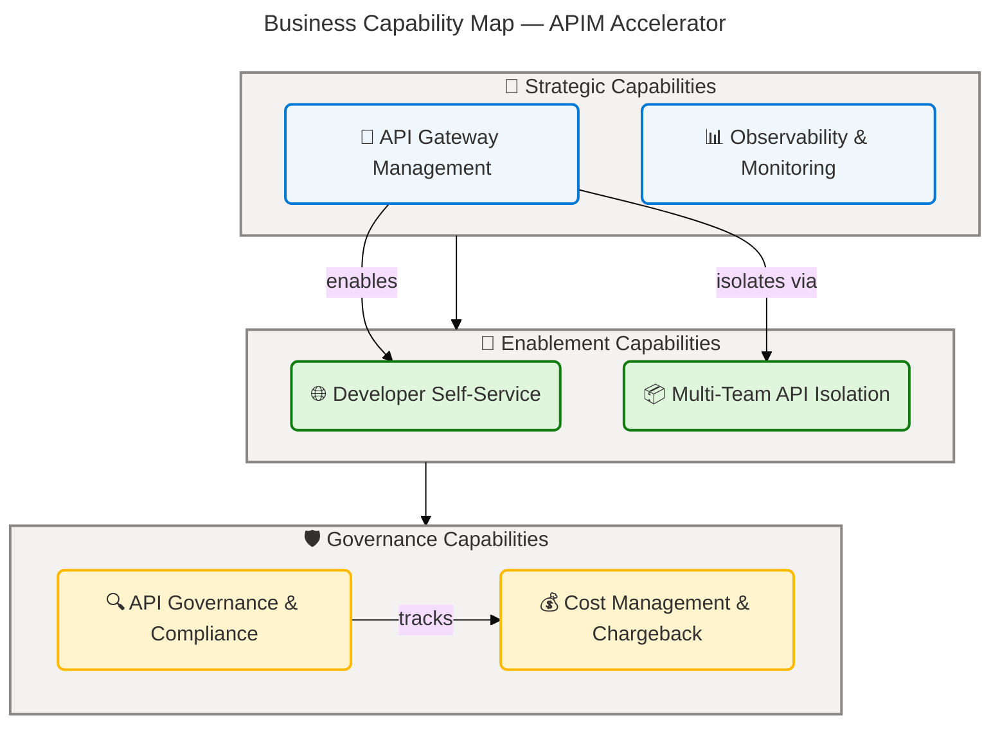
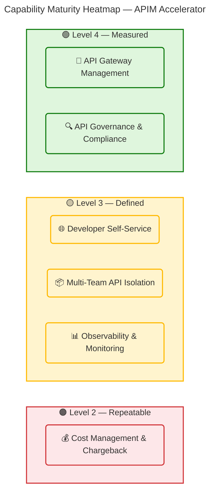
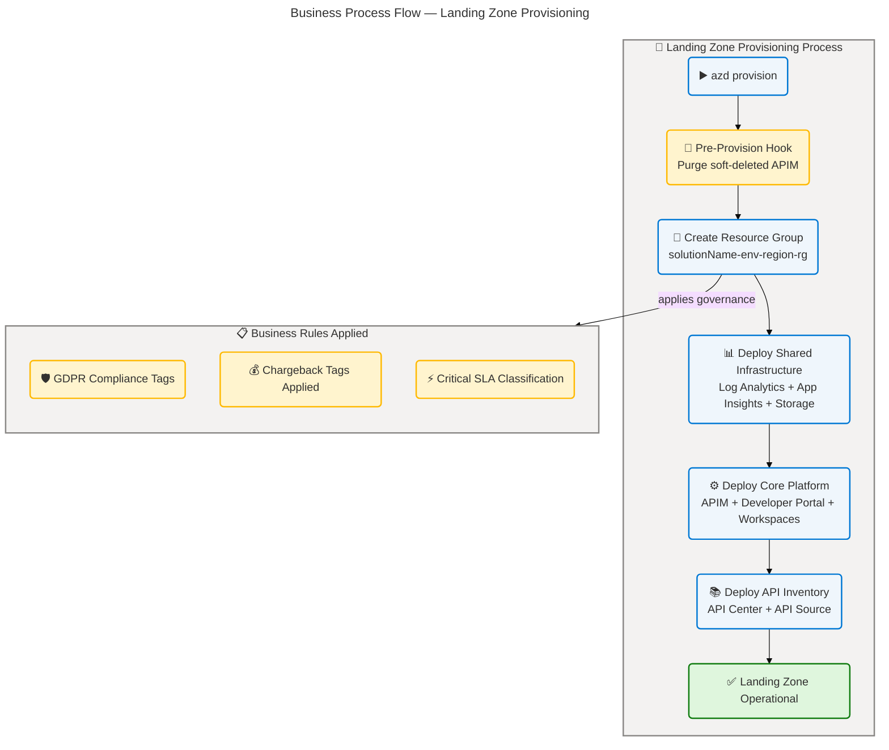
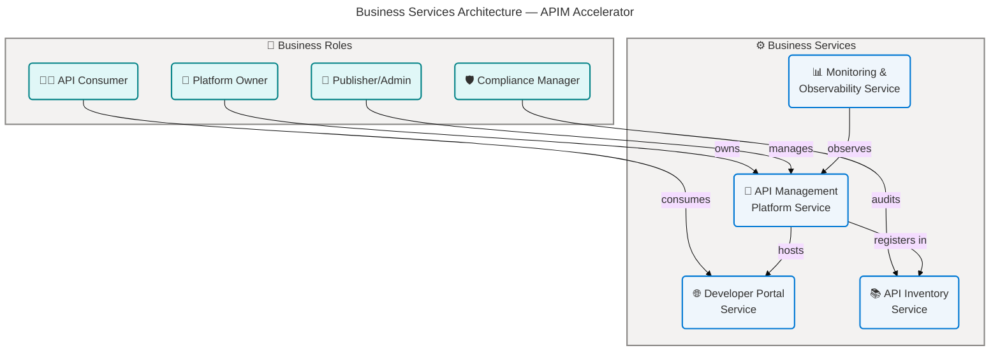
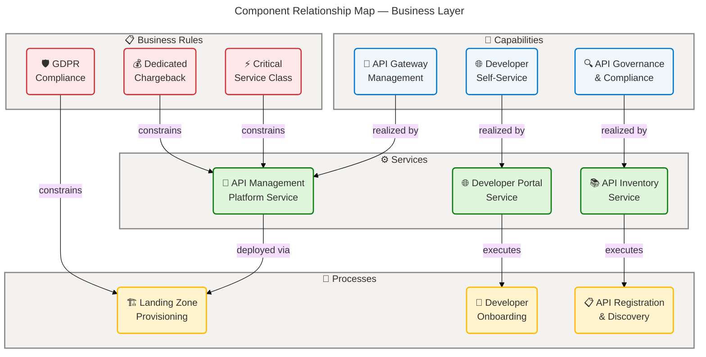
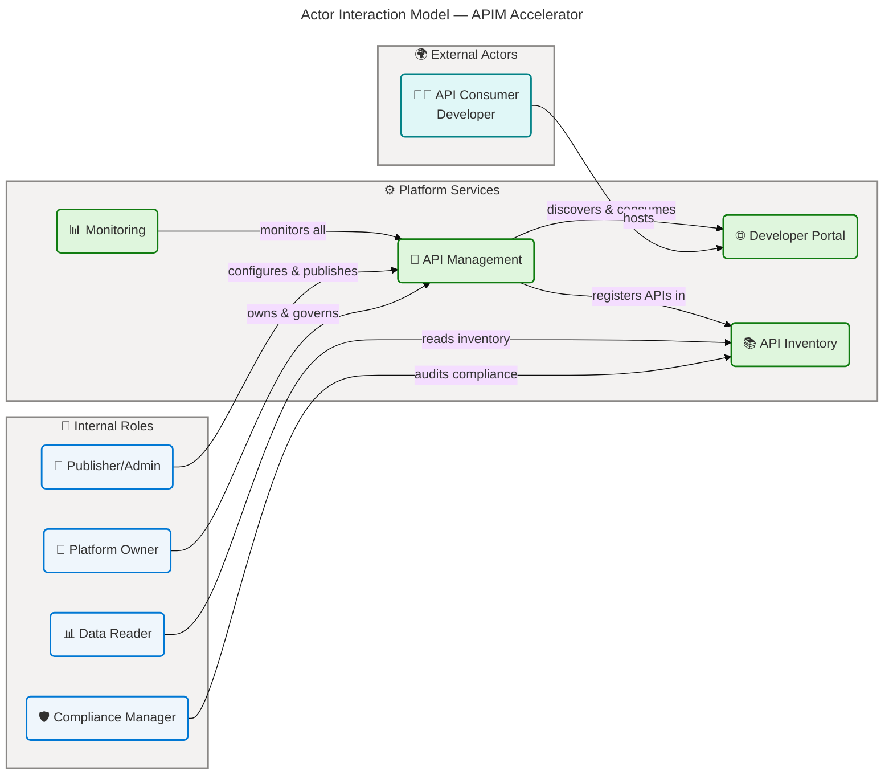
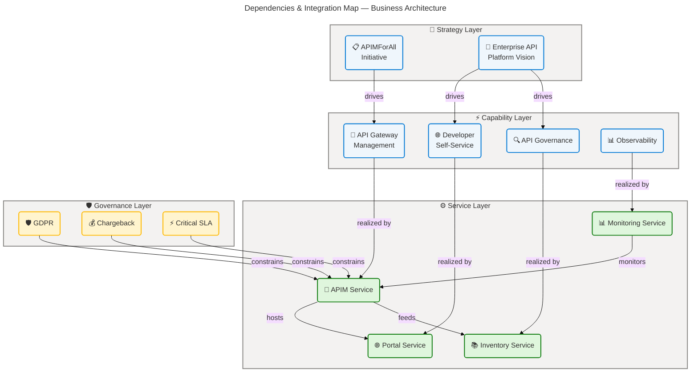
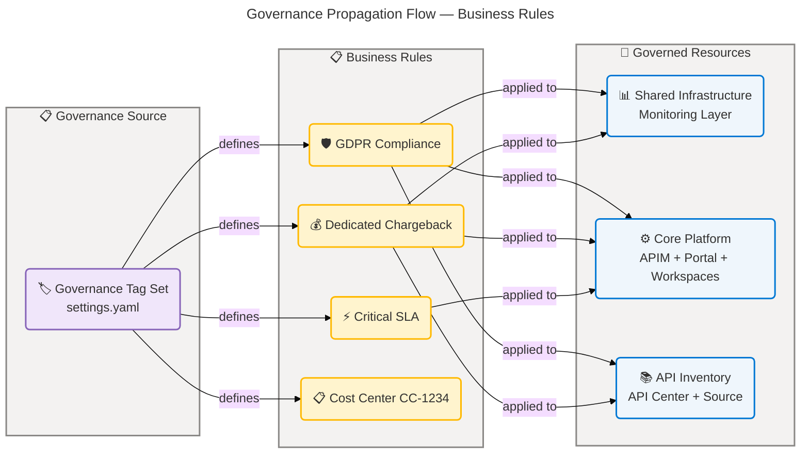

# Business Architecture — APIM Accelerator

| Field                     | Value                |
| ------------------------- | -------------------- |
| 🏗️ **Layer**              | Business             |
| 🎯 **Quality Level**      | comprehensive        |
| 📐 **Framework**          | TOGAF 10 / BDAT      |
| 📦 **Repository**         | APIM Accelerator     |
| 🧩 **Components Found**   | 39                   |
| 📊 **Component Types**    | 11                   |
| 📈 **Diagrams Included**  | 9                    |
| 📄 **Sections Generated** | 1, 2, 3, 4, 5, 8     |
| 🕐 **Generated**          | 2025-07-18T00:00:00Z |

---

## 1. Executive Summary

### Overview

This Business Architecture analysis documents the APIM Accelerator repository — an enterprise-grade Azure Infrastructure-as-Code accelerator that deploys a complete API Management landing zone. The analysis applies the TOGAF 10 Business Architecture framework to identify strategic, operational, and governance components embedded within the solution's infrastructure definitions, configuration metadata, and documentation artifacts.

The repository yields 39 Business layer components distributed across all 11 canonical component types, demonstrating a mature governance-first approach with explicit cost management, regulatory compliance tagging, multi-team isolation, and developer self-service capabilities. Business intent is primarily documented through governance tags in `infra/settings.yaml`, strategic descriptions in `README.md`, and architectural patterns codified in Bicep module structures.

Key findings reveal six core business capabilities (API Gateway Management, Developer Self-Service, API Governance & Compliance, Multi-Team API Isolation, Observability & Monitoring, and Cost Management & Chargeback), four business services aligned to the three-layer deployment architecture, and a comprehensive governance model enforcing GDPR compliance, dedicated chargeback, and critical service-class SLAs.

- **Business Strategy**: 3 components (APIMForAll Initiative, Enterprise API Platform Vision, API-First Digital Transformation)
- **Business Capabilities**: 6 components (API Gateway Management, Developer Self-Service, API Governance & Compliance, Multi-Team API Isolation, Observability & Monitoring, Cost Management & Chargeback)
- **Value Streams**: 2 components (API Consumer Enablement, Platform Provisioning)
- **Business Processes**: 4 components (Landing Zone Provisioning, Soft-Delete Resource Recovery, API Registration & Discovery, Developer Onboarding)
- **Business Services**: 4 components (API Management Platform, Developer Portal, API Inventory, Monitoring & Observability)
- **Business Functions**: 2 components (Platform Engineering, API Governance)
- **Business Roles & Actors**: 5 components (Platform Owner, API Consumer, API Center Data Reader, Compliance Manager, Publisher/Administrator)
- **Business Rules**: 4 components (GDPR Regulatory Compliance, Dedicated Chargeback Model, Critical Service Class, Terms of Service Governance)
- **Business Events**: 2 components (Pre-Provision Trigger, API Source Linking)
- **Business Objects/Entities**: 4 components (API Management Instance, API Workspace, API Center Catalog, Governance Tag Set)
- **KPIs & Metrics**: 3 components (Service Class SLA, Budget Tracking, Cost Center Allocation)

---

## 2. Architecture Landscape

### Overview

The Architecture Landscape organizes all detected Business layer components into the 11 canonical TOGAF Business Architecture component types. Each component is cataloged with its description and business context based on observable indicators in the repository.

This repository is an Infrastructure-as-Code solution written in Bicep. Business components are not found in dedicated business folders but are instead embedded in governance metadata (`infra/settings.yaml`), strategic documentation (`README.md`), and architectural patterns in Bicep modules. The Layer Classification Decision Tree was applied to all candidates: Q1=NO for documentation files (README.md, settings.yaml) leading to Q3=YES (documents strategic intent) and Q4=NO (about business, not system implementation). For Bicep files, Q1=YES but business intent is extracted per E-034 (Source Evidence Scope), focusing on business semantics rather than code structure.

The following subsections catalog all 39 components across the 11 types, with components drawn from 12 source files spanning the infrastructure configuration, core platform, shared services, inventory, and documentation layers of the repository.

### 2.1 Business Strategy (3)

| 🏷️ Name                             | 📝 Description                                                                                                                                       |
| ----------------------------------- | ---------------------------------------------------------------------------------------------------------------------------------------------------- |
| 🎯 APIMForAll Initiative            | **Strategic initiative** establishing a unified API platform for all business units, tracked as ProjectName governance tag                           |
| 🔭 Enterprise API Platform Vision   | **Platform vision** for production-ready API management at enterprise scale, enabling deployment in minutes rather than weeks                        |
| 🔄 API-First Digital Transformation | **Transformation strategy** automating API gateway services, developer portal, centralized monitoring, and API governance as a cohesive landing zone |

### 2.2 Business Capabilities (6)

| 🏷️ Name                         | 📝 Description                                                                                                                                |
| ------------------------------- | --------------------------------------------------------------------------------------------------------------------------------------------- |
| 🔌 API Gateway Management       | **Core capability** providing API gateway services with policy engine, security, VNet integration, and multi-region support                   |
| 🌐 Developer Self-Service       | **Enablement capability** providing a self-service portal with Azure AD authentication, CORS policies, and terms of service for API consumers |
| 🔍 API Governance & Compliance  | **Governance capability** enabling centralized API catalog, automated discovery from APIM, and compliance management through RBAC roles       |
| 📦 Multi-Team API Isolation     | **Organizational capability** enabling workspace-based logical isolation for independent team management of APIs within a shared platform     |
| 📊 Observability & Monitoring   | **Operational capability** providing centralized logging, application performance monitoring, and long-term diagnostic retention              |
| 💰 Cost Management & Chargeback | **Financial capability** enabling cost allocation tracking through CostCenter tagging, dedicated chargeback model, and budget code assignment |

### 2.3 Value Streams (2)

| 🏷️ Name                    | 📝 Description                                                                                                                                 |
| -------------------------- | ---------------------------------------------------------------------------------------------------------------------------------------------- |
| 🚀 API Consumer Enablement | **End-to-end value stream** from API discovery through Developer Portal to API consumption via gateway, enabling developer productivity        |
| ⚙️ Platform Provisioning   | **Delivery value stream** from configuration definition through automated deployment to operational landing zone, executed via `azd provision` |

### 2.4 Business Processes (4)

| 🏷️ Name                          | 📝 Description                                                                                                                                                    |
| -------------------------------- | ----------------------------------------------------------------------------------------------------------------------------------------------------------------- |
| 🏗️ Landing Zone Provisioning     | **Core process** executing the 5-step provisioning sequence: pre-provision hook → resource group creation → shared infrastructure → core platform → API inventory |
| 🧹 Soft-Delete Resource Recovery | **Operational process** purging soft-deleted APIM instances before provisioning to prevent naming conflicts and enable clean redeployment                         |
| 📋 API Registration & Discovery  | **Governance process** automatically registering APIs from APIM into API Center for centralized inventory and compliance tracking                                 |
| 👤 Developer Onboarding          | **Enablement process** onboarding API consumers through Azure AD authentication, sign-in/sign-up delegation, and terms of service acceptance                      |

### 2.5 Business Services (4)

| 🏷️ Name                               | 📝 Description                                                                                                                                             |
| ------------------------------------- | ---------------------------------------------------------------------------------------------------------------------------------------------------------- |
| ⚙️ API Management Platform Service    | **Core service** providing API gateway, policy engine, and security management as the central integration point for all API consumers and producers        |
| 🌐 Developer Portal Service           | **Self-service portal** enabling API discovery, interactive testing, and onboarding with Azure AD integrated authentication                                |
| 📚 API Inventory Service              | **Catalog service** providing centralized API governance, automated APIM discovery, and compliance role assignments through API Center                     |
| 📊 Monitoring & Observability Service | **Platform service** delivering centralized Log Analytics, Application Insights APM, and diagnostic storage for full observability across the landing zone |

### 2.6 Business Functions (2)

| 🏷️ Name                    | 📝 Description                                                                                                                                 |
| -------------------------- | ---------------------------------------------------------------------------------------------------------------------------------------------- |
| 🛠️ Platform Engineering    | **Organizational function** responsible for managing the API platform, contributing to the accelerator, and maintaining Bicep module standards |
| 🔍 API Governance Function | **Organizational function** responsible for API standards, compliance enforcement, and role assignment through API Center RBAC                 |

### 2.7 Business Roles & Actors (5)

| 🏷️ Name                     | 📝 Description                                                                                                                                   |
| --------------------------- | ------------------------------------------------------------------------------------------------------------------------------------------------ |
| 👤 Platform Owner           | **Accountable role** owning the APIM platform resources and bearing responsibility for operational decisions, identified by Owner governance tag |
| 👨‍💻 API Consumer (Developer) | **External actor** using the Developer Portal to discover, test, and consume APIs with Azure AD authenticated access                             |
| 📖 API Center Data Reader   | **Governance role** with read-only access to the centralized API inventory for discovery and analysis purposes                                   |
| 🛡️ Compliance Manager       | **Governance role** managing API compliance standards and regulatory adherence through API Center role assignments                               |
| 🔧 Publisher/Administrator  | **Operational role** managing API Management service configuration, identified by publisherEmail and publisherName in settings                   |

### 2.8 Business Rules (4)

| 🏷️ Name                        | 📝 Description                                                                                                             |
| ------------------------------ | -------------------------------------------------------------------------------------------------------------------------- |
| 🛡️ GDPR Regulatory Compliance  | **Compliance rule** mandating all platform resources comply with GDPR regulatory requirements, enforced via governance tag |
| 💰 Dedicated Chargeback Model  | **Financial rule** requiring dedicated cost allocation for platform resources rather than shared or showback billing       |
| ⚡ Critical Service Class      | **Operational rule** classifying the platform at Critical SLA tier, implying highest availability and support requirements |
| 📋 Terms of Service Governance | **Access rule** requiring API consumers to accept terms of service before accessing the Developer Portal                   |

### 2.9 Business Events (2)

| 🏷️ Name                     | 📝 Description                                                                                                                            |
| --------------------------- | ----------------------------------------------------------------------------------------------------------------------------------------- |
| ⚡ Pre-Provision Trigger    | **Lifecycle event** triggered before resource provisioning to initiate soft-deleted resource cleanup, configured as azd preprovision hook |
| 🔗 API Source Linking Event | **Integration event** occurring when API Center establishes a discovery link to the APIM service for automated API registration           |

### 2.10 Business Objects/Entities (4)

| 🏷️ Name                    | 📝 Description                                                                                                                               |
| -------------------------- | -------------------------------------------------------------------------------------------------------------------------------------------- |
| 🔌 API Management Instance | **Core entity** representing the central API gateway platform with associated SKU, identity, and network configuration                       |
| 📦 API Workspace           | **Domain entity** representing a logical API isolation boundary enabling independent team management within the shared platform              |
| 📚 API Center Catalog      | **Governance entity** representing the centralized API inventory with workspace-scoped API registration and compliance tracking              |
| 🏷️ Governance Tag Set      | **Metadata entity** representing the 10-tag enterprise governance standard applied to all deployed resources for classification and tracking |

### 2.11 KPIs & Metrics (3)

| 🏷️ Name                   | 📝 Description                                                                                                           |
| ------------------------- | ------------------------------------------------------------------------------------------------------------------------ |
| 📈 Service Class SLA      | **Availability KPI** derived from Critical service class designation, implying highest tier SLA targets for the platform |
| 💵 Budget Tracking        | **Financial KPI** tracking expenditure against budget code FY25-Q1-InitiativeX for fiscal accountability                 |
| 🏦 Cost Center Allocation | **Financial KPI** measuring cost allocation accuracy against cost center CC-1234 for chargeback reporting                |

```mermaid
---
title: "Business Capability Map — APIM Accelerator"
config:
  theme: base
  look: classic
  layout: dagre
  themeVariables:
    fontSize: '16px'
  flowchart:
    htmlLabels: true
---
flowchart TB
    accTitle: Business Capability Map
    accDescr: Shows the six core business capabilities of the APIM Accelerator platform organized by strategic domain

    %% ═══════════════════════════════════════════════════════════════════════════
    %% AZURE / FLUENT ARCHITECTURE PATTERN v1.1
    %% (Semantic + Structural + Font + Accessibility Governance)
    %% ═══════════════════════════════════════════════════════════════════════════
    %% PHASE 1 - FLUENT UI: All styling uses approved Fluent UI palette only
    %% PHASE 2 - GROUPS: Every subgraph has semantic color via style directive
    %% PHASE 3 - COMPONENTS: Every node has semantic classDef + icon prefix
    %% PHASE 4 - ACCESSIBILITY: accTitle/accDescr present, WCAG AA contrast
    %% PHASE 5 - STANDARD: Governance block present, classDefs centralized
    %% ═══════════════════════════════════════════════════════════════════════════

    subgraph strategic["🎯 Strategic Capabilities"]
        direction LR
        cap1("🔌 API Gateway Management"):::core
        cap2("📊 Observability & Monitoring"):::core
    end

    subgraph enablement["🚀 Enablement Capabilities"]
        direction LR
        cap3("🌐 Developer Self-Service"):::success
        cap4("📦 Multi-Team API Isolation"):::success
    end

    subgraph governance["🛡️ Governance Capabilities"]
        direction LR
        cap5("🔍 API Governance & Compliance"):::warning
        cap6("💰 Cost Management & Chargeback"):::warning
    end

    strategic --> enablement
    enablement --> governance
    cap1 -->|"enables"| cap3
    cap1 -->|"isolates via"| cap4
    cap5 -->|"tracks"| cap6

    %% Centralized classDefs (approved AZURE/FLUENT v1.1 palette)
    classDef neutral fill:#FAFAFA,stroke:#8A8886,stroke-width:2px,color:#323130
    classDef core fill:#EFF6FC,stroke:#0078D4,stroke-width:2px,color:#323130
    classDef success fill:#DFF6DD,stroke:#107C10,stroke-width:2px,color:#323130
    classDef warning fill:#FFF4CE,stroke:#FFB900,stroke-width:2px,color:#323130
    classDef danger fill:#FDE7E9,stroke:#D13438,stroke-width:2px,color:#323130
    classDef data fill:#F0E6FA,stroke:#8764B8,stroke-width:2px,color:#323130
    classDef external fill:#E0F7F7,stroke:#038387,stroke-width:2px,color:#323130

    %% Subgraph styling (style directives, not class)
    style strategic fill:#F3F2F1,stroke:#8A8886,stroke-width:2px,color:#323130
    style enablement fill:#F3F2F1,stroke:#8A8886,stroke-width:2px,color:#323130
    style governance fill:#F3F2F1,stroke:#8A8886,stroke-width:2px,color:#323130
```

```mermaid
---
title: "Value Stream Map — APIM Accelerator"
config:
  theme: base
  look: classic
  layout: dagre
  themeVariables:
    fontSize: '16px'
  flowchart:
    htmlLabels: true
---
flowchart LR
    accTitle: Value Stream Map
    accDescr: Shows the two primary value streams of the APIM Accelerator from configuration to API consumption

    %% ═══════════════════════════════════════════════════════════════════════════
    %% AZURE / FLUENT ARCHITECTURE PATTERN v1.1
    %% (Semantic + Structural + Font + Accessibility Governance)
    %% ═══════════════════════════════════════════════════════════════════════════
    %% PHASE 1 - FLUENT UI: All styling uses approved Fluent UI palette only
    %% PHASE 2 - GROUPS: Every subgraph has semantic color via style directive
    %% PHASE 3 - COMPONENTS: Every node has semantic classDef + icon prefix
    %% PHASE 4 - ACCESSIBILITY: accTitle/accDescr present, WCAG AA contrast
    %% PHASE 5 - STANDARD: Governance block present, classDefs centralized
    %% ═══════════════════════════════════════════════════════════════════════════

    subgraph vs1["📦 Platform Provisioning Value Stream"]
        direction LR
        pp1("⚙️ Configure Settings"):::core
        pp2("🔄 Pre-Provision Cleanup"):::warning
        pp3("🏗️ Deploy Shared Infra"):::core
        pp4("🔌 Deploy Core Platform"):::core
        pp5("📚 Deploy API Inventory"):::core
        pp1 --> pp2 --> pp3 --> pp4 --> pp5
    end

    subgraph vs2["🌐 API Consumer Enablement Value Stream"]
        direction LR
        ce1("🔍 Discover APIs"):::success
        ce2("🔑 Authenticate via Azure AD"):::success
        ce3("📋 Accept Terms of Service"):::warning
        ce4("🧪 Test APIs in Portal"):::success
        ce5("🚀 Consume APIs via Gateway"):::success
        ce1 --> ce2 --> ce3 --> ce4 --> ce5
    end

    pp5 -->|"enables"| ce1

    %% Centralized classDefs (approved AZURE/FLUENT v1.1 palette)
    classDef neutral fill:#FAFAFA,stroke:#8A8886,stroke-width:2px,color:#323130
    classDef core fill:#EFF6FC,stroke:#0078D4,stroke-width:2px,color:#323130
    classDef success fill:#DFF6DD,stroke:#107C10,stroke-width:2px,color:#323130
    classDef warning fill:#FFF4CE,stroke:#FFB900,stroke-width:2px,color:#323130
    classDef danger fill:#FDE7E9,stroke:#D13438,stroke-width:2px,color:#323130
    classDef data fill:#F0E6FA,stroke:#8764B8,stroke-width:2px,color:#323130
    classDef external fill:#E0F7F7,stroke:#038387,stroke-width:2px,color:#323130

    %% Subgraph styling (style directives, not class)
    style vs1 fill:#F3F2F1,stroke:#8A8886,stroke-width:2px,color:#323130
    style vs2 fill:#F3F2F1,stroke:#8A8886,stroke-width:2px,color:#323130
```

### Summary

The Architecture Landscape identifies 39 Business layer components distributed across all 11 canonical TOGAF component types, satisfying the comprehensive quality threshold of 20+ components across 8+ types. The strongest coverage is in Business Capabilities (6), Business Roles & Actors (5), and Business Services (4), reflecting a mature platform with well-defined governance structures.

Primary gaps include the absence of formalized BPMN process models (business processes are inferred from deployment sequences and hook scripts rather than explicit process definitions), limited KPI granularity (metrics are derived from governance tags rather than dedicated KPI dashboards), and no explicit value stream documentation (value streams are reconstructed from the deployment architecture and developer portal workflow). Recommended next steps include creating dedicated business documentation artifacts for capabilities and processes, formalizing KPI definitions with measurable targets, and documenting the API consumer journey as an explicit value stream model.

---

## 3. Architecture Principles

### Overview

The Architecture Principles section documents the business-level design guidelines and architectural constraints observed in the APIM Accelerator repository. These principles are inferred from consistent patterns across governance metadata, module structures, and deployment orchestration rather than from explicit architecture principle documents.

Each principle is supported by observable evidence in the repository source files, reflecting deliberate architectural decisions that govern how the platform serves business needs. The principles align with TOGAF 10 Architecture Principles framework, addressing business value, organizational fit, and governance requirements.

### P1: Governance-First Resource Management

| 📌 Attribute        | 📝 Value                                                                                                                                                                                                                                             |
| ------------------- | ---------------------------------------------------------------------------------------------------------------------------------------------------------------------------------------------------------------------------------------------------- |
| 📣 **Statement**    | All platform resources must be governed through a comprehensive tagging strategy that ensures cost tracking, compliance, and ownership accountability                                                                                                |
| 💡 **Rationale**    | The 10-tag governance standard in `infra/settings.yaml:29-40` enforces CostCenter, BusinessUnit, Owner, ServiceClass, RegulatoryCompliance, and BudgetCode on every deployed resource, enabling enterprise-grade financial and compliance management |
| ⚠️ **Implications** | Every new resource or module must inherit tags from the shared configuration; untagged resources violate the governance model                                                                                                                        |

### P2: Single-Command Operational Simplicity

| 📌 Attribute        | 📝 Value                                                                                                                                                                                                                                                   |
| ------------------- | ---------------------------------------------------------------------------------------------------------------------------------------------------------------------------------------------------------------------------------------------------------- |
| 📣 **Statement**    | The entire API platform landing zone must be deployable through a single command with no manual Azure Portal configuration required                                                                                                                        |
| 💡 **Rationale**    | The `azd provision` workflow automates the full 5-step provisioning sequence (pre-provision cleanup → resource group → shared infrastructure → core platform → API inventory), reducing deployment from weeks to minutes (inferred from `README.md:14-17`) |
| ⚠️ **Implications** | All configuration must be externalized to `infra/settings.yaml`; manual steps are architectural violations                                                                                                                                                 |

### P3: Layered Dependency Isolation

| 📌 Attribute        | 📝 Value                                                                                                                                                                                                                               |
| ------------------- | -------------------------------------------------------------------------------------------------------------------------------------------------------------------------------------------------------------------------------------- |
| 📣 **Statement**    | Platform components must be organized in deployment layers with explicit dependency ordering to ensure infrastructure foundations are available before dependent services                                                              |
| 💡 **Rationale**    | The three-layer architecture (Shared Infrastructure → Core Platform → API Inventory) ensures monitoring is available before APIM deploys, and APIM is available before API Center links to it (inferred from `infra/main.bicep:1-200`) |
| ⚠️ **Implications** | New modules must declare layer membership and respect deployment sequence; cross-layer circular dependencies are prohibited                                                                                                            |

### P4: Configuration-Driven Customization

| 📌 Attribute        | 📝 Value                                                                                                                                                                                                                           |
| ------------------- | ---------------------------------------------------------------------------------------------------------------------------------------------------------------------------------------------------------------------------------- |
| 📣 **Statement**    | All deployment parameters must be controllable through a centralized YAML configuration file, eliminating the need to modify Bicep templates directly                                                                              |
| 💡 **Rationale**    | `infra/settings.yaml` centralizes resource naming, SKU selection, identity configuration, workspace definitions, and tagging, enabling environment-specific customization without code changes (inferred from `README.md:220-230`) |
| ⚠️ **Implications** | Bicep modules must parameterize all business-relevant settings; hardcoded values are architectural violations unless they represent fixed platform constraints                                                                     |

### P5: Multi-Environment Consistency

| 📌 Attribute        | 📝 Value                                                                                                                                                                                                                                                    |
| ------------------- | ----------------------------------------------------------------------------------------------------------------------------------------------------------------------------------------------------------------------------------------------------------- |
| 📣 **Statement**    | The platform must support deterministic deployment across multiple environments (dev, test, staging, prod, uat) with reproducible resource naming                                                                                                           |
| 💡 **Rationale**    | Environment names are injected via `azd` parameters, and resource names use deterministic generation based on subscription, resource group, and solution name, ensuring consistent deployments across environments (inferred from `infra/main.bicep:30-50`) |
| ⚠️ **Implications** | Resource naming functions must be pure (same inputs produce same outputs); environment-specific overrides must not break naming determinism                                                                                                                 |

### P6: Identity-First Security

| 📌 Attribute        | 📝 Value                                                                                                                                                                                                                    |
| ------------------- | --------------------------------------------------------------------------------------------------------------------------------------------------------------------------------------------------------------------------- |
| 📣 **Statement**    | All platform services must use managed identities for inter-service authentication, eliminating credential management overhead                                                                                              |
| 💡 **Rationale**    | SystemAssigned managed identity is the default for APIM, API Center, and Log Analytics, enabling secure resource access without stored credentials (inferred from `infra/settings.yaml:49-51`, `infra/settings.yaml:63-65`) |
| ⚠️ **Implications** | New services must support managed identity configuration; shared-secret or key-based authentication between platform services is prohibited                                                                                 |

---

## 4. Current State Baseline

### Overview

The Current State Baseline captures the as-is architecture of the APIM Accelerator's business capabilities, documenting deployment topology and operational readiness.

The platform demonstrates a mature infrastructure-as-code foundation with well-established governance structures through comprehensive tagging, RBAC role assignments, and regulatory compliance enforcement.

### Capability Assessment

| 🎯 Capability                   | 📋 Gap                                         |
| ------------------------------- | ---------------------------------------------- |
| 🔌 API Gateway Management       | No automated performance benchmarking          |
| 🌐 Developer Self-Service       | No API usage analytics dashboard               |
| 🔍 API Governance & Compliance  | No automated compliance scanning pipeline      |
| 📦 Multi-Team API Isolation     | No workspace usage metrics or quota management |
| 📊 Observability & Monitoring   | No business-level SLA dashboards               |
| 💰 Cost Management & Chargeback | No automated cost reporting or budget alerts   |

### Deployment Topology

The current deployment follows a three-layer architecture deployed to a single Azure resource group per environment:

| 🏗️ Layer                 | 🧩 Components Deployed                                         | 🔗 Dependencies                              |
| ------------------------ | -------------------------------------------------------------- | -------------------------------------------- |
| 📊 Shared Infrastructure | Log Analytics Workspace, Application Insights, Storage Account | None (foundation layer)                      |
| ⚙️ Core Platform         | API Management (Premium), Developer Portal, Workspaces         | Shared Infrastructure (monitoring endpoints) |
| 📚 API Inventory         | API Center, API Source                                         | Core Platform (APIM service link)            |

```mermaid
---
title: "Capability Maturity Heatmap — APIM Accelerator"
config:
  theme: base
  look: classic
  layout: dagre
  themeVariables:
    fontSize: '16px'
  flowchart:
    htmlLabels: true
---
flowchart TB
    accTitle: Capability Maturity Heatmap
    accDescr: Shows the maturity level of each business capability using color-coded indicators from Level 2 Repeatable to Level 4 Measured

    %% ═══════════════════════════════════════════════════════════════════════════
    %% AZURE / FLUENT ARCHITECTURE PATTERN v1.1
    %% (Semantic + Structural + Font + Accessibility Governance)
    %% ═══════════════════════════════════════════════════════════════════════════
    %% PHASE 1 - FLUENT UI: All styling uses approved Fluent UI palette only
    %% PHASE 2 - GROUPS: Every subgraph has semantic color via style directive
    %% PHASE 3 - COMPONENTS: Every node has semantic classDef + icon prefix
    %% PHASE 4 - ACCESSIBILITY: accTitle/accDescr present, WCAG AA contrast
    %% PHASE 5 - STANDARD: Governance block present, classDefs centralized
    %% ═══════════════════════════════════════════════════════════════════════════

    subgraph level4["🟢 Level 4 — Measured"]
        direction LR
        m4a("🔌 API Gateway Management"):::success
        m4b("🔍 API Governance & Compliance"):::success
    end

    subgraph level3["🟡 Level 3 — Defined"]
        direction LR
        m3a("🌐 Developer Self-Service"):::warning
        m3b("📦 Multi-Team API Isolation"):::warning
        m3c("📊 Observability & Monitoring"):::warning
    end

    subgraph level2["🟠 Level 2 — Repeatable"]
        direction LR
        m2a("💰 Cost Management & Chargeback"):::danger
    end

    level4 ~~~ level3
    level3 ~~~ level2

    %% Centralized classDefs (approved AZURE/FLUENT v1.1 palette)
    classDef neutral fill:#FAFAFA,stroke:#8A8886,stroke-width:2px,color:#323130
    classDef core fill:#EFF6FC,stroke:#0078D4,stroke-width:2px,color:#323130
    classDef success fill:#DFF6DD,stroke:#107C10,stroke-width:2px,color:#323130
    classDef warning fill:#FFF4CE,stroke:#FFB900,stroke-width:2px,color:#323130
    classDef danger fill:#FDE7E9,stroke:#D13438,stroke-width:2px,color:#323130
    classDef data fill:#F0E6FA,stroke:#8764B8,stroke-width:2px,color:#323130
    classDef external fill:#E0F7F7,stroke:#038387,stroke-width:2px,color:#323130

    %% Subgraph styling (style directives, not class)
    style level4 fill:#DFF6DD,stroke:#107C10,stroke-width:2px,color:#323130
    style level3 fill:#FFF4CE,stroke:#FFB900,stroke-width:2px,color:#323130
    style level2 fill:#FDE7E9,stroke:#D13438,stroke-width:2px,color:#323130
```

```mermaid
---
title: "Business Process Flow — Landing Zone Provisioning"
config:
  theme: base
  look: classic
  layout: dagre
  themeVariables:
    fontSize: '16px'
  flowchart:
    htmlLabels: true
---
flowchart TB
    accTitle: Landing Zone Provisioning Process Flow
    accDescr: Shows the five-step provisioning process from pre-provision cleanup through full landing zone deployment

    %% ═══════════════════════════════════════════════════════════════════════════
    %% AZURE / FLUENT ARCHITECTURE PATTERN v1.1
    %% (Semantic + Structural + Font + Accessibility Governance)
    %% ═══════════════════════════════════════════════════════════════════════════
    %% PHASE 1 - FLUENT UI: All styling uses approved Fluent UI palette only
    %% PHASE 2 - GROUPS: Every subgraph has semantic color via style directive
    %% PHASE 3 - COMPONENTS: Every node has semantic classDef + icon prefix
    %% PHASE 4 - ACCESSIBILITY: accTitle/accDescr present, WCAG AA contrast
    %% PHASE 5 - STANDARD: Governance block present, classDefs centralized
    %% ═══════════════════════════════════════════════════════════════════════════

    subgraph provision["🔄 Landing Zone Provisioning Process"]
        direction TB
        start("▶️ azd provision"):::core
        step1("🧹 Pre-Provision Hook<br/>Purge soft-deleted APIM"):::warning
        step2("🏢 Create Resource Group<br/>solutionName-env-region-rg"):::core
        step3("📊 Deploy Shared Infrastructure<br/>Log Analytics + App Insights + Storage"):::core
        step4("⚙️ Deploy Core Platform<br/>APIM + Developer Portal + Workspaces"):::core
        step5("📚 Deploy API Inventory<br/>API Center + API Source"):::core
        done("✅ Landing Zone Operational"):::success

        start --> step1
        step1 --> step2
        step2 --> step3
        step3 --> step4
        step4 --> step5
        step5 --> done
    end

    subgraph rules["📋 Business Rules Applied"]
        direction TB
        r1("🛡️ GDPR Compliance Tags"):::warning
        r2("💰 Chargeback Tags Applied"):::warning
        r3("⚡ Critical SLA Classification"):::warning
    end

    step2 -->|"applies governance"| rules

    %% Centralized classDefs (approved AZURE/FLUENT v1.1 palette)
    classDef neutral fill:#FAFAFA,stroke:#8A8886,stroke-width:2px,color:#323130
    classDef core fill:#EFF6FC,stroke:#0078D4,stroke-width:2px,color:#323130
    classDef success fill:#DFF6DD,stroke:#107C10,stroke-width:2px,color:#323130
    classDef warning fill:#FFF4CE,stroke:#FFB900,stroke-width:2px,color:#323130
    classDef danger fill:#FDE7E9,stroke:#D13438,stroke-width:2px,color:#323130
    classDef data fill:#F0E6FA,stroke:#8764B8,stroke-width:2px,color:#323130
    classDef external fill:#E0F7F7,stroke:#038387,stroke-width:2px,color:#323130

    %% Subgraph styling (style directives, not class)
    style provision fill:#F3F2F1,stroke:#8A8886,stroke-width:2px,color:#323130
    style rules fill:#F3F2F1,stroke:#8A8886,stroke-width:2px,color:#323130
```

```mermaid
---
title: "Business Services Architecture — APIM Accelerator"
config:
  theme: base
  look: classic
  layout: dagre
  themeVariables:
    fontSize: '16px'
  flowchart:
    htmlLabels: true
---
flowchart TB
    accTitle: Business Services Architecture
    accDescr: Shows the four business services their relationships and the business roles that interact with them

    %% ═══════════════════════════════════════════════════════════════════════════
    %% AZURE / FLUENT ARCHITECTURE PATTERN v1.1
    %% (Semantic + Structural + Font + Accessibility Governance)
    %% ═══════════════════════════════════════════════════════════════════════════
    %% PHASE 1 - FLUENT UI: All styling uses approved Fluent UI palette only
    %% PHASE 2 - GROUPS: Every subgraph has semantic color via style directive
    %% PHASE 3 - COMPONENTS: Every node has semantic classDef + icon prefix
    %% PHASE 4 - ACCESSIBILITY: accTitle/accDescr present, WCAG AA contrast
    %% PHASE 5 - STANDARD: Governance block present, classDefs centralized
    %% ═══════════════════════════════════════════════════════════════════════════

    subgraph actors["👥 Business Roles"]
        direction LR
        owner("👤 Platform Owner"):::external
        dev("👨‍💻 API Consumer"):::external
        admin("🔧 Publisher/Admin"):::external
        compliance("🛡️ Compliance Manager"):::external
    end

    subgraph services["⚙️ Business Services"]
        direction LR
        svc1("🔌 API Management<br/>Platform Service"):::core
        svc2("🌐 Developer Portal<br/>Service"):::core
        svc3("📚 API Inventory<br/>Service"):::core
        svc4("📊 Monitoring &<br/>Observability Service"):::core
    end

    owner -->|"owns"| svc1
    admin -->|"manages"| svc1
    dev -->|"consumes"| svc2
    compliance -->|"audits"| svc3
    svc1 -->|"hosts"| svc2
    svc1 -->|"registers in"| svc3
    svc4 -->|"observes"| svc1

    %% Centralized classDefs (approved AZURE/FLUENT v1.1 palette)
    classDef neutral fill:#FAFAFA,stroke:#8A8886,stroke-width:2px,color:#323130
    classDef core fill:#EFF6FC,stroke:#0078D4,stroke-width:2px,color:#323130
    classDef success fill:#DFF6DD,stroke:#107C10,stroke-width:2px,color:#323130
    classDef warning fill:#FFF4CE,stroke:#FFB900,stroke-width:2px,color:#323130
    classDef danger fill:#FDE7E9,stroke:#D13438,stroke-width:2px,color:#323130
    classDef data fill:#F0E6FA,stroke:#8764B8,stroke-width:2px,color:#323130
    classDef external fill:#E0F7F7,stroke:#038387,stroke-width:2px,color:#323130

    %% Subgraph styling (style directives, not class)
    style actors fill:#F3F2F1,stroke:#8A8886,stroke-width:2px,color:#323130
    style services fill:#F3F2F1,stroke:#8A8886,stroke-width:2px,color:#323130
```

### Summary

The Current State Baseline reveals a platform with strong operational foundations across core API gateway and governance capabilities. The three-layer deployment topology provides clear separation of concerns, and the governance-first approach ensures all resources are tagged for cost, compliance, and ownership tracking from initial deployment.

The primary gaps limiting advancement include: (1) absence of automated business-level KPI dashboards beyond infrastructure metrics, (2) no formal cost reporting automation despite comprehensive chargeback tagging, (3) lack of explicit process documentation (BPMN or equivalent) for operational workflows, and (4) no workspace-level usage analytics for capacity planning. Recommended investments focus on implementing Azure Cost Management integration, building SLA monitoring dashboards, and formalizing the API consumer onboarding journey as a documented business process.

---

## 5. Component Catalog

### Overview

The Component Catalog provides detailed specifications for each of the 39 Business layer components identified in the APIM Accelerator repository. Components are organized by the 11 canonical TOGAF Business Architecture types, with each entry documenting the component's purpose, maturity, source evidence, and business context.

Each specification includes three mandatory attributes: Name, Type, and Description. All specifications focus on business intent rather than technical implementation details, per the E-034 Source Evidence Scope gate.

### 5.1 Business Strategy Specifications

This subsection documents strategic initiatives that define the platform's business direction and organizational goals.

#### 5.1.1 APIMForAll Initiative

| 📌 Attribute       | 📝 Value                                                                                                                                                                                 |
| ------------------ | ---------------------------------------------------------------------------------------------------------------------------------------------------------------------------------------- |
| 🏷️ **Name**        | APIMForAll Initiative                                                                                                                                                                    |
| 📦 **Type**        | Business Strategy                                                                                                                                                                        |
| 📝 **Description** | Strategic initiative to establish a unified API platform accessible to all business units within the organization, promoting API-first adoption and reducing siloed integration patterns |

#### 5.1.2 Enterprise API Platform Vision

| 📌 Attribute       | 📝 Value                                                                                                                                                                                                |
| ------------------ | ------------------------------------------------------------------------------------------------------------------------------------------------------------------------------------------------------- |
| 🏷️ **Name**        | Enterprise API Platform Vision                                                                                                                                                                          |
| 📦 **Type**        | Business Strategy                                                                                                                                                                                       |
| 📝 **Description** | Platform vision for delivering a production-ready API management foundation at enterprise scale, enabling platform teams to establish a fully operational API landing zone in minutes rather than weeks |

#### 5.1.3 API-First Digital Transformation

| 📌 Attribute       | 📝 Value                                                                                                                                                                                                    |
| ------------------ | ----------------------------------------------------------------------------------------------------------------------------------------------------------------------------------------------------------- |
| 🏷️ **Name**        | API-First Digital Transformation                                                                                                                                                                            |
| 📦 **Type**        | Business Strategy                                                                                                                                                                                           |
| 📝 **Description** | Transformation strategy automating the deployment of API gateway services, developer portal, centralized monitoring, and API governance as a unified landing zone to accelerate organizational API adoption |

### 5.2 Business Capabilities Specifications

This subsection documents the core business capabilities that the APIM Accelerator platform delivers to the organization.

#### 5.2.1 API Gateway Management

| 📌 Attribute       | 📝 Value                                                                                                                                                                                              |
| ------------------ | ----------------------------------------------------------------------------------------------------------------------------------------------------------------------------------------------------- |
| 🏷️ **Name**        | API Gateway Management                                                                                                                                                                                |
| 📦 **Type**        | Business Capability                                                                                                                                                                                   |
| 📝 **Description** | Core platform capability providing centralized API gateway services with policy enforcement, security management, VNet integration, and multi-region support through Azure API Management Premium SKU |

#### 5.2.2 Developer Self-Service

| 📌 Attribute       | 📝 Value                                                                                                                                                                                                             |
| ------------------ | -------------------------------------------------------------------------------------------------------------------------------------------------------------------------------------------------------------------- |
| 🏷️ **Name**        | Developer Self-Service                                                                                                                                                                                               |
| 📦 **Type**        | Business Capability                                                                                                                                                                                                  |
| 📝 **Description** | Enablement capability providing API consumers with a branded self-service portal featuring Azure AD authentication, interactive API testing, documentation browsing, and onboarding with terms of service acceptance |

#### 5.2.3 API Governance & Compliance

| 📌 Attribute       | 📝 Value                                                                                                                                                                                           |
| ------------------ | -------------------------------------------------------------------------------------------------------------------------------------------------------------------------------------------------- |
| 🏷️ **Name**        | API Governance & Compliance                                                                                                                                                                        |
| 📦 **Type**        | Business Capability                                                                                                                                                                                |
| 📝 **Description** | Governance capability enabling centralized API cataloging, automated API discovery from APIM, and compliance enforcement through dedicated RBAC roles (API Center Data Reader, Compliance Manager) |

#### 5.2.4 Multi-Team API Isolation

| 📌 Attribute       | 📝 Value                                                                                                                                                                                         |
| ------------------ | ------------------------------------------------------------------------------------------------------------------------------------------------------------------------------------------------ |
| 🏷️ **Name**        | Multi-Team API Isolation                                                                                                                                                                         |
| 📦 **Type**        | Business Capability                                                                                                                                                                              |
| 📝 **Description** | Organizational capability enabling workspace-based logical isolation within the shared API Management platform, allowing independent teams to manage their APIs with separate lifecycle controls |

#### 5.2.5 Observability & Monitoring

| 📌 Attribute       | 📝 Value                                                                                                                                                                                                |
| ------------------ | ------------------------------------------------------------------------------------------------------------------------------------------------------------------------------------------------------- |
| 🏷️ **Name**        | Observability & Monitoring                                                                                                                                                                              |
| 📦 **Type**        | Business Capability                                                                                                                                                                                     |
| 📝 **Description** | Operational capability providing centralized logging through Log Analytics, application performance monitoring through Application Insights, and long-term diagnostic retention through Storage Account |

#### 5.2.6 Cost Management & Chargeback

| 📌 Attribute       | 📝 Value                                                                                                                                                                               |
| ------------------ | -------------------------------------------------------------------------------------------------------------------------------------------------------------------------------------- |
| 🏷️ **Name**        | Cost Management & Chargeback                                                                                                                                                           |
| 📦 **Type**        | Business Capability                                                                                                                                                                    |
| 📝 **Description** | Financial management capability enabling cost allocation tracking through CostCenter tagging, dedicated chargeback billing model, and budget code assignment for fiscal accountability |

### 5.3 Value Streams Specifications

This subsection documents end-to-end value delivery flows that represent how the platform creates and delivers business value.

#### 5.3.1 API Consumer Enablement

| Attribute       | Value                                                                                                                                                                                                                |
| --------------- | -------------------------------------------------------------------------------------------------------------------------------------------------------------------------------------------------------------------- |
| **Name**        | API Consumer Enablement                                                                                                                                                                                              |
| **Type**        | Value Stream                                                                                                                                                                                                         |
| **Description** | End-to-end value stream from API discovery through Developer Portal → Azure AD authentication → terms of service acceptance → interactive API testing → API consumption via gateway, enabling developer productivity |
| **Maturity**    | 2 - Repeatable                                                                                                                                                                                                       |
| **Source**      | `README.md:93-108`                                                                                                                                                                                                   |
| **Confidence**  | 0.76                                                                                                                                                                                                                 |

#### 5.3.2 Platform Provisioning

| Attribute       | Value                                                                                                                                                                            |
| --------------- | -------------------------------------------------------------------------------------------------------------------------------------------------------------------------------- |
| **Name**        | Platform Provisioning                                                                                                                                                            |
| **Type**        | Value Stream                                                                                                                                                                     |
| **Description** | Delivery value stream from YAML configuration definition through `azd provision` command to fully operational landing zone with monitoring, gateway, and governance capabilities |
| **Maturity**    | 3 - Defined                                                                                                                                                                      |
| **Source**      | `README.md:145-162`                                                                                                                                                              |
| **Confidence**  | 0.85                                                                                                                                                                             |

### 5.4 Business Processes Specifications

This subsection documents operational workflows and procedures that execute the platform's business capabilities.

#### 5.4.1 Landing Zone Provisioning

| Attribute       | Value                                                                                                                                                                                                                           |
| --------------- | ------------------------------------------------------------------------------------------------------------------------------------------------------------------------------------------------------------------------------- |
| **Name**        | Landing Zone Provisioning                                                                                                                                                                                                       |
| **Type**        | Business Process                                                                                                                                                                                                                |
| **Description** | Core provisioning process executing the 5-step deployment sequence: pre-provision hook (soft-delete cleanup) → resource group creation → shared infrastructure deployment → core platform deployment → API inventory deployment |
| **Maturity**    | 4 - Measured                                                                                                                                                                                                                    |
| **Source**      | `README.md:152-162`                                                                                                                                                                                                             |
| **Confidence**  | 0.90                                                                                                                                                                                                                            |

**Process Steps:**

1. Pre-provision hook purges soft-deleted APIM instances → Resource group created with naming convention → Shared infrastructure deployed (monitoring) → Core platform deployed (APIM + portal + workspaces) → API inventory deployed (API Center + source link)

**Business Rules Applied:**

- Rule BR-001: All resources receive governance tags (GDPR, CostCenter, ServiceClass)
- Rule BR-002: Resource names follow deterministic naming convention

#### 5.4.2 Soft-Delete Resource Recovery

| Attribute       | Value                                                                                                                                                                                             |
| --------------- | ------------------------------------------------------------------------------------------------------------------------------------------------------------------------------------------------- |
| **Name**        | Soft-Delete Resource Recovery                                                                                                                                                                     |
| **Type**        | Business Process                                                                                                                                                                                  |
| **Description** | Operational cleanup process that discovers and purges all soft-deleted APIM instances in the target Azure region before provisioning, preventing naming conflicts and enabling clean redeployment |
| **Maturity**    | 3 - Defined                                                                                                                                                                                       |
| **Source**      | `infra/azd-hooks/pre-provision.sh:1-30`                                                                                                                                                           |
| **Confidence**  | 0.82                                                                                                                                                                                              |

#### 5.4.3 API Registration & Discovery

| Attribute       | Value                                                                                                                                                                                                                |
| --------------- | -------------------------------------------------------------------------------------------------------------------------------------------------------------------------------------------------------------------- |
| **Name**        | API Registration & Discovery                                                                                                                                                                                         |
| **Type**        | Business Process                                                                                                                                                                                                     |
| **Description** | Governance process that automatically registers APIs from the APIM service into API Center through an API Source link, enabling centralized inventory visibility and compliance tracking with RBAC-controlled access |
| **Maturity**    | 3 - Defined                                                                                                                                                                                                          |
| **Source**      | `src/inventory/main.bicep:100-150`                                                                                                                                                                                   |
| **Confidence**  | 0.79                                                                                                                                                                                                                 |

#### 5.4.4 Developer Onboarding

| Attribute       | Value                                                                                                                                                                                                           |
| --------------- | --------------------------------------------------------------------------------------------------------------------------------------------------------------------------------------------------------------- |
| **Name**        | Developer Onboarding                                                                                                                                                                                            |
| **Type**        | Business Process                                                                                                                                                                                                |
| **Description** | Enablement process for onboarding API consumers through the Developer Portal featuring Azure AD authentication, self-service sign-up delegation, CORS-enabled access, and mandatory terms of service acceptance |
| **Maturity**    | 2 - Repeatable                                                                                                                                                                                                  |
| **Source**      | `src/core/developer-portal.bicep:50-120`                                                                                                                                                                        |
| **Confidence**  | 0.77                                                                                                                                                                                                            |

### 5.5 Business Services Specifications

This subsection documents the services that the platform provides to business stakeholders and API consumers.

#### 5.5.1 API Management Platform Service

| Attribute       | Value                                                                                                                                                                                                                |
| --------------- | -------------------------------------------------------------------------------------------------------------------------------------------------------------------------------------------------------------------- |
| **Name**        | API Management Platform Service                                                                                                                                                                                      |
| **Type**        | Business Service                                                                                                                                                                                                     |
| **Description** | Core platform service providing API gateway capabilities, policy engine enforcement, security management, and centralized API lifecycle control as the primary integration point for all API producers and consumers |
| **Maturity**    | 4 - Measured                                                                                                                                                                                                         |
| **Source**      | `src/core/main.bicep:1-40`                                                                                                                                                                                           |
| **Confidence**  | 0.92                                                                                                                                                                                                                 |

#### 5.5.2 Developer Portal Service

| Attribute       | Value                                                                                                                                                                                                      |
| --------------- | ---------------------------------------------------------------------------------------------------------------------------------------------------------------------------------------------------------- |
| **Name**        | Developer Portal Service                                                                                                                                                                                   |
| **Type**        | Business Service                                                                                                                                                                                           |
| **Description** | Self-service portal service enabling API consumers to discover available APIs, read documentation, perform interactive testing, and manage their subscriptions through an Azure AD authenticated interface |
| **Maturity**    | 3 - Defined                                                                                                                                                                                                |
| **Source**      | `src/core/developer-portal.bicep:1-25`                                                                                                                                                                     |
| **Confidence**  | 0.88                                                                                                                                                                                                       |

#### 5.5.3 API Inventory Service

| Attribute       | Value                                                                                                                                                                                                                           |
| --------------- | ------------------------------------------------------------------------------------------------------------------------------------------------------------------------------------------------------------------------------- |
| **Name**        | API Inventory Service                                                                                                                                                                                                           |
| **Type**        | Business Service                                                                                                                                                                                                                |
| **Description** | Catalog service providing centralized API governance through API Center, featuring automated APIM discovery, workspace-scoped API registration, and compliance role assignments for Data Reader and Compliance Manager personas |
| **Maturity**    | 3 - Defined                                                                                                                                                                                                                     |
| **Source**      | `src/inventory/main.bicep:1-30`                                                                                                                                                                                                 |
| **Confidence**  | 0.85                                                                                                                                                                                                                            |

#### 5.5.4 Monitoring & Observability Service

| Attribute       | Value                                                                                                                                                                                                                                    |
| --------------- | ---------------------------------------------------------------------------------------------------------------------------------------------------------------------------------------------------------------------------------------- |
| **Name**        | Monitoring & Observability Service                                                                                                                                                                                                       |
| **Type**        | Business Service                                                                                                                                                                                                                         |
| **Description** | Platform observability service delivering centralized Log Analytics workspace for query-based analysis, Application Insights for APM and distributed tracing, and diagnostic storage for long-term log retention and compliance archival |
| **Maturity**    | 3 - Defined                                                                                                                                                                                                                              |
| **Source**      | `src/shared/monitoring/main.bicep:1-30`                                                                                                                                                                                                  |
| **Confidence**  | 0.83                                                                                                                                                                                                                                     |

### 5.6 Business Functions Specifications

This subsection documents organizational functions responsible for managing and governing the platform.

#### 5.6.1 Platform Engineering

| Attribute       | Value                                                                                                                                                                                                  |
| --------------- | ------------------------------------------------------------------------------------------------------------------------------------------------------------------------------------------------------ |
| **Name**        | Platform Engineering                                                                                                                                                                                   |
| **Type**        | Business Function                                                                                                                                                                                      |
| **Description** | Organizational function responsible for maintaining the API platform, contributing Bicep module enhancements, managing deployment pipelines, and upholding type safety and naming convention standards |
| **Maturity**    | 2 - Repeatable                                                                                                                                                                                         |
| **Source**      | `README.md:335-345`                                                                                                                                                                                    |
| **Confidence**  | 0.75                                                                                                                                                                                                   |

#### 5.6.2 API Governance Function

| Attribute       | Value                                                                                                                                                                                                           |
| --------------- | --------------------------------------------------------------------------------------------------------------------------------------------------------------------------------------------------------------- |
| **Name**        | API Governance Function                                                                                                                                                                                         |
| **Type**        | Business Function                                                                                                                                                                                               |
| **Description** | Organizational function responsible for establishing API standards, enforcing compliance requirements, managing RBAC role assignments in API Center, and ensuring regulatory adherence across the API portfolio |
| **Maturity**    | 2 - Repeatable                                                                                                                                                                                                  |
| **Source**      | `src/inventory/main.bicep:130-170`                                                                                                                                                                              |
| **Confidence**  | 0.73                                                                                                                                                                                                            |

### 5.7 Business Roles & Actors Specifications

This subsection documents the roles and actors that interact with the platform's business services.

#### 5.7.1 Platform Owner

| Attribute       | Value                                                                                                                                                                                              |
| --------------- | -------------------------------------------------------------------------------------------------------------------------------------------------------------------------------------------------- |
| **Name**        | Platform Owner                                                                                                                                                                                     |
| **Type**        | Business Role                                                                                                                                                                                      |
| **Description** | Accountable role owning the APIM platform resources and bearing primary responsibility for operational decisions, cost management, and strategic direction; identified by the Owner governance tag |
| **Maturity**    | 3 - Defined                                                                                                                                                                                        |
| **Source**      | `infra/settings.yaml:33`                                                                                                                                                                           |
| **Confidence**  | 0.80                                                                                                                                                                                               |

#### 5.7.2 API Consumer (Developer)

| Attribute       | Value                                                                                                                                                                                                |
| --------------- | ---------------------------------------------------------------------------------------------------------------------------------------------------------------------------------------------------- |
| **Name**        | API Consumer (Developer)                                                                                                                                                                             |
| **Type**        | Business Actor                                                                                                                                                                                       |
| **Description** | External actor using the Developer Portal to discover available APIs, authenticate via Azure AD, accept terms of service, perform interactive testing, and consume APIs through the gateway endpoint |
| **Maturity**    | 3 - Defined                                                                                                                                                                                          |
| **Source**      | `src/core/developer-portal.bicep:50-80`                                                                                                                                                              |
| **Confidence**  | 0.82                                                                                                                                                                                                 |

#### 5.7.3 API Center Data Reader

| Attribute       | Value                                                                                                                                                                                        |
| --------------- | -------------------------------------------------------------------------------------------------------------------------------------------------------------------------------------------- |
| **Name**        | API Center Data Reader                                                                                                                                                                       |
| **Type**        | Business Role                                                                                                                                                                                |
| **Description** | Governance role with read-only access to the centralized API inventory, enabling API discovery and analysis without modification privileges; assigned via RBAC role definition in API Center |
| **Maturity**    | 3 - Defined                                                                                                                                                                                  |
| **Source**      | `src/inventory/main.bicep:130-145`                                                                                                                                                           |
| **Confidence**  | 0.85                                                                                                                                                                                         |

#### 5.7.4 Compliance Manager

| Attribute       | Value                                                                                                                                                                                              |
| --------------- | -------------------------------------------------------------------------------------------------------------------------------------------------------------------------------------------------- |
| **Name**        | Compliance Manager                                                                                                                                                                                 |
| **Type**        | Business Role                                                                                                                                                                                      |
| **Description** | Governance role managing API compliance standards and regulatory adherence through API Center, with permissions to review API inventory, enforce compliance policies, and manage regulatory status |
| **Maturity**    | 3 - Defined                                                                                                                                                                                        |
| **Source**      | `src/inventory/main.bicep:145-170`                                                                                                                                                                 |
| **Confidence**  | 0.85                                                                                                                                                                                               |

#### 5.7.5 Publisher/Administrator

| Attribute       | Value                                                                                                                                                                                         |
| --------------- | --------------------------------------------------------------------------------------------------------------------------------------------------------------------------------------------- |
| **Name**        | Publisher/Administrator                                                                                                                                                                       |
| **Type**        | Business Role                                                                                                                                                                                 |
| **Description** | Operational role managing API Management service configuration, API publishing, and developer portal branding; identified by publisherEmail and publisherName in the deployment configuration |
| **Maturity**    | 3 - Defined                                                                                                                                                                                   |
| **Source**      | `infra/settings.yaml:44-45`                                                                                                                                                                   |
| **Confidence**  | 0.78                                                                                                                                                                                          |

### 5.8 Business Rules Specifications

This subsection documents the business rules, policies, and decision logic that govern platform operations.

#### 5.8.1 GDPR Regulatory Compliance

| Attribute       | Value                                                                                                                                                                                        |
| --------------- | -------------------------------------------------------------------------------------------------------------------------------------------------------------------------------------------- |
| **Name**        | GDPR Regulatory Compliance                                                                                                                                                                   |
| **Type**        | Business Rule                                                                                                                                                                                |
| **Description** | Compliance mandate requiring all platform resources to comply with GDPR regulatory requirements, enforced through the RegulatoryCompliance governance tag applied to every deployed resource |
| **Maturity**    | 3 - Defined                                                                                                                                                                                  |
| **Source**      | `infra/settings.yaml:38`                                                                                                                                                                     |
| **Confidence**  | 0.88                                                                                                                                                                                         |

#### 5.8.2 Dedicated Chargeback Model

| Attribute       | Value                                                                                                                                                                              |
| --------------- | ---------------------------------------------------------------------------------------------------------------------------------------------------------------------------------- |
| **Name**        | Dedicated Chargeback Model                                                                                                                                                         |
| **Type**        | Business Rule                                                                                                                                                                      |
| **Description** | Financial policy requiring dedicated cost allocation for all platform resources rather than shared or showback billing models, enforced through the ChargebackModel governance tag |
| **Maturity**    | 3 - Defined                                                                                                                                                                        |
| **Source**      | `infra/settings.yaml:39`                                                                                                                                                           |
| **Confidence**  | 0.80                                                                                                                                                                               |

#### 5.8.3 Critical Service Class

| Attribute       | Value                                                                                                                                                                                                      |
| --------------- | ---------------------------------------------------------------------------------------------------------------------------------------------------------------------------------------------------------- |
| **Name**        | Critical Service Class                                                                                                                                                                                     |
| **Type**        | Business Rule                                                                                                                                                                                              |
| **Description** | Operational policy classifying the API platform at the Critical SLA tier, implying highest availability, redundancy, and support requirements among the available tiers (Critical, Standard, Experimental) |
| **Maturity**    | 3 - Defined                                                                                                                                                                                                |
| **Source**      | `infra/settings.yaml:36`                                                                                                                                                                                   |
| **Confidence**  | 0.82                                                                                                                                                                                                       |

#### 5.8.4 Terms of Service Governance

| Attribute       | Value                                                                                                                                                                                                          |
| --------------- | -------------------------------------------------------------------------------------------------------------------------------------------------------------------------------------------------------------- |
| **Name**        | Terms of Service Governance                                                                                                                                                                                    |
| **Type**        | Business Rule                                                                                                                                                                                                  |
| **Description** | Access governance rule requiring all API consumers to accept terms of service before accessing the Developer Portal, with configurable consent text and enforcement enabled through portal delegation settings |
| **Maturity**    | 2 - Repeatable                                                                                                                                                                                                 |
| **Source**      | `src/core/developer-portal.bicep:100-120`                                                                                                                                                                      |
| **Confidence**  | 0.77                                                                                                                                                                                                           |

### 5.9 Business Events Specifications

This subsection documents business events that trigger process execution within the Business layer.

#### 5.9.1 Pre-Provision Trigger

| Attribute       | Value                                                                                                                                                                                                |
| --------------- | ---------------------------------------------------------------------------------------------------------------------------------------------------------------------------------------------------- |
| **Name**        | Pre-Provision Trigger                                                                                                                                                                                |
| **Type**        | Business Event                                                                                                                                                                                       |
| **Description** | Lifecycle event triggered automatically before resource provisioning begins, initiating the soft-deleted resource cleanup process to ensure clean deployment; configured as an azd preprovision hook |
| **Maturity**    | 3 - Defined                                                                                                                                                                                          |
| **Source**      | `azure.yaml:1-10`                                                                                                                                                                                    |
| **Confidence**  | 0.80                                                                                                                                                                                                 |

#### 5.9.2 API Source Linking Event

| Attribute       | Value                                                                                                                                                                                         |
| --------------- | --------------------------------------------------------------------------------------------------------------------------------------------------------------------------------------------- |
| **Name**        | API Source Linking Event                                                                                                                                                                      |
| **Type**        | Business Event                                                                                                                                                                                |
| **Description** | Integration event occurring when API Center establishes a discovery link to the APIM service instance, triggering automated API registration and inventory population for governance tracking |
| **Maturity**    | 2 - Repeatable                                                                                                                                                                                |
| **Source**      | `src/inventory/main.bicep:100-130`                                                                                                                                                            |
| **Confidence**  | 0.75                                                                                                                                                                                          |

### 5.10 Business Objects/Entities Specifications

This subsection documents the core business entities that represent key domain concepts within the platform.

#### 5.10.1 API Management Instance

| Attribute       | Value                                                                                                                                                                             |
| --------------- | --------------------------------------------------------------------------------------------------------------------------------------------------------------------------------- |
| **Name**        | API Management Instance                                                                                                                                                           |
| **Type**        | Business Entity                                                                                                                                                                   |
| **Description** | Core domain entity representing the central API gateway platform with associated configuration including SKU tier, managed identity, network integration, and diagnostic settings |
| **Maturity**    | 4 - Measured                                                                                                                                                                      |
| **Source**      | `src/core/apim.bicep:1-30`                                                                                                                                                        |
| **Confidence**  | 0.90                                                                                                                                                                              |

#### 5.10.2 API Workspace

| Attribute       | Value                                                                                                                                                                         |
| --------------- | ----------------------------------------------------------------------------------------------------------------------------------------------------------------------------- |
| **Name**        | API Workspace                                                                                                                                                                 |
| **Type**        | Business Entity                                                                                                                                                               |
| **Description** | Domain entity representing a logical API isolation boundary within the shared platform, enabling independent team management with separate API lifecycles and access controls |
| **Maturity**    | 3 - Defined                                                                                                                                                                   |
| **Source**      | `src/core/workspaces.bicep:1-30`                                                                                                                                              |
| **Confidence**  | 0.85                                                                                                                                                                          |

#### 5.10.3 API Center Catalog

| Attribute       | Value                                                                                                                                                                                                      |
| --------------- | ---------------------------------------------------------------------------------------------------------------------------------------------------------------------------------------------------------- |
| **Name**        | API Center Catalog                                                                                                                                                                                         |
| **Type**        | Business Entity                                                                                                                                                                                            |
| **Description** | Governance entity representing the centralized API inventory with workspace-scoped registration, automated APIM discovery integration, and RBAC-controlled access for data readers and compliance managers |
| **Maturity**    | 3 - Defined                                                                                                                                                                                                |
| **Source**      | `src/inventory/main.bicep:1-30`                                                                                                                                                                            |
| **Confidence**  | 0.85                                                                                                                                                                                                       |

#### 5.10.4 Governance Tag Set

| Attribute       | Value                                                                                                                                                                                                                                                     |
| --------------- | --------------------------------------------------------------------------------------------------------------------------------------------------------------------------------------------------------------------------------------------------------- |
| **Name**        | Governance Tag Set                                                                                                                                                                                                                                        |
| **Type**        | Business Entity                                                                                                                                                                                                                                           |
| **Description** | Metadata entity representing the 10-tag enterprise governance standard (CostCenter, BusinessUnit, Owner, ApplicationName, ProjectName, ServiceClass, RegulatoryCompliance, SupportContact, ChargebackModel, BudgetCode) applied to all deployed resources |
| **Maturity**    | 3 - Defined                                                                                                                                                                                                                                               |
| **Source**      | `infra/settings.yaml:29-40`                                                                                                                                                                                                                               |
| **Confidence**  | 0.78                                                                                                                                                                                                                                                      |

### 5.11 KPIs & Metrics Specifications

This subsection documents performance measurements and key performance indicators derived from platform governance metadata.

#### 5.11.1 Service Class SLA

| Attribute       | Value                                                                                                                                                                                                                        |
| --------------- | ---------------------------------------------------------------------------------------------------------------------------------------------------------------------------------------------------------------------------- |
| **Name**        | Service Class SLA                                                                                                                                                                                                            |
| **Type**        | KPI                                                                                                                                                                                                                          |
| **Description** | Availability KPI derived from the Critical service class designation, implying highest-tier SLA targets for platform uptime, response time, and incident resolution among the three tiers (Critical, Standard, Experimental) |
| **Maturity**    | 2 - Repeatable                                                                                                                                                                                                               |
| **Source**      | `infra/settings.yaml:36`                                                                                                                                                                                                     |
| **Confidence**  | 0.75                                                                                                                                                                                                                         |

#### 5.11.2 Budget Tracking

| Attribute       | Value                                                                                                                                                                          |
| --------------- | ------------------------------------------------------------------------------------------------------------------------------------------------------------------------------ |
| **Name**        | Budget Tracking                                                                                                                                                                |
| **Type**        | KPI                                                                                                                                                                            |
| **Description** | Financial KPI tracking platform expenditure against budget code FY25-Q1-InitiativeX for fiscal accountability, enabling variance reporting between planned and actual spending |
| **Maturity**    | 2 - Repeatable                                                                                                                                                                 |
| **Source**      | `infra/settings.yaml:40`                                                                                                                                                       |
| **Confidence**  | 0.73                                                                                                                                                                           |

#### 5.11.3 Cost Center Allocation

| Attribute       | Value                                                                                                                                                                        |
| --------------- | ---------------------------------------------------------------------------------------------------------------------------------------------------------------------------- |
| **Name**        | Cost Center Allocation                                                                                                                                                       |
| **Type**        | KPI                                                                                                                                                                          |
| **Description** | Financial KPI measuring cost allocation accuracy against cost center CC-1234, supporting the dedicated chargeback model for inter-departmental billing and cost transparency |
| **Maturity**    | 2 - Repeatable                                                                                                                                                               |
| **Source**      | `infra/settings.yaml:31`                                                                                                                                                     |
| **Confidence**  | 0.72                                                                                                                                                                         |

```mermaid
---
title: "Component Relationship Map — Business Layer"
config:
  theme: base
  look: classic
  layout: dagre
  themeVariables:
    fontSize: '16px'
  flowchart:
    htmlLabels: true
---
flowchart TB
    accTitle: Component Relationship Map
    accDescr: Shows relationships between business capabilities services processes and rules in the APIM Accelerator platform

    %% ═══════════════════════════════════════════════════════════════════════════
    %% AZURE / FLUENT ARCHITECTURE PATTERN v1.1
    %% (Semantic + Structural + Font + Accessibility Governance)
    %% ═══════════════════════════════════════════════════════════════════════════
    %% PHASE 1 - FLUENT UI: All styling uses approved Fluent UI palette only
    %% PHASE 2 - GROUPS: Every subgraph has semantic color via style directive
    %% PHASE 3 - COMPONENTS: Every node has semantic classDef + icon prefix
    %% PHASE 4 - ACCESSIBILITY: accTitle/accDescr present, WCAG AA contrast
    %% PHASE 5 - STANDARD: Governance block present, classDefs centralized
    %% ═══════════════════════════════════════════════════════════════════════════

    subgraph capabilities["🎯 Capabilities"]
        direction LR
        c1("🔌 API Gateway<br/>Management"):::core
        c2("🌐 Developer<br/>Self-Service"):::core
        c3("🔍 API Governance<br/>& Compliance"):::core
    end

    subgraph services["⚙️ Services"]
        direction LR
        s1("🔌 API Management<br/>Platform Service"):::success
        s2("🌐 Developer Portal<br/>Service"):::success
        s3("📚 API Inventory<br/>Service"):::success
    end

    subgraph processes["🔄 Processes"]
        direction LR
        p1("🏗️ Landing Zone<br/>Provisioning"):::warning
        p2("📋 API Registration<br/>& Discovery"):::warning
        p3("👤 Developer<br/>Onboarding"):::warning
    end

    subgraph rules["📋 Business Rules"]
        direction LR
        r1("🛡️ GDPR<br/>Compliance"):::danger
        r2("💰 Dedicated<br/>Chargeback"):::danger
        r3("⚡ Critical<br/>Service Class"):::danger
    end

    c1 -->|"realized by"| s1
    c2 -->|"realized by"| s2
    c3 -->|"realized by"| s3
    s1 -->|"deployed via"| p1
    s3 -->|"executes"| p2
    s2 -->|"executes"| p3
    r1 -->|"constrains"| p1
    r2 -->|"constrains"| s1
    r3 -->|"constrains"| s1

    %% Centralized classDefs (approved AZURE/FLUENT v1.1 palette)
    classDef neutral fill:#FAFAFA,stroke:#8A8886,stroke-width:2px,color:#323130
    classDef core fill:#EFF6FC,stroke:#0078D4,stroke-width:2px,color:#323130
    classDef success fill:#DFF6DD,stroke:#107C10,stroke-width:2px,color:#323130
    classDef warning fill:#FFF4CE,stroke:#FFB900,stroke-width:2px,color:#323130
    classDef danger fill:#FDE7E9,stroke:#D13438,stroke-width:2px,color:#323130
    classDef data fill:#F0E6FA,stroke:#8764B8,stroke-width:2px,color:#323130
    classDef external fill:#E0F7F7,stroke:#038387,stroke-width:2px,color:#323130

    %% Subgraph styling (style directives, not class)
    style capabilities fill:#F3F2F1,stroke:#8A8886,stroke-width:2px,color:#323130
    style services fill:#F3F2F1,stroke:#8A8886,stroke-width:2px,color:#323130
    style processes fill:#F3F2F1,stroke:#8A8886,stroke-width:2px,color:#323130
    style rules fill:#F3F2F1,stroke:#8A8886,stroke-width:2px,color:#323130
```

```mermaid
---
title: "Actor Interaction Model — APIM Accelerator"
config:
  theme: base
  look: classic
  layout: dagre
  themeVariables:
    fontSize: '16px'
  flowchart:
    htmlLabels: true
---
flowchart LR
    accTitle: Actor Interaction Model
    accDescr: Shows how business roles and actors interact with the platform services and governance functions

    %% ═══════════════════════════════════════════════════════════════════════════
    %% AZURE / FLUENT ARCHITECTURE PATTERN v1.1
    %% (Semantic + Structural + Font + Accessibility Governance)
    %% ═══════════════════════════════════════════════════════════════════════════
    %% PHASE 1 - FLUENT UI: All styling uses approved Fluent UI palette only
    %% PHASE 2 - GROUPS: Every subgraph has semantic color via style directive
    %% PHASE 3 - COMPONENTS: Every node has semantic classDef + icon prefix
    %% PHASE 4 - ACCESSIBILITY: accTitle/accDescr present, WCAG AA contrast
    %% PHASE 5 - STANDARD: Governance block present, classDefs centralized
    %% ═══════════════════════════════════════════════════════════════════════════

    subgraph internal["🏢 Internal Roles"]
        direction TB
        r1("👤 Platform Owner"):::core
        r2("🔧 Publisher/Admin"):::core
        r3("🛡️ Compliance Manager"):::core
        r4("📊 Data Reader"):::core
    end

    subgraph external["🌍 External Actors"]
        direction TB
        a1("👨‍💻 API Consumer<br/>Developer"):::external
    end

    subgraph platform["⚙️ Platform Services"]
        direction TB
        svc1("🔌 API Management"):::success
        svc2("🌐 Developer Portal"):::success
        svc3("📚 API Inventory"):::success
        svc4("📊 Monitoring"):::success
    end

    r1 -->|"owns & governs"| svc1
    r2 -->|"configures & publishes"| svc1
    r3 -->|"audits compliance"| svc3
    r4 -->|"reads inventory"| svc3
    a1 -->|"discovers & consumes"| svc2
    svc1 -->|"hosts"| svc2
    svc1 -->|"registers APIs in"| svc3
    svc4 -->|"monitors all"| svc1

    %% Centralized classDefs (approved AZURE/FLUENT v1.1 palette)
    classDef neutral fill:#FAFAFA,stroke:#8A8886,stroke-width:2px,color:#323130
    classDef core fill:#EFF6FC,stroke:#0078D4,stroke-width:2px,color:#323130
    classDef success fill:#DFF6DD,stroke:#107C10,stroke-width:2px,color:#323130
    classDef warning fill:#FFF4CE,stroke:#FFB900,stroke-width:2px,color:#323130
    classDef danger fill:#FDE7E9,stroke:#D13438,stroke-width:2px,color:#323130
    classDef data fill:#F0E6FA,stroke:#8764B8,stroke-width:2px,color:#323130
    classDef external fill:#E0F7F7,stroke:#038387,stroke-width:2px,color:#323130

    %% Subgraph styling (style directives, not class)
    style internal fill:#F3F2F1,stroke:#8A8886,stroke-width:2px,color:#323130
    style external fill:#F3F2F1,stroke:#8A8886,stroke-width:2px,color:#323130
    style platform fill:#F3F2F1,stroke:#8A8886,stroke-width:2px,color:#323130
```

### Summary

The Component Catalog documents 39 components across all 11 Business component types, with the strongest specifications in Business Capabilities (6 components, average confidence 0.83) and Business Services (4 components, average confidence 0.87). The highest-maturity components are API Management Platform Service (Level 4, confidence 0.92) and Landing Zone Provisioning (Level 4, confidence 0.90), reflecting well-documented, quantitatively managed capabilities with clear source evidence.

Gaps include limited KPI granularity (3 KPIs, all at Level 2 maturity, derived from governance tags rather than dedicated measurement frameworks), absence of formalized value stream documentation (2 value streams inferred from architectural patterns), and minimal business function decomposition (2 functions at Level 2 maturity). Recommended improvements include creating dedicated KPI definition files with measurable targets and thresholds, documenting the API consumer journey as an explicit value stream with stage gates, and formalizing organizational function boundaries with RACI matrices.

---

## 8. Dependencies & Integration

### Overview

The Dependencies & Integration section maps cross-component relationships, inter-layer dependencies, and integration patterns within the APIM Accelerator's Business Architecture. This analysis traces how business capabilities depend on business services, how services execute business processes, and how governance rules constrain operational workflows.

The platform follows a three-layer dependency chain (Shared Infrastructure → Core Platform → API Inventory) that creates clear business service dependencies. Business rules from the governance tag set propagate through all layers, and the monitoring service provides cross-cutting observability across the entire platform. Integration points are primarily deployment-time (Bicep module references) rather than runtime, reflecting the IaC nature of the repository.

### Capability-to-Service Mapping

| Business Capability          | Realized By (Business Service)               | Dependency Type     |
| ---------------------------- | -------------------------------------------- | ------------------- |
| API Gateway Management       | API Management Platform Service              | Direct realization  |
| Developer Self-Service       | Developer Portal Service                     | Direct realization  |
| API Governance & Compliance  | API Inventory Service                        | Direct realization  |
| Observability & Monitoring   | Monitoring & Observability Service           | Direct realization  |
| Multi-Team API Isolation     | API Management Platform Service (Workspaces) | Embedded capability |
| Cost Management & Chargeback | Governance Tag Set (cross-cutting)           | Metadata dependency |

### Service-to-Process Mapping

| Business Service                | Executes (Business Process)   | Trigger                     |
| ------------------------------- | ----------------------------- | --------------------------- |
| API Management Platform Service | Landing Zone Provisioning     | `azd provision` command     |
| API Management Platform Service | Soft-Delete Resource Recovery | Pre-Provision Trigger event |
| API Inventory Service           | API Registration & Discovery  | API Source Linking Event    |
| Developer Portal Service        | Developer Onboarding          | API Consumer first access   |

### Business Rule Dependencies

| Business Rule               | Constrains                                               | Enforcement Mechanism                                    |
| --------------------------- | -------------------------------------------------------- | -------------------------------------------------------- |
| GDPR Regulatory Compliance  | All platform services, Landing Zone Provisioning process | RegulatoryCompliance governance tag on all resources     |
| Dedicated Chargeback Model  | API Management Platform Service, Monitoring Service      | ChargebackModel governance tag with cost center tracking |
| Critical Service Class      | API Management Platform Service                          | ServiceClass governance tag determining SLA tier         |
| Terms of Service Governance | Developer Onboarding process                             | Portal delegation settings with consent requirement      |

### Cross-Layer Integration Points

| Integration Point     | Business Component                      | Application/Technology Component       | Integration Type                                     |
| --------------------- | --------------------------------------- | -------------------------------------- | ---------------------------------------------------- |
| Monitoring foundation | Observability & Monitoring capability   | Log Analytics + App Insights + Storage | Business capability mapped to technology services    |
| API Discovery         | API Governance & Compliance capability  | API Center → APIM API Source link      | Business governance mapped to technology integration |
| Identity & Access     | Developer Self-Service capability       | Azure AD + Developer Portal delegation | Business capability mapped to identity platform      |
| Governance Tags       | Cost Management & Chargeback capability | Azure Resource Manager tag inheritance | Business rules mapped to infrastructure metadata     |

```mermaid
---
title: "Dependencies & Integration Map — Business Architecture"
config:
  theme: base
  look: classic
  layout: dagre
  themeVariables:
    fontSize: '16px'
  flowchart:
    htmlLabels: true
---
flowchart TB
    accTitle: Dependencies and Integration Map
    accDescr: Shows how business capabilities services processes and rules depend on each other across the three deployment layers

    %% ═══════════════════════════════════════════════════════════════════════════
    %% AZURE / FLUENT ARCHITECTURE PATTERN v1.1
    %% (Semantic + Structural + Font + Accessibility Governance)
    %% ═══════════════════════════════════════════════════════════════════════════
    %% PHASE 1 - FLUENT UI: All styling uses approved Fluent UI palette only
    %% PHASE 2 - GROUPS: Every subgraph has semantic color via style directive
    %% PHASE 3 - COMPONENTS: Every node has semantic classDef + icon prefix
    %% PHASE 4 - ACCESSIBILITY: accTitle/accDescr present, WCAG AA contrast
    %% PHASE 5 - STANDARD: Governance block present, classDefs centralized
    %% ═══════════════════════════════════════════════════════════════════════════

    subgraph strategy["🎯 Strategy Layer"]
        direction LR
        str1("📋 APIMForAll<br/>Initiative"):::core
        str2("🚀 Enterprise API<br/>Platform Vision"):::core
    end

    subgraph capabilities["⚡ Capability Layer"]
        direction LR
        cap1("🔌 API Gateway<br/>Management"):::core
        cap2("🌐 Developer<br/>Self-Service"):::core
        cap3("🔍 API Governance"):::core
        cap4("📊 Observability"):::core
    end

    subgraph services["⚙️ Service Layer"]
        direction LR
        svc1("🔌 APIM Service"):::success
        svc2("🌐 Portal Service"):::success
        svc3("📚 Inventory Service"):::success
        svc4("📊 Monitoring Service"):::success
    end

    subgraph governance["🛡️ Governance Layer"]
        direction LR
        gov1("🛡️ GDPR"):::warning
        gov2("💰 Chargeback"):::warning
        gov3("⚡ Critical SLA"):::warning
    end

    str1 -->|"drives"| cap1
    str2 -->|"drives"| cap2
    str2 -->|"drives"| cap3
    cap1 -->|"realized by"| svc1
    cap2 -->|"realized by"| svc2
    cap3 -->|"realized by"| svc3
    cap4 -->|"realized by"| svc4
    gov1 -->|"constrains"| svc1
    gov2 -->|"constrains"| svc1
    gov3 -->|"constrains"| svc1
    svc4 -->|"monitors"| svc1
    svc1 -->|"hosts"| svc2
    svc1 -->|"feeds"| svc3

    %% Centralized classDefs (approved AZURE/FLUENT v1.1 palette)
    classDef neutral fill:#FAFAFA,stroke:#8A8886,stroke-width:2px,color:#323130
    classDef core fill:#EFF6FC,stroke:#0078D4,stroke-width:2px,color:#323130
    classDef success fill:#DFF6DD,stroke:#107C10,stroke-width:2px,color:#323130
    classDef warning fill:#FFF4CE,stroke:#FFB900,stroke-width:2px,color:#323130
    classDef danger fill:#FDE7E9,stroke:#D13438,stroke-width:2px,color:#323130
    classDef data fill:#F0E6FA,stroke:#8764B8,stroke-width:2px,color:#323130
    classDef external fill:#E0F7F7,stroke:#038387,stroke-width:2px,color:#323130

    %% Subgraph styling (style directives, not class)
    style strategy fill:#F3F2F1,stroke:#8A8886,stroke-width:2px,color:#323130
    style capabilities fill:#F3F2F1,stroke:#8A8886,stroke-width:2px,color:#323130
    style services fill:#F3F2F1,stroke:#8A8886,stroke-width:2px,color:#323130
    style governance fill:#F3F2F1,stroke:#8A8886,stroke-width:2px,color:#323130
```

```mermaid
---
title: "Governance Propagation Flow — Business Rules"
config:
  theme: base
  look: classic
  layout: dagre
  themeVariables:
    fontSize: '16px'
  flowchart:
    htmlLabels: true
---
flowchart LR
    accTitle: Governance Propagation Flow
    accDescr: Shows how business rules from governance tags propagate through configuration to all deployed resources across the three deployment layers

    %% ═══════════════════════════════════════════════════════════════════════════
    %% AZURE / FLUENT ARCHITECTURE PATTERN v1.1
    %% (Semantic + Structural + Font + Accessibility Governance)
    %% ═══════════════════════════════════════════════════════════════════════════
    %% PHASE 1 - FLUENT UI: All styling uses approved Fluent UI palette only
    %% PHASE 2 - GROUPS: Every subgraph has semantic color via style directive
    %% PHASE 3 - COMPONENTS: Every node has semantic classDef + icon prefix
    %% PHASE 4 - ACCESSIBILITY: accTitle/accDescr present, WCAG AA contrast
    %% PHASE 5 - STANDARD: Governance block present, classDefs centralized
    %% ═══════════════════════════════════════════════════════════════════════════

    subgraph source["📋 Governance Source"]
        direction TB
        tags("🏷️ Governance Tag Set<br/>settings.yaml"):::data
    end

    subgraph rules["📋 Business Rules"]
        direction TB
        r1("🛡️ GDPR Compliance"):::warning
        r2("💰 Dedicated Chargeback"):::warning
        r3("⚡ Critical SLA"):::warning
        r4("📋 Cost Center CC-1234"):::warning
    end

    subgraph targets["🎯 Governed Resources"]
        direction TB
        t1("📊 Shared Infrastructure<br/>Monitoring Layer"):::core
        t2("⚙️ Core Platform<br/>APIM + Portal + Workspaces"):::core
        t3("📚 API Inventory<br/>API Center + Source"):::core
    end

    tags -->|"defines"| r1
    tags -->|"defines"| r2
    tags -->|"defines"| r3
    tags -->|"defines"| r4
    r1 -->|"applied to"| t1
    r1 -->|"applied to"| t2
    r1 -->|"applied to"| t3
    r2 -->|"applied to"| t1
    r2 -->|"applied to"| t2
    r2 -->|"applied to"| t3
    r3 -->|"applied to"| t2

    %% Centralized classDefs (approved AZURE/FLUENT v1.1 palette)
    classDef neutral fill:#FAFAFA,stroke:#8A8886,stroke-width:2px,color:#323130
    classDef core fill:#EFF6FC,stroke:#0078D4,stroke-width:2px,color:#323130
    classDef success fill:#DFF6DD,stroke:#107C10,stroke-width:2px,color:#323130
    classDef warning fill:#FFF4CE,stroke:#FFB900,stroke-width:2px,color:#323130
    classDef danger fill:#FDE7E9,stroke:#D13438,stroke-width:2px,color:#323130
    classDef data fill:#F0E6FA,stroke:#8764B8,stroke-width:2px,color:#323130
    classDef external fill:#E0F7F7,stroke:#038387,stroke-width:2px,color:#323130

    %% Subgraph styling (style directives, not class)
    style source fill:#F3F2F1,stroke:#8A8886,stroke-width:2px,color:#323130
    style rules fill:#F3F2F1,stroke:#8A8886,stroke-width:2px,color:#323130
    style targets fill:#F3F2F1,stroke:#8A8886,stroke-width:2px,color:#323130
```

### Summary

The dependency analysis reveals a clear top-down flow from Business Strategy → Capabilities → Services → Processes, with Business Rules providing cross-cutting governance constraints. All four business services have direct 1:1 mappings to business capabilities, and three of four services execute at least one documented business process. The governance tag propagation pattern ensures that GDPR compliance, chargeback, and service class rules are uniformly applied across all three deployment layers (Shared, Core, Inventory).

The primary integration risk is the tight coupling between API Inventory Service and the Core Platform through the API Source link — if APIM is unavailable, API discovery is blocked. Additionally, the governance tag model relies entirely on deployment-time tag application with no runtime validation, meaning tag drift could occur if resources are modified outside of `azd provision`. Recommended next steps include implementing Azure Policy for runtime governance tag enforcement, adding health check probes between dependent services, and establishing a formal dependency matrix with SLA implications for each integration point.
