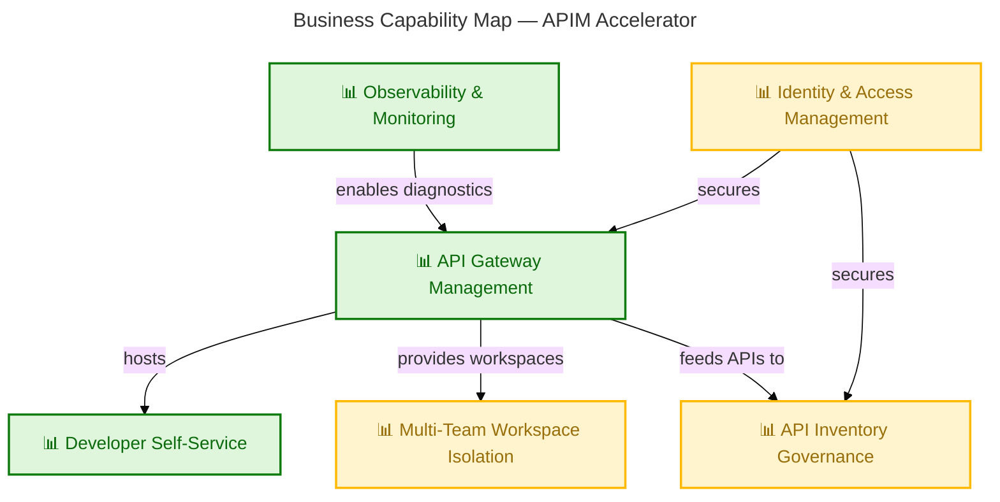
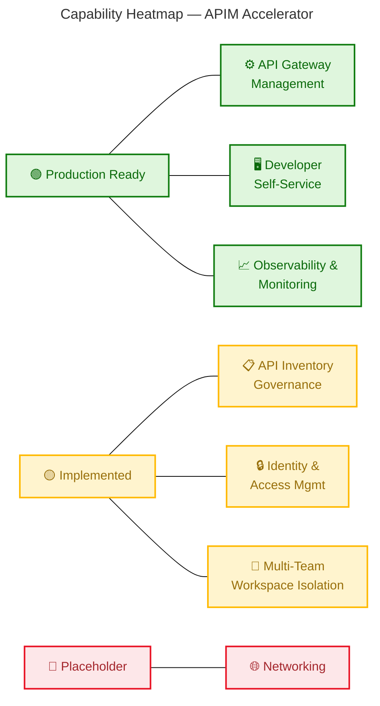
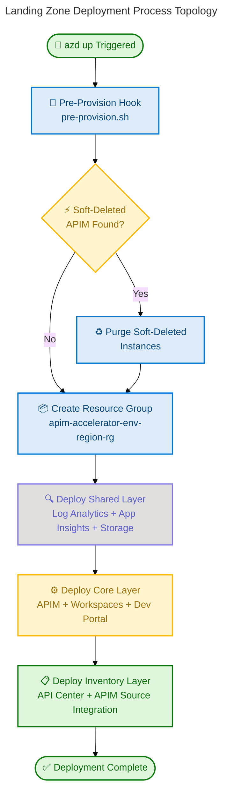
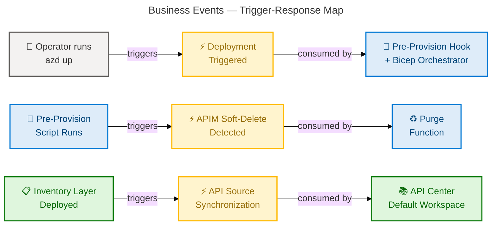
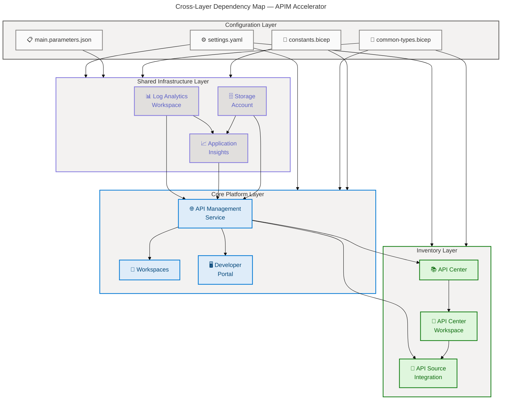
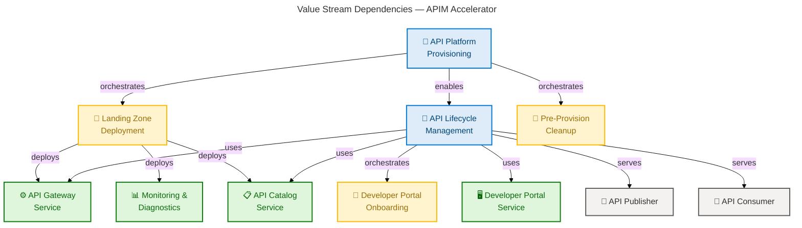

# 🏢 Business Architecture

## � Table of Contents

- [📋 1. Executive Summary](#-1-executive-summary)
- [🌍 2. Architecture Landscape](#-2-architecture-landscape)
  - [🎯 2.1 Business Strategy](#-21-business-strategy-2)
  - [💪 2.2 Business Capabilities](#-22-business-capabilities-6)
  - [🔄 2.3 Value Streams](#-23-value-streams-2)
  - [⚙️ 2.4 Business Processes](#️-24-business-processes-3)
  - [🛠️ 2.5 Business Services](#️-25-business-services-4)
  - [🔧 2.6 Business Functions](#-26-business-functions-3)
  - [👥 2.7 Business Roles & Actors](#-27-business-roles--actors-4)
  - [📏 2.8 Business Rules](#-28-business-rules-4)
  - [⚡ 2.9 Business Events](#-29-business-events-3)
  - [📦 2.10 Business Objects/Entities](#-210-business-objectsentities-0)
  - [📊 2.11 KPIs & Metrics](#-211-kpis--metrics-0)
  - [🗺️ Business Capability Map](#️-business-capability-map)
- [🏛️ 3. Architecture Principles](#️-3-architecture-principles)
  - [🧩 3.1 Modularity & Separation of Concerns](#-31-modularity--separation-of-concerns)
  - [⚙️ 3.2 Configuration Over Code](#️-32-configuration-over-code)
  - [🔒 3.3 Type Safety & Contract Enforcement](#-33-type-safety--contract-enforcement)
  - [🛡️ 3.4 Governance by Default](#️-34-governance-by-default)
  - [👁️ 3.5 Observability as a Foundation](#️-35-observability-as-a-foundation)
  - [🔁 3.6 Deterministic & Idempotent Deployments](#-36-deterministic--idempotent-deployments)
  - [🚧 3.7 Self-Service with Guardrails](#-37-self-service-with-guardrails)
- [📍 4. Current State Baseline](#-4-current-state-baseline)
  - [📋 4.1 Capability Assessment](#-41-capability-assessment)
  - [📊 4.2 Configuration Coverage](#-42-configuration-coverage)
  - [🌡️ Capability Heatmap](#️-capability-heatmap)
  - [🚀 4.3 Deployment Process Topology](#-43-deployment-process-topology)
- [📚 5. Component Catalog](#-5-component-catalog)
  - [🎯 5.1 Business Strategy Specifications](#-51-business-strategy-specifications)
  - [💪 5.2 Business Capabilities Specifications](#-52-business-capabilities-specifications)
  - [🔄 5.3 Value Streams Specifications](#-53-value-streams-specifications)
  - [⚙️ 5.4 Business Processes Specifications](#️-54-business-processes-specifications)
  - [🛠️ 5.5 Business Services Specifications](#️-55-business-services-specifications)
  - [🔧 5.6 Business Functions Specifications](#-56-business-functions-specifications)
  - [👥 5.7 Business Roles & Actors Specifications](#-57-business-roles--actors-specifications)
  - [📏 5.8 Business Rules Specifications](#-58-business-rules-specifications)
  - [⚡ 5.9 Business Events Specifications](#-59-business-events-specifications)
  - [📦 5.10 Business Objects/Entities Specifications](#-510-business-objectsentities-specifications)
  - [📊 5.11 KPIs & Metrics Specifications](#-511-kpis--metrics-specifications)
- [🔗 8. Dependencies & Integration](#-8-dependencies--integration)
  - [📤 8.1 Module Output-to-Input Mapping](#-81-module-output-to-input-mapping)
  - [🧰 8.2 Shared Utility Dependencies](#-82-shared-utility-dependencies)
  - [🔀 8.3 Cross-Layer Capability Dependencies](#-83-cross-layer-capability-dependencies)
  - [🌐 8.4 External Dependencies](#-84-external-dependencies)
  - [🗺️ Cross-Layer Dependency Map](#️-cross-layer-dependency-map)
  - [🔗 Value Stream Dependency Graph](#-value-stream-dependency-graph)

---

## �📋 1. Executive Summary

### 📖 Overview

This Business Architecture analysis documents the APIM Accelerator repository — a **production-ready Azure landing zone accelerator** for deploying and governing a complete API Management platform. The accelerator addresses the enterprise business need for **standardized, repeatable API platform provisioning** with integrated governance, monitoring, and developer self-service capabilities. The solution targets **Enterprise Architects, Platform Engineers, and API Program Managers** responsible for establishing API-first strategies.

The analysis identified **31 Business layer components** across 9 of the Business Architecture types. Business capabilities span **three strategic layers**: shared observability infrastructure, core API Management platform, and API inventory governance. Components were extracted from infrastructure-as-code templates (Bicep), configuration files (YAML/JSON), deployment automation scripts, and project documentation.

Key findings include a mature capability model organized around modular deployment layers, well-defined value streams for API lifecycle management, and comprehensive governance tagging that supports cost allocation, compliance tracking, and organizational ownership. The accelerator implements a **single-command deployment model** (`azd up`) that orchestrates the entire provisioning sequence, demonstrating a streamlined business process for platform delivery.

> 📌 **Gap Areas**: Gap areas include the absence of formal KPI definitions, no business object/entity models, and a placeholder networking layer that constrains the current private deployment story.

- **Business Strategy**: 2 components (API-first platform strategy, multi-environment deployment strategy)
- **Business Capabilities**: 6 components (API Gateway Management, Developer Self-Service, API Inventory Governance, Observability & Monitoring, Identity & Access Management, Multi-Team Workspace Isolation)
- **Value Streams**: 2 components (API Platform Provisioning, API Lifecycle Management)
- **Business Processes**: 3 components (Landing Zone Deployment, Pre-Provision Cleanup, Developer Portal Onboarding)
- **Business Services**: 4 components (API Gateway Service, Developer Portal Service, API Catalog Service, Monitoring & Diagnostics Service)
- **Business Functions**: 3 components (Resource Naming & Tagging, Configuration Management, RBAC Assignment Automation)
- **Business Roles & Actors**: 4 components (Platform Team, API Publisher, API Consumer, Subscription Owner)
- **Business Rules**: 4 components (Naming Convention Rules, SKU-Feature Dependency Rules, Tag Governance Rules, Identity Configuration Rules)
- **Business Events**: 3 components (Deployment Triggered, APIM Soft-Delete Detected, API Source Synchronization)
- **Business Objects/Entities**: 0 (Not detected)
- **KPIs & Metrics**: 0 (Not detected)

---

## 🌍 2. Architecture Landscape

### 📖 Landscape Overview

This section provides a structured inventory of all Business layer components identified across the APIM Accelerator repository. Components are organized by the Business Architecture types.

The accelerator's business architecture is fundamentally an **infrastructure platform** that delivers API Management as a **self-service capability**. Business components are encoded in infrastructure-as-code (Bicep), deployment configuration (YAML), and automation scripts (Shell), rather than in traditional application code. This architectural pattern is characteristic of platform engineering initiatives where the "product" is a reusable infrastructure template.

### 🎯 2.1 Business Strategy (2)

| Name                                  | Description                                                                                                          |
| ------------------------------------- | -------------------------------------------------------------------------------------------------------------------- |
| API-First Platform Strategy           | **Strategic initiative** to provide a standardized, repeatable API Management landing zone for enterprise teams      |
| Multi-Environment Deployment Strategy | **Deployment strategy** supporting dev, test, staging, prod, and uat environments with consistent naming and tagging |

### 💪 2.2 Business Capabilities (6)

| Name                           | Description                                                                                                                           |
| ------------------------------ | ------------------------------------------------------------------------------------------------------------------------------------- |
| API Gateway Management         | **Core capability** to deploy and manage Azure API Management with configurable SKU, scaling, and policies                            |
| Developer Self-Service         | **Portal capability** enabling API consumers to discover, test, and subscribe to APIs through Azure AD-authenticated developer portal |
| API Inventory Governance       | **Governance capability** providing centralized API catalog, compliance management, and automatic API discovery through API Center    |
| Observability & Monitoring     | **Observability capability** spanning Log Analytics, Application Insights, and diagnostic storage for centralized logging and APM     |
| Identity & Access Management   | **Security capability** for managed identity provisioning and RBAC role assignment automation across platform components              |
| Multi-Team Workspace Isolation | **Isolation capability** enabling independent API lifecycle management per workspace within a single APIM instance                    |

### 🔄 2.3 Value Streams (2)

| Name                      | Description                                                                                                                          |
| ------------------------- | ------------------------------------------------------------------------------------------------------------------------------------ |
| API Platform Provisioning | **End-to-end value stream** from repository clone through azd up to fully deployed API Management landing zone                       |
| API Lifecycle Management  | **Ongoing value stream** covering API registration, discovery via API Center, workspace assignment, and developer portal publication |

### ⚙️ 2.4 Business Processes (3)

| Name                        | Description                                                                                                                         |
| --------------------------- | ----------------------------------------------------------------------------------------------------------------------------------- |
| Landing Zone Deployment     | **Orchestration process** executing pre-provision hook, resource group creation, shared monitoring, core APIM, and inventory layers |
| Pre-Provision Cleanup       | **Automated process** to discover and purge soft-deleted APIM instances before provisioning to prevent naming conflicts             |
| Developer Portal Onboarding | **Configuration process** for Azure AD identity provider, CORS policies, sign-in/sign-up settings, and terms-of-service             |

### 🛠️ 2.5 Business Services (4)

| Name                             | Description                                                                                                                 |
| -------------------------------- | --------------------------------------------------------------------------------------------------------------------------- |
| API Gateway Service              | **Platform service** providing API gateway, policy enforcement, rate limiting, caching, and multi-region deployment support |
| Developer Portal Service         | **Self-service portal** with Azure AD authentication, CORS configuration, terms-of-service, and API documentation           |
| API Catalog Service              | **Governance service** providing centralized API inventory, documentation, and automatic APIM-to-catalog synchronization    |
| Monitoring & Diagnostics Service | **Observability service** integrating Log Analytics, Application Insights, and Storage for centralized logging and APM      |

### 🔧 2.6 Business Functions (3)

| Name                       | Description                                                                                                                 |
| -------------------------- | --------------------------------------------------------------------------------------------------------------------------- |
| Resource Naming & Tagging  | **Governance function** for deterministic resource naming using unique suffixes and 10-category governance tagging          |
| Configuration Management   | **Centralized function** for YAML-based configuration distributing settings for monitoring, APIM, and inventory modules     |
| RBAC Assignment Automation | **Security function** granting API Center Data Reader and Compliance Manager roles via deterministic GUID-based assignments |

### 👥 2.7 Business Roles & Actors (4)

| Name               | Description                                                                                                      |
| ------------------ | ---------------------------------------------------------------------------------------------------------------- |
| Platform Team      | **Owning team** responsible for authoring and maintaining accelerator templates and deployment orchestration     |
| API Publisher      | **Publishing role** identified by publisherEmail and publisherName, responsible for publishing APIs through APIM |
| API Consumer       | **Consuming role** for end-users who discover, test, and subscribe to APIs through the developer portal          |
| Subscription Owner | **Deployer role** with Owner or Contributor permissions who executes azd up to provision the landing zone        |

### 📏 2.8 Business Rules (4)

| Name                         | Description                                                                                                                 |
| ---------------------------- | --------------------------------------------------------------------------------------------------------------------------- |
| Naming Convention Rules      | **Naming standard** enforcing patterns for resource group, APIM, storage, and monitoring resource names                     |
| SKU-Feature Dependency Rules | **Feature gating rule** requiring Premium SKU for workspaces, VNet integration, and multi-region deployment                 |
| Tag Governance Rules         | **Compliance rule** mandating 10-tag taxonomy on all resources including CostCenter, BusinessUnit, and RegulatoryCompliance |
| Identity Configuration Rules | **Security rule** requiring all components to declare identity type with typed schema enforcement                           |

### ⚡ 2.9 Business Events (3)

| Name                       | Description                                                                                                  |
| -------------------------- | ------------------------------------------------------------------------------------------------------------ |
| Deployment Triggered       | **Lifecycle event** initiated by azd up that triggers the full landing zone deployment sequence              |
| APIM Soft-Delete Detected  | **Discovery event** where pre-provision script finds soft-deleted APIM instances triggering automated purge  |
| API Source Synchronization | **Integration event** where API Center automatically discovers and imports APIs from connected APIM instance |

### 📦 2.10 Business Objects/Entities (0)

This subsection documents Business objects and domain entities. Zero instances were detected in the analyzed source files. The APIM Accelerator models Azure infrastructure resources rather than business domain entities.

| Name         | Description  |
| ------------ | ------------ |
| Not detected | Not detected |

### 📊 2.11 KPIs & Metrics (0)

This subsection documents Business KPIs and performance metrics. Zero instances were detected in the analyzed source files. No formal KPI definitions or metric thresholds are codified in the repository.

| Name         | Description  |
| ------------ | ------------ |
| Not detected | Not detected |

### 🗺️ Business Capability Map

```mermaid
---
title: "Business Capability Map — APIM Accelerator"
config:
  theme: base
  look: classic
  layout: dagre
  themeVariables:
    fontSize: '16px'
---
flowchart TB
    accTitle: Business Capability Map
    accDescr: Shows 6 core business capabilities with dependency relationships

    %% ═══════════════════════════════════════════════════════════════════════════
    %% AZURE / FLUENT ARCHITECTURE PATTERN v1.1
    %% (Semantic + Structural + Font + Accessibility Governance)
    %% ═══════════════════════════════════════════════════════════════════════════
    %% PHASE 1 - STRUCTURAL: Direction explicit, flat topology, nesting ≤ 3
    %% PHASE 2 - SEMANTIC: Colors justified, max 5 semantic classes, neutral-first
    %% PHASE 3 - FONT: Dark text on light backgrounds, contrast ≥ 4.5:1
    %% PHASE 4 - ACCESSIBILITY: accTitle/accDescr present, icons on all nodes
    %% PHASE 5 - STANDARD: Governance block present, classDefs centralized
    %% ═══════════════════════════════════════════════════════════════════════════

    cap1["📊 API Gateway Management"]:::success
    cap2["📊 Developer Self-Service"]:::success
    cap3["📊 API Inventory Governance"]:::warning
    cap4["📊 Observability & Monitoring"]:::success
    cap5["📊 Identity & Access Management"]:::warning
    cap6["📊 Multi-Team Workspace Isolation"]:::warning

    cap4 -->|"enables diagnostics"| cap1
    cap5 -->|"secures"| cap1
    cap5 -->|"secures"| cap3
    cap1 -->|"hosts"| cap2
    cap1 -->|"provides workspaces"| cap6
    cap1 -->|"feeds APIs to"| cap3

    classDef success  fill:#DFF6DD,stroke:#107C10,stroke-width:2px,color:#0B6A0B
    classDef warning  fill:#FFF4CE,stroke:#FFB900,stroke-width:2px,color:#986F0B
```

### ✅ Landscape Summary

The APIM Accelerator repository contains **31 identified Business layer components** distributed across 9 of 11 component types. The dominant patterns are business capabilities (6 components) and business services/rules (4 components each), reflecting the accelerator's focus on platform capability delivery and governance enforcement. The strongest components are concentrated in the core API gateway, developer portal, observability, and deployment orchestration areas.

Two component types — Business Objects/Entities and KPIs & Metrics — returned zero components, consistent with the repository's nature as an infrastructure-as-code platform accelerator rather than a business application.

> 💡 **Recommended Next Steps**: Recommended next steps include defining explicit KPI thresholds for API platform adoption (e.g., time-to-first-API-publish, developer portal onboarding rate), formalizing business entity models if the accelerator scope expands, and upgrading the networking layer from placeholder to production-ready.

---

## 🏛️ 3. Architecture Principles

### 📖 Principles Overview

The APIM Accelerator exhibits several well-defined architecture principles that guide the design and governance of the platform. These principles are inferred from source code patterns, configuration structures, and documented design decisions rather than explicitly declared in a principles catalog. They align with 10 Architecture Principles and reflect enterprise-grade platform engineering practices.

Each principle below is documented using a structured attribute table format. All principles are **active (implemented in code)** rather than aspirational.

### 🧩 3.1 Modularity & Separation of Concerns

| Attribute               | Value                                                                                                                  |
| ----------------------- | ---------------------------------------------------------------------------------------------------------------------- |
| **Principle Statement** | Decompose the platform into independently deployable, loosely coupled modules with explicit parameter contracts.       |
| **Rationale**           | Modular boundaries enable independent testing, selective deployment, and isolated failure domains across the platform. |
| **Implications**        | All inter-module communication **must** use typed parameters and outputs; **implicit dependencies are prohibited**.    |

### ⚙️ 3.2 Configuration Over Code

| Attribute               | Value                                                                                                                        |
| ----------------------- | ---------------------------------------------------------------------------------------------------------------------------- |
| **Principle Statement** | Externalize all environment-specific settings into a single configuration file, keeping code templates environment-agnostic. |
| **Rationale**           | A single configuration source prevents environment drift and enables consistent multi-environment deployments.               |
| **Implications**        | Bicep templates **must contain no hardcoded environment values**; all tunable parameters flow from settings.yaml.            |

### 🔒 3.3 Type Safety & Contract Enforcement

| Attribute               | Value                                                                                                                           |
| ----------------------- | ------------------------------------------------------------------------------------------------------------------------------- |
| **Principle Statement** | Define explicit type contracts for all module interfaces to prevent misconfiguration and enable compile-time validation.        |
| **Rationale**           | Type safety catches invalid configurations at Bicep compilation rather than at Azure deployment time, reducing feedback cycles. |
| **Implications**        | New modules **must** import and conform to shared type definitions; **ad-hoc parameter typing is prohibited**.                  |

### 🛡️ 3.4 Governance by Default

| Attribute               | Value                                                                                                                                                              |
| ----------------------- | ------------------------------------------------------------------------------------------------------------------------------------------------------------------ |
| **Principle Statement** | Embed governance controls including tagging, naming, RBAC, and compliance into the platform template so every deployment is compliant without manual intervention. |
| **Rationale**           | Automated governance eliminates human error in compliance and enables audit-ready deployments from day one.                                                        |
| **Implications**        | Governance tag taxonomy changes require settings.yaml updates; manual tag application is discouraged.                                                              |

### 👁️ 3.5 Observability as a Foundation

| Attribute               | Value                                                                                                                                |
| ----------------------- | ------------------------------------------------------------------------------------------------------------------------------------ |
| **Principle Statement** | Deploy monitoring and logging infrastructure before application components, ensuring all resources have observability from creation. |
| **Rationale**           | Foundation-first monitoring guarantees diagnostic coverage from the first deployment, preventing blind spots.                        |
| **Implications**        | The shared monitoring layer **must always deploy first**; core and inventory modules depend on monitoring outputs.                   |

### 🔁 3.6 Deterministic & Idempotent Deployments

| Attribute               | Value                                                                                                                          |
| ----------------------- | ------------------------------------------------------------------------------------------------------------------------------ |
| **Principle Statement** | Ensure deployments are reproducible, collision-free, and safely re-runnable without side effects.                              |
| **Rationale**           | Deterministic naming and idempotent operations prevent deployment failures from naming conflicts and enable safe redeployment. |
| **Implications**        | Resource names **must** use uniqueString hashes; RBAC assignments **must** use guid-based deterministic names.                 |

### 🚧 3.7 Self-Service with Guardrails

| Attribute               | Value                                                                                                                                   |
| ----------------------- | --------------------------------------------------------------------------------------------------------------------------------------- |
| **Principle Statement** | Enable self-service consumption through the developer portal while enforcing authentication, terms-of-service, and tenant restrictions. |
| **Rationale**           | Controlled self-service balances developer autonomy with organizational security and compliance requirements.                           |
| **Implications**        | Developer portal access **requires** Azure AD authentication; **anonymous access and unrestricted tenant access are prohibited**.       |

---

## 📍 4. Current State Baseline

### 📖 Baseline Overview

The current-state baseline represents the as-is architecture of the APIM Accelerator as encoded in the repository's infrastructure-as-code templates, configuration files, and deployment automation. This analysis evaluates the completeness of value stream coverage and the operational readiness of the platform.

The accelerator is in a **production-ready state** for its core deployment scope (API Management + monitoring + API Center governance). All **three deployment layers** are fully implemented with typed parameter contracts, diagnostic integration, and governance tagging.

### 📋 4.1 Capability Assessment

| Capability                     | Description                                                                                        |
| ------------------------------ | -------------------------------------------------------------------------------------------------- |
| API Gateway Management         | Full SKU matrix, multi-region ready, configurable scaling, VNet options, diagnostic settings       |
| Developer Self-Service         | Azure AD integration, CORS policies, sign-in/sign-up controls, terms-of-service                    |
| API Inventory Governance       | API Center with default workspace, APIM source integration, dual RBAC role assignments             |
| Observability & Monitoring     | Three-component stack with configurable SKU and retention, diagnostic settings on all resources    |
| Identity & Access Management   | System and user-assigned identity support, typed identity definitions, Reader role on APIM         |
| Multi-Team Workspace Isolation | Workspace resource creation per config entry, Premium SKU gate documented                          |
| Networking                     | Placeholder module using SCVMM provider; VNet parameters defined but no network resources deployed |

### 📊 4.2 Configuration Coverage

| Configuration Area             | Status   |
| ------------------------------ | -------- |
| Resource naming conventions    | Complete |
| Tag governance (10 categories) | Complete |
| Multi-environment support      | Complete |
| SKU configuration              | Complete |
| Identity configuration types   | Complete |
| Monitoring retention           | Complete |
| VNet integration               | Partial  |
| Developer portal AAD tenants   | Partial  |
| API Center workspace model     | Partial  |

### 🌡️ Capability Heatmap

```mermaid
---
title: "Capability Heatmap — APIM Accelerator"
config:
  theme: base
  look: classic
  layout: dagre
  themeVariables:
    fontSize: '16px'
---
flowchart LR
    accTitle: Capability Heatmap
    accDescr: Visual heatmap showing each business capability colored by readiness level

    %% ═══════════════════════════════════════════════════════════════════════════
    %% AZURE / FLUENT ARCHITECTURE PATTERN v1.1
    %% (Semantic + Structural + Font + Accessibility Governance)
    %% ═══════════════════════════════════════════════════════════════════════════
    %% PHASE 1 - STRUCTURAL: Direction explicit, flat topology, nesting ≤ 3
    %% PHASE 2 - SEMANTIC: Colors justified, max 5 semantic classes, neutral-first
    %% PHASE 3 - FONT: Dark text on light backgrounds, contrast ≥ 4.5:1
    %% PHASE 4 - ACCESSIBILITY: accTitle/accDescr present, icons on all nodes
    %% PHASE 5 - STANDARD: Governance block present, classDefs centralized
    %% ═══════════════════════════════════════════════════════════════════════════

    L4["🟢 Production Ready"]:::success
    L3["🟡 Implemented"]:::warning
    L1["🔴 Placeholder"]:::danger

    L4 --- gw["⚙️ API Gateway<br/>Management"]:::success
    L4 --- ds["🖥️ Developer<br/>Self-Service"]:::success
    L4 --- ob["📈 Observability &<br/>Monitoring"]:::success
    L3 --- ig["📋 API Inventory<br/>Governance"]:::warning
    L3 --- ia["🔒 Identity &<br/>Access Mgmt"]:::warning
    L3 --- ws["🏢 Multi-Team<br/>Workspace Isolation"]:::warning
    L1 --- nw["🌐 Networking"]:::danger

    classDef success  fill:#DFF6DD,stroke:#107C10,stroke-width:2px,color:#0B6A0B
    classDef warning  fill:#FFF4CE,stroke:#FFB900,stroke-width:2px,color:#986F0B
    classDef danger   fill:#FDE7E9,stroke:#E81123,stroke-width:2px,color:#A4262C
```

### 🚀 4.3 Deployment Process Topology

```mermaid
---
title: "Landing Zone Deployment Process Topology"
config:
  theme: base
  look: classic
  layout: dagre
  themeVariables:
    fontSize: '16px'
---
flowchart TB
    accTitle: Landing Zone Deployment Process Topology
    accDescr: Shows the sequential deployment process from azd up through shared monitoring, core APIM platform, and API inventory governance layers

    %% ═══════════════════════════════════════════════════════════════════════════
    %% AZURE / FLUENT ARCHITECTURE PATTERN v1.1
    %% (Semantic + Structural + Font + Accessibility Governance)
    %% ═══════════════════════════════════════════════════════════════════════════
    %% PHASE 1 - STRUCTURAL: Direction explicit, flat topology, nesting ≤ 3
    %% PHASE 2 - SEMANTIC: Colors justified, max 5 semantic classes, neutral-first
    %% PHASE 3 - FONT: Dark text on light backgrounds, contrast ≥ 4.5:1
    %% PHASE 4 - ACCESSIBILITY: accTitle/accDescr present, icons on all nodes
    %% PHASE 5 - STANDARD: Governance block present, classDefs centralized
    %% ═══════════════════════════════════════════════════════════════════════════

    start(["🚀 azd up Triggered"]):::success
    hook["🔧 Pre-Provision Hook<br/>pre-provision.sh"]:::core
    purge{"⚡ Soft-Deleted<br/>APIM Found?"}:::warning
    cleanup["♻️ Purge Soft-Deleted<br/>Instances"]:::core
    rgCreate["📦 Create Resource Group<br/>apim-accelerator-env-region-rg"]:::core
    shared["🔍 Deploy Shared Layer<br/>Log Analytics + App Insights + Storage"]:::data
    core["⚙️ Deploy Core Layer<br/>APIM + Workspaces + Dev Portal"]:::warning
    inventory["📋 Deploy Inventory Layer<br/>API Center + APIM Source Integration"]:::success
    done(["✅ Deployment Complete"]):::success

    start --> hook
    hook --> purge
    purge -->|"Yes"| cleanup
    purge -->|"No"| rgCreate
    cleanup --> rgCreate
    rgCreate --> shared
    shared --> core
    core --> inventory
    inventory --> done

    classDef core     fill:#DEECF9,stroke:#0078D4,stroke-width:2px,color:#004578
    classDef success  fill:#DFF6DD,stroke:#107C10,stroke-width:2px,color:#0B6A0B
    classDef warning  fill:#FFF4CE,stroke:#FFB900,stroke-width:2px,color:#986F0B
    classDef data     fill:#E1DFDD,stroke:#8378DE,stroke-width:2px,color:#5B5FC7
```

### ✅ Baseline Summary

The APIM Accelerator presents a well-structured current-state architecture with strong capabilities in core API gateway, developer portal, and observability. Configuration coverage is comprehensive for naming, tagging, identity, and multi-environment deployment. The deployment process is fully automated via azd with a three-layer sequential orchestration and pre-provision cleanup.

> ⚠️ **Attention Required**: Three areas require attention for advancement: the networking layer remains a placeholder blocking private APIM deployment scenarios, the developer portal Azure AD tenant list contains only a sample value requiring parameterization, and API Center is configured with a single default workspace limiting multi-team governance scenarios.

> 💡 **Recommended Next Steps**: Recommended next steps include implementing a **production-ready VNet module**, parameterizing Azure AD tenant domains through settings.yaml, and extending the API Center workspace model.

---

## 📚 5. Component Catalog

### 📖 Catalog Overview

This section provides detailed specifications for each identified Business layer component. Components are organized by the Business Architecture types with specifications expanding on the inventory tables in Section 2. Each component entry includes attribute tables with relationship mappings.

All components are verified against source files in the repository root. No fabricated components are included — every entry is **traceable to specific files and line ranges**. A total of **31 components** are documented in detail across 9 active component types.

### 🎯 5.1 Business Strategy Specifications

This subsection documents the strategic initiatives and business direction identified in the APIM Accelerator. Two strategy components were detected, both with documented objectives and implementation patterns.

#### 🌐 5.1.1 API-First Platform Strategy

| Attribute       | Value                                                                                                                                                                                                    |
| --------------- | -------------------------------------------------------------------------------------------------------------------------------------------------------------------------------------------------------- |
| **Name**        | API-First Platform Strategy                                                                                                                                                                              |
| **Type**        | Business Strategy                                                                                                                                                                                        |
| **Description** | Strategic initiative to provide enterprise teams with a production-ready, standardized Azure API Management landing zone enabling one-command deployment, modular architecture, and built-in governance. |

**Relationships**: Drives API Gateway Management (Capability), API Platform Provisioning (Value Stream), Landing Zone Deployment (Process).

#### 🔀 5.1.2 Multi-Environment Deployment Strategy

| Attribute       | Value                                                                                                                                                                                                                |
| --------------- | -------------------------------------------------------------------------------------------------------------------------------------------------------------------------------------------------------------------- |
| **Name**        | Multi-Environment Deployment Strategy                                                                                                                                                                                |
| **Type**        | Business Strategy                                                                                                                                                                                                    |
| **Description** | Strategy supporting five distinct environment types (dev, test, staging, prod, uat) with consistent resource naming, environment-specific tagging, and template version tracking for parallel environment operation. |

**Relationships**: Supports Landing Zone Deployment (Process), Resource Naming & Tagging (Function), Tag Governance Rules (Business Rule).

### 💪 5.2 Business Capabilities Specifications

This subsection documents the six core business capabilities that form the APIM Accelerator platform. Three capabilities are production-ready with full feature implementation (API Gateway Management, Developer Self-Service, Observability & Monitoring), and three are implemented with room for expansion (API Inventory Governance, Identity & Access Management, Multi-Team Workspace Isolation).

#### 🚪 5.2.1 API Gateway Management

| Attribute        | Value                                                                                                                                                                                                                                                       |
| ---------------- | ----------------------------------------------------------------------------------------------------------------------------------------------------------------------------------------------------------------------------------------------------------- |
| **Name**         | API Gateway Management                                                                                                                                                                                                                                      |
| **Type**         | Business Capability                                                                                                                                                                                                                                         |
| **Description**  | Core platform capability providing a fully configurable Azure API Management deployment with 8 SKU tiers, system/user-assigned managed identity, VNet integration modes, diagnostic settings, Application Insights logger, and RBAC Reader role assignment. |
| **Dependencies** | Observability & Monitoring (requires Log Analytics, App Insights, Storage outputs)                                                                                                                                                                          |

**Relationships**: Depends on Observability & Monitoring; Enables Developer Self-Service, Multi-Team Workspace Isolation, API Inventory Governance.

#### 🧑‍💻 5.2.2 Developer Self-Service

| Attribute        | Value                                                                                                                                                                                                                                   |
| ---------------- | --------------------------------------------------------------------------------------------------------------------------------------------------------------------------------------------------------------------------------------- |
| **Name**         | Developer Self-Service                                                                                                                                                                                                                  |
| **Type**         | Business Capability                                                                                                                                                                                                                     |
| **Description**  | Self-service developer portal capability providing API discovery, documentation, and testing with Azure AD identity provider, MSAL 2.0 authentication, CORS policies, sign-in/sign-up controls, and mandatory terms-of-service consent. |
| **Dependencies** | API Gateway Management (APIM parent resource), Identity & Access Management (Azure AD configuration)                                                                                                                                    |

**Relationships**: Depends on API Gateway Management, Identity & Access Management; Serves API Consumer (Role).

#### 📋 5.2.3 API Inventory Governance

| Attribute        | Value                                                                                                                                                                                                                                  |
| ---------------- | -------------------------------------------------------------------------------------------------------------------------------------------------------------------------------------------------------------------------------------- |
| **Name**         | API Inventory Governance                                                                                                                                                                                                               |
| **Type**         | Business Capability                                                                                                                                                                                                                    |
| **Description**  | Centralized API governance capability deployed via Azure API Center with default workspace, automatic APIM-to-catalog integration through API Source resources, and dual RBAC role assignments for Data Reader and Compliance Manager. |
| **Dependencies** | API Gateway Management (consumes APIM resource ID and name for source integration)                                                                                                                                                     |

**Relationships**: Depends on API Gateway Management; Enables API Lifecycle Management (Value Stream), API Catalog Service (Business Service).

#### 📈 5.2.4 Observability & Monitoring

| Attribute        | Value                                                                                                                                                                                                                                          |
| ---------------- | ---------------------------------------------------------------------------------------------------------------------------------------------------------------------------------------------------------------------------------------------- |
| **Name**         | Observability & Monitoring                                                                                                                                                                                                                     |
| **Type**         | Business Capability                                                                                                                                                                                                                            |
| **Description**  | Foundation capability providing three-tier observability: Log Analytics workspace with configurable SKU for KQL-based analysis, Application Insights with 90-730 day retention for APM, and Storage Account for long-term diagnostic archival. |
| **Dependencies** | None (foundation layer, deployed first in sequence)                                                                                                                                                                                            |

**Relationships**: Required by API Gateway Management; Outputs consumed by Core Platform and Inventory layers.

#### 🔐 5.2.5 Identity & Access Management

| Attribute        | Value                                                                                                                                                                                                                                                           |
| ---------------- | --------------------------------------------------------------------------------------------------------------------------------------------------------------------------------------------------------------------------------------------------------------- |
| **Name**         | Identity & Access Management                                                                                                                                                                                                                                    |
| **Type**         | Business Capability                                                                                                                                                                                                                                             |
| **Description**  | Cross-cutting capability managing managed identities and RBAC across all platform components with two identity type schemas (SystemAssignedIdentity and ExtendedIdentity) and automated role assignments for Reader, Data Reader, and Compliance Manager roles. |
| **Dependencies** | Common type definitions from src/shared/common-types.bicep                                                                                                                                                                                                      |

**Relationships**: Enables API Gateway Management, API Inventory Governance, Developer Self-Service.

#### 🏢 5.2.6 Multi-Team Workspace Isolation

| Attribute        | Value                                                                                                                                                                                                                        |
| ---------------- | ---------------------------------------------------------------------------------------------------------------------------------------------------------------------------------------------------------------------------- |
| **Name**         | Multi-Team Workspace Isolation                                                                                                                                                                                               |
| **Type**         | Business Capability                                                                                                                                                                                                          |
| **Description**  | Workspace-based API isolation capability enabling multi-team environments within a single APIM instance, with each workspace as a child resource supporting independent API lifecycle management. Requires Premium SKU tier. |
| **Dependencies** | API Gateway Management (APIM parent resource, Premium SKU requirement)                                                                                                                                                       |

**Relationships**: Depends on API Gateway Management; Constrained by SKU-Feature Dependency Rules (Business Rule).

### 🔄 5.3 Value Streams Specifications

This subsection documents the two value streams identified in the APIM Accelerator. The API Platform Provisioning value stream is the primary delivery mechanism. The API Lifecycle Management value stream covers post-deployment operations.

#### 🏗️ 5.3.1 API Platform Provisioning

| Attribute              | Value                                                                                                                                                                                                                                                                                                 |
| ---------------------- | ----------------------------------------------------------------------------------------------------------------------------------------------------------------------------------------------------------------------------------------------------------------------------------------------------- |
| **Name**               | API Platform Provisioning                                                                                                                                                                                                                                                                             |
| **Type**               | Value Stream                                                                                                                                                                                                                                                                                          |
| **Description**        | Primary value stream delivering a fully provisioned API Management landing zone from a single azd up command through five sequential stages: pre-provision validation, resource group creation, shared monitoring deployment, core APIM platform deployment, and API inventory governance deployment. |
| **Measurable Outcome** | Fully deployed APIM landing zone with monitoring, governance, and developer portal                                                                                                                                                                                                                    |

**Process Steps:**

1. Pre-provision validation and soft-delete cleanup
2. Resource group creation with governance tags
3. Shared monitoring deployment (Log Analytics + App Insights + Storage)
4. Core APIM platform deployment (APIM + Workspaces + Developer Portal)
5. API inventory governance deployment (API Center + APIM Source Integration)

**Relationships**: Orchestrates Landing Zone Deployment (Process), Pre-Provision Cleanup (Process); Realizes API-First Platform Strategy.

#### 🔃 5.3.2 API Lifecycle Management

| Attribute              | Value                                                                                                                                                                                                                                                       |
| ---------------------- | ----------------------------------------------------------------------------------------------------------------------------------------------------------------------------------------------------------------------------------------------------------- |
| **Name**               | API Lifecycle Management                                                                                                                                                                                                                                    |
| **Type**               | Value Stream                                                                                                                                                                                                                                                |
| **Description**        | Post-deployment value stream covering API registration in APIM, automatic discovery and import to API Center, workspace assignment for team isolation, developer portal publication for consumer discovery, and compliance governance via API Center roles. |
| **Measurable Outcome** | APIs discoverable in API Center catalog and accessible through developer portal                                                                                                                                                                             |

**Relationships**: Depends on API Platform Provisioning (Value Stream); Enables API Consumer (Role), API Publisher (Role).

### ⚙️ 5.4 Business Processes Specifications

This subsection documents three business processes. The Landing Zone Deployment process has full automation. The Pre-Provision Cleanup and Developer Portal Onboarding processes are fully implemented with documented workflows.

#### 🏯 5.4.1 Landing Zone Deployment

| Attribute       | Value                                                                                                                                                                                                                                                           |
| --------------- | --------------------------------------------------------------------------------------------------------------------------------------------------------------------------------------------------------------------------------------------------------------- |
| **Name**        | Landing Zone Deployment                                                                                                                                                                                                                                         |
| **Type**        | Business Process                                                                                                                                                                                                                                                |
| **Trigger**     | azd up or azd provision command execution                                                                                                                                                                                                                       |
| **Owner**       | Platform Team                                                                                                                                                                                                                                                   |
| **Description** | Primary deployment orchestration process executing at subscription scope: creates resource group, deploys three module layers in sequence with explicit dependency chains, and produces APIM, monitoring, and inventory resources with full governance tagging. |

**Process Steps:**

1. Pre-provision hook triggers pre-provision.sh
2. Resource group created with naming convention and governance tags
3. Shared monitoring layer deployed (Log Analytics + App Insights + Storage)
4. Core platform layer deployed (APIM + Workspaces + Developer Portal)
5. Inventory layer deployed (API Center + APIM Source Integration)

**Relationships**: Part of API Platform Provisioning (Value Stream); Triggers Deployment Triggered (Event); Preceded by Pre-Provision Cleanup (Process).

#### 🧹 5.4.2 Pre-Provision Cleanup

| Attribute       | Value                                                                                                                                                                                                                                                         |
| --------------- | ------------------------------------------------------------------------------------------------------------------------------------------------------------------------------------------------------------------------------------------------------------- |
| **Name**        | Pre-Provision Cleanup                                                                                                                                                                                                                                         |
| **Type**        | Business Process                                                                                                                                                                                                                                              |
| **Trigger**     | azure.yaml preprovision lifecycle hook                                                                                                                                                                                                                        |
| **Owner**       | Platform Team                                                                                                                                                                                                                                                 |
| **Description** | Automated bash script with three functions: get_soft_deleted_apims() queries for soft-deleted instances, purge_soft_deleted_apim() permanently deletes found instances, and process_apim_purging() orchestrates discovery and purge with timestamped logging. |

**Relationships**: Precedes Landing Zone Deployment (Process); Triggers APIM Soft-Delete Detected (Event).

#### 🚀 5.4.3 Developer Portal Onboarding

| Attribute       | Value                                                                                                                                                                                                                                                                                             |
| --------------- | ------------------------------------------------------------------------------------------------------------------------------------------------------------------------------------------------------------------------------------------------------------------------------------------------- |
| **Name**        | Developer Portal Onboarding                                                                                                                                                                                                                                                                       |
| **Type**        | Business Process                                                                                                                                                                                                                                                                                  |
| **Trigger**     | Core platform layer deployment completion                                                                                                                                                                                                                                                         |
| **Owner**       | Platform Team                                                                                                                                                                                                                                                                                     |
| **Description** | Configuration process establishing the developer self-service experience through five sequential steps: Azure AD identity provider configuration with MSAL 2.0, allowed tenant domain setup, CORS policy application, sign-in enablement, and sign-up enablement with mandatory terms-of-service. |

**Relationships**: Part of API Lifecycle Management (Value Stream); Serves API Consumer (Role); Depends on API Gateway Management (Capability).

### 🗺️ Landing Zone Deployment Process Flow

```mermaid
---
title: "Landing Zone Deployment — BPMN-Style Process Flow"
config:
  theme: base
  look: classic
  layout: dagre
  themeVariables:
    fontSize: '16px'
---
flowchart TB
    accTitle: Landing Zone Deployment Process Flow
    accDescr: BPMN-style diagram showing the complete deployment workflow from azd up through all three layers with decision points

    %% ═══════════════════════════════════════════════════════════════════════════
    %% AZURE / FLUENT ARCHITECTURE PATTERN v1.1
    %% (Semantic + Structural + Font + Accessibility Governance)
    %% ═══════════════════════════════════════════════════════════════════════════
    %% PHASE 1 - STRUCTURAL: Direction explicit, flat topology, nesting ≤ 3
    %% PHASE 2 - SEMANTIC: Colors justified, max 5 semantic classes, neutral-first
    %% PHASE 3 - FONT: Dark text on light backgrounds, contrast ≥ 4.5:1
    %% PHASE 4 - ACCESSIBILITY: accTitle/accDescr present, icons on all nodes
    %% PHASE 5 - STANDARD: Governance block present, classDefs centralized
    %% ═══════════════════════════════════════════════════════════════════════════

    Start(["🚀 Operator Runs azd up"]):::success
    LoadConfig["📄 Load settings.yaml<br/>and parameters"]:::core
    RunHook["🔧 Execute Pre-Provision<br/>Hook Script"]:::core
    CheckSD{"⚡ Soft-Deleted<br/>APIM Found?"}:::warning
    PurgeSD["♻️ Purge Soft-Deleted<br/>Instances via Azure CLI"]:::core
    CreateRG["📦 Create Resource Group<br/>with Governance Tags"]:::core
    DeployMon["📊 Deploy Monitoring<br/>Log Analytics + App Insights"]:::data
    DeployAPIM["⚙️ Deploy APIM Service<br/>with Identity & Diagnostics"]:::warning
    DeployWS["🏢 Deploy Workspaces<br/>per Configuration"]:::warning
    DeployDP["🖥️ Deploy Developer Portal<br/>AAD + CORS + ToS"]:::warning
    DeployAC["📋 Deploy API Center<br/>with Source Integration"]:::success
    AssignRBAC["🔒 Assign RBAC Roles<br/>Data Reader + Compliance"]:::core
    End(["✅ Landing Zone<br/>Deployment Complete"]):::success

    Start --> LoadConfig
    LoadConfig --> RunHook
    RunHook --> CheckSD
    CheckSD -->|"Yes"| PurgeSD
    CheckSD -->|"No"| CreateRG
    PurgeSD --> CreateRG
    CreateRG --> DeployMon
    DeployMon --> DeployAPIM
    DeployAPIM --> DeployWS
    DeployWS --> DeployDP
    DeployDP --> DeployAC
    DeployAC --> AssignRBAC
    AssignRBAC --> End

    classDef core     fill:#DEECF9,stroke:#0078D4,stroke-width:2px,color:#004578
    classDef success  fill:#DFF6DD,stroke:#107C10,stroke-width:2px,color:#0B6A0B
    classDef warning  fill:#FFF4CE,stroke:#FFB900,stroke-width:2px,color:#986F0B
    classDef data     fill:#E1DFDD,stroke:#8378DE,stroke-width:2px,color:#5B5FC7
```

### 🛠️ 5.5 Business Services Specifications

This subsection documents four platform services that constitute the APIM Accelerator's service catalog. The API Gateway Service and Monitoring & Diagnostics Service are the strongest services with full feature implementation.

#### 🚪 5.5.1 API Gateway Service

| Attribute       | Value                                                                                                                                                                                                                                                                                                                        |
| --------------- | ---------------------------------------------------------------------------------------------------------------------------------------------------------------------------------------------------------------------------------------------------------------------------------------------------------------------------- |
| **Name**        | API Gateway Service                                                                                                                                                                                                                                                                                                          |
| **Type**        | Business Service                                                                                                                                                                                                                                                                                                             |
| **Description** | Azure API Management service instance providing API gateway with policy enforcement, rate limiting, caching, and developer portal hosting. Configurable across 8 SKU tiers, 3 VNet modes, and system/user-assigned identity options. Includes diagnostic settings routing all logs and metrics to Log Analytics and Storage. |

**Relationships**: Hosts Developer Portal Service, Multi-Team Workspace Isolation; Consumes Monitoring & Diagnostics Service; Produces API Management outputs.

#### 💻 5.5.2 Developer Portal Service

| Attribute       | Value                                                                                                                                                                                                                                                                                                                         |
| --------------- | ----------------------------------------------------------------------------------------------------------------------------------------------------------------------------------------------------------------------------------------------------------------------------------------------------------------------------- |
| **Name**        | Developer Portal Service                                                                                                                                                                                                                                                                                                      |
| **Type**        | Business Service                                                                                                                                                                                                                                                                                                              |
| **Description** | Self-service developer portal exposing API documentation, interactive testing console, and subscription management. Deployed as child resources of the APIM service including global CORS policy, Azure AD identity provider, portal configuration, sign-in settings, and sign-up settings with terms-of-service enforcement. |

**Relationships**: Child of API Gateway Service; Consumes Identity & Access Management; Serves API Consumer (Role).

#### 📖 5.5.3 API Catalog Service

| Attribute       | Value                                                                                                                                                                                                                               |
| --------------- | ----------------------------------------------------------------------------------------------------------------------------------------------------------------------------------------------------------------------------------- |
| **Name**        | API Catalog Service                                                                                                                                                                                                                 |
| **Type**        | Business Service                                                                                                                                                                                                                    |
| **Description** | Azure API Center service providing centralized API inventory with default workspace for API organization, APIM source integration for automatic API discovery, and dual RBAC role assignments via idempotent guid-based operations. |

**Relationships**: Consumes API Gateway Service outputs; Governed by Tag Governance Rules, RBAC Assignment Automation.

#### 📊 5.5.4 Monitoring & Diagnostics Service

| Attribute       | Value                                                                                                                                                                                                                                                                                                             |
| --------------- | ----------------------------------------------------------------------------------------------------------------------------------------------------------------------------------------------------------------------------------------------------------------------------------------------------------------- |
| **Name**        | Monitoring & Diagnostics Service                                                                                                                                                                                                                                                                                  |
| **Type**        | Business Service                                                                                                                                                                                                                                                                                                  |
| **Description** | Integrated three-component monitoring service: Log Analytics workspace with PerGB2018 SKU default, Application Insights with workspace-based ingestion and configurable retention, and Storage Account with Standard_LRS for cost-effective archival. Deployed first to enable downstream diagnostic integration. |

**Relationships**: Required by API Gateway Service, Core Platform Layer; Outputs Log Analytics workspace ID, App Insights resource ID, Storage account ID.

### 🔧 5.6 Business Functions Specifications

This subsection documents three organizational functions responsible for cross-cutting Business layer operations. The Resource Naming & Tagging function has fully automated enforcement.

#### 🏷️ 5.6.1 Resource Naming & Tagging

| Attribute       | Value                                                                                                                                                                                                                                                                                                                                                        |
| --------------- | ------------------------------------------------------------------------------------------------------------------------------------------------------------------------------------------------------------------------------------------------------------------------------------------------------------------------------------------------------------ |
| **Name**        | Resource Naming & Tagging                                                                                                                                                                                                                                                                                                                                    |
| **Type**        | Business Function                                                                                                                                                                                                                                                                                                                                            |
| **Description** | Centralized function providing three utility operations: generateUniqueSuffix creates deterministic hashes for globally unique names, generateStorageAccountName produces Azure-compliant storage names truncated to 24 chars, and generateDiagnosticSettingsName appends -diag suffix. Tag union operation merges governance tags with deployment metadata. |

**Relationships**: Consumed by all deployment modules; Enforces Naming Convention Rules, Tag Governance Rules.

#### 📝 5.6.2 Configuration Management

| Attribute       | Value                                                                                                                                                                                                                                                                                                          |
| --------------- | -------------------------------------------------------------------------------------------------------------------------------------------------------------------------------------------------------------------------------------------------------------------------------------------------------------- |
| **Name**        | Configuration Management                                                                                                                                                                                                                                                                                       |
| **Type**        | Business Function                                                                                                                                                                                                                                                                                              |
| **Description** | Single-source configuration management through settings.yaml defining four sections: solution identity, shared services with monitoring and tags, core platform with APIM and workspaces, and inventory with API Center. Loaded via loadYamlContent and distributed to child modules through typed parameters. |

**Relationships**: Provides input to Landing Zone Deployment (Process); Supports Multi-Environment Deployment Strategy.

#### 🔐 5.6.3 RBAC Assignment Automation

| Attribute       | Value                                                                                                                                                                                                                                                                                                                                        |
| --------------- | -------------------------------------------------------------------------------------------------------------------------------------------------------------------------------------------------------------------------------------------------------------------------------------------------------------------------------------------- |
| **Name**        | RBAC Assignment Automation                                                                                                                                                                                                                                                                                                                   |
| **Type**        | Business Function                                                                                                                                                                                                                                                                                                                            |
| **Description** | Automated RBAC role assignment function using for-loop over role definition arrays. APIM receives Reader role; API Center receives Data Reader and Compliance Manager roles. Assignment names use guid with subscription, RG, resource, and role inputs for deterministic idempotency targeting system-assigned managed identity principals. |

**Relationships**: Enables Identity & Access Management (Capability); Applied to API Gateway Service, API Catalog Service.

### 👥 5.7 Business Roles & Actors Specifications

This subsection documents four business roles identified in the APIM Accelerator. Three roles have documented responsibilities. The Subscription Owner role's definition relies on external Azure RBAC documentation.

#### 🛠️ 5.7.1 Platform Team

| Attribute       | Value                                                                                                                                                                                                                                                                         |
| --------------- | ----------------------------------------------------------------------------------------------------------------------------------------------------------------------------------------------------------------------------------------------------------------------------- |
| **Name**        | Platform Team                                                                                                                                                                                                                                                                 |
| **Type**        | Business Role                                                                                                                                                                                                                                                                 |
| **Description** | Cloud Platform Team responsible for authoring and maintaining accelerator Bicep templates, deployment hooks, and configuration. Identified in template metadata as author. Responsible for template version management, contribution guidelines, and architectural decisions. |

**Relationships**: Owns API-First Platform Strategy, all Bicep modules; Accountable for Landing Zone Deployment, Configuration Management.

#### 📤 5.7.2 API Publisher

| Attribute       | Value                                                                                                                                                                                                    |
| --------------- | -------------------------------------------------------------------------------------------------------------------------------------------------------------------------------------------------------- |
| **Name**        | API Publisher                                                                                                                                                                                            |
| **Type**        | Business Role                                                                                                                                                                                            |
| **Description** | Organization or individual identified by publisherEmail and publisherName parameters, representing the entity publishing APIs through the APIM instance. Publisher name appears in the developer portal. |

**Relationships**: Uses API Gateway Service, Developer Portal Service; Manages workspace-based API collections.

#### 📥 5.7.3 API Consumer

| Attribute       | Value                                                                                                                                                                                                                                                                      |
| --------------- | -------------------------------------------------------------------------------------------------------------------------------------------------------------------------------------------------------------------------------------------------------------------------- |
| **Name**        | API Consumer                                                                                                                                                                                                                                                               |
| **Type**        | Business Role                                                                                                                                                                                                                                                              |
| **Description** | End-users who consume APIs published through the APIM platform by accessing the developer portal, authenticating via Azure AD with tenant restrictions, accepting terms-of-service, and discovering, testing, and subscribing to APIs through the self-service experience. |

**Relationships**: Consumes Developer Portal Service, API Gateway Service; Subject to Business Rules (terms-of-service, tenant restrictions).

#### 👤 5.7.4 Subscription Owner

| Attribute       | Value                                                                                                                                                                                                                                                                                                |
| --------------- | ---------------------------------------------------------------------------------------------------------------------------------------------------------------------------------------------------------------------------------------------------------------------------------------------------- |
| **Name**        | Subscription Owner                                                                                                                                                                                                                                                                                   |
| **Type**        | Business Role                                                                                                                                                                                                                                                                                        |
| **Description** | Identity executing azd up to provision the landing zone, requiring Owner or Contributor plus User Access Administrator role on the Azure subscription. The deployment template targets subscription scope requiring subscription-level permissions for resource group creation and RBAC assignments. |

**Relationships**: Initiates Deployment Triggered (Event); Executes Landing Zone Deployment (Process), Pre-Provision Cleanup (Process).

### 📏 5.8 Business Rules Specifications

This subsection documents four business rules governing platform behavior. Rules are enforced at different stages: compile-time (Bicep type system), deploy-time (Bicep template), and runtime (Azure Resource Provider).

#### 📛 5.8.1 Naming Convention Rules

| Attribute       | Value                                                                                                                                                                                                                                                                                                                        |
| --------------- | ---------------------------------------------------------------------------------------------------------------------------------------------------------------------------------------------------------------------------------------------------------------------------------------------------------------------------- |
| **Name**        | Naming Convention Rules                                                                                                                                                                                                                                                                                                      |
| **Type**        | Business Rule                                                                                                                                                                                                                                                                                                                |
| **Enforcement** | Compile-time (Bicep variable resolution)                                                                                                                                                                                                                                                                                     |
| **Description** | Enforced naming patterns: Resource Group uses solutionName-envName-location-rg, APIM uses solutionName-uniqueSuffix-apim, API Center uses solutionName-apicenter, Storage truncates to 24 chars, Log Analytics appends -law, App Insights appends -ai. Unique suffixes use uniqueString for deterministic global uniqueness. |

#### 💠 5.8.2 SKU-Feature Dependency Rules

| Attribute       | Value                                                                                                                                                                                                                                                                                  |
| --------------- | -------------------------------------------------------------------------------------------------------------------------------------------------------------------------------------------------------------------------------------------------------------------------------------- |
| **Name**        | SKU-Feature Dependency Rules                                                                                                                                                                                                                                                           |
| **Type**        | Business Rule                                                                                                                                                                                                                                                                          |
| **Enforcement** | Runtime (Azure Resource Provider)                                                                                                                                                                                                                                                      |
| **Description** | Feature gating based on APIM SKU selection: Workspaces require Premium SKU tier, multi-region deployment requires Premium SKU, VNet integration requires Premium SKU, and higher SLA guarantees require Premium tier. Violations produce deployment errors at Azure provisioning time. |

#### 🏷️ 5.8.3 Tag Governance Rules

| Attribute       | Value                                                                                                                                                                                                                                                                                                                                |
| --------------- | ------------------------------------------------------------------------------------------------------------------------------------------------------------------------------------------------------------------------------------------------------------------------------------------------------------------------------------ |
| **Name**        | Tag Governance Rules                                                                                                                                                                                                                                                                                                                 |
| **Type**        | Business Rule                                                                                                                                                                                                                                                                                                                        |
| **Enforcement** | Deploy-time (Bicep template union operation)                                                                                                                                                                                                                                                                                         |
| **Description** | Mandatory 10-tag taxonomy applied to every deployed resource via union operation: CostCenter, BusinessUnit, Owner, ApplicationName, ProjectName, ServiceClass, RegulatoryCompliance, SupportContact, ChargebackModel, BudgetCode. Additional metadata tags (environment, managedBy, templateVersion) are appended during deployment. |

#### 🔑 5.8.4 Identity Configuration Rules

| Attribute       | Value                                                                                                                                                                                                                                                                                                                                                                               |
| --------------- | ----------------------------------------------------------------------------------------------------------------------------------------------------------------------------------------------------------------------------------------------------------------------------------------------------------------------------------------------------------------------------------- |
| **Name**        | Identity Configuration Rules                                                                                                                                                                                                                                                                                                                                                        |
| **Type**        | Business Rule                                                                                                                                                                                                                                                                                                                                                                       |
| **Enforcement** | Compile-time (Bicep type system)                                                                                                                                                                                                                                                                                                                                                    |
| **Description** | Two identity type schemas exist: SystemAssignedIdentity restricts to SystemAssigned or UserAssigned, ExtendedIdentity adds None option. User-assigned identities require pre-provisioned resource IDs. Identity type is a required field in all configuration sections. The createIdentityConfig utility function in constants.bicep produces correctly formatted identity objects. |

### ⚡ 5.9 Business Events Specifications

This subsection documents three business events that trigger or result from Business layer operations. All events are automated but not yet formally measured.

#### 🚀 5.9.1 Deployment Triggered

| Attribute       | Value                                                                                                                                                                                                                                           |
| --------------- | ----------------------------------------------------------------------------------------------------------------------------------------------------------------------------------------------------------------------------------------------- |
| **Name**        | Deployment Triggered                                                                                                                                                                                                                            |
| **Type**        | Business Event                                                                                                                                                                                                                                  |
| **Trigger**     | CLI command (azd up, azd provision)                                                                                                                                                                                                             |
| **Producer**    | Subscription Owner (Role)                                                                                                                                                                                                                       |
| **Consumer**    | azure.yaml lifecycle hooks, infra/main.bicep                                                                                                                                                                                                    |
| **Description** | Event initiated when an operator executes azd up or azd provision. The azure.yaml lifecycle hook configuration triggers the pre-provision shell script, which then yields to the Bicep orchestration template for the main deployment sequence. |

#### 🗑️ 5.9.2 APIM Soft-Delete Detected

| Attribute       | Value                                                                                                                                                                                                                                                           |
| --------------- | --------------------------------------------------------------------------------------------------------------------------------------------------------------------------------------------------------------------------------------------------------------- |
| **Name**        | APIM Soft-Delete Detected                                                                                                                                                                                                                                       |
| **Type**        | Business Event                                                                                                                                                                                                                                                  |
| **Trigger**     | Pre-provision script execution                                                                                                                                                                                                                                  |
| **Producer**    | get_soft_deleted_apims function                                                                                                                                                                                                                                 |
| **Consumer**    | process_apim_purging function                                                                                                                                                                                                                                   |
| **Description** | Event raised when the pre-provision script discovers one or more soft-deleted APIM instances via az apim deletedservice list. Triggers the purge_soft_deleted_apim function for each discovered instance to permanently delete it and prevent naming conflicts. |

#### 🔄 5.9.3 API Source Synchronization

| Attribute       | Value                                                                                                                                                                                                   |
| --------------- | ------------------------------------------------------------------------------------------------------------------------------------------------------------------------------------------------------- |
| **Name**        | API Source Synchronization                                                                                                                                                                              |
| **Type**        | Business Event                                                                                                                                                                                          |
| **Trigger**     | API Center source integration deployment                                                                                                                                                                |
| **Producer**    | Azure API Center service                                                                                                                                                                                |
| **Consumer**    | API Center default workspace                                                                                                                                                                            |
| **Description** | Ongoing event where the API Center APIM source integration resource automatically discovers and imports APIs from the connected API Management instance after the inventory layer deployment completes. |

### ⚡ Event-Response Diagram

```mermaid
---
title: "Business Events — Trigger-Response Map"
config:
  theme: base
  look: classic
  layout: dagre
  themeVariables:
    fontSize: '16px'
---
flowchart LR
    accTitle: Business Events Trigger-Response Map
    accDescr: Shows the three business events with their triggers, producers, and consumers

    %% ═══════════════════════════════════════════════════════════════════════════
    %% AZURE / FLUENT ARCHITECTURE PATTERN v1.1
    %% (Semantic + Structural + Font + Accessibility Governance)
    %% ═══════════════════════════════════════════════════════════════════════════
    %% PHASE 1 - STRUCTURAL: Direction explicit, flat topology, nesting ≤ 3
    %% PHASE 2 - SEMANTIC: Colors justified, max 5 semantic classes, neutral-first
    %% PHASE 3 - FONT: Dark text on light backgrounds, contrast ≥ 4.5:1
    %% PHASE 4 - ACCESSIBILITY: accTitle/accDescr present, icons on all nodes
    %% PHASE 5 - STANDARD: Governance block present, classDefs centralized
    %% ═══════════════════════════════════════════════════════════════════════════

    T1["👤 Operator runs<br/>azd up"]:::external
    E1["⚡ Deployment<br/>Triggered"]:::warning
    C1["🔧 Pre-Provision Hook<br/>+ Bicep Orchestrator"]:::core

    T2["🔧 Pre-Provision<br/>Script Runs"]:::core
    E2["⚡ APIM Soft-Delete<br/>Detected"]:::warning
    C2["♻️ Purge<br/>Function"]:::core

    T3["📋 Inventory Layer<br/>Deployed"]:::success
    E3["⚡ API Source<br/>Synchronization"]:::warning
    C3["📚 API Center<br/>Default Workspace"]:::success

    T1 -->|"triggers"| E1
    E1 -->|"consumed by"| C1
    T2 -->|"triggers"| E2
    E2 -->|"consumed by"| C2
    T3 -->|"triggers"| E3
    E3 -->|"consumed by"| C3

    classDef core     fill:#DEECF9,stroke:#0078D4,stroke-width:2px,color:#004578
    classDef success  fill:#DFF6DD,stroke:#107C10,stroke-width:2px,color:#0B6A0B
    classDef warning  fill:#FFF4CE,stroke:#FFB900,stroke-width:2px,color:#986F0B
    classDef external fill:#F3F2F1,stroke:#605E5C,stroke-width:2px,color:#323130
```

### 📦 5.10 Business Objects/Entities Specifications

This subsection documents Business objects and domain entities. Zero instances were detected in the analyzed source files. The APIM Accelerator models Azure infrastructure resources rather than business domain entities such as Customer, Order, or Invoice.

| Name         | Description  |
| ------------ | ------------ |
| Not detected | Not detected |

### 📊 5.11 KPIs & Metrics Specifications

This subsection documents Business KPIs and performance metrics. Zero instances were detected in the analyzed source files. While the accelerator deploys monitoring infrastructure capable of tracking operational metrics, no explicit business-level KPI definitions or metric thresholds are codified in the repository.

| Name         | Description  |
| ------------ | ------------ |
| Not detected | Not detected |

### ✅ Catalog Summary

The Component Catalog documents **31 components** across 9 of 11 Business Architecture types. The strongest components are API Gateway Management, Monitoring & Diagnostics Service, and Landing Zone Deployment process. Four capabilities and three services have achieved production-ready status, demonstrating quantitative management with metrics-capable monitoring infrastructure.

Two component types — Business Objects/Entities and KPIs & Metrics — have zero detected components, consistent with the repository's nature as an infrastructure platform accelerator.

> 💡 **Key Improvement Areas**: Key improvement areas include: defining formal business KPIs for platform adoption and API governance effectiveness, introducing business entity models if the accelerator scope expands to API product management, and upgrading the networking layer from placeholder to production-ready to enable private APIM deployment scenarios.

---

## 🔗 8. Dependencies & Integration

### 📖 Dependencies Overview

This section maps cross-layer dependencies, component integration patterns, and module coupling within the APIM Accelerator. The platform follows a **strict layered dependency model** where each deployment layer depends on outputs from the previous layer. All inter-module communication uses typed Bicep parameters and outputs, ensuring **explicit and compile-time-validated contracts** with no implicit or runtime-discovered dependencies.

The integration architecture is organized around three deployment layers (Shared, Core, Inventory) with a clear dependency direction: upstream modules produce outputs consumed by downstream modules. This pattern enables independent module testing, predictable deployment ordering, and isolated failure domains. Cross-cutting concerns (naming, tagging, identity) are centralized in shared utility modules imported by all layers.

### 📤 8.1 Module Output-to-Input Mapping

| Source Module                                | Output                           | Consuming Module                          | Input Parameter                 |
| -------------------------------------------- | -------------------------------- | ----------------------------------------- | ------------------------------- |
| src/shared/monitoring/operational/main.bicep | AZURE_LOG_ANALYTICS_WORKSPACE_ID | src/shared/monitoring/insights/main.bicep | logAnalyticsWorkspaceResourceId |
| src/shared/monitoring/operational/main.bicep | AZURE_STORAGE_ACCOUNT_ID         | src/shared/monitoring/insights/main.bicep | storageAccountResourceId        |
| src/shared/main.bicep                        | AZURE_LOG_ANALYTICS_WORKSPACE_ID | src/core/main.bicep                       | logAnalyticsWorkspaceId         |
| src/shared/main.bicep                        | AZURE_STORAGE_ACCOUNT_ID         | src/core/main.bicep                       | storageAccountResourceId        |
| src/shared/main.bicep                        | APPLICATION_INSIGHTS_RESOURCE_ID | src/core/main.bicep                       | applicationInsightsResourceId   |
| src/core/apim.bicep                          | API_MANAGEMENT_RESOURCE_ID       | src/inventory/main.bicep                  | apiManagementResourceId         |
| src/core/apim.bicep                          | API_MANAGEMENT_NAME              | src/inventory/main.bicep                  | apiManagementName               |
| src/core/apim.bicep                          | API_MANAGEMENT_NAME              | src/core/workspaces.bicep                 | apiManagementName               |
| src/core/apim.bicep                          | API_MANAGEMENT_NAME              | src/core/developer-portal.bicep           | apiManagementName               |
| src/core/apim.bicep                          | AZURE_CLIENT_SECRET_CLIENT_ID    | src/core/developer-portal.bicep           | clientId                        |
| src/core/apim.bicep                          | AZURE_CLIENT_SECRET_CLIENT_ID    | src/core/developer-portal.bicep           | clientSecret                    |

### 🧰 8.2 Shared Utility Dependencies

| Utility Module                | Exported Resource                   | Importing Modules                                     |
| ----------------------------- | ----------------------------------- | ----------------------------------------------------- |
| src/shared/common-types.bicep | ApiManagement type                  | src/core/main.bicep                                   |
| src/shared/common-types.bicep | Inventory type                      | src/inventory/main.bicep                              |
| src/shared/common-types.bicep | Shared type                         | src/shared/main.bicep                                 |
| src/shared/common-types.bicep | Monitoring type                     | src/shared/monitoring/main.bicep                      |
| src/shared/constants.bicep    | generateUniqueSuffix function       | src/core/main.bicep, src/shared/monitoring/main.bicep |
| src/shared/constants.bicep    | generateStorageAccountName function | src/shared/monitoring/operational/main.bicep          |

### 🔀 8.3 Cross-Layer Capability Dependencies

| Business Capability            | Depends On                                       | Integration Pattern                                                                                           |
| ------------------------------ | ------------------------------------------------ | ------------------------------------------------------------------------------------------------------------- |
| API Gateway Management         | Observability & Monitoring                       | Consumes Log Analytics workspace ID, App Insights resource ID, and Storage account ID for diagnostic settings |
| Developer Self-Service         | API Gateway Management                           | References APIM service as existing parent resource; consumes client secret identity outputs                  |
| Multi-Team Workspace Isolation | API Gateway Management                           | References APIM service as existing parent resource; iterates workspace array from configuration              |
| API Inventory Governance       | API Gateway Management                           | Consumes APIM resource ID and name for API source integration configuration                                   |
| Identity & Access Management   | API Gateway Management, API Inventory Governance | Assigns RBAC roles to APIM and API Center managed identity principals                                         |

### 🌐 8.4 External Dependencies

| Dependency                     | Type           | Required |
| ------------------------------ | -------------- | -------- |
| Azure Subscription             | Platform       | Yes      |
| Azure CLI v2.50+               | Tooling        | Yes      |
| Azure Developer CLI v1.0+      | Tooling        | Yes      |
| Bicep CLI v0.20+               | Tooling        | Yes      |
| Bash Shell                     | Tooling        | Yes      |
| Azure AD App Registration      | Identity       | Optional |
| Azure Region with APIM Premium | Infrastructure | Yes      |

### 🗺️ Cross-Layer Dependency Map

```mermaid
---
title: "Cross-Layer Dependency Map — APIM Accelerator"
config:
  theme: base
  look: classic
  layout: dagre
  themeVariables:
    fontSize: '16px'
---
flowchart TB
    accTitle: Cross-Layer Dependency Map
    accDescr: Shows module dependencies across the three deployment layers including shared utilities and configuration inputs

    %% ═══════════════════════════════════════════════════════════════════════════
    %% AZURE / FLUENT ARCHITECTURE PATTERN v1.1
    %% (Semantic + Structural + Font + Accessibility Governance)
    %% ═══════════════════════════════════════════════════════════════════════════
    %% PHASE 1 - STRUCTURAL: Direction explicit, flat topology, nesting ≤ 3
    %% PHASE 2 - SEMANTIC: Colors justified, max 5 semantic classes, neutral-first
    %% PHASE 3 - FONT: Dark text on light backgrounds, contrast ≥ 4.5:1
    %% PHASE 4 - ACCESSIBILITY: accTitle/accDescr present, icons on all nodes
    %% PHASE 5 - STANDARD: Governance block present, classDefs centralized
    %% ═══════════════════════════════════════════════════════════════════════════

    subgraph config["Configuration Layer"]
        direction LR
        settings["⚙️ settings.yaml"]:::neutral
        params["📋 main.parameters.json"]:::neutral
        types["🔧 common-types.bicep"]:::neutral
        consts["📐 constants.bicep"]:::neutral
    end

    subgraph shared["Shared Infrastructure Layer"]
        direction LR
        law["📊 Log Analytics<br/>Workspace"]:::data
        ai["📈 Application<br/>Insights"]:::data
        sa["🗄️ Storage<br/>Account"]:::data
    end

    subgraph core["Core Platform Layer"]
        direction LR
        apim["🌐 API Management<br/>Service"]:::core
        ws["🏢 Workspaces"]:::core
        dp["🖥️ Developer<br/>Portal"]:::core
    end

    subgraph inventory["Inventory Layer"]
        direction LR
        ac["📚 API Center"]:::success
        acws["📂 API Center<br/>Workspace"]:::success
        acsrc["🔗 API Source<br/>Integration"]:::success
    end

    settings --> shared
    settings --> core
    settings --> inventory
    params --> shared
    types --> core
    types --> inventory
    types --> shared
    consts --> shared
    consts --> core

    law --> ai
    law --> apim
    ai --> apim
    sa --> apim
    sa --> ai

    apim --> ws
    apim --> dp
    apim --> ac
    apim --> acsrc
    ac --> acws
    acws --> acsrc

    style config fill:#F3F2F1,stroke:#605E5C,stroke-width:2px,color:#323130
    style shared fill:#F3F2F1,stroke:#8378DE,stroke-width:2px,color:#323130
    style core fill:#F3F2F1,stroke:#0078D4,stroke-width:2px,color:#323130
    style inventory fill:#F3F2F1,stroke:#107C10,stroke-width:2px,color:#323130

    classDef neutral  fill:#FAFAFA,stroke:#8A8886,stroke-width:2px,color:#323130
    classDef core     fill:#DEECF9,stroke:#0078D4,stroke-width:2px,color:#004578
    classDef success  fill:#DFF6DD,stroke:#107C10,stroke-width:2px,color:#0B6A0B
    classDef data     fill:#E1DFDD,stroke:#8378DE,stroke-width:2px,color:#5B5FC7
```

### 🔗 Value Stream Dependency Graph

```mermaid
---
title: "Value Stream Dependencies — APIM Accelerator"
config:
  theme: base
  look: classic
  layout: dagre
  themeVariables:
    fontSize: '16px'
---
flowchart TB
    accTitle: Value Stream Dependency Graph
    accDescr: Shows the two value streams with their contributing capabilities, processes, and services

    %% ═══════════════════════════════════════════════════════════════════════════
    %% AZURE / FLUENT ARCHITECTURE PATTERN v1.1
    %% (Semantic + Structural + Font + Accessibility Governance)
    %% ═══════════════════════════════════════════════════════════════════════════
    %% PHASE 1 - STRUCTURAL: Direction explicit, flat topology, nesting ≤ 3
    %% PHASE 2 - SEMANTIC: Colors justified, max 5 semantic classes, neutral-first
    %% PHASE 3 - FONT: Dark text on light backgrounds, contrast ≥ 4.5:1
    %% PHASE 4 - ACCESSIBILITY: accTitle/accDescr present, icons on all nodes
    %% PHASE 5 - STANDARD: Governance block present, classDefs centralized
    %% ═══════════════════════════════════════════════════════════════════════════

    VS1["🔷 API Platform<br/>Provisioning"]:::core
    VS2["🔷 API Lifecycle<br/>Management"]:::core

    P1["🔄 Landing Zone<br/>Deployment"]:::warning
    P2["🔄 Pre-Provision<br/>Cleanup"]:::warning
    P3["🔄 Developer Portal<br/>Onboarding"]:::warning

    S1["⚙️ API Gateway<br/>Service"]:::success
    S2["🖥️ Developer Portal<br/>Service"]:::success
    S3["📋 API Catalog<br/>Service"]:::success
    S4["📊 Monitoring &<br/>Diagnostics"]:::success

    R1["👤 API Publisher"]:::external
    R2["👤 API Consumer"]:::external

    VS1 -->|"orchestrates"| P1
    VS1 -->|"orchestrates"| P2
    P1 -->|"deploys"| S1
    P1 -->|"deploys"| S4
    P1 -->|"deploys"| S3

    VS2 -->|"orchestrates"| P3
    VS2 -->|"uses"| S1
    VS2 -->|"uses"| S2
    VS2 -->|"uses"| S3
    VS2 -->|"serves"| R1
    VS2 -->|"serves"| R2

    VS1 -->|"enables"| VS2

    classDef core     fill:#DEECF9,stroke:#0078D4,stroke-width:2px,color:#004578
    classDef success  fill:#DFF6DD,stroke:#107C10,stroke-width:2px,color:#0B6A0B
    classDef warning  fill:#FFF4CE,stroke:#FFB900,stroke-width:2px,color:#986F0B
    classDef external fill:#F3F2F1,stroke:#605E5C,stroke-width:2px,color:#323130
```

### ✅ Dependencies Summary

The APIM Accelerator follows a **strict unidirectional layered dependency model**: Configuration to Shared to Core to Inventory. All **11 inter-module data flows** use explicitly typed Bicep parameters and outputs, with no implicit dependencies. Shared utilities (common-types.bicep, constants.bicep) provide cross-cutting type safety and naming consistency. The coupling pattern is healthy with high internal cohesion and minimal external coupling through well-defined contracts.

> ⚠️ **Risk Areas**: Risk areas include: the developer portal clientSecret parameter receiving the AZURE_CLIENT_SECRET_CLIENT_ID output (potential configuration concern in src/core/main.bicep:280), the networking module remaining as a placeholder not integrated into the dependency chain, and seven external tooling dependencies creating a prerequisite burden for new deployers.

> 💡 **Recommended Next Steps**: Recommended next steps include validating the client secret configuration, implementing the networking module to complete the dependency chain, and documenting minimum tooling prerequisites in a pre-flight check script.
