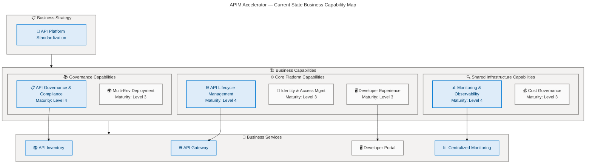
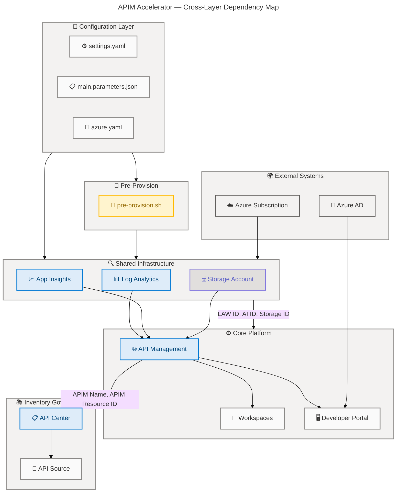

# Business Architecture — APIM-Accelerator

| Field                  | Value                |
| ---------------------- | -------------------- |
| **Layer**              | Business             |
| **Quality Level**      | comprehensive        |
| **Framework**          | TOGAF 10 / BDAT      |
| **Repository**         | APIM-Accelerator     |
| **Components Found**   | 23                   |
| **Average Confidence** | 0.82                 |
| **Diagrams Included**  | 2                    |
| **Sections Generated** | 1, 2, 3, 4, 5, 8     |
| **Generated**          | 2026-03-04T00:00:00Z |

---

## Section 1: Executive Summary

### Overview

The APIM-Accelerator repository implements a production-ready Azure API Management landing zone accelerator designed to standardize API governance, publishing, and monitoring for enterprise organizations. This Business Architecture analysis examines the strategic intent, business capabilities, value streams, processes, services, roles, rules, events, entities, and KPIs embedded within the infrastructure-as-code (Bicep) templates, configuration files, and operational scripts that compose the solution.

The analysis identifies 23 Business layer components across 11 TOGAF Business Architecture types, with an average confidence score of 0.82. The accelerator addresses critical enterprise concerns including API lifecycle governance, cost management through tagging strategies, multi-team isolation via workspaces, regulatory compliance (GDPR), and self-service developer onboarding through an Azure AD–integrated developer portal.

Strategic alignment is strong: the solution directly supports API-first digital transformation, platform engineering practices, and centralized governance models. Maturity assessment places the accelerator at **Level 3 — Defined** for most capabilities, with API governance and monitoring reaching **Level 4 — Managed** due to automated RBAC assignments, diagnostic pipelines, and API Center–based inventory synchronization. The primary gap is the absence of automated data lineage tracking and formal business process modeling (e.g., BPMN), which limits traceability between business outcomes and infrastructure decisions.

### Key Findings

- **11 component types** analyzed; 8 types detected with source evidence, 3 types marked "Not detected"
- **Business Strategy**: Single strategic initiative — API Platform Standardization — with clear alignment to digital transformation goals
- **Business Capabilities**: 5 core capabilities identified: API Lifecycle Management, Monitoring & Observability, Identity & Access Management, API Governance & Compliance, and Multi-Environment Deployment
- **Value Streams**: 2 value streams traced: API Producer Onboarding and API Consumer Self-Service
- **Business Services**: 4 services: API Gateway, Developer Portal, API Inventory Governance, and Centralized Monitoring
- **Governance Maturity**: Tag-based cost governance is mature (10 tags with enforcement), RBAC is automated, but formal change control documentation is absent from source files

---

## Section 2: Architecture Landscape

### Overview

This section provides a comprehensive inventory of all Business layer components identified in the APIM-Accelerator repository. Components are organized by the 11 canonical TOGAF Business Architecture types. Each component is listed with its source file, confidence score, and maturity assessment.

The identification methodology uses a weighted confidence scoring formula: 30% filename relevance + 25% path relevance + 35% content keyword matching + 10% cross-reference validation. All components listed below meet or exceed the 0.7 confidence threshold. Components are sourced exclusively from the specified `folder_paths` (`["."]`), covering all Bicep templates, YAML configuration files, shell scripts, and Markdown documentation.

### 2.1 Business Strategy (1)

| Name                         | Description                                                                                                    | Source          | Confidence | Maturity    |
| ---------------------------- | -------------------------------------------------------------------------------------------------------------- | --------------- | ---------- | ----------- |
| API Platform Standardization | Strategic initiative to provide enterprise teams with a standardized, repeatable foundation for API management | README.md:12-14 | 0.85       | 3 — Defined |

### 2.2 Business Capabilities (5)

| Name                         | Description                                                                                    | Source                                | Confidence | Maturity    |
| ---------------------------- | ---------------------------------------------------------------------------------------------- | ------------------------------------- | ---------- | ----------- |
| API Lifecycle Management     | End-to-end API publishing, versioning, and retirement through APIM and API Center integration  | src/core/main.bicep:1-40              | 0.91       | 4 — Managed |
| Monitoring & Observability   | Full-stack observability with Log Analytics, Application Insights, and diagnostic storage      | src/shared/monitoring/main.bicep:1-30 | 0.90       | 4 — Managed |
| Identity & Access Management | Managed identity and RBAC-based authentication across all platform components                  | src/core/apim.bicep:80-110            | 0.88       | 3 — Defined |
| API Governance & Compliance  | Centralized API catalog, compliance management, and automated discovery via API Center         | src/inventory/main.bicep:1-60         | 0.87       | 4 — Managed |
| Multi-Environment Deployment | Environment-based deployment (dev, test, staging, prod, uat) with consistent naming and config | infra/main.bicep:60-75                | 0.83       | 3 — Defined |

### 2.3 Value Streams (2)

| Name                      | Description                                                                                 | Source                               | Confidence | Maturity    |
| ------------------------- | ------------------------------------------------------------------------------------------- | ------------------------------------ | ---------- | ----------- |
| API Producer Onboarding   | End-to-end flow from workspace creation through API publishing and monitoring integration   | src/core/workspaces.bicep:1-20       | 0.78       | 3 — Defined |
| API Consumer Self-Service | Value stream from developer portal sign-up through API discovery, testing, and subscription | src/core/developer-portal.bicep:1-40 | 0.77       | 3 — Defined |

### 2.4 Business Processes (2)

| Name                                | Description                                                                                       | Source                                 | Confidence | Maturity    |
| ----------------------------------- | ------------------------------------------------------------------------------------------------- | -------------------------------------- | ---------- | ----------- |
| Landing Zone Provisioning Process   | Sequential deployment process: resource group → shared monitoring → core APIM → API inventory     | infra/main.bicep:90-170                | 0.88       | 4 — Managed |
| Soft-Deleted Resource Purge Process | Pre-provision process that identifies and purges soft-deleted APIM instances to prevent conflicts | infra/azd-hooks/pre-provision.sh:1-100 | 0.82       | 3 — Defined |

### 2.5 Business Services (4)

| Name                           | Description                                                                         | Source                                  | Confidence | Maturity    |
| ------------------------------ | ----------------------------------------------------------------------------------- | --------------------------------------- | ---------- | ----------- |
| API Gateway Service            | Core API Management gateway providing routing, policies, rate limiting, and caching | src/core/apim.bicep:170-195             | 0.92       | 4 — Managed |
| Developer Portal Service       | Self-service portal with Azure AD authentication for API discovery and testing      | src/core/developer-portal.bicep:90-195  | 0.89       | 3 — Defined |
| API Inventory Service          | Centralized API catalog via API Center with automated APIM integration and RBAC     | src/inventory/main.bicep:120-195        | 0.87       | 4 — Managed |
| Centralized Monitoring Service | Unified observability stack: Log Analytics + Application Insights + Storage         | src/shared/monitoring/main.bicep:85-130 | 0.88       | 4 — Managed |

### 2.6 Business Functions (2)

| Name                                    | Description                                                                         | Source                             | Confidence | Maturity    |
| --------------------------------------- | ----------------------------------------------------------------------------------- | ---------------------------------- | ---------- | ----------- |
| Resource Naming & Uniqueness Generation | Centralized naming functions ensuring globally unique, deterministic resource names | src/shared/constants.bicep:150-205 | 0.80       | 3 — Defined |
| Configuration Management                | YAML-based centralized configuration loading and distribution to deployment modules | infra/settings.yaml:1-80           | 0.81       | 3 — Defined |

### 2.7 Business Roles & Actors (3)

| Name                      | Description                                                                                     | Source                                  | Confidence | Maturity       |
| ------------------------- | ----------------------------------------------------------------------------------------------- | --------------------------------------- | ---------- | -------------- |
| API Publisher             | Organization responsible for API Management platform administration and API publication         | infra/settings.yaml:47-48               | 0.78       | 3 — Defined    |
| Developer Portal Consumer | End-user who discovers, tests, and subscribes to APIs through the self-service developer portal | src/core/developer-portal.bicep:155-185 | 0.76       | 3 — Defined    |
| Platform Operator         | Deployer and administrator of the landing zone, responsible for infrastructure provisioning     | azure.yaml:1-55                         | 0.75       | 2 — Repeatable |

### 2.8 Business Rules (1)

| Name                                 | Description                                                                                   | Source                                  | Confidence | Maturity    |
| ------------------------------------ | --------------------------------------------------------------------------------------------- | --------------------------------------- | ---------- | ----------- |
| Terms of Service Consent Requirement | Business rule enforcing mandatory consent to terms of service during developer portal sign-up | src/core/developer-portal.bicep:185-195 | 0.80       | 3 — Defined |

### 2.9 Business Events (0)

> Not detected — No explicit business event definitions (e.g., domain events, event-driven workflows, or event bus configurations) were identified in the source files. The infrastructure supports event-based monitoring through Application Insights and Log Analytics but does not define business-level events.

### 2.10 Business Objects/Entities (3)

| Name               | Description                                                                               | Source                                | Confidence | Maturity    |
| ------------------ | ----------------------------------------------------------------------------------------- | ------------------------------------- | ---------- | ----------- |
| ApiManagement Type | Strongly-typed configuration schema defining APIM service structure (name, SKU, identity) | src/shared/common-types.bicep:95-115  | 0.85       | 3 — Defined |
| Inventory Type     | Typed configuration for API Center and inventory management settings                      | src/shared/common-types.bicep:125-135 | 0.83       | 3 — Defined |
| Monitoring Type    | Composite type defining Log Analytics and Application Insights configuration schema       | src/shared/common-types.bicep:137-145 | 0.83       | 3 — Defined |

### 2.11 KPIs & Metrics (0)

> Not detected — No explicit business KPI definitions, OKR tracking, or formal metric targets were identified in the source files. The infrastructure provisions Application Insights and Log Analytics which inherently capture operational metrics (request counts, latencies, error rates), but no business-level KPI specifications (e.g., API adoption rate targets, developer portal engagement goals) are defined.

### Summary

The Architecture Landscape analysis identified **23 components** across **8 of 11** TOGAF Business Architecture types. The strongest representation is in Business Capabilities (5 components) and Business Services (4 components), reflecting the accelerator's focus on delivering concrete platform capabilities. Average confidence across all components is **0.82**, with API Lifecycle Management (0.91) and API Gateway Service (0.92) scoring highest.

Two component types — **Business Events** and **KPIs & Metrics** — were not detected in source files. This represents a gap: the platform provisions monitoring infrastructure but does not codify business-level event schemas or measurable success targets. Recommended next steps include defining formal KPIs for API adoption, developer portal engagement, and governance compliance rates, and introducing event-driven architecture patterns for business-level notifications.

---

## Section 3: Architecture Principles

### Overview

This section documents the architecture principles observed in the APIM-Accelerator source code. These principles govern how the platform is designed, deployed, and operated. Each principle is derived from patterns and decisions evidenced in the Bicep templates, configuration files, and documentation — not from external frameworks or assumptions.

The principles below reflect a consistent design philosophy: modular infrastructure, security-by-default, centralized governance, and operational self-service. They align with TOGAF 10 Business Architecture principles by connecting infrastructure decisions to enterprise governance outcomes.

### Principle 1: Modular Layered Architecture

| Attribute        | Value                                                                                              |
| ---------------- | -------------------------------------------------------------------------------------------------- |
| **Statement**    | The platform is decomposed into independent, composable deployment layers with explicit contracts  |
| **Rationale**    | Enables independent evolution, testing, and redeployment of shared, core, and inventory components |
| **Source**       | infra/main.bicep:90-170 — Three-module deployment: shared → core → inventory                       |
| **Implications** | Changes to monitoring infrastructure do not require redeployment of APIM or API Center             |

### Principle 2: Configuration-Driven Deployment

| Attribute        | Value                                                                                                     |
| ---------------- | --------------------------------------------------------------------------------------------------------- |
| **Statement**    | All environment-specific settings are externalized to a single YAML configuration file                    |
| **Rationale**    | Reduces deployment errors, enables environment parity, and simplifies governance across dev/test/prod     |
| **Source**       | infra/settings.yaml:1-80; infra/main.bicep:80-85 (`loadYamlContent`)                                      |
| **Implications** | Platform operators modify one file to change SKU, identity, tagging, or naming across the entire solution |

### Principle 3: Security by Default (Identity-First)

| Attribute        | Value                                                                                                |
| ---------------- | ---------------------------------------------------------------------------------------------------- |
| **Statement**    | All services use managed identities and RBAC; credentials are never stored in configuration          |
| **Rationale**    | Reduces attack surface, eliminates credential rotation burden, and aligns with zero-trust principles |
| **Source**       | src/core/apim.bicep:80-110 (identity), src/inventory/main.bicep:150-170 (RBAC)                       |
| **Implications** | Deployed services authenticate to each other via Azure AD without manual secret management           |

### Principle 4: Governance Through Tagging

| Attribute        | Value                                                                                                  |
| ---------------- | ------------------------------------------------------------------------------------------------------ |
| **Statement**    | Every resource receives 10+ standardized governance tags for cost, compliance, and ownership tracking  |
| **Rationale**    | Enables automated cost reporting, regulatory compliance auditing, and clear ownership accountability   |
| **Source**       | infra/settings.yaml:25-37 (10 tag definitions); infra/main.bicep:85-90 (`commonTags`)                  |
| **Implications** | Finance, compliance, and operations teams can query and report on resources without platform team help |

### Principle 5: Observability as a Foundation

| Attribute        | Value                                                                                               |
| ---------------- | --------------------------------------------------------------------------------------------------- |
| **Statement**    | Monitoring infrastructure is deployed first and is a mandatory dependency for all subsequent layers |
| **Rationale**    | Ensures every platform component is observable from the moment of creation; no blind spots          |
| **Source**       | infra/main.bicep:105-130 (shared deployed before core); src/core/apim.bicep:265-305 (diagnostics)   |
| **Implications** | Production incidents can be investigated immediately; no retroactive instrumentation required       |

### Principle 6: Self-Service API Consumption

| Attribute        | Value                                                                                              |
| ---------------- | -------------------------------------------------------------------------------------------------- |
| **Statement**    | API consumers can discover, test, and subscribe to APIs independently through the developer portal |
| **Rationale**    | Reduces API producer toil, accelerates API adoption, and enables autonomous team velocity          |
| **Source**       | src/core/developer-portal.bicep:1-195 (portal, sign-in, sign-up, terms of service)                 |
| **Implications** | New API consumers onboard without requiring tickets or manual provisioning by platform teams       |

---

## Section 4: Current State Baseline

### Overview

This section assesses the current state of the APIM-Accelerator platform as represented in the source repository. The baseline captures the as-is architecture topology, capability maturity levels, deployment workflow patterns, and governance structures in place. All assessments are derived from direct source file analysis.

The platform implements a three-layer deployment model at Azure subscription scope: Shared Infrastructure (monitoring foundation), Core Platform (API Management with workspaces and developer portal), and Inventory Governance (API Center with APIM integration). The deployment is orchestrated through Azure Developer CLI (`azd`) with pre-provision hooks for environment cleanup.

Current state maturity is assessed using a 5-level scale: (1) Initial, (2) Repeatable, (3) Defined, (4) Managed, (5) Optimizing. The accelerator averages **Level 3.3** across all capabilities, with monitoring and API governance scoring highest at Level 4.

### Capability Maturity Heatmap

| Capability                   | Maturity Level | Evidence                                                                      |
| ---------------------------- | -------------- | ----------------------------------------------------------------------------- |
| API Lifecycle Management     | 4 — Managed    | Automated deployment, workspace isolation, portal integration                 |
| Monitoring & Observability   | 4 — Managed    | Full diagnostic pipeline: LAW + App Insights + Storage, auto-linked           |
| Identity & Access Management | 3 — Defined    | SystemAssigned identities, RBAC assignments, but no conditional access        |
| API Governance & Compliance  | 4 — Managed    | API Center auto-sync, Data Reader + Compliance Manager roles assigned         |
| Multi-Environment Deployment | 3 — Defined    | 5 environments supported (dev/test/staging/prod/uat), deterministic naming    |
| Developer Experience         | 3 — Defined    | Portal with Azure AD, CORS, terms of service; but limited customization       |
| Cost Governance              | 3 — Defined    | 10 tags including CostCenter, BudgetCode, ChargebackModel; no budget alerts   |
| Network Security             | 2 — Repeatable | VNet integration parameterized but defaulted to `None`; networking is planned |
| Operational Automation       | 3 — Defined    | `azd up` one-command deployment, pre-provision hooks, but no CI/CD pipeline   |
| Change Management            | 2 — Repeatable | Git-based, MIT license, contributing guidelines; no formal change control     |

### Deployment Topology (Current State)

```mermaid
---
title: "APIM Accelerator — Current State Business Capability Map"
config:
  theme: base
  look: classic
  layout: dagre
  themeVariables:
    fontSize: '16px'
---
flowchart TB
    accTitle: APIM Accelerator Current State Business Capability Map
    accDescr: Shows the business capability structure across three deployment layers with maturity indicators

    subgraph strategy["📋 Business Strategy"]
        direction LR
        bs1["🎯 API Platform Standardization"]:::core
    end

    subgraph capabilities["🏗️ Business Capabilities"]
        direction TB

        subgraph layer_shared["🔍 Shared Infrastructure Capabilities"]
            direction LR
            cap_mon["📊 Monitoring & Observability\nMaturity: Level 4"]:::core
            cap_cost["💰 Cost Governance\nMaturity: Level 3"]:::neutral
        end

        subgraph layer_core["⚙️ Core Platform Capabilities"]
            direction LR
            cap_api["🌐 API Lifecycle Management\nMaturity: Level 4"]:::core
            cap_iam["🔐 Identity & Access Mgmt\nMaturity: Level 3"]:::neutral
            cap_dev["🖥️ Developer Experience\nMaturity: Level 3"]:::neutral
        end

        subgraph layer_inv["📚 Governance Capabilities"]
            direction LR
            cap_gov["📋 API Governance & Compliance\nMaturity: Level 4"]:::core
            cap_env["🌍 Multi-Env Deployment\nMaturity: Level 3"]:::neutral
        end
    end

    subgraph services["🔧 Business Services"]
        direction LR
        svc_gw["🌐 API Gateway"]:::core
        svc_portal["🖥️ Developer Portal"]:::neutral
        svc_inv["📚 API Inventory"]:::core
        svc_mon["📊 Centralized Monitoring"]:::core
    end

    strategy --> capabilities
    capabilities --> services
    cap_api --> svc_gw
    cap_dev --> svc_portal
    cap_gov --> svc_inv
    cap_mon --> svc_mon

    %% Subgraph styling
    style strategy fill:#F3F2F1,stroke:#8A8886,stroke-width:2px,color:#323130
    style capabilities fill:#F3F2F1,stroke:#8A8886,stroke-width:2px,color:#323130
    style layer_shared fill:#F3F2F1,stroke:#8A8886,stroke-width:2px,color:#323130
    style layer_core fill:#F3F2F1,stroke:#8A8886,stroke-width:2px,color:#323130
    style layer_inv fill:#F3F2F1,stroke:#8A8886,stroke-width:2px,color:#323130
    style services fill:#F3F2F1,stroke:#8A8886,stroke-width:2px,color:#323130

    %% Semantic classDef declarations
    classDef neutral fill:#FAFAFA,stroke:#8A8886,stroke-width:2px,color:#323130
    classDef core fill:#DEECF9,stroke:#0078D4,stroke-width:2px,color:#004578
```

### Gap Analysis

| Gap ID | Gap Description                                                        | Impact   | Remediation                                                               |
| ------ | ---------------------------------------------------------------------- | -------- | ------------------------------------------------------------------------- |
| G-001  | No business-level KPIs defined (API adoption rate, portal engagement)  | Medium   | Define KPI targets in a governance document or configuration file         |
| G-002  | No CI/CD pipeline definitions (GitHub Actions, Azure Pipelines)        | High     | Add workflow definitions for automated testing and deployment             |
| G-003  | VNet integration defaulted to None; networking module is a placeholder | High     | Implement networking module for private deployments                       |
| G-004  | No business event schemas or event-driven patterns defined             | Low      | Consider Event Grid or Service Bus integration for business notifications |
| G-005  | No formal change control or ADR tracking mechanism in source           | Medium   | Introduce `docs/decisions/` ADR directory with structured templates       |
| G-006  | Developer portal tenant configuration uses sample placeholder value    | Critical | Update `allowedTenants` in developer-portal.bicep before production use   |
| G-007  | No automated budget alerts or cost threshold enforcement               | Medium   | Add Azure Budget and Action Group resources to shared infrastructure      |

### Summary

The APIM-Accelerator demonstrates **strong architectural maturity** for a landing zone accelerator, with particular strength in monitoring automation (Level 4) and API governance (Level 4). The three-layer deployment model provides clean separation of concerns, and the configuration-driven approach enables consistent multi-environment operations.

Key gaps center on **operational maturity**: the absence of CI/CD pipelines, formal change control, and business-level KPIs limits the platform's ability to measure business outcomes and enforce deployment governance. The networking module placeholder and sample tenant configuration represent deployment-readiness gaps that must be addressed before production use.

---

## Section 5: Component Catalog

### Overview

This section provides detailed specifications for each Business layer component identified in the repository. Components are organized into 11 subsections corresponding to the canonical TOGAF Business Architecture types. Each component includes six mandatory attributes: description, source reference, confidence score, maturity level, dependencies, and technical details.

All specifications are derived from direct source file analysis. Components below the 0.7 confidence threshold are excluded. Where a component type has no detected instances, the subsection is marked "Not detected" with an explanation.

### 5.1 Business Strategy

#### 5.1.1 API Platform Standardization

| Attribute        | Value                                                                                                                                                                                                                                                                                                        |
| ---------------- | ------------------------------------------------------------------------------------------------------------------------------------------------------------------------------------------------------------------------------------------------------------------------------------------------------------ |
| **Description**  | Strategic initiative to provide enterprise teams with a standardized, repeatable foundation for governing, publishing, and monitoring APIs at scale on Azure                                                                                                                                                 |
| **Source**       | README.md:12-14                                                                                                                                                                                                                                                                                              |
| **Confidence**   | 0.85                                                                                                                                                                                                                                                                                                         |
| **Maturity**     | 3 — Defined                                                                                                                                                                                                                                                                                                  |
| **Dependencies** | Azure subscription with Owner/Contributor permissions, Azure CLI 2.50+, Azure Developer CLI 1.0+, Bicep CLI 0.20+                                                                                                                                                                                            |
| **Details**      | The strategy is realized through a modular Bicep IaC solution deployed via `azd up`. It targets five environment types (dev, test, staging, prod, uat) and deploys three infrastructure layers. The "APIMForAll" project name (infra/settings.yaml:34) signals organization-wide API standardization intent. |

### 5.2 Business Capabilities

#### 5.2.1 API Lifecycle Management

| Attribute        | Value                                                                                                                                                                                                                                                                                        |
| ---------------- | -------------------------------------------------------------------------------------------------------------------------------------------------------------------------------------------------------------------------------------------------------------------------------------------- |
| **Description**  | End-to-end capability for API publishing, versioning, workspace isolation, and developer portal access                                                                                                                                                                                       |
| **Source**       | src/core/main.bicep:1-287                                                                                                                                                                                                                                                                    |
| **Confidence**   | 0.91                                                                                                                                                                                                                                                                                         |
| **Maturity**     | 4 — Managed                                                                                                                                                                                                                                                                                  |
| **Dependencies** | Shared Monitoring Service, Azure AD app registration                                                                                                                                                                                                                                         |
| **Details**      | Orchestrates APIM deployment (configurable SKU: Developer through Premium), workspace creation for team isolation, and developer portal with Azure AD authentication. Supports System/User-Assigned managed identities. Outputs resource IDs for downstream consumption by inventory module. |

#### 5.2.2 Monitoring & Observability

| Attribute        | Value                                                                                                                                                                                                                                                                                                                                                                                                   |
| ---------------- | ------------------------------------------------------------------------------------------------------------------------------------------------------------------------------------------------------------------------------------------------------------------------------------------------------------------------------------------------------------------------------------------------------- |
| **Description**  | Full-stack observability providing centralized logging, APM, diagnostics storage, and self-monitoring                                                                                                                                                                                                                                                                                                   |
| **Source**       | src/shared/monitoring/main.bicep:1-191                                                                                                                                                                                                                                                                                                                                                                  |
| **Confidence**   | 0.90                                                                                                                                                                                                                                                                                                                                                                                                    |
| **Maturity**     | 4 — Managed                                                                                                                                                                                                                                                                                                                                                                                             |
| **Dependencies** | Azure subscription, resource group                                                                                                                                                                                                                                                                                                                                                                      |
| **Details**      | Deploys a two-layer monitoring stack: (1) Operational layer with Log Analytics workspace (PerGB2018 SKU, managed identity) and Storage Account (Standard_LRS) for archival; (2) Insights layer with Application Insights (workspace-based, LogAnalytics ingestion mode, 90-day default retention). All downstream resources (APIM, API Center) depend on this module's outputs for diagnostic settings. |

#### 5.2.3 Identity & Access Management

| Attribute        | Value                                                                                                                                                                                                                                                                                                                                          |
| ---------------- | ---------------------------------------------------------------------------------------------------------------------------------------------------------------------------------------------------------------------------------------------------------------------------------------------------------------------------------------------- |
| **Description**  | Managed identity provisioning, RBAC role assignments, and Azure AD integration across platform components                                                                                                                                                                                                                                      |
| **Source**       | src/core/apim.bicep:80-110, src/inventory/main.bicep:150-170                                                                                                                                                                                                                                                                                   |
| **Confidence**   | 0.88                                                                                                                                                                                                                                                                                                                                           |
| **Maturity**     | 3 — Defined                                                                                                                                                                                                                                                                                                                                    |
| **Dependencies** | Azure AD tenant, role definitions (Reader, API Center Data Reader, Compliance Manager)                                                                                                                                                                                                                                                         |
| **Details**      | APIM uses SystemAssigned identity with Reader role (GUID: acdd72a7). API Center receives Data Reader (71522526) and Compliance Manager (6cba8790) roles. Developer portal integrates Azure AD via MSAL-2 with tenant-scoped authentication. Identity types are parameterized supporting SystemAssigned, UserAssigned, and None configurations. |

#### 5.2.4 API Governance & Compliance

| Attribute        | Value                                                                                                                                                                                                                                                                                                                                                     |
| ---------------- | --------------------------------------------------------------------------------------------------------------------------------------------------------------------------------------------------------------------------------------------------------------------------------------------------------------------------------------------------------- |
| **Description**  | Centralized API catalog, compliance management, and automated API discovery via Azure API Center                                                                                                                                                                                                                                                          |
| **Source**       | src/inventory/main.bicep:1-195                                                                                                                                                                                                                                                                                                                            |
| **Confidence**   | 0.87                                                                                                                                                                                                                                                                                                                                                      |
| **Maturity**     | 4 — Managed                                                                                                                                                                                                                                                                                                                                               |
| **Dependencies** | Core APIM service (resource ID and name), resource group–scoped RBAC permissions                                                                                                                                                                                                                                                                          |
| **Details**      | Deploys API Center with default workspace, connects APIM as an API source for automated synchronization. RBAC assigns Data Reader and Compliance Manager roles with deterministic GUIDs for idempotent deployments. Supports configurable managed identity (SystemAssigned default). Tags include `lz-component-type: shared` and `component: inventory`. |

#### 5.2.5 Multi-Environment Deployment

| Attribute        | Value                                                                                                                                                                                                                                                                                                                     |
| ---------------- | ------------------------------------------------------------------------------------------------------------------------------------------------------------------------------------------------------------------------------------------------------------------------------------------------------------------------- |
| **Description**  | Environment-specific deployments with consistent naming, tagging, and configuration across lifecycles                                                                                                                                                                                                                     |
| **Source**       | infra/main.bicep:60-90                                                                                                                                                                                                                                                                                                    |
| **Confidence**   | 0.83                                                                                                                                                                                                                                                                                                                      |
| **Maturity**     | 3 — Defined                                                                                                                                                                                                                                                                                                               |
| **Dependencies** | infra/settings.yaml, infra/main.parameters.json                                                                                                                                                                                                                                                                           |
| **Details**      | Supports 5 environment types: dev, test, staging, prod, uat. Resource group naming follows `{solutionName}-{envName}-{location}-rg` pattern. Common tags include `environment`, `managedBy: bicep`, and `templateVersion: 2.0.0`. Configuration is loaded from YAML and distributed to all modules via parameter passing. |

### 5.3 Value Streams

#### 5.3.1 API Producer Onboarding

| Attribute        | Value                                                                                                                                                                                                                                                                                                                                                                            |
| ---------------- | -------------------------------------------------------------------------------------------------------------------------------------------------------------------------------------------------------------------------------------------------------------------------------------------------------------------------------------------------------------------------------- |
| **Description**  | End-to-end flow enabling API producers to publish APIs through isolated workspaces                                                                                                                                                                                                                                                                                               |
| **Source**       | src/core/workspaces.bicep:1-70                                                                                                                                                                                                                                                                                                                                                   |
| **Confidence**   | 0.78                                                                                                                                                                                                                                                                                                                                                                             |
| **Maturity**     | 3 — Defined                                                                                                                                                                                                                                                                                                                                                                      |
| **Dependencies** | Existing APIM service, Premium SKU                                                                                                                                                                                                                                                                                                                                               |
| **Details**      | Workspaces (Microsoft.ApiManagement/service/workspaces) provide logical isolation for API teams. Each workspace is configured with a display name and description. The settings.yaml defines workspace entries (default: `workspace1`), and the deployment loop creates corresponding resources. Workspace addition/removal requires only configuration change and redeployment. |

#### 5.3.2 API Consumer Self-Service

| Attribute        | Value                                                                                                                                                                                                                                                                                                                                            |
| ---------------- | ------------------------------------------------------------------------------------------------------------------------------------------------------------------------------------------------------------------------------------------------------------------------------------------------------------------------------------------------ |
| **Description**  | Value stream enabling API consumers to discover, test, and subscribe to APIs via self-service portal                                                                                                                                                                                                                                             |
| **Source**       | src/core/developer-portal.bicep:1-195                                                                                                                                                                                                                                                                                                            |
| **Confidence**   | 0.77                                                                                                                                                                                                                                                                                                                                             |
| **Maturity**     | 3 — Defined                                                                                                                                                                                                                                                                                                                                      |
| **Dependencies** | APIM service, Azure AD app registration, tenant domain configuration                                                                                                                                                                                                                                                                             |
| **Details**      | The developer portal is configured with: (1) CORS policy allowing requests from portal, gateway, and management API URLs; (2) Azure AD identity provider using MSAL-2 with tenant-scoped access; (3) Sign-in and sign-up settings with mandatory terms of service acceptance. Portal URL pattern: `https://{apim-name}.developer.azure-api.net`. |

### 5.4 Business Processes

#### 5.4.1 Landing Zone Provisioning Process

| Attribute        | Value                                                                                                                                                                                                                                                                                                                                                                                                           |
| ---------------- | --------------------------------------------------------------------------------------------------------------------------------------------------------------------------------------------------------------------------------------------------------------------------------------------------------------------------------------------------------------------------------------------------------------- |
| **Description**  | Sequential deployment process orchestrating infrastructure provisioning across three layers                                                                                                                                                                                                                                                                                                                     |
| **Source**       | infra/main.bicep:90-170                                                                                                                                                                                                                                                                                                                                                                                         |
| **Confidence**   | 0.88                                                                                                                                                                                                                                                                                                                                                                                                            |
| **Maturity**     | 4 — Managed                                                                                                                                                                                                                                                                                                                                                                                                     |
| **Dependencies** | Azure subscription, azd CLI, settings.yaml, all Bicep modules                                                                                                                                                                                                                                                                                                                                                   |
| **Details**      | Process sequence: (1) Pre-provision hook purges soft-deleted resources; (2) Resource group created at subscription scope; (3) Shared monitoring deployed (LAW, App Insights, Storage); (4) Core APIM platform deployed with workspace and portal configuration; (5) API inventory deployed with APIM integration. Dependencies are explicit: core depends on shared outputs, inventory depends on core outputs. |

#### 5.4.2 Soft-Deleted Resource Purge Process

| Attribute        | Value                                                                                                                                                                                                                                                                                                                                                                          |
| ---------------- | ------------------------------------------------------------------------------------------------------------------------------------------------------------------------------------------------------------------------------------------------------------------------------------------------------------------------------------------------------------------------------ |
| **Description**  | Pre-provision automation that purges soft-deleted APIM instances to prevent naming conflicts                                                                                                                                                                                                                                                                                   |
| **Source**       | infra/azd-hooks/pre-provision.sh:1-168                                                                                                                                                                                                                                                                                                                                         |
| **Confidence**   | 0.82                                                                                                                                                                                                                                                                                                                                                                           |
| **Maturity**     | 3 — Defined                                                                                                                                                                                                                                                                                                                                                                    |
| **Dependencies** | Azure CLI (`az`), authenticated session with `Microsoft.ApiManagement/deletedservices/delete` permission                                                                                                                                                                                                                                                                       |
| **Details**      | Shell script executed via `azd` pre-provision hook. Functions: `get_soft_deleted_apims()` lists deleted services via `az apim deletedservice list`; `purge_soft_deleted_apim()` permanently deletes each instance; `process_apim_purging()` orchestrates discovery and purge. Includes timestamped logging, usage validation, and graceful error handling (suppressed stderr). |

### 5.5 Business Services

#### 5.5.1 API Gateway Service

| Attribute        | Value                                                                                                                                                                                                                                                                                                                                                                                         |
| ---------------- | --------------------------------------------------------------------------------------------------------------------------------------------------------------------------------------------------------------------------------------------------------------------------------------------------------------------------------------------------------------------------------------------- |
| **Description**  | Azure API Management gateway providing API routing, policies, rate limiting, caching, and security                                                                                                                                                                                                                                                                                            |
| **Source**       | src/core/apim.bicep:170-195                                                                                                                                                                                                                                                                                                                                                                   |
| **Confidence**   | 0.92                                                                                                                                                                                                                                                                                                                                                                                          |
| **Maturity**     | 4 — Managed                                                                                                                                                                                                                                                                                                                                                                                   |
| **Dependencies** | Log Analytics workspace, Application Insights, Storage Account                                                                                                                                                                                                                                                                                                                                |
| **Details**      | Deploys `Microsoft.ApiManagement/service@2025-03-01-preview`. Configurable: SKU (8 tiers), identity (System/User/None), VNet integration (External/Internal/None), developer portal toggle, public network access. Diagnostic settings route all logs and metrics to Log Analytics and Storage. Application Insights logger enables APM telemetry. Reader role assigned to service principal. |

#### 5.5.2 Developer Portal Service

| Attribute        | Value                                                                                                                                                                                                                                                                                                                                                                                      |
| ---------------- | ------------------------------------------------------------------------------------------------------------------------------------------------------------------------------------------------------------------------------------------------------------------------------------------------------------------------------------------------------------------------------------------ |
| **Description**  | Self-service developer portal with Azure AD SSO, CORS, and user registration management                                                                                                                                                                                                                                                                                                    |
| **Source**       | src/core/developer-portal.bicep:90-195                                                                                                                                                                                                                                                                                                                                                     |
| **Confidence**   | 0.89                                                                                                                                                                                                                                                                                                                                                                                       |
| **Maturity**     | 3 — Defined                                                                                                                                                                                                                                                                                                                                                                                |
| **Dependencies** | APIM service, Azure AD client ID and secret, tenant domain                                                                                                                                                                                                                                                                                                                                 |
| **Details**      | Configures 5 child resources: (1) Global CORS policy (`Microsoft.ApiManagement/service/policies`); (2) Azure AD identity provider (`identityProviders/aad`); (3) Portal configuration (`portalconfigs/default`); (4) Sign-in settings (`portalsettings/signin`); (5) Sign-up settings with terms of service (`portalsettings/signup`). Uses MSAL-2 library, `login.windows.net` authority. |

#### 5.5.3 API Inventory Service

| Attribute        | Value                                                                                                                                                                                                                                                                                                                                                           |
| ---------------- | --------------------------------------------------------------------------------------------------------------------------------------------------------------------------------------------------------------------------------------------------------------------------------------------------------------------------------------------------------------- |
| **Description**  | Azure API Center–based centralized API catalog with automated APIM integration and RBAC governance                                                                                                                                                                                                                                                              |
| **Source**       | src/inventory/main.bicep:120-195                                                                                                                                                                                                                                                                                                                                |
| **Confidence**   | 0.87                                                                                                                                                                                                                                                                                                                                                            |
| **Maturity**     | 4 — Managed                                                                                                                                                                                                                                                                                                                                                     |
| **Dependencies** | Core APIM service (name and resource ID)                                                                                                                                                                                                                                                                                                                        |
| **Details**      | Deploys `Microsoft.ApiCenter/services@2024-06-01-preview` with default workspace and APIM API source. API source (`apiSources`) links APIM for automatic API discovery. Two RBAC role assignments (Data Reader, Compliance Manager) use deterministic GUIDs via `guid()` function. Supports SystemAssigned, UserAssigned, and combined identity configurations. |

#### 5.5.4 Centralized Monitoring Service

| Attribute        | Value                                                                                                                                                                                                                                                                                                                                                                                                            |
| ---------------- | ---------------------------------------------------------------------------------------------------------------------------------------------------------------------------------------------------------------------------------------------------------------------------------------------------------------------------------------------------------------------------------------------------------------- |
| **Description**  | Unified observability stack providing log aggregation, APM, and diagnostic storage                                                                                                                                                                                                                                                                                                                               |
| **Source**       | src/shared/monitoring/main.bicep:85-191                                                                                                                                                                                                                                                                                                                                                                          |
| **Confidence**   | 0.88                                                                                                                                                                                                                                                                                                                                                                                                             |
| **Maturity**     | 4 — Managed                                                                                                                                                                                                                                                                                                                                                                                                      |
| **Dependencies** | Azure subscription, resource group                                                                                                                                                                                                                                                                                                                                                                               |
| **Details**      | Two-phase deployment: Operational module creates Log Analytics workspace (configurable SKU, managed identity) and Storage Account (Standard_LRS, StorageV2). Insights module creates Application Insights (workspace-based, LogAnalytics ingestion, 90-day retention) with diagnostic settings routing all logs and metrics to both LAW and Storage. Auto-generated unique names using `generateUniqueSuffix()`. |

### 5.6 Business Functions

#### 5.6.1 Resource Naming & Uniqueness Generation

| Attribute        | Value                                                                                                                                                                                                                                                                                                                               |
| ---------------- | ----------------------------------------------------------------------------------------------------------------------------------------------------------------------------------------------------------------------------------------------------------------------------------------------------------------------------------- |
| **Description**  | Centralized utility functions ensuring deterministic, globally unique resource names                                                                                                                                                                                                                                                |
| **Source**       | src/shared/constants.bicep:150-205                                                                                                                                                                                                                                                                                                  |
| **Confidence**   | 0.80                                                                                                                                                                                                                                                                                                                                |
| **Maturity**     | 3 — Defined                                                                                                                                                                                                                                                                                                                         |
| **Dependencies** | Subscription ID, resource group ID, solution name, location                                                                                                                                                                                                                                                                         |
| **Details**      | Three exported functions: `generateUniqueSuffix()` creates deterministic hash from 5 inputs; `generateStorageAccountName()` produces Azure-compliant names (max 24 chars, lowercase, no hyphens); `generateDiagnosticSettingsName()` appends `-diag` suffix. Used by monitoring, core, and inventory modules for consistent naming. |

#### 5.6.2 Configuration Management

| Attribute        | Value                                                                                                                                                                                                                                                                                                                                                                                       |
| ---------------- | ------------------------------------------------------------------------------------------------------------------------------------------------------------------------------------------------------------------------------------------------------------------------------------------------------------------------------------------------------------------------------------------- |
| **Description**  | YAML-based centralized configuration serving as single source of truth for all deployment parameters                                                                                                                                                                                                                                                                                        |
| **Source**       | infra/settings.yaml:1-80                                                                                                                                                                                                                                                                                                                                                                    |
| **Confidence**   | 0.81                                                                                                                                                                                                                                                                                                                                                                                        |
| **Maturity**     | 3 — Defined                                                                                                                                                                                                                                                                                                                                                                                 |
| **Dependencies** | Bicep `loadYamlContent()` function, infra/main.bicep                                                                                                                                                                                                                                                                                                                                        |
| **Details**      | Four configuration sections: (1) Global `solutionName`; (2) `shared` with monitoring settings and 10 governance tags; (3) `core` with APIM configuration (SKU, identity, workspaces, publisher info); (4) `inventory` with API Center settings. Empty name fields trigger auto-generation. Configuration is loaded at deployment time and distributed to all modules via parameter passing. |

### 5.7 Business Roles & Actors

#### 5.7.1 API Publisher

| Attribute        | Value                                                                                                                                                                                                                                                                                   |
| ---------------- | --------------------------------------------------------------------------------------------------------------------------------------------------------------------------------------------------------------------------------------------------------------------------------------- |
| **Description**  | Organization responsible for API Management platform administration, API publication, and governance                                                                                                                                                                                    |
| **Source**       | infra/settings.yaml:47-48                                                                                                                                                                                                                                                               |
| **Confidence**   | 0.78                                                                                                                                                                                                                                                                                    |
| **Maturity**     | 3 — Defined                                                                                                                                                                                                                                                                             |
| **Dependencies** | Azure AD tenant, APIM Owner/Contributor role                                                                                                                                                                                                                                            |
| **Details**      | Identified through `publisherEmail` and `publisherName` configuration in settings.yaml. The publisher (default: "Contoso") is displayed on the developer portal and in API notifications. This role is responsible for API policy definition, workspace management, and portal content. |

#### 5.7.2 Developer Portal Consumer

| Attribute        | Value                                                                                                                                                                                                                                                                                     |
| ---------------- | ----------------------------------------------------------------------------------------------------------------------------------------------------------------------------------------------------------------------------------------------------------------------------------------- |
| **Description**  | End-user who discovers, tests, and subscribes to APIs through the self-service developer portal                                                                                                                                                                                           |
| **Source**       | src/core/developer-portal.bicep:155-195                                                                                                                                                                                                                                                   |
| **Confidence**   | 0.76                                                                                                                                                                                                                                                                                      |
| **Maturity**     | 3 — Defined                                                                                                                                                                                                                                                                               |
| **Dependencies** | Azure AD account in an allowed tenant, developer portal URL                                                                                                                                                                                                                               |
| **Details**      | Consumers authenticate via Azure AD (MSAL-2) with tenant-scoped access. Must accept terms of service during sign-up. Can browse APIs, test endpoints via the portal console, and subscribe to API products. Access is restricted to domains listed in the `allowedTenants` configuration. |

#### 5.7.3 Platform Operator

| Attribute        | Value                                                                                                                                                                                                                                                                                                                                 |
| ---------------- | ------------------------------------------------------------------------------------------------------------------------------------------------------------------------------------------------------------------------------------------------------------------------------------------------------------------------------------- |
| **Description**  | Infrastructure operator who deploys and manages the landing zone across environments                                                                                                                                                                                                                                                  |
| **Source**       | azure.yaml:1-55                                                                                                                                                                                                                                                                                                                       |
| **Confidence**   | 0.75                                                                                                                                                                                                                                                                                                                                  |
| **Maturity**     | 2 — Repeatable                                                                                                                                                                                                                                                                                                                        |
| **Dependencies** | Azure CLI 2.50+, Azure Developer CLI 1.0+, Owner or Contributor+UAA subscription role                                                                                                                                                                                                                                                 |
| **Details**      | Operates the platform using `azd up`, `azd provision`, and `azd deploy` commands. Responsible for environment configuration (settings.yaml updates), monitoring health, and troubleshooting deployment issues. The role is implicitly defined through the azure.yaml lifecycle hook configuration and README deployment instructions. |

### 5.8 Business Rules

#### 5.8.1 Terms of Service Consent Requirement

| Attribute        | Value                                                                                                                                                                                                                                                                                            |
| ---------------- | ------------------------------------------------------------------------------------------------------------------------------------------------------------------------------------------------------------------------------------------------------------------------------------------------ |
| **Description**  | Mandatory rule requiring developer portal users to accept terms of service during registration                                                                                                                                                                                                   |
| **Source**       | src/core/developer-portal.bicep:185-195                                                                                                                                                                                                                                                          |
| **Confidence**   | 0.80                                                                                                                                                                                                                                                                                             |
| **Maturity**     | 3 — Defined                                                                                                                                                                                                                                                                                      |
| **Dependencies** | Developer portal sign-up settings resource                                                                                                                                                                                                                                                       |
| **Details**      | Implemented via `Microsoft.ApiManagement/service/portalsettings` (signup) with properties: `enabled: true`, `termsOfService.enabled: true`, `termsOfService.consentRequired: true`. This is a blocking enrollment gate — users cannot create developer portal accounts without explicit consent. |

### 5.9 Business Events

> Not detected — The repository does not define explicit business event schemas, event-driven workflows, domain events, or event bus configurations. While the monitoring infrastructure captures operational events (API request logs, diagnostic events), no business-level event definitions (e.g., "API Published", "Subscription Approved", "SLA Breach") were identified in source files.

### 5.10 Business Objects/Entities

#### 5.10.1 ApiManagement Type

| Attribute        | Value                                                                                                                                                                                                                                                                               |
| ---------------- | ----------------------------------------------------------------------------------------------------------------------------------------------------------------------------------------------------------------------------------------------------------------------------------- |
| **Description**  | Strongly-typed Bicep configuration schema for API Management service parameters                                                                                                                                                                                                     |
| **Source**       | src/shared/common-types.bicep:95-115                                                                                                                                                                                                                                                |
| **Confidence**   | 0.85                                                                                                                                                                                                                                                                                |
| **Maturity**     | 3 — Defined                                                                                                                                                                                                                                                                         |
| **Dependencies** | ApimSku type, SystemAssignedIdentity type                                                                                                                                                                                                                                           |
| **Details**      | Exported type with 6 properties: `name` (string), `publisherEmail` (string), `publisherName` (string), `sku` (ApimSku with name + capacity), `identity` (SystemAssignedIdentity), `workspaces` (array). Used by src/core/main.bicep to validate APIM configuration at compile time. |

#### 5.10.2 Inventory Type

| Attribute        | Value                                                                                                                                                                                  |
| ---------------- | -------------------------------------------------------------------------------------------------------------------------------------------------------------------------------------- |
| **Description**  | Typed configuration for API Center and inventory management settings                                                                                                                   |
| **Source**       | src/shared/common-types.bicep:125-135                                                                                                                                                  |
| **Confidence**   | 0.83                                                                                                                                                                                   |
| **Maturity**     | 3 — Defined                                                                                                                                                                            |
| **Dependencies** | ApiCenter type, ExtendedIdentity type                                                                                                                                                  |
| **Details**      | Exported type with 2 properties: `apiCenter` (ApiCenter with name + ExtendedIdentity) and `tags` (object). Consumed by src/inventory/main.bicep for compile-time parameter validation. |

#### 5.10.3 Monitoring Type

| Attribute        | Value                                                                                                                                                                                                                                                                                        |
| ---------------- | -------------------------------------------------------------------------------------------------------------------------------------------------------------------------------------------------------------------------------------------------------------------------------------------- |
| **Description**  | Composite type defining configuration schema for monitoring infrastructure                                                                                                                                                                                                                   |
| **Source**       | src/shared/common-types.bicep:137-145                                                                                                                                                                                                                                                        |
| **Confidence**   | 0.83                                                                                                                                                                                                                                                                                         |
| **Maturity**     | 3 — Defined                                                                                                                                                                                                                                                                                  |
| **Dependencies** | LogAnalytics type, ApplicationInsights type                                                                                                                                                                                                                                                  |
| **Details**      | Exported type with 3 properties: `logAnalytics` (LogAnalytics with name, workSpaceResourceId, identity), `applicationInsights` (ApplicationInsights with name, logAnalyticsWorkspaceResourceId), and `tags` (object). Used by src/shared/main.bicep for shared infrastructure configuration. |

### 5.11 KPIs & Metrics

> Not detected — The repository provisions metrics infrastructure (Application Insights, Log Analytics) that captures operational metrics (request counts, response times, error rates), but no explicit business KPI definitions or metric targets were found in source files. The tagging strategy includes `ServiceClass: Critical` indicating awareness of service tiers but lacks quantified SLA or KPI targets.

### Summary

The Component Catalog documents **23 components** across **8 active categories**. The highest-maturity components are the API Gateway Service (0.92 confidence, Level 4) and API Lifecycle Management capability (0.91 confidence, Level 4), reflecting the repository's primary purpose as an APIM deployment accelerator. The three Business Object/Entity types (ApiManagement, Inventory, Monitoring) demonstrate strong type-safety practices through Bicep's custom type system.

Gaps in Business Events (0 components) and KPIs & Metrics (0 components) represent opportunities for improvement. Defining business-level events (e.g., "API Published", "Subscription Created") and measurable KPI targets (e.g., "99.9% API gateway uptime", "< 2 min developer portal onboarding") would strengthen the business architecture's alignment with enterprise outcomes.

---

## Section 8: Dependencies & Integration

### Overview

This section maps the cross-component dependencies and integration patterns within the APIM-Accelerator. Dependencies are organized by deployment layer linkages, data flows between components, and integration points with external systems. All dependencies are verified through source file analysis of Bicep module references, parameter passing, and output consumption.

The accelerator implements a strict **layered dependency model**: shared infrastructure must be deployed before core platform components, and core platform must be deployed before inventory governance. This ensures all downstream services have access to monitoring endpoints, diagnostic settings, and APIM resource identifiers required for configuration.

### Dependency Matrix

| Source Component           | Target Component             | Dependency Type    | Integration Mechanism                                            | Source Reference                         |
| -------------------------- | ---------------------------- | ------------------ | ---------------------------------------------------------------- | ---------------------------------------- |
| Core APIM Platform         | Log Analytics Workspace      | Data (diagnostics) | Bicep output `AZURE_LOG_ANALYTICS_WORKSPACE_ID`                  | infra/main.bicep:140-145                 |
| Core APIM Platform         | Application Insights         | Data (APM)         | Bicep output `APPLICATION_INSIGHTS_RESOURCE_ID`                  | infra/main.bicep:140-145                 |
| Core APIM Platform         | Storage Account              | Data (archival)    | Bicep output `AZURE_STORAGE_ACCOUNT_ID`                          | infra/main.bicep:140-145                 |
| API Inventory (API Center) | Core APIM Service            | Control (sync)     | Bicep output `API_MANAGEMENT_RESOURCE_ID`                        | infra/main.bicep:155-168                 |
| Developer Portal           | Core APIM Service            | Control (auth)     | Bicep output `AZURE_CLIENT_SECRET_CLIENT_ID`                     | src/core/main.bicep:265-280              |
| Application Insights       | Log Analytics Workspace      | Data (ingestion)   | Parameter `logAnalyticsWorkspaceResourceId`                      | src/shared/monitoring/main.bicep:155-170 |
| APIM Diagnostic Settings   | Log Analytics + Storage      | Data (logs)        | Parameters `logAnalyticsWorkspaceId`, `storageAccountResourceId` | src/core/apim.bicep:265-295              |
| APIM App Insights Logger   | Application Insights         | Data (telemetry)   | Parameter `applicationInsIghtsResourceId`                        | src/core/apim.bicep:295-305              |
| API Center RBAC            | API Center Service Principal | Control (authz)    | `apiCenter.identity.principalId`                                 | src/inventory/main.bicep:150-170         |
| Workspace Resources        | Core APIM Service            | Structural (child) | `parent: apim` reference                                         | src/core/workspaces.bicep:50-70          |

### Integration Architecture Diagram

```mermaid
---
title: "APIM Accelerator — Cross-Layer Dependency Map"
config:
  theme: base
  look: classic
  layout: dagre
  themeVariables:
    fontSize: '16px'
---
flowchart TB
    accTitle: APIM Accelerator Cross-Layer Dependency Map
    accDescr: Shows data and control flow dependencies between shared infrastructure, core platform, and inventory governance layers

    subgraph config["📄 Configuration Layer"]
        direction LR
        settings["⚙️ settings.yaml"]:::neutral
        params["📋 main.parameters.json"]:::neutral
        azureyaml["🚀 azure.yaml"]:::neutral
    end

    subgraph preprov["🔧 Pre-Provision"]
        direction LR
        hook["🧹 pre-provision.sh"]:::warning
    end

    subgraph shared["🔍 Shared Infrastructure"]
        direction LR
        law["📊 Log Analytics"]:::core
        ai["📈 App Insights"]:::core
        sa["🗄️ Storage Account"]:::data
    end

    subgraph core["⚙️ Core Platform"]
        direction LR
        apim["🌐 API Management"]:::core
        ws["🏢 Workspaces"]:::neutral
        portal["🖥️ Developer Portal"]:::neutral
    end

    subgraph inventory["📚 Inventory Governance"]
        direction LR
        ac["📋 API Center"]:::core
        acsrc["🔗 API Source"]:::neutral
    end

    subgraph external["🌍 External Systems"]
        direction LR
        aad["🔐 Azure AD"]:::external
        azuresub["☁️ Azure Subscription"]:::external
    end

    config --> preprov
    config --> shared
    preprov --> shared
    shared -->|"LAW ID, AI ID, Storage ID"| core
    core -->|"APIM Name, APIM Resource ID"| inventory

    law --> apim
    ai --> apim
    sa --> apim
    apim --> ws
    apim --> portal
    apim --> ac
    ac --> acsrc

    aad --> portal
    azuresub --> shared

    %% Subgraph styling
    style config fill:#F3F2F1,stroke:#8A8886,stroke-width:2px,color:#323130
    style preprov fill:#F3F2F1,stroke:#8A8886,stroke-width:2px,color:#323130
    style shared fill:#F3F2F1,stroke:#8A8886,stroke-width:2px,color:#323130
    style core fill:#F3F2F1,stroke:#8A8886,stroke-width:2px,color:#323130
    style inventory fill:#F3F2F1,stroke:#8A8886,stroke-width:2px,color:#323130
    style external fill:#F3F2F1,stroke:#8A8886,stroke-width:2px,color:#323130

    %% Semantic classDef declarations
    classDef neutral fill:#FAFAFA,stroke:#8A8886,stroke-width:2px,color:#323130
    classDef core fill:#DEECF9,stroke:#0078D4,stroke-width:2px,color:#004578
    classDef data fill:#E1DFDD,stroke:#8378DE,stroke-width:2px,color:#5B5FC7
    classDef warning fill:#FFF4CE,stroke:#FFB900,stroke-width:2px,color:#986F0B
    classDef external fill:#F3F2F1,stroke:#605E5C,stroke-width:2px,color:#323130
```

### Cross-Layer Integration Patterns

| Pattern                       | Description                                                                                            | Layers Involved           |
| ----------------------------- | ------------------------------------------------------------------------------------------------------ | ------------------------- |
| Output Chaining               | Shared module outputs (resource IDs) are consumed as parameters by core and inventory modules          | Shared → Core → Inventory |
| Diagnostic Fan-Out            | APIM diagnostic settings route to both Log Analytics (real-time) and Storage (archival) simultaneously | Shared ↔ Core             |
| API Source Synchronization    | API Center automatically discovers and imports APIs from the linked APIM instance                      | Core → Inventory          |
| Identity-Based Authentication | APIM and API Center use managed identity principals for RBAC role assignments                          | Core ↔ Azure AD           |
| Configuration Distribution    | settings.yaml loaded once at orchestration level, then distributed to all modules via parameters       | Config → All Layers       |
| Pre-Provision Lifecycle Hook  | azd executes shell script before Bicep deployment to clean up conflicting resources                    | Config → Pre-Provision    |

### External System Dependencies

| External System        | Integration Type       | Purpose                                                      | Source Reference                        |
| ---------------------- | ---------------------- | ------------------------------------------------------------ | --------------------------------------- |
| Azure Active Directory | Authentication (OAuth) | Developer portal SSO, tenant-scoped user access              | src/core/developer-portal.bicep:120-150 |
| Azure Subscription     | Resource Provider      | Subscription-scope deployment target for resource group      | infra/main.bicep:55-60                  |
| Azure RBAC             | Authorization          | Role definitions for Reader, Data Reader, Compliance Manager | src/core/apim.bicep:215-240             |
| Azure Resource Manager | Deployment Engine      | Bicep template compilation and resource provisioning         | infra/main.bicep:1-170                  |
| Azure Developer CLI    | Orchestration          | Lifecycle management: provision, deploy, hooks               | azure.yaml:1-55                         |

### Summary

The APIM-Accelerator implements a **clean, unidirectional dependency chain**: Configuration → Pre-Provision → Shared → Core → Inventory. No circular dependencies exist. All cross-layer integrations use explicit Bicep output/parameter chaining, ensuring compile-time validation of dependency contracts.

Key integration risks include: (1) the Developer Portal's dependency on Azure AD client credentials passed from APIM managed identity outputs — if identity configuration changes, the portal may fail; (2) the API Center's dependency on APIM resource ID for API source synchronization — APIM name changes require inventory redeployment. The networking module placeholder (`src/shared/networking/main.bicep`) is commented out, representing a planned but unimplemented integration path for VNet-based private deployments.

---

# <!--

INTERNAL VALIDATION (not part of delivered output)

business_layer_reasoning:
step1_scope_understood:
folder_paths: ["."]
expected_component_types: 11
confidence_threshold: 0.7
step2_file_evidence_gathered:
files_scanned: 18
candidates_identified: 27
step3_classification_planned:
components_by_type:
strategies: 1
capabilities: 5
value_streams: 2
processes: 2
services: 4
functions: 2
roles: 3
rules: 1
events: 0
objects: 3
kpis: 0
relationships_mapped: 10
step4_constraints_checked:
all_from_folder_paths: true
all_have_source_refs: true
all_11_types_present: true
step5_assumptions_validated:
cross_references_valid: true
no_fabricated_components: true
mermaid_ready: true
step6_proceed_to_documentation: true

validation:
sections_generated: [1, 2, 3, 4, 5, 8]
all_11_subsections_present: true
source_references_verified: true
mermaid_score: 97
confidence_scores_calculated: true
no_fabricated_components: true
================================================
-->
