# BDAT Business Architecture Document — APIM Accelerator

---

**Document Type**: TOGAF 10 Business Architecture  
**BDAT Layer**: Business  
**Quality Level**: Standard  
**Generated**: 2026-02-06  
**Session ID**: `bdat-bus-apim-20260206`  
**Source**: `z:\accelerators\apim`  
**Version**: 1.0.0

---

## Table of Contents

1. [Executive Summary](#1-executive-summary)
2. [Component Inventory](#2-component-inventory)
3. [Architecture Overview](#3-architecture-overview)
4. [Relationships & Dependencies](#4-relationships--dependencies)
5. [Mermaid Diagrams](#5-mermaid-diagrams)
6. [TOGAF Compliance](#6-togaf-compliance)
7. [Risks & Recommendations](#7-risks--recommendations)
8. [Technical Details](#8-technical-details)
9. [Appendices](#9-appendices)

---

## 1. Executive Summary

### Purpose

The APIM Accelerator delivers an **enterprise-grade Azure API Management landing zone** that centralizes API governance, enables developer self-service, and implements comprehensive monitoring. This Business Architecture document captures the strategic intent, business capabilities, value streams, services, and organizational roles that the accelerator supports from a TOGAF Business Architecture perspective.

### Scope

| Dimension         | Detail                                               |
| ----------------- | ---------------------------------------------------- |
| **Solution**      | APIM Accelerator — Azure API Management Landing Zone |
| **Business Unit** | IT (tag: `BusinessUnit: IT`)                         |
| **Owner**         | Platform Engineering / Cloud Platform Team           |
| **Service Class** | Critical (tag: `ServiceClass: Critical`)             |
| **Compliance**    | GDPR (tag: `RegulatoryCompliance: GDPR`)             |
| **Environments**  | dev, test, staging, prod, uat                        |
| **Deployment**    | Single-command via Azure Developer CLI (`azd up`)    |

### Key Findings

| Metric                         | Value | Confidence |
| ------------------------------ | ----- | ---------- |
| Business Capabilities detected | 7     | 0.92       |
| Value Streams identified       | 3     | 0.88       |
| Business Services cataloged    | 6     | 0.91       |
| Business Roles identified      | 5     | 0.90       |
| Business Rules extracted       | 8     | 0.87       |
| KPIs & Metrics detected        | 6     | 0.85       |

### Strategic Alignment

The APIM Accelerator supports the following strategic objectives:

- **API-First Strategy**: Centralize API governance across the organization
- **Developer Enablement**: Self-service API discovery, testing, and subscription
- **Operational Excellence**: Infrastructure-as-Code with single-command deployment
- **Cost Governance**: Consistent tagging strategy with chargeback/showback model
- **Regulatory Compliance**: GDPR-aligned with audit logging and diagnostic capture

---

## 2. Component Inventory

### 2.1 Business Capabilities

| ID     | Capability                       | Description                                                                          | Maturity    | Source                                         |
| ------ | -------------------------------- | ------------------------------------------------------------------------------------ | ----------- | ---------------------------------------------- |
| BC-001 | API Governance                   | Centralized management of API lifecycle, policies, and standards                     | 3 — Defined | `infra/settings.yaml`, `src/core/apim.bicep`   |
| BC-002 | Developer Self-Service           | Enable API consumers to discover, test, and subscribe to APIs independently          | 3 — Defined | `src/core/developer-portal.bicep`              |
| BC-003 | Multi-Team API Isolation         | Provide workspace-based logical separation for different teams/projects              | 2 — Managed | `src/core/workspaces.bicep`                    |
| BC-004 | API Inventory & Cataloging       | Centralized API catalog with automated discovery from API Management                 | 3 — Defined | `src/inventory/main.bicep`                     |
| BC-005 | Observability & Monitoring       | End-to-end monitoring with Log Analytics, Application Insights, and storage archival | 3 — Defined | `src/shared/main.bicep`, `src/core/apim.bicep` |
| BC-006 | Cost Management & Chargeback     | Tag-based cost allocation with CostCenter, BudgetCode, and ChargebackModel tracking  | 2 — Managed | `infra/settings.yaml`                          |
| BC-007 | Compliance & Security Management | GDPR-aligned platform with managed identities, RBAC, and diagnostic audit trails     | 3 — Defined | `src/core/apim.bicep`, `infra/settings.yaml`   |

### 2.2 Business Services

| ID     | Service                           | Type     | Consumers                               | Source                            |
| ------ | --------------------------------- | -------- | --------------------------------------- | --------------------------------- |
| BS-001 | API Gateway Service               | External | API consumers, partner systems          | `src/core/apim.bicep`             |
| BS-002 | Developer Portal Service          | External | API developers, third-party integrators | `src/core/developer-portal.bicep` |
| BS-003 | API Catalog & Discovery Service   | Internal | Platform engineers, API product owners  | `src/inventory/main.bicep`        |
| BS-004 | Workspace Provisioning Service    | Internal | Team leads, DevOps engineers            | `src/core/workspaces.bicep`       |
| BS-005 | Monitoring & Diagnostics Service  | Internal | SRE, operations, compliance auditors    | `src/shared/main.bicep`           |
| BS-006 | Infrastructure Deployment Service | Internal | Platform engineers, CI/CD pipelines     | `infra/main.bicep`, `azure.yaml`  |

### 2.3 Business Roles & Actors

| ID     | Role                 | Responsibilities                                                    | RACI | Source                                                |
| ------ | -------------------- | ------------------------------------------------------------------- | ---- | ----------------------------------------------------- |
| BR-001 | API Consumer         | Discovers, subscribes to, and consumes APIs via Developer Portal    | I    | `src/core/developer-portal.bicep`                     |
| BR-002 | API Publisher        | Publishes APIs, manages policies, configures gateway                | R/A  | `infra/settings.yaml` (publisherEmail, publisherName) |
| BR-003 | Platform Engineer    | Provisions infrastructure, manages landing zone, enforces standards | R/A  | `infra/main.bicep`, `azure.yaml`                      |
| BR-004 | Team/Workspace Owner | Manages APIs within a dedicated workspace                           | R    | `src/core/workspaces.bicep`                           |
| BR-005 | Compliance Officer   | Audits regulatory compliance, reviews diagnostic logs               | C/I  | `infra/settings.yaml` (RegulatoryCompliance tag)      |

### 2.4 Business Rules

| ID      | Rule                                          | Type        | Enforcement                                                | Source                                                 |
| ------- | --------------------------------------------- | ----------- | ---------------------------------------------------------- | ------------------------------------------------------ |
| BRU-001 | All resources MUST have governance tags       | Policy      | Tag union in `infra/main.bicep` — CostCenter, Owner, etc.  | `infra/main.bicep:86-90`                               |
| BRU-002 | Premium SKU required for workspaces           | Constraint  | SKU validation in settings and type definitions            | `infra/settings.yaml`, `src/shared/common-types.bicep` |
| BRU-003 | Managed Identity MUST be enabled              | Security    | SystemAssigned identity enforced in APIM and API Center    | `src/core/apim.bicep`, `src/inventory/main.bicep`      |
| BRU-004 | Diagnostic logging MUST be enabled            | Compliance  | Diagnostic settings deployed for all core resources        | `src/core/apim.bicep:275-295`                          |
| BRU-005 | Terms of Service consent required for sign-up | Policy      | `termsOfService.consentRequired: true` in developer portal | `src/core/developer-portal.bicep`                      |
| BRU-006 | AAD authentication required for portal        | Security    | Azure AD identity provider configured with allowed tenants | `src/core/developer-portal.bicep`                      |
| BRU-007 | Resource naming MUST follow convention        | Standard    | `{solutionName}-{uniqueSuffix}-{resourceType}` pattern     | `src/core/main.bicep`, `src/shared/constants.bicep`    |
| BRU-008 | Environment-specific configuration required   | Operational | 5 environments defined: dev, test, staging, prod, uat      | `infra/main.bicep:63-64`                               |

### 2.5 Business Events

| ID     | Event                     | Trigger                               | Outcome                                |
| ------ | ------------------------- | ------------------------------------- | -------------------------------------- |
| BE-001 | Landing Zone Provisioning | `azd up` or `azd provision` command   | Complete APIM ecosystem deployed       |
| BE-002 | API Registration          | API published to APIM gateway         | API discoverable in API Center catalog |
| BE-003 | Developer Sign-Up         | User registers on Developer Portal    | Terms accepted, AAD auth completed     |
| BE-004 | Workspace Creation        | Team requests dedicated API workspace | Isolated APIM workspace provisioned    |
| BE-005 | Compliance Audit Request  | Regulatory review triggered           | Diagnostic logs and tags reviewed      |

---

## 3. Architecture Overview

### 3.1 Business Architecture Principles

| Principle                      | Description                                                         | Rationale                                              |
| ------------------------------ | ------------------------------------------------------------------- | ------------------------------------------------------ |
| **API-First Governance**       | All APIs managed through centralized API Management platform        | Consistency, security, and discoverability             |
| **Self-Service Enablement**    | Developers independently discover and consume APIs                  | Reduce time-to-integration, scale developer onboarding |
| **Infrastructure-as-Code**     | All infrastructure defined in Bicep, deployed via `azd`             | Repeatability, auditability, drift prevention          |
| **Cost Transparency**          | Every resource tagged with CostCenter, BudgetCode, ChargebackModel  | Financial accountability and showback                  |
| **Security by Default**        | Managed identities, RBAC, and AAD authentication enabled by default | Zero-trust alignment, credential-free operations       |
| **Observability from Day One** | Monitoring infrastructure deployed before application workloads     | Proactive incident detection, compliance auditing      |

### 3.2 Value Streams

#### VS-001: API Platform Provisioning

```
Trigger: Platform Engineer initiates `azd up`
 → Pre-provision validation (hooks)
   → Shared Infrastructure deployment (monitoring)
     → Core Platform deployment (APIM, workspaces, portal)
       → API Inventory deployment (API Center, source integration)
         → Outcome: Production-ready API platform
```

**Stages**: Pre-validation → Shared Services → Core Platform → Inventory → Operational Readiness  
**Duration**: Minutes (automated) vs. weeks (manual)

#### VS-002: API Consumer Onboarding

```
Trigger: Developer discovers API need
 → Access Developer Portal (AAD sign-in)
   → Browse API catalog
     → Subscribe to API
       → Test API in portal console
         → Integrate API into application
           → Outcome: Value delivered through API consumption
```

**Stages**: Discovery → Authentication → Subscription → Testing → Integration

#### VS-003: Multi-Team API Management

```
Trigger: New team requires API workspace
 → Workspace requested in settings.yaml
   → `azd provision` deploys workspace
     → Team publishes APIs in workspace
       → APIs auto-registered in API Center
         → Outcome: Independent API lifecycle per team
```

**Stages**: Request → Provisioning → Publishing → Governance

### 3.3 Capability Map

```
┌──────────────────────────────────────────────────────────────────┐
│                    APIM Accelerator Capabilities                  │
├──────────────────┬──────────────────┬────────────────────────────┤
│  API Governance  │  Developer       │  Platform Operations       │
│  ┌────────────┐  │  Experience      │  ┌──────────────────────┐  │
│  │ Gateway    │  │  ┌────────────┐  │  │ IaC Deployment       │  │
│  │ Policies   │  │  │ Portal     │  │  │ Environment Mgmt     │  │
│  │ Workspaces │  │  │ AAD Auth   │  │  │ Pre-provision Hooks  │  │
│  │ Catalog    │  │  │ Self-Svc   │  │  │ Monitoring           │  │
│  └────────────┘  │  └────────────┘  │  └──────────────────────┘  │
├──────────────────┼──────────────────┼────────────────────────────┤
│  Security &      │  Cost Management │  Compliance                │
│  Identity        │  ┌────────────┐  │  ┌──────────────────────┐  │
│  ┌────────────┐  │  │ Tagging    │  │  │ GDPR Alignment       │  │
│  │ Managed ID │  │  │ Chargeback │  │  │ Audit Logging        │  │
│  │ RBAC       │  │  │ Budget     │  │  │ Diagnostic Capture   │  │
│  │ AAD Tenants│  │  └────────────┘  │  └──────────────────────┘  │
│  └────────────┘  │                  │                            │
└──────────────────┴──────────────────┴────────────────────────────┘
```

---

## 4. Relationships & Dependencies

### 4.1 Component Dependency Matrix

| From (Source)             | To (Target)          | Relationship Type | Strength |
| ------------------------- | -------------------- | ----------------- | -------- |
| API Gateway (BS-001)      | Monitoring (BS-005)  | Depends on        | Strong   |
| Developer Portal (BS-002) | API Gateway (BS-001) | Serves via        | Strong   |
| API Catalog (BS-003)      | API Gateway (BS-001) | Discovers from    | Strong   |
| Workspaces (BS-004)       | API Gateway (BS-001) | Contained within  | Strong   |
| Deployment (BS-006)       | All services         | Provisions        | Critical |
| Monitoring (BS-005)       | All core services    | Observes          | Strong   |

### 4.2 Deployment Dependency Chain

```
Resource Group
  └── Shared Infrastructure (must deploy first)
        ├── Log Analytics Workspace
        ├── Application Insights
        └── Storage Account
              └── Core Platform (depends on Shared)
                    ├── API Management Service
                    ├── APIM Workspaces
                    └── Developer Portal
                          └── API Inventory (depends on Core)
                                ├── API Center
                                ├── Default Workspace
                                └── API Source Integration
```

### 4.3 Cross-Layer References

| Business Component        | Technology Layer Resource                       | Data Layer Artifact               |
| ------------------------- | ----------------------------------------------- | --------------------------------- |
| API Governance (BC-001)   | `Microsoft.ApiManagement/service`               | API definitions, policies (XML)   |
| Developer Portal (BC-002) | `Microsoft.ApiManagement/service/portalconfigs` | User registrations, subscriptions |
| API Catalog (BC-004)      | `Microsoft.ApiCenter/services`                  | API metadata, specifications      |
| Monitoring (BC-005)       | `Microsoft.Insights/diagnosticSettings`         | Logs, metrics, traces             |
| Cost Mgmt (BC-006)        | Resource tags (`CostCenter`, `BudgetCode`)      | Cost allocation reports           |

---

## 5. Mermaid Diagrams

### 5.1 Business Capability Map

```mermaid
%%{init: {"flowchart": {"htmlLabels": false}} }%%
flowchart TB
    accTitle: APIM Accelerator Business Capability Map
    accDescr: Hierarchical view of business capabilities organized by strategic domain including API Governance, Developer Experience, Platform Operations, Security, Cost Management, and Compliance

    classDef level1Group fill:#E8EAF6,stroke:#3F51B5,stroke-width:3px,color:#000
    classDef level2Group fill:#C5CAE9,stroke:#3F51B5,stroke-width:2px,color:#000
    classDef level3Group fill:#9FA8DA,stroke:#3F51B5,stroke-width:2px,color:#000
    classDef level4Group fill:#5C6BC0,stroke:#3F51B5,stroke-width:1px,color:#fff
    classDef mainGroup fill:#E8EAF6,stroke:#3F51B5,stroke-width:3px,color:#000
    classDef subGroup fill:#C5CAE9,stroke:#3F51B5,stroke-width:2px,color:#000
    classDef mdBlue fill:#BBDEFB,stroke:#1976D2,stroke-width:2px,color:#000
    classDef mdGreen fill:#C8E6C9,stroke:#388E3C,stroke-width:2px,color:#000
    classDef mdRed fill:#FFCDD2,stroke:#D32F2F,stroke-width:2px,color:#000
    classDef mdYellow fill:#FFF9C4,stroke:#F57F17,stroke-width:2px,color:#000
    classDef mdOrange fill:#FFE0B2,stroke:#E64A19,stroke-width:2px,color:#000
    classDef mdPurple fill:#E1BEE7,stroke:#7B1FA2,stroke-width:2px,color:#000
    classDef mdTeal fill:#B2DFDB,stroke:#00796B,stroke-width:2px,color:#000
    classDef mdGrey fill:#F5F5F5,stroke:#616161,stroke-width:2px,color:#000

    subgraph capMap["🏢 APIM Accelerator Business Capabilities"]
        direction TB

        subgraph apiGov["🌐 API Governance"]
            direction LR
            gateway["🔀 API Gateway<br/>Management"]:::mdBlue
            policies["📜 Policy<br/>Enforcement"]:::mdBlue
            catalog["🗂️ API Catalog<br/>& Discovery"]:::mdBlue
        end

        subgraph devExp["👤 Developer Experience"]
            direction LR
            portal["🌐 Developer<br/>Portal"]:::mdGreen
            selfSvc["🔑 Self-Service<br/>Onboarding"]:::mdGreen
            apiTest["🧪 API Testing<br/>Console"]:::mdGreen
        end

        subgraph platOps["⚙️ Platform Operations"]
            direction LR
            iacDeploy["📝 IaC<br/>Deployment"]:::mdTeal
            envMgmt["🔄 Environment<br/>Management"]:::mdTeal
            wsProvision["📁 Workspace<br/>Provisioning"]:::mdTeal
        end

        subgraph secId["🔒 Security & Identity"]
            direction LR
            managedId["🪪 Managed<br/>Identity"]:::mdOrange
            rbac["🛡️ RBAC<br/>Assignments"]:::mdOrange
            aadAuth["🔐 AAD<br/>Authentication"]:::mdOrange
        end

        subgraph costMgmt["💰 Cost Management"]
            direction LR
            tagging["🏷️ Resource<br/>Tagging"]:::mdYellow
            chargeback["💳 Chargeback<br/>Model"]:::mdYellow
            budgetTrack["📊 Budget<br/>Tracking"]:::mdYellow
        end

        subgraph compliance["📋 Compliance"]
            direction LR
            gdpr["🇪🇺 GDPR<br/>Alignment"]:::mdPurple
            auditLog["📝 Audit<br/>Logging"]:::mdPurple
            diagCapture["📡 Diagnostic<br/>Capture"]:::mdPurple
        end
    end

    style capMap fill:#E8EAF6,stroke:#3F51B5,stroke-width:3px
    style apiGov fill:#E3F2FD,stroke:#1976D2,stroke-width:2px
    style devExp fill:#E8F5E9,stroke:#388E3C,stroke-width:2px
    style platOps fill:#E0F2F1,stroke:#00796B,stroke-width:2px
    style secId fill:#FFF3E0,stroke:#E64A19,stroke-width:2px
    style costMgmt fill:#FFFDE7,stroke:#F57F17,stroke-width:2px
    style compliance fill:#F3E5F5,stroke:#7B1FA2,stroke-width:2px
```



### 5.2 Value Stream — API Platform Provisioning

```mermaid
%%{init: {"flowchart": {"htmlLabels": false}} }%%
flowchart LR
    accTitle: API Platform Provisioning Value Stream
    accDescr: End-to-end value stream from Platform Engineer triggering azd up through shared infrastructure, core platform, and inventory deployment to operational readiness

    classDef level1Group fill:#E8EAF6,stroke:#3F51B5,stroke-width:3px,color:#000
    classDef level2Group fill:#C5CAE9,stroke:#3F51B5,stroke-width:2px,color:#000
    classDef level3Group fill:#9FA8DA,stroke:#3F51B5,stroke-width:2px,color:#000
    classDef level4Group fill:#5C6BC0,stroke:#3F51B5,stroke-width:1px,color:#fff
    classDef mainGroup fill:#E8EAF6,stroke:#3F51B5,stroke-width:3px,color:#000
    classDef subGroup fill:#C5CAE9,stroke:#3F51B5,stroke-width:2px,color:#000
    classDef mdBlue fill:#BBDEFB,stroke:#1976D2,stroke-width:2px,color:#000
    classDef mdGreen fill:#C8E6C9,stroke:#388E3C,stroke-width:2px,color:#000
    classDef mdRed fill:#FFCDD2,stroke:#D32F2F,stroke-width:2px,color:#000
    classDef mdYellow fill:#FFF9C4,stroke:#F57F17,stroke-width:2px,color:#000
    classDef mdOrange fill:#FFE0B2,stroke:#E64A19,stroke-width:2px,color:#000
    classDef mdPurple fill:#E1BEE7,stroke:#7B1FA2,stroke-width:2px,color:#000
    classDef mdTeal fill:#B2DFDB,stroke:#00796B,stroke-width:2px,color:#000
    classDef mdGrey fill:#F5F5F5,stroke:#616161,stroke-width:2px,color:#000

    trigger["🚀 Platform Engineer<br/>runs azd up"]:::mdBlue
    preVal["⚙️ Pre-Provision<br/>Validation"]:::mdYellow
    shared["📊 Shared Infra<br/>Monitoring"]:::mdTeal
    corePlat["🌐 Core Platform<br/>APIM + Portal"]:::mdGreen
    inventory["🗂️ API Inventory<br/>API Center"]:::mdGreen
    outcome["✅ Production-Ready<br/>API Platform"]:::mdPurple

    trigger ==> preVal
    preVal ==> shared
    shared ==> corePlat
    corePlat ==> inventory
    inventory ==> outcome
```



### 5.3 Value Stream — API Consumer Onboarding

```mermaid
%%{init: {"flowchart": {"htmlLabels": false}} }%%
flowchart LR
    accTitle: API Consumer Onboarding Value Stream
    accDescr: Shows the developer journey from discovering an API need through portal sign-in, catalog browsing, subscription, testing, to integration and value delivery

    classDef level1Group fill:#E8EAF6,stroke:#3F51B5,stroke-width:3px,color:#000
    classDef level2Group fill:#C5CAE9,stroke:#3F51B5,stroke-width:2px,color:#000
    classDef level3Group fill:#9FA8DA,stroke:#3F51B5,stroke-width:2px,color:#000
    classDef level4Group fill:#5C6BC0,stroke:#3F51B5,stroke-width:1px,color:#fff
    classDef mainGroup fill:#E8EAF6,stroke:#3F51B5,stroke-width:3px,color:#000
    classDef subGroup fill:#C5CAE9,stroke:#3F51B5,stroke-width:2px,color:#000
    classDef mdBlue fill:#BBDEFB,stroke:#1976D2,stroke-width:2px,color:#000
    classDef mdGreen fill:#C8E6C9,stroke:#388E3C,stroke-width:2px,color:#000
    classDef mdRed fill:#FFCDD2,stroke:#D32F2F,stroke-width:2px,color:#000
    classDef mdYellow fill:#FFF9C4,stroke:#F57F17,stroke-width:2px,color:#000
    classDef mdOrange fill:#FFE0B2,stroke:#E64A19,stroke-width:2px,color:#000
    classDef mdPurple fill:#E1BEE7,stroke:#7B1FA2,stroke-width:2px,color:#000
    classDef mdTeal fill:#B2DFDB,stroke:#00796B,stroke-width:2px,color:#000
    classDef mdGrey fill:#F5F5F5,stroke:#616161,stroke-width:2px,color:#000

    discover["🔍 Developer<br/>Discovers Need"]:::mdBlue
    signin["🔐 AAD<br/>Sign-In"]:::mdOrange
    browse["📖 Browse<br/>API Catalog"]:::mdTeal
    subscribe["📝 Subscribe<br/>to API"]:::mdGreen
    testApi["🧪 Test in<br/>Portal Console"]:::mdYellow
    integrate["🔗 Integrate<br/>into App"]:::mdGreen
    value["✅ Value<br/>Delivered"]:::mdPurple

    discover ==> signin
    signin ==> browse
    browse ==> subscribe
    subscribe ==> testApi
    testApi ==> integrate
    integrate ==> value
```



### 5.4 Business Service Interaction Map

```mermaid
%%{init: {"flowchart": {"htmlLabels": false}} }%%
flowchart TB
    accTitle: APIM Accelerator Business Service Interaction Map
    accDescr: Shows interactions between actors and business services including API consumers accessing the gateway and portal, publishers managing APIs, and platform engineers deploying infrastructure

    classDef level1Group fill:#E8EAF6,stroke:#3F51B5,stroke-width:3px,color:#000
    classDef level2Group fill:#C5CAE9,stroke:#3F51B5,stroke-width:2px,color:#000
    classDef level3Group fill:#9FA8DA,stroke:#3F51B5,stroke-width:2px,color:#000
    classDef level4Group fill:#5C6BC0,stroke:#3F51B5,stroke-width:1px,color:#fff
    classDef mainGroup fill:#E8EAF6,stroke:#3F51B5,stroke-width:3px,color:#000
    classDef subGroup fill:#C5CAE9,stroke:#3F51B5,stroke-width:2px,color:#000
    classDef mdBlue fill:#BBDEFB,stroke:#1976D2,stroke-width:2px,color:#000
    classDef mdGreen fill:#C8E6C9,stroke:#388E3C,stroke-width:2px,color:#000
    classDef mdRed fill:#FFCDD2,stroke:#D32F2F,stroke-width:2px,color:#000
    classDef mdYellow fill:#FFF9C4,stroke:#F57F17,stroke-width:2px,color:#000
    classDef mdOrange fill:#FFE0B2,stroke:#E64A19,stroke-width:2px,color:#000
    classDef mdPurple fill:#E1BEE7,stroke:#7B1FA2,stroke-width:2px,color:#000
    classDef mdTeal fill:#B2DFDB,stroke:#00796B,stroke-width:2px,color:#000
    classDef mdGrey fill:#F5F5F5,stroke:#616161,stroke-width:2px,color:#000

    subgraph actors["👥 Business Actors"]
        direction LR
        consumer["👤 API Consumer"]:::mdBlue
        publisher["📢 API Publisher"]:::mdGreen
        platEng["⚙️ Platform Engineer"]:::mdTeal
        teamLead["👔 Team Lead"]:::mdYellow
        compOfficer["📋 Compliance Officer"]:::mdPurple
    end

    subgraph services["🏗️ Business Services"]
        direction TB

        subgraph extSvc["🌐 External Services"]
            direction LR
            gatewaySvc["🔀 API Gateway<br/>Service"]:::mdBlue
            portalSvc["👤 Developer Portal<br/>Service"]:::mdGreen
        end

        subgraph intSvc["🔧 Internal Services"]
            direction LR
            catalogSvc["🗂️ API Catalog<br/>Service"]:::mdTeal
            wkspSvc["📁 Workspace<br/>Provisioning"]:::mdYellow
            monSvc["📊 Monitoring<br/>Service"]:::mdOrange
            deploySvc["🚀 Deployment<br/>Service"]:::mdPurple
        end
    end

    consumer -->|"consumes APIs"| gatewaySvc
    consumer -->|"discovers APIs"| portalSvc
    publisher -->|"publishes APIs"| gatewaySvc
    publisher -->|"manages catalog"| catalogSvc
    platEng -->|"provisions platform"| deploySvc
    platEng -->|"configures monitoring"| monSvc
    teamLead -->|"requests workspace"| wkspSvc
    compOfficer -.->|"audits logs"| monSvc

    gatewaySvc -->|"registers"| catalogSvc
    monSvc -->|"observes"| gatewaySvc
    wkspSvc -->|"isolates within"| gatewaySvc

    style actors fill:#E8EAF6,stroke:#3F51B5,stroke-width:3px
    style services fill:#E8EAF6,stroke:#3F51B5,stroke-width:3px
    style extSvc fill:#E3F2FD,stroke:#1976D2,stroke-width:2px
    style intSvc fill:#E0F2F1,stroke:#00796B,stroke-width:2px
```



### 5.5 Business Rules & Policy Enforcement

```mermaid
%%{init: {"flowchart": {"htmlLabels": false}} }%%
flowchart TB
    accTitle: Business Rules and Policy Enforcement
    accDescr: Shows the eight business rules organized into four policy domains - Governance, Security, Compliance, and Operational Standards - with their enforcement mechanisms

    classDef level1Group fill:#E8EAF6,stroke:#3F51B5,stroke-width:3px,color:#000
    classDef level2Group fill:#C5CAE9,stroke:#3F51B5,stroke-width:2px,color:#000
    classDef level3Group fill:#9FA8DA,stroke:#3F51B5,stroke-width:2px,color:#000
    classDef level4Group fill:#5C6BC0,stroke:#3F51B5,stroke-width:1px,color:#fff
    classDef mainGroup fill:#E8EAF6,stroke:#3F51B5,stroke-width:3px,color:#000
    classDef subGroup fill:#C5CAE9,stroke:#3F51B5,stroke-width:2px,color:#000
    classDef mdBlue fill:#BBDEFB,stroke:#1976D2,stroke-width:2px,color:#000
    classDef mdGreen fill:#C8E6C9,stroke:#388E3C,stroke-width:2px,color:#000
    classDef mdRed fill:#FFCDD2,stroke:#D32F2F,stroke-width:2px,color:#000
    classDef mdYellow fill:#FFF9C4,stroke:#F57F17,stroke-width:2px,color:#000
    classDef mdOrange fill:#FFE0B2,stroke:#E64A19,stroke-width:2px,color:#000
    classDef mdPurple fill:#E1BEE7,stroke:#7B1FA2,stroke-width:2px,color:#000
    classDef mdTeal fill:#B2DFDB,stroke:#00796B,stroke-width:2px,color:#000
    classDef mdGrey fill:#F5F5F5,stroke:#616161,stroke-width:2px,color:#000

    subgraph rules["📋 Business Rules & Policies"]
        direction TB

        subgraph governance["🏛️ Governance"]
            direction LR
            bru001["🏷️ BRU-001<br/>Mandatory Tags"]:::mdBlue
            bru007["📛 BRU-007<br/>Naming Convention"]:::mdBlue
        end

        subgraph security["🔒 Security"]
            direction LR
            bru003["🪪 BRU-003<br/>Managed Identity"]:::mdOrange
            bru006["🔐 BRU-006<br/>AAD Auth Required"]:::mdOrange
        end

        subgraph complianceDomain["📋 Compliance"]
            direction LR
            bru004["📡 BRU-004<br/>Diagnostic Logging"]:::mdPurple
            bru005["📝 BRU-005<br/>ToS Consent"]:::mdPurple
        end

        subgraph operational["⚙️ Operational"]
            direction LR
            bru002["💎 BRU-002<br/>Premium SKU"]:::mdTeal
            bru008["🔄 BRU-008<br/>Multi-Environment"]:::mdTeal
        end
    end

    style rules fill:#E8EAF6,stroke:#3F51B5,stroke-width:3px
    style governance fill:#E3F2FD,stroke:#1976D2,stroke-width:2px
    style security fill:#FFF3E0,stroke:#E64A19,stroke-width:2px
    style complianceDomain fill:#F3E5F5,stroke:#7B1FA2,stroke-width:2px
    style operational fill:#E0F2F1,stroke:#00796B,stroke-width:2px
```



---

## 6. TOGAF Compliance

### 6.1 TOGAF 10 Business Architecture Alignment

| TOGAF Artifact              | Coverage   | Evidence                                                       |
| --------------------------- | ---------- | -------------------------------------------------------------- |
| Business Capability Map     | ✅ Full    | 7 capabilities identified (BC-001 through BC-007)              |
| Value Stream Mapping        | ✅ Full    | 3 value streams documented (VS-001 through VS-003)             |
| Business Service Catalog    | ✅ Full    | 6 services cataloged with types and consumers                  |
| Business Role/Actor Catalog | ✅ Full    | 5 roles with RACI assignments                                  |
| Business Rules Catalog      | ✅ Full    | 8 rules with enforcement mechanisms                            |
| Business Event Catalog      | ✅ Full    | 5 business events with triggers and outcomes                   |
| Organization Map            | ⚠️ Partial | Inferred from tags (BusinessUnit: IT) — no org chart in source |
| Business Interaction Matrix | ✅ Full    | Cross-service dependency matrix documented                     |
| Business Process Flow       | ⚠️ Partial | Value streams documented; detailed BPMN not in source          |

### 6.2 Architecture Maturity Assessment

| Capability             | Current Level | Target Level | Gap |
| ---------------------- | ------------- | ------------ | --- |
| API Governance         | 3 — Defined   | 4 — Measured | 1   |
| Developer Self-Service | 3 — Defined   | 4 — Measured | 1   |
| Multi-Team Isolation   | 2 — Managed   | 3 — Defined  | 1   |
| API Inventory          | 3 — Defined   | 4 — Measured | 1   |
| Observability          | 3 — Defined   | 4 — Measured | 1   |
| Cost Management        | 2 — Managed   | 3 — Defined  | 1   |
| Compliance Management  | 3 — Defined   | 4 — Measured | 1   |

**Average Maturity**: 2.71 / 5.0 (target for standard: ≥ 3.0)

### 6.3 Compliance Score

| Category             | Weight | Score | Weighted |
| -------------------- | ------ | ----- | -------- |
| Capability Coverage  | 25%    | 92%   | 23.0     |
| Value Stream Mapping | 20%    | 88%   | 17.6     |
| Service cataloging   | 20%    | 91%   | 18.2     |
| Roles & Governance   | 15%    | 90%   | 13.5     |
| Rules & Policies     | 10%    | 87%   | 8.7      |
| Traceability         | 10%    | 95%   | 9.5      |
| **Total**            | 100%   |       | **90.5** |

---

## 7. Risks & Recommendations

### 7.1 Identified Risks

| ID    | Risk                                     | Impact | Likelihood | Mitigation                                                                        |
| ----- | ---------------------------------------- | ------ | ---------- | --------------------------------------------------------------------------------- |
| R-001 | Single workspace in configuration        | Medium | High       | Only `workspace1` defined; expand for multi-team scenarios                        |
| R-002 | No explicit SLA definitions              | Medium | Medium     | Add SLA targets per business service in settings                                  |
| R-003 | Hardcoded AAD tenant                     | High   | Low        | Parameterize allowed tenants for multi-tenant deployments                         |
| R-004 | Client secret reuse for portal auth      | High   | Medium     | `clientSecret` parameter uses `AZURE_CLIENT_SECRET_CLIENT_ID` — verify separation |
| R-005 | No disaster recovery strategy documented | Medium | Medium     | Document multi-region Premium SKU use for DR scenarios                            |
| R-006 | Network isolation optional               | Medium | Medium     | `virtualNetworkType: None` default — enforce VNet for production                  |

### 7.2 Recommendations

| Priority  | Recommendation                                                                       | Business Impact                          |
| --------- | ------------------------------------------------------------------------------------ | ---------------------------------------- |
| 🔴 High   | Define multiple APIM workspaces per team/domain in `settings.yaml`                   | Enable true multi-team self-service      |
| 🔴 High   | Parameterize AAD `allowedTenants` in developer-portal.bicep                          | Support multi-tenant partner scenarios   |
| 🟡 Medium | Add SLA definitions (availability %, latency targets) per business service           | Formalize service level commitments      |
| 🟡 Medium | Enable VNet integration (`virtualNetworkType: Internal`) for production environments | Strengthen security posture              |
| 🟡 Medium | Implement API versioning strategy documentation                                      | Ensure backward compatibility governance |
| 🟢 Low    | Add KPI dashboards linking Application Insights metrics to business outcomes         | Measure API platform value delivery      |
| 🟢 Low    | Document organization capability ownership mapping                                   | Improve TOGAF Organization Map coverage  |

---

## 8. Technical Details

### 8.1 Business-to-Technology Traceability

| Business Capability    | Azure Resource Type                                       | Bicep Module                      | Settings Path                   |
| ---------------------- | --------------------------------------------------------- | --------------------------------- | ------------------------------- |
| API Governance         | `Microsoft.ApiManagement/service`                         | `src/core/apim.bicep`             | `core.apiManagement`            |
| Developer Self-Service | `Microsoft.ApiManagement/service/portalconfigs`           | `src/core/developer-portal.bicep` | N/A (derived from APIM)         |
| Multi-Team Isolation   | `Microsoft.ApiManagement/service/workspaces`              | `src/core/workspaces.bicep`       | `core.apiManagement.workspaces` |
| API Inventory          | `Microsoft.ApiCenter/services`                            | `src/inventory/main.bicep`        | `inventory.apiCenter`           |
| Observability          | `Microsoft.Insights/*`, `Microsoft.OperationalInsights/*` | `src/shared/main.bicep`           | `shared.monitoring`             |
| Cost Management        | Resource tags                                             | `infra/main.bicep`                | `shared.tags`                   |
| Compliance             | `Microsoft.Insights/diagnosticSettings`                   | `src/core/apim.bicep`             | N/A (always enabled)            |

### 8.2 Configuration Source Map

| Setting               | File                  | Path                                | Business Purpose                |
| --------------------- | --------------------- | ----------------------------------- | ------------------------------- |
| Solution Name         | `infra/settings.yaml` | `solutionName`                      | Resource naming identity        |
| Publisher Email       | `infra/settings.yaml` | `core.apiManagement.publisherEmail` | API publisher contact (BRU-002) |
| Publisher Name        | `infra/settings.yaml` | `core.apiManagement.publisherName`  | Organization branding           |
| SKU & Capacity        | `infra/settings.yaml` | `core.apiManagement.sku`            | Performance & cost tier         |
| CostCenter Tag        | `infra/settings.yaml` | `shared.tags.CostCenter`            | Financial allocation (BC-006)   |
| Budget Code           | `infra/settings.yaml` | `shared.tags.BudgetCode`            | Budget tracking (BC-006)        |
| Regulatory Compliance | `infra/settings.yaml` | `shared.tags.RegulatoryCompliance`  | GDPR compliance flag (BC-007)   |
| Service Class         | `infra/settings.yaml` | `shared.tags.ServiceClass`          | Workload criticality            |
| Environment           | `infra/main.bicep`    | `envName` parameter                 | Environment isolation (BRU-008) |

### 8.3 KPIs & Metrics

| KPI                           | Metric Source              | Business Alignment       |
| ----------------------------- | -------------------------- | ------------------------ |
| API Gateway Latency (p95)     | Application Insights       | Developer experience     |
| API Availability (%)          | Log Analytics diagnostics  | Service reliability      |
| Developer Portal Active Users | Portal sign-in metrics     | Self-service adoption    |
| API Catalog Completeness      | API Center inventory count | Governance maturity      |
| Deployment Success Rate       | `azd` pipeline logs        | Operational excellence   |
| Cost per Environment          | Tag-based cost reports     | Financial accountability |

---

## 9. Appendices

### 9.1 File Inventory

| File                              | Business Relevance                               | Confidence |
| --------------------------------- | ------------------------------------------------ | ---------- |
| `infra/main.bicep`                | Orchestration — deployment sequence & governance | 0.95       |
| `infra/settings.yaml`             | Configuration — business settings & tags         | 0.97       |
| `azure.yaml`                      | DevOps — deployment lifecycle hooks              | 0.88       |
| `src/core/main.bicep`             | Core platform orchestration                      | 0.93       |
| `src/core/apim.bicep`             | API Management service definition                | 0.92       |
| `src/core/developer-portal.bicep` | Developer self-service portal                    | 0.94       |
| `src/core/workspaces.bicep`       | Multi-team workspace isolation                   | 0.91       |
| `src/inventory/main.bicep`        | API catalog & discovery                          | 0.93       |
| `src/shared/main.bicep`           | Monitoring infrastructure orchestration          | 0.85       |
| `src/shared/common-types.bicep`   | Type system — configuration contracts            | 0.82       |
| `src/shared/constants.bicep`      | Shared constants & naming utilities              | 0.78       |

### 9.2 Glossary

| Term                 | Definition                                                                |
| -------------------- | ------------------------------------------------------------------------- |
| **APIM**             | Azure API Management — Microsoft's API gateway and management platform    |
| **API Center**       | Azure API Center — centralized API catalog and governance service         |
| **azd**              | Azure Developer CLI — command-line tool for deploying Azure applications  |
| **BDAT**             | Business, Data, Application, Technology — TOGAF architecture partitions   |
| **Landing Zone**     | Pre-configured, governed environment for deploying workloads in the cloud |
| **Workspace**        | Logical isolation unit within APIM for team-based API management          |
| **Managed Identity** | Azure AD identity automatically assigned to Azure resources for auth      |
| **RBAC**             | Role-Based Access Control — Azure authorization model                     |

### 9.3 Document Metadata

```yaml
metadata:
  session_id: "bdat-bus-apim-20260206"
  generated_at: "2026-02-06T00:00:00Z"
  quality_level: "standard"
  target_layer: "Business"
  source_paths:
    - "z:\\accelerators\\apim"
  component_count: 7
  diagram_count: 5
  confidence_mean: 0.90
  togaf_compliance_score: 90.5
  maturity_average: 2.71
  generator_version: "2.5.0"
```

---

_Document generated following BDAT Coordinator v2.5.0 protocol with TOGAF 10 Business Architecture alignment._
