# BDAT Business Architecture — APIM Accelerator

---

**Document Type**: BDAT Layer Architecture  
**Target Layer**: Business  
**Quality Level**: Standard  
**Generated**: 2026-02-06  
**Version**: 1.0.0  
**Source**: `z:\accelerators\apim`  
**TOGAF Alignment**: TOGAF 10 — Business Architecture Domain

---

## Table of Contents

1. [Executive Summary](#1-executive-summary)
2. [Component Inventory](#2-component-inventory)
3. [Architecture Overview](#3-architecture-overview)
4. [Relationships & Dependencies](#4-relationships--dependencies)
5. [Mermaid Diagrams](#5-mermaid-diagrams)
6. [TOGAF Compliance](#6-togaf-compliance)
7. [Risks & Recommendations](#7-risks--recommendations)
8. [Technical Details](#8-technical-details)
9. [Appendices](#9-appendices)

---

## 1. Executive Summary

The **APIM Accelerator** is a production-ready Azure landing zone that provides an enterprise-grade API Management platform through automated Infrastructure-as-Code deployment. From a **Business Architecture** perspective, it delivers the following strategic outcomes:

- **Centralized API Governance**: A single platform for discovering, cataloging, and governing APIs across the organization, powered by Azure API Center integration.
- **Developer Self-Service**: A self-service Developer Portal with Azure AD authentication enables teams to consume APIs independently, reducing time-to-integration.
- **Multi-Team Isolation**: Workspace-based logical separation enables cost-effective team autonomy within a shared APIM instance—supporting independent API lifecycle management without duplicating infrastructure.
- **One-Command Deployment**: Azure Developer CLI (`azd up`) reduces platform provisioning from weeks to minutes, accelerating time-to-value.
- **Enterprise Observability**: Integrated monitoring (Log Analytics, Application Insights, Storage) delivers full-stack visibility from day one.

| Metric                    | Value                                               |
| ------------------------- | --------------------------------------------------- |
| Business Components Found | 11 categories analyzed (7 detected, 4 not detected) |
| Confidence Threshold      | ≥ 0.7 (standard quality)                            |
| Deployment Environments   | dev, test, staging, prod, uat                       |
| Licensing                 | MIT (open-source)                                   |
| Primary Stakeholders      | Platform Engineers, DevOps, Cloud Architects        |

---

## 2. Component Inventory

### 2.1 Business Strategy

| ID   | Component                     | Description                                                                                                                                        | Source File                                             | Confidence |
| ---- | ----------------------------- | -------------------------------------------------------------------------------------------------------------------------------------------------- | ------------------------------------------------------- | ---------- |
| BS-1 | API Platform Centralization   | Strategic objective to centralize API governance across the organization, enable developer self-service, and implement enterprise-grade monitoring | `README.md` (lines 8–18)                                | 0.85       |
| BS-2 | Landing Zone Approach         | Follows Azure Landing Zone principles and best practices, delivering a secure, scalable, and maintainable API platform foundation                  | `README.md` (lines 12–14)                               | 0.90       |
| BS-3 | Multi-Environment Support     | Strategic provision for dev, test, staging, prod, and uat environments with environment-specific configurations managed centrally                  | `infra/main.bicep` (lines 59–61), `infra/settings.yaml` | 0.92       |
| BS-4 | One-Command Deployment Vision | Reduce deployment time from weeks to minutes via `azd up`, eliminating manual configuration errors                                                 | `README.md` (lines 145–150), `azure.yaml`               | 0.88       |

### 2.2 Business Capabilities

| ID   | Capability                   | Description                                                                    | Maturity | Source File                               | Confidence |
| ---- | ---------------------------- | ------------------------------------------------------------------------------ | :------: | ----------------------------------------- | ---------- |
| BC-1 | API Gateway Management       | Inbound/outbound request processing, policies, rate limiting, caching          |    4     | `src/core/apim.bicep`                     | 0.95       |
| BC-2 | API Lifecycle Governance     | Centralized API catalog, compliance management, discovery via API Center       |    3     | `src/inventory/main.bicep`                | 0.92       |
| BC-3 | Developer Self-Service       | Self-service portal with API documentation, testing console, user registration |    3     | `src/core/developer-portal.bicep`         | 0.90       |
| BC-4 | Multi-Team API Isolation     | Workspace-based team separation within a single APIM instance                  |    3     | `src/core/workspaces.bicep`               | 0.88       |
| BC-5 | Observability & Monitoring   | Full-stack monitoring: Log Analytics + Application Insights + Storage          |    4     | `src/shared/monitoring/main.bicep`        | 0.93       |
| BC-6 | Identity & Access Management | Azure AD authentication for developer portal, managed identity for services    |    3     | `src/core/developer-portal.bicep`         | 0.88       |
| BC-7 | Cost Governance              | Enterprise tagging strategy for chargeback, cost center tracking, budget codes |    3     | `infra/settings.yaml` (tags section)      | 0.87       |
| BC-8 | Infrastructure Automation    | Modular Bicep IaC templates with subscription-level deployment orchestration   |    4     | `infra/main.bicep`, `src/core/main.bicep` | 0.94       |

### 2.3 Value Streams

| ID   | Value Stream                | Trigger                         | Outcome                                                 | Source File                                                   | Confidence |
| ---- | --------------------------- | ------------------------------- | ------------------------------------------------------- | ------------------------------------------------------------- | ---------- |
| VS-1 | API Platform Provisioning   | `azd up` command                | Fully configured APIM landing zone with monitoring      | `azure.yaml`, `infra/main.bicep`                              | 0.92       |
| VS-2 | API Discovery & Consumption | Developer searches API catalog  | Developer finds, tests, and integrates API              | `src/inventory/main.bicep`, `src/core/developer-portal.bicep` | 0.85       |
| VS-3 | Team Onboarding             | New team requests API workspace | Isolated workspace provisioned via settings update      | `src/core/workspaces.bicep`, `infra/settings.yaml`            | 0.82       |
| VS-4 | Operational Monitoring      | API request or system event     | Log captured, analyzed, alerted on via integrated stack | `src/shared/monitoring/main.bicep`                            | 0.90       |

### 2.4 Business Processes

| ID   | Process                            | Description                                                                                                    | Source File                                      | Confidence |
| ---- | ---------------------------------- | -------------------------------------------------------------------------------------------------------------- | ------------------------------------------------ | ---------- |
| BP-1 | Infrastructure Deployment          | End-to-end deployment: resource group → shared monitoring → core APIM → API inventory (sequenced dependencies) | `infra/main.bicep` (lines 100–181)               | 0.95       |
| BP-2 | Pre-Provision Validation           | Hook-based validation of prerequisites and environment configuration before Azure resource creation            | `azure.yaml`, `infra/azd-hooks/pre-provision.sh` | 0.88       |
| BP-3 | API Registration & Synchronization | Automatic API discovery from APIM into API Center via API Source Integration                                   | `src/inventory/main.bicep` (apiSources)          | 0.85       |
| BP-4 | Developer Portal Authentication    | Azure AD-based sign-in/sign-up flow with CORS policy, terms of service, and tenant restrictions                | `src/core/developer-portal.bicep`                | 0.90       |
| BP-5 | Resource Naming & Tagging          | Deterministic unique suffix generation + consolidated tagging across all resources                             | `src/shared/constants.bicep`, `infra/main.bicep` | 0.87       |

### 2.5 Business Services

| ID   | Service                     | Consumers                         | Description                                                        | Source File                        | Confidence |
| ---- | --------------------------- | --------------------------------- | ------------------------------------------------------------------ | ---------------------------------- | ---------- |
| SV-1 | API Gateway Service         | API Consumers, External Clients   | Request routing, policy enforcement, rate limiting, caching        | `src/core/apim.bicep`              | 0.95       |
| SV-2 | Developer Portal Service    | Internal/External Developers      | Self-service API documentation, interactive testing console        | `src/core/developer-portal.bicep`  | 0.90       |
| SV-3 | API Catalog Service         | Platform Engineers, API Producers | Centralized registry for API discovery, governance, and compliance | `src/inventory/main.bicep`         | 0.88       |
| SV-4 | Monitoring Service          | Operations Teams, SREs            | Centralized logging, APM, and diagnostic data retention            | `src/shared/monitoring/main.bicep` | 0.92       |
| SV-5 | Workspace Isolation Service | Development Teams                 | Logical API grouping and team-level access control within APIM     | `src/core/workspaces.bicep`        | 0.85       |

### 2.6 Business Functions

| ID   | Function             | Organization Unit   | Description                                               | Source File                        | Confidence |
| ---- | -------------------- | ------------------- | --------------------------------------------------------- | ---------------------------------- | ---------- |
| BF-1 | Platform Engineering | IT / Cloud Platform | Provisions, operates, and maintains the APIM landing zone | `infra/main.bicep`, `azure.yaml`   | 0.88       |
| BF-2 | API Operations       | API Team            | Manages API policies, workspaces, and developer portal    | `src/core/main.bicep`              | 0.85       |
| BF-3 | API Governance       | Architecture Team   | Defines API standards, catalogs APIs, enforces compliance | `src/inventory/main.bicep`         | 0.82       |
| BF-4 | Observability & SRE  | Operations / SRE    | Monitors platform health, analyzes logs, manages alerts   | `src/shared/monitoring/main.bicep` | 0.87       |

### 2.7 Business Roles & Actors

| ID   | Role / Actor         | Participates In  | Description                                                       | Source File                           | Confidence |
| ---- | -------------------- | ---------------- | ----------------------------------------------------------------- | ------------------------------------- | ---------- |
| BR-1 | Platform Engineer    | BP-1, BP-2, BP-5 | Deploys and maintains the APIM landing zone infrastructure        | `README.md`, `infra/main.bicep`       | 0.88       |
| BR-2 | API Producer         | BP-3, VS-2       | Publishes APIs to the platform and manages API lifecycle          | `src/core/apim.bicep`                 | 0.82       |
| BR-3 | API Consumer         | VS-2, BP-4       | Discovers and integrates APIs via developer portal                | `src/core/developer-portal.bicep`     | 0.85       |
| BR-4 | DevOps/SRE Engineer  | BP-1, VS-4       | Manages CI/CD pipelines, monitors platform health                 | `azure.yaml`, `src/shared/main.bicep` | 0.80       |
| BR-5 | Cloud Architect      | BS-1, BS-2       | Defines architecture principles, reviews landing zone design      | `README.md`                           | 0.78       |
| BR-6 | Finance/Cost Manager | BC-7             | Tracks costs via enterprise tagging strategy (CostCenter, Budget) | `infra/settings.yaml`                 | 0.75       |

### 2.8 Business Rules

| ID   | Rule                              | Type       | Description                                                                                 | Source File                         | Confidence |
| ---- | --------------------------------- | ---------- | ------------------------------------------------------------------------------------------- | ----------------------------------- | ---------- |
| RU-1 | Premium SKU for Production        | Policy     | Premium tier is required for production workloads (multi-region, VNet, SLA)                 | `README.md`, `src/core/apim.bicep`  | 0.90       |
| RU-2 | Mandatory Enterprise Tags         | Governance | All resources must carry CostCenter, BusinessUnit, Owner, ServiceClass, and compliance tags | `infra/settings.yaml` (shared.tags) | 0.92       |
| RU-3 | Tenant Restriction on Portal      | Security   | Developer portal Azure AD access restricted to specified allowed tenants                    | `src/core/developer-portal.bicep`   | 0.88       |
| RU-4 | Terms of Service Consent Required | Compliance | Developer portal sign-up requires explicit terms-of-service acceptance                      | `src/core/developer-portal.bicep`   | 0.85       |
| RU-5 | Managed Identity Preferred        | Security   | System-assigned managed identity recommended for all services (no credential management)    | `src/core/apim.bicep`, common-types | 0.87       |
| RU-6 | Subscription-Level Deployment     | Governance | Infrastructure deployed at subscription scope for resource group and RBAC management        | `infra/main.bicep` (targetScope)    | 0.90       |

### 2.9 Business Events

| ID   | Event                    | Triggers Process | Description                                                          | Source File                         | Confidence |
| ---- | ------------------------ | ---------------- | -------------------------------------------------------------------- | ----------------------------------- | ---------- |
| BE-1 | `azd up` Invoked         | BP-1, BP-2       | Complete landing zone provisioning initiated via Azure Developer CLI | `azure.yaml`                        | 0.92       |
| BE-2 | Settings File Updated    | BP-1 (redeploy)  | Configuration change in `settings.yaml` triggers re-deployment       | `infra/settings.yaml`               | 0.85       |
| BE-3 | API Published to APIM    | BP-3             | New API in APIM triggers synchronization to API Center               | `src/inventory/main.bicep`          | 0.82       |
| BE-4 | Developer Portal Sign-Up | BP-4             | New user registers via developer portal with Azure AD                | `src/core/developer-portal.bicep`   | 0.85       |
| BE-5 | Diagnostic Event Emitted | VS-4             | APIM gateway or resource emits log to Log Analytics / App Insights   | `src/core/apim.bicep` (diagnostics) | 0.88       |

### 2.10 Business Objects / Entities

| ID   | Entity                  | Description                                                             | Source File                        | Confidence |
| ---- | ----------------------- | ----------------------------------------------------------------------- | ---------------------------------- | ---------- |
| BO-1 | API Management Service  | Central API gateway instance with policies, products, and subscriptions | `src/core/apim.bicep`              | 0.95       |
| BO-2 | APIM Workspace          | Logical API isolation unit for team-based access control                | `src/core/workspaces.bicep`        | 0.90       |
| BO-3 | API Center              | Centralized API catalog and governance registry                         | `src/inventory/main.bicep`         | 0.90       |
| BO-4 | API Source              | Integration link between APIM and API Center for auto-discovery         | `src/inventory/main.bicep`         | 0.85       |
| BO-5 | Log Analytics Workspace | Centralized logging and diagnostics query engine                        | `src/shared/monitoring/main.bicep` | 0.88       |
| BO-6 | Application Insights    | Application performance monitoring (APM) instance                       | `src/shared/monitoring/main.bicep` | 0.88       |
| BO-7 | Storage Account         | Diagnostic log archival and compliance data retention                   | `src/shared/monitoring/main.bicep` | 0.85       |
| BO-8 | Resource Group          | Azure container for all APIM landing zone resources                     | `infra/main.bicep`                 | 0.92       |

### 2.11 KPIs & Metrics

| ID   | KPI / Metric                | Description                                                                       | Source File                 | Confidence |
| ---- | --------------------------- | --------------------------------------------------------------------------------- | --------------------------- | ---------- |
| KP-1 | Deployment Time             | Time from `azd up` invocation to fully provisioned landing zone (target: <10 min) | `azure.yaml`, `README.md`   | 0.80       |
| KP-2 | API Discovery Coverage      | Percentage of APIM APIs automatically registered in API Center                    | `src/inventory/main.bicep`  | 0.78       |
| KP-3 | Platform Availability (SLA) | Target uptime per SKU tier (Premium: 99.95% SLA)                                  | `README.md`                 | 0.82       |
| KP-4 | Cost Tracking Coverage      | Percentage of resources with mandatory governance tags applied                    | `infra/settings.yaml`       | 0.85       |
| KP-5 | Team Onboarding Time        | Time to provision a new team workspace (target: single deploy cycle)              | `src/core/workspaces.bicep` | 0.75       |

---

## 3. Architecture Overview

### 3.1 Architecture Principles

| Principle                            | Description                                                                                  | Implementation                                                     |
| ------------------------------------ | -------------------------------------------------------------------------------------------- | ------------------------------------------------------------------ |
| **Separation of Concerns**           | Three-tier pattern separating shared infrastructure, core platform, and inventory management | Modular Bicep layout: `src/shared/`, `src/core/`, `src/inventory/` |
| **Convention over Configuration**    | Reasonable defaults for most settings; explicit configuration only for critical values       | Empty names auto-generate; `settings.yaml` provides overrides      |
| **Infrastructure as Code**           | All infrastructure defined declaratively in Bicep templates, version-controlled              | Full IaC in `infra/` and `src/` directories                        |
| **Subscription-Level Orchestration** | Resource groups and cross-resource dependencies managed at subscription scope                | `targetScope = 'subscription'` in `infra/main.bicep`               |
| **Observability by Default**         | Monitoring integrated from initial deployment; not bolted on afterward                       | Shared monitoring deployed first; all services emit diagnostics    |
| **Least Privilege**                  | Managed identities with scoped RBAC assignments instead of shared credentials                | SystemAssigned identity + Reader/Contributor role assignments      |
| **Multi-Tenancy via Workspaces**     | Logical isolation within a single platform instance for cost efficiency                      | APIM Workspaces + API Center Workspaces                            |

### 3.2 Strategic Design Rationale

The APIM Accelerator addresses a common enterprise challenge: deploying and governing API infrastructure at scale. The business architecture is designed around three strategic pillars:

1. **Speed to Market** — One-command deployment (`azd up`) with pre-configured hooks eliminates weeks of manual setup.
2. **Governance at Scale** — Enterprise tagging, API Center integration, and workspace isolation enable centralized control with distributed execution.
3. **Cost Optimization** — Shared infrastructure (monitoring, APIM instance) with logical workspace isolation avoids infrastructure duplication per team.

---

## 4. Relationships & Dependencies

### 4.1 Component Dependency Matrix

| Source Component      | Depends On           | Relationship Type | Description                                            |
| --------------------- | -------------------- | ----------------- | ------------------------------------------------------ |
| Core APIM Platform    | Shared Monitoring    | **Requires**      | Diagnostic settings reference Log Analytics & Storage  |
| API Inventory         | Core APIM Platform   | **Requires**      | API Source integration needs APIM resource ID & name   |
| Developer Portal      | Core APIM Service    | **Child of**      | Portal is a child resource of the APIM service         |
| APIM Workspaces       | Core APIM Service    | **Child of**      | Workspaces are child resources of the APIM service     |
| RBAC Role Assignments | API Center           | **Enables**       | Reader + Compliance Manager roles for API Center       |
| API Center API Source | API Center Workspace | **Child of**      | API Source created within API Center default workspace |
| All Resources         | Resource Group       | **Contained in**  | All resources deployed into a single resource group    |

### 4.2 Deployment Dependency Flow

```
Resource Group → Shared Monitoring → Core APIM Platform → API Inventory
                                   ↳ Developer Portal
                                   ↳ APIM Workspaces
```

### 4.3 Cross-Layer References

| Business Component         | Technology Layer Mapping       | Data Layer Mapping            |
| -------------------------- | ------------------------------ | ----------------------------- |
| API Gateway Service (SV-1) | Azure API Management (Premium) | Gateway request/response logs |
| Developer Portal (SV-2)    | Azure AD, MSAL 2.0             | User registration data        |
| API Catalog Service (SV-3) | Azure API Center               | API metadata, compliance data |
| Monitoring Service (SV-4)  | Log Analytics, App Insights    | Telemetry, diagnostic logs    |
| Cost Governance (BC-7)     | Azure Resource Tags            | Cost allocation records       |

---

## 5. Mermaid Diagrams

### 5.1 Business Capability Map

```mermaid
flowchart TB
    accTitle: APIM Accelerator Business Capability Map
    accDescr: Shows the hierarchical business capabilities of the APIM Accelerator platform organized by strategic domain

    classDef level1Group fill:#E8EAF6,stroke:#3F51B5,stroke-width:3px,color:#000
    classDef level2Group fill:#C5CAE9,stroke:#3F51B5,stroke-width:2px,color:#000
    classDef level3Group fill:#9FA8DA,stroke:#3F51B5,stroke-width:2px,color:#000
    classDef level4Group fill:#5C6BC0,stroke:#3F51B5,stroke-width:1px,color:#fff
    classDef mainGroup fill:#E8EAF6,stroke:#3F51B5,stroke-width:3px,color:#000
    classDef subGroup fill:#C5CAE9,stroke:#3F51B5,stroke-width:2px,color:#000
    classDef mdBlue fill:#BBDEFB,stroke:#1976D2,stroke-width:2px,color:#000
    classDef mdGreen fill:#C8E6C9,stroke:#388E3C,stroke-width:2px,color:#000
    classDef mdRed fill:#FFCDD2,stroke:#D32F2F,stroke-width:2px,color:#000
    classDef mdYellow fill:#FFF9C4,stroke:#F57F17,stroke-width:2px,color:#000
    classDef mdOrange fill:#FFE0B2,stroke:#E64A19,stroke-width:2px,color:#000
    classDef mdPurple fill:#E1BEE7,stroke:#7B1FA2,stroke-width:2px,color:#000
    classDef mdTeal fill:#B2DFDB,stroke:#00796B,stroke-width:2px,color:#000
    classDef mdGrey fill:#F5F5F5,stroke:#616161,stroke-width:2px,color:#000

    subgraph capMap["🏢 APIM Accelerator Business Capabilities"]
        direction TB

        subgraph apiMgmt["🌐 API Management"]
            direction LR
            bc1["🔀 API Gateway<br/>Management"]:::mdBlue
            bc3["👤 Developer<br/>Self-Service"]:::mdBlue
            bc4["📁 Multi-Team<br/>Isolation"]:::mdBlue
        end

        subgraph govDomain["📋 Governance & Compliance"]
            direction LR
            bc2["🗂️ API Lifecycle<br/>Governance"]:::mdGreen
            bc7["💰 Cost<br/>Governance"]:::mdGreen
            bc6["🔐 Identity &<br/>Access Mgmt"]:::mdGreen
        end

        subgraph opsDomain["⚙️ Operations"]
            direction LR
            bc5["📊 Observability &<br/>Monitoring"]:::mdTeal
            bc8["🚀 Infrastructure<br/>Automation"]:::mdTeal
        end
    end

    %% Cross-domain relationships
    bc1 -->|"publishes to"| bc2
    bc3 -->|"authenticates via"| bc6
    bc5 -->|"monitors"| bc1
    bc8 -->|"provisions"| bc1
    bc8 -->|"provisions"| bc5

    style capMap fill:#E8EAF6,stroke:#3F51B5,stroke-width:3px
    style apiMgmt fill:#E3F2FD,stroke:#1976D2,stroke-width:2px
    style govDomain fill:#E8F5E9,stroke:#388E3C,stroke-width:2px
    style opsDomain fill:#E0F2F1,stroke:#00796B,stroke-width:2px
```



### 5.2 Value Stream Map — API Platform Provisioning

```mermaid
flowchart LR
    accTitle: API Platform Provisioning Value Stream
    accDescr: Shows the end-to-end value delivery flow from azd up command to fully operational API platform

    classDef level1Group fill:#E8EAF6,stroke:#3F51B5,stroke-width:3px,color:#000
    classDef level2Group fill:#C5CAE9,stroke:#3F51B5,stroke-width:2px,color:#000
    classDef level3Group fill:#9FA8DA,stroke:#3F51B5,stroke-width:2px,color:#000
    classDef level4Group fill:#5C6BC0,stroke:#3F51B5,stroke-width:1px,color:#fff
    classDef mainGroup fill:#E8EAF6,stroke:#3F51B5,stroke-width:3px,color:#000
    classDef subGroup fill:#C5CAE9,stroke:#3F51B5,stroke-width:2px,color:#000
    classDef mdBlue fill:#BBDEFB,stroke:#1976D2,stroke-width:2px,color:#000
    classDef mdGreen fill:#C8E6C9,stroke:#388E3C,stroke-width:2px,color:#000
    classDef mdRed fill:#FFCDD2,stroke:#D32F2F,stroke-width:2px,color:#000
    classDef mdYellow fill:#FFF9C4,stroke:#F57F17,stroke-width:2px,color:#000
    classDef mdOrange fill:#FFE0B2,stroke:#E64A19,stroke-width:2px,color:#000
    classDef mdPurple fill:#E1BEE7,stroke:#7B1FA2,stroke-width:2px,color:#000
    classDef mdTeal fill:#B2DFDB,stroke:#00796B,stroke-width:2px,color:#000
    classDef mdGrey fill:#F5F5F5,stroke:#616161,stroke-width:2px,color:#000

    subgraph vsProvisioning["🚀 API Platform Provisioning Value Stream"]
        direction LR

        trigger["⚡ azd up<br/>Invoked"]:::mdYellow
        validate["🔍 Pre-Provision<br/>Validation"]:::mdOrange
        rg["📦 Resource Group<br/>Creation"]:::mdBlue
        monitoring["📊 Shared Monitoring<br/>Deployment"]:::mdTeal
        core["🌐 Core APIM<br/>Deployment"]:::mdBlue
        inventory["🗂️ API Inventory<br/>Configuration"]:::mdGreen
        outcome["✅ Operational<br/>Platform"]:::mdGreen

        trigger --> validate --> rg --> monitoring --> core --> inventory --> outcome
    end

    style vsProvisioning fill:#E8EAF6,stroke:#3F51B5,stroke-width:3px
```



### 5.3 Business Process — API Discovery & Consumption

```mermaid
flowchart TB
    accTitle: API Discovery and Consumption Process
    accDescr: Shows how developers discover APIs in the catalog, authenticate via the portal, and integrate APIs into their applications

    classDef level1Group fill:#E8EAF6,stroke:#3F51B5,stroke-width:3px,color:#000
    classDef level2Group fill:#C5CAE9,stroke:#3F51B5,stroke-width:2px,color:#000
    classDef level3Group fill:#9FA8DA,stroke:#3F51B5,stroke-width:2px,color:#000
    classDef level4Group fill:#5C6BC0,stroke:#3F51B5,stroke-width:1px,color:#fff
    classDef mainGroup fill:#E8EAF6,stroke:#3F51B5,stroke-width:3px,color:#000
    classDef subGroup fill:#C5CAE9,stroke:#3F51B5,stroke-width:2px,color:#000
    classDef mdBlue fill:#BBDEFB,stroke:#1976D2,stroke-width:2px,color:#000
    classDef mdGreen fill:#C8E6C9,stroke:#388E3C,stroke-width:2px,color:#000
    classDef mdRed fill:#FFCDD2,stroke:#D32F2F,stroke-width:2px,color:#000
    classDef mdYellow fill:#FFF9C4,stroke:#F57F17,stroke-width:2px,color:#000
    classDef mdOrange fill:#FFE0B2,stroke:#E64A19,stroke-width:2px,color:#000
    classDef mdPurple fill:#E1BEE7,stroke:#7B1FA2,stroke-width:2px,color:#000
    classDef mdTeal fill:#B2DFDB,stroke:#00796B,stroke-width:2px,color:#000
    classDef mdGrey fill:#F5F5F5,stroke:#616161,stroke-width:2px,color:#000

    subgraph apiDiscovery["🔍 API Discovery & Consumption"]
        direction TB

        subgraph actors["👥 Actors"]
            dev["👤 API Consumer"]:::mdPurple
            producer["👤 API Producer"]:::mdPurple
        end

        subgraph portalFlow["🌐 Developer Portal"]
            signup["📝 Sign Up<br/>(Azure AD)"]:::mdOrange
            browse["🔎 Browse API<br/>Catalog"]:::mdBlue
            testApi["🧪 Test API<br/>in Console"]:::mdBlue
            getKey["🔑 Get<br/>Subscription Key"]:::mdBlue
        end

        subgraph catalogFlow["🗂️ API Governance"]
            publish["📤 Publish API<br/>to APIM"]:::mdGreen
            syncCatalog["🔄 Auto-Sync<br/>to API Center"]:::mdGreen
            comply["✅ Compliance<br/>Verification"]:::mdGreen
        end

        subgraph outcome["📊 Outcome"]
            integrate["🔗 API Integrated<br/>in Application"]:::mdTeal
            monitored["📈 Usage<br/>Monitored"]:::mdTeal
        end
    end

    dev --> signup --> browse --> testApi --> getKey --> integrate
    producer --> publish --> syncCatalog --> comply
    syncCatalog -.->|"populates"| browse
    integrate --> monitored

    style apiDiscovery fill:#E8EAF6,stroke:#3F51B5,stroke-width:3px
    style actors fill:#F3E5F5,stroke:#7B1FA2,stroke-width:2px
    style portalFlow fill:#E3F2FD,stroke:#1976D2,stroke-width:2px
    style catalogFlow fill:#E8F5E9,stroke:#388E3C,stroke-width:2px
    style outcome fill:#E0F2F1,stroke:#00796B,stroke-width:2px
```



### 5.4 Stakeholder Role Map

```mermaid
flowchart TB
    accTitle: APIM Accelerator Stakeholder Role Map
    accDescr: Maps business roles to the platform capabilities they interact with

    classDef level1Group fill:#E8EAF6,stroke:#3F51B5,stroke-width:3px,color:#000
    classDef level2Group fill:#C5CAE9,stroke:#3F51B5,stroke-width:2px,color:#000
    classDef level3Group fill:#9FA8DA,stroke:#3F51B5,stroke-width:2px,color:#000
    classDef level4Group fill:#5C6BC0,stroke:#3F51B5,stroke-width:1px,color:#fff
    classDef mainGroup fill:#E8EAF6,stroke:#3F51B5,stroke-width:3px,color:#000
    classDef subGroup fill:#C5CAE9,stroke:#3F51B5,stroke-width:2px,color:#000
    classDef mdBlue fill:#BBDEFB,stroke:#1976D2,stroke-width:2px,color:#000
    classDef mdGreen fill:#C8E6C9,stroke:#388E3C,stroke-width:2px,color:#000
    classDef mdRed fill:#FFCDD2,stroke:#D32F2F,stroke-width:2px,color:#000
    classDef mdYellow fill:#FFF9C4,stroke:#F57F17,stroke-width:2px,color:#000
    classDef mdOrange fill:#FFE0B2,stroke:#E64A19,stroke-width:2px,color:#000
    classDef mdPurple fill:#E1BEE7,stroke:#7B1FA2,stroke-width:2px,color:#000
    classDef mdTeal fill:#B2DFDB,stroke:#00796B,stroke-width:2px,color:#000
    classDef mdGrey fill:#F5F5F5,stroke:#616161,stroke-width:2px,color:#000

    subgraph roleMap["🏢 Stakeholder Role Map"]
        direction TB

        subgraph roles["👥 Business Roles"]
            direction LR
            pe["🛠️ Platform<br/>Engineer"]:::mdPurple
            ap["📤 API<br/>Producer"]:::mdPurple
            ac["👤 API<br/>Consumer"]:::mdPurple
            sre["📊 SRE /<br/>DevOps"]:::mdPurple
            fm["💰 Finance<br/>Manager"]:::mdPurple
        end

        subgraph capabilities["⚙️ Platform Capabilities"]
            direction LR
            infra["🚀 Infrastructure<br/>Automation"]:::mdYellow
            gateway["🌐 API Gateway<br/>Management"]:::mdBlue
            portal["👤 Developer<br/>Portal"]:::mdBlue
            catalog["🗂️ API<br/>Catalog"]:::mdGreen
            monitor["📈 Observability<br/>Stack"]:::mdTeal
            tags["🏷️ Cost<br/>Governance"]:::mdOrange
        end
    end

    pe -->|"deploys & manages"| infra
    pe -->|"configures"| gateway
    ap -->|"publishes APIs"| gateway
    ap -->|"registers in"| catalog
    ac -->|"discovers via"| portal
    ac -->|"consumes from"| gateway
    sre -->|"monitors via"| monitor
    fm -->|"tracks via"| tags

    style roleMap fill:#E8EAF6,stroke:#3F51B5,stroke-width:3px
    style roles fill:#F3E5F5,stroke:#7B1FA2,stroke-width:2px
    style capabilities fill:#E3F2FD,stroke:#1976D2,stroke-width:2px
```



### 5.5 Business Rules & Governance Framework

```mermaid
flowchart TB
    accTitle: APIM Accelerator Business Rules and Governance Framework
    accDescr: Illustrates the governance policies and business rules enforced by the platform including security, compliance, and cost management

    classDef level1Group fill:#E8EAF6,stroke:#3F51B5,stroke-width:3px,color:#000
    classDef level2Group fill:#C5CAE9,stroke:#3F51B5,stroke-width:2px,color:#000
    classDef level3Group fill:#9FA8DA,stroke:#3F51B5,stroke-width:2px,color:#000
    classDef level4Group fill:#5C6BC0,stroke:#3F51B5,stroke-width:1px,color:#fff
    classDef mainGroup fill:#E8EAF6,stroke:#3F51B5,stroke-width:3px,color:#000
    classDef subGroup fill:#C5CAE9,stroke:#3F51B5,stroke-width:2px,color:#000
    classDef mdBlue fill:#BBDEFB,stroke:#1976D2,stroke-width:2px,color:#000
    classDef mdGreen fill:#C8E6C9,stroke:#388E3C,stroke-width:2px,color:#000
    classDef mdRed fill:#FFCDD2,stroke:#D32F2F,stroke-width:2px,color:#000
    classDef mdYellow fill:#FFF9C4,stroke:#F57F17,stroke-width:2px,color:#000
    classDef mdOrange fill:#FFE0B2,stroke:#E64A19,stroke-width:2px,color:#000
    classDef mdPurple fill:#E1BEE7,stroke:#7B1FA2,stroke-width:2px,color:#000
    classDef mdTeal fill:#B2DFDB,stroke:#00796B,stroke-width:2px,color:#000
    classDef mdGrey fill:#F5F5F5,stroke:#616161,stroke-width:2px,color:#000

    subgraph govFramework["📋 Governance Framework"]
        direction TB

        subgraph secRules["🔐 Security Rules"]
            direction LR
            ru3["🔒 Tenant<br/>Restriction"]:::mdRed
            ru5["🆔 Managed<br/>Identity"]:::mdRed
            ru4["📜 ToS Consent<br/>Required"]:::mdRed
        end

        subgraph costRules["💰 Cost Rules"]
            direction LR
            ru1["⭐ Premium SKU<br/>for Production"]:::mdOrange
            ru2["🏷️ Mandatory<br/>Enterprise Tags"]:::mdOrange
        end

        subgraph deployRules["🚀 Deployment Rules"]
            direction LR
            ru6["📦 Subscription-Level<br/>Deployment"]:::mdBlue
            ru7["🔄 Deterministic<br/>Naming"]:::mdBlue
        end
    end

    ru3 -->|"enforces"| ru4
    ru1 -->|"enables"| ru2
    ru6 -->|"orchestrates"| ru7

    style govFramework fill:#E8EAF6,stroke:#3F51B5,stroke-width:3px
    style secRules fill:#FFEBEE,stroke:#D32F2F,stroke-width:2px
    style costRules fill:#FFF3E0,stroke:#E64A19,stroke-width:2px
    style deployRules fill:#E3F2FD,stroke:#1976D2,stroke-width:2px
```



---

## 6. TOGAF Compliance

### 6.1 TOGAF 10 Business Architecture Alignment

| TOGAF 10 Artifact         |  Coverage  | Evidence                                                                                |
| ------------------------- | :--------: | --------------------------------------------------------------------------------------- |
| Business Capability Map   |  ✅ Full   | Section 2.2 — 8 capabilities identified with maturity ratings                           |
| Value Stream Map          |  ✅ Full   | Section 2.3 — 4 value streams from trigger to outcome                                   |
| Business Process Catalog  |  ✅ Full   | Section 2.4 — 5 processes with actor and event mappings                                 |
| Business Service Catalog  |  ✅ Full   | Section 2.5 — 5 services with consumers identified                                      |
| Organization/Function Map |  ✅ Full   | Section 2.6 — 4 business functions mapped to organization units                         |
| Actor/Role Catalog        |  ✅ Full   | Section 2.7 — 6 roles with process participation                                        |
| Business Rules Catalog    |  ✅ Full   | Section 2.8 — 6 rules (policy, governance, security, compliance)                        |
| Event Catalog             |  ✅ Full   | Section 2.9 — 5 events with trigger-to-process mappings                                 |
| Business Object Model     |  ✅ Full   | Section 2.10 — 8 key entities identified                                                |
| KPI/Metrics Definition    | ⚠️ Partial | Section 2.11 — 5 KPIs identified; targets inferred (not from explicit dashboard config) |

### 6.2 Capability Maturity Assessment

| Capability                 | Current Maturity | Target Maturity | Gap |
| -------------------------- | :--------------: | :-------------: | :-: |
| API Gateway Management     |   4 - Measured   |  5 - Optimized  |  1  |
| API Lifecycle Governance   |   3 - Defined    |  4 - Measured   |  1  |
| Developer Self-Service     |   3 - Defined    |  4 - Measured   |  1  |
| Multi-Team API Isolation   |   3 - Defined    |  4 - Measured   |  1  |
| Observability & Monitoring |   4 - Measured   |  5 - Optimized  |  1  |
| Identity & Access Mgmt     |   3 - Defined    |  4 - Measured   |  1  |
| Cost Governance            |   3 - Defined    |  4 - Measured   |  1  |
| Infrastructure Automation  |   4 - Measured   |  5 - Optimized  |  1  |

**Average Maturity Score**: 3.38 / 5.0 (meets standard quality threshold of ≥ 3.0)

---

## 7. Risks & Recommendations

### 7.1 Identified Risks

| ID   | Risk                                           | Severity | Likelihood | Impact | Mitigation                                                                 |
| ---- | ---------------------------------------------- | :------: | :--------: | :----: | -------------------------------------------------------------------------- |
| R-01 | Single APIM instance = single point of failure |   High   |   Medium   |  High  | Enable multi-region deployment (Premium SKU), configure availability zones |
| R-02 | Developer SKU used in production               | Critical |    Low     |  High  | Enforce Premium SKU policy via Azure Policy; RU-1 documented               |
| R-03 | Azure AD tenant misconfiguration               |  Medium  |   Medium   | Medium | Validate tenant allow-list before deployment; automated tests              |
| R-04 | Cost overrun without monitoring                |  Medium  |   Medium   | Medium | Enterprise tags (RU-2) enable Azure Cost Management alerts                 |
| R-05 | API drift between APIM and API Center          |   Low    |   Medium   | Medium | API Source auto-sync integration reduces manual sync gap                   |
| R-06 | No VNet integration in default config          |  Medium  |    High    | Medium | Document VNet configuration as post-deployment step; parameters exist      |

### 7.2 Recommendations

| Priority | Recommendation                                                                              | Addresses Risk |
| :------: | ------------------------------------------------------------------------------------------- | -------------- |
|  🔴 P0   | Add Azure Policy definitions to enforce Premium SKU in production environment subscriptions | R-02           |
|  🔴 P0   | Enable multi-region deployment for production with zone-redundancy                          | R-01           |
|  🟡 P1   | Add VNet integration module (currently commented out in `src/shared/main.bicep`)            | R-06           |
|  🟡 P1   | Implement automated API compliance scanning via API Center governance rules                 | R-05           |
|  🟢 P2   | Add Azure Cost Management budget alerts linked to enterprise tags                           | R-04           |
|  🟢 P2   | Add integration test suite validating Azure AD tenant configuration                         | R-03           |
|  🟢 P2   | Define formal RACI matrix for Platform Engineer, API Producer, API Consumer, SRE roles      | —              |

---

## 8. Technical Details

### 8.1 Deployment Configuration

| Property               | Value                                          |
| ---------------------- | ---------------------------------------------- |
| IaC Language           | Bicep                                          |
| Deployment Scope       | Subscription                                   |
| Orchestrator           | Azure Developer CLI (azd) 1.5+                 |
| Configuration File     | `infra/settings.yaml` (YAML)                   |
| Resource Naming        | `{solutionName}-{envName}-{location}-{suffix}` |
| Identity Model         | SystemAssigned Managed Identity (default)      |
| Default SKU            | Premium (capacity: 1)                          |
| Supported Environments | dev, test, staging, prod, uat                  |

### 8.2 Enterprise Tagging Strategy

| Tag Key              | Purpose                    | Example Value             |
| -------------------- | -------------------------- | ------------------------- |
| CostCenter           | Financial cost allocation  | CC-1234                   |
| BusinessUnit         | Organizational ownership   | IT                        |
| Owner                | Resource/app owner contact | evilazaro@gmail.com       |
| ApplicationName      | Workload/application name  | APIM Platform             |
| ProjectName          | Project or initiative name | APIMForAll                |
| ServiceClass         | Workload criticality tier  | Critical                  |
| RegulatoryCompliance | Compliance requirements    | GDPR                      |
| SupportContact       | Incident support contact   | evilazaro@gmail.com       |
| ChargebackModel      | Cost model type            | Dedicated                 |
| BudgetCode           | Budget code                | FY25-Q1-InitiativeX       |
| environment          | Deployment environment     | dev/test/staging/prod/uat |
| managedBy            | Management tool            | bicep                     |
| templateVersion      | IaC template version       | 2.0.0                     |

### 8.3 Module Dependency Tree

```
infra/main.bicep (subscription scope)
├── src/shared/main.bicep
│   └── src/shared/monitoring/main.bicep
│       ├── src/shared/monitoring/operational/main.bicep
│       │   ├── Log Analytics Workspace
│       │   └── Storage Account
│       └── src/shared/monitoring/insights/main.bicep
│           └── Application Insights
├── src/core/main.bicep
│   ├── src/core/apim.bicep
│   │   ├── API Management Service
│   │   ├── Diagnostic Settings
│   │   ├── Application Insights Logger
│   │   └── RBAC Role Assignments
│   ├── src/core/workspaces.bicep
│   │   └── APIM Workspaces (per settings)
│   └── src/core/developer-portal.bicep
│       ├── CORS Policy
│       ├── Azure AD Identity Provider
│       ├── Portal Configuration
│       ├── Sign-In Settings
│       └── Sign-Up Settings
└── src/inventory/main.bicep
    ├── API Center Service
    ├── API Center Workspace (default)
    ├── API Source Integration
    └── RBAC Role Assignments
```

---

## 9. Appendices

### 9.1 Source File Inventory

| File Path                          | Business Relevance    | Components Extracted |
| ---------------------------------- | --------------------- | -------------------- |
| `README.md`                        | Strategy, Features    | BS-1..4, KP-1..3     |
| `azure.yaml`                       | Deployment Process    | BE-1, BP-2           |
| `infra/main.bicep`                 | Orchestration         | BP-1, BS-3, RU-6     |
| `infra/settings.yaml`              | Configuration, Tags   | BC-7, RU-2, BE-2     |
| `src/core/main.bicep`              | Core Platform         | BF-2, BC-1,8         |
| `src/core/apim.bicep`              | API Gateway           | SV-1, BO-1, BE-5     |
| `src/core/workspaces.bicep`        | Team Isolation        | BC-4, SV-5, BO-2     |
| `src/core/developer-portal.bicep`  | Developer Experience  | SV-2, BP-4, RU-3,4   |
| `src/shared/main.bicep`            | Shared Infrastructure | BF-4                 |
| `src/shared/common-types.bicep`    | Type Definitions      | RU-5                 |
| `src/shared/constants.bicep`       | Naming/Config         | BP-5                 |
| `src/shared/monitoring/main.bicep` | Monitoring            | SV-4, BO-5,6,7       |
| `src/inventory/main.bicep`         | API Governance        | SV-3, BO-3,4, BP-3   |

### 9.2 Glossary

| Term             | Definition                                                                         |
| ---------------- | ---------------------------------------------------------------------------------- |
| APIM             | Azure API Management — Microsoft's fully managed API gateway service               |
| API Center       | Azure API Center — centralized API catalog and governance service                  |
| azd              | Azure Developer CLI — command-line tool for deploying Azure applications           |
| BDAT             | Business, Data, Application, Technology — TOGAF architecture domain layers         |
| Bicep            | Domain-specific language for deploying Azure resources declaratively               |
| Landing Zone     | Pre-configured Azure environment following best practices and governance standards |
| Managed Identity | Azure-managed service principal that eliminates credential management overhead     |
| TOGAF 10         | The Open Group Architecture Framework version 10                                   |
| Workspace (APIM) | Logical isolation boundary within an APIM instance for team-based API management   |

### 9.3 Document Metadata

```yaml
document:
  type: BDAT Architecture Document
  layer: Business
  quality_level: standard
  generated: "2026-02-06T00:00:00Z"
  version: "1.0.0"
  source_paths:
    - "."
  components_found: 56
  diagrams_generated: 5
  confidence_threshold: 0.7
  average_confidence: 0.87
  maturity_score: 3.38
  togaf_version: "10"
  compliance_score: 95
```
