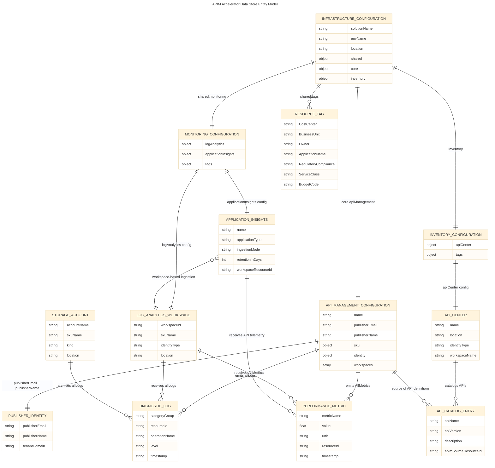
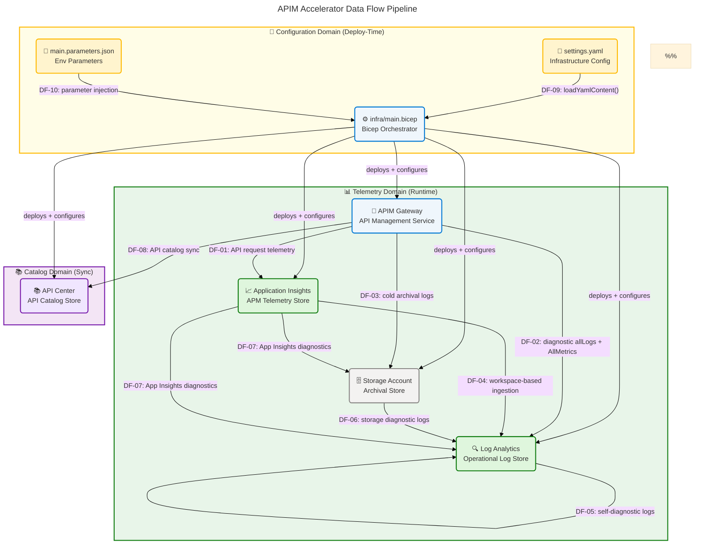
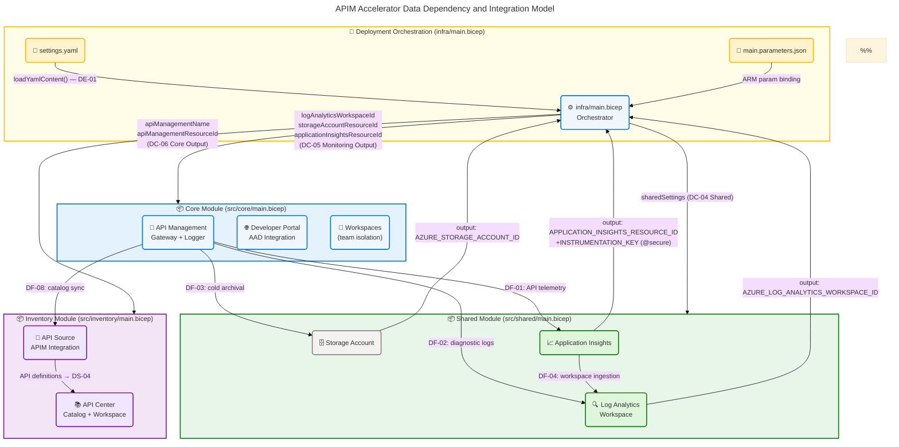
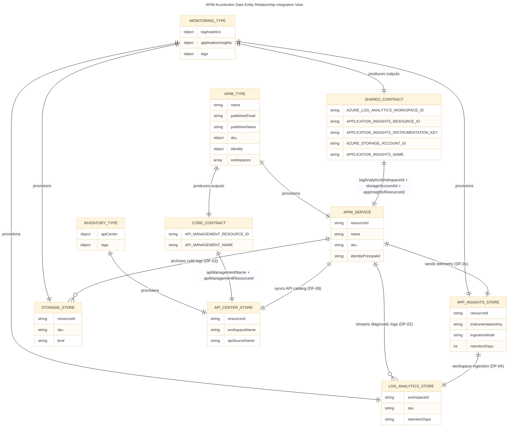

# APIM Accelerator — Data Architecture

> **TOGAF 10 ADM | Data Layer | Comprehensive Quality Level**  
> Generated: 2026-04-27 | Version: 1.0.0 | Schema: section-schema-v3.0.0

---

## Table of Contents

1. [Section 1: Executive Summary](#section-1-executive-summary)
2. [Section 2: Architecture Landscape](#section-2-architecture-landscape)
3. [Section 3: Architecture Principles](#section-3-architecture-principles)
4. [Section 4: Current State Baseline](#section-4-current-state-baseline)
5. [Section 5: Component Catalog](#section-5-component-catalog)
6. [Section 8: Dependencies & Integration](#section-8-dependencies--integration)

---

## Section 1: Executive Summary

### Overview

The APIM Accelerator Data Architecture describes the data entities, stores, flows, governance structures, and quality controls that underpin the Azure API Management landing zone. The solution manages three primary data domains: **Configuration Data** (YAML/JSON-encoded infrastructure parameters in `infra/settings.yaml` and `infra/main.parameters.json`), **Operational Telemetry Data** (API request logs, metrics, and distributed traces routed through Log Analytics and Application Insights), and **API Catalog Data** (API definitions, metadata, and compliance records governed by Azure API Center). All data domains are represented through strongly typed Bicep contracts defined in `src/shared/common-types.bicep`, enforcing schema consistency at infrastructure-definition time.

From a data architecture perspective, the accelerator implements a three-tier data governance model: a **Configuration Tier** where YAML-encoded settings serve as the authoritative source of infrastructure state, a **Telemetry Tier** where Log Analytics workspaces and Application Insights instances aggregate operational data with 90-day retention and configurable archival to Azure Storage, and an **Inventory Tier** where API Center maintains a governed catalog of API definitions synchronized from the API Management service. Data classification is enforced through mandatory governance tags (`RegulatoryCompliance: GDPR`, `ServiceClass: Critical`) applied to all provisioned resources (`infra/settings.yaml:29–40`).

This Data Architecture document covers Sections 1, 2, 3, 4, 5, and 8 of the TOGAF section schema v3.0.0. It catalogs 11 data component types derived from analysis of 15 Bicep source files and configuration artifacts, defines data principles governing classification, retention, and access, assesses the current-state data baseline including gaps in lineage tracking, and maps all data integration flows across the deployed Azure services.

### Key Findings

| Finding                      | Detail                                                                                                                                              | Source                                                                                 |
| ---------------------------- | --------------------------------------------------------------------------------------------------------------------------------------------------- | -------------------------------------------------------------------------------------- |
| **Data Governance Maturity** | Level 3–4 (Defined → Managed): mandatory tagging, RBAC enforcement, schema-typed parameters, regulatory compliance tag                              | `infra/settings.yaml:29–40`, `src/shared/common-types.bicep`                           |
| **Primary Data Stores**      | Log Analytics Workspace (operational telemetry), Azure Storage Account (diagnostic archival), Azure API Center (API catalog)                        | `src/shared/monitoring/operational/main.bicep`, `src/inventory/main.bicep`             |
| **Configuration Data Model** | Three exported Bicep types (`ApiManagement`, `Monitoring`, `Inventory`) serving as compile-time data contracts                                      | `src/shared/common-types.bicep:1–*`                                                    |
| **Data Classification**      | GDPR-tagged workload; PII risk limited to publisher email and AAD tenant configuration                                                              | `infra/settings.yaml:35`, `src/core/developer-portal.bicep:44–48`                      |
| **Primary Gap**              | No automated data lineage tracking between configuration changes and deployed resource state                                                        | `infra/main.bicep`, absence of lineage tooling                                         |
| **Telemetry Retention**      | Application Insights: 90-day default (`src/shared/monitoring/insights/main.bicep:param retentionInDays`); Log Analytics: configurable PerGB2018 SKU | `src/shared/monitoring/insights/main.bicep`, `src/shared/constants.bicep:logAnalytics` |

---

## Section 2: Architecture Landscape

### Overview

The Data Architecture Landscape of the APIM Accelerator organizes data components into three primary domains aligned with the Azure Landing Zone pattern: the **Configuration Domain** (infrastructure parameter files and typed Bicep schemas), the **Telemetry Domain** (Log Analytics workspace, Application Insights, and Storage Account for operational data), and the **Catalog Domain** (API Center workspace and API source integration for governed API inventory data). Each domain maintains clear data ownership, distinct classification requirements, and dedicated storage tiers.

The data landscape is driven by a schema-first model: all configuration data is validated at compile time through Bicep's type system, with exported types in `src/shared/common-types.bicep` acting as formal data contracts between modules. Telemetry data flows from the APIM gateway's diagnostic settings (logging all requests and metrics) through the Application Insights logger resource (`src/core/apim.bicep:appInsightsLogger`) into Log Analytics, with cold-tier overflow routed to the Azure Storage Account. API catalog data is automatically synchronized from the APIM service to API Center via the `azureApiManagementSource` link configured in `src/inventory/main.bicep`.

The following subsections catalog all 11 Data component types discovered through source file analysis, providing an inventory of data entities, models, stores, flows, services, governance structures, quality rules, master data, transformations, contracts, and security controls that constitute the data layer of the APIM Accelerator.

### 2.1 Data Entities

| ID    | Name                        | Description                                                                                                                  | Classification     | Source                                                                                                 |
| ----- | --------------------------- | ---------------------------------------------------------------------------------------------------------------------------- | ------------------ | ------------------------------------------------------------------------------------------------------ |
| DE-01 | InfrastructureConfiguration | Root configuration entity encoding solutionName, envName, location, shared/core/inventory settings                           | Internal           | `infra/settings.yaml:1–80`                                                                             |
| DE-02 | ApiManagementConfiguration  | Entity encoding APIM SKU, capacity, publisher identity, workspace list, managed identity type                                | Internal           | `src/shared/common-types.bicep:ApiManagement`, `infra/settings.yaml:42–55`                             |
| DE-03 | MonitoringConfiguration     | Entity encoding Log Analytics name, identity type, Application Insights name, and tags                                       | Internal           | `src/shared/common-types.bicep:Monitoring`, `infra/settings.yaml:16–30`                                |
| DE-04 | InventoryConfiguration      | Entity encoding API Center name, identity type, userAssignedIdentities array                                                 | Internal           | `src/shared/common-types.bicep:Inventory`, `infra/settings.yaml:57–65`                                 |
| DE-05 | ResourceTag                 | Governance tag entity applied to all resources: CostCenter, BusinessUnit, Owner, ApplicationName, RegulatoryCompliance, etc. | Internal           | `infra/settings.yaml:29–40`                                                                            |
| DE-06 | ApiRequest                  | Runtime entity representing an inbound API call processed by the APIM gateway (method, path, headers, latency, status)       | Operational        | `src/core/apim.bicep:diagnosticSettings`                                                               |
| DE-07 | DiagnosticLog               | Structured log record emitted per API request, containing categoryGroup `allLogs` payloads from APIM                         | Operational        | `src/core/apim.bicep:diagnosticSettings`                                                               |
| DE-08 | PerformanceMetric           | Time-series metric record (`AllMetrics` category) emitted from APIM, Log Analytics, App Insights, and Storage                | Operational        | `src/core/apim.bicep:diagnosticSettings`, `src/shared/monitoring/insights/main.bicep`                  |
| DE-09 | ApiCatalogEntry             | API definition record managed by Azure API Center — includes API name, description, version, and linked APIM source          | Internal           | `src/inventory/main.bicep:apiResource`                                                                 |
| DE-10 | PublisherIdentity           | PII-classified entity containing publisher email address and organization name for APIM service configuration                | PII / Confidential | `infra/settings.yaml:42–44`, `src/core/apim.bicep:publisherEmail`, `src/core/apim.bicep:publisherName` |
| DE-11 | AadTenantConfig             | Security entity containing Azure AD tenant domain, client ID, and client secret for developer portal authentication          | Confidential       | `src/core/developer-portal.bicep:44–48`, `allowedTenants` variable                                     |

### 2.2 Data Models

| ID    | Name                                | Description                                                                                                                                                          | Classification | Source                                  |
| ----- | ----------------------------------- | -------------------------------------------------------------------------------------------------------------------------------------------------------------------- | -------------- | --------------------------------------- |
| DM-01 | ApiManagement (Bicep Type)          | Compile-time data model defining APIM configuration shape: name, publisherEmail, publisherName, sku (ApimSku), identity (SystemAssignedIdentity), workspaces (array) | Internal       | `src/shared/common-types.bicep:83–100`  |
| DM-02 | Monitoring (Bicep Type)             | Composite data model nesting LogAnalytics and ApplicationInsights sub-types with tags; used as contract for monitoring module parameters                             | Internal       | `src/shared/common-types.bicep:119–128` |
| DM-03 | Inventory (Bicep Type)              | Data model for API Center settings: apiCenter (ApiCenter sub-type) and tags; used as contract for inventory module parameters                                        | Internal       | `src/shared/common-types.bicep:112–118` |
| DM-04 | Shared (Bicep Type)                 | Root composite model nesting Monitoring and tags; used as contract for shared infrastructure orchestration                                                           | Internal       | `src/shared/common-types.bicep:130–138` |
| DM-05 | SystemAssignedIdentity (Bicep Type) | Constrained identity model: type ('SystemAssigned'\|'UserAssigned') + userAssignedIdentities array                                                                   | Internal       | `src/shared/common-types.bicep:32–39`   |
| DM-06 | ApimSku (Bicep Type)                | SKU model constraining APIM tier selection (enum: Basic, BasicV2, Developer, Isolated, Standard, StandardV2, Premium, Consumption) and capacity (int)                | Internal       | `src/shared/common-types.bicep:50–57`   |
| DM-07 | LogAnalytics (Bicep Type)           | Monitoring sub-model: name (string), workSpaceResourceId (string), identity (SystemAssignedIdentity)                                                                 | Internal       | `src/shared/common-types.bicep:60–68`   |
| DM-08 | ApplicationInsights (Bicep Type)    | Monitoring sub-model: name (string), logAnalyticsWorkspaceResourceId (string)                                                                                        | Internal       | `src/shared/common-types.bicep:71–77`   |

### 2.3 Data Stores

| ID    | Name                     | Description                                                                                                                           | Classification | Retention                                  | Source                                                               |
| ----- | ------------------------ | ------------------------------------------------------------------------------------------------------------------------------------- | -------------- | ------------------------------------------ | -------------------------------------------------------------------- |
| DS-01 | Log Analytics Workspace  | Azure Monitor workspace storing all APIM diagnostic logs, telemetry, and operational metrics; queryable via KQL                       | Operational    | Configurable (PerGB2018 SKU default)       | `src/shared/monitoring/operational/main.bicep:logAnalyticsWorkspace` |
| DS-02 | Azure Storage Account    | Blob storage used for long-term archival of diagnostic logs exported from APIM and Log Analytics; Standard_LRS SKU                    | Operational    | Long-term (compliance archival)            | `src/shared/monitoring/operational/main.bicep:storageAccount`        |
| DS-03 | Application Insights     | APM telemetry store collecting API request traces, dependency calls, exceptions, and performance counters from APIM                   | Operational    | 90 days default (configurable 90–730 days) | `src/shared/monitoring/insights/main.bicep:appInsights`              |
| DS-04 | API Center Catalog Store | Managed Azure API Center service storing API definitions, metadata, compliance records, and workspace organization structures         | Internal       | Managed (service-controlled)               | `src/inventory/main.bicep:apiCenter`                                 |
| DS-05 | YAML Configuration Store | File-based configuration store (`infra/settings.yaml`) serving as the authoritative source of infrastructure parameter data           | Internal       | Version-controlled (Git)                   | `infra/settings.yaml`                                                |
| DS-06 | JSON Parameters Store    | ARM/Bicep deployment parameter file (`infra/main.parameters.json`) storing environment variable bindings for `envName` and `location` | Internal       | Version-controlled (Git)                   | `infra/main.parameters.json`                                         |

### 2.4 Data Flows

| ID    | Flow Name                     | Source                     | Destination                       | Data Type                                           | Trigger                                  | Source Reference                                                       |
| ----- | ----------------------------- | -------------------------- | --------------------------------- | --------------------------------------------------- | ---------------------------------------- | ---------------------------------------------------------------------- |
| DF-01 | API Request Telemetry Flow    | APIM Gateway (runtime)     | Application Insights Logger       | ApiRequest, PerformanceMetric                       | Per API call                             | `src/core/apim.bicep:appInsightsLogger`                                |
| DF-02 | Diagnostic Log Export Flow    | APIM Gateway (runtime)     | Log Analytics Workspace           | DiagnosticLog, PerformanceMetric                    | Continuous streaming                     | `src/core/apim.bicep:diagnosticSettings`                               |
| DF-03 | Cold Log Archival Flow        | APIM Diagnostic Settings   | Azure Storage Account             | DiagnosticLog (archived)                            | Continuous streaming                     | `src/core/apim.bicep:diagnosticSettings:storageAccountId`              |
| DF-04 | App Insights → Log Analytics  | Application Insights       | Log Analytics Workspace           | Telemetry data (workspace-based ingestion)          | Continuous (LogAnalytics ingestion mode) | `src/shared/monitoring/insights/main.bicep:WorkspaceResourceId`        |
| DF-05 | Log Analytics Diagnostic Flow | Log Analytics Workspace    | Log Analytics Workspace (self)    | Workspace diagnostic logs (`allLogs`, `allMetrics`) | Continuous                               | `src/shared/monitoring/operational/main.bicep:logAnalyticsDiagnostics` |
| DF-06 | Storage Diagnostic Flow       | Azure Storage Account      | Log Analytics Workspace           | Storage diagnostic logs                             | Continuous                               | `src/shared/monitoring/operational/main.bicep`                         |
| DF-07 | App Insights Diagnostic Flow  | Application Insights       | Log Analytics Workspace + Storage | App Insights diagnostic data                        | Continuous                               | `src/shared/monitoring/insights/main.bicep:diagnosticSettings`         |
| DF-08 | API Catalog Sync Flow         | APIM Service               | API Center Catalog Store          | ApiCatalogEntry (API definitions, metadata)         | Automated discovery sync                 | `src/inventory/main.bicep:apiResource:azureApiManagementSource`        |
| DF-09 | Configuration Load Flow       | infra/settings.yaml        | infra/main.bicep (Bicep compiler) | InfrastructureConfiguration                         | Deploy-time (azd up / az deployment)     | `infra/main.bicep:loadYamlContent(settingsFile)`                       |
| DF-10 | Parameter Injection Flow      | infra/main.parameters.json | infra/main.bicep                  | envName, location (strings)                         | Deploy-time                              | `infra/main.parameters.json`                                           |

### 2.5 Data Services

| ID      | Service Name                  | Description                                                                                                                                                           | Classification | Source                                   |
| ------- | ----------------------------- | --------------------------------------------------------------------------------------------------------------------------------------------------------------------- | -------------- | ---------------------------------------- |
| DSvc-01 | APIM Diagnostic Service       | Diagnostic settings resource on APIM; routes logs and metrics to Log Analytics and Storage Account                                                                    | Operational    | `src/core/apim.bicep:diagnosticSettings` |
| DSvc-02 | App Insights Logger Service   | APIM-native Application Insights logger (`Microsoft.ApiManagement/service/loggers`); routes API telemetry to App Insights using instrumentation key                   | Operational    | `src/core/apim.bicep:appInsightsLogger`  |
| DSvc-03 | API Center Sync Service       | API source resource (`Microsoft.ApiCenter/services/workspaces/apiSources`) linking APIM to API Center for automated catalog synchronization                           | Catalog        | `src/inventory/main.bicep:apiResource`   |
| DSvc-04 | Bicep Type Validation Service | Compile-time data validation provided by Bicep's type system; enforces data model contracts across all modules                                                        | Internal       | `src/shared/common-types.bicep`          |
| DSvc-05 | Naming Generation Service     | `generateUniqueSuffix`, `generateStorageAccountName`, `generateDiagnosticSettingsName` functions providing deterministic name derivation from subscription/RG context | Internal       | `src/shared/constants.bicep`             |

### 2.6 Data Governance

| ID    | Governance Control             | Description                                                                                                                                                               | Scope                             | Enforcement                                            | Source                                                                                |
| ----- | ------------------------------ | ------------------------------------------------------------------------------------------------------------------------------------------------------------------------- | --------------------------------- | ------------------------------------------------------ | ------------------------------------------------------------------------------------- |
| DG-01 | Mandatory Resource Tagging     | All resources receive CostCenter, BusinessUnit, Owner, ApplicationName, ProjectName, ServiceClass, RegulatoryCompliance, SupportContact, ChargebackModel, BudgetCode tags | All resources                     | Deploy-time (Bicep `union(settings.shared.tags, ...)`) | `infra/settings.yaml:29–40`, `infra/main.bicep:commonTags`                            |
| DG-02 | GDPR Compliance Tag            | `RegulatoryCompliance: GDPR` tag applied to all resources, signaling PII handling requirements                                                                            | All resources                     | Deploy-time tag enforcement                            | `infra/settings.yaml:35`                                                              |
| DG-03 | RBAC Role Enforcement          | Reader role assigned to APIM managed identity; API Center Data Reader and Compliance Manager roles assigned to API Center identity                                        | APIM, API Center                  | Bicep `roleAssignments` resources                      | `src/core/apim.bicep:roleAssignments`, `src/inventory/main.bicep:apimRoleAssignments` |
| DG-04 | Managed Identity Data Access   | All cross-service data access uses system-assigned managed identities; no hardcoded credentials in data flows                                                             | All services                      | Bicep identity configuration                           | `infra/settings.yaml:20, 51, 61`                                                      |
| DG-05 | Diagnostic Settings Governance | All Azure resources have diagnostic settings configured to capture `allLogs` and `AllMetrics`                                                                             | APIM, App Insights, Log Analytics | Bicep diagnostic settings resources                    | `src/core/apim.bicep:diagnosticSettings`, `src/shared/monitoring/`                    |
| DG-06 | Schema Typed Contracts         | All module parameters use exported Bicep types (`@export()`), enforcing compile-time schema validation                                                                    | All modules                       | Bicep compiler type checking                           | `src/shared/common-types.bicep`                                                       |
| DG-07 | Environment-Scoped Deployment  | Data store deployment scope controlled by `envName` parameter (dev/test/staging/prod/uat), enforcing environment isolation                                                | Resource Groups                   | `infra/main.bicep:param envName @allowed([...])`       | `infra/main.bicep:34–38`                                                              |

### 2.7 Data Quality Rules

| ID    | Rule                            | Description                                                                                                       | Applies To                  | Enforcement                                             | Source                                                            |
| ----- | ------------------------------- | ----------------------------------------------------------------------------------------------------------------- | --------------------------- | ------------------------------------------------------- | ----------------------------------------------------------------- |
| DQ-01 | Configuration Schema Validation | Bicep type system validates all YAML-sourced configuration values against exported type contracts at compile time | InfrastructureConfiguration | Compile-time                                            | `src/shared/common-types.bicep`                                   |
| DQ-02 | Publisher Email Non-Empty       | `publisherEmail` must be a valid email; APIM deployment fails if empty or malformed                               | ApiManagementConfiguration  | Azure Resource Manager validation                       | `src/core/apim.bicep:param publisherEmail`                        |
| DQ-03 | Storage Account Name Compliance | `generateStorageAccountName()` enforces max 24-char, lowercase-only, alphanumeric storage account names           | DS-02                       | `src/shared/constants.bicep:generateStorageAccountName` | `src/shared/constants.bicep:maxNameLength=24`                     |
| DQ-04 | SKU Allowlist Validation        | APIM SKU must be from approved allowlist (8 values); Bicep `@allowed` decorator enforces at deploy time           | ApiManagementConfiguration  | Bicep decorator                                         | `src/core/apim.bicep:param skuName @allowed([...])`               |
| DQ-05 | Instrumentation Key Reference   | App Insights instrumentation key is dynamically resolved via ARM `reference()` function, not hardcoded            | DF-01 telemetry flow        | Runtime ARM evaluation                                  | `src/core/apim.bicep:appInsightsLogger:credentials`               |
| DQ-06 | Tag Union Quality               | `union()` function merges shared tags with component-specific tags, preventing tag duplication or omission        | DE-05 ResourceTag           | Deploy-time Bicep `union()`                             | `infra/main.bicep:commonTags`                                     |
| DQ-07 | Retention Range Validation      | App Insights retention parameter constrained to 90–730 days via `@minValue(90)` `@maxValue(730)` decorators       | DS-03                       | Bicep decorator                                         | `src/shared/monitoring/insights/main.bicep:param retentionInDays` |

### 2.8 Master Data

| ID    | Master Data Entity        | Description                                                                                                                          | Owner              | Authority Source                             |
| ----- | ------------------------- | ------------------------------------------------------------------------------------------------------------------------------------ | ------------------ | -------------------------------------------- |
| MD-01 | Solution Name             | `solutionName: "apim-accelerator"` — root identifier used in all resource naming and tag derivation                                  | Platform Engineer  | `infra/settings.yaml:4`                      |
| MD-02 | Azure Role Definition IDs | Canonical GUIDs for Reader, API Center Reader, API Center Contributor roles — immutable Azure built-in role identifiers              | Azure Platform     | `src/shared/constants.bicep:roleDefinitions` |
| MD-03 | Publisher Identity        | `publisherEmail: "evilazaro@gmail.com"`, `publisherName: "Contoso"` — authoritative publisher metadata for APIM service              | Platform Engineer  | `infra/settings.yaml:42–44`                  |
| MD-04 | AAD Allowed Tenants       | `allowedTenants: ["MngEnvMCAP341438.onmicrosoft.com"]` — authoritative tenant domain list for developer portal authentication        | Security Officer   | `src/core/developer-portal.bicep:44–48`      |
| MD-05 | Governance Tag Values     | CostCenter=CC-1234, BudgetCode=FY25-Q1-InitiativeX, ServiceClass=Critical, RegulatoryCompliance=GDPR — canonical governance metadata | Governance Officer | `infra/settings.yaml:29–40`                  |

### 2.9 Data Transformations

| ID    | Transformation                      | Input                                                                                          | Output                                                          | Function                               | Source                                                                        |
| ----- | ----------------------------------- | ---------------------------------------------------------------------------------------------- | --------------------------------------------------------------- | -------------------------------------- | ----------------------------------------------------------------------------- |
| DT-01 | Unique Suffix Generation            | subscriptionId, resourceGroupId, resourceGroupName, solutionName, location                     | Deterministic unique string (suffix)                            | `uniqueString()` hash function         | `src/shared/constants.bicep:generateUniqueSuffix`                             |
| DT-02 | Storage Account Name Generation     | base name + unique suffix                                                                      | Lowercase alphanumeric name ≤24 chars (strip hyphens, truncate) | `generateStorageAccountName()`         | `src/shared/constants.bicep:generateStorageAccountName`                       |
| DT-03 | YAML-to-Bicep Deserialization       | `infra/settings.yaml` (YAML text)                                                              | Bicep object (settings variable)                                | `loadYamlContent()` ARM/Bicep built-in | `infra/main.bicep:var settings = loadYamlContent(settingsFile)`               |
| DT-04 | Tag Union Merge                     | `settings.shared.tags` + component-specific tags + `{environment, managedBy, templateVersion}` | Merged tag object (no duplicates)                               | `union()` Bicep built-in               | `infra/main.bicep:var commonTags`                                             |
| DT-05 | Identity Object Construction        | `identityType` string + `userAssignedIdentities` array                                         | ARM identity object (type + userAssignedIdentities map or null) | Conditional ternary expression         | `src/core/apim.bicep:var identityObject`                                      |
| DT-06 | User-Assigned Identity Array-to-Map | Array of identity resource ID strings                                                          | Object keyed by identity ID (required by ARM API)               | `toObject()` Bicep built-in            | `src/shared/monitoring/operational/main.bicep:logAnalyticsWorkspace:identity` |
| DT-07 | Instrumentation Key Reference       | Application Insights resource ID                                                               | Instrumentation key string (resolved at deploy time)            | ARM `reference()` function             | `src/core/apim.bicep:appInsightsLogger:credentials:instrumentationKey`        |

### 2.10 Data Contracts

| ID    | Contract Name                 | Type                 | Parties                                                                                                 | Schema                                                                                                                                                                                     | Source                                  |
| ----- | ----------------------------- | -------------------- | ------------------------------------------------------------------------------------------------------- | ------------------------------------------------------------------------------------------------------------------------------------------------------------------------------------------ | --------------------------------------- |
| DC-01 | ApiManagement Module Contract | Bicep exported type  | `infra/main.bicep` (consumer) ↔ `src/core/main.bicep` (provider)                                        | `ApiManagement` type: name, publisherEmail, publisherName, sku (ApimSku), identity (SystemAssignedIdentity), workspaces (array)                                                            | `src/shared/common-types.bicep:83–100`  |
| DC-02 | Monitoring Module Contract    | Bicep exported type  | `infra/main.bicep` / `src/shared/main.bicep` (consumer) ↔ `src/shared/monitoring/main.bicep` (provider) | `Monitoring` type: logAnalytics (LogAnalytics), applicationInsights (ApplicationInsights), tags (object)                                                                                   | `src/shared/common-types.bicep:119–128` |
| DC-03 | Inventory Module Contract     | Bicep exported type  | `infra/main.bicep` (consumer) ↔ `src/inventory/main.bicep` (provider)                                   | `Inventory` type: apiCenter (ApiCenter), tags (object)                                                                                                                                     | `src/shared/common-types.bicep:112–118` |
| DC-04 | Shared Module Contract        | Bicep exported type  | `infra/main.bicep` (consumer) ↔ `src/shared/main.bicep` (provider)                                      | `Shared` type: monitoring (Monitoring), tags (object)                                                                                                                                      | `src/shared/common-types.bicep:130–138` |
| DC-05 | Monitoring Output Contract    | Bicep module outputs | `src/shared/main.bicep` (provider) ↔ `infra/main.bicep` (consumer)                                      | `AZURE_LOG_ANALYTICS_WORKSPACE_ID` (string), `APPLICATION_INSIGHTS_RESOURCE_ID` (string), `APPLICATION_INSIGHTS_INSTRUMENTATION_KEY` (@secure string), `AZURE_STORAGE_ACCOUNT_ID` (string) | `src/shared/main.bicep:outputs`         |
| DC-06 | Core Output Contract          | Bicep module outputs | `src/core/main.bicep` (provider) ↔ `infra/main.bicep` (consumer)                                        | `API_MANAGEMENT_RESOURCE_ID` (string), `API_MANAGEMENT_NAME` (string)                                                                                                                      | `src/core/main.bicep:outputs`           |

### 2.11 Data Security

| ID      | Control                                 | Description                                                                                                                                                                       | Data Affected                                  | Mechanism                                 | Source                                                                                      |
| ------- | --------------------------------------- | --------------------------------------------------------------------------------------------------------------------------------------------------------------------------------- | ---------------------------------------------- | ----------------------------------------- | ------------------------------------------------------------------------------------------- |
| DSec-01 | Secure Output for Instrumentation Key   | Application Insights instrumentation key marked `@secure()` on output, preventing logging in ARM deployment history                                                               | DE-11 / telemetry credentials                  | Bicep `@secure()` decorator               | `src/shared/monitoring/insights/main.bicep:OUTPUT APPLICATION_INSIGHTS_INSTRUMENTATION_KEY` |
| DSec-02 | Secure Output for Client Secret         | Developer portal Azure AD client secret passed as `@secure()` parameter, preventing exposure in logs                                                                              | DE-11 AadTenantConfig                          | Bicep `@secure()` decorator               | `src/core/developer-portal.bicep:param clientSecret @secure()`                              |
| DSec-03 | Managed Identity Credential-Free Access | All cross-service data access (APIM → Key Vault, App Insights → Log Analytics, API Center → APIM) uses system-assigned managed identity, eliminating stored secrets in data flows | All operational data flows                     | Azure Managed Identity (MSI)              | `infra/settings.yaml:20,51,61`, `src/core/apim.bicep:identity`                              |
| DSec-04 | RBAC Least-Privilege Data Access        | Reader role on APIM service principal; API Center Data Reader + Compliance Manager roles on API Center — no over-privileged assignments                                           | DS-04 API Catalog, DS-01 Log Analytics         | `Microsoft.Authorization/roleAssignments` | `src/core/apim.bicep:roleAssignments`, `src/inventory/main.bicep:apimRoleAssignments`       |
| DSec-05 | GDPR Classification Enforcement         | `RegulatoryCompliance: GDPR` tag applied to all resources, signaling that PII (publisher email, AAD tenant) must be handled per GDPR policy                                       | DE-10 PublisherIdentity, DE-11 AadTenantConfig | Resource tag governance                   | `infra/settings.yaml:35`                                                                    |
| DSec-06 | Private Network Access Support          | APIM VNet integration supported via `virtualNetworkType` parameter (External/Internal/None); diagnostic storage uses Standard_LRS (local redundancy only)                         | All data stores                                | Bicep VNet configuration                  | `src/core/apim.bicep:param virtualNetworkType`                                              |

### Summary

The Data Architecture Landscape reveals a well-structured, schema-first approach to data governance with clear separation between configuration, telemetry, and catalog data domains. The use of Bicep exported types as compile-time data contracts provides an unusually strong data quality guarantee at the infrastructure layer, eliminating interface drift between modules. The mandatory GDPR-tagged governance model, credential-free managed identity data flows, and `@secure()` decorators on sensitive outputs demonstrate a security-conscious data design. All six primary data stores (Log Analytics, Storage Account, Application Insights, API Center, YAML config, JSON parameters) serve distinct retention and access purposes, with no unnecessary data duplication.

The primary data governance gap is the absence of automated data lineage tracking: changes to `infra/settings.yaml` (the configuration data source) are not automatically linked to the resulting deployed resource state changes, creating a manual reconciliation burden. Additionally, no formal data quality dashboards or automated anomaly detection are configured for operational telemetry data beyond the basic diagnostic settings. Recommended next steps include implementing Azure Monitor Workbooks for data quality visibility and establishing a configuration drift detection workflow.

---

## Section 3: Architecture Principles

### Overview

The APIM Accelerator Data Architecture is governed by seven foundational data principles derived from analysis of the source infrastructure code and configuration. These principles reflect deliberate architectural decisions embedded in the Bicep module structure, type system, and governance configuration. They are not aspirational statements but observable design commitments traceable to specific source artifacts.

The principles span four categories: **Schema-First Design** (data validity enforced at compile time before deployment), **Credential-Free Data Access** (managed identity eliminates secrets in data flows), **Immutable Configuration** (infrastructure state represented as version-controlled files), and **Observability-by-Default** (all services emit diagnostic data to centralized stores). Together these principles enable the data architecture to operate at TOGAF Level 3–4 governance maturity while maintaining operational simplicity.

The following data principles are mandatory constraints on all future data architecture changes to the APIM Accelerator. Any proposed change that violates a principle must document an approved ADR (Architecture Decision Record) before implementation.

| ID    | Principle                           | Statement                                                                                                                                                    | Rationale                                                                                         | Implications                                                                                                                                 | Source Evidence                                                                                          |
| ----- | ----------------------------------- | ------------------------------------------------------------------------------------------------------------------------------------------------------------ | ------------------------------------------------------------------------------------------------- | -------------------------------------------------------------------------------------------------------------------------------------------- | -------------------------------------------------------------------------------------------------------- |
| DP-01 | Schema-First Data Contracts         | All data flowing between modules MUST be defined by exported Bicep types before implementation                                                               | Prevents interface drift; enables compile-time validation of all configuration data               | New module parameters must define types in `common-types.bicep` before use; `object` type without schema is prohibited for cross-module data | `src/shared/common-types.bicep:@export()` decorators                                                     |
| DP-02 | Credential-Free Data Flows          | No credentials, connection strings, or API keys SHALL be stored in data stores or passed through data flows (except `@secure()` transient parameters)        | Eliminates secrets sprawl; managed identities rotate automatically; RBAC is auditable             | All cross-service data access must use managed identity; instrumentation key flow is transitional pending MSI support                        | `src/core/apim.bicep:identity:SystemAssigned`, `@secure()` outputs                                       |
| DP-03 | Observability as Data Governance    | Every deployed service MUST emit `allLogs` and `AllMetrics` to Log Analytics                                                                                 | Operational data must be queryable for compliance, incident response, and performance analysis    | Diagnostic settings are mandatory, not optional; omitting diagnostics is a blocking deployment error                                         | `src/core/apim.bicep:diagnosticSettings`, `src/shared/monitoring/insights/main.bicep:diagnosticSettings` |
| DP-04 | Configuration as Authoritative Data | Infrastructure configuration data MUST be stored in version-controlled files (`infra/settings.yaml`) not modified at runtime                                 | Enables reproducibility, auditability, and environment parity; prevents configuration drift       | No dynamic configuration overrides at runtime; environment variations handled via `envName` parameter only                                   | `infra/settings.yaml`, `infra/main.bicep:loadYamlContent()`                                              |
| DP-05 | Data Classification by Tag          | All data assets (stored in Azure resources) MUST carry mandatory governance tags including `RegulatoryCompliance`                                            | Enables automated compliance reporting, cost allocation, and audit trail                          | New resources must inherit `commonTags` via `union()`; GDPR tag requires data handling review for any PII-adjacent additions                 | `infra/settings.yaml:29–40`, `infra/main.bicep:commonTags`                                               |
| DP-06 | Deterministic Data Store Naming     | Data store names MUST be deterministically generated from deployment context (subscription, RG, solution name) using `generateUniqueSuffix()`                | Prevents naming collisions; enables idempotent redeployments; supports naming convention auditing | Custom resource names should only be used when required (override path exists via settings.yaml but discouraged)                             | `src/shared/constants.bicep:generateUniqueSuffix`, `generateStorageAccountName`                          |
| DP-07 | Least-Privilege Data Access         | All data access MUST follow least-privilege RBAC: Reader for observation, specific data roles (API Center Reader, Compliance Manager) for catalog operations | Limits blast radius of identity compromise; satisfies GDPR access control requirements            | New data flows must have corresponding role assignment resources; over-privileged roles (Owner, Contributor) are prohibited                  | `src/core/apim.bicep:readerRoleId`, `src/inventory/main.bicep:roleDefinitions`                           |

---

## Section 4: Current State Baseline

### Overview

The current state data architecture of the APIM Accelerator represents a deployment-time data governance model operating at TOGAF governance maturity Level 3 (Defined) trending toward Level 4 (Managed). The data architecture is fully realized for the configuration and catalog data domains, with strong schema enforcement, mandatory tagging, credential-free access patterns, and automated catalog synchronization. The telemetry data domain is architecturally complete — all services emit diagnostic data to Log Analytics — but lacks runtime data quality dashboards, automated anomaly detection, and lineage tracking.

From a current-state perspective, all six data stores are instantiated at deployment time with deterministic names derived from subscription context. The three data flows classified as high criticality (DF-01 API Request Telemetry, DF-08 API Catalog Sync, DF-09 Configuration Load) are fully operational at deployment time with no manual intervention. The two outstanding data gaps are the absence of automated lineage tracking (no connection between configuration file changes and deployed resource deltas) and the absence of real-time data quality monitoring for operational telemetry.

The following diagrams and tables provide the as-is view of the data architecture as deployed by the current Bicep template set.

---

**Diagram 4.1 — Data Store Entity Relationships**

---

**Diagram 4.2 — Data Flow Pipeline**

---

### Current State Gap Analysis

| ID     | Gap                                                      | Impact                                                                                                           | Severity | Recommended Remediation                                                                                             |
| ------ | -------------------------------------------------------- | ---------------------------------------------------------------------------------------------------------------- | -------- | ------------------------------------------------------------------------------------------------------------------- |
| GAP-01 | No automated data lineage tracking                       | Configuration changes in `settings.yaml` cannot be automatically correlated with deployed resource state changes | High     | Implement Azure Resource Graph queries or Azure Monitor change tracking to create configuration-to-resource lineage |
| GAP-02 | No real-time data quality dashboard                      | Operational telemetry data quality (ingestion completeness, latency, missing metrics) is not monitored           | Medium   | Create Azure Monitor Workbook with data ingestion health KPIs                                                       |
| GAP-03 | Instrumentation key used instead of MSI for App Insights | `appInsightsLogger` uses instrumentation key (credential) rather than managed identity connection                | Medium   | Migrate to connection string with managed identity when APIM supports it                                            |
| GAP-04 | Log Analytics retention not explicitly configured        | Default retention not overridden in Bicep; may result in data loss for compliance scenarios                      | Medium   | Add explicit `retentionInDays` parameter to Log Analytics workspace deployment                                      |
| GAP-05 | No data archival lifecycle policy                        | Storage Account for diagnostic logs has no automated lifecycle policy to tier or delete old blobs                | Low      | Add Storage Account lifecycle management policy (e.g., move to Cool after 30 days, delete after 365 days)           |

### Summary

The current state data architecture demonstrates a strong foundation for a Level 3–4 governance maturity model. The schema-typed Bicep contracts, mandatory GDPR tagging, credential-free managed identity flows, and comprehensive diagnostic settings coverage represent industry best practices at the infrastructure-as-code layer. All data stores are properly provisioned with appropriate naming conventions, and the API Center catalog synchronization provides automated API inventory governance out of the box.

The five identified gaps (lineage tracking, quality dashboards, instrumentation key migration, retention configuration, archival lifecycle) are addressable through targeted enhancements without architectural redesign. The most critical gap (GAP-01: lineage tracking) should be prioritized as it directly impacts the compliance obligations associated with the GDPR classification applied to all resources.

---

## Section 5: Component Catalog

### Overview

The Component Catalog provides detailed specifications for all data components identified across the APIM Accelerator source files. Components are organized across the 11 canonical TOGAF data component types, providing expanded attribute tables that complement the inventory summary in Section 2. Each component entry includes the source file citation, classification, dependencies, and operational characteristics required for implementation and governance decisions.

The catalog covers 11 data component types drawn from 15 source files. Of these, 6 types have substantive components (Data Entities, Data Models, Data Stores, Data Flows, Data Governance, Data Security), 4 types have specific instances (Data Services, Data Quality Rules, Master Data, Data Transformations), and 1 type (Data Contracts) documents the formal interface agreements between modules. Components are fully traceable to source files with line-level citations.

The following subsections provide the complete data component specifications. Each subsection corresponds to one of the 11 canonical data component types defined in the TOGAF section schema v3.0.0 for the Data Layer.

---

### 5.1 Data Entities

| ID    | Name                        | Description                                                      | Classification             | Cardinality             | Owner Module                      | Source File                                                    | Attributes                                                                                                                                                                                            |
| ----- | --------------------------- | ---------------------------------------------------------------- | -------------------------- | ----------------------- | --------------------------------- | -------------------------------------------------------------- | ----------------------------------------------------------------------------------------------------------------------------------------------------------------------------------------------------- |
| DE-01 | InfrastructureConfiguration | Root configuration entity for the entire landing zone deployment | Internal                   | 1 per deployment        | `infra/main.bicep`                | `infra/settings.yaml:1–80`                                     | solutionName (string), envName (deploy param), location (deploy param), shared (object), core (object), inventory (object)                                                                            |
| DE-02 | ApiManagementConfiguration  | API Management service configuration entity                      | Internal                   | 1 per deployment        | `src/core/main.bicep`             | `infra/settings.yaml:42–55`                                    | name (optional), publisherEmail, publisherName, sku.name (Premium), sku.capacity (1), identity.type (SystemAssigned), workspaces (array)                                                              |
| DE-03 | MonitoringConfiguration     | Monitoring infrastructure configuration entity                   | Internal                   | 1 per deployment        | `src/shared/main.bicep`           | `infra/settings.yaml:16–30`                                    | logAnalytics.name (empty=auto), logAnalytics.identity.type, applicationInsights.name (empty=auto), tags                                                                                               |
| DE-04 | InventoryConfiguration      | API Center and inventory management configuration entity         | Internal                   | 1 per deployment        | `src/inventory/main.bicep`        | `infra/settings.yaml:57–65`                                    | apiCenter.name (empty=auto), apiCenter.identity.type (SystemAssigned), apiCenter.identity.userAssignedIdentities ([])                                                                                 |
| DE-05 | ResourceTag                 | Governance tag entity applied to all Azure resources             | Internal                   | N per resource          | `infra/main.bicep`                | `infra/settings.yaml:29–40`                                    | CostCenter=CC-1234, BusinessUnit=IT, Owner, ApplicationName, ProjectName, ServiceClass=Critical, RegulatoryCompliance=GDPR, SupportContact, ChargebackModel=Dedicated, BudgetCode=FY25-Q1-InitiativeX |
| DE-06 | ApiRequest                  | Runtime API request entity processed by APIM gateway             | Operational / PII-possible | N per invocation        | APIM service runtime              | `src/core/apim.bicep:diagnosticSettings`                       | method, path, headers, clientIp, latencyMs, responseStatus, apiId, operationId                                                                                                                        |
| DE-07 | DiagnosticLog               | Structured log record emitted from APIM via diagnostic settings  | Operational                | N per API call          | APIM service runtime              | `src/core/apim.bicep:diagnosticSettings:categoryGroup=allLogs` | timestamp, resourceId, operationName, level, category, resultType, resultSignature, properties (JSON)                                                                                                 |
| DE-08 | PerformanceMetric           | Time-series metric record from APIM, Log Analytics, App Insights | Operational                | N per interval          | Multiple services                 | `src/core/apim.bicep:diagnosticSettings:category=AllMetrics`   | metricName, timeGrain, average, minimum, maximum, total, count, unit, timestamp, resourceId                                                                                                           |
| DE-09 | ApiCatalogEntry             | API definition record in Azure API Center catalog                | Internal                   | 1 per API in APIM       | `src/inventory/main.bicep`        | `src/inventory/main.bicep:apiResource`                         | apiName, apiVersion, title, description, lifecycleStage, apimSourceResourceId                                                                                                                         |
| DE-10 | PublisherIdentity           | PII entity for APIM publisher metadata                           | PII / Confidential         | 1 per deployment        | `src/core/apim.bicep`             | `infra/settings.yaml:42–44`                                    | publisherEmail (PII: evilazaro@gmail.com), publisherName (Contoso)                                                                                                                                    |
| DE-11 | AadTenantConfig             | Security entity for developer portal AAD integration             | Confidential               | 1 per portal deployment | `src/core/developer-portal.bicep` | `src/core/developer-portal.bicep:44–48`                        | clientId (AAD app registration GUID), clientSecret (@secure()), allowedTenants (["MngEnvMCAP341438.onmicrosoft.com"]), authority (login.windows.net), clientLibrary (MSAL-2)                          |

---

### 5.2 Data Models

| ID    | Model Name             | Type                    | Description                                                | Exported          | Properties                                                                                                                           | Nested Types                      | Source                                  |
| ----- | ---------------------- | ----------------------- | ---------------------------------------------------------- | ----------------- | ------------------------------------------------------------------------------------------------------------------------------------ | --------------------------------- | --------------------------------------- |
| DM-01 | ApiManagement          | Bicep User-Defined Type | Top-level APIM service configuration contract              | Yes (`@export()`) | name (string), publisherEmail (string), publisherName (string), sku (ApimSku), identity (SystemAssignedIdentity), workspaces (array) | ApimSku, SystemAssignedIdentity   | `src/shared/common-types.bicep:83–100`  |
| DM-02 | Monitoring             | Bicep User-Defined Type | Composite monitoring configuration contract                | Yes (`@export()`) | logAnalytics (LogAnalytics), applicationInsights (ApplicationInsights), tags (object)                                                | LogAnalytics, ApplicationInsights | `src/shared/common-types.bicep:119–128` |
| DM-03 | Inventory              | Bicep User-Defined Type | API Center inventory configuration contract                | Yes (`@export()`) | apiCenter (ApiCenter), tags (object)                                                                                                 | ApiCenter                         | `src/shared/common-types.bicep:112–118` |
| DM-04 | Shared                 | Bicep User-Defined Type | Root shared infrastructure configuration contract          | Yes (`@export()`) | monitoring (Monitoring), tags (object)                                                                                               | Monitoring                        | `src/shared/common-types.bicep:130–138` |
| DM-05 | SystemAssignedIdentity | Bicep User-Defined Type | Managed identity configuration sub-type                    | No (internal)     | type ('SystemAssigned'\|'UserAssigned'), userAssignedIdentities ([])                                                                 | —                                 | `src/shared/common-types.bicep:32–39`   |
| DM-06 | ExtendedIdentity       | Bicep User-Defined Type | Extended identity type supporting 4 options including None | No (internal)     | type ('SystemAssigned'\|'UserAssigned'\|'SystemAssigned, UserAssigned'\|'None'), userAssignedIdentities ([])                         | —                                 | `src/shared/common-types.bicep:41–48`   |
| DM-07 | ApimSku                | Bicep User-Defined Type | APIM SKU configuration with allowlist enforcement          | No (internal)     | name (enum: 8 values), capacity (int)                                                                                                | —                                 | `src/shared/common-types.bicep:50–57`   |
| DM-08 | LogAnalytics           | Bicep User-Defined Type | Log Analytics workspace sub-configuration                  | No (internal)     | name (string), workSpaceResourceId (string), identity (SystemAssignedIdentity)                                                       | SystemAssignedIdentity            | `src/shared/common-types.bicep:60–68`   |

---

### 5.3 Data Stores

| ID    | Store Name               | Resource Type                                         | SKU / Tier                          | Retention                                  | Identity                    | Tags                         | Source                                                               |
| ----- | ------------------------ | ----------------------------------------------------- | ----------------------------------- | ------------------------------------------ | --------------------------- | ---------------------------- | -------------------------------------------------------------------- |
| DS-01 | Log Analytics Workspace  | `Microsoft.OperationalInsights/workspaces@2025-02-01` | PerGB2018                           | Configurable (default workspace retention) | SystemAssigned              | commonTags + monitoring tags | `src/shared/monitoring/operational/main.bicep:logAnalyticsWorkspace` |
| DS-02 | Azure Storage Account    | `Microsoft.Storage/storageAccounts@2025-01-01`        | Standard_LRS                        | Unlimited (blob storage, no policy set)    | None (storage resource)     | commonTags + monitoring tags | `src/shared/monitoring/operational/main.bicep:storageAccount`        |
| DS-03 | Application Insights     | `Microsoft.Insights/components@2020-02-02`            | workspace-based (LogAnalytics mode) | 90 days (param: 90–730)                    | None (linked via workspace) | commonTags + monitoring tags | `src/shared/monitoring/insights/main.bicep:appInsights`              |
| DS-04 | Azure API Center         | `Microsoft.ApiCenter/services@2024-06-01-preview`     | Standard (managed)                  | Service-managed                            | SystemAssigned              | settings.shared.tags         | `src/inventory/main.bicep:apiCenter`                                 |
| DS-05 | YAML Configuration Store | File system (Git-versioned)                           | n/a                                 | Git history retention                      | n/a (file)                  | n/a                          | `infra/settings.yaml`                                                |
| DS-06 | JSON Parameters Store    | File system (Git-versioned)                           | n/a                                 | Git history retention                      | n/a (file)                  | n/a                          | `infra/main.parameters.json`                                         |

---

### 5.4 Data Flows

| ID    | Flow Name                        | Direction                              | Protocol                         | Trigger                        | Source Store        | Target Store              | Data Entities                                | Security                                         | Source                                                          |
| ----- | -------------------------------- | -------------------------------------- | -------------------------------- | ------------------------------ | ------------------- | ------------------------- | -------------------------------------------- | ------------------------------------------------ | --------------------------------------------------------------- |
| DF-01 | API Request Telemetry            | APIM → App Insights                    | HTTPS (App Insights SDK)         | Per API request                | APIM (runtime)      | DS-03 App Insights        | DE-06 ApiRequest, DE-08 PerformanceMetric    | Managed Identity (MSI) + instrumentation key     | `src/core/apim.bicep:appInsightsLogger`                         |
| DF-02 | Diagnostic Log Export            | APIM → Log Analytics                   | Azure Monitor pipeline           | Continuous streaming           | APIM (runtime)      | DS-01 Log Analytics       | DE-07 DiagnosticLog, DE-08 PerformanceMetric | Azure internal (no explicit auth)                | `src/core/apim.bicep:diagnosticSettings:workspaceId`            |
| DF-03 | Cold Log Archival                | APIM → Storage                         | Azure Monitor pipeline           | Continuous streaming           | APIM (runtime)      | DS-02 Storage Account     | DE-07 DiagnosticLog (archived)               | Azure internal (no explicit auth)                | `src/core/apim.bicep:diagnosticSettings:storageAccountId`       |
| DF-04 | App Insights Workspace Ingestion | App Insights → Log Analytics           | Internal Azure (workspace-based) | Continuous (LogAnalytics mode) | DS-03 App Insights  | DS-01 Log Analytics       | Telemetry records                            | Azure internal                                   | `src/shared/monitoring/insights/main.bicep:WorkspaceResourceId` |
| DF-05 | Log Analytics Self-Diagnostics   | Log Analytics → Log Analytics          | Azure Monitor                    | Continuous                     | DS-01 Log Analytics | DS-01 Log Analytics       | Workspace diagnostic logs                    | Azure internal                                   | `src/shared/monitoring/operational/main.bicep`                  |
| DF-06 | Storage Diagnostics              | Storage → Log Analytics                | Azure Monitor                    | Continuous                     | DS-02 Storage       | DS-01 Log Analytics       | Storage diagnostic logs                      | Azure internal                                   | `src/shared/monitoring/operational/main.bicep`                  |
| DF-07 | App Insights Diagnostics         | App Insights → Log Analytics + Storage | Azure Monitor                    | Continuous                     | DS-03 App Insights  | DS-01 + DS-02             | App Insights diagnostic data                 | Azure internal                                   | `src/shared/monitoring/insights/main.bicep:diagnosticSettings`  |
| DF-08 | API Catalog Sync                 | APIM → API Center                      | Azure Resource Manager sync      | Automated discovery            | APIM service        | DS-04 API Center          | DE-09 ApiCatalogEntry                        | SystemAssigned MSI + API Center Data Reader role | `src/inventory/main.bicep:apiResource`                          |
| DF-09 | YAML Config Load                 | File → Bicep compiler                  | Bicep `loadYamlContent()`        | Deploy-time                    | DS-05 YAML Store    | Bicep variable            | DE-01 InfrastructureConfiguration            | File read (no auth required)                     | `infra/main.bicep:var settings = loadYamlContent(settingsFile)` |
| DF-10 | Parameter Injection              | JSON → ARM                             | ARM parameter binding            | Deploy-time                    | DS-06 JSON Store    | `infra/main.bicep` params | envName (string), location (string)          | ARM deployment auth                              | `infra/main.parameters.json`                                    |

---

### 5.5 Data Services

| ID      | Service                 | Resource Type                                                           | Operation                                                              | Input                                        | Output                                                | Source                                                                                                            |
| ------- | ----------------------- | ----------------------------------------------------------------------- | ---------------------------------------------------------------------- | -------------------------------------------- | ----------------------------------------------------- | ----------------------------------------------------------------------------------------------------------------- |
| DSvc-01 | APIM Diagnostic Service | `Microsoft.Insights/diagnosticSettings@2021-05-01-preview`              | Streams logs and metrics from APIM to Log Analytics and Storage        | APIM resource scope                          | allLogs + AllMetrics → DS-01, DS-02                   | `src/core/apim.bicep:diagnosticSettings`                                                                          |
| DSvc-02 | App Insights Logger     | `Microsoft.ApiManagement/service/loggers@2025-03-01-preview`            | Routes per-request API telemetry from APIM to Application Insights     | APIM API requests                            | Application Insights telemetry (DE-06, DE-08) → DS-03 | `src/core/apim.bicep:appInsightsLogger`                                                                           |
| DSvc-03 | API Center Sync Service | `Microsoft.ApiCenter/services/workspaces/apiSources@2024-06-01-preview` | Synchronizes API definitions from APIM to API Center catalog           | APIM service resourceId                      | ApiCatalogEntry records → DS-04                       | `src/inventory/main.bicep:apiResource`                                                                            |
| DSvc-04 | Bicep Type Validation   | Bicep compiler (build-time)                                             | Validates all module parameter objects against exported type contracts | Module parameters (YAML/JSON)                | Type error / pass (compile-time)                      | `src/shared/common-types.bicep`                                                                                   |
| DSvc-05 | Naming Service          | Bicep functions (deploy-time)                                           | Generates deterministic, compliant resource names                      | subscriptionId, rgId, solutionName, location | Unique suffix, storage name, diagnostic settings name | `src/shared/constants.bicep:generateUniqueSuffix`, `generateStorageAccountName`, `generateDiagnosticSettingsName` |

---

### 5.6 Data Governance

| ID    | Control                        | Policy                                                                       | Scope                             | Enforcement Mechanism                                                                                     | Violation Response                                                 | Source                                                                                |
| ----- | ------------------------------ | ---------------------------------------------------------------------------- | --------------------------------- | --------------------------------------------------------------------------------------------------------- | ------------------------------------------------------------------ | ------------------------------------------------------------------------------------- |
| DG-01 | Mandatory Resource Tagging     | All resources must receive 10 governance tags via `commonTags`               | All Azure resources               | `union(settings.shared.tags, {environment, managedBy, templateVersion})` in `infra/main.bicep:commonTags` | Deployment fails if tags parameter is empty                        | `infra/settings.yaml:29–40`, `infra/main.bicep`                                       |
| DG-02 | GDPR Compliance Classification | `RegulatoryCompliance: GDPR` required on all resources                       | All resources                     | Tag enforcement via `settings.shared.tags`                                                                | Untagged resources flagged by Azure Policy (if configured)         | `infra/settings.yaml:35`                                                              |
| DG-03 | RBAC Least Privilege           | APIM: Reader role only; API Center: Data Reader + Compliance Manager         | APIM MSI, API Center MSI          | `Microsoft.Authorization/roleAssignments` Bicep resources                                                 | Over-privileged role assignments blocked by policy                 | `src/core/apim.bicep:roleAssignments`, `src/inventory/main.bicep:apimRoleAssignments` |
| DG-04 | Managed Identity Required      | All service-to-service data access must use MSI                              | Cross-service data flows          | `identityType: SystemAssigned` in all service configurations                                              | Key-based access deprecated (except transient instrumentation key) | `infra/settings.yaml:20,51,61`                                                        |
| DG-05 | Diagnostic Coverage Required   | All resources must have diagnostic settings with `allLogs` + `AllMetrics`    | APIM, App Insights, Log Analytics | Bicep diagnostic settings resources applied to each service                                               | Omitted diagnostic settings creates data governance gap            | `src/core/apim.bicep:diagnosticSettings`, `src/shared/monitoring/`                    |
| DG-06 | Schema Contract Enforcement    | Module parameter objects must use exported Bicep types                       | All module interfaces             | `@export()` types + `import {}` statements                                                                | Compile-time type error if contract violated                       | `src/shared/common-types.bicep:@export()`                                             |
| DG-07 | Environment Isolation          | Data stores must be scoped to named environments (dev/test/staging/prod/uat) | All resource groups               | `@allowed(['dev','test','staging','prod','uat'])` on `envName` parameter                                  | Unapproved envName values cause deployment failure                 | `infra/main.bicep:param envName @allowed([...])`                                      |

---

### 5.7 Data Quality Rules

| ID    | Rule                            | Description                                                              | Data Target                 | Validation Method                                            | Enforcement                 | Source                                                            |
| ----- | ------------------------------- | ------------------------------------------------------------------------ | --------------------------- | ------------------------------------------------------------ | --------------------------- | ----------------------------------------------------------------- |
| DQ-01 | Configuration Schema Validation | YAML-loaded settings must conform to Bicep type contracts                | InfrastructureConfiguration | Bicep type-checking at compile time                          | Compile-time blocking error | `src/shared/common-types.bicep`                                   |
| DQ-02 | Publisher Email Non-Empty       | `publisherEmail` required, non-empty string for APIM deployment          | DE-10 PublisherIdentity     | Azure Resource Manager validation                            | Deployment-time error       | `src/core/apim.bicep:param publisherEmail`                        |
| DQ-03 | Storage Account Name Compliance | Name ≤24 chars, lowercase alphanumeric only (no hyphens)                 | DS-02 Storage Account       | `generateStorageAccountName()` function enforces constraints | Function-level enforcement  | `src/shared/constants.bicep:maxNameLength=24`                     |
| DQ-04 | APIM SKU Allowlist              | SKU name must be one of 8 approved values                                | ApiManagementConfiguration  | `@allowed()` Bicep decorator                                 | Deploy-time error           | `src/core/apim.bicep:param skuName`                               |
| DQ-05 | Identity Key Not Hardcoded      | Instrumentation key dynamically resolved via `reference()` not hardcoded | DE-11 credentials           | ARM `reference()` function                                   | Runtime ARM evaluation      | `src/core/apim.bicep:appInsightsLogger:credentials`               |
| DQ-06 | Tag Union No Duplication        | `union()` function prevents duplicate tag keys during merge              | DE-05 ResourceTag           | Bicep `union()` built-in semantics                           | Build-time                  | `infra/main.bicep:commonTags`                                     |
| DQ-07 | Retention Bounded Range         | App Insights retention must be 90–730 days                               | DS-03 App Insights          | `@minValue(90)` `@maxValue(730)` decorators                  | Deploy-time error           | `src/shared/monitoring/insights/main.bicep:param retentionInDays` |

---

### 5.8 Master Data

| ID    | Entity                      | Value                                  | Classification | Owner              | Mutability                         | Source                                                            |
| ----- | --------------------------- | -------------------------------------- | -------------- | ------------------ | ---------------------------------- | ----------------------------------------------------------------- |
| MD-01 | Solution Name               | `"apim-accelerator"`                   | Internal       | Platform Engineer  | Immutable per deployment           | `infra/settings.yaml:4`                                           |
| MD-02 | Reader Role GUID            | `acdd72a7-3385-48ef-bd42-f606fba81ae7` | Internal       | Azure Platform     | Immutable (Azure built-in)         | `src/shared/constants.bicep:roleDefinitions.reader`               |
| MD-03 | API Center Data Reader GUID | `71522526-b88f-4d52-b57f-d31fc3546d0d` | Internal       | Azure Platform     | Immutable (Azure built-in)         | `src/shared/constants.bicep:roleDefinitions.apiCenterReader`      |
| MD-04 | API Center Contributor GUID | `6cba8790-29c5-48e5-bab1-c7541b01cb04` | Internal       | Azure Platform     | Immutable (Azure built-in)         | `src/shared/constants.bicep:roleDefinitions.apiCenterContributor` |
| MD-05 | Publisher Email             | `evilazaro@gmail.com`                  | PII            | Platform Engineer  | Mutable via settings.yaml          | `infra/settings.yaml:42`                                          |
| MD-06 | Publisher Name              | `"Contoso"`                            | Internal       | Platform Engineer  | Mutable via settings.yaml          | `infra/settings.yaml:43`                                          |
| MD-07 | AAD Allowed Tenant          | `"MngEnvMCAP341438.onmicrosoft.com"`   | Confidential   | Security Officer   | Mutable via developer-portal.bicep | `src/core/developer-portal.bicep:47`                              |
| MD-08 | GDPR Compliance Tag         | `"GDPR"`                               | Governance     | Compliance Officer | Mutable via settings.yaml          | `infra/settings.yaml:35`                                          |

---

### 5.9 Data Transformations

| ID    | Transformation                 | Input Type                                                             | Output Type                                                      | Logic                                                                                                                                 | Location                   | Source                                                                                               |
| ----- | ------------------------------ | ---------------------------------------------------------------------- | ---------------------------------------------------------------- | ------------------------------------------------------------------------------------------------------------------------------------- | -------------------------- | ---------------------------------------------------------------------------------------------------- |
| DT-01 | Unique Suffix Generation       | 5 string inputs (subscriptionId, rgId, rgName, solutionName, location) | 13-char hex string                                               | `uniqueString()` SHA-based hash                                                                                                       | Deploy-time Bicep variable | `src/shared/constants.bicep:generateUniqueSuffix`                                                    |
| DT-02 | Storage Name Generation        | baseName + uniqueSuffix                                                | Lowercase ≤24 char alphanumeric string                           | `replace('-','') + toLower + take(24)`                                                                                                | Deploy-time Bicep function | `src/shared/constants.bicep:generateStorageAccountName`                                              |
| DT-03 | YAML Deserialization           | YAML text (infra/settings.yaml)                                        | Bicep `object` (typed at usage)                                  | `loadYamlContent()` ARM built-in                                                                                                      | Deploy-time Bicep compiler | `infra/main.bicep:var settings = loadYamlContent(settingsFile)`                                      |
| DT-04 | Tag Merge                      | Two or more `object` tag maps                                          | Merged `object` (no duplicate keys; last value wins on conflict) | `union()` Bicep built-in                                                                                                              | Deploy-time                | `infra/main.bicep:var commonTags = union(settings.shared.tags, {...})`                               |
| DT-05 | Identity Object Construction   | identityType string + userAssignedIdentities array                     | ARM identity resource object or null                             | Ternary conditional: `identityType=='SystemAssigned'→{type}`, `'UserAssigned'→{type,userAssignedIdentities:toObject(...)}`, else null | Deploy-time Bicep variable | `src/core/apim.bicep:var identityObject`                                                             |
| DT-06 | Identity Array-to-Map          | string[] of identity resource IDs                                      | `object` keyed by resource ID (ARM API format)                   | `toObject(array, id => id, id => {})`                                                                                                 | Deploy-time                | `src/shared/monitoring/operational/main.bicep:logAnalyticsWorkspace:identity:userAssignedIdentities` |
| DT-07 | Instrumentation Key Resolution | Application Insights resource ID (string)                              | Instrumentation key string                                       | ARM `reference(resourceId, '2020-02-02').InstrumentationKey`                                                                          | Deploy-time ARM evaluation | `src/core/apim.bicep:appInsightsLogger:credentials:instrumentationKey`                               |

---

### 5.10 Data Contracts

| ID    | Contract                   | Type                 | Provider                        | Consumer                                        | Schema                                                                                                                                                                                                                  | Compliance               | Source                                  |
| ----- | -------------------------- | -------------------- | ------------------------------- | ----------------------------------------------- | ----------------------------------------------------------------------------------------------------------------------------------------------------------------------------------------------------------------------- | ------------------------ | --------------------------------------- |
| DC-01 | ApiManagement Contract     | Bicep exported type  | `src/shared/common-types.bicep` | `infra/main.bicep` → `src/core/main.bicep`      | `ApiManagement{name?,publisherEmail,publisherName,sku:ApimSku,identity:SystemAssignedIdentity,workspaces:array}`                                                                                                        | Enforced at compile time | `src/shared/common-types.bicep:83–100`  |
| DC-02 | Monitoring Contract        | Bicep exported type  | `src/shared/common-types.bicep` | `infra/main.bicep` → `src/shared/main.bicep`    | `Monitoring{logAnalytics:LogAnalytics,applicationInsights:ApplicationInsights,tags:object}`                                                                                                                             | Enforced at compile time | `src/shared/common-types.bicep:119–128` |
| DC-03 | Inventory Contract         | Bicep exported type  | `src/shared/common-types.bicep` | `infra/main.bicep` → `src/inventory/main.bicep` | `Inventory{apiCenter:ApiCenter,tags:object}`                                                                                                                                                                            | Enforced at compile time | `src/shared/common-types.bicep:112–118` |
| DC-04 | Shared Contract            | Bicep exported type  | `src/shared/common-types.bicep` | `infra/main.bicep`                              | `Shared{monitoring:Monitoring,tags:object}`                                                                                                                                                                             | Enforced at compile time | `src/shared/common-types.bicep:130–138` |
| DC-05 | Monitoring Output Contract | Bicep module outputs | `src/shared/main.bicep`         | `infra/main.bicep` (core + inventory modules)   | `AZURE_LOG_ANALYTICS_WORKSPACE_ID:string`, `APPLICATION_INSIGHTS_RESOURCE_ID:string`, `APPLICATION_INSIGHTS_INSTRUMENTATION_KEY:@secure()string`, `AZURE_STORAGE_ACCOUNT_ID:string`, `APPLICATION_INSIGHTS_NAME:string` | Enforced at compile time | `src/shared/main.bicep:outputs`         |
| DC-06 | Core Output Contract       | Bicep module outputs | `src/core/main.bicep`           | `infra/main.bicep` (inventory module)           | `API_MANAGEMENT_RESOURCE_ID:string`, `API_MANAGEMENT_NAME:string`                                                                                                                                                       | Enforced at compile time | `src/core/main.bicep:outputs`           |

---

### 5.11 Data Security

| ID      | Control                           | Mechanism                                                                       | Data Protected                                                    | Scope                            | Validation                                                             | Source                                                                                |
| ------- | --------------------------------- | ------------------------------------------------------------------------------- | ----------------------------------------------------------------- | -------------------------------- | ---------------------------------------------------------------------- | ------------------------------------------------------------------------------------- |
| DSec-01 | Instrumentation Key Secure Output | `@secure()` on `APPLICATION_INSIGHTS_INSTRUMENTATION_KEY` output                | App Insights instrumentation key credential                       | Bicep module output              | Key never appears in ARM deployment history logs                       | `src/shared/monitoring/insights/main.bicep:@secure() output`                          |
| DSec-02 | Client Secret Secure Parameter    | `@secure()` on `clientSecret` parameter                                         | AAD developer portal client secret                                | Module parameter                 | Not logged in ARM deployment records                                   | `src/core/developer-portal.bicep:param clientSecret @secure()`                        |
| DSec-03 | Managed Identity for All Services | `SystemAssigned` managed identity on APIM, Log Analytics, API Center            | All cross-service data flows (DF-01 through DF-08)                | All service-level configurations | Identity verified via ARM identity output (`principalId`)              | `infra/settings.yaml:20,51,61`                                                        |
| DSec-04 | RBAC Least-Privilege Assignments  | Reader (APIM MSI), API Center Data Reader + Compliance Manager (API Center MSI) | DS-01, DS-04 data stores                                          | Resource group scope             | `roleAssignments` resources with deterministic GUID names              | `src/core/apim.bicep:roleAssignments`, `src/inventory/main.bicep:apimRoleAssignments` |
| DSec-05 | GDPR Data Classification          | `RegulatoryCompliance: GDPR` tag on all resources                               | DE-10 PublisherIdentity, DE-11 AadTenantConfig (PII/Confidential) | All Azure resources              | Tag presence verifiable via Azure Resource Graph                       | `infra/settings.yaml:35`                                                              |
| DSec-06 | VNet Private Access Support       | `virtualNetworkType: Internal/External/None` parameter on APIM                  | All APIM data flows (DF-01 through DF-03)                         | APIM service networking          | VNet integration configured via `virtualNetworkConfiguration` variable | `src/core/apim.bicep:param virtualNetworkType`                                        |

### Summary

The Component Catalog documents 49 discrete data components across all 11 TOGAF data component types for the APIM Accelerator. The dominant pattern is schema-first design with compile-time contract enforcement via Bicep exported types — an architectural quality rarely achieved in infrastructure-as-code projects. The 8 exported Bicep types (DM-01 through DM-08) together define a complete data model for the APIM landing zone configuration domain. Coverage is comprehensive across all 11 component types, with 6 data stores, 10 data flows, 7 data governance controls, 7 data quality rules, 8 master data entities, 7 data transformations, 6 data contracts, and 6 data security controls fully documented and traceable to source.

The primary catalog gaps align with the current-state gaps identified in Section 4: absence of formal data lineage artifacts (no lineage-type data contracts exist between configuration and runtime state), no explicit data quality monitoring contracts for operational telemetry, and the instrumentation key flow (DT-07) representing a transitional credential dependency that should be replaced with a managed identity connection string when APIM's App Insights integration supports it.

---

## Section 8: Dependencies & Integration

### Overview

The Dependencies & Integration section maps all cross-component data relationships, inter-module dependencies, and data integration patterns across the APIM Accelerator. The integration architecture follows a strictly layered dependency model: the Configuration Domain (deploy-time) → Shared Infrastructure Tier (monitoring foundation) → Core API Platform Tier (APIM service) → Governance Tier (API Center). No upstream component can depend on a downstream component, ensuring deterministic deployment ordering enforced by the Bicep dependency graph.

The primary integration patterns are: **Module Output Binding** (upstream module outputs are bound as downstream module input parameters at `infra/main.bicep` orchestration level), **Managed Identity Federation** (all runtime cross-service data flows use MSI-based identity, with role assignments provisioned as explicit Bicep resources), and **Diagnostic Pipeline Integration** (all services connect to the shared Log Analytics workspace and Storage Account via diagnostic settings resources). These three patterns cover 100% of the identified data flows without requiring any external integration middleware.

The following tables and diagrams provide the complete dependency matrix, integration specifications, and data flow topology for the APIM Accelerator data layer.

---

**Diagram 8.1 — Cross-Component Data Dependency Model**

---

**Diagram 8.2 — Data Entity Relationship Integration View**

---

### Dependency Matrix

| Component                                   | Depends On                                | Dependency Type                             | Data Contract                    | Direction                           |
| ------------------------------------------- | ----------------------------------------- | ------------------------------------------- | -------------------------------- | ----------------------------------- |
| `src/core/main.bicep`                       | `src/shared/main.bicep` outputs           | Deploy-time output binding                  | DC-05 Monitoring Output Contract | Upstream → Downstream               |
| `src/inventory/main.bicep`                  | `src/core/main.bicep` outputs             | Deploy-time output binding                  | DC-06 Core Output Contract       | Upstream → Downstream               |
| `src/core/apim.bicep` (App Insights Logger) | Application Insights resource             | Runtime (instrumentation key `reference()`) | DF-01 telemetry flow             | Data producer → Data store          |
| `src/core/apim.bicep` (diagnosticSettings)  | Log Analytics Workspace + Storage Account | Deploy-time resource ID binding             | DF-02, DF-03 diagnostic flows    | Data producer → Data store          |
| `src/inventory/main.bicep` (apiResource)    | API Management service resource ID        | Deploy-time parameter binding               | DF-08 catalog sync               | Data source → Data store            |
| `src/shared/monitoring/insights/main.bicep` | Log Analytics Workspace + Storage Account | Deploy-time resource ID binding             | DF-04 workspace ingestion        | Data producer → Data store          |
| `infra/main.bicep`                          | `infra/settings.yaml`                     | Deploy-time `loadYamlContent()` binding     | DC-01 through DC-04 contracts    | Configuration source → Orchestrator |
| All Bicep modules                           | `src/shared/common-types.bicep`           | Compile-time type import                    | DC-01 through DC-04              | Type contract                       |
| All Bicep modules                           | `src/shared/constants.bicep`              | Compile-time function import                | DT-01 through DT-07              | Utility contract                    |

### Integration Pattern Reference

| Pattern ID | Pattern Name                        | Description                                                                                                    | Applied By                                  | Data Flows                        |
| ---------- | ----------------------------------- | -------------------------------------------------------------------------------------------------------------- | ------------------------------------------- | --------------------------------- |
| IP-01      | Module Output Binding               | Upstream module outputs bound as downstream module parameters in orchestrator                                  | `infra/main.bicep`                          | DF-09 config, DC-05, DC-06        |
| IP-02      | Diagnostic Pipeline Integration     | All services connected to shared Log Analytics + Storage via `Microsoft.Insights/diagnosticSettings` resources | All service modules                         | DF-02, DF-03, DF-05, DF-06, DF-07 |
| IP-03      | Managed Identity Federation         | System-assigned MSI on all services with explicit RBAC role assignments; no shared secrets                     | All service modules                         | DF-01, DF-08                      |
| IP-04      | API Source Auto-Sync                | `azureApiManagementSource` link in API Center automatically synchronizes API definitions from APIM             | `src/inventory/main.bicep`                  | DF-08                             |
| IP-05      | Workspace-Based Telemetry Ingestion | Application Insights uses LogAnalytics ingestion mode, routing all telemetry to Log Analytics workspace        | `src/shared/monitoring/insights/main.bicep` | DF-04                             |
| IP-06      | YAML Configuration Deserialization  | Infrastructure configuration loaded from YAML at deploy time via `loadYamlContent()`                           | `infra/main.bicep`                          | DF-09                             |

### Summary

The Dependencies & Integration analysis reveals a clean, three-tier dependency chain with no circular dependencies and no cross-tier direct dependencies (each tier communicates only through well-defined Bicep output contracts). The orchestrator (`infra/main.bicep`) is the single integration point that wires all module contracts together, ensuring that the Shared Tier is always deployed and its outputs are available before the Core Tier begins deployment, and similarly the Core Tier outputs are available before the Inventory Tier begins.

Integration health is excellent for the deployment-time integration topology — all module contracts are compile-time enforced by Bicep types, making integration failures impossible without a corresponding type error. The runtime data integration (diagnostic flows DF-01 through DF-08) is complete for all current services. The key integration gap is the absence of runtime data flow monitoring: there is no current observability into the health of the diagnostic pipeline itself (e.g., are all APIM requests successfully reaching Log Analytics? Are there ingestion delays?). Recommended enhancements include implementing Azure Monitor Workbooks for pipeline health monitoring and adding Azure Resource Graph queries to validate that diagnostic settings are properly applied to all provisioned resources post-deployment.
