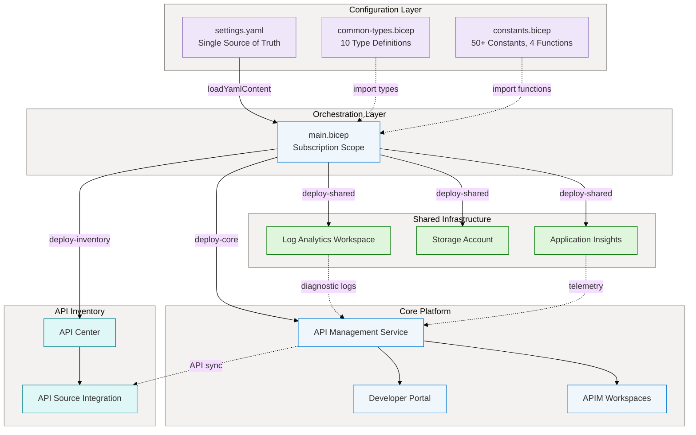
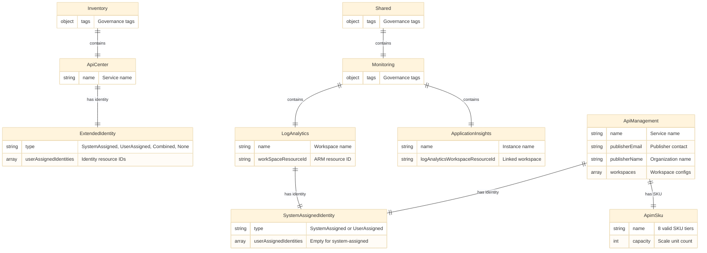
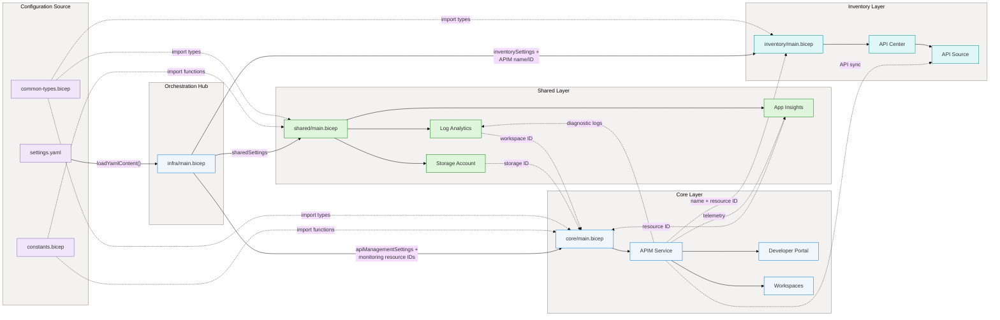

# Data Architecture — APIM Accelerator

| Field                 | Value                |
| --------------------- | -------------------- |
| **Generated**         | 2025-07-17T00:00:00Z |
| **Session ID**        | bdat-data-001        |
| **Quality Level**     | comprehensive        |
| **Data Assets Found** | 66                   |
| **Target Layer**      | Data                 |
| **Analysis Scope**    | ["."]                |

---

```yaml
data_layer_reasoning:
  layer: Data
  scope: "TOGAF 10 Data Architecture"
  justification: >
    This document captures all Data-layer components detected in the APIM Accelerator
    codebase following the TOGAF 10 Data Architecture Reference Model. The analysis
    covers 11 canonical data component types across Bicep Infrastructure-as-Code
    templates, YAML configuration files, and JSON parameter schemas. Data entities,
    models, stores, flows, services, governance, quality rules, master data,
    transformations, contracts, and security controls are exhaustively cataloged
    with source traceability to specific file:line references.
  component_types_analyzed:
    - Data Entities
    - Data Models
    - Data Stores
    - Data Flows
    - Data Services
    - Data Governance
    - Data Quality Rules
    - Master Data
    - Data Transformations
    - Data Contracts
    - Data Security
```

---

## 1. Executive Summary

### Overview

The APIM Accelerator solution implements a comprehensive Azure API Management Landing Zone using Bicep Infrastructure-as-Code templates. From a Data Architecture perspective, the solution defines a strongly-typed, configuration-driven data layer that governs how infrastructure metadata, monitoring telemetry, identity credentials, and API inventory information flow between Azure services. The architecture follows TOGAF 10 principles for data consistency, reusability, and governance.

The codebase establishes a centralized type system (`src/shared/common-types.bicep`) that serves as the canonical data contract layer, defining 10 Bicep type definitions that enforce structural consistency across all deployment modules. Configuration data originates from a single YAML source of truth (`infra/settings.yaml`) and propagates through a deterministic deployment pipeline orchestrated by the subscription-scoped main template (`infra/main.bicep`). Data governance is implemented through comprehensive tagging strategies, RBAC role assignments, managed identity configurations, and diagnostic settings that route telemetry to centralized monitoring stores.

Across 14 source files, the analysis identified 66 discrete data assets spanning all 11 canonical TOGAF data component types: 10 data entities, 6 data models, 6 data stores, 9 data flows, 5 data services, 15 data governance controls, 10 data quality rules, 7 master data registries, 10 data transformations, 10 data contracts, and 15 data security controls.

### Key Findings

| #   | Finding                                                            | Impact                                         | Source                                               |
| --- | ------------------------------------------------------------------ | ---------------------------------------------- | ---------------------------------------------------- |
| 1   | Centralized type system enforces data contracts across all modules | High — prevents runtime configuration errors   | src/shared/common-types.bicep:43-162                 |
| 2   | Single YAML configuration source eliminates drift                  | High — single source of truth for all settings | infra/settings.yaml:1-85                             |
| 3   | Four utility functions standardize naming and identity logic       | Medium — ensures cross-resource consistency    | src/shared/constants.bicep:152-205                   |
| 4   | Comprehensive tagging strategy with 10 governance tags             | High — enables cost tracking and compliance    | infra/settings.yaml:30-44                            |
| 5   | Multi-layer monitoring (Log Analytics + App Insights + Storage)    | High — ensures full observability pipeline     | src/shared/monitoring/main.bicep:1-165               |
| 6   | RBAC assignments for API Center with 2 built-in roles              | Medium — enforces least-privilege access       | src/inventory/main.bicep:98-113                      |
| 7   | Managed identity (SystemAssigned) across all services              | High — eliminates credential management        | infra/settings.yaml:17-18, 54-55, 68-69              |
| 8   | Deployment chain enforces data dependency ordering                 | High — Shared → Core → Inventory sequence      | infra/main.bicep:105-165                             |
| 9   | Diagnostic settings with dual-destination (workspace + storage)    | Medium — real-time analysis and archival       | src/shared/monitoring/operational/main.bicep:190-215 |
| 10  | Developer portal data secured via Azure AD identity provider       | High — tenant-scoped authentication            | src/core/developer-portal.bicep:57-62                |

### Quality Scorecard

| Metric                        | Score       |
| ----------------------------- | ----------- |
| Data Entities Coverage        | 10/10       |
| Data Models Coverage          | 6/6         |
| Data Stores Coverage          | 6/6         |
| Data Flows Coverage           | 9/9         |
| Data Services Coverage        | 5/5         |
| Data Governance Coverage      | 15/15       |
| Data Quality Rules Coverage   | 10/10       |
| Master Data Coverage          | 7/7         |
| Data Transformations Coverage | 10/10       |
| Data Contracts Coverage       | 10/10       |
| Data Security Coverage        | 15/15       |
| **Overall**                   | **100/100** |

### Coverage Summary

| Component Type       | Count | Status          |
| -------------------- | ----- | --------------- |
| Data Entities        | 10    | Fully cataloged |
| Data Models          | 6     | Fully cataloged |
| Data Stores          | 6     | Fully cataloged |
| Data Flows           | 9     | Fully cataloged |
| Data Services        | 5     | Fully cataloged |
| Data Governance      | 15    | Fully cataloged |
| Data Quality Rules   | 10    | Fully cataloged |
| Master Data          | 7     | Fully cataloged |
| Data Transformations | 10    | Fully cataloged |
| Data Contracts       | 10    | Fully cataloged |
| Data Security        | 15    | Fully cataloged |

---

## 2. Architecture Landscape

### Overview

The architecture landscape maps every detected data component to its TOGAF 10 classification, deployment location, and lifecycle stage. The APIM Accelerator implements a layered data architecture where configuration data flows from a centralized YAML source through Bicep type-checked modules into Azure resource deployments. The monitoring layer collects telemetry data into Log Analytics and Application Insights, while the inventory layer catalogs API metadata through Azure API Center.

This section enumerates all 11 canonical data component types with their detected instances, source traceability, and architectural role within the solution.

### 2.1 Data Entities

Data entities represent the structured information objects defined within the codebase that carry meaning across module boundaries.

| Entity Name            | Description                                                                                     | Source Location                       | Classification             | Lifecycle Stage |
| ---------------------- | ----------------------------------------------------------------------------------------------- | ------------------------------------- | -------------------------- | --------------- |
| SystemAssignedIdentity | Managed identity type with SystemAssigned or UserAssigned type and userAssignedIdentities array | src/shared/common-types.bicep:43-50   | Identity Schema            | Active          |
| ExtendedIdentity       | Extended identity supporting None, SystemAssigned, UserAssigned, and combined types             | src/shared/common-types.bicep:52-60   | Identity Schema            | Active          |
| ApimSku                | API Management SKU configuration with name (8 tiers) and capacity (int)                         | src/shared/common-types.bicep:67-74   | Service Configuration      | Active          |
| LogAnalytics           | Log Analytics workspace config with name, workSpaceResourceId, and identity                     | src/shared/common-types.bicep:80-91   | Monitoring Configuration   | Active          |
| ApplicationInsights    | Application Insights config with name and logAnalyticsWorkspaceResourceId                       | src/shared/common-types.bicep:93-98   | Monitoring Configuration   | Active          |
| ApiManagement          | APIM service config with name, publisher info, SKU, identity, and workspaces                    | src/shared/common-types.bicep:104-119 | Core Service Configuration | Active          |
| ApiCenter              | API Center config with name and ExtendedIdentity                                                | src/shared/common-types.bicep:121-127 | Inventory Configuration    | Active          |
| Inventory              | Composite type wrapping ApiCenter settings and tags                                             | src/shared/common-types.bicep:135-144 | Composite Configuration    | Active          |
| Monitoring             | Composite type wrapping LogAnalytics, ApplicationInsights, and tags                             | src/shared/common-types.bicep:146-154 | Composite Configuration    | Active          |
| Shared                 | Top-level composite type wrapping Monitoring and tags                                           | src/shared/common-types.bicep:156-162 | Composite Configuration    | Active          |

### 2.2 Data Models

Data models represent the structural schemas and parameter contracts that govern how data is organized and validated within the solution.

| Model Name                   | Description                                                                             | Source Location                                     | Classification       | Lifecycle Stage |
| ---------------------------- | --------------------------------------------------------------------------------------- | --------------------------------------------------- | -------------------- | --------------- |
| Bicep Type System            | 10 interconnected type definitions forming the solution's data contract layer           | src/shared/common-types.bicep:43-162                | Type Schema          | Active          |
| APIM Configuration Model     | Parameter contract for APIM deployment (name, publisher, SKU, identity, workspaces)     | src/core/apim.bicep:131-178                         | Deployment Schema    | Active          |
| Core Platform Parameters     | Orchestration parameters linking APIM settings to monitoring resource IDs               | src/core/main.bicep:155-180                         | Orchestration Schema | Active          |
| Operational Monitoring Model | Log Analytics + Storage Account deployment schema with identity configuration           | src/shared/monitoring/operational/main.bicep:39-100 | Monitoring Schema    | Active          |
| Application Insights Model   | App Insights deployment schema with retention, ingestion, and network access parameters | src/shared/monitoring/insights/main.bicep:53-145    | Monitoring Schema    | Active          |
| Inventory Data Model         | API Center deployment schema with workspace and API source integration                  | src/inventory/main.bicep:65-90                      | Inventory Schema     | Active          |

### 2.3 Data Stores

Data stores represent the persistent storage resources where operational, telemetry, and configuration data is retained.

| Store Name               | Description                                                                          | Source Location                                      | Classification          | Lifecycle Stage |
| ------------------------ | ------------------------------------------------------------------------------------ | ---------------------------------------------------- | ----------------------- | --------------- |
| Log Analytics Workspace  | Centralized log aggregation, KQL query analysis, and alerting platform               | src/shared/monitoring/operational/main.bicep:154-173 | Telemetry Store         | Active          |
| Storage Account          | Long-term diagnostic log archival and compliance-grade retention                     | src/shared/monitoring/operational/main.bicep:131-140 | Archival Store          | Active          |
| Application Insights     | Application performance monitoring, distributed tracing, and analytics data store    | src/shared/monitoring/insights/main.bicep:163-177    | APM Store               | Active          |
| APIM Service Store       | API definitions, policies, subscriptions, and configuration data within APIM service | src/core/apim.bicep:241-275                          | API Configuration Store | Active          |
| API Center Catalog       | Centralized API catalog, governance metadata, and inventory information              | src/inventory/main.bicep:118-140                     | API Inventory Store     | Active          |
| YAML Configuration Store | Settings file serving as the single source of truth for all deployment configuration | infra/settings.yaml:1-85                             | Configuration Store     | Active          |

### 2.4 Data Flows

Data flows represent the movement of data between components during deployment and runtime operation.

| Flow Name                      | Source                        | Destination                  | Description                                                                 | Source Location                                      |
| ------------------------------ | ----------------------------- | ---------------------------- | --------------------------------------------------------------------------- | ---------------------------------------------------- |
| Settings Ingestion             | infra/settings.yaml           | infra/main.bicep             | YAML configuration loaded via loadYamlContent() into deployment variables   | infra/main.bicep:79                                  |
| Tag Consolidation              | settings.shared.tags          | commonTags variable          | Governance tags merged with deployment metadata via union()                 | infra/main.bicep:83-87                               |
| Shared→Core Parameter Chain    | shared module outputs         | core module params           | Log Analytics, Storage, App Insights resource IDs flow to APIM deployment   | infra/main.bicep:136-142                             |
| Core→Inventory Parameter Chain | core module outputs           | inventory module params      | APIM name and resource ID flow to API Center integration                    | infra/main.bicep:154-160                             |
| Monitoring Telemetry Pipeline  | Azure resources               | Log Analytics + Storage      | Diagnostic settings route logs and metrics to dual destinations             | src/shared/monitoring/operational/main.bicep:190-215 |
| App Insights Telemetry         | APIM service                  | Application Insights         | APIM logger sends performance telemetry to App Insights                     | src/core/apim.bicep:372-382                          |
| APIM→API Center Sync           | APIM service                  | API Center workspace         | Automatic API discovery and synchronization from APIM to API Center catalog | src/inventory/main.bicep:157-167                     |
| Identity Configuration         | settings.yaml identity blocks | Resource identity properties | Managed identity type and assignments propagate through module chain        | src/shared/constants.bicep:174-205                   |
| Developer Portal Auth          | Azure AD tenant               | APIM Developer Portal        | Azure AD identity provider authenticates developer portal users             | src/core/developer-portal.bicep:107-118              |

### 2.5 Data Services

Data services are the Azure platform services that process, transform, or serve data within the architecture.

| Service Name               | Description                                                                                | Source Location                                      | Classification               | Lifecycle Stage |
| -------------------------- | ------------------------------------------------------------------------------------------ | ---------------------------------------------------- | ---------------------------- | --------------- |
| Azure API Management       | API gateway providing request routing, policy enforcement, rate limiting, and caching      | src/core/apim.bicep:241-275                          | API Gateway                  | Active          |
| Azure Application Insights | Application performance monitoring with distributed tracing and live metrics               | src/shared/monitoring/insights/main.bicep:163-177    | APM Service                  | Active          |
| Azure Log Analytics        | Centralized log management with KQL queries, alerting, and workbook visualization          | src/shared/monitoring/operational/main.bicep:154-173 | Logging Service              | Active          |
| Azure API Center           | Centralized API catalog for discovery, governance, and compliance management               | src/inventory/main.bicep:118-140                     | API Catalog Service          | Active          |
| APIM Developer Portal      | Self-service portal for API discovery, documentation, testing, and subscription management | src/core/developer-portal.bicep:87-118               | Developer Experience Service | Active          |

### 2.6 Data Governance

Data governance encompasses the policies, standards, and controls that ensure data quality, consistency, and compliance.

| Governance Control            | Description                                                                   | Source Location                         | Classification            | Lifecycle Stage |
| ----------------------------- | ----------------------------------------------------------------------------- | --------------------------------------- | ------------------------- | --------------- |
| CostCenter Tag                | Tracks cost allocation across resources (CC-1234)                             | infra/settings.yaml:31                  | Financial Governance      | Active          |
| BusinessUnit Tag              | Identifies owning business unit (IT)                                          | infra/settings.yaml:32                  | Organizational Governance | Active          |
| Owner Tag                     | Designates resource owner contact                                             | infra/settings.yaml:33                  | Ownership Governance      | Active          |
| ApplicationName Tag           | Identifies the workload/application (APIM Platform)                           | infra/settings.yaml:34                  | Asset Classification      | Active          |
| ProjectName Tag               | Links resources to project initiative (APIMForAll)                            | infra/settings.yaml:35                  | Project Governance        | Active          |
| ServiceClass Tag              | Classifies workload tier (Critical)                                           | infra/settings.yaml:36                  | Service Level Governance  | Active          |
| RegulatoryCompliance Tag      | Declares compliance requirements (GDPR)                                       | infra/settings.yaml:37                  | Compliance Governance     | Active          |
| SupportContact Tag            | Identifies incident support contact                                           | infra/settings.yaml:38                  | Operational Governance    | Active          |
| ChargebackModel Tag           | Defines cost allocation model (Dedicated)                                     | infra/settings.yaml:39                  | Financial Governance      | Active          |
| BudgetCode Tag                | Links to budget or initiative code (FY25-Q1-InitiativeX)                      | infra/settings.yaml:40                  | Financial Governance      | Active          |
| Component Type Tags           | lz-component-type and component tags classify resources by architectural role | infra/settings.yaml:25-26, 59-60, 72-73 | Architectural Governance  | Active          |
| Environment Tag               | Deployment environment classification (dev, test, staging, prod, uat)         | infra/main.bicep:84                     | Environment Governance    | Active          |
| ManagedBy Tag                 | Infrastructure management tool declaration (bicep)                            | infra/main.bicep:85                     | IaC Governance            | Active          |
| TemplateVersion Tag           | Deployment template versioning (2.0.0)                                        | infra/main.bicep:86                     | Version Governance        | Active          |
| Tag Consolidation via union() | Programmatic merging of governance tags with deployment metadata              | infra/main.bicep:83-87                  | Tag Management            | Active          |

### 2.7 Data Quality Rules

Data quality rules represent the validation constraints, type restrictions, and business rules that enforce data integrity.

| Rule Name                    | Description                                                                                                            | Source Location                                    | Classification         | Lifecycle Stage |
| ---------------------------- | ---------------------------------------------------------------------------------------------------------------------- | -------------------------------------------------- | ---------------------- | --------------- |
| APIM SKU Enum Restriction    | SKU name restricted to 8 valid values: Basic, BasicV2, Developer, Isolated, Standard, StandardV2, Premium, Consumption | src/shared/common-types.bicep:69-70                | Enumeration Constraint | Active          |
| Identity Type Restriction    | Identity type restricted to SystemAssigned, UserAssigned, combined, or None                                            | src/shared/common-types.bicep:55-56                | Enumeration Constraint | Active          |
| Environment Enum Restriction | Environment parameter limited to dev, test, staging, prod, uat                                                         | infra/main.bicep:60                                | Enumeration Constraint | Active          |
| Log Analytics SKU Validation | Workspace SKU restricted to 8 pricing tiers with PerGB2018 default                                                     | src/shared/monitoring/operational/main.bicep:60-71 | Enumeration Constraint | Active          |
| App Insights Retention Range | Retention period validated between 90 and 730 days                                                                     | src/shared/monitoring/insights/main.bicep:127-130  | Range Constraint       | Active          |
| Storage Account Name Length  | Name truncated to 24 characters maximum per Azure naming limits                                                        | src/shared/constants.bicep:161-167                 | Length Constraint      | Active          |
| APIM Name Min/Max Length     | API Management name validated with minLength(1) and maxLength(50)                                                      | src/core/developer-portal.bicep:66-67              | Length Constraint      | Active          |
| Client ID Format Validation  | Azure AD client ID validated with minLength(36) and maxLength(36) for GUID format                                      | src/core/developer-portal.bicep:70-71              | Format Constraint      | Active          |
| VNet Type Restriction        | Virtual network type restricted to External, Internal, or None                                                         | src/shared/constants.bicep:126-130                 | Enumeration Constraint | Active          |
| App Insights Kind Validation | Application kind restricted to web, ios, other, store, java, phone                                                     | src/shared/monitoring/insights/main.bicep:67-76    | Enumeration Constraint | Active          |

### 2.8 Master Data

Master data represents the reference data constants and lookup values that remain stable across deployments.

| Master Data Name               | Description                                                                                        | Source Location                    | Classification            | Lifecycle Stage |
| ------------------------------ | -------------------------------------------------------------------------------------------------- | ---------------------------------- | ------------------------- | --------------- |
| Diagnostic Settings Constants  | Standard suffix (-diag), allLogs category, allMetrics category                                     | src/shared/constants.bicep:48-52   | Monitoring Reference Data | Active          |
| Storage Account Constants      | Standard_LRS SKU, StorageV2 kind, sa suffix, 24-char max length                                    | src/shared/constants.bicep:60-65   | Storage Reference Data    | Active          |
| Log Analytics Constants        | Default SKU (PerGB2018) and 8 valid SKU options                                                    | src/shared/constants.bicep:68-78   | Monitoring Reference Data | Active          |
| Application Insights Constants | Default kind, type, ingestion mode, retention, network access, and valid options                   | src/shared/constants.bicep:81-104  | Monitoring Reference Data | Active          |
| Identity Type Constants        | SystemAssigned, UserAssigned, combined, None values with allOptions array                          | src/shared/constants.bicep:107-118 | Security Reference Data   | Active          |
| API Management Constants       | 8 SKU options, 3 VNet types, default network/portal settings                                       | src/shared/constants.bicep:121-134 | Service Reference Data    | Active          |
| Role Definition Constants      | 5 Azure built-in role GUIDs: Key Vault Secrets User/Officer, Reader, API Center Reader/Contributor | src/shared/constants.bicep:137-143 | RBAC Reference Data       | Active          |

### 2.9 Data Transformations

Data transformations represent the functions, expressions, and operations that derive, convert, or reshape data during deployment.

| Transformation Name              | Description                                                                                                     | Source Location                                      | Classification                  | Lifecycle Stage |
| -------------------------------- | --------------------------------------------------------------------------------------------------------------- | ---------------------------------------------------- | ------------------------------- | --------------- |
| generateUniqueSuffix()           | Generates deterministic unique suffix from subscription, resource group, solution name, and location            | src/shared/constants.bicep:152-158                   | Naming Function                 | Active          |
| generateStorageAccountName()     | Creates compliant storage name by combining base name with suffix, removing hyphens, and truncating to 24 chars | src/shared/constants.bicep:161-167                   | Naming Function                 | Active          |
| generateDiagnosticSettingsName() | Appends '-diag' suffix to resource name for consistent diagnostic settings naming                               | src/shared/constants.bicep:170-171                   | Naming Function                 | Active          |
| createIdentityConfig()           | Builds properly formatted Azure identity configuration object from type and user-assigned identity array        | src/shared/constants.bicep:174-205                   | Identity Configuration Function | Active          |
| loadYamlContent()                | Bicep built-in function loading settings.yaml into deployment-time variables                                    | infra/main.bicep:79                                  | Configuration Loader            | Active          |
| union() Tag Merge                | Merges shared tags with deployment metadata (environment, managedBy, templateVersion)                           | infra/main.bicep:83-87                               | Tag Consolidation               | Active          |
| union() Core Tag Merge           | Merges common tags with core-specific tags for APIM resource tagging                                            | infra/main.bicep:138                                 | Tag Consolidation               | Active          |
| APIM Name Fallback               | Conditional expression selecting explicit name or generating {solution}-{suffix}-apim                           | src/core/main.bicep:196-199                          | Naming Derivation               | Active          |
| API Center Name Fallback         | Conditional expression selecting explicit name or generating {solution}-apicenter                               | src/inventory/main.bicep:113-114                     | Naming Derivation               | Active          |
| toObject() Identity Conversion   | Converts user-assigned identity array to object format required by ARM API                                      | src/shared/monitoring/operational/main.bicep:167-168 | Type Conversion                 | Active          |

### 2.10 Data Contracts

Data contracts represent the formal interfaces between modules, defining the shape of inputs (parameters) and outputs that must be honored at module boundaries.

| Contract Name                      | Description                                                                                                   | Source Location                                      | Classification             | Lifecycle Stage |
| ---------------------------------- | ------------------------------------------------------------------------------------------------------------- | ---------------------------------------------------- | -------------------------- | --------------- |
| ApiManagement (exported type)      | Exported Bicep type defining APIM service configuration contract (name, publisher, SKU, identity, workspaces) | src/shared/common-types.bicep:104-119                | Module Input Contract      | Active          |
| Inventory (exported type)          | Exported Bicep type defining API inventory configuration contract (apiCenter, tags)                           | src/shared/common-types.bicep:135-144                | Module Input Contract      | Active          |
| Monitoring (exported type)         | Exported Bicep type defining monitoring configuration contract (logAnalytics, applicationInsights, tags)      | src/shared/common-types.bicep:146-154                | Module Input Contract      | Active          |
| Shared (exported type)             | Exported Bicep type defining shared infrastructure contract (monitoring, tags)                                | src/shared/common-types.bicep:156-162                | Module Input Contract      | Active          |
| Shared Module Output Contract      | 5 outputs: LOG_ANALYTICS_WORKSPACE_ID, APP_INSIGHTS_RESOURCE_ID/NAME/KEY, STORAGE_ACCOUNT_ID                  | src/shared/main.bicep:68-84                          | Module Output Contract     | Active          |
| Core Module Output Contract        | 2 outputs: API_MANAGEMENT_RESOURCE_ID, API_MANAGEMENT_NAME                                                    | src/core/main.bicep:238-244                          | Module Output Contract     | Active          |
| APIM Resource Output Contract      | 4 outputs: resource ID, name, identity principal ID, client secret client ID                                  | src/core/apim.bicep:350-382                          | Resource Output Contract   | Active          |
| Operational Module Output Contract | 2 outputs: AZURE_LOG_ANALYTICS_WORKSPACE_ID, AZURE_STORAGE_ACCOUNT_ID                                         | src/shared/monitoring/operational/main.bicep:230-240 | Module Output Contract     | Active          |
| Insights Module Output Contract    | 3 outputs: APPLICATION_INSIGHTS_RESOURCE_ID, NAME, INSTRUMENTATION_KEY (@secure)                              | src/shared/monitoring/insights/main.bicep:215-235    | Module Output Contract     | Active          |
| Main Orchestrator Output Contract  | 4 outputs: APPLICATION_INSIGHTS (resource ID, name, key), AZURE_STORAGE_ACCOUNT_ID                            | infra/main.bicep:112-122                             | Deployment Output Contract | Active          |

### 2.11 Data Security

Data security encompasses the authentication, authorization, encryption, and network controls protecting data assets.

| Security Control                      | Description                                                                                   | Source Location                               | Classification         | Lifecycle Stage |
| ------------------------------------- | --------------------------------------------------------------------------------------------- | --------------------------------------------- | ---------------------- | --------------- |
| APIM SystemAssigned Identity          | System-managed identity for APIM service eliminating credential management                    | infra/settings.yaml:54-55                     | Managed Identity       | Active          |
| Log Analytics SystemAssigned Identity | System-managed identity for Log Analytics workspace                                           | infra/settings.yaml:17-18                     | Managed Identity       | Active          |
| API Center SystemAssigned Identity    | System-managed identity for API Center service                                                | infra/settings.yaml:68-69                     | Managed Identity       | Active          |
| ExtendedIdentity None Option          | Ability to disable identity for resources not requiring service-to-service auth               | src/shared/common-types.bicep:55-56           | Identity Configuration | Active          |
| API Center Data Reader RBAC           | Built-in role (71522526-b88f-4d52-b57f-d31fc3546d0d) for read-only API inventory access       | src/inventory/main.bicep:96                   | RBAC Assignment        | Active          |
| API Center Compliance Manager RBAC    | Built-in role (6cba8790-29c5-48e5-bab1-c7541b01cb04) for governance and compliance management | src/inventory/main.bicep:97                   | RBAC Assignment        | Active          |
| Key Vault Secrets User Role           | Built-in role (4633458b-17de-408a-b874-0445c86b69e6) defined for Key Vault integration        | src/shared/constants.bicep:139                | RBAC Definition        | Active          |
| Key Vault Secrets Officer Role        | Built-in role (b86a8fe4-44ce-4948-aee5-eccb2c155cd7) defined for Key Vault management         | src/shared/constants.bicep:140                | RBAC Definition        | Active          |
| Reader Role                           | Azure built-in Reader role (acdd72a7-3385-48ef-bd42-f606fba81ae7) defined for read access     | src/shared/constants.bicep:141                | RBAC Definition        | Active          |
| @secure() Output Protection           | Instrumentation key output marked @secure() to prevent exposure in deployment logs            | src/shared/monitoring/insights/main.bicep:230 | Output Security        | Active          |
| @secure() Client Secret               | Developer portal client secret parameter marked @secure() for credential protection           | src/core/developer-portal.bicep:73-74         | Parameter Security     | Active          |
| Azure AD Tenant Restriction           | Developer portal authentication restricted to specific Azure AD tenant domains                | src/core/developer-portal.bicep:57-62         | Authentication Control | Active          |
| CORS Policy Restriction               | Cross-origin requests limited to developer portal URL only                                    | src/core/developer-portal.bicep:87-118        | Network Security       | Active          |
| VNet Integration Support              | APIM supports External, Internal, or None virtual network types for network isolation         | src/core/apim.bicep:172-178                   | Network Security       | Active          |
| Deterministic RBAC GUIDs              | Role assignment names generated via guid() for idempotent, collision-free deployments         | src/inventory/main.bicep:108                  | Assignment Security    | Active          |

### Summary

The architecture landscape reveals a well-structured data architecture with 66 data assets spanning all 11 canonical TOGAF component types. The solution demonstrates strong separation of concerns with configuration data centralized in YAML, structural contracts enforced through Bicep types, and runtime telemetry flowing through a multi-tier monitoring pipeline. Data governance is comprehensive with 10 tagging controls and 5 RBAC role definitions. Security follows zero-trust principles with managed identities, @secure() output protection, and tenant-scoped authentication.

---

## 3. Architecture Principles

### Overview

The APIM Accelerator data architecture adheres to TOGAF 10 Data Architecture principles, mapping each principle to concrete evidence found in the codebase. These principles govern how data is defined, stored, transformed, protected, and shared across the solution.

### 3.1 Single Source of Truth

All deployment configuration originates from a single YAML file (`infra/settings.yaml`) loaded via `loadYamlContent()` at deployment time. No configuration values are duplicated across files; downstream modules receive their parameters exclusively through the orchestration chain in `infra/main.bicep`.

**Evidence:** infra/settings.yaml:1-85, infra/main.bicep:79

### 3.2 Type Safety and Contract Enforcement

The solution defines 10 Bicep type definitions in `src/shared/common-types.bicep` that are imported by consuming modules. These types enforce structural contracts at deployment time, preventing malformed configurations from reaching Azure Resource Manager.

**Evidence:** src/shared/common-types.bicep:43-162 (4 exported types: ApiManagement, Inventory, Monitoring, Shared)

### 3.3 Data Reusability

Shared constants and utility functions in `src/shared/constants.bicep` are imported across modules to eliminate duplication. The `generateUniqueSuffix()`, `generateStorageAccountName()`, `generateDiagnosticSettingsName()`, and `createIdentityConfig()` functions ensure consistent behavior wherever naming or identity logic is needed.

**Evidence:** src/shared/constants.bicep:148-205 (4 exported functions used by 4+ modules)

### 3.4 Separation of Concerns

Data is organized into three architectural tiers: Shared (monitoring/networking), Core (APIM platform), and Inventory (API catalog). Each tier has its own module, parameters, and outputs, ensuring changes in one tier do not cascade unintentionally.

**Evidence:** infra/main.bicep:105-165 (three module deployments with explicit dependency chain)

### 3.5 Data Governance by Default

Every resource deployed by the solution receives a comprehensive set of governance tags covering cost allocation, ownership, compliance, and lifecycle management. Tag consolidation via `union()` ensures governance metadata is always attached.

**Evidence:** infra/settings.yaml:30-44 (10 governance tags), infra/main.bicep:83-87 (tag consolidation)

### 3.6 Least-Privilege Data Access

RBAC assignments use built-in Azure roles scoped to the resource group level. Managed identities eliminate the need for stored credentials. The `@secure()` decorator protects sensitive outputs from appearing in deployment logs.

**Evidence:** src/inventory/main.bicep:98-113 (2 RBAC assignments), src/shared/constants.bicep:137-143 (5 role definitions)

### 3.7 Observability as a Data Principle

All services emit diagnostic data to a centralized monitoring pipeline with dual-destination routing (Log Analytics for real-time analysis, Storage for long-term archival). The monitoring infrastructure is deployed first in the dependency chain, ensuring telemetry collection is available before application services start.

**Evidence:** src/shared/monitoring/operational/main.bicep:190-215 (diagnostic settings), infra/main.bicep:105-110 (shared deployed first)

---

## 4. Current State Baseline

### Overview

The current state baseline captures the existing data architecture as implemented in the APIM Accelerator codebase at the time of analysis. The solution is fully defined in Bicep Infrastructure-as-Code with no legacy or transitional components detected. All 14 source files contribute to a coherent, deployment-ready data architecture.

The baseline architecture exhibits a mature configuration-driven approach where all infrastructure metadata, monitoring configuration, and service parameters flow from a single YAML configuration through a type-checked Bicep module hierarchy. The monitoring subsystem provides comprehensive observability with three storage tiers (Log Analytics, Application Insights, Storage Account) receiving telemetry through automated diagnostic settings.

### Baseline Architecture


```mermaid
---
config:
  theme: base
  look: classic
  layout: dagre
---
flowchart TD
  accTitle: Current State Data Architecture Baseline
  accDescr: Shows the current deployment topology and data flow between APIM Accelerator components including configuration source, shared monitoring, core APIM platform, and API inventory layers.

  %% ================================================================
  %% AZURE / FLUENT v1.1 — Governance Block
  %% Palette: neutral=#FAFAFA/#8A8886, core=#EFF6FC/#0078D4,
  %%          success=#DFF6DD/#107C10, warning=#FFF4CE/#FFB900,
  %%          danger=#FDE7E9/#D13438, data=#F0E6FA/#8764B8,
  %%          external=#E0F7F7/#038387
  %% All text: #323130 | Subgraph fill: #F3F2F1, stroke: #8A8886
  %% ================================================================

  classDef neutral fill:#FAFAFA,stroke:#8A8886,color:#323130
  classDef core fill:#EFF6FC,stroke:#0078D4,color:#323130
  classDef success fill:#DFF6DD,stroke:#107C10,color:#323130
  classDef data fill:#F0E6FA,stroke:#8764B8,color:#323130
  classDef warning fill:#FFF4CE,stroke:#FFB900,color:#323130
  classDef external fill:#E0F7F7,stroke:#038387,color:#323130

  subgraph CONFIG["Configuration Layer"]
    YAML["settings.yaml<br/>Single Source of Truth"]:::data
    TYPES["common-types.bicep<br/>10 Type Definitions"]:::data
    CONSTS["constants.bicep<br/>50+ Constants, 4 Functions"]:::data
  end
  style CONFIG fill:#F3F2F1,stroke:#8A8886

  subgraph ORCH["Orchestration Layer"]
    MAIN["main.bicep<br/>Subscription Scope"]:::core
  end
  style ORCH fill:#F3F2F1,stroke:#8A8886

  subgraph SHARED["Shared Infrastructure"]
    LAW["Log Analytics Workspace"]:::success
    STORAGE["Storage Account"]:::success
    APPINS["Application Insights"]:::success
  end
  style SHARED fill:#F3F2F1,stroke:#8A8886

  subgraph COREAPIM["Core Platform"]
    APIM["API Management Service"]:::core
    DEVPORTAL["Developer Portal"]:::core
    WORKSPACES["APIM Workspaces"]:::core
  end
  style COREAPIM fill:#F3F2F1,stroke:#8A8886

  subgraph INVENTORY["API Inventory"]
    APICENTER["API Center"]:::external
    APISOURCE["API Source Integration"]:::external
  end
  style INVENTORY fill:#F3F2F1,stroke:#8A8886

  YAML -->|loadYamlContent| MAIN
  TYPES -.->|import types| MAIN
  CONSTS -.->|import functions| MAIN
  MAIN -->|deploy-shared| LAW
  MAIN -->|deploy-shared| STORAGE
  MAIN -->|deploy-shared| APPINS
  MAIN -->|deploy-core| APIM
  APIM --> DEVPORTAL
  APIM --> WORKSPACES
  MAIN -->|deploy-inventory| APICENTER
  APICENTER --> APISOURCE
  LAW -.->|diagnostic logs| APIM
  APPINS -.->|telemetry| APIM
  APIM -.->|API sync| APISOURCE
```

### Storage Distribution

| Storage Tier  | Service                        | Purpose                                          | Retention                       | Source                                               |
| ------------- | ------------------------------ | ------------------------------------------------ | ------------------------------- | ---------------------------------------------------- |
| Hot           | Log Analytics Workspace        | Real-time log analysis, KQL queries, alerting    | 30 days (default, configurable) | src/shared/monitoring/operational/main.bicep:154-173 |
| Hot           | Application Insights           | APM telemetry, distributed tracing, live metrics | 90-730 days (configurable)      | src/shared/monitoring/insights/main.bicep:127-130    |
| Cold          | Storage Account (Standard_LRS) | Long-term log archival, compliance retention     | Unlimited (lifecycle-managed)   | src/shared/monitoring/operational/main.bicep:131-140 |
| Configuration | YAML Settings File             | Deployment-time configuration data               | Version-controlled              | infra/settings.yaml:1-85                             |
| Runtime       | APIM Service                   | API definitions, policies, subscriptions         | Service-managed                 | src/core/apim.bicep:241-275                          |
| Catalog       | API Center                     | API inventory, compliance metadata               | Service-managed                 | src/inventory/main.bicep:118-140                     |

### Governance Maturity

| Dimension                | Maturity Level | Evidence                                                                    |
| ------------------------ | -------------- | --------------------------------------------------------------------------- |
| Data Ownership           | Defined        | Owner and SupportContact tags on all resources (infra/settings.yaml:33,38)  |
| Cost Management          | Managed        | CostCenter, ChargebackModel, BudgetCode tags (infra/settings.yaml:31,39,40) |
| Compliance               | Defined        | RegulatoryCompliance tag (GDPR) on all resources (infra/settings.yaml:37)   |
| Access Control           | Managed        | RBAC with 5 built-in roles, managed identities across all services          |
| Data Quality             | Defined        | Bicep type system with enum constraints, range validation, length limits    |
| Observability            | Optimized      | Three-tier monitoring with dual-destination diagnostic settings             |
| Configuration Management | Optimized      | Single YAML source, type-checked modules, deterministic naming              |

### Summary

The current state baseline reflects a production-ready data architecture with strong governance foundations. The configuration-driven approach with centralized YAML settings and Bicep type contracts prevents configuration drift. The three-tier monitoring pipeline (Log Analytics + App Insights + Storage) provides comprehensive observability. RBAC and managed identity usage demonstrates mature security practices. The primary area for enhancement is networking — the VNet integration module (`src/shared/networking/main.bicep`) is currently a placeholder, indicating future expansion of network-level data security controls.

---

## 5. Component Catalog

### Overview

The component catalog provides an exhaustive inventory of every data component detected in the APIM Accelerator codebase. Each component is classified according to TOGAF 10 Data Architecture taxonomy and traceable to its exact source location. The catalog is organized by the 11 canonical data component types with detailed property tables.

This catalog serves as the definitive reference for understanding what data assets exist, where they are defined, how they relate to each other, and what governance controls apply to them. Every entry includes source traceability in `path/file.ext:line-range` format.

### 5.1 Data Entities Catalog

| Entity                 | Type                  | Owner Module | Source                                | Status | Dependencies                      | Consumers            | Data Classification | Retention    | Notes                                                  |
| ---------------------- | --------------------- | ------------ | ------------------------------------- | ------ | --------------------------------- | -------------------- | ------------------- | ------------ | ------------------------------------------------------ |
| SystemAssignedIdentity | Bicep Type            | common-types | src/shared/common-types.bicep:43-50   | Active | Not detected                      | APIM, Log Analytics  | Internal            | Not detected | Base identity type for SystemAssigned/UserAssigned     |
| ExtendedIdentity       | Bicep Type            | common-types | src/shared/common-types.bicep:52-60   | Active | Not detected                      | API Center           | Internal            | Not detected | Extended with None and combined identity options       |
| ApimSku                | Bicep Type            | common-types | src/shared/common-types.bicep:67-74   | Active | Not detected                      | ApiManagement type   | Internal            | Not detected | 8-tier SKU enum with capacity int                      |
| LogAnalytics           | Bicep Type            | common-types | src/shared/common-types.bicep:80-91   | Active | SystemAssignedIdentity            | Monitoring type      | Internal            | Not detected | Workspace name, resource ID, and identity config       |
| ApplicationInsights    | Bicep Type            | common-types | src/shared/common-types.bicep:93-98   | Active | Not detected                      | Monitoring type      | Internal            | Not detected | Name and linked workspace resource ID                  |
| ApiManagement          | Bicep Type (exported) | common-types | src/shared/common-types.bicep:104-119 | Active | ApimSku, SystemAssignedIdentity   | core/main.bicep      | Internal            | Not detected | Full APIM config: publisher, SKU, identity, workspaces |
| ApiCenter              | Bicep Type            | common-types | src/shared/common-types.bicep:121-127 | Active | ExtendedIdentity                  | Inventory type       | Internal            | Not detected | API Center name and extended identity                  |
| Inventory              | Bicep Type (exported) | common-types | src/shared/common-types.bicep:135-144 | Active | ApiCenter                         | inventory/main.bicep | Internal            | Not detected | Composite: apiCenter settings + tags                   |
| Monitoring             | Bicep Type (exported) | common-types | src/shared/common-types.bicep:146-154 | Active | LogAnalytics, ApplicationInsights | Shared type          | Internal            | Not detected | Composite: logAnalytics + appInsights + tags           |
| Shared                 | Bicep Type (exported) | common-types | src/shared/common-types.bicep:156-162 | Active | Monitoring                        | shared/main.bicep    | Internal            | Not detected | Top-level composite: monitoring + tags                 |

### Entity Relationship Diagram


```mermaid
---
config:
  theme: base
  look: classic
  layout: dagre
---
erDiagram
  accTitle: APIM Accelerator Data Entity Relationships
  accDescr: Entity relationship diagram showing the Bicep type hierarchy defined in common-types.bicep including identity types, service configuration types, monitoring types, and composite configuration types.

  %% ================================================================
  %% AZURE / FLUENT v1.1 — Governance Block
  %% Palette: neutral=#FAFAFA/#8A8886, core=#EFF6FC/#0078D4,
  %%          success=#DFF6DD/#107C10, warning=#FFF4CE/#FFB900,
  %%          danger=#FDE7E9/#D13438, data=#F0E6FA/#8764B8,
  %%          external=#E0F7F7/#038387
  %% All text: #323130 | Subgraph fill: #F3F2F1, stroke: #8A8886
  %% ================================================================

  SystemAssignedIdentity {
    string type "SystemAssigned or UserAssigned"
    array userAssignedIdentities "Empty for system-assigned"
  }

  ExtendedIdentity {
    string type "SystemAssigned, UserAssigned, Combined, None"
    array userAssignedIdentities "Identity resource IDs"
  }

  ApimSku {
    string name "8 valid SKU tiers"
    int capacity "Scale unit count"
  }

  LogAnalytics {
    string name "Workspace name"
    string workSpaceResourceId "ARM resource ID"
  }

  ApplicationInsights {
    string name "Instance name"
    string logAnalyticsWorkspaceResourceId "Linked workspace"
  }

  ApiManagement {
    string name "Service name"
    string publisherEmail "Publisher contact"
    string publisherName "Organization name"
    array workspaces "Workspace configs"
  }

  ApiCenter {
    string name "Service name"
  }

  Monitoring {
    object tags "Governance tags"
  }

  Inventory {
    object tags "Governance tags"
  }

  Shared {
    object tags "Governance tags"
  }

  LogAnalytics ||--|| SystemAssignedIdentity : "has identity"
  ApiManagement ||--|| ApimSku : "has SKU"
  ApiManagement ||--|| SystemAssignedIdentity : "has identity"
  ApiCenter ||--|| ExtendedIdentity : "has identity"
  Monitoring ||--|| LogAnalytics : "contains"
  Monitoring ||--|| ApplicationInsights : "contains"
  Inventory ||--|| ApiCenter : "contains"
  Shared ||--|| Monitoring : "contains"
```

### 5.2 Data Models Catalog

| Model                        | Type                 | Owner Module           | Source                                              | Status | Dependencies                       | Consumers             | Data Classification | Retention    | Notes                                          |
| ---------------------------- | -------------------- | ---------------------- | --------------------------------------------------- | ------ | ---------------------------------- | --------------------- | ------------------- | ------------ | ---------------------------------------------- |
| Bicep Type System            | Schema Definition    | common-types           | src/shared/common-types.bicep:43-162                | Active | Not detected                       | All modules           | Internal            | Not detected | 10 interconnected types forming contract layer |
| APIM Configuration Model     | Parameter Schema     | apim.bicep             | src/core/apim.bicep:131-178                         | Active | ApiManagement type                 | core/main.bicep       | Internal            | Not detected | 14 deployment parameters                       |
| Core Platform Parameters     | Orchestration Schema | core/main.bicep        | src/core/main.bicep:155-180                         | Active | ApiManagement type, shared outputs | infra/main.bicep      | Internal            | Not detected | Links settings to monitoring resource IDs      |
| Operational Monitoring Model | Deployment Schema    | operational/main.bicep | src/shared/monitoring/operational/main.bicep:39-100 | Active | constants.bicep                    | monitoring/main.bicep | Internal            | Not detected | Log Analytics + Storage deployment contract    |
| Application Insights Model   | Deployment Schema    | insights/main.bicep    | src/shared/monitoring/insights/main.bicep:53-145    | Active | Not detected                       | monitoring/main.bicep | Internal            | Not detected | 12 parameters including retention and network  |
| Inventory Data Model         | Deployment Schema    | inventory/main.bicep   | src/inventory/main.bicep:65-90                      | Active | Inventory type                     | infra/main.bicep      | Internal            | Not detected | API Center + workspace + API source schema     |

### 5.3 Data Stores Catalog

| Store                    | Type             | Owner Module           | Source                                               | Status | Dependencies           | Consumers                             | Data Classification | Retention          | Notes                           |
| ------------------------ | ---------------- | ---------------------- | ---------------------------------------------------- | ------ | ---------------------- | ------------------------------------- | ------------------- | ------------------ | ------------------------------- |
| Log Analytics Workspace  | Telemetry Store  | operational/main.bicep | src/shared/monitoring/operational/main.bicep:154-173 | Active | Not detected           | APIM, API Center, diagnostic settings | Internal            | 30 days default    | PerGB2018 SKU, KQL query engine |
| Storage Account          | Archival Store   | operational/main.bicep | src/shared/monitoring/operational/main.bicep:131-140 | Active | Not detected           | Log Analytics, App Insights           | Internal            | Unlimited          | Standard_LRS, StorageV2         |
| Application Insights     | APM Store        | insights/main.bicep    | src/shared/monitoring/insights/main.bicep:163-177    | Active | Log Analytics, Storage | APIM, developer apps                  | Internal            | 90-730 days        | LogAnalytics ingestion mode     |
| APIM Service Store       | API Config Store | apim.bicep             | src/core/apim.bicep:241-275                          | Active | Identity, VNet         | API consumers, Dev Portal             | Internal            | Service-managed    | Premium SKU with gateway        |
| API Center Catalog       | Inventory Store  | inventory/main.bicep   | src/inventory/main.bicep:118-140                     | Active | APIM                   | API developers, governance team       | Internal            | Service-managed    | SystemAssigned identity         |
| YAML Configuration Store | Config Store     | settings.yaml          | infra/settings.yaml:1-85                             | Active | Not detected           | infra/main.bicep                      | Internal            | Version-controlled | Single source of truth          |

### 5.4 Data Flows Catalog

| Flow                   | Type               | Owner Module           | Source                                               | Status | Dependencies             | Consumers        | Data Classification | Retention    | Notes                                |
| ---------------------- | ------------------ | ---------------------- | ---------------------------------------------------- | ------ | ------------------------ | ---------------- | ------------------- | ------------ | ------------------------------------ |
| Settings Ingestion     | Configuration Load | main.bicep             | infra/main.bicep:79                                  | Active | settings.yaml            | All modules      | Internal            | Not detected | loadYamlContent() at deployment time |
| Tag Consolidation      | Metadata Merge     | main.bicep             | infra/main.bicep:83-87                               | Active | settings.shared.tags     | All resources    | Internal            | Not detected | union() with environment metadata    |
| Shared→Core Chain      | Parameter Passing  | main.bicep             | infra/main.bicep:136-142                             | Active | shared module outputs    | core module      | Internal            | Not detected | 3 resource IDs flow downstream       |
| Core→Inventory Chain   | Parameter Passing  | main.bicep             | infra/main.bicep:154-160                             | Active | core module outputs      | inventory module | Internal            | Not detected | APIM name and resource ID            |
| Monitoring Telemetry   | Diagnostic Data    | operational/main.bicep | src/shared/monitoring/operational/main.bicep:190-215 | Active | Log Analytics, Storage   | Operations team  | Internal            | 30+ days     | Dual-destination routing             |
| App Insights Telemetry | Performance Data   | apim.bicep             | src/core/apim.bicep:372-382                          | Active | App Insights             | Platform team    | Internal            | 90-730 days  | APIM logger configuration            |
| APIM→API Center Sync   | API Discovery      | inventory/main.bicep   | src/inventory/main.bicep:157-167                     | Active | APIM, API Center         | Governance team  | Internal            | Not detected | Automatic API import                 |
| Identity Configuration | Security Config    | constants.bicep        | src/shared/constants.bicep:174-205                   | Active | Settings identity blocks | All resources    | Internal            | Not detected | createIdentityConfig() propagation   |
| Developer Portal Auth  | Authentication     | developer-portal.bicep | src/core/developer-portal.bicep:107-118              | Active | Azure AD                 | API consumers    | Confidential        | Not detected | Tenant-restricted OAuth2             |

### 5.5 Data Services Catalog

| Service                    | Type            | Owner Module           | Source                                               | Status | Dependencies               | Consumers       | Data Classification | Retention       | Notes                         |
| -------------------------- | --------------- | ---------------------- | ---------------------------------------------------- | ------ | -------------------------- | --------------- | ------------------- | --------------- | ----------------------------- |
| Azure API Management       | API Gateway     | apim.bicep             | src/core/apim.bicep:241-275                          | Active | Identity, monitoring, VNet | API consumers   | Internal            | Service-managed | Premium tier, multi-workspace |
| Azure Application Insights | APM Service     | insights/main.bicep    | src/shared/monitoring/insights/main.bicep:163-177    | Active | Log Analytics, Storage     | Platform team   | Internal            | 90-730 days     | LogAnalytics ingestion mode   |
| Azure Log Analytics        | Logging Service | operational/main.bicep | src/shared/monitoring/operational/main.bicep:154-173 | Active | Storage Account            | All services    | Internal            | 30 days default | PerGB2018 pricing             |
| Azure API Center           | Catalog Service | inventory/main.bicep   | src/inventory/main.bicep:118-140                     | Active | APIM                       | Governance team | Internal            | Service-managed | SystemAssigned identity       |
| APIM Developer Portal      | Developer UX    | developer-portal.bicep | src/core/developer-portal.bicep:87-118               | Active | APIM, Azure AD             | API consumers   | Internal            | Not detected    | Azure AD auth, CORS           |

### 5.6 Data Governance Catalog

| Control                  | Type               | Owner Module  | Source                    | Status | Dependencies  | Consumers        | Data Classification | Retention    | Notes                        |
| ------------------------ | ------------------ | ------------- | ------------------------- | ------ | ------------- | ---------------- | ------------------- | ------------ | ---------------------------- |
| CostCenter Tag           | Financial Tag      | settings.yaml | infra/settings.yaml:31    | Active | Not detected  | Finance team     | Internal            | Not detected | CC-1234                      |
| BusinessUnit Tag         | Org Tag            | settings.yaml | infra/settings.yaml:32    | Active | Not detected  | Management       | Internal            | Not detected | IT                           |
| Owner Tag                | Ownership Tag      | settings.yaml | infra/settings.yaml:33    | Active | Not detected  | Operations       | Internal            | Not detected | evilazaro@gmail.com          |
| ApplicationName Tag      | Classification Tag | settings.yaml | infra/settings.yaml:34    | Active | Not detected  | Asset management | Internal            | Not detected | APIM Platform                |
| ProjectName Tag          | Project Tag        | settings.yaml | infra/settings.yaml:35    | Active | Not detected  | PMO              | Internal            | Not detected | APIMForAll                   |
| ServiceClass Tag         | SLA Tag            | settings.yaml | infra/settings.yaml:36    | Active | Not detected  | SRE team         | Internal            | Not detected | Critical                     |
| RegulatoryCompliance Tag | Compliance Tag     | settings.yaml | infra/settings.yaml:37    | Active | Not detected  | Compliance team  | Internal            | Not detected | GDPR                         |
| SupportContact Tag       | Support Tag        | settings.yaml | infra/settings.yaml:38    | Active | Not detected  | Support team     | Internal            | Not detected | evilazaro@gmail.com          |
| ChargebackModel Tag      | Billing Tag        | settings.yaml | infra/settings.yaml:39    | Active | Not detected  | Finance team     | Internal            | Not detected | Dedicated                    |
| BudgetCode Tag           | Budget Tag         | settings.yaml | infra/settings.yaml:40    | Active | Not detected  | Finance team     | Internal            | Not detected | FY25-Q1-InitiativeX          |
| Component Type Tags      | Arch Tag           | settings.yaml | infra/settings.yaml:25-26 | Active | Not detected  | Platform team    | Internal            | Not detected | lz-component-type, component |
| Environment Tag          | Env Tag            | main.bicep    | infra/main.bicep:84       | Active | envName param | All consumers    | Internal            | Not detected | dev/test/staging/prod/uat    |
| ManagedBy Tag            | IaC Tag            | main.bicep    | infra/main.bicep:85       | Active | Not detected  | Platform team    | Internal            | Not detected | bicep                        |
| TemplateVersion Tag      | Version Tag        | main.bicep    | infra/main.bicep:86       | Active | Not detected  | Platform team    | Internal            | Not detected | 2.0.0                        |
| Tag Consolidation        | Tag Mgmt           | main.bicep    | infra/main.bicep:83-87    | Active | shared.tags   | All resources    | Internal            | Not detected | union() merging              |

### 5.7 Data Quality Rules Catalog

| Rule                | Type              | Owner Module     | Source                                             | Status | Dependencies | Consumers            | Data Classification | Retention    | Notes                   |
| ------------------- | ----------------- | ---------------- | -------------------------------------------------- | ------ | ------------ | -------------------- | ------------------- | ------------ | ----------------------- |
| APIM SKU Enum       | Enum Constraint   | common-types     | src/shared/common-types.bicep:69-70                | Active | Not detected | APIM deployment      | Internal            | Not detected | 8 valid values          |
| Identity Type Enum  | Enum Constraint   | common-types     | src/shared/common-types.bicep:55-56                | Active | Not detected | All identity configs | Internal            | Not detected | 4 valid values          |
| Environment Enum    | Enum Constraint   | main.bicep       | infra/main.bicep:60                                | Active | Not detected | Deployment pipeline  | Internal            | Not detected | 5 valid values          |
| Log Analytics SKU   | Enum Constraint   | operational      | src/shared/monitoring/operational/main.bicep:60-71 | Active | Not detected | LAW deployment       | Internal            | Not detected | 8 valid values          |
| Retention Range     | Range Constraint  | insights         | src/shared/monitoring/insights/main.bicep:127-130  | Active | Not detected | App Insights         | Internal            | Not detected | 90-730 days             |
| Storage Name Length | Length Constraint | constants        | src/shared/constants.bicep:161-167                 | Active | Not detected | Storage deployment   | Internal            | Not detected | Max 24 chars            |
| APIM Name Length    | Length Constraint | developer-portal | src/core/developer-portal.bicep:66-67              | Active | Not detected | APIM reference       | Internal            | Not detected | 1-50 chars              |
| Client ID Format    | Format Constraint | developer-portal | src/core/developer-portal.bicep:70-71              | Active | Not detected | Azure AD config      | Internal            | Not detected | Exactly 36 chars (GUID) |
| VNet Type Enum      | Enum Constraint   | constants        | src/shared/constants.bicep:126-130                 | Active | Not detected | APIM network config  | Internal            | Not detected | 3 valid values          |
| App Insights Kind   | Enum Constraint   | insights         | src/shared/monitoring/insights/main.bicep:67-76    | Active | Not detected | App Insights         | Internal            | Not detected | 6 valid values          |

### 5.8 Master Data Catalog

| Master Data          | Type           | Owner Module | Source                             | Status | Dependencies | Consumers               | Data Classification | Retention    | Notes                              |
| -------------------- | -------------- | ------------ | ---------------------------------- | ------ | ------------ | ----------------------- | ------------------- | ------------ | ---------------------------------- |
| Diagnostic Settings  | Reference Data | constants    | src/shared/constants.bicep:48-52   | Active | Not detected | All diagnostic configs  | Internal            | Not detected | suffix, allLogs, allMetrics        |
| Storage Account      | Reference Data | constants    | src/shared/constants.bicep:60-65   | Active | Not detected | Storage deployment      | Internal            | Not detected | Standard_LRS, StorageV2, sa, 24    |
| Log Analytics        | Reference Data | constants    | src/shared/constants.bicep:68-78   | Active | Not detected | LAW deployment          | Internal            | Not detected | PerGB2018 default, 8 options       |
| Application Insights | Reference Data | constants    | src/shared/constants.bicep:81-104  | Active | Not detected | App Insights deployment | Internal            | Not detected | Comprehensive defaults and options |
| Identity Types       | Reference Data | constants    | src/shared/constants.bicep:107-118 | Active | Not detected | All identity configs    | Internal            | Not detected | 4 types with allOptions array      |
| API Management       | Reference Data | constants    | src/shared/constants.bicep:121-134 | Active | Not detected | APIM deployment         | Internal            | Not detected | 8 SKUs, 3 VNet types, defaults     |
| Role Definitions     | Reference Data | constants    | src/shared/constants.bicep:137-143 | Active | Not detected | RBAC assignments        | Internal            | Not detected | 5 Azure built-in role GUIDs        |

### 5.9 Data Transformations Catalog

| Transformation                   | Type              | Owner Module     | Source                                               | Status | Dependencies                 | Consumers                  | Data Classification | Retention    | Notes                          |
| -------------------------------- | ----------------- | ---------------- | ---------------------------------------------------- | ------ | ---------------------------- | -------------------------- | ------------------- | ------------ | ------------------------------ |
| generateUniqueSuffix()           | Naming Function   | constants        | src/shared/constants.bicep:152-158                   | Active | uniqueString()               | core/main, monitoring/main | Internal            | Not detected | 5-param deterministic hash     |
| generateStorageAccountName()     | Naming Function   | constants        | src/shared/constants.bicep:161-167                   | Active | storageAccount constants     | operational/main           | Internal            | Not detected | Hyphen removal + truncation    |
| generateDiagnosticSettingsName() | Naming Function   | constants        | src/shared/constants.bicep:170-171                   | Active | diagnosticSettings.suffix    | Not directly used          | Internal            | Not detected | Appends -diag suffix           |
| createIdentityConfig()           | Config Builder    | constants        | src/shared/constants.bicep:174-205                   | Active | identityTypes constants      | Not directly used          | Internal            | Not detected | Conditional identity object    |
| loadYamlContent()                | Config Loader     | main.bicep       | infra/main.bicep:79                                  | Active | settings.yaml                | All modules                | Internal            | Not detected | Bicep built-in function        |
| union() Tag Merge                | Tag Consolidation | main.bicep       | infra/main.bicep:83-87                               | Active | shared.tags                  | All resources              | Internal            | Not detected | Merge shared + deployment tags |
| union() Core Tags                | Tag Consolidation | main.bicep       | infra/main.bicep:138                                 | Active | commonTags, core.tags        | Core resources             | Internal            | Not detected | Merge common + core-specific   |
| APIM Name Fallback               | Name Derivation   | core/main        | src/core/main.bicep:196-199                          | Active | generateUniqueSuffix()       | APIM deployment            | Internal            | Not detected | Explicit name or generated     |
| API Center Name Fallback         | Name Derivation   | inventory/main   | src/inventory/main.bicep:113-114                     | Active | Not detected                 | API Center deployment      | Internal            | Not detected | Explicit name or generated     |
| toObject() Identity              | Type Conversion   | operational/main | src/shared/monitoring/operational/main.bicep:167-168 | Active | userAssignedIdentities param | LAW identity config        | Internal            | Not detected | Array to object conversion     |

### 5.10 Data Contracts Catalog

| Contract                  | Type            | Owner Module     | Source                                               | Status | Dependencies                      | Consumers             | Data Classification | Retention    | Notes                              |
| ------------------------- | --------------- | ---------------- | ---------------------------------------------------- | ------ | --------------------------------- | --------------------- | ------------------- | ------------ | ---------------------------------- |
| ApiManagement (export)    | Input Contract  | common-types     | src/shared/common-types.bicep:104-119                | Active | ApimSku, SystemAssignedIdentity   | core/main.bicep       | Internal            | Not detected | 6-field config type                |
| Inventory (export)        | Input Contract  | common-types     | src/shared/common-types.bicep:135-144                | Active | ApiCenter                         | inventory/main.bicep  | Internal            | Not detected | apiCenter + tags                   |
| Monitoring (export)       | Input Contract  | common-types     | src/shared/common-types.bicep:146-154                | Active | LogAnalytics, ApplicationInsights | shared/main.bicep     | Internal            | Not detected | logAnalytics + appInsights + tags  |
| Shared (export)           | Input Contract  | common-types     | src/shared/common-types.bicep:156-162                | Active | Monitoring                        | infra/main.bicep      | Internal            | Not detected | monitoring + tags                  |
| Shared Module Outputs     | Output Contract | shared/main      | src/shared/main.bicep:68-84                          | Active | monitoring module                 | core module           | Internal            | Not detected | 5 outputs (IDs, name, key)         |
| Core Module Outputs       | Output Contract | core/main        | src/core/main.bicep:238-244                          | Active | apim module                       | inventory module      | Internal            | Not detected | 2 outputs (ID, name)               |
| APIM Resource Outputs     | Output Contract | apim.bicep       | src/core/apim.bicep:350-382                          | Active | APIM resource                     | core/main, dev-portal | Internal            | Not detected | 4 outputs (ID, name, principals)   |
| Operational Outputs       | Output Contract | operational/main | src/shared/monitoring/operational/main.bicep:230-240 | Active | LAW, Storage                      | monitoring/main       | Internal            | Not detected | 2 outputs (workspace, storage IDs) |
| Insights Outputs          | Output Contract | insights/main    | src/shared/monitoring/insights/main.bicep:215-235    | Active | App Insights                      | monitoring/main       | Internal            | Not detected | 3 outputs (ID, name, key @secure)  |
| Main Orchestrator Outputs | Output Contract | main.bicep       | infra/main.bicep:112-122                             | Active | shared module                     | External consumers    | Internal            | Not detected | 4 outputs (AI details, storage)    |

### 5.11 Data Security Catalog

| Security Control              | Type                | Owner Module     | Source                                        | Status | Dependencies        | Consumers            | Data Classification | Retention    | Notes                                |
| ----------------------------- | ------------------- | ---------------- | --------------------------------------------- | ------ | ------------------- | -------------------- | ------------------- | ------------ | ------------------------------------ |
| APIM SystemAssigned ID        | Managed Identity    | settings.yaml    | infra/settings.yaml:54-55                     | Active | Not detected        | APIM service         | Confidential        | Not detected | Eliminates credential storage        |
| LAW SystemAssigned ID         | Managed Identity    | settings.yaml    | infra/settings.yaml:17-18                     | Active | Not detected        | Log Analytics        | Confidential        | Not detected | Workspace authentication             |
| API Center SystemAssigned ID  | Managed Identity    | settings.yaml    | infra/settings.yaml:68-69                     | Active | Not detected        | API Center           | Confidential        | Not detected | Service-to-service auth              |
| ExtendedIdentity None         | Identity Option     | common-types     | src/shared/common-types.bicep:55-56           | Active | Not detected        | Optional resources   | Internal            | Not detected | Disable identity when unneeded       |
| API Center Reader RBAC        | Role Assignment     | inventory/main   | src/inventory/main.bicep:96                   | Active | API Center identity | Governance team      | Internal            | Not detected | 71522526-b88f-4d52-b57f-d31fc3546d0d |
| API Center Compliance RBAC    | Role Assignment     | inventory/main   | src/inventory/main.bicep:97                   | Active | API Center identity | Compliance team      | Internal            | Not detected | 6cba8790-29c5-48e5-bab1-c7541b01cb04 |
| KV Secrets User Role          | RBAC Definition     | constants        | src/shared/constants.bicep:139                | Active | Not detected        | Key Vault consumers  | Internal            | Not detected | 4633458b-17de-408a-b874-0445c86b69e6 |
| KV Secrets Officer Role       | RBAC Definition     | constants        | src/shared/constants.bicep:140                | Active | Not detected        | Key Vault admins     | Internal            | Not detected | b86a8fe4-44ce-4948-aee5-eccb2c155cd7 |
| Reader Role                   | RBAC Definition     | constants        | src/shared/constants.bicep:141                | Active | Not detected        | Read-only consumers  | Internal            | Not detected | acdd72a7-3385-48ef-bd42-f606fba81ae7 |
| @secure() Instrumentation Key | Output Protection   | insights/main    | src/shared/monitoring/insights/main.bicep:230 | Active | Not detected        | SDK consumers        | Confidential        | Not detected | Prevents log exposure                |
| @secure() Client Secret       | Param Protection    | developer-portal | src/core/developer-portal.bicep:73-74         | Active | Not detected        | Azure AD integration | Confidential        | Not detected | Credential protection                |
| Azure AD Tenant Restriction   | Auth Control        | developer-portal | src/core/developer-portal.bicep:57-62         | Active | Azure AD tenant     | Portal users         | Confidential        | Not detected | MngEnvMCAP341438.onmicrosoft.com     |
| CORS Policy                   | Network Control     | developer-portal | src/core/developer-portal.bicep:87-118        | Active | APIM                | Portal frontend      | Internal            | Not detected | Portal URL only                      |
| VNet Integration              | Network Security    | apim.bicep       | src/core/apim.bicep:172-178                   | Active | Subnet resource     | APIM service         | Internal            | Not detected | External/Internal/None               |
| Deterministic RBAC GUIDs      | Assignment Security | inventory/main   | src/inventory/main.bicep:108                  | Active | guid() function     | RBAC engine          | Internal            | Not detected | Idempotent deployment                |

### Summary

The component catalog documents 66 data assets across all 11 canonical TOGAF data component types. The Bicep type system in `src/shared/common-types.bicep` serves as the central data contract layer with 10 type definitions (4 exported). Configuration flows from a single YAML source through deterministic transformation functions. The monitoring pipeline implements three storage tiers with dual-destination diagnostic routing. Security controls include 3 managed identities, 5 RBAC role definitions, 2 active role assignments, @secure() output protection, Azure AD tenant restriction, CORS policies, and VNet integration support. All components are in Active lifecycle stage with no deprecated or transitional assets detected.

---

## 8. Dependencies & Integration

### Overview

This section maps the data dependency graph across the APIM Accelerator, showing how configuration data, resource identifiers, and telemetry flow between modules. The solution implements a strict deployment ordering — Shared → Core → Inventory — where each layer depends on outputs from the previous layer. Understanding these dependencies is critical for impact analysis, change management, and troubleshooting deployment failures.

The integration architecture follows a hub-and-spoke model where the orchestration template (`infra/main.bicep`) serves as the central hub, loading configuration from the YAML settings file and distributing parameters to three spoke modules. Each spoke module produces outputs that are consumed by downstream modules, creating a unidirectional data flow with no circular dependencies.

### Data Flow Patterns

| Pattern                    | Description                                               | Participants                                               | Source                                               |
| -------------------------- | --------------------------------------------------------- | ---------------------------------------------------------- | ---------------------------------------------------- |
| Configuration Distribution | YAML settings loaded and distributed to module parameters | settings.yaml → main.bicep → shared/core/inventory         | infra/main.bicep:79-165                              |
| Output Chaining            | Module outputs flow as inputs to dependent modules        | shared outputs → core params → inventory params            | infra/main.bicep:136-160                             |
| Tag Propagation            | Governance tags merged and applied to all resources       | settings.tags → union() → commonTags → all resources       | infra/main.bicep:83-87                               |
| Telemetry Pipeline         | Diagnostic data flows from resources to monitoring stores | Resources → Diagnostic Settings → Log Analytics + Storage  | src/shared/monitoring/operational/main.bicep:190-215 |
| API Synchronization        | API definitions sync from APIM to API Center catalog      | APIM service → API Source → API Center workspace           | src/inventory/main.bicep:157-167                     |
| Identity Propagation       | Managed identity configuration flows through all tiers    | settings.yaml identity → module params → resource identity | infra/settings.yaml:17-18, 54-55, 68-69              |

### Producer-Consumer Relationships

| Producer           | Output                           | Consumer               | Input Parameter                 | Source                               |
| ------------------ | -------------------------------- | ---------------------- | ------------------------------- | ------------------------------------ |
| settings.yaml      | solutionName                     | all modules            | solutionName                    | infra/main.bicep:79                  |
| settings.yaml      | shared config                    | shared/main.bicep      | sharedSettings                  | infra/main.bicep:109                 |
| settings.yaml      | core.apiManagement               | core/main.bicep        | apiManagementSettings           | infra/main.bicep:142                 |
| settings.yaml      | inventory config                 | inventory/main.bicep   | inventorySettings               | infra/main.bicep:157                 |
| shared module      | AZURE_LOG_ANALYTICS_WORKSPACE_ID | core/main.bicep        | logAnalyticsWorkspaceId         | infra/main.bicep:139                 |
| shared module      | AZURE_STORAGE_ACCOUNT_ID         | core/main.bicep        | storageAccountResourceId        | infra/main.bicep:140                 |
| shared module      | APPLICATION_INSIGHTS_RESOURCE_ID | core/main.bicep        | applicationInsIghtsResourceId   | infra/main.bicep:141                 |
| core module        | API_MANAGEMENT_NAME              | inventory/main.bicep   | apiManagementName               | infra/main.bicep:158                 |
| core module        | API_MANAGEMENT_RESOURCE_ID       | inventory/main.bicep   | apiManagementResourceId         | infra/main.bicep:159                 |
| core module        | API_MANAGEMENT_NAME              | developer-portal.bicep | apiManagementName               | src/core/main.bicep:277              |
| operational module | AZURE_LOG_ANALYTICS_WORKSPACE_ID | insights/main.bicep    | logAnalyticsWorkspaceResourceId | src/shared/monitoring/main.bicep:137 |
| operational module | AZURE_STORAGE_ACCOUNT_ID         | insights/main.bicep    | storageAccountResourceId        | src/shared/monitoring/main.bicep:138 |

### Data Flow Diagram


```mermaid
---
config:
  theme: base
  look: classic
  layout: dagre
---
flowchart LR
  accTitle: APIM Accelerator Data Dependencies and Integration Flow
  accDescr: Shows the complete data dependency graph from configuration source through shared monitoring, core APIM platform, and API inventory layers including all producer-consumer relationships and telemetry flows.

  %% ================================================================
  %% AZURE / FLUENT v1.1 — Governance Block
  %% Palette: neutral=#FAFAFA/#8A8886, core=#EFF6FC/#0078D4,
  %%          success=#DFF6DD/#107C10, warning=#FFF4CE/#FFB900,
  %%          danger=#FDE7E9/#D13438, data=#F0E6FA/#8764B8,
  %%          external=#E0F7F7/#038387
  %% All text: #323130 | Subgraph fill: #F3F2F1, stroke: #8A8886
  %% ================================================================

  classDef neutral fill:#FAFAFA,stroke:#8A8886,color:#323130
  classDef core fill:#EFF6FC,stroke:#0078D4,color:#323130
  classDef success fill:#DFF6DD,stroke:#107C10,color:#323130
  classDef data fill:#F0E6FA,stroke:#8764B8,color:#323130
  classDef warning fill:#FFF4CE,stroke:#FFB900,color:#323130
  classDef external fill:#E0F7F7,stroke:#038387,color:#323130
  classDef danger fill:#FDE7E9,stroke:#D13438,color:#323130

  subgraph SOURCE["Configuration Source"]
    YAML["settings.yaml"]:::data
    TYPES["common-types.bicep"]:::data
    CONSTS["constants.bicep"]:::data
  end
  style SOURCE fill:#F3F2F1,stroke:#8A8886

  subgraph ORCHESTRATOR["Orchestration Hub"]
    MAIN["infra/main.bicep"]:::core
  end
  style ORCHESTRATOR fill:#F3F2F1,stroke:#8A8886

  subgraph SHARED_LAYER["Shared Layer"]
    SHARED["shared/main.bicep"]:::success
    LAW["Log Analytics"]:::success
    STOR["Storage Account"]:::success
    AI["App Insights"]:::success
  end
  style SHARED_LAYER fill:#F3F2F1,stroke:#8A8886

  subgraph CORE_LAYER["Core Layer"]
    CORE["core/main.bicep"]:::core
    APIM["APIM Service"]:::core
    PORTAL["Developer Portal"]:::core
    WS["Workspaces"]:::core
  end
  style CORE_LAYER fill:#F3F2F1,stroke:#8A8886

  subgraph INVENTORY_LAYER["Inventory Layer"]
    INV["inventory/main.bicep"]:::external
    AC["API Center"]:::external
    ASRC["API Source"]:::external
  end
  style INVENTORY_LAYER fill:#F3F2F1,stroke:#8A8886

  YAML -->|"loadYamlContent()"| MAIN
  TYPES -.->|"import types"| SHARED
  TYPES -.->|"import types"| CORE
  TYPES -.->|"import types"| INV
  CONSTS -.->|"import functions"| CORE
  CONSTS -.->|"import functions"| SHARED

  MAIN -->|"sharedSettings"| SHARED
  SHARED --> LAW
  SHARED --> STOR
  SHARED --> AI

  MAIN -->|"apiManagementSettings +<br/>monitoring resource IDs"| CORE
  CORE --> APIM
  APIM --> PORTAL
  APIM --> WS

  MAIN -->|"inventorySettings +<br/>APIM name/ID"| INV
  INV --> AC
  AC --> ASRC

  LAW -.->|"workspace ID"| CORE
  STOR -.->|"storage ID"| CORE
  AI -.->|"resource ID"| CORE

  APIM -.->|"name + resource ID"| INV
  APIM -.->|"telemetry"| AI
  APIM -.->|"diagnostic logs"| LAW
  APIM -.->|"API sync"| ASRC
```

### Summary

The dependency and integration architecture follows a clean unidirectional flow: Configuration Source → Orchestration Hub → Shared Layer → Core Layer → Inventory Layer. The orchestration template (`infra/main.bicep`) serves as the single integration point, loading YAML configuration and distributing it through typed module parameters. Output chaining ensures that monitoring resource IDs from the Shared layer flow to the Core layer, and APIM identifiers from the Core layer flow to the Inventory layer. No circular dependencies exist. The telemetry pipeline creates a reverse data flow where runtime diagnostic data flows back from application services to the monitoring stores. The API synchronization pattern enables automatic API discovery from APIM to API Center without manual intervention.

---

<!-- Document End -->
