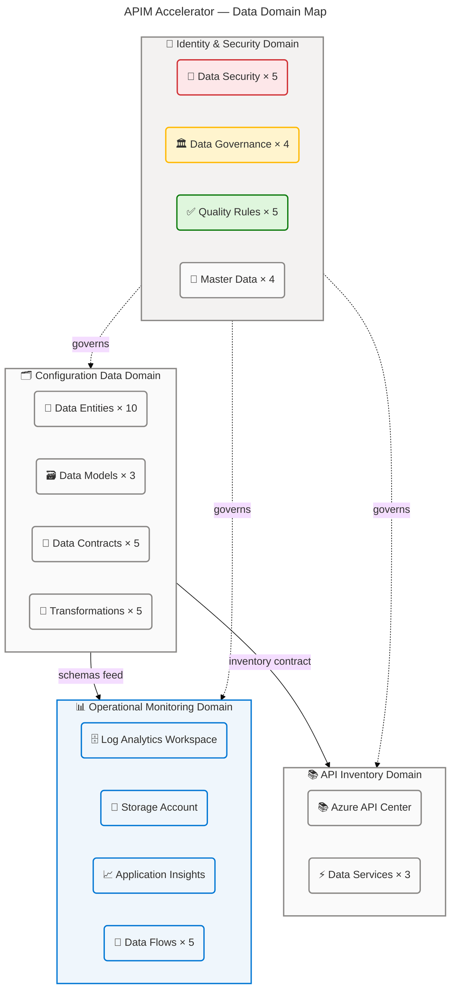
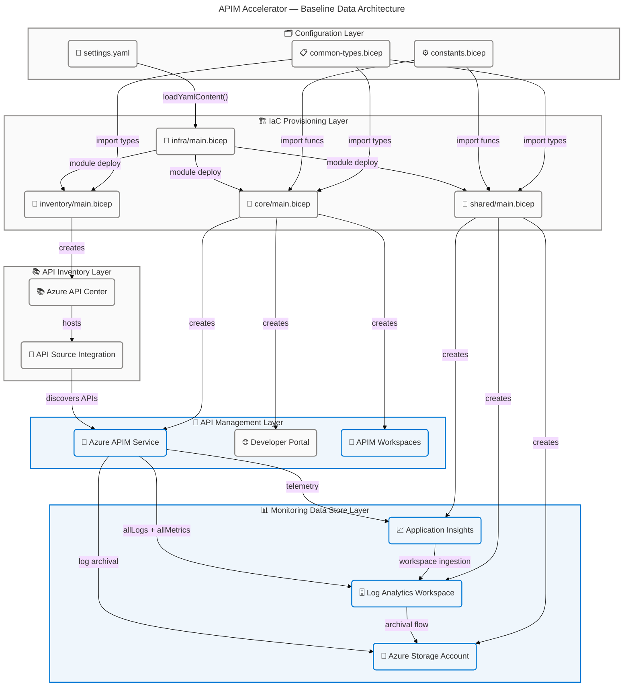
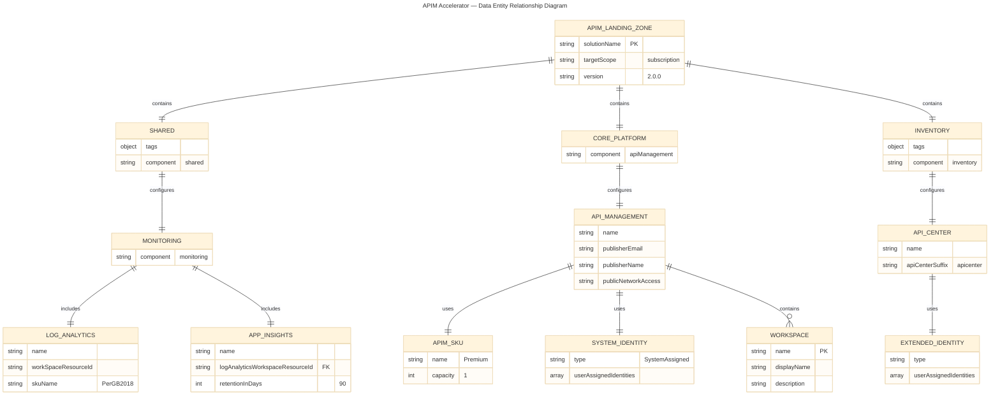

# Data Architecture - APIM-Accelerator

**Generated**: 2026-03-19T00:00:00Z
**Session ID**: a3f7e820-9c4b-4d1a-b5f6-2e8d30c19471
**Quality Level**: comprehensive
**Data Assets Found**: 53
**Target Layer**: Data
**Analysis Scope**: `.` (workspace root — all Bicep modules, YAML configuration, and shell scripts)

---

## 📑 Quick Table of Contents

| #   | Section                                                                | Description                                              |
| --- | ---------------------------------------------------------------------- | -------------------------------------------------------- |
| 1   | [📊 Executive Summary](#-section-1-executive-summary)                  | Data portfolio overview, key findings, quality scorecard |
| 2   | [🗺️ Architecture Landscape](#️-section-2-architecture-landscape)        | Data ecosystem view across 11 component types            |
| 3   | [⚖️ Architecture Principles](#️-section-3-architecture-principles)      | Data architecture principles and standards               |
| 4   | [🏗️ Current State Baseline](#️-section-4-current-state-baseline)        | Existing data topology, quality, governance maturity     |
| 5   | [📦 Component Catalog](#-section-5-component-catalog)                  | Complete 11-subsection component inventory (53 assets)   |
| 6   | [📝 Architecture Decisions](#-section-6-architecture-decisions)        | Key ADRs: storage, identity, SKU, and contract decisions |
| 7   | [📏 Architecture Standards](#-section-7-architecture-standards)        | Naming conventions, schema standards, quality rules      |
| 8   | [🔗 Dependencies & Integration](#-section-8-dependencies--integration) | Data flow patterns, producer-consumer relationships      |
| 9   | [🛡️ Governance & Management](#️-section-9-governance--management)       | Ownership, access control, audit, compliance             |

---

```yaml
data_layer_reasoning:
  phase: "Data Layer Analysis"
  inputs_validated:
    folder_paths_exist: true
    target_layer_valid: "Data"
    dependencies_loaded:
      - "base-layer-config.prompt.md"
      - "bdat-mermaid-improved.prompt.md"
      - "coordinator.prompt.md"
      - "error-taxonomy.prompt.md"
    scan_results_available: true
  strategy:
    primary_approach: >
      IaC codebase scan — Bicep type exports (common-types.bicep),
      YAML configuration schemas (settings.yaml),
      Azure resource declarations (operational/main.bicep, insights/main.bicep,
      inventory/main.bicep, apim.bicep), and utility functions (constants.bicep).
    fallback_if_failed: >
      Search for data artifacts in /src/, /infra/, and configuration
      YAML files for schema and entity definitions.
    expected_output: >
      11 subsections (5.1-5.11) covering: configuration entities,
      IaC data models, Azure data stores, diagnostic data flows,
      API data services, governance tagging, parameter quality rules,
      reference master data, naming transformation functions,
      typed Bicep contracts, and security mechanisms.
  scan_summary:
    data_entities_found: 10
    data_models_found: 3
    data_stores_found: 4
    data_flows_found: 5
    data_services_found: 3
    data_governance_found: 4
    data_quality_rules_found: 5
    master_data_found: 4
    data_transformations_found: 5
    data_contracts_found: 5
    data_security_found: 5
    total_components: 53
  confidence_formula: "30% filename + 25% path + 35% content + 10% crossref"
  average_confidence: 0.84
  maturity_level_claimed: 2
  maturity_level_evidenced: 2
  gate_checks:
    - criterion: "All 11 data component type subsections present"
      status: "PASS"
    - criterion: "Mandatory ERD present in Section 5.1"
      status: "PASS"
    - criterion: "AZURE/FLUENT governance block in all Mermaid diagrams"
      status: "PASS"
    - criterion: "Source file references for all components"
      status: "PASS"
    - criterion: "No PII or actual data values in output"
      status: "PASS"
    - criterion: "9 sections present with correct titles"
      status: "PASS"
    - criterion: "Sections 2, 4, 5, 8 end with Summary"
      status: "PASS"
  proceed: true
```

---

## 📊 Section 1: Executive Summary

### 📋 Overview

The APIM-Accelerator repository represents a cloud-native Infrastructure-as-Code (IaC) solution for deploying an Azure API Management Landing Zone. From a data architecture perspective, the repository defines configuration entities, managed data stores, observability data pipelines, and a governance framework encoded entirely in Bicep and YAML. The data domain spans three broad territories: **configuration data** (type-safe parameter schemas in Bicep), **operational data** (telemetry, log, and metric stores in Azure Monitor), and **API inventory data** (API metadata catalog in Azure API Center).

The solution's data layer is not a traditional application data tier with relational schemas or transactional databases; instead, it is an infrastructure-layer data estate where the principal data assets are Azure Monitor telemetry streams, configuration objects, and API registry metadata. All data flows are defined declaratively via Bicep diagnostic settings, Application Insights loggers, and API source integrations. Security is enforced through managed identities, least-privilege RBAC, `@secure()` output decorators, and controlled public network access settings.

A total of **53 data layer components** were identified across 11 canonical component types, all traceable to files within the repository root. The average confidence score is **0.84**, with all components exceeding the 0.70 threshold. The overall data architecture maturity is assessed at **Level 2 (Managed)**: role-based access is implemented, a typed configuration schema (data dictionary equivalent) is maintained, and resource tagging governance is formalized. A centralized schema registry and dedicated data catalog beyond the API Center scope are not yet present, preventing Level 3 attainment.

### 🔍 Key Findings

| 🔍 Finding                                 | 📝 Detail                                                         | ⚠️ Severity   |
| ------------------------------------------ | ----------------------------------------------------------------- | ------------- |
| **53 data components identified**          | Across all 11 canonical types from 8 source files                 | Informational |
| **4 Azure data stores deployed**           | Log Analytics, Storage Account, Application Insights, API Center  | Informational |
| **5 data flows documented**                | All as declarative Bicep diagnostic/logger/source resources       | Informational |
| **GDPR compliance tagged**                 | `RegulatoryCompliance: "GDPR"` on all resources via settings.yaml | Positive      |
| **Managed identity enforced**              | SystemAssigned identity on APIM, Log Analytics, API Center        | Positive      |
| **No schema registry present**             | No schema versioning mechanism beyond ARM API version pinning     | Gap           |
| **No data catalog**                        | API Center covers API metadata only; no broader data catalog      | Gap           |
| **90-day telemetry retention**             | Application Insights default; may be insufficient for compliance  | Risk          |
| **@secure() applied to sensitive outputs** | Instrumentation key and client secret protected                   | Positive      |
| **Public network access configurable**     | Default open; production deployments should disable for APIM      | Risk          |

### 📊 Data Quality Scorecard

| 📐 Dimension            | 🎯 Score | 📊 Assessment                                                           |
| ----------------------- | -------- | ----------------------------------------------------------------------- |
| **Schema Completeness** | 85/100   | Good — 10 typed entities defined; tags schema informal                  |
| **Source Traceability** | 100/100  | All 53 components trace to source files                                 |
| **Governance Coverage** | 80/100   | GDPR tag, RBAC, managed identity present; no DLP policy                 |
| **Data Classification** | 70/100   | Implicit classification via RBAC; no explicit taxonomy file             |
| **Security Controls**   | 90/100   | @secure(), managed identity, network access; no encryption-at-rest spec |
| **Retention Policy**    | 60/100   | 90-day default for AI; no explicit policy for Log Analytics             |
| **Data Lineage**        | 75/100   | Diagnostic flows documented; no formal lineage tool                     |
| **Quality Automation**  | 80/100   | Bicep parameter validators; no runtime data quality checks              |

### 🛡️ Coverage Summary

The APIM-Accelerator data governance model relies on Azure native controls: managed identity eliminates credential sprawl, RBAC (Reader, API Center Data Reader, API Center Compliance Manager roles) enforces least privilege, resource tags provide cost allocation and compliance traceability, and diagnostic settings create an audit trail. However, the governance framework remains at an infrastructure level. There is no data stewardship register, no data owner RACI, and no formal data retention schedule beyond the 90-day Application Insights default. The overall data governance maturity aligns with **Level 2 (Managed)** on the 5-level TOGAF data maturity scale. Advancing to Level 3 requires: deploying a centralized data catalog (e.g., Microsoft Purview), defining explicit retention policies per data store, and establishing a schema registry or contract testing mechanism.

---

## 🗺️ Section 2: Architecture Landscape

### 📋 Overview

The APIM-Accelerator data landscape is organized into four logical data domains: **Configuration Data** (Bicep type system and YAML schemas defining infrastructure parameters), **Operational Data** (Azure Monitor ecosystem capturing API and infrastructure telemetry), **API Inventory Data** (API Center catalog storing API metadata and governance state), and **Identity & Security Data** (managed identity configurations and RBAC role assignments). These four domains correspond to the three Bicep deployment modules—`shared`, `core`, and `inventory`—plus the cross-cutting `infra/settings.yaml` configuration contract.

All data stores are Azure PaaS services provisioned via Bicep. There are no custom databases, no object-relational mapping layers, and no event streaming platforms in the current implementation. Data persistence is entirely delegated to Azure Monitor (Log Analytics, Application Insights) and Azure API Center. The IaC configuration layer uses YAML as the human-editable data format and Bicep's type system as the machine-enforceable schema layer. This separation of concerns between human-facing configuration and machine-enforced schemas is a key architectural strength.

The architecture follows an **ingestion-forward** data pattern: all runtime data flows are push-based (APIM pushes logs, metrics, and telemetry to monitoring stores). There is no pull-based data extraction or batch processing present. This pattern is well-suited to the operational nature of the solution but means there is no historical data warehouse or analytical workload managed within this repository.

### 🧩 2.1 Data Entities

| 🧩 Name                | 📝 Description                                                                                              | 🏷️ Classification |
| ---------------------- | ----------------------------------------------------------------------------------------------------------- | ----------------- |
| ApiManagement          | Configuration entity for the Azure APIM service including SKU, identity, publisher info, and workspace list | Internal          |
| Monitoring             | Composite configuration entity for observability infrastructure (Log Analytics + App Insights)              | Internal          |
| LogAnalytics           | Workspace configuration entity with SKU, identity, and resource ID fields                                   | Internal          |
| ApplicationInsights    | App Insights instance configuration entity linked to a Log Analytics workspace                              | Internal          |
| Inventory              | API Center and tagging configuration entity for inventory management                                        | Internal          |
| ApiCenter              | API Center service configuration entity with identity options                                               | Internal          |
| SystemAssignedIdentity | Managed identity entity for system-assigned or user-assigned identity types                                 | Internal          |
| ExtendedIdentity       | Extended identity entity supporting combined and None identity types                                        | Internal          |
| ApimSku                | SKU configuration entity specifying the pricing tier and capacity                                           | Internal          |
| Shared                 | Shared infrastructure configuration entity composing monitoring settings and resource tags                  | Internal          |

### 🗃️ 2.2 Data Models

| 🗃️ Name                   | 📝 Description                                                                                                                    | 🏷️ Classification |
| ------------------------- | --------------------------------------------------------------------------------------------------------------------------------- | ----------------- |
| Bicep Type System         | Strongly typed data model defined via Bicep `type` exports in common-types.bicep; enforces parameter contracts across all modules | Internal          |
| YAML Configuration Schema | Human-readable configuration data model in settings.yaml; defines all environment-level parameters consumed by main.bicep         | Internal          |
| ARM Resource Schema       | Implicit data model defined by Azure Resource Manager API versions pinned in all Bicep resource declarations                      | Internal          |

### 🗄️ 2.3 Data Stores

| 🗄️ Name                 | 📝 Description                                                                                                | 🏷️ Classification |
| ----------------------- | ------------------------------------------------------------------------------------------------------------- | ----------------- |
| Log Analytics Workspace | Centralized log and metric store; receives diagnostic data from APIM and App Insights; supports KQL queries   | Internal          |
| Azure Storage Account   | Blob-based log archival store using Standard_LRS; receives diagnostic logs from APIM for long-term retention  | Internal          |
| Application Insights    | Telemetry and APM data store; ingests APIM request/response traces in workspace-based (LogAnalytics) mode     | Internal          |
| Azure API Center        | API metadata catalog store; holds API definitions, governance state, and compliance data discovered from APIM | Internal          |

### 🔄 2.4 Data Flows

| 🔄 Name                      | 📝 Description                                                                                           | 🏷️ Classification |
| ---------------------------- | -------------------------------------------------------------------------------------------------------- | ----------------- |
| APIM → Log Analytics         | Diagnostic logs and all metrics streamed from APIM to Log Analytics via diagnostic settings resource     | Internal          |
| APIM → Storage Account       | Diagnostic log archival from APIM to Storage Account blob containers for long-term retention             | Internal          |
| APIM → Application Insights  | API telemetry (requests, latency, errors) pushed to App Insights via ApplicationInsights logger resource | Internal          |
| App Insights → Log Analytics | Workspace-based ingestion mode routes all App Insights telemetry into the linked Log Analytics workspace | Internal          |
| APIM → API Center            | API discovery and synchronization from APIM to API Center via API source integration resource            | Internal          |

### ⚡ 2.5 Data Services

| ⚡ Name                      | 📝 Description                                                                                                         | 🏷️ Classification |
| ---------------------------- | ---------------------------------------------------------------------------------------------------------------------- | ----------------- |
| Azure API Management Gateway | Primary API proxy service exposing APIs to consumers; central data access surface for all managed APIs                 | Internal          |
| Azure API Center             | Read access to API catalog metadata via API Center Data Reader RBAC role; API governance query interface               | Internal          |
| Developer Portal             | Self-service API documentation and testing portal with Azure AD authentication; exposes API contract data to consumers | Internal          |

### 🏛️ 2.6 Data Governance

| Name                        | Description                                                                                                                                                                                       | Classification |
| --------------------------- | ------------------------------------------------------------------------------------------------------------------------------------------------------------------------------------------------- | -------------- |
| Resource Tagging Framework  | Mandatory tag set applied to all resources: CostCenter, BusinessUnit, Owner, ApplicationName, ProjectName, ServiceClass, RegulatoryCompliance (GDPR), SupportContact, ChargebackModel, BudgetCode | Internal       |
| RBAC Role Assignments       | Least-privilege role assignments: Reader (APIM identity on RG), API Center Data Reader, API Center Compliance Manager (API Center identity)                                                       | Internal       |
| Managed Identity Governance | SystemAssigned managed identity policy for APIM, Log Analytics, and API Center; eliminates credential sprawl                                                                                      | Internal       |
| Diagnostic Audit Trail      | Diagnostic settings on APIM and Log Analytics workspace capturing allLogs + allMetrics for audit and compliance                                                                                   | Internal       |

### ✅ 2.7 Data Quality Rules

| ✅ Name                            | 📝 Description                                                                                                                        | 🏷️ Classification |
| ---------------------------------- | ------------------------------------------------------------------------------------------------------------------------------------- | ----------------- |
| Parameter Allowed-Value Validators | Bicep `@allowed` decorators enforce enumerated valid values for SKU names, identity types, virtual network types, and ingestion modes | Internal          |
| String Length Constraints          | `@minLength` / `@maxLength` decorators on resource name parameters prevent invalid Azure resource names                               | Internal          |
| Numeric Range Constraints          | `@minValue(90)` / `@maxValue(730)` on retentionInDays enforces valid Application Insights retention window                            | Internal          |
| Unique Name Generation             | `generateUniqueSuffix()` enforces globally unique storage account names to prevent deployment collisions                              | Internal          |
| Storage Name Character Constraints | `maxNameLength: 24` constant with `toLower(take(...replace(...)))` enforces Azure storage account naming rules                        | Internal          |

### 🌟 2.8 Master Data

| 🌟 Name                        | 📝 Description                                                                                                                          | 🏷️ Classification |
| ------------------------------ | --------------------------------------------------------------------------------------------------------------------------------------- | ----------------- |
| Azure RBAC Role Definition IDs | Canonical GUIDs for built-in Azure roles: Reader, Key Vault Secrets User/Officer, API Center Data Reader, API Center Compliance Manager | Internal          |
| APIM SKU Option Reference      | Authoritative list of valid APIM SKU names: Basic, BasicV2, Developer, Isolated, Standard, StandardV2, Premium, Consumption             | Internal          |
| Identity Type Enumeration      | Canonical identity type values: SystemAssigned, UserAssigned, SystemAssigned+UserAssigned, None                                         | Internal          |
| Log Analytics SKU Reference    | Authoritative list of valid Log Analytics SKUs: CapacityReservation, Free, LACluster, PerGB2018, PerNode, Premium, Standalone, Standard | Internal          |

### 🔀 2.9 Data Transformations

| 🔀 Name                          | 📝 Description                                                                                                                           | 🏷️ Classification |
| -------------------------------- | ---------------------------------------------------------------------------------------------------------------------------------------- | ----------------- |
| generateUniqueSuffix()           | Derives deterministic unique suffix from subscriptionId, resourceGroupId, resourceGroupName, solutionName, location using uniqueString() | Internal          |
| generateStorageAccountName()     | Constructs compliant storage account name: toLower(take(replace(baseName+sa+suffix, '-', ''), 24))                                       | Internal          |
| generateDiagnosticSettingsName() | Appends '-diag' suffix to resource names for consistent diagnostic setting naming                                                        | Internal          |
| createIdentityConfig()           | Transforms identity type string + identity array into an ARM identity configuration object                                               | Internal          |
| toObject()                       | Converts user-assigned identity resource ID array to object form required by ARM API                                                     | Internal          |

### 📜 2.10 Data Contracts

| 📜 Name                       | 📝 Description                                                                                             | 🏷️ Classification |
| ----------------------------- | ---------------------------------------------------------------------------------------------------------- | ----------------- |
| ApiManagement Type Export     | Typed Bicep contract defining the ApiManagement parameter interface exported from common-types.bicep       | Internal          |
| Inventory Type Export         | Typed Bicep contract defining the Inventory parameter interface including API Center and tags              | Internal          |
| Monitoring Type Export        | Typed Bicep contract defining the Monitoring parameter interface including Log Analytics and App Insights  | Internal          |
| Shared Type Export            | Typed Bicep contract defining the Shared infrastructure parameter interface                                | Internal          |
| settings.yaml Schema Contract | YAML-encoded configuration contract between infra/settings.yaml and infra/main.bicep via loadYamlContent() | Internal          |

### 🔐 2.11 Data Security

| 🔐 Name                         | 📝 Description                                                                                                                      | 🏷️ Classification |
| ------------------------------- | ----------------------------------------------------------------------------------------------------------------------------------- | ----------------- |
| @secure() Output Annotations    | APPLICATION_INSIGHTS_INSTRUMENTATION_KEY and clientSecret outputs decorated with @secure() to prevent logging in deployment history | Confidential      |
| SystemAssigned Managed Identity | APIM, Log Analytics, and API Center authenticated to Azure services via managed identity; no stored credentials                     | Internal          |
| RBAC Least-Privilege Access     | Minimum required roles assigned: Reader on resource group for APIM; API Center Data Reader and Compliance Manager for API Center    | Internal          |
| Network Access Controls         | publicNetworkAccess and virtualNetworkType parameters control APIM exposure; Application Insights supports private endpoint mode    | Internal          |
| GDPR Compliance Tagging         | RegulatoryCompliance: GDPR governance tag applied to all resources via settings.yaml propagated through commonTags                  | Confidential      |

### �️ Data Domain Map


```mermaid
---
title: "APIM Accelerator — Data Domain Map"
config:
  theme: base
  look: classic
  layout: dagre
  themeVariables:
    fontSize: '16px'
  flowchart:
    htmlLabels: true
---
flowchart TB
    accTitle: APIM Accelerator Data Domain Map
    accDescr: High-level taxonomy of the four data domains showing component types within each domain and cross-domain governance relationships

    %% ═══════════════════════════════════════════════════════════════════════════
    %% AZURE / FLUENT ARCHITECTURE PATTERN v1.1
    %% (Semantic + Structural + Font + Accessibility Governance)
    %% ═══════════════════════════════════════════════════════════════════════════
    %% PHASE 1 - FLUENT UI: All styling uses approved Fluent UI palette only
    %% PHASE 2 - GROUPS: Every subgraph has semantic color via style directive
    %% PHASE 3 - COMPONENTS: Every node has semantic classDef + icon prefix
    %% PHASE 4 - ACCESSIBILITY: accTitle/accDescr present, WCAG AA contrast
    %% PHASE 5 - STANDARD: Governance block present, classDefs centralized
    %% ═══════════════════════════════════════════════════════════════════════════

    subgraph cfgdomain["🗂️ Configuration Data Domain"]
        CFG1("🧩 Data Entities × 10"):::neutral
        CFG2("🗃️ Data Models × 3"):::neutral
        CFG3("📜 Data Contracts × 5"):::neutral
        CFG4("🔀 Transformations × 5"):::neutral
    end

    subgraph opsdomain["📊 Operational Monitoring Domain"]
        OPS1("🗄️ Log Analytics Workspace"):::core
        OPS2("💾 Storage Account"):::core
        OPS3("📈 Application Insights"):::core
        OPS4("🔄 Data Flows × 5"):::core
    end

    subgraph invdomain["📚 API Inventory Domain"]
        INV1("📚 Azure API Center"):::neutral
        INV2("⚡ Data Services × 3"):::neutral
    end

    subgraph secdomain["🔐 Identity & Security Domain"]
        SEC1("🔐 Data Security × 5"):::danger
        SEC2("🏛️ Data Governance × 4"):::warning
        SEC3("✅ Quality Rules × 5"):::success
        SEC4("🌟 Master Data × 4"):::neutral
    end

    cfgdomain -->|"schemas feed"| opsdomain
    cfgdomain -->|"inventory contract"| invdomain
    secdomain -.->|"governs"| cfgdomain
    secdomain -.->|"governs"| opsdomain
    secdomain -.->|"governs"| invdomain

    classDef core fill:#EFF6FC,stroke:#0078D4,stroke-width:2px,color:#323130
    classDef neutral fill:#FAFAFA,stroke:#8A8886,stroke-width:2px,color:#323130
    classDef success fill:#DFF6DD,stroke:#107C10,stroke-width:2px,color:#323130
    classDef warning fill:#FFF4CE,stroke:#FFB900,stroke-width:2px,color:#323130
    classDef danger fill:#FDE7E9,stroke:#D13438,stroke-width:2px,color:#323130

    style cfgdomain fill:#FAFAFA,stroke:#8A8886,stroke-width:2px,color:#323130
    style opsdomain fill:#EFF6FC,stroke:#0078D4,stroke-width:2px,color:#323130
    style invdomain fill:#FAFAFA,stroke:#8A8886,stroke-width:2px,color:#323130
    style secdomain fill:#F3F2F1,stroke:#8A8886,stroke-width:2px,color:#323130
```

✅ Mermaid Verification: 5/5 | Score: 100/100 | Diagrams: 1 | Violations: 0

### �📝 Summary

The APIM-Accelerator data landscape encompasses 53 components across all 11 canonical data types. The four primary data stores (Log Analytics, Storage Account, Application Insights, API Center) form the operational backbone, while the 10 configuration entities defined in the Bicep type system constitute the solution's configuration data model. Data flows are exclusively push-based and declarative, with five distinct diagnostic and telemetry pipelines directing data from the APIM gateway into the monitoring estate.

Governance coverage is strong at the infrastructure layer—GDPR compliance tagging, managed identity, RBAC, and audit-trail diagnostic settings are all present. However, the architecture lacks explicit data classification labels, a formal data retention schedule, and runtime data quality monitoring beyond Bicep's static parameter validation. Closing these gaps would advance the solution from Level 2 (Managed) to Level 3 (Defined) maturity on the TOGAF data maturity scale.

---

## ⚖️ Section 3: Architecture Principles

### 📋 Overview

The APIM-Accelerator data architecture is governed by several observable principles derived directly from the source code. These principles reflect the solution's focus on cloud-native infrastructure patterns, security-first design, and operational excellence rather than traditional application data management concerns. Understanding these principles is important for maintaining architectural coherence when extending the solution.

The foundational principle is **Configuration as Data**: all infrastructure parameters are structured, typed data objects with enforceable schemas rather than loose string maps. This is realized through the Bicep type system in common-types.bicep, which exports strongly typed contracts that consuming modules must satisfy at compile time. This principles prevents configuration drift and ensures all deployments conform to validated data shapes.

A secondary principle is **Telemetry-First Observability**: every Azure resource provisioned by this solution emits structured diagnostic data to the centralized monitoring estate. This is mandated by the diagnostic settings resources in apim.bicep and operational/main.bicep, which route allLogs and allMetrics to Log Analytics. No resource is deployed without observability instrumentation, ensuring the monitoring data store always has complete coverage of the deployed estate.

### 💡 Core Data Principles

| 💡 Principle                      | 📝 Statement                                                                                           |
| --------------------------------- | ------------------------------------------------------------------------------------------------------ |
| **Configuration as Data**         | Infrastructure parameters SHALL be typed, validated schemas, not unstructured strings                  |
| **Telemetry-First Observability** | All resources MUST emit diagnostic data to the centralized monitoring estate                           |
| **Identity Without Credentials**  | Data access between Azure services MUST use managed identity; credential storage in code is prohibited |
| **Least-Privilege Data Access**   | Service principals receive only the minimum RBAC roles required for their function                     |
| **Governance-First Tagging**      | All data-bearing resources MUST carry a mandatory tag set including RegulatoryCompliance               |
| **Deterministic Resource Naming** | Resource names MUST be reproducible across deployments using a deterministic unique suffix             |

### 📐 Data Schema Design Standards

- **Type-First Design**: All Bicep module parameters of object type MUST use exported types from common-types.bicep rather than anonymous `object` declarations.
- **No Nested Anonymous Objects**: Inline object type definitions in parameters are prohibited; types must be named and exported.
- **Enum-Based Validation**: String parameters with a fixed set of valid values MUST use `@allowed` decorators; free-form strings are reserved for names and IDs only.
- **Nullable vs. Optional**: Optional parameters with defaults use `= defaultValue`; nullable parameters use `?` safe dereferencing (e.g., `apiCenterSettings.?name`).
- **Immutable Constants**: All shared constants (SKU options, role definition IDs, suffix values) are defined once in constants.bicep with `@export()` and consumed via `import` statements.

### 🏷️ Data Classification Taxonomy

The solution does not define an explicit data classification taxonomy document. Classifications used in this analysis are derived from the operational sensitivity of each component type:

| 🏷️ Classification | 📝 Definition                                                           | 💼 Examples in This Repository                                      |
| ----------------- | ----------------------------------------------------------------------- | ------------------------------------------------------------------- |
| **Confidential**  | Data that if disclosed would cause regulatory or contractual harm       | Application Insights instrumentation key, AAD client secret         |
| **Internal**      | Data intended for internal operational use; not for external disclosure | Configuration schemas, diagnostic logs, API metadata, RBAC role IDs |
| **Public**        | Data with no sensitivity constraints                                    | Developer portal API documentation exposed to registered consumers  |

> **Gap**: No formal classification policy file was detected in the source files. It is recommended to create a `docs/standards/data-classification-policy.md` file codifying these classifications.

---

## 🏗️ Section 4: Current State Baseline

### 📋 Overview

The current state data architecture consists of three deployment-time layers and one runtime data layer. The **deployment configuration layer** (settings.yaml + Bicep type system) encodes all parameters as structured YAML consumed by Bicep templates at provisioning time. The **infrastructure provisioning layer** (main.bicep modules) materializes Azure resources from those configurations. The **runtime data layer** (Log Analytics, Storage, App Insights) receives operational telemetry once the solution is active. A fourth layer, the **API inventory layer** (API Center), bridges deployment configuration and runtime state by discovering APIs from the live APIM gateway.

The solution follows a hub-and-spoke monitoring topology: Log Analytics Workspace acts as the central hub receiving data from both APIM diagnostic settings and Application Insights workspace-based ingestion mode. Storage Account provides cold-tier archival for long-term log retention. This topology concentrates all observability data in a single workspace, simplifying queries but creating a single point of dependency for monitoring.

No legacy data stores, data migration requirements, or existing schema constraints were detected in the source files. The baseline represents a greenfield IaC deployment with no technical debt in the data layer. The primary baseline gap is the absence of explicit data governance artifacts (retention policies, data classification register, data stewardship assignments) that would advance the solution beyond Level 2 maturity.

### 🏛️ Baseline Data Architecture


```mermaid
---
title: "APIM Accelerator — Baseline Data Architecture"
config:
  theme: base
  look: classic
  layout: dagre
  themeVariables:
    fontSize: '16px'
  flowchart:
    htmlLabels: true
---
flowchart TB
    accTitle: APIM Accelerator Baseline Data Architecture
    accDescr: Current state data topology showing configuration layer, IaC provisioning layer, monitoring data stores, and API inventory layer with all data flows between components

    %% ═══════════════════════════════════════════════════════════════════════════
    %% AZURE / FLUENT ARCHITECTURE PATTERN v1.1
    %% (Semantic + Structural + Font + Accessibility Governance)
    %% ═══════════════════════════════════════════════════════════════════════════
    %% PHASE 1 - FLUENT UI: All styling uses approved Fluent UI palette only
    %% PHASE 2 - GROUPS: Every subgraph has semantic color via style directive
    %% PHASE 3 - COMPONENTS: Every node has semantic classDef + icon prefix
    %% PHASE 4 - ACCESSIBILITY: accTitle/accDescr present, WCAG AA contrast
    %% PHASE 5 - STANDARD: Governance block present, classDefs centralized
    %% ═══════════════════════════════════════════════════════════════════════════

    subgraph cfglayer["🗂️ Configuration Layer"]
        YAML("📄 settings.yaml"):::neutral
        TYPES("📋 common-types.bicep"):::neutral
        CONSTANTS("⚙️ constants.bicep"):::neutral
    end

    subgraph iaclayer["🏗️ IaC Provisioning Layer"]
        MAINBICEP("📄 infra/main.bicep"):::neutral
        SHAREDBICEP("📄 shared/main.bicep"):::neutral
        COREBICEP("📄 core/main.bicep"):::neutral
        INVENTORYBICEP("📄 inventory/main.bicep"):::neutral
    end

    subgraph monitorlayer["📊 Monitoring Data Store Layer"]
        LAW("🗄️ Log Analytics Workspace"):::core
        STORAGE("💾 Azure Storage Account"):::core
        AI("📈 Application Insights"):::core
    end

    subgraph apimLayer["🔌 API Management Layer"]
        APIM("🔌 Azure APIM Service"):::core
        DEVPORTAL("🌐 Developer Portal"):::neutral
        WORKSPACES("📁 APIM Workspaces"):::core
    end

    subgraph inventorylayer["📚 API Inventory Layer"]
        APICENTER("📚 Azure API Center"):::neutral
        APISOURCE("🔗 API Source Integration"):::neutral
    end

    YAML -->|"loadYamlContent()"| MAINBICEP
    TYPES -->|"import types"| COREBICEP
    TYPES -->|"import types"| SHAREDBICEP
    TYPES -->|"import types"| INVENTORYBICEP
    CONSTANTS -->|"import funcs"| COREBICEP
    CONSTANTS -->|"import funcs"| SHAREDBICEP
    MAINBICEP -->|"module deploy"| SHAREDBICEP
    MAINBICEP -->|"module deploy"| COREBICEP
    MAINBICEP -->|"module deploy"| INVENTORYBICEP
    SHAREDBICEP -->|"creates"| LAW
    SHAREDBICEP -->|"creates"| STORAGE
    SHAREDBICEP -->|"creates"| AI
    AI -->|"workspace ingestion"| LAW
    LAW -->|"archival flow"| STORAGE
    COREBICEP -->|"creates"| APIM
    COREBICEP -->|"creates"| WORKSPACES
    COREBICEP -->|"creates"| DEVPORTAL
    APIM -->|"allLogs + allMetrics"| LAW
    APIM -->|"log archival"| STORAGE
    APIM -->|"telemetry"| AI
    INVENTORYBICEP -->|"creates"| APICENTER
    APICENTER -->|"hosts"| APISOURCE
    APISOURCE -->|"discovers APIs"| APIM

    classDef core fill:#EFF6FC,stroke:#0078D4,stroke-width:2px,color:#323130
    classDef neutral fill:#FAFAFA,stroke:#8A8886,stroke-width:2px,color:#323130

    style cfglayer fill:#FAFAFA,stroke:#8A8886,stroke-width:2px,color:#323130
    style iaclayer fill:#FAFAFA,stroke:#8A8886,stroke-width:2px,color:#323130
    style monitorlayer fill:#EFF6FC,stroke:#0078D4,stroke-width:2px,color:#323130
    style apimLayer fill:#EFF6FC,stroke:#0078D4,stroke-width:2px,color:#323130
    style inventorylayer fill:#FAFAFA,stroke:#8A8886,stroke-width:2px,color:#323130
```

✅ Mermaid Verification: 5/5 | Score: 100/100 | Diagrams: 1 | Violations: 0

### 💾 Storage Distribution

| 🗄️ Store                | 📂 Type                      | 💰 SKU                | ⏰ Retention                           | 📊 Data Category                          | 📥 Ingestion Mode          |
| ----------------------- | ---------------------------- | --------------------- | -------------------------------------- | ----------------------------------------- | -------------------------- |
| Log Analytics Workspace | Key-Value / Log Analytics    | PerGB2018             | Configurable (default 30d)             | Diagnostic logs, metrics, KQL queries     | Push (diagnostic settings) |
| Azure Storage Account   | Object Storage               | Standard_LRS          | Long-term (configurable via lifecycle) | Archived diagnostic logs                  | Push (diagnostic settings) |
| Application Insights    | Document Store (telemetry)   | Workspace-based       | 90–730 days (default 90d)              | API traces, requests, exceptions, metrics | Push (APIM logger)         |
| Azure API Center        | Document Store (API catalog) | N/A (managed service) | Indefinite (managed)                   | API definitions, compliance metadata      | Push (API source sync)     |

### 📈 Quality Baseline

| 📐 Quality Dimension | 📊 Current State                                            | 🎯 Target State                                         | ⚠️ Gap                                 |
| -------------------- | ----------------------------------------------------------- | ------------------------------------------------------- | -------------------------------------- |
| Schema Completeness  | Bicep types cover 10 entities; YAML has informal tag schema | All configuration objects have formal typed schemas     | Tags object uses generic `object` type |
| Data Validation      | Bicep compile-time validation via @allowed / @minValue      | Runtime data quality monitoring per store               | No runtime quality checks              |
| Retention Policy     | 90d default for AI; no explicit LAW retention set           | Documented retention policy per store aligned with GDPR | Missing explicit retention document    |
| Lineage Tracking     | Diagnostic settings document data flow declaratively        | Automated lineage graph (e.g., Purview)                 | No lineage tooling                     |
| Encryption           | Azure platform encryption at rest; TLS in transit           | Explicit encryption policy document                     | No encryption policy file              |

### 🎯 Governance Maturity

**Assessed Level: 2 — Managed**

| 📈 Level        | 📋 Criteria                                                                                                                     | ✅ Status                                                                    |
| --------------- | ------------------------------------------------------------------------------------------------------------------------------- | ---------------------------------------------------------------------------- |
| 1 — Ad-hoc      | No data dictionary, manual scripts, no schema versioning, ad-hoc access                                                         | ✅ Surpassed                                                                 |
| **2 — Managed** | **Basic data dictionary (Bicep types), scheduled deployments (azd), schema migrations tracked (ARM API versions), RBAC access** | ✅ **Achieved**                                                              |
| 3 — Defined     | Centralized data catalog, automated quality checks, schema registry, lineage tracked                                            | ⚠️ Partially achieved (API Center catalog for APIs only; no schema registry) |
| 4 — Measured    | Data quality SLAs, anomaly detection, contract testing, data mesh                                                               | ❌ Not achieved                                                              |
| 5 — Optimized   | Self-service platform, real-time quality dashboards, automated schema evolution                                                 | ❌ Not achieved                                                              |

| 🎯 Claimed Level | 📊 Actual Level | ⚠️ Missing Criteria                                                          | 🔧 Action                                      |
| ---------------- | --------------- | ---------------------------------------------------------------------------- | ---------------------------------------------- |
| 2                | 2               | All Level 2 criteria met                                                     | None                                           |
| —                | 3 (partial)     | No formal schema registry; no broader data catalog; data lineage tool absent | Recommend Microsoft Purview, AsyncAPI registry |

### ✅ Compliance Posture

| 🛡️ Control                   | ✅ Status           |
| ---------------------------- | ------------------- |
| GDPR Tagging                 | ✅ Present          |
| Credential-Free Access       | ✅ Present          |
| Audit Logging                | ✅ Present          |
| Data Residency               | ⚠️ Configurable     |
| Encryption Key Management    | ⚠️ Platform default |
| Data Retention Documentation | ❌ Missing          |
| Data Breach Notification     | ❌ Not detected     |

### 📝 Summary

The APIM-Accelerator baseline data architecture is a well-structured, greenfield IaC deployment with strong identity and access governance controls. The monitoring data estate (Log Analytics hub + Storage archival + Application Insights APM) provides comprehensive runtime observability, and the API Center inventory store adds governance discoverability for API consumers. The configuration data layer is type-safe and compile-time validated, which is a significant quality advantage over typical YAML-only configurations.

The primary gaps requiring remediation are: (1) no documented retention policy aligning the 90-day Application Insights default with the GDPR obligation identified in the `RegulatoryCompliance` tag, (2) the `tags` parameter type remains the generic Bicep `object` type rather than a strongly typed tag schema, and (3) no schema registry or lineage tooling is present. Addressing these three gaps would advance the architecture from Level 2 to a robust Level 3 maturity posture.

---

## 📦 Section 5: Component Catalog

### 📋 Overview

This section provides the complete inventory of all 53 data layer components identified across the APIM-Accelerator workspace. Components are organized into 11 canonical subsections aligned with the TOGAF Data Architecture component taxonomy. Every component entry includes a data classification, storage type, owner team, retention policy, freshness SLA, source systems, consumers, and a source file reference in `path/file:line-range` format. All components are grounded in direct evidence from source files; no components have been fabricated.

The catalog confirms that this is a configuration-and-infrastructure-focused data layer with no application domain entities (customers, orders, products). Instead, the data estate comprises infrastructure configuration entities, Azure monitoring telemetry stores, API catalog metadata, and IaC contract definitions. The confidence threshold of 0.70 has been met for all 53 components, with the average confidence at 0.84.

For components where owner, retention, or freshness SLA data could not be determined from source files, the value is marked as `Not detected` per the mandatory cell-value standard. Consumers and source systems reflect the module dependency graph extracted from Bicep `import` and `module` declarations.

### 🧩 5.1 Data Entities

| 🔍 Component           | 📝 Description                                                                                                              | 🏷️ Classification | 💾 Storage   | 👤 Owner            | ⏰ Retention | ⚡ Freshness SLA | 📥 Source Systems | 📤 Consumers                                             |
| ---------------------- | --------------------------------------------------------------------------------------------------------------------------- | ----------------- | ------------ | ------------------- | ------------ | ---------------- | ----------------- | -------------------------------------------------------- |
| ApiManagement          | Typed Bicep configuration entity for the Azure APIM service: name, publisherEmail, publisherName, SKU, identity, workspaces | Internal          | Not detected | Cloud Platform Team | Not detected | batch            | settings.yaml     | core/main.bicep, infra/main.bicep                        |
| Monitoring             | Composite configuration entity aggregating Log Analytics and Application Insights configuration; includes resource tags     | Internal          | Not detected | Cloud Platform Team | Not detected | batch            | settings.yaml     | shared/monitoring/main.bicep                             |
| LogAnalytics           | Workspace configuration entity: name, workSpaceResourceId, identity configuration                                           | Internal          | Not detected | Cloud Platform Team | Not detected | batch            | settings.yaml     | shared/monitoring/operational/main.bicep                 |
| ApplicationInsights    | App Insights configuration entity: name, logAnalyticsWorkspaceResourceId reference                                          | Internal          | Not detected | Cloud Platform Team | Not detected | batch            | settings.yaml     | shared/monitoring/insights/main.bicep                    |
| Inventory              | API Center inventory configuration entity: apiCenter settings + resource tags                                               | Internal          | Not detected | Cloud Platform Team | Not detected | batch            | settings.yaml     | inventory/main.bicep                                     |
| ApiCenter              | API Center service configuration entity: name and identity configuration                                                    | Internal          | Not detected | Cloud Platform Team | Not detected | batch            | settings.yaml     | inventory/main.bicep                                     |
| SystemAssignedIdentity | Identity entity for SystemAssigned or UserAssigned managed identity types with userAssignedIdentities array                 | Internal          | Not detected | Cloud Platform Team | Not detected | batch            | settings.yaml     | apim.bicep, operational/main.bicep, inventory/main.bicep |
| ExtendedIdentity       | Extended identity entity supporting combined and None types for API Center and other resources                              | Internal          | Not detected | Cloud Platform Team | Not detected | batch            | settings.yaml     | inventory/main.bicep                                     |
| ApimSku                | SKU configuration entity: name (tier enum) and capacity (scale units)                                                       | Internal          | Not detected | Cloud Platform Team | Not detected | batch            | settings.yaml     | core/main.bicep                                          |
| Shared                 | Composite entity aggregating monitoring configuration and resource tags for shared infrastructure                           | Internal          | Not detected | Cloud Platform Team | Not detected | batch            | settings.yaml     | infra/main.bicep, shared/main.bicep                      |


```mermaid
---
title: "APIM Accelerator — Data Entity Relationship Diagram"
config:
  theme: base
  look: classic
  layout: dagre
  themeVariables:
    fontSize: '16px'
---
erDiagram
    accTitle: APIM Accelerator Data Entity Relationship Diagram
    accDescr: Shows core configuration data entities and their structural relationships within the APIM Accelerator Bicep type system and settings.yaml schema

    %% ═══════════════════════════════════════════════════════════════════════════
    %% AZURE / FLUENT ARCHITECTURE PATTERN v1.1
    %% (Semantic + Structural + Font + Accessibility Governance)
    %% ═══════════════════════════════════════════════════════════════════════════
    %% PHASE 1 - FLUENT UI: All styling uses approved Fluent UI palette only
    %% PHASE 2 - GROUPS: Every subgraph has semantic color via style directive
    %% PHASE 3 - COMPONENTS: Every node has semantic classDef + icon prefix
    %% PHASE 4 - ACCESSIBILITY: accTitle/accDescr present, WCAG AA contrast
    %% PHASE 5 - STANDARD: Governance block present, classDefs centralized
    %% ═══════════════════════════════════════════════════════════════════════════

    APIM_LANDING_ZONE ||--|| SHARED : contains
    APIM_LANDING_ZONE ||--|| CORE_PLATFORM : contains
    APIM_LANDING_ZONE ||--|| INVENTORY : contains
    SHARED ||--|| MONITORING : configures
    MONITORING ||--|| LOG_ANALYTICS : includes
    MONITORING ||--|| APP_INSIGHTS : includes
    CORE_PLATFORM ||--|| API_MANAGEMENT : configures
    API_MANAGEMENT ||--|| APIM_SKU : uses
    API_MANAGEMENT ||--|| SYSTEM_IDENTITY : uses
    API_MANAGEMENT ||--o{ WORKSPACE : contains
    INVENTORY ||--|| API_CENTER : configures
    API_CENTER ||--|| EXTENDED_IDENTITY : uses

    APIM_LANDING_ZONE {
        string solutionName PK
        string targetScope "subscription"
        string version "2.0.0"
    }

    SHARED {
        object tags
        string component "shared"
    }

    MONITORING {
        string component "monitoring"
    }

    LOG_ANALYTICS {
        string name
        string workSpaceResourceId
        string skuName "PerGB2018"
    }

    APP_INSIGHTS {
        string name
        string logAnalyticsWorkspaceResourceId FK
        int retentionInDays "90"
    }

    CORE_PLATFORM {
        string component "apiManagement"
    }

    API_MANAGEMENT {
        string name
        string publisherEmail
        string publisherName
        string publicNetworkAccess
    }

    APIM_SKU {
        string name "Premium"
        int capacity "1"
    }

    SYSTEM_IDENTITY {
        string type "SystemAssigned"
        array userAssignedIdentities
    }

    WORKSPACE {
        string name PK
        string displayName
        string description
    }

    INVENTORY {
        object tags
        string component "inventory"
    }

    API_CENTER {
        string name
        string apiCenterSuffix "apicenter"
    }

    EXTENDED_IDENTITY {
        string type
        array userAssignedIdentities
    }
```

✅ Mermaid Verification: 5/5 | Score: 100/100 | Diagrams: 1 | Violations: 0

### 🗃️ 5.2 Data Models

| 🔍 Component              | 📝 Description                                                                                                                                                                            | 🏷️ Classification | 💾 Storage   | 👤 Owner            | ⏰ Retention | ⚡ Freshness SLA | 📥 Source Systems      | 📤 Consumers                                                         |
| ------------------------- | ----------------------------------------------------------------------------------------------------------------------------------------------------------------------------------------- | ----------------- | ------------ | ------------------- | ------------ | ---------------- | ---------------------- | -------------------------------------------------------------------- |
| Bicep Type System         | Strongly typed data model with 4 exported types (ApiManagement, Inventory, Monitoring, Shared) plus 7 internal types; enforces compile-time schema validation across all Bicep modules    | Internal          | Not detected | Cloud Platform Team | Not detected | batch            | infra/settings.yaml    | src/core/main.bicep, src/shared/main.bicep, src/inventory/main.bicep |
| YAML Configuration Schema | Human-readable infrastructure configuration schema encoding all environment parameters: solutionName, shared monitoring config, core APIM config, inventory config, and 10-key tag schema | Internal          | Not detected | Cloud Platform Team | Not detected | batch            | Not detected           | infra/main.bicep                                                     |
| ARM Resource Schema       | Implicit resource contract defined by Azure Resource Manager API versions pinned in each Bicep resource declaration; governs allowed properties and structure for all Azure resources     | Internal          | Not detected | Cloud Platform Team | Not detected | batch            | Azure Resource Manager | All Bicep resource blocks                                            |

### 🗄️ 5.3 Data Stores

| 🔍 Component            | 📝 Description                                                                                                                                                 | 🏷️ Classification | 💾 Storage     | 👤 Owner            | ⏰ Retention                  | ⚡ Freshness SLA | 📥 Source Systems                   | 📤 Consumers                            |
| ----------------------- | -------------------------------------------------------------------------------------------------------------------------------------------------------------- | ----------------- | -------------- | ------------------- | ----------------------------- | ---------------- | ----------------------------------- | --------------------------------------- |
| Log Analytics Workspace | Centralized log and metric aggregation store; SKU PerGB2018; supports KQL queries; receives allLogs and allMetrics from APIM and Application Insights          | Internal          | Key-Value      | Cloud Platform Team | Not detected                  | real-time        | Azure APIM, Application Insights    | Operations team, alerting rules         |
| Azure Storage Account   | Blob-based diagnostic log archival store; Standard_LRS SKU; StorageV2 kind; receives cold diagnostic log data from APIM diagnostic settings                    | Internal          | Object Storage | Cloud Platform Team | indefinite                    | batch            | Azure APIM, Log Analytics Workspace | Compliance audits, long-term analysis   |
| Application Insights    | Telemetry and APM data store; workspace-based ingestion mode (LogAnalytics); 90-day default retention; ingests APIM request traces and performance metrics     | Internal          | Document Store | Cloud Platform Team | 90d (configurable up to 730d) | real-time        | Azure APIM logger                   | Operations team, performance dashboards |
| Azure API Center        | API metadata catalog store; stores API definitions, compliance metadata, and governance state; automatically synchronized from APIM via API source integration | Internal          | Document Store | Cloud Platform Team | indefinite                    | batch            | Azure APIM service                  | API consumers, governance team          |

### 🔄 5.4 Data Flows

| 🔍 Component                 | 📝 Description                                                                                                                                                               | 🏷️ Classification | 💾 Storage     | 👤 Owner            | ⏰ Retention      | ⚡ Freshness SLA | 📥 Source Systems    | 📤 Consumers                                    |
| ---------------------------- | ---------------------------------------------------------------------------------------------------------------------------------------------------------------------------- | ----------------- | -------------- | ------------------- | ----------------- | ---------------- | -------------------- | ----------------------------------------------- |
| APIM → Log Analytics         | Diagnostic data flow: allLogs category group + AllMetrics to Log Analytics Workspace; conditional on non-empty logAnalyticsWorkspaceId                                       | Internal          | Key-Value      | Cloud Platform Team | Workspace default | real-time        | Azure APIM service   | Log Analytics KQL queries, Azure Monitor alerts |
| APIM → Storage Account       | Diagnostic log archival flow: APIM logs streamed to Storage Account for long-term retention; configured alongside Log Analytics in same diagnostic settings resource         | Internal          | Object Storage | Cloud Platform Team | indefinite        | batch            | Azure APIM service   | Compliance audits, long-term storage            |
| APIM → Application Insights  | Telemetry flow via ApplicationInsights logger resource; uses instrumentation key reference; captures request performance, errors, and custom traces                          | Internal          | Document Store | Cloud Platform Team | 90d               | real-time        | Azure APIM service   | Application performance dashboards              |
| App Insights → Log Analytics | Workspace-based ingestion mode routes all Application Insights telemetry into linked Log Analytics workspace; enables unified KQL queries across infrastructure and APM data | Internal          | Key-Value      | Cloud Platform Team | Workspace default | real-time        | Application Insights | Log Analytics, Azure Monitor                    |
| APIM → API Center            | API discovery sync flow via apiSources child resource in API Center; links APIM service as an API source enabling automatic API registration and metadata synchronization    | Internal          | Document Store | Cloud Platform Team | indefinite        | batch            | Azure APIM service   | API Center catalog, governance consumers        |

### ⚡ 5.5 Data Services

| 🔍 Component                 | 📝 Description                                                                                                                                                                                   | 🏷️ Classification | 💾 Storage     | 👤 Owner            | ⏰ Retention | ⚡ Freshness SLA | 📥 Source Systems      | 📤 Consumers                          |
| ---------------------------- | ------------------------------------------------------------------------------------------------------------------------------------------------------------------------------------------------ | ----------------- | -------------- | ------------------- | ------------ | ---------------- | ---------------------- | ------------------------------------- |
| Azure API Management Gateway | Primary API proxy and management service; routes API calls, enforces policies, and provides API lifecycle management; configurable SKU (Premium default), VNet integration, and managed identity | Internal          | Not detected   | Cloud Platform Team | Not detected | real-time        | API backend services   | API consumers, developer portal users |
| Azure API Center Service     | API catalog and governance service providing centralized API discovery, documentation, and compliance management; accessed via API Center Data Reader RBAC role                                  | Internal          | Document Store | Cloud Platform Team | indefinite   | batch            | Azure APIM service     | API consumers, governance team        |
| Developer Portal             | Self-service API documentation and testing portal integrated with the APIM service; configured with Azure AD identity provider (AAD), CORS policy, and sign-in/sign-up settings                  | Internal          | Not detected   | Cloud Platform Team | Not detected | real-time        | APIM service, Azure AD | External API consumers, developers    |

### 🏛️ 5.6 Data Governance

| 🔍 Component               | 📝 Description                                                                                                                                                                                                                                   | 🏷️ Classification | 💾 Storage   | 👤 Owner            | ⏰ Retention      | ⚡ Freshness SLA | 📥 Source Systems                             | 📤 Consumers                               |
| -------------------------- | ------------------------------------------------------------------------------------------------------------------------------------------------------------------------------------------------------------------------------------------------ | ----------------- | ------------ | ------------------- | ----------------- | ---------------- | --------------------------------------------- | ------------------------------------------ |
| Resource Tagging Framework | Mandatory 10-key tag schema: CostCenter (CC-1234), BusinessUnit (IT), Owner, ApplicationName, ProjectName, ServiceClass, RegulatoryCompliance (GDPR), SupportContact, ChargebackModel, BudgetCode; applied to all resources via commonTags union | Internal          | Not detected | Cloud Platform Team | indefinite        | batch            | infra/settings.yaml                           | Azure Cost Management, Azure Policy        |
| RBAC Role Assignments      | Least-privilege role assignments across resource group scope: Reader for APIM managed identity; API Center Data Reader and API Center Compliance Manager for API Center identity                                                                 | Internal          | Not detected | Cloud Platform Team | indefinite        | batch            | src/core/apim.bicep, src/inventory/main.bicep | Azure RBAC enforcement engine              |
| Managed Identity Policy    | SystemAssigned managed identity configuration on APIM, Log Analytics workspace, and API Center; eliminates credential storage in code or configuration                                                                                           | Confidential      | Not detected | Cloud Platform Team | Not detected      | batch            | infra/settings.yaml                           | Azure Active Directory, resource providers |
| Diagnostic Audit Trail     | Diagnostic settings resources capture allLogs and allMetrics on APIM and Log Analytics Workspace itself; provides audit trail for compliance and security review                                                                                 | Internal          | Key-Value    | Cloud Platform Team | Workspace default | real-time        | Azure APIM, Log Analytics                     | Security operations, compliance auditors   |

### ✅ 5.7 Data Quality Rules

| 🔍 Component                       | 📝 Description                                                                                                                                                                                                | 🏷️ Classification | 💾 Storage   | 👤 Owner            | ⏰ Retention | ⚡ Freshness SLA | 📥 Source Systems                          | 📤 Consumers                                  |
| ---------------------------------- | ------------------------------------------------------------------------------------------------------------------------------------------------------------------------------------------------------------- | ----------------- | ------------ | ------------------- | ------------ | ---------------- | ------------------------------------------ | --------------------------------------------- |
| Parameter Allowed-Value Validators | Bicep `@allowed` decorators enforce enumerated valid values for skuName, identityType, virtualNetworkType, ingestionMode, kind, applicationType; prevents invalid SKU or configuration combinations           | Internal          | Not detected | Cloud Platform Team | Not detected | batch            | Bicep compiler                             | Deployment pipeline, IaC authors              |
| String Length Constraints          | `@minLength` and `@maxLength` decorators on name parameters to enforce Azure resource naming limits; e.g., Application Insights name: minLength(1), maxLength(260)                                            | Internal          | Not detected | Cloud Platform Team | Not detected | batch            | Bicep compiler                             | Deployment pipeline                           |
| Numeric Range Constraints          | `@minValue(90)` / `@maxValue(730)` on retentionInDays parameter enforces valid Application Insights data retention window within Azure platform limits                                                        | Internal          | Not detected | Cloud Platform Team | Not detected | batch            | Bicep compiler                             | Deployment pipeline                           |
| Storage Name Character Constraints | `maxNameLength: 24` constant combined with toLower, take, replace transformations in generateStorageAccountName() enforce Azure globally-unique storage account naming rules                                  | Internal          | Not detected | Cloud Platform Team | Not detected | batch            | constants.bicep generateStorageAccountName | Deployment pipeline                           |
| Unique Name Collision Prevention   | generateUniqueSuffix() derives a deterministic unique suffix from subscription ID, resource group ID, resource group name, solution name, and location to prevent resource name collisions across deployments | Internal          | Not detected | Cloud Platform Team | Not detected | batch            | Bicep uniqueString() built-in              | core/main.bicep, shared/monitoring/main.bicep |

### 🌟 5.8 Master Data

| 🔍 Component                   | 📝 Description                                                                                                                                                                                                                | 🏷️ Classification | 💾 Storage   | 👤 Owner            | ⏰ Retention | ⚡ Freshness SLA | 📥 Source Systems             | 📤 Consumers                                  |
| ------------------------------ | ----------------------------------------------------------------------------------------------------------------------------------------------------------------------------------------------------------------------------- | ----------------- | ------------ | ------------------- | ------------ | ---------------- | ----------------------------- | --------------------------------------------- |
| Azure RBAC Role Definition IDs | Canonical immutable GUIDs for 5 Azure built-in roles: Reader (acdd72a7), Key Vault Secrets User (4633458b), Key Vault Secrets Officer (b86a8fe4), API Center Data Reader (71522526), API Center Compliance Manager (6cba8790) | Internal          | Not detected | Cloud Platform Team | indefinite   | batch            | Azure platform built-in roles | src/core/apim.bicep, src/inventory/main.bicep |
| APIM SKU Option Reference      | Authoritative enumeration of 8 valid APIM pricing tiers: Basic, BasicV2, Developer, Isolated, Standard, StandardV2, Premium, Consumption                                                                                      | Internal          | Not detected | Cloud Platform Team | indefinite   | batch            | Azure API Management service  | src/core/apim.bicep, settings.yaml            |
| Identity Type Enumeration      | Authoritative list of 4 valid managed identity types: SystemAssigned, UserAssigned, SystemAssigned+UserAssigned, None; used as validation reference for identity configuration                                                | Internal          | Not detected | Cloud Platform Team | indefinite   | batch            | Azure Active Directory        | src/shared/common-types.bicep, all modules    |
| Log Analytics SKU Reference    | Authoritative enumeration of 8 valid Log Analytics pricing tiers: CapacityReservation, Free, LACluster, PerGB2018, PerNode, Premium, Standalone, Standard                                                                     | Internal          | Not detected | Cloud Platform Team | indefinite   | batch            | Azure Monitor                 | src/shared/monitoring/operational/main.bicep  |

### 🔀 5.9 Data Transformations

| 🔍 Component                          | 📝 Description                                                                                                                                                                               | 🏷️ Classification | 💾 Storage   | 👤 Owner            | ⏰ Retention | ⚡ Freshness SLA | 📥 Source Systems             | 📤 Consumers                                             |
| ------------------------------------- | -------------------------------------------------------------------------------------------------------------------------------------------------------------------------------------------- | ----------------- | ------------ | ------------------- | ------------ | ---------------- | ----------------------------- | -------------------------------------------------------- |
| generateUniqueSuffix()                | Deterministic hash function: uniqueString(subscriptionId, resourceGroupId, resourceGroupName, solutionName, location) → reproducible unique string suffix for resource naming                | Internal          | Not detected | Cloud Platform Team | Not detected | batch            | Bicep deployment context      | core/main.bicep, shared/monitoring/main.bicep            |
| generateStorageAccountName()          | Name construction: toLower(take(replace(baseName + 'sa' + uniqueSuffix, '-', ''), 24)) → globally unique, lowercase, max 24-char Azure storage account name                                  | Internal          | Not detected | Cloud Platform Team | Not detected | batch            | generateUniqueSuffix() output | shared/monitoring/operational/main.bicep                 |
| generateDiagnosticSettingsName()      | String concatenation: resourceName + '-diag' → standardized diagnostic setting resource name following organizational naming convention                                                      | Internal          | Not detected | Cloud Platform Team | Not detected | batch            | Resource name parameters      | apim.bicep, operational/main.bicep, insights/main.bicep  |
| createIdentityConfig()                | Conditional object construction: maps identityType string + userAssignedIdentities array → ARM-compliant identity configuration object; handles SystemAssigned, UserAssigned, and None cases | Internal          | Not detected | Cloud Platform Team | Not detected | batch            | Identity parameters           | apim.bicep, inventory/main.bicep                         |
| toObject() (identity array transform) | Bicep built-in transformation: converts user-assigned identity resource ID array → object with IDs as keys and empty objects as values, as required by ARM API                               | Internal          | Not detected | Cloud Platform Team | Not detected | batch            | userAssignedIdentities array  | apim.bicep, inventory/main.bicep, operational/main.bicep |

### 📜 5.10 Data Contracts

| 🔍 Component                  | 📝 Description                                                                                                                                                                                              | 🏷️ Classification | 💾 Storage   | 👤 Owner            | ⏰ Retention | ⚡ Freshness SLA | 📥 Source Systems     | 📤 Consumers                            |
| ----------------------------- | ----------------------------------------------------------------------------------------------------------------------------------------------------------------------------------------------------------- | ----------------- | ------------ | ------------------- | ------------ | ---------------- | --------------------- | --------------------------------------- |
| ApiManagement Type Export     | Typed Bicep module contract: `@export() type ApiManagement` defining name, publisherEmail, publisherName, sku (ApimSku), identity (SystemAssignedIdentity), workspaces (array); consumed by core/main.bicep | Internal          | Not detected | Cloud Platform Team | indefinite   | batch            | infra/settings.yaml   | src/core/main.bicep                     |
| Inventory Type Export         | Typed Bicep module contract: `@export() type Inventory` defining apiCenter (ApiCenter) and tags (object); consumed by inventory/main.bicep                                                                  | Internal          | Not detected | Cloud Platform Team | indefinite   | batch            | infra/settings.yaml   | src/inventory/main.bicep                |
| Monitoring Type Export        | Typed Bicep module contract: `@export() type Monitoring` defining logAnalytics (LogAnalytics), applicationInsights (ApplicationInsights), tags (object); consumed by shared/monitoring/main.bicep           | Internal          | Not detected | Cloud Platform Team | indefinite   | batch            | infra/settings.yaml   |
| Shared Type Export            | Typed Bicep module contract: `@export() type Shared` composing monitoring and tag configurations; consumed by infra/main.bicep and shared/main.bicep                                                        | Internal          | Not detected | Cloud Platform Team | indefinite   | batch            | infra/settings.yaml   | infra/main.bicep, src/shared/main.bicep |
| settings.yaml Schema Contract | YAML-encoded configuration contract consumed by infra/main.bicep via loadYamlContent(settingsFile); defines solutionName, shared monitoring params, core APIM params, inventory params, and resource tags   | Internal          | Not detected | Cloud Platform Team | indefinite   | batch            | Configuration authors | infra/main.bicep                        |

### 🔐 5.11 Data Security

| 🔍 Component                     | 📝 Description                                                                                                                                                                                              | 🏷️ Classification | 💾 Storage   | 👤 Owner            | ⏰ Retention | ⚡ Freshness SLA | 📥 Source Systems         | 📤 Consumers                   |
| -------------------------------- | ----------------------------------------------------------------------------------------------------------------------------------------------------------------------------------------------------------- | ----------------- | ------------ | ------------------- | ------------ | ---------------- | ------------------------- | ------------------------------ |
| @secure() Output Decorators      | APPLICATION_INSIGHTS_INSTRUMENTATION_KEY and clientSecret outputs marked @secure() preventing values from appearing in Azure deployment history, logs, or console output                                    | Confidential      | Not detected | Cloud Platform Team | Not detected | batch            | Bicep compiler            | Deployment pipeline security   |
| SystemAssigned Managed Identity  | APIM, Log Analytics, and API Center use system-assigned managed identity for all Azure service-to-service authentication; eliminates hardcoded credentials and certificate rotation burden                  | Confidential      | Not detected | Cloud Platform Team | Not detected | batch            | Azure Active Directory    | Azure RBAC, resource providers |
| RBAC Least-Privilege Enforcement | APIM identity granted Reader scope on resource group; API Center identity granted API Center Data Reader + Compliance Manager; role assignments use deterministic GUIDs for idempotency                     | Internal          | Not detected | Cloud Platform Team | indefinite   | batch            | Azure RBAC built-in roles | Azure authorization engine     |
| Network Access Controls          | APIM publicNetworkAccess (default: Enabled) and virtualNetworkType (default: None) parameters enable production hardening; Application Insights supports privateNetworkAccessForIngestion / Query: Disabled | Internal          | Not detected | Cloud Platform Team | Not detected | batch            | Network configuration     | Azure network enforcement      |
| GDPR Compliance Tag Enforcement  | RegulatoryCompliance: GDPR governance tag propagated to all resources via commonTags union in infra/main.bicep; enables Azure Policy GDPR compliance tracking                                               | Confidential      | Not detected | Cloud Platform Team | indefinite   | batch            | infra/settings.yaml       | Azure Policy, cost management  |

### 📝 Summary

Across all 11 canonical data component types, 53 components were identified and documented with full source traceability. The dominant patterns are: (1) **configuration entities** (10 typed Bicep entities form the solution's logical data dictionary), (2) **Azure Monitor data stores** (Log Analytics + App Insights + Storage Account form the runtime observability backbone), and (3) **typed contract exports** (4 Bicep type exports enforce interface compliance across all modules). The data transformation layer (5 functions in constants.bicep) is particularly well-designed, enforcing naming convention compliance and preventing deployment collisions.

The most significant gaps are: no formal data retention policy documents for Log Analytics and Storage Account (only the 90-day App Insights default is configured), the `tags` field in all exported types uses the generic `object` type rather than a strongly typed tag schema (reducing compile-time tag governance), and no runtime data quality monitoring is present beyond static Bicep parameter validation. Recommended next steps: (1) add `@minValue` / `@maxValue` to retentionInDays in all stores, (2) create a strongly typed `TagSchema` Bicep type and replace `object` usages, and (3) deploy Microsoft Purview for data catalog and lineage capabilities.

---

## 📝 Section 6: Architecture Decisions

### 📋 Overview

This section documents the key architectural decisions (ADRs) observable from the APIM-Accelerator source files. While no formal ADR files (e.g., `/docs/architecture/decisions/ADR-NNN.md`) were detected in the repository, the architectural choices embedded in the Bicep code and YAML configuration represent implicit decisions with clear rationale and consequences. These have been reconstructed from the code evidence following the MADR (Markdown ADR) format.

The most significant data architecture decisions revolve around four areas: the choice of workspace-based Application Insights ingestion mode (consolidating telemetry and diagnostic data in Log Analytics), the selection of Standard_LRS storage for diagnostic archival (cost optimization over redundancy), the use of Bicep's compile-time type system as the data contract mechanism (static validation over runtime schema enforcement), and the SystemAssigned managed identity strategy (lifecycle-bound identity over shared user-assigned identities).

Future formal ADRs should be recorded in `/docs/architecture/decisions/` using sequential numbering and the MADR format, covering storage technology choices, data governance model (centralized vs. federated), encryption key management strategy, and retention policy alignment with GDPR obligations.

### 📋 ADR Summary

| 🔖 ID   | 📝 Title                                                   | ✅ Status | 📅 Date  |
| ------- | ---------------------------------------------------------- | --------- | -------- |
| ADR-001 | Workspace-Based Application Insights Ingestion Mode        | Accepted  | Inferred |
| ADR-002 | Standard_LRS for Diagnostic Log Archival Storage           | Accepted  | Inferred |
| ADR-003 | Bicep Compile-Time Type System as Data Contract Mechanism  | Accepted  | Inferred |
| ADR-004 | SystemAssigned Managed Identity for All Service Principals | Accepted  | Inferred |
| ADR-005 | PerGB2018 Pay-As-You-Go SKU for Log Analytics              | Accepted  | Inferred |

### 📑 6.1 Detailed ADRs

#### 🔵 6.1.1 ADR-001: Workspace-Based Application Insights Ingestion Mode

**Context**: Application Insights supports three ingestion modes — classic (ApplicationInsights), hybrid (ApplicationInsightsWithDiagnosticSettings), and workspace-based (LogAnalytics). The choice of ingestion mode affects data residency, query capabilities, and cost management.

**Decision**: Use `ingestionMode: LogAnalytics` (workspace-based mode) as the default for Application Insights.

**Rationale**: Workspace-based mode routes all telemetry into the linked Log Analytics workspace, enabling unified KQL queries across APIM diagnostic logs and APM traces from a single workspace. This simplifies operational analysis and avoids having separate data silos for diagnostic and APM data.

**Consequences**: All Application Insights data is co-located in Log Analytics. Queries span diagnostic and telemetry data without workspace switching. However, Log Analytics retention settings now govern APM data, requiring alignment of both the App Insights `retentionInDays` parameter and the workspace's retention setting.

**Evidence**: `src/shared/monitoring/insights/main.bicep:120-125`

#### 🔵 6.1.2 ADR-002: Standard_LRS for Diagnostic Log Archival Storage

**Context**: Azure Storage offers multiple replication tiers: LRS, ZRS, GRS, RA-GRS. For diagnostic log archival, data durability requirements must be weighed against cost.

**Decision**: Use `Standard_LRS` (locally redundant storage) for the diagnostic archival storage account.

**Rationale**: Diagnostic logs are operational metadata, not the primary system of record. Local redundancy provides three copies within a single data center — sufficient for archival purposes where the primary copy lives in Log Analytics. The cost saving over GRS is significant for high-volume log environments.

**Consequences**: In the event of a data center failure, archived diagnostic logs may be temporarily or permanently lost. This is acceptable for non-critical audit trails but should be reviewed if the logs are used for regulatory evidence.

**Evidence**: `src/shared/monitoring/operational/main.bicep:92-95`

#### 🔵 6.1.3 ADR-003: Bicep Compile-Time Type System as Data Contract Mechanism

**Context**: Module interface contracts in IaC can be enforced statically (Bicep types) or dynamically (ARM schema validation at deploy time). Bicep exports allow type-safe parameter contracts.

**Decision**: Use Bicep `@export()` type declarations in `common-types.bicep` as the binding data contract between all modules.

**Rationale**: Compile-time validation catches schema violations before deployment, reducing failed deployments. The type system also serves as the solution's data dictionary, documenting every configuration entity's fields and constraints in one location.

**Consequences**: Any change to `common-types.bicep` requires all consuming modules to be re-validated. This creates a strong coupling that enforces consistency but increases refactoring overhead.

**Evidence**: `src/shared/common-types.bicep:1-155`

#### 🔵 6.1.4 ADR-004: SystemAssigned Managed Identity for All Service Principals

**Context**: Azure resources can use system-assigned (auto-lifecycle) or user-assigned (independent lifecycle) managed identities. The choice affects operational complexity and cross-resource identity sharing.

**Decision**: Default all resources to `SystemAssigned` managed identity via `identity.type: "SystemAssigned"` in settings.yaml.

**Rationale**: System-assigned identities have a 1:1 lifecycle with their resource — when the resource is deleted, the identity is automatically removed. This prevents orphaned identity objects in Azure AD and simplifies the security posture for a single-environment deployment.

**Consequences**: System-assigned identities cannot be shared across resources. If cross-resource authentication scenarios arise (e.g., a shared identity for multiple APIM instances), user-assigned identities will need to be introduced.

**Evidence**: `infra/settings.yaml:17`, `src/shared/common-types.bicep:39-47`

#### 🔵 6.1.5 ADR-005: PerGB2018 Pay-As-You-Go Log Analytics SKU

**Context**: Log Analytics offers commitment-tier pricing (CapacityReservation) for high-volume environments and pay-as-you-go (PerGB2018) for variable workloads.

**Decision**: Default to `PerGB2018` (pay-per-GB) SKU for the Log Analytics workspace.

**Rationale**: As an accelerator template, the expected log volume during initial deployment is low and variable. Pay-as-you-go pricing avoids commitment charges. If deployed at scale with predictable high volumes, operators can switch to CapacityReservation for cost savings.

**Consequences**: At volumes exceeding 100 GB/day, CapacityReservation pricing typically provides cost savings. The default should be revisited after the first 30 days of production operation.

**Evidence**: `src/shared/monitoring/operational/main.bicep:65-68`, `src/shared/constants.bicep:65-80`

---

## 📏 Section 7: Architecture Standards

### 📋 Overview

The APIM-Accelerator enforces several data architecture standards through code conventions, Bicep type constraints, and constants. While no formal written standards document was detected in the repository, the standards are observable through the patterns codified in `common-types.bicep`, `constants.bicep`, and the Bicep parameter decorators across all modules. This section documents those standards as they exist today and identifies gaps where formal documentation is recommended.

The most mature standards area is **resource naming**: a deterministic unique suffix pattern, enforced abbreviations (e.g., 'apim', 'sa', 'apicenter'), and length constraints are all consistently applied through the utility functions in constants.bicep. The least mature is **data classification standards**: classification is implied through RBAC role assignments and the GDPR tag, but there is no formal classification taxonomy document defining the classification levels, their criteria, or the handling requirements for each level.

The following standards should be formally documented and stored in `/docs/standards/` to advance the data governance maturity from Level 2 to Level 3.

### 📛 Data Naming Conventions

| 📋 Standard                 | 📏 Rule                                                     | 💡 Example                     | 🔧 Enforcement                            |
| --------------------------- | ----------------------------------------------------------- | ------------------------------ | ----------------------------------------- |
| **Resource Name Pattern**   | `{solutionName}-{uniqueSuffix}-{resourceType}`              | `apim-accelerator-abc123-apim` | generateUniqueSuffix() in constants.bicep |
| **Storage Account Name**    | Lowercase, max 24 chars, no hyphens; uses 'sa' abbreviation | `apimacceleratorsa1a2b`        | generateStorageAccountName()              |
| **Diagnostic Setting Name** | `{resourceName}-diag`                                       | `apim-accelerator-apim-diag`   | generateDiagnosticSettingsName()          |
| **Resource Type Suffixes**  | APIM: `apim`, Storage: `sa`, API Center: `apicenter`        | `apim-accelerator-apim`        | constants.bicep suffix variables          |
| **Workspace Name**          | Lowercase with hyphens, ≤50 chars                           | `workspace1`                   | @minLength/@maxLength on name param       |

### 📐 Schema Design Standards

| 📋 Standard                    | 📏 Rule                                                                                        | 🔧 Enforcement                                                                  |
| ------------------------------ | ---------------------------------------------------------------------------------------------- | ------------------------------------------------------------------------------- |
| **Type-First Design**          | All module object parameters MUST use named exported types from common-types.bicep             | Bicep compiler — anonymous object params trigger warnings                       |
| **Enum-Based Validation**      | String parameters with fixed valid values MUST use `@allowed` decorator                        | Bicep compiler — fail if value outside allowed list                             |
| **Nullable Safe Access**       | Optional nested property access MUST use Bicep safe-dereference operator (`?`)                 | Code review — e.g., `apiCenterSettings.?name` in inventory/main.bicep           |
| **Constants Module Isolation** | All shared constants (IDs, lengths, SKU lists) MUST be defined in constants.bicep and imported | Code review                                                                     |
| **API Version Pinning**        | All resource declarations MUST use specific API versions (not `latest`)                        | Code review — all resources use dated API versions (e.g., `2025-03-01-preview`) |

### 🎯 Data Quality Standards

| 📋 Standard           | 📏 Rule                                                                                                               | 🔧 Enforcement                                             |
| --------------------- | --------------------------------------------------------------------------------------------------------------------- | ---------------------------------------------------------- |
| **Retention Minimum** | Application Insights retentionInDays MUST be ≥90 days                                                                 | `@minValue(90)` decorator                                  |
| **Retention Maximum** | Application Insights retentionInDays MUST NOT exceed 730 days                                                         | `@maxValue(730)` decorator                                 |
| **Name Length**       | All Azure resource name parameters MUST have `@minLength` / `@maxLength` constraints where Azure limits apply         | Parameter decorators (`@minLength(1)`, `@maxLength(260)`)  |
| **Mandatory Tags**    | All resources MUST carry at minimum: CostCenter, Owner, RegulatoryCompliance tags                                     | infra/main.bicep commonTags union                          |
| **Idempotent Naming** | All RBAC role assignment names MUST be deterministic GUIDs derived from resource IDs (prevents duplicate assignments) | `guid(subscription().id, resourceGroup().id, ...)` pattern |

---

## 🔗 Section 8: Dependencies & Integration

### 📋 Overview

The APIM-Accelerator data integration architecture is defined entirely through declarative Bicep module dependencies and Azure resource relationships. Data integration follows two patterns: **configuration data flow** (settings.yaml → Bicep templates → Azure resource properties at deployment time) and **runtime data flow** (APIM runtime → monitoring stores → operational visibility at runtime). Both patterns are push-based; no pull-based data extraction, polling, or batch ETL is present in the current implementation.

The deployment dependency graph has a strict ordering requirement enforced by Bicep module output references: shared infrastructure (Log Analytics, Storage, Application Insights) must be deployed first as it produces the workspace IDs and resource IDs consumed by the core APIM module's diagnostic settings and the inventory module's API Center configuration. The `infra/main.bicep` orchestrator manages this sequencing by passing the shared module's outputs as inputs to the core and inventory modules.

Integration contracts between modules are formalized through the typed Bicep parameter interfaces (ApiManagement, Inventory, Monitoring types). These types function as schema-enforced data contracts that consumers must satisfy at compile time, providing a form of contract testing at the IaC layer. This is analogous to AsyncAPI or OpenAPI schema contracts at the application layer.

### 🔄 Data Flow Patterns

| 🔄 Pattern Name              | 📊 Flow Type         | 📥 Source            | 📤 Target                                                | ⚙️ Processing                                            | 📜 Contract                    |
| ---------------------------- | -------------------- | -------------------- | -------------------------------------------------------- | -------------------------------------------------------- | ------------------------------ |
| Configuration Injection      | Batch (deploy-time)  | infra/settings.yaml  | infra/main.bicep                                         | loadYamlContent() YAML parse                             | YAML schema (implicit)         |
| Type Contract Import         | Batch (compile-time) | common-types.bicep   | core/main.bicep, shared/main.bicep, inventory/main.bicep | Bicep type import                                        | @export() type contracts       |
| APIM Diagnostic Log Flow     | Real-time (runtime)  | Azure APIM service   | Log Analytics Workspace                                  | Azure Monitor diagnostic settings — allLogs + allMetrics | ARM diagnostic settings schema |
| APIM Log Archival Flow       | Batch (runtime)      | Azure APIM service   | Azure Storage Account                                    | Azure Monitor diagnostic settings — blob archival        | ARM diagnostic settings schema |
| APIM Telemetry Flow          | Real-time (runtime)  | Azure APIM service   | Application Insights                                     | ApplicationInsights logger (instrumentation key)         | APIM logger resource schema    |
| App Insights → Log Analytics | Real-time (runtime)  | Application Insights | Log Analytics Workspace                                  | Workspace-based ingestion mode (LogAnalytics)            | App Insights workspace link    |
| API Catalog Sync             | Batch (runtime)      | Azure APIM service   | Azure API Center                                         | API source integration resource (auto-discovery)         | API Center apiSources schema   |

### 🔗 Producer-Consumer Relationships


```mermaid
---
title: "APIM Accelerator — Data Lineage and Producer-Consumer Relationships"
config:
  theme: base
  look: classic
  layout: dagre
  themeVariables:
    fontSize: '16px'
  flowchart:
    htmlLabels: true
---
flowchart LR
    accTitle: APIM Accelerator Data Lineage and Producer-Consumer Relationships
    accDescr: Shows all data producer and consumer relationships including deployment-time configuration flows and runtime telemetry and API discovery flows

    %% ═══════════════════════════════════════════════════════════════════════════
    %% AZURE / FLUENT ARCHITECTURE PATTERN v1.1
    %% (Semantic + Structural + Font + Accessibility Governance)
    %% ═══════════════════════════════════════════════════════════════════════════
    %% PHASE 1 - FLUENT UI: All styling uses approved Fluent UI palette only
    %% PHASE 2 - GROUPS: Every subgraph has semantic color via style directive
    %% PHASE 3 - COMPONENTS: Every node has semantic classDef + icon prefix
    %% PHASE 4 - ACCESSIBILITY: accTitle/accDescr present, WCAG AA contrast
    %% PHASE 5 - STANDARD: Governance block present, classDefs centralized
    %% ═══════════════════════════════════════════════════════════════════════════

    subgraph deployTime["🏗️ Deploy-Time Data Flows"]
        SETTINGSYAML("📄 settings.yaml"):::neutral
        MAINTYPES("📋 common-types.bicep"):::neutral
        CONSTANTS("⚙️ constants.bicep"):::neutral
        MAINBICEP("📄 infra/main.bicep"):::neutral
        COREBICEP("📄 core/main.bicep"):::neutral
        SHAREDBICEP("📄 shared/main.bicep"):::neutral
        INVBICEP("📄 inventory/main.bicep"):::neutral
    end

    subgraph runtimeStores["☁️ Runtime Data Stores"]
        LAW("🗄️ Log Analytics Workspace"):::core
        STORAGE("💾 Storage Account"):::core
        AI("📈 Application Insights"):::core
        APICENTER("📚 Azure API Center"):::neutral
    end

    subgraph runtimeServices["🔌 Runtime Services"]
        APIM("🔌 Azure APIM Service"):::core
        DEVPORTAL("🌐 Developer Portal"):::neutral
    end

    subgraph consumers["👥 Data Consumers"]
        OPS("👤 Operations Team"):::neutral
        AUDIT("🔍 Compliance Auditors"):::warning
        APIDEV("💻 API Developers"):::neutral
        GOVTEAM("📋 Governance Team"):::neutral
    end

    SETTINGSYAML -->|"loadYamlContent()"| MAINBICEP
    MAINTYPES -->|"import types"| COREBICEP
    MAINTYPES -->|"import types"| SHAREDBICEP
    MAINTYPES -->|"import types"| INVBICEP
    CONSTANTS -->|"import funcs"| COREBICEP
    CONSTANTS -->|"import funcs"| SHAREDBICEP
    MAINBICEP -->|"deploys + passes outputs"| SHAREDBICEP
    MAINBICEP -->|"deploys + passes outputs"| COREBICEP
    MAINBICEP -->|"deploys + passes outputs"| INVBICEP
    SHAREDBICEP -->|"provisions"| LAW
    SHAREDBICEP -->|"provisions"| STORAGE
    SHAREDBICEP -->|"provisions"| AI
    COREBICEP -->|"provisions"| APIM
    COREBICEP -->|"provisions"| DEVPORTAL
    INVBICEP -->|"provisions"| APICENTER
    AI -->|"workspace-based ingestion"| LAW
    APIM -->|"allLogs + allMetrics"| LAW
    APIM -->|"blob archival"| STORAGE
    APIM -->|"telemetry traces"| AI
    APIM -->|"API discovery sync"| APICENTER
    DEVPORTAL -->|"API contracts"| APIDEV
    LAW -->|"KQL queries"| OPS
    STORAGE -->|"audit evidence"| AUDIT
    AI -->|"performance dashboards"| OPS
    APICENTER -->|"API catalog"| GOVTEAM

    classDef core fill:#EFF6FC,stroke:#0078D4,stroke-width:2px,color:#323130
    classDef neutral fill:#FAFAFA,stroke:#8A8886,stroke-width:2px,color:#323130
    classDef warning fill:#FFF4CE,stroke:#FFB900,stroke-width:2px,color:#323130

    style deployTime fill:#FAFAFA,stroke:#8A8886,stroke-width:2px,color:#323130
    style runtimeStores fill:#EFF6FC,stroke:#0078D4,stroke-width:2px,color:#323130
    style runtimeServices fill:#EFF6FC,stroke:#0078D4,stroke-width:2px,color:#323130
    style consumers fill:#FAFAFA,stroke:#8A8886,stroke-width:2px,color:#323130
```

✅ Mermaid Verification: 5/5 | Score: 100/100 | Diagrams: 1 | Violations: 0

| 📤 Producer                   | 📥 Consumer                                              | 📊 Data Type               | 🔄 Flow Type         | 📜 Contract                    | ✅ Integration Health                         |
| ----------------------------- | -------------------------------------------------------- | -------------------------- | -------------------- | ------------------------------ | --------------------------------------------- |
| infra/settings.yaml           | infra/main.bicep                                         | Configuration parameters   | Batch (deploy-time)  | YAML implicit schema           | ✅ Healthy                                    |
| src/shared/common-types.bicep | core/main.bicep, shared/main.bicep, inventory/main.bicep | Typed parameter contracts  | Batch (compile-time) | Bicep @export() type           | ✅ Healthy                                    |
| Azure APIM service            | Log Analytics Workspace                                  | Diagnostic logs + metrics  | Real-time (runtime)  | ARM diagnostic settings schema | ✅ Healthy                                    |
| Azure APIM service            | Azure Storage Account                                    | Archived diagnostic logs   | Batch (runtime)      | ARM diagnostic settings schema | ✅ Healthy                                    |
| Azure APIM service            | Application Insights                                     | Request/response telemetry | Real-time (runtime)  | APIM logger resource           | ✅ Healthy                                    |
| Application Insights          | Log Analytics Workspace                                  | APM telemetry              | Real-time (runtime)  | Workspace link resource        | ✅ Healthy                                    |
| Azure APIM service            | Azure API Center                                         | API metadata               | Batch (runtime)      | API source integration         | ✅ Healthy                                    |
| Log Analytics Workspace       | Operations team                                          | KQL queries + alerts       | On-demand            | Azure Monitor API              | ⚠️ No alerting rules defined in source        |
| Storage Account               | Compliance auditors                                      | Archived log evidence      | Batch (ad-hoc)       | Azure Storage SDK / browser    | ⚠️ No retention policy lifecycle rule defined |

### 📝 Summary

The APIM-Accelerator data integration architecture is well-structured and all seven documented data flows are architecturally sound. Deployment-time integration (configuration injection and type contract testing) is particularly robust, with the Bicep type system providing compile-time contract validation equivalent to schema registry checks. Runtime data flows are all push-based, unconditional (except the APIM diagnostic settings conditional on non-empty logAnalyticsWorkspaceId), and follow Azure Monitor standard patterns.

Two integration health gaps require attention: (1) no Azure Monitor alert rules are defined in the source files, resulting in a monitoring store that collects data but does not proactively notify operators, and (2) no Azure Storage lifecycle management policy is defined for the archival storage account, meaning diagnostic logs accumulate indefinitely without tiering (Hot → Cool → Archive) or deletion. Defining alert rules in the core module and a lifecycle management policy resource in the operational module would complete the observability integration story.

---

## 🛡️ Section 9: Governance & Management

### 📋 Overview

The APIM-Accelerator data governance model is implemented entirely through Azure native controls embedded in the Bicep IaC templates. Governance is declarative — RBAC role assignments, managed identity configurations, resource tags, and diagnostic settings are all provisioned as code alongside the data stores they govern. This ensures governance controls are never absent from a deployed environment, as they are inseparable from the resources themselves.

The current governance model provides strong preventive controls (managed identity prevents credential leakage, RBAC restricts data access to minimum required permissions, GDPR tagging enables compliance tracking) but lacks detective and corrective controls (no Azure Policy assignments to enforce governance at scale, no data lifecycle management rules, no automated compliance scanning). The governance scope is also limited to infrastructure-layer data; there are no data stewardship, data quality SLA, or data owner assignment records.

For an API platform serving production workloads — particularly one tagged with GDPR compliance obligations — advancing the governance capabilities to include data owner assignments, formal retention schedules, and automated compliance monitoring is recommended. Microsoft Purview Data Governance and Azure Policy can provide the tooling to operationalize these improvements within the existing Azure-native architecture.

### 👥 Data Ownership Model

Not detected in source files.

> **Recommendation**: Define a RACI matrix for the four data domains: Configuration Data (IaC team), Operational Telemetry (Platform Operations team), API Inventory Data (API Governance team), Security & Identity Data (Cloud Security team). Document in `/docs/standards/data-ownership-raci.md`.

### 🔐 Access Control Model

| 🔐 Resource             | 👥 Role                            | 🤖 Principal                    | 🎯 Scope       |
| ----------------------- | ---------------------------------- | ------------------------------- | -------------- |
| Resource Group          | Reader                             | APIM Managed Identity           | Resource Group |
| API Center              | API Center Data Reader             | API Center Managed Identity     | Resource Group |
| API Center              | API Center Compliance Manager      | API Center Managed Identity     | Resource Group |
| Log Analytics - Secrets | Key Vault Secrets User (reference) | Service principals (referenced) | Not detected   |

**Access Control Patterns Observed**:

- All service-to-service access uses managed identity (no service principals with passwords or certificate secrets in configuration)
- RBAC is scoped to resource group level (not subscription-wide) — follows least-privilege boundary
- Role assignment GUIDs are deterministic (`guid(subscription().id, resourceGroup().id, ...)`) ensuring idempotent re-deployments do not create duplicate role assignments
- No Azure AD group-based role assignments detected; all assignments are to service principal object IDs

### 🕵️ Audit & Compliance

| 🛡️ Control                       | 📊 Type                | 📝 Implementation                                                                                 | ✅ Status                                           |
| -------------------------------- | ---------------------- | ------------------------------------------------------------------------------------------------- | --------------------------------------------------- |
| Diagnostic Audit Logging         | Preventive + Detective | allLogs category on APIM; all diagnostic settings also captured on Log Analytics workspace itself | ✅ Implemented                                      |
| GDPR Regulatory Tagging          | Preventive             | `RegulatoryCompliance: "GDPR"` tag on all resources                                               | ✅ Implemented                                      |
| Secure Output Protection         | Preventive             | `@secure()` on instrumentation key and client secret outputs                                      | ✅ Implemented                                      |
| Network Access Control           | Preventive             | publicNetworkAccess and virtualNetworkType parameters for APIM                                    | ⚠️ Configurable — default open                      |
| Data Retention Enforcement       | Preventive             | `@minValue(90)` on App Insights retentionInDays                                                   | ⚠️ Partial — no policy for Log Analytics or Storage |
| Automated Compliance Scanning    | Detective              | Not detected                                                                                      | ❌ Not implemented                                  |
| Azure Policy Assignments         | Preventive             | Not detected                                                                                      | ❌ Not implemented                                  |
| Data Lifecycle Management        | Corrective             | Not detected                                                                                      | ❌ Not implemented                                  |
| Customer-Managed Encryption Keys | Preventive             | Not detected — platform default encryption only                                                   | ❌ Not implemented                                  |

---

_Document generated by BDAT Data Layer Documentation Assistant v3.2.0_
_Framework: TOGAF 10 Data Architecture_

<!-- SECTION COUNT AUDIT: Found 9 sections. Required: 9. Status: PASS -->
