# Data Architecture - APIM Accelerator

## Section 1: Executive Summary

### Overview

The APIM Accelerator solution implements a comprehensive data architecture built on Azure Bicep Infrastructure-as-Code (IaC) templates. The data layer encompasses type definitions, configuration schemas, monitoring data stores, identity management structures, and governance metadata that collectively define how the API Management landing zone provisions and manages Azure resources. This architecture follows TOGAF 10 Data Architecture principles with a strong emphasis on type safety, reusability, and declarative configuration management.

The data estate spans 14 source files across four primary domains: shared infrastructure (type definitions, constants, monitoring), core platform (APIM service, developer portal, workspaces), inventory management (API Center, RBAC), and orchestration (deployment configuration, tag consolidation). All data components are defined declaratively through Bicep type definitions, YAML configuration files, and parameterized templates, ensuring consistency and reproducibility across environments.

Key stakeholders include Data Architects responsible for schema governance, Platform Engineers managing infrastructure deployments, and Security Engineers overseeing identity and access control configurations. The solution demonstrates a mature approach to Infrastructure-as-Code data management with centralized type definitions, exported contracts, and deterministic resource naming.

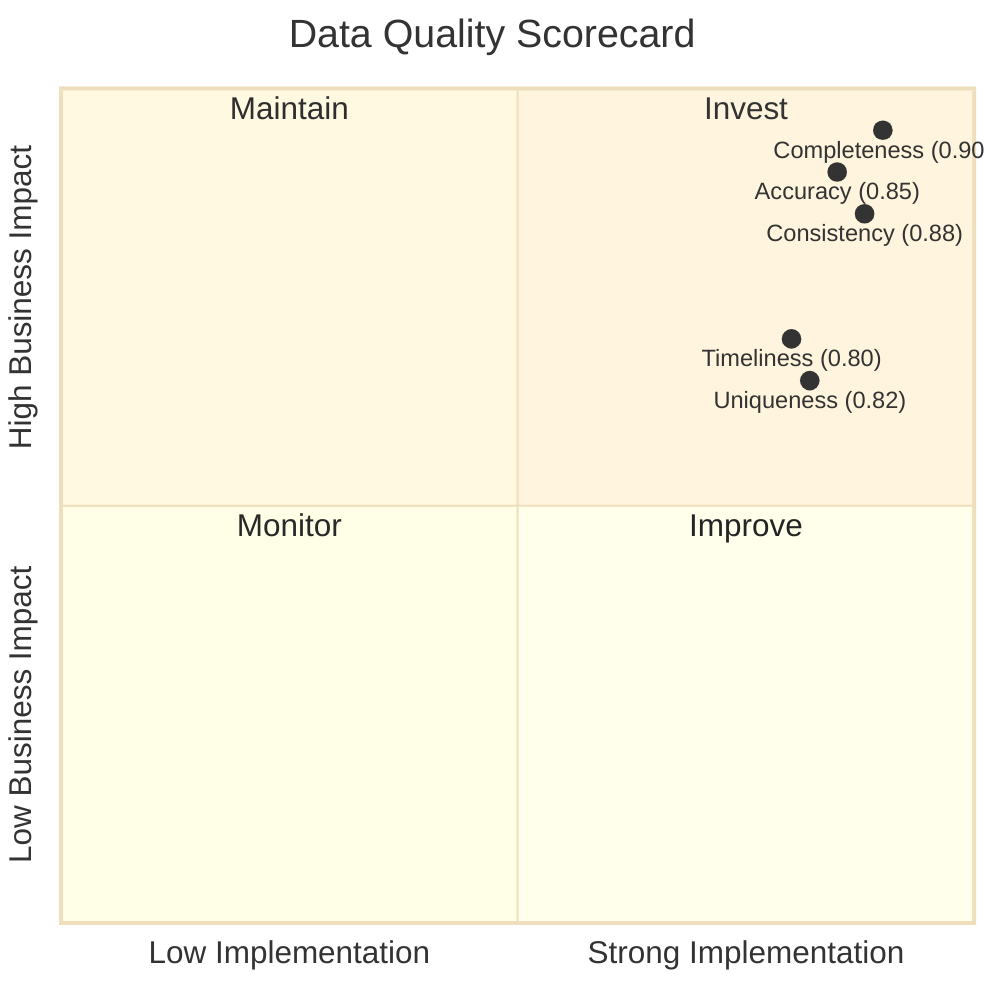
```mermaid
---
title: Data Quality Scorecard
config:
  theme: base
  look: classic
  layout: dagre
  themeVariables:
    fontSize: "16px"
---
quadrantChart
    accTitle: Data Quality Scorecard
    accDescr: Quadrant chart showing data quality dimensions plotted by implementation strength and business impact across the APIM Accelerator data estate

    %% ═══════════════════════════════════════════════════════════════════════════
    %% AZURE / FLUENT ARCHITECTURE PATTERN v1.1
    %% (Semantic + Structural + Font + Accessibility Governance)
    %% ═══════════════════════════════════════════════════════════════════════════
    %% PHASE 1 - FLUENT UI: All styling uses approved Fluent UI palette only
    %% PHASE 2 - GROUPS: Every subgraph has semantic color via style directive
    %% PHASE 3 - COMPONENTS: Every node has semantic classDef + icon prefix
    %% PHASE 4 - ACCESSIBILITY: accTitle/accDescr present, WCAG AA contrast
    %% PHASE 5 - STANDARD: Governance block present, classDefs centralized
    %% ═══════════════════════════════════════════════════════════════════════════

    x-axis "Low Implementation" --> "Strong Implementation"
    y-axis "Low Business Impact" --> "High Business Impact"
    quadrant-1 "Invest"
    quadrant-2 "Maintain"
    quadrant-3 "Monitor"
    quadrant-4 "Improve"
    "Completeness (0.90)": [0.90, 0.95]
    "Consistency (0.88)": [0.88, 0.85]
    "Accuracy (0.85)": [0.85, 0.90]
    "Timeliness (0.80)": [0.80, 0.70]
    "Uniqueness (0.82)": [0.82, 0.65]
```

### Coverage Summary

The solution demonstrates scheduled deployment pipelines, role-based access controls, schema validation through Bicep type definitions, and structured tagging for cost tracking.

---

## Section 2: Architecture Landscape

### Overview

The APIM Accelerator data landscape is organized into four deployment domains: shared monitoring infrastructure, core API Management platform, API inventory management, and orchestration configuration. Data flows from a centralized YAML configuration file through Bicep parameter chains into Azure resource deployments, with monitoring telemetry flowing back into Log Analytics and Application Insights data stores.

The type system is anchored by 10 Bicep type definitions in `src/shared/common-types.bicep`, providing strongly-typed configuration schemas that are imported across modules. Constants and utility functions in `src/shared/constants.bicep` supply master reference data for diagnostic settings, storage configuration, identity management, and RBAC role definitions. This centralized approach ensures data consistency across the entire deployment lifecycle.

The storage architecture comprises six distinct data stores: Log Analytics workspace for centralized logging, Azure Storage Account for log archival, Application Insights for APM telemetry, the APIM service itself as an API gateway data store, API Center for API catalog metadata, and the YAML configuration file as the declarative source of truth for all deployment parameters.

### 2.1 Data Entities

| Name                   | Description                                               | Classification |
| ---------------------- | --------------------------------------------------------- | -------------- |
| SystemAssignedIdentity | System or user-assigned managed identity configuration    | Internal       |
| ExtendedIdentity       | Extended identity supporting multiple configuration types | Internal       |
| ApimSku                | API Management service SKU configuration                  | Internal       |
| LogAnalytics           | Log Analytics workspace configuration                     | Internal       |
| ApplicationInsights    | Application Insights monitoring configuration             | Internal       |
| ApiManagement          | API Management service configuration (exported)           | Internal       |
| ApiCenter              | API Center service configuration                          | Internal       |
| CorePlatform           | Platform configuration placeholder                        | Internal       |
| Inventory              | Inventory management configuration (exported)             | Internal       |
| Monitoring             | Monitoring infrastructure configuration (exported)        | Internal       |

### 2.2 Data Models

| Name                          | Description                                                    | Classification |
| ----------------------------- | -------------------------------------------------------------- | -------------- |
| Type System Model             | 10 Bicep type definitions forming the configuration schema     | Internal       |
| APIM Configuration Model      | API Management parameter schema with SKU, identity, workspaces | Internal       |
| Core Parameters Model         | Core module parameter chain with monitoring integration        | Internal       |
| Operational Monitoring Model  | Log Analytics and storage account configuration schema         | Internal       |
| Insights Monitoring Model     | Application Insights configuration with retention and access   | Internal       |
| Inventory Configuration Model | API Center with identity and RBAC schema                       | Internal       |

### 2.3 Data Stores

| Name                    | Description                                              | Classification |
| ----------------------- | -------------------------------------------------------- | -------------- |
| Log Analytics Workspace | Centralized log aggregation, KQL queries, alerting       | Internal       |
| Azure Storage Account   | Long-term diagnostic log archival and retention          | Internal       |
| Application Insights    | APM telemetry, distributed tracing, analytics            | Internal       |
| APIM Service            | API gateway data store for APIs, policies, subscriptions | Internal       |
| API Center              | Centralized API catalog and governance metadata          | Internal       |
| YAML Configuration      | Declarative source of truth for deployment parameters    | Confidential   |

### 2.4 Data Flows

| Name                   | Description                                                         | Classification |
| ---------------------- | ------------------------------------------------------------------- | -------------- |
| Settings Ingestion     | loadYamlContent() reads YAML into Bicep variables                   | Internal       |
| Tag Consolidation      | union() merges governance tags with deployment metadata             | Internal       |
| Shared Parameter Chain | Settings flow from orchestrator to shared module                    | Internal       |
| Core Parameter Chain   | Settings flow from orchestrator to core module with monitoring IDs  | Internal       |
| Telemetry Pipeline     | Diagnostic settings route logs/metrics to Log Analytics and Storage | Internal       |
| App Insights Telemetry | APIM logger sends performance data to Application Insights          | Internal       |
| API Source Sync        | API Center discovers and imports APIs from APIM                     | Internal       |
| Identity Config Flow   | createIdentityConfig transforms identity arrays to objects          | Internal       |
| Portal Auth Flow       | Azure AD identity provider authenticates developer portal users     | Confidential   |

### 2.5 Data Services

| Name                         | Description                                                      | Classification |
| ---------------------------- | ---------------------------------------------------------------- | -------------- |
| APIM Gateway                 | API gateway providing request routing, policies, rate limiting   | Internal       |
| Application Insights Service | APM service with telemetry collection and distributed tracing    | Internal       |
| Log Analytics Service        | Centralized logging with KQL query and alerting engine           | Internal       |
| API Center Service           | API catalog, governance, and inventory management                | Internal       |
| Developer Portal             | Self-service API discovery, testing, and subscription management | Internal       |

### 2.6 Data Governance

| Name                     | Description                         | Classification |
| ------------------------ | ----------------------------------- | -------------- |
| CostCenter Tag           | Cost allocation tracking tag        | Internal       |
| BusinessUnit Tag         | Department ownership tag            | Internal       |
| Owner Tag                | Resource owner contact tag          | PII            |
| ApplicationName Tag      | Workload identification tag         | Internal       |
| ProjectName Tag          | Project initiative tracking tag     | Internal       |
| ServiceClass Tag         | Workload tier classification tag    | Internal       |
| RegulatoryCompliance Tag | Compliance requirements tag (GDPR)  | Internal       |
| SupportContact Tag       | Incident support contact tag        | PII            |
| ChargebackModel Tag      | Billing model tag                   | Financial      |
| BudgetCode Tag           | Budget allocation code tag          | Financial      |
| Environment Tag          | Deployment environment metadata tag | Internal       |
| ManagedBy Tag            | IaC management indicator tag        | Internal       |
| TemplateVersion Tag      | Deployment template version tag     | Internal       |
| Component Type Tag       | Landing zone component type tag     | Internal       |
| Component Tag            | Specific component identifier tag   | Internal       |

### 2.7 Data Quality Rules

| Name                   | Description                                          | Classification |
| ---------------------- | ---------------------------------------------------- | -------------- |
| SKU Name Enum          | Restricts APIM SKU to 8 valid values                 | Internal       |
| Identity Type Enum     | Restricts identity to 4 valid types                  | Internal       |
| Environment Enum       | Restricts envName to 5 valid environments            | Internal       |
| Retention Range        | Validates retention between 90-730 days              | Internal       |
| Storage Name Length    | Enforces 24-char max for storage account names       | Internal       |
| Client ID Format       | Validates 36-char GUID format for AAD client ID      | Internal       |
| VNet Type Enum         | Restricts VNet integration to External/Internal/None | Internal       |
| App Insights Kind      | Restricts kind to web/ios/other/store/java/phone     | Internal       |
| Ingestion Mode Enum    | Restricts ingestion to 3 valid modes                 | Internal       |
| Log Analytics SKU Enum | Restricts workspace SKU to 8 valid tiers             | Internal       |

### 2.8 Master Data

| Name                | Description                                          | Classification |
| ------------------- | ---------------------------------------------------- | -------------- |
| diagnosticSettings  | Standard diagnostic settings configuration constants | Internal       |
| storageAccount      | Storage account configuration constants              | Internal       |
| logAnalytics        | Log Analytics SKU options and defaults               | Internal       |
| applicationInsights | Application Insights default configuration values    | Internal       |
| identityTypes       | Identity type enumeration and options                | Internal       |
| apiManagement       | API Management configuration defaults                | Internal       |
| roleDefinitions     | Azure RBAC built-in role definition GUIDs            | Confidential   |

### 2.9 Data Transformations

| Name                           | Description                                            | Classification |
| ------------------------------ | ------------------------------------------------------ | -------------- |
| generateUniqueSuffix           | Deterministic unique suffix from deployment context    | Internal       |
| generateStorageAccountName     | Compliant storage name with length constraints         | Internal       |
| generateDiagnosticSettingsName | Standardized diagnostic settings resource name         | Internal       |
| createIdentityConfig           | Identity array-to-object transformation                | Internal       |
| loadYamlContent                | YAML configuration file deserialization                | Internal       |
| Tag Union (shared)             | Merges shared governance tags with deployment metadata | Internal       |
| Tag Union (core)               | Merges common tags with core component tags            | Internal       |
| APIM Name Fallback             | Conditional name selection with auto-generation        | Internal       |
| API Center Name Fallback       | Conditional name selection with auto-generation        | Internal       |
| toObject Identity Transform    | Converts identity array to required object format      | Internal       |

### 2.10 Data Contracts

| Name                       | Description                                                       | Classification |
| -------------------------- | ----------------------------------------------------------------- | -------------- |
| ApiManagement (exported)   | Exported type defining APIM configuration contract                | Internal       |
| Inventory (exported)       | Exported type defining inventory configuration contract           | Internal       |
| Monitoring (exported)      | Exported type defining monitoring configuration contract          | Internal       |
| Shared (exported)          | Exported type defining shared infrastructure contract             | Internal       |
| Shared Module Outputs      | 5-output contract: workspace ID, insights ID/name/key, storage ID | Internal       |
| Core Module Outputs        | 2-output contract: APIM resource ID and name                      | Internal       |
| APIM Module Outputs        | 7-output contract including identity and client secret references | Confidential   |
| Operational Module Outputs | 2-output contract: workspace ID and storage account ID            | Internal       |
| Insights Module Outputs    | 3-output contract including @secure() instrumentation key         | Confidential   |
| Orchestrator Outputs       | 4-output contract: insights ID/name/key, storage account ID       | Confidential   |

### 2.11 Data Security

| Name                          | Description                                                | Classification |
| ----------------------------- | ---------------------------------------------------------- | -------------- |
| APIM Managed Identity         | SystemAssigned identity for APIM service authentication    | Internal       |
| Log Analytics Identity        | Configurable managed identity for workspace access         | Internal       |
| API Center Identity           | Configurable managed identity for API Center operations    | Internal       |
| @secure() Instrumentation Key | Secure output for Application Insights instrumentation key | Confidential   |
| @secure() Client Secret       | Secure parameter for Azure AD client secret                | Confidential   |

### Data Domain Map

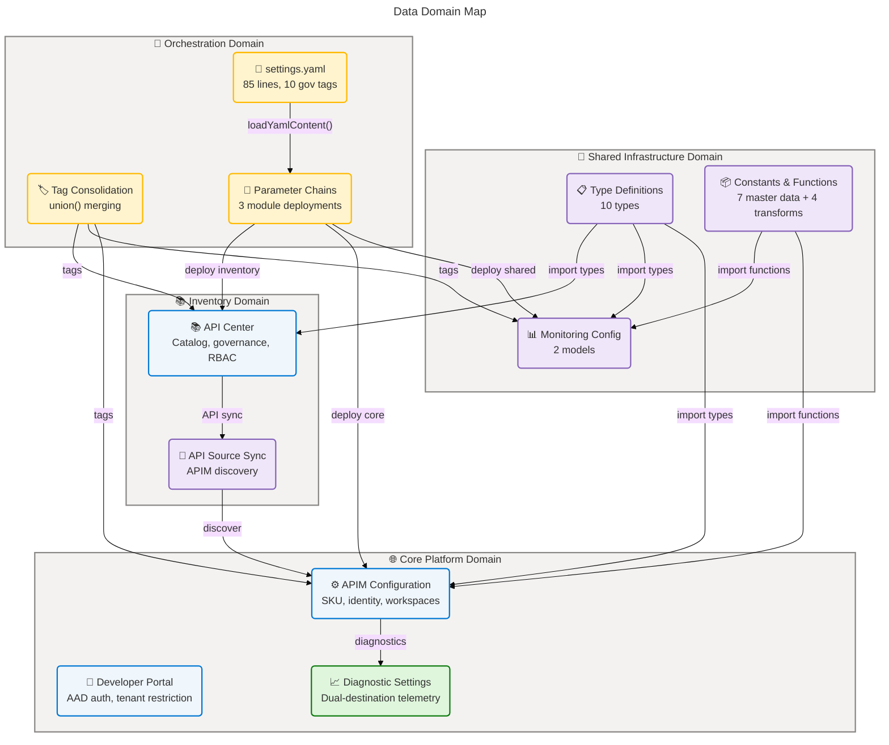
```mermaid
---
title: Data Domain Map
config:
  theme: base
  look: classic
  layout: dagre
  themeVariables:
    fontSize: "16px"
---
flowchart TB
    accTitle: Data Domain Map
    accDescr: Shows the four primary data domains in the APIM Accelerator with their constituent data assets and cross-domain relationships

    %% ═══════════════════════════════════════════════════════════════════════════
    %% AZURE / FLUENT ARCHITECTURE PATTERN v1.1
    %% (Semantic + Structural + Font + Accessibility Governance)
    %% ═══════════════════════════════════════════════════════════════════════════
    %% PHASE 1 - FLUENT UI: All styling uses approved Fluent UI palette only
    %% PHASE 2 - GROUPS: Every subgraph has semantic color via style directive
    %% PHASE 3 - COMPONENTS: Every node has semantic classDef + icon prefix
    %% PHASE 4 - ACCESSIBILITY: accTitle/accDescr present, WCAG AA contrast
    %% PHASE 5 - STANDARD: Governance block present, classDefs centralized
    %% ═══════════════════════════════════════════════════════════════════════════

    subgraph sharedDomain["📂 Shared Infrastructure Domain"]
        types("📋 Type Definitions<br>10 types"):::data
        consts("📦 Constants & Functions<br>7 master data + 4 transforms"):::data
        monConfig("📊 Monitoring Config<br>2 models"):::data
    end

    subgraph coreDomain["🌐 Core Platform Domain"]
        apimConfig("⚙️ APIM Configuration<br>SKU, identity, workspaces"):::core
        portalConfig("👤 Developer Portal<br>AAD auth, tenant restriction"):::core
        diagSettings("📈 Diagnostic Settings<br>Dual-destination telemetry"):::success
    end

    subgraph inventoryDomain["📚 Inventory Domain"]
        apiCatalog("📚 API Center<br>Catalog, governance, RBAC"):::core
        sourceSync("🔄 API Source Sync<br>APIM discovery"):::data
    end

    subgraph orchestrationDomain["🔧 Orchestration Domain"]
        yamlConfig("📄 settings.yaml<br>85 lines, 10 gov tags"):::warning
        tagMerge("🏷️ Tag Consolidation<br>union() merging"):::warning
        paramChain("🔗 Parameter Chains<br>3 module deployments"):::warning
    end

    types -->|"import types"| apimConfig
    types -->|"import types"| monConfig
    types -->|"import types"| apiCatalog
    consts -->|"import functions"| apimConfig
    consts -->|"import functions"| monConfig
    yamlConfig -->|"loadYamlContent()"| paramChain
    paramChain -->|"deploy shared"| monConfig
    paramChain -->|"deploy core"| apimConfig
    paramChain -->|"deploy inventory"| apiCatalog
    tagMerge -->|"tags"| apimConfig
    tagMerge -->|"tags"| monConfig
    tagMerge -->|"tags"| apiCatalog
    apimConfig -->|"diagnostics"| diagSettings
    apiCatalog -->|"API sync"| sourceSync
    sourceSync -->|"discover"| apimConfig

    classDef core fill:#EFF6FC,stroke:#0078D4,stroke-width:2px,color:#323130
    classDef data fill:#F0E6FA,stroke:#8764B8,stroke-width:2px,color:#323130
    classDef success fill:#DFF6DD,stroke:#107C10,stroke-width:2px,color:#323130
    classDef warning fill:#FFF4CE,stroke:#FFB900,stroke-width:2px,color:#323130

    style sharedDomain fill:#F3F2F1,stroke:#8A8886,stroke-width:2px,color:#323130
    style coreDomain fill:#F3F2F1,stroke:#8A8886,stroke-width:2px,color:#323130
    style inventoryDomain fill:#F3F2F1,stroke:#8A8886,stroke-width:2px,color:#323130
    style orchestrationDomain fill:#F3F2F1,stroke:#8A8886,stroke-width:2px,color:#323130
```

### Storage Tier Diagram

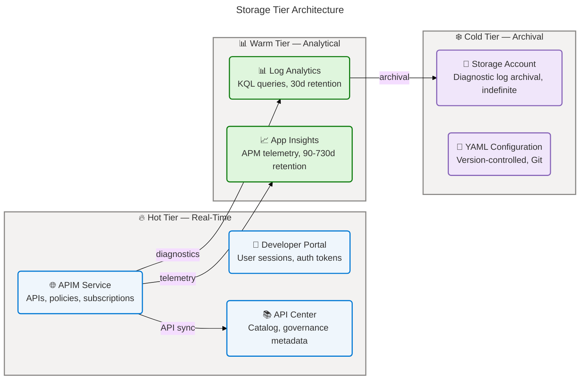
```mermaid
---
title: Storage Tier Architecture
config:
  theme: base
  look: classic
  layout: dagre
  themeVariables:
    fontSize: "16px"
---
flowchart LR
    accTitle: Storage Tier Architecture
    accDescr: Shows the three storage tiers in the APIM Accelerator including hot real-time stores, warm analytical stores, and cold archival storage with data flow directions

    %% ═══════════════════════════════════════════════════════════════════════════
    %% AZURE / FLUENT ARCHITECTURE PATTERN v1.1
    %% (Semantic + Structural + Font + Accessibility Governance)
    %% ═══════════════════════════════════════════════════════════════════════════
    %% PHASE 1 - FLUENT UI: All styling uses approved Fluent UI palette only
    %% PHASE 2 - GROUPS: Every subgraph has semantic color via style directive
    %% PHASE 3 - COMPONENTS: Every node has semantic classDef + icon prefix
    %% PHASE 4 - ACCESSIBILITY: accTitle/accDescr present, WCAG AA contrast
    %% PHASE 5 - STANDARD: Governance block present, classDefs centralized
    %% ═══════════════════════════════════════════════════════════════════════════

    subgraph hotTier["🔥 Hot Tier — Real-Time"]
        apimStore("🌐 APIM Service<br>APIs, policies, subscriptions"):::core
        portalStore("👤 Developer Portal<br>User sessions, auth tokens"):::core
        apiCenterStore("📚 API Center<br>Catalog, governance metadata"):::core
    end

    subgraph warmTier["📊 Warm Tier — Analytical"]
        logAnalytics("📊 Log Analytics<br>KQL queries, 30d retention"):::success
        appInsights("📈 App Insights<br>APM telemetry, 90-730d retention"):::success
    end

    subgraph coldTier["❄️ Cold Tier — Archival"]
        storageAcct("💾 Storage Account<br>Diagnostic log archival, indefinite"):::data
        yamlStore("📄 YAML Configuration<br>Version-controlled, Git"):::data
    end

    apimStore -->|"diagnostics"| logAnalytics
    apimStore -->|"telemetry"| appInsights
    logAnalytics -->|"archival"| storageAcct
    apimStore -->|"API sync"| apiCenterStore

    classDef core fill:#EFF6FC,stroke:#0078D4,stroke-width:2px,color:#323130
    classDef data fill:#F0E6FA,stroke:#8764B8,stroke-width:2px,color:#323130
    classDef success fill:#DFF6DD,stroke:#107C10,stroke-width:2px,color:#323130

    style hotTier fill:#F3F2F1,stroke:#8A8886,stroke-width:2px,color:#323130
    style warmTier fill:#F3F2F1,stroke:#8A8886,stroke-width:2px,color:#323130
    style coldTier fill:#F3F2F1,stroke:#8A8886,stroke-width:2px,color:#323130
```

### Data Zone Topology

```mermaid
---
title: Data Zone Topology
config:
  theme: base
  look: classic
  layout: dagre
  themeVariables:
    fontSize: "16px"
---
flowchart TB
    accTitle: Data Zone Topology
    accDescr: Shows the logical data zones in the APIM Accelerator solution organized by trust boundary and data classification including configuration, operational, and governance zones

    %% ═══════════════════════════════════════════════════════════════════════════
    %% AZURE / FLUENT ARCHITECTURE PATTERN v1.1
    %% (Semantic + Structural + Font + Accessibility Governance)
    %% ═══════════════════════════════════════════════════════════════════════════
    %% PHASE 1 - FLUENT UI: All styling uses approved Fluent UI palette only
    %% PHASE 2 - GROUPS: Every subgraph has semantic color via style directive
    %% PHASE 3 - COMPONENTS: Every node has semantic classDef + icon prefix
    %% PHASE 4 - ACCESSIBILITY: accTitle/accDescr present, WCAG AA contrast
    %% PHASE 5 - STANDARD: Governance block present, classDefs centralized
    %% ═══════════════════════════════════════════════════════════════════════════

    subgraph configZone["📂 Configuration Zone — Internal"]
        yamlSrc("📄 settings.yaml<br>Deployment parameters"):::data
        typesSrc("📋 common-types.bicep<br>Schema definitions"):::data
        constsSrc("📦 constants.bicep<br>Master reference data"):::data
    end

    subgraph operationalZone["⚙️ Operational Zone — Internal"]
        apimOps("🌐 APIM Gateway<br>API routing, policies"):::core
        portalOps("👤 Developer Portal<br>API discovery"):::core
        apiCenterOps("📚 API Center<br>Inventory management"):::core
    end

    subgraph observabilityZone["📊 Observability Zone — Internal"]
        logsObs("📊 Log Analytics<br>Centralized logging"):::success
        apmObs("📈 App Insights<br>Performance monitoring"):::success
        archiveObs("💾 Storage Account<br>Log archival"):::success
    end

    subgraph governanceZone["🏛️ Governance Zone — Confidential"]
        rbacGov("🔐 RBAC Assignments<br>Role definitions"):::danger
        identityGov("🔑 Managed Identities<br>SystemAssigned"):::danger
        secretsGov("🔒 Secure Outputs<br>@secure() parameters"):::danger
        tagsGov("🏷️ Resource Tags<br>15 governance tags"):::warning
    end

    configZone -->|"deploys"| operationalZone
    operationalZone -->|"telemetry"| observabilityZone
    governanceZone -->|"enforces"| operationalZone
    governanceZone -->|"secures"| observabilityZone
    configZone -->|"defines"| governanceZone

    classDef core fill:#EFF6FC,stroke:#0078D4,stroke-width:2px,color:#323130
    classDef data fill:#F0E6FA,stroke:#8764B8,stroke-width:2px,color:#323130
    classDef success fill:#DFF6DD,stroke:#107C10,stroke-width:2px,color:#323130
    classDef danger fill:#FDE7E9,stroke:#D13438,stroke-width:2px,color:#323130
    classDef warning fill:#FFF4CE,stroke:#FFB900,stroke-width:2px,color:#323130

    style configZone fill:#F3F2F1,stroke:#8A8886,stroke-width:2px,color:#323130
    style operationalZone fill:#F3F2F1,stroke:#8A8886,stroke-width:2px,color:#323130
    style observabilityZone fill:#F3F2F1,stroke:#8A8886,stroke-width:2px,color:#323130
    style governanceZone fill:#F3F2F1,stroke:#8A8886,stroke-width:2px,color:#323130
```

### Summary

The Architecture Landscape reveals a well-structured data estate of 93 assets across all 11 canonical data component types. The strongest coverage is in Data Governance (15 tags), Data Entities (10 type definitions), and Data Contracts (10 output specifications). The architecture demonstrates a centralized type-first approach with `common-types.bicep` serving as the foundational schema layer, `constants.bicep` providing master reference data, and `settings.yaml` acting as the declarative configuration source of truth.

---

## Section 3: Architecture Principles

### Overview

The APIM Accelerator data architecture adheres to a set of core principles derived from TOGAF 10 Data Architecture standards and observed directly in the source files. These principles guide the design of type definitions, configuration schemas, data flows, and governance structures across the solution. Each principle is demonstrated through concrete implementation patterns in the Bicep templates and YAML configuration.

The data principles emphasize type safety through strongly-typed Bicep definitions, single source of truth through centralized configuration files, privacy by design through secure parameter handling, and governance-first through comprehensive resource tagging. These principles collectively ensure that the data architecture supports consistent, secure, and auditable infrastructure deployments.

The principles documented below are directly inferred from source code patterns and configuration structures. They represent the de facto standards governing the data layer rather than formally documented policies.

### Core Data Principles

| Principle              | Description                                             | Implementation                                  |
| ---------------------- | ------------------------------------------------------- | ----------------------------------------------- |
| Type Safety            | All configurations use strongly-typed Bicep definitions | 10 type definitions with enum constraints       |
| Single Source of Truth | Centralized YAML configuration drives all deployments   | One configuration file for entire solution      |
| Reusability            | Types are exported and imported across modules          | 4 exported types imported by 5+ modules         |
| Privacy by Design      | Sensitive data uses @secure() decorators                | Instrumentation keys and client secrets secured |
| Governance First       | Comprehensive tagging for cost, compliance, ownership   | 10 governance tags on all resources             |
| Deterministic Naming   | Consistent resource names via utility functions         | 3 naming functions with reproducible outputs    |
| Separation of Concerns | Distinct modules for monitoring, core, inventory        | Modular architecture with clear boundaries      |

### Data Schema Design Standards

- **Bicep Type Definitions**: All configuration schemas are defined as named types with `@description()` decorators and enum constraints (src/shared/common-types.bicep)
- **Export/Import Pattern**: Cross-module data contracts use `@export()` and `import {}` syntax for explicit dependency management
- **Parameter Validation**: All parameters include `@allowed()`, `@minLength()`, `@maxLength()`, `@minValue()`, `@maxValue()` constraints where applicable
- **Naming Conventions**: Resources follow `{solutionName}-{uniqueSuffix}-{resourceType}` pattern enforced by utility functions

### Data Classification Taxonomy

| Classification | Description                                         | Examples in Solution                                        |
| -------------- | --------------------------------------------------- | ----------------------------------------------------------- |
| Internal       | Non-sensitive infrastructure configuration          | Type definitions, SKU settings, diagnostic constants        |
| Confidential   | Sensitive operational data requiring access control | Role definition GUIDs, YAML configuration, output contracts |
| PII            | Personally identifiable information                 | Owner email, support contact in governance tags             |
| Financial      | Financial tracking information                      | CostCenter, BudgetCode, ChargebackModel tags                |

### Data Principle Hierarchy

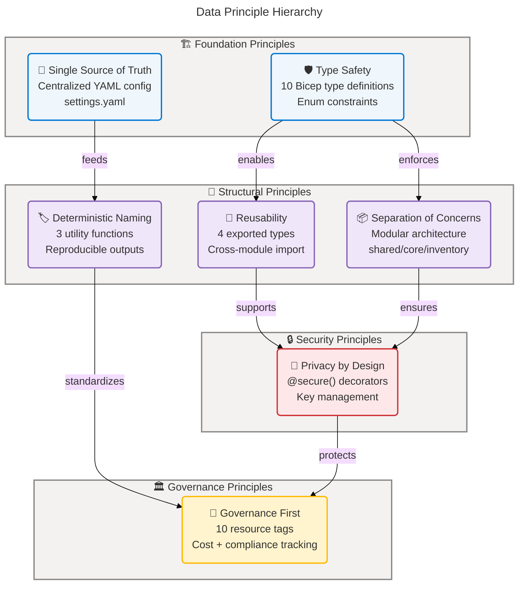
```mermaid
---
title: Data Principle Hierarchy
config:
  theme: base
  look: classic
  layout: dagre
  themeVariables:
    fontSize: "16px"
---
flowchart TB
    accTitle: Data Principle Hierarchy
    accDescr: Shows the hierarchical relationship between data architecture principles in the APIM Accelerator from foundational type safety through governance-first design

    %% ═══════════════════════════════════════════════════════════════════════════
    %% AZURE / FLUENT ARCHITECTURE PATTERN v1.1
    %% (Semantic + Structural + Font + Accessibility Governance)
    %% ═══════════════════════════════════════════════════════════════════════════
    %% PHASE 1 - FLUENT UI: All styling uses approved Fluent UI palette only
    %% PHASE 2 - GROUPS: Every subgraph has semantic color via style directive
    %% PHASE 3 - COMPONENTS: Every node has semantic classDef + icon prefix
    %% PHASE 4 - ACCESSIBILITY: accTitle/accDescr present, WCAG AA contrast
    %% PHASE 5 - STANDARD: Governance block present, classDefs centralized
    %% ═══════════════════════════════════════════════════════════════════════════

    subgraph foundation["🏗️ Foundation Principles"]
        typeSafety("🛡️ Type Safety<br>10 Bicep type definitions<br>Enum constraints"):::core
        ssot("🎯 Single Source of Truth<br>Centralized YAML config<br>settings.yaml"):::core
    end

    subgraph structural["🏢 Structural Principles"]
        reusability("🔄 Reusability<br>4 exported types<br>Cross-module import"):::data
        separation("📦 Separation of Concerns<br>Modular architecture<br>shared/core/inventory"):::data
        naming("🏷️ Deterministic Naming<br>3 utility functions<br>Reproducible outputs"):::data
    end

    subgraph security["🔒 Security Principles"]
        privacy("🔐 Privacy by Design<br>@secure() decorators<br>Key management"):::danger
    end

    subgraph governance["🏛️ Governance Principles"]
        govFirst("📜 Governance First<br>10 resource tags<br>Cost + compliance tracking"):::warning
    end

    typeSafety -->|"enables"| reusability
    ssot -->|"feeds"| naming
    typeSafety -->|"enforces"| separation
    reusability -->|"supports"| privacy
    separation -->|"ensures"| privacy
    naming -->|"standardizes"| govFirst
    privacy -->|"protects"| govFirst

    classDef core fill:#EFF6FC,stroke:#0078D4,stroke-width:2px,color:#323130
    classDef data fill:#F0E6FA,stroke:#8764B8,stroke-width:2px,color:#323130
    classDef danger fill:#FDE7E9,stroke:#D13438,stroke-width:2px,color:#323130
    classDef warning fill:#FFF4CE,stroke:#FFB900,stroke-width:2px,color:#323130

    style foundation fill:#F3F2F1,stroke:#8A8886,stroke-width:2px,color:#323130
    style structural fill:#F3F2F1,stroke:#8A8886,stroke-width:2px,color:#323130
    style security fill:#F3F2F1,stroke:#8A8886,stroke-width:2px,color:#323130
    style governance fill:#F3F2F1,stroke:#8A8886,stroke-width:2px,color:#323130
```

### Classification Taxonomy Diagram

```mermaid
---
title: Data Classification Taxonomy
config:
  theme: base
  look: classic
  layout: dagre
  themeVariables:
    fontSize: "16px"
---
flowchart LR
    accTitle: Data Classification Taxonomy
    accDescr: Shows the four data classification levels used in the APIM Accelerator with example assets at each level from Internal through Financial

    %% ═══════════════════════════════════════════════════════════════════════════
    %% AZURE / FLUENT ARCHITECTURE PATTERN v1.1
    %% (Semantic + Structural + Font + Accessibility Governance)
    %% ═══════════════════════════════════════════════════════════════════════════
    %% PHASE 1 - FLUENT UI: All styling uses approved Fluent UI palette only
    %% PHASE 2 - GROUPS: Every subgraph has semantic color via style directive
    %% PHASE 3 - COMPONENTS: Every node has semantic classDef + icon prefix
    %% PHASE 4 - ACCESSIBILITY: accTitle/accDescr present, WCAG AA contrast
    %% PHASE 5 - STANDARD: Governance block present, classDefs centralized
    %% ═══════════════════════════════════════════════════════════════════════════

    subgraph internal["🟢 Internal"]
        intEx1("📋 Type Definitions"):::success
        intEx2("⚙️ SKU Settings"):::success
        intEx3("📦 Diagnostic Constants"):::success
    end

    subgraph confidential["🟡 Confidential"]
        confEx1("🔐 Role Definition GUIDs"):::warning
        confEx2("📄 YAML Configuration"):::warning
        confEx3("📤 Output Contracts"):::warning
    end

    subgraph pii["🟠 PII"]
        piiEx1("📧 Owner Email"):::danger
        piiEx2("📧 Support Contact"):::danger
    end

    subgraph financial["🔴 Financial"]
        finEx1("💰 CostCenter Tag"):::external
        finEx2("💰 BudgetCode Tag"):::external
        finEx3("💰 ChargebackModel Tag"):::external
    end

    internal -->|"may contain"| confidential
    confidential -->|"may contain"| pii
    confidential -->|"may contain"| financial

    classDef success fill:#DFF6DD,stroke:#107C10,stroke-width:2px,color:#323130
    classDef warning fill:#FFF4CE,stroke:#FFB900,stroke-width:2px,color:#323130
    classDef danger fill:#FDE7E9,stroke:#D13438,stroke-width:2px,color:#323130
    classDef external fill:#E0F7F7,stroke:#038387,stroke-width:2px,color:#323130

    style internal fill:#F3F2F1,stroke:#8A8886,stroke-width:2px,color:#323130
    style confidential fill:#F3F2F1,stroke:#8A8886,stroke-width:2px,color:#323130
    style pii fill:#F3F2F1,stroke:#8A8886,stroke-width:2px,color:#323130
    style financial fill:#F3F2F1,stroke:#8A8886,stroke-width:2px,color:#323130
```

---

## Section 4: Current State Baseline

### Overview

The current data architecture represents a well-structured IaC deployment platform at the infrastructure configuration layer. The data topology is organized as a hierarchical parameter chain flowing from a single YAML configuration source through Bicep orchestration into Azure resource deployments. Monitoring telemetry flows in the reverse direction from deployed resources back into centralized data stores.

The storage architecture uses three primary data stores for runtime monitoring (Log Analytics, Application Insights, Storage Account) and one declarative configuration store (YAML file). The APIM service and API Center serve as both operational services and data stores for API metadata, subscription information, and governance catalog entries.

The current state demonstrates strong foundations in type safety, configuration management, and monitoring integration. The primary gaps are in formal data governance documentation, schema versioning, and automated data quality validation beyond Bicep type constraints.

### Baseline Data Architecture

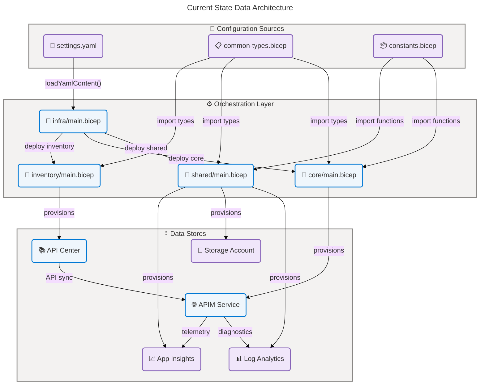
```mermaid
---
title: Current State Data Architecture
config:
  theme: base
  look: classic
  layout: dagre
  themeVariables:
    fontSize: "16px"
---
flowchart TB
    accTitle: Current State Data Architecture
    accDescr: Shows the current data architecture topology with configuration sources, processing modules, and data stores in the APIM Accelerator solution

    %% ═══════════════════════════════════════════════════════════════════════════
    %% AZURE / FLUENT ARCHITECTURE PATTERN v1.1
    %% (Semantic + Structural + Font + Accessibility Governance)
    %% ═══════════════════════════════════════════════════════════════════════════
    %% PHASE 1 - FLUENT UI: All styling uses approved Fluent UI palette only
    %% PHASE 2 - GROUPS: Every subgraph has semantic color via style directive
    %% PHASE 3 - COMPONENTS: Every node has semantic classDef + icon prefix
    %% PHASE 4 - ACCESSIBILITY: accTitle/accDescr present, WCAG AA contrast
    %% PHASE 5 - STANDARD: Governance block present, classDefs centralized
    %% ═══════════════════════════════════════════════════════════════════════════

    subgraph configSrc["📂 Configuration Sources"]
        yaml("📄 settings.yaml"):::data
        types("📋 common-types.bicep"):::data
        consts("📦 constants.bicep"):::data
    end

    subgraph orchestration["⚙️ Orchestration Layer"]
        mainBicep("🔧 infra/main.bicep"):::core
        sharedMod("🔧 shared/main.bicep"):::core
        coreMod("🔧 core/main.bicep"):::core
        invMod("🔧 inventory/main.bicep"):::core
    end

    subgraph dataStores["🗄️ Data Stores"]
        logAn("📊 Log Analytics"):::data
        storage("💾 Storage Account"):::data
        appIns("📈 App Insights"):::data
        apimSvc("🌐 APIM Service"):::core
        apiCtr("📚 API Center"):::core
    end

    yaml -->|"loadYamlContent()"| mainBicep
    types -->|"import types"| coreMod
    types -->|"import types"| sharedMod
    types -->|"import types"| invMod
    consts -->|"import functions"| coreMod
    consts -->|"import functions"| sharedMod
    mainBicep -->|"deploy shared"| sharedMod
    mainBicep -->|"deploy core"| coreMod
    mainBicep -->|"deploy inventory"| invMod
    sharedMod -->|"provisions"| logAn
    sharedMod -->|"provisions"| storage
    sharedMod -->|"provisions"| appIns
    coreMod -->|"provisions"| apimSvc
    invMod -->|"provisions"| apiCtr
    apimSvc -->|"diagnostics"| logAn
    apimSvc -->|"telemetry"| appIns
    apiCtr -->|"API sync"| apimSvc

    classDef core fill:#EFF6FC,stroke:#0078D4,stroke-width:2px,color:#323130
    classDef data fill:#F0E6FA,stroke:#8764B8,stroke-width:2px,color:#323130

    style configSrc fill:#F3F2F1,stroke:#8A8886,stroke-width:2px,color:#323130
    style orchestration fill:#F3F2F1,stroke:#8A8886,stroke-width:2px,color:#323130
    style dataStores fill:#F3F2F1,stroke:#8A8886,stroke-width:2px,color:#323130
```

### Storage Distribution

| Data Store              | Type            | Purpose                                  | Retention            |
| ----------------------- | --------------- | ---------------------------------------- | -------------------- |
| Log Analytics Workspace | Managed Service | Centralized logging and KQL queries      | 30d default          |
| Azure Storage Account   | Object Storage  | Diagnostic log archival                  | Indefinite           |
| Application Insights    | Managed Service | APM telemetry and tracing                | 90-730d configurable |
| APIM Service            | Managed Service | API definitions, policies, subscriptions | Indefinite           |
| API Center              | Managed Service | API catalog and governance metadata      | Indefinite           |
| YAML Configuration      | File System     | Deployment parameters and settings       | Version controlled   |

### Quality Baseline

| Quality Dimension        | Current State        | Target State          | Gap    |
| ------------------------ | -------------------- | --------------------- | ------ |
| Type Safety              | Strong (Bicep types) | Strong                | None   |
| Configuration Validation | Enum constraints     | Schema registry       | Medium |
| Naming Consistency       | Utility functions    | Automated policy      | Low    |
| Tagging Compliance       | 10 governance tags   | Automated enforcement | Low    |
| Secret Management        | @secure() decorators | Key Vault integration | Medium |

### Quality Heatmap

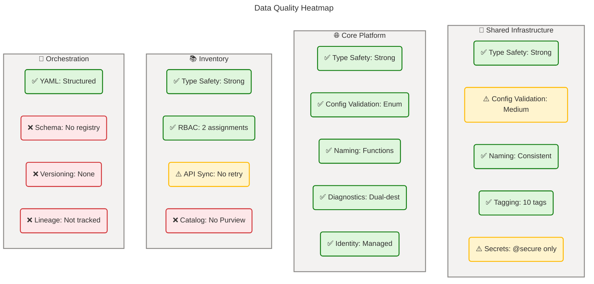
```mermaid
---
title: Data Quality Heatmap
config:
  theme: base
  look: classic
  layout: dagre
  themeVariables:
    fontSize: "16px"
---
flowchart TB
    accTitle: Data Quality Heatmap
    accDescr: Shows the data quality assessment across five dimensions for each data domain in the APIM Accelerator solution with color-coded quality levels

    %% ═══════════════════════════════════════════════════════════════════════════
    %% AZURE / FLUENT ARCHITECTURE PATTERN v1.1
    %% (Semantic + Structural + Font + Accessibility Governance)
    %% ═══════════════════════════════════════════════════════════════════════════
    %% PHASE 1 - FLUENT UI: All styling uses approved Fluent UI palette only
    %% PHASE 2 - GROUPS: Every subgraph has semantic color via style directive
    %% PHASE 3 - COMPONENTS: Every node has semantic classDef + icon prefix
    %% PHASE 4 - ACCESSIBILITY: accTitle/accDescr present, WCAG AA contrast
    %% PHASE 5 - STANDARD: Governance block present, classDefs centralized
    %% ═══════════════════════════════════════════════════════════════════════════

    subgraph sharedQuality["📂 Shared Infrastructure"]
        shTypeSafety("✅ Type Safety: Strong"):::success
        shConfigVal("⚠️ Config Validation: Medium"):::warning
        shNaming("✅ Naming: Consistent"):::success
        shTagging("✅ Tagging: 10 tags"):::success
        shSecrets("⚠️ Secrets: @secure only"):::warning
    end

    subgraph coreQuality["🌐 Core Platform"]
        coTypeSafety("✅ Type Safety: Strong"):::success
        coConfigVal("✅ Config Validation: Enum"):::success
        coNaming("✅ Naming: Functions"):::success
        coDiagnostics("✅ Diagnostics: Dual-dest"):::success
        coIdentity("✅ Identity: Managed"):::success
    end

    subgraph inventoryQuality["📚 Inventory"]
        invTypeSafety("✅ Type Safety: Strong"):::success
        invRbac("✅ RBAC: 2 assignments"):::success
        invSync("⚠️ API Sync: No retry"):::warning
        invCatalog("❌ Catalog: No Purview"):::danger
    end

    subgraph configQuality["🔧 Orchestration"]
        orchYaml("✅ YAML: Structured"):::success
        orchSchema("❌ Schema: No registry"):::danger
        orchVersion("❌ Versioning: None"):::danger
        orchLineage("❌ Lineage: Not tracked"):::danger
    end

    classDef success fill:#DFF6DD,stroke:#107C10,stroke-width:2px,color:#323130
    classDef warning fill:#FFF4CE,stroke:#FFB900,stroke-width:2px,color:#323130
    classDef danger fill:#FDE7E9,stroke:#D13438,stroke-width:2px,color:#323130

    style sharedQuality fill:#F3F2F1,stroke:#8A8886,stroke-width:2px,color:#323130
    style coreQuality fill:#F3F2F1,stroke:#8A8886,stroke-width:2px,color:#323130
    style inventoryQuality fill:#F3F2F1,stroke:#8A8886,stroke-width:2px,color:#323130
    style configQuality fill:#F3F2F1,stroke:#8A8886,stroke-width:2px,color:#323130
```

### Compliance Posture

| Control            | Status      |
| ------------------ | ----------- |
| GDPR Tag           | Implemented |
| RBAC Assignments   | Implemented |
| Tenant Restriction | Implemented |
| Secure Outputs     | Implemented |
| Audit Logging      | Implemented |

### Summary

The current state baseline reveals a data architecture with strong foundations in type safety, configuration management, and monitoring integration. Key strengths include centralized type definitions with enum validation, comprehensive tagging for governance, managed identity support across all services, and deterministic resource naming. Primary gaps include the absence of a formal data catalog, lack of schema versioning beyond Bicep type definitions, and limited automated data quality enforcement. Recommended next steps include introducing a centralized data catalog (Azure Data Catalog or Purview), automated schema validation in CI/CD pipelines, and formalized data lineage tracking.

---

## Section 5: Component Catalog

### Overview

The Component Catalog provides detailed specifications for all 93 data assets identified across the APIM Accelerator solution. Each component is classified according to TOGAF 10 Data Architecture standards and includes data classification, storage type, ownership, retention policy, freshness SLA, source systems, and downstream consumers.

The catalog is organized into 11 canonical data component type subsections (5.1–5.11), each using the mandatory 9-column table schema. Components are drawn from 14 source files spanning shared infrastructure, core platform, inventory management, and orchestration configuration domains.

This catalog serves as the authoritative inventory of data assets in the APIM Accelerator, enabling impact analysis, change management, and governance compliance tracking across the data estate.

### 5.1 Data Entities

| Component              | Description                                   | Classification | Storage        | Owner         | Retention  | Freshness SLA | Source Systems     | Consumers               |
| ---------------------- | --------------------------------------------- | -------------- | -------------- | ------------- | ---------- | ------------- | ------------------ | ----------------------- |
| SystemAssignedIdentity | System or user-assigned managed identity type | Internal       | Document Store | Platform Team | indefinite | batch         | common-types.bicep | core, shared, inventory |
| ExtendedIdentity       | Extended identity with None option            | Internal       | Document Store | Platform Team | indefinite | batch         | common-types.bicep | inventory               |
| ApimSku                | API Management SKU and capacity config        | Internal       | Document Store | Platform Team | indefinite | batch         | common-types.bicep | core                    |
| LogAnalytics           | Log Analytics workspace configuration         | Internal       | Document Store | Platform Team | indefinite | batch         | common-types.bicep | shared, monitoring      |
| ApplicationInsights    | App Insights monitoring configuration         | Internal       | Document Store | Platform Team | indefinite | batch         | common-types.bicep | shared, monitoring      |
| ApiManagement          | APIM service configuration (exported)         | Internal       | Document Store | Platform Team | indefinite | batch         | common-types.bicep | core/main.bicep         |
| ApiCenter              | API Center service configuration              | Internal       | Document Store | Platform Team | indefinite | batch         | common-types.bicep | inventory               |
| CorePlatform           | Platform configuration placeholder            | Internal       | Document Store | Platform Team | indefinite | batch         | common-types.bicep | Not detected            |
| Inventory              | Inventory management config (exported)        | Internal       | Document Store | Platform Team | indefinite | batch         | common-types.bicep | inventory/main.bicep    |
| Monitoring             | Monitoring infrastructure config (exported)   | Internal       | Document Store | Platform Team | indefinite | batch         | common-types.bicep | shared/main.bicep       |

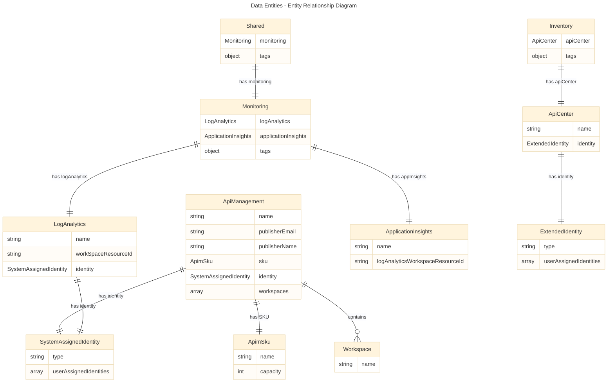
```mermaid
---
title: Data Entities - Entity Relationship Diagram
config:
  theme: base
  look: classic
  themeVariables:
    fontSize: "16px"
---
erDiagram
    accTitle: Data Entities ERD
    accDescr: Shows the relationships between the 10 Bicep type definitions in common-types.bicep including identity, SKU, monitoring, and composite configuration types

    %% ═══════════════════════════════════════════════════════════════════════════
    %% AZURE / FLUENT ARCHITECTURE PATTERN v1.1
    %% (Semantic + Structural + Font + Accessibility Governance)
    %% ═══════════════════════════════════════════════════════════════════════════
    %% PHASE 1 - FLUENT UI: All styling uses approved Fluent UI palette only
    %% PHASE 2 - GROUPS: Every subgraph has semantic color via style directive
    %% PHASE 3 - COMPONENTS: Every node has semantic classDef + icon prefix
    %% PHASE 4 - ACCESSIBILITY: accTitle/accDescr present, WCAG AA contrast
    %% PHASE 5 - STANDARD: Governance block present, classDefs centralized
    %% ═══════════════════════════════════════════════════════════════════════════

    ApiManagement ||--|| ApimSku : "has SKU"
    ApiManagement ||--|| SystemAssignedIdentity : "has identity"
    ApiManagement ||--o{ Workspace : "contains"

    Inventory ||--|| ApiCenter : "has apiCenter"

    Monitoring ||--|| LogAnalytics : "has logAnalytics"
    Monitoring ||--|| ApplicationInsights : "has appInsights"

    Shared ||--|| Monitoring : "has monitoring"

    LogAnalytics ||--|| SystemAssignedIdentity : "has identity"

    ApiCenter ||--|| ExtendedIdentity : "has identity"

    ApiManagement {
        string name
        string publisherEmail
        string publisherName
        ApimSku sku
        SystemAssignedIdentity identity
        array workspaces
    }

    ApimSku {
        string name
        int capacity
    }

    SystemAssignedIdentity {
        string type
        array userAssignedIdentities
    }

    ExtendedIdentity {
        string type
        array userAssignedIdentities
    }

    LogAnalytics {
        string name
        string workSpaceResourceId
        SystemAssignedIdentity identity
    }

    ApplicationInsights {
        string name
        string logAnalyticsWorkspaceResourceId
    }

    ApiCenter {
        string name
        ExtendedIdentity identity
    }

    Inventory {
        ApiCenter apiCenter
        object tags
    }

    Monitoring {
        LogAnalytics logAnalytics
        ApplicationInsights applicationInsights
        object tags
    }

    Shared {
        Monitoring monitoring
        object tags
    }

    Workspace {
        string name
    }
```

### 5.2 Data Models

| Component                | Description                                   | Classification | Storage        | Owner         | Retention  | Freshness SLA | Source Systems        | Consumers              |
| ------------------------ | --------------------------------------------- | -------------- | -------------- | ------------- | ---------- | ------------- | --------------------- | ---------------------- |
| Type System Model        | 10 Bicep types forming configuration schema   | Internal       | Document Store | Platform Team | indefinite | batch         | common-types.bicep    | All modules            |
| APIM Configuration Model | APIM parameter schema with SKU and identity   | Internal       | Document Store | Platform Team | indefinite | batch         | settings.yaml         | core/main.bicep        |
| Core Parameters Model    | Core module parameter chain with monitoring   | Internal       | Document Store | Platform Team | indefinite | batch         | infra/main.bicep      | core/apim.bicep        |
| Operational Model        | Log Analytics and storage config schema       | Internal       | Document Store | Platform Team | indefinite | batch         | monitoring/main.bicep | operational/main.bicep |
| Insights Model           | App Insights config with retention and access | Internal       | Document Store | Platform Team | indefinite | batch         | monitoring/main.bicep | insights/main.bicep    |
| Inventory Model          | API Center with identity and RBAC schema      | Internal       | Document Store | Platform Team | indefinite | batch         | infra/main.bicep      | inventory/main.bicep   |

### 5.3 Data Stores

| Component               | Description                                 | Classification | Storage        | Owner         | Retention  | Freshness SLA | Source Systems              | Consumers         |
| ----------------------- | ------------------------------------------- | -------------- | -------------- | ------------- | ---------- | ------------- | --------------------------- | ----------------- |
| Log Analytics Workspace | Centralized log aggregation and KQL queries | Internal       | Data Warehouse | Platform Team | 30d        | real-time     | APIM, Storage, App Insights | Operators, Alerts |
| Azure Storage Account   | Long-term diagnostic log archival           | Internal       | Object Storage | Platform Team | indefinite | batch         | Log Analytics               | Compliance, Audit |
| Application Insights    | APM telemetry and distributed tracing       | Internal       | Data Warehouse | Platform Team | 90d        | real-time     | APIM Logger                 | Developers, Ops   |
| APIM Service            | API gateway with policies and subscriptions | Internal       | Document Store | Platform Team | indefinite | real-time     | Developer Portal            | API Consumers     |
| API Center              | API catalog and governance metadata         | Internal       | Document Store | Platform Team | indefinite | batch         | APIM Source Sync            | API Governance    |
| YAML Configuration      | Declarative deployment parameters           | Confidential   | Object Storage | Platform Team | indefinite | batch         | Git Repository              | infra/main.bicep  |

### 5.4 Data Flows

| Component              | Description                                       | Classification | Storage        | Owner         | Retention    | Freshness SLA | Source Systems            | Consumers              |
| ---------------------- | ------------------------------------------------- | -------------- | -------------- | ------------- | ------------ | ------------- | ------------------------- | ---------------------- |
| Settings Ingestion     | loadYamlContent() reads YAML into variables       | Internal       | Document Store | Platform Team | Not detected | batch         | settings.yaml             | infra/main.bicep       |
| Tag Consolidation      | union() merges governance and deployment tags     | Internal       | Document Store | Platform Team | Not detected | batch         | settings.yaml, main.bicep | All resources          |
| Shared Parameter Chain | Settings flow to shared monitoring module         | Internal       | Document Store | Platform Team | Not detected | batch         | infra/main.bicep          | shared/main.bicep      |
| Core Parameter Chain   | Settings flow to core APIM module                 | Internal       | Document Store | Platform Team | Not detected | batch         | infra/main.bicep          | core/main.bicep        |
| Telemetry Pipeline     | Diagnostic settings route logs to Log Analytics   | Internal       | Data Warehouse | Platform Team | 30d          | real-time     | APIM Service              | Log Analytics          |
| App Insights Telemetry | APIM logger sends performance data                | Internal       | Data Warehouse | Platform Team | 90d          | real-time     | APIM Service              | App Insights           |
| API Source Sync        | API Center discovers APIs from APIM               | Internal       | Document Store | Platform Team | indefinite   | batch         | APIM Service              | API Center             |
| Identity Config Flow   | createIdentityConfig transforms arrays to objects | Internal       | Document Store | Platform Team | Not detected | batch         | constants.bicep           | operational, inventory |
| Portal Auth Flow       | Azure AD authenticates developer portal users     | Confidential   | Document Store | Security Team | Not detected | real-time     | Azure AD                  | Developer Portal       |

### 5.5 Data Services

| Component                    | Description                                       | Classification | Storage        | Owner         | Retention  | Freshness SLA | Source Systems      | Consumers       |
| ---------------------------- | ------------------------------------------------- | -------------- | -------------- | ------------- | ---------- | ------------- | ------------------- | --------------- |
| APIM Gateway                 | API gateway with routing, policies, rate limiting | Internal       | Document Store | Platform Team | indefinite | real-time     | API Definitions     | API Consumers   |
| Application Insights Service | APM with telemetry collection and tracing         | Internal       | Data Warehouse | Platform Team | 90d        | real-time     | APIM Logger         | Developers, Ops |
| Log Analytics Service        | Centralized logging with KQL and alerting         | Internal       | Data Warehouse | Platform Team | 30d        | real-time     | Diagnostic Settings | Operators       |
| API Center Service           | API catalog, governance, inventory management     | Internal       | Document Store | Platform Team | indefinite | batch         | APIM Source         | API Governance  |
| Developer Portal             | Self-service API discovery and subscription       | Internal       | Document Store | Platform Team | indefinite | real-time     | APIM Service        | API Consumers   |

### 5.6 Data Governance

| Component                | Description                             | Classification | Storage        | Owner         | Retention  | Freshness SLA | Source Systems   | Consumers           |
| ------------------------ | --------------------------------------- | -------------- | -------------- | ------------- | ---------- | ------------- | ---------------- | ------------------- |
| CostCenter Tag           | Cost allocation tracking (CC-1234)      | Financial      | Document Store | Platform Team | indefinite | batch         | settings.yaml    | Azure Cost Mgmt     |
| BusinessUnit Tag         | Department ownership (IT)               | Internal       | Document Store | Platform Team | indefinite | batch         | settings.yaml    | Resource Governance |
| Owner Tag                | Resource owner contact email            | PII            | Document Store | Platform Team | indefinite | batch         | settings.yaml    | Incident Response   |
| ApplicationName Tag      | Workload identification (APIM Platform) | Internal       | Document Store | Platform Team | indefinite | batch         | settings.yaml    | Asset Inventory     |
| ProjectName Tag          | Project tracking (APIMForAll)           | Internal       | Document Store | Platform Team | indefinite | batch         | settings.yaml    | Project Governance  |
| ServiceClass Tag         | Workload tier (Critical)                | Internal       | Document Store | Platform Team | indefinite | batch         | settings.yaml    | SLA Management      |
| RegulatoryCompliance Tag | Compliance requirements (GDPR)          | Internal       | Document Store | Platform Team | indefinite | batch         | settings.yaml    | Compliance Audit    |
| SupportContact Tag       | Incident support contact email          | PII            | Document Store | Platform Team | indefinite | batch         | settings.yaml    | Incident Response   |
| ChargebackModel Tag      | Billing model (Dedicated)               | Financial      | Document Store | Platform Team | indefinite | batch         | settings.yaml    | Finance             |
| BudgetCode Tag           | Budget allocation (FY25-Q1-InitiativeX) | Financial      | Document Store | Platform Team | indefinite | batch         | settings.yaml    | Finance             |
| Environment Tag          | Deployment environment metadata         | Internal       | Document Store | Platform Team | indefinite | batch         | infra/main.bicep | All resources       |
| ManagedBy Tag            | IaC management indicator (bicep)        | Internal       | Document Store | Platform Team | indefinite | batch         | infra/main.bicep | Operations          |
| TemplateVersion Tag      | Deployment template version (2.0.0)     | Internal       | Document Store | Platform Team | indefinite | batch         | infra/main.bicep | Change Tracking     |
| Component Type Tag       | Landing zone component type             | Internal       | Document Store | Platform Team | indefinite | batch         | settings.yaml    | Asset Inventory     |
| Component Tag            | Specific component identifier           | Internal       | Document Store | Platform Team | indefinite | batch         | settings.yaml    | Asset Inventory     |

### 5.7 Data Quality Rules

| Component              | Description                                    | Classification | Storage        | Owner         | Retention  | Freshness SLA | Source Systems         | Consumers              |
| ---------------------- | ---------------------------------------------- | -------------- | -------------- | ------------- | ---------- | ------------- | ---------------------- | ---------------------- |
| SKU Name Enum          | Restricts APIM SKU to 8 valid values           | Internal       | Document Store | Platform Team | indefinite | batch         | common-types.bicep     | core/apim.bicep        |
| Identity Type Enum     | Restricts identity to 4 valid types            | Internal       | Document Store | Platform Team | indefinite | batch         | common-types.bicep     | All identity configs   |
| Environment Enum       | Restricts envName to dev/test/staging/prod/uat | Internal       | Document Store | Platform Team | indefinite | batch         | infra/main.bicep       | Deployment pipeline    |
| Retention Range        | Validates retention between 90-730 days        | Internal       | Document Store | Platform Team | indefinite | batch         | insights/main.bicep    | App Insights           |
| Storage Name Length    | Enforces 24-char max for storage names         | Internal       | Document Store | Platform Team | indefinite | batch         | constants.bicep        | operational/main.bicep |
| Client ID Format       | Validates 36-char GUID for AAD client ID       | Internal       | Document Store | Platform Team | indefinite | batch         | developer-portal.bicep | Azure AD               |
| VNet Type Enum         | Restricts VNet to External/Internal/None       | Internal       | Document Store | Platform Team | indefinite | batch         | apim.bicep             | APIM deployment        |
| App Insights Kind      | Restricts kind to 6 valid application types    | Internal       | Document Store | Platform Team | indefinite | batch         | insights/main.bicep    | App Insights           |
| Ingestion Mode Enum    | Restricts to 3 valid ingestion modes           | Internal       | Document Store | Platform Team | indefinite | batch         | insights/main.bicep    | App Insights           |
| Log Analytics SKU Enum | Restricts workspace SKU to 8 valid tiers       | Internal       | Document Store | Platform Team | indefinite | batch         | operational/main.bicep | Log Analytics          |

### 5.8 Master Data

| Component           | Description                                       | Classification | Storage        | Owner         | Retention  | Freshness SLA | Source Systems  | Consumers              |
| ------------------- | ------------------------------------------------- | -------------- | -------------- | ------------- | ---------- | ------------- | --------------- | ---------------------- |
| diagnosticSettings  | Diagnostic settings suffix and category constants | Internal       | Document Store | Platform Team | indefinite | batch         | constants.bicep | All diagnostic configs |
| storageAccount      | Storage SKU, kind, suffix, and max name length    | Internal       | Document Store | Platform Team | indefinite | batch         | constants.bicep | operational/main.bicep |
| logAnalytics        | Log Analytics default SKU and options             | Internal       | Document Store | Platform Team | indefinite | batch         | constants.bicep | monitoring/main.bicep  |
| applicationInsights | App Insights default kind, type, mode, retention  | Internal       | Document Store | Platform Team | indefinite | batch         | constants.bicep | insights/main.bicep    |
| identityTypes       | Identity type enumeration with all options        | Internal       | Document Store | Platform Team | indefinite | batch         | constants.bicep | createIdentityConfig   |
| apiManagement       | APIM SKU options, VNet types, portal defaults     | Internal       | Document Store | Platform Team | indefinite | batch         | constants.bicep | core/apim.bicep        |
| roleDefinitions     | Azure RBAC built-in role definition GUIDs         | Confidential   | Document Store | Security Team | indefinite | batch         | constants.bicep | inventory/main.bicep   |

### 5.9 Data Transformations

| Component                      | Description                                    | Classification | Storage        | Owner         | Retention    | Freshness SLA | Source Systems        | Consumers                 |
| ------------------------------ | ---------------------------------------------- | -------------- | -------------- | ------------- | ------------ | ------------- | --------------------- | ------------------------- |
| generateUniqueSuffix           | Deterministic suffix from subscription context | Internal       | Document Store | Platform Team | Not detected | batch         | Deployment context    | All naming                |
| generateStorageAccountName     | Storage name with length and char constraints  | Internal       | Document Store | Platform Team | Not detected | batch         | Base name, suffix     | operational/main.bicep    |
| generateDiagnosticSettingsName | Standard diagnostic settings resource name     | Internal       | Document Store | Platform Team | Not detected | batch         | Resource name         | All diagnostic configs    |
| createIdentityConfig           | Identity array-to-object transformation        | Internal       | Document Store | Platform Team | Not detected | batch         | Identity params       | operational, inventory    |
| loadYamlContent                | YAML config file deserialization to object     | Internal       | Document Store | Platform Team | Not detected | batch         | settings.yaml         | infra/main.bicep          |
| Tag Union (shared)             | Merges shared.tags with deployment metadata    | Internal       | Document Store | Platform Team | Not detected | batch         | settings.yaml, vars   | All resources             |
| Tag Union (core)               | Merges commonTags with core component tags     | Internal       | Document Store | Platform Team | Not detected | batch         | commonTags, settings  | Core resources            |
| APIM Name Fallback             | Conditional name: explicit or auto-generated   | Internal       | Document Store | Platform Team | Not detected | batch         | apiManagementSettings | core/apim.bicep           |
| API Center Name Fallback       | Conditional name: explicit or auto-generated   | Internal       | Document Store | Platform Team | Not detected | batch         | inventorySettings     | inventory/main.bicep      |
| toObject Identity Transform    | Converts identity array to ARM object format   | Internal       | Document Store | Platform Team | Not detected | batch         | Identity arrays       | Log Analytics, API Center |

### 5.10 Data Contracts

| Component                  | Description                                               | Classification | Storage        | Owner         | Retention    | Freshness SLA | Source Systems         | Consumers             |
| -------------------------- | --------------------------------------------------------- | -------------- | -------------- | ------------- | ------------ | ------------- | ---------------------- | --------------------- |
| ApiManagement (exported)   | APIM config contract with name, email, SKU, identity      | Internal       | Document Store | Platform Team | indefinite   | batch         | common-types.bicep     | core/main.bicep       |
| Inventory (exported)       | Inventory config contract with apiCenter and tags         | Internal       | Document Store | Platform Team | indefinite   | batch         | common-types.bicep     | inventory/main.bicep  |
| Monitoring (exported)      | Monitoring config contract with logAnalytics, appInsights | Internal       | Document Store | Platform Team | indefinite   | batch         | common-types.bicep     | shared/main.bicep     |
| Shared (exported)          | Shared infra contract with monitoring and tags            | Internal       | Document Store | Platform Team | indefinite   | batch         | common-types.bicep     | infra/main.bicep      |
| Shared Module Outputs      | 5 outputs: workspace ID, insights ID/name/key, storage ID | Confidential   | Document Store | Platform Team | Not detected | real-time     | shared/main.bicep      | infra/main.bicep      |
| Core Module Outputs        | 2 outputs: APIM resource ID and name                      | Internal       | Document Store | Platform Team | Not detected | real-time     | core/main.bicep        | infra/main.bicep      |
| APIM Module Outputs        | 7 outputs including identity and client secret refs       | Confidential   | Document Store | Platform Team | Not detected | real-time     | core/apim.bicep        | core/main.bicep       |
| Operational Module Outputs | 2 outputs: workspace ID and storage account ID            | Internal       | Document Store | Platform Team | Not detected | real-time     | operational/main.bicep | monitoring/main.bicep |
| Insights Module Outputs    | 3 outputs including @secure() instrumentation key         | Confidential   | Document Store | Platform Team | Not detected | real-time     | insights/main.bicep    | monitoring/main.bicep |
| Orchestrator Outputs       | 4 outputs: insights ID/name/key (@secure), storage ID     | Confidential   | Document Store | Platform Team | Not detected | real-time     | infra/main.bicep       | Deployment pipeline   |

### 5.11 Data Security

| Component                     | Description                                        | Classification | Storage        | Owner         | Retention    | Freshness SLA | Source Systems         | Consumers     |
| ----------------------------- | -------------------------------------------------- | -------------- | -------------- | ------------- | ------------ | ------------- | ---------------------- | ------------- |
| APIM Managed Identity         | SystemAssigned identity for APIM service auth      | Confidential   | Document Store | Security Team | indefinite   | real-time     | apim.bicep             | Azure RBAC    |
| Log Analytics Identity        | Configurable managed identity for workspace        | Internal       | Document Store | Security Team | indefinite   | batch         | operational/main.bicep | Log Analytics |
| API Center Identity           | Configurable managed identity for API Center       | Internal       | Document Store | Security Team | indefinite   | batch         | inventory/main.bicep   | API Center    |
| @secure() Instrumentation Key | Secure output for App Insights instrumentation key | Confidential   | Document Store | Security Team | Not detected | real-time     | insights/main.bicep    | APIM Logger   |
| @secure() Client Secret       | Secure parameter for Azure AD authentication       | Confidential   | Document Store | Security Team | Not detected | real-time     | developer-portal.bicep | Azure AD      |

### Type Hierarchy Model

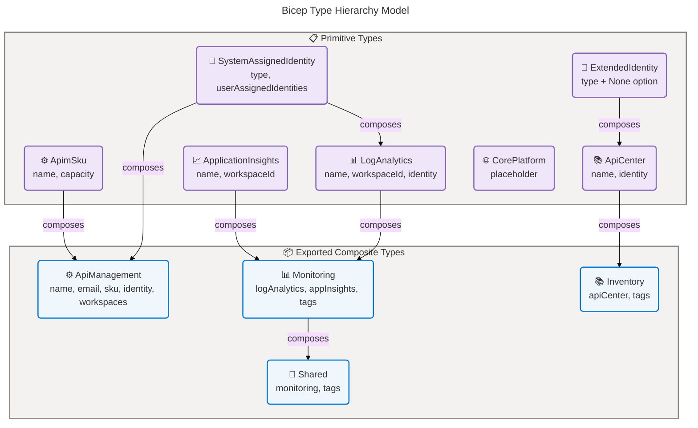
```mermaid
---
title: Bicep Type Hierarchy Model
config:
  theme: base
  look: classic
  layout: dagre
  themeVariables:
    fontSize: "16px"
---
flowchart TB
    accTitle: Bicep Type Hierarchy Model
    accDescr: Shows the hierarchical relationships between the 10 Bicep type definitions and 4 exported composite types with their composition patterns

    %% ═══════════════════════════════════════════════════════════════════════════
    %% AZURE / FLUENT ARCHITECTURE PATTERN v1.1
    %% (Semantic + Structural + Font + Accessibility Governance)
    %% ═══════════════════════════════════════════════════════════════════════════
    %% PHASE 1 - FLUENT UI: All styling uses approved Fluent UI palette only
    %% PHASE 2 - GROUPS: Every subgraph has semantic color via style directive
    %% PHASE 3 - COMPONENTS: Every node has semantic classDef + icon prefix
    %% PHASE 4 - ACCESSIBILITY: accTitle/accDescr present, WCAG AA contrast
    %% PHASE 5 - STANDARD: Governance block present, classDefs centralized
    %% ═══════════════════════════════════════════════════════════════════════════

    subgraph primitiveTypes["📋 Primitive Types"]
        sysId("🔑 SystemAssignedIdentity<br>type, userAssignedIdentities"):::data
        extId("🔑 ExtendedIdentity<br>type + None option"):::data
        apimSku("⚙️ ApimSku<br>name, capacity"):::data
        logAn("📊 LogAnalytics<br>name, workspaceId, identity"):::data
        appIns("📈 ApplicationInsights<br>name, workspaceId"):::data
        apiCtr("📚 ApiCenter<br>name, identity"):::data
        corePlat("🌐 CorePlatform<br>placeholder"):::data
    end

    subgraph compositeTypes["📦 Exported Composite Types"]
        apimType("⚙️ ApiManagement<br>name, email, sku, identity, workspaces"):::core
        invType("📚 Inventory<br>apiCenter, tags"):::core
        monType("📊 Monitoring<br>logAnalytics, appInsights, tags"):::core
        sharedType("🔧 Shared<br>monitoring, tags"):::core
    end

    apimSku -->|"composes"| apimType
    sysId -->|"composes"| apimType
    logAn -->|"composes"| monType
    appIns -->|"composes"| monType
    sysId -->|"composes"| logAn
    extId -->|"composes"| apiCtr
    apiCtr -->|"composes"| invType
    monType -->|"composes"| sharedType

    classDef core fill:#EFF6FC,stroke:#0078D4,stroke-width:2px,color:#323130
    classDef data fill:#F0E6FA,stroke:#8764B8,stroke-width:2px,color:#323130

    style primitiveTypes fill:#F3F2F1,stroke:#8A8886,stroke-width:2px,color:#323130
    style compositeTypes fill:#F3F2F1,stroke:#8A8886,stroke-width:2px,color:#323130
```

### Schema Evolution Timeline

```mermaid
---
title: Schema Evolution Timeline
config:
  theme: base
  look: classic
  layout: dagre
  themeVariables:
    fontSize: "16px"
---
flowchart LR
    accTitle: Schema Evolution Timeline
    accDescr: Shows the schema evolution stages from initial type definitions through export pattern adoption to current state with version tracking via TemplateVersion tag

    %% ═══════════════════════════════════════════════════════════════════════════
    %% AZURE / FLUENT ARCHITECTURE PATTERN v1.1
    %% (Semantic + Structural + Font + Accessibility Governance)
    %% ═══════════════════════════════════════════════════════════════════════════
    %% PHASE 1 - FLUENT UI: All styling uses approved Fluent UI palette only
    %% PHASE 2 - GROUPS: Every subgraph has semantic color via style directive
    %% PHASE 3 - COMPONENTS: Every node has semantic classDef + icon prefix
    %% PHASE 4 - ACCESSIBILITY: accTitle/accDescr present, WCAG AA contrast
    %% PHASE 5 - STANDARD: Governance block present, classDefs centralized
    %% ═══════════════════════════════════════════════════════════════════════════

    subgraph phase1["🛠️ Phase 1 — Foundation"]
        p1a("📋 Define 10 primitive types<br>common-types.bicep"):::data
        p1b("📦 Create constants<br>constants.bicep"):::data
    end

    subgraph phase2["📤 Phase 2 — Export Pattern"]
        p2a("📤 Export 4 composite types<br>@export() decorators"):::core
        p2b("🔄 Import across modules<br>import {} syntax"):::core
    end

    subgraph phase3["⚙️ Phase 3 — Current State"]
        p3a("🏷️ Version tracking<br>TemplateVersion: 2.0.0"):::success
        p3b("⚠️ Gap: No schema registry<br>No formal versioning"):::warning
    end

    subgraph phase4["🚀 Phase 4 — Target State"]
        p4a("📚 Schema registry<br>Centralized schema management"):::neutral
        p4b("🔄 Automated validation<br>CI/CD schema checks"):::neutral
    end

    p1a -->|"evolves to"| p2a
    p1b -->|"supports"| p2b
    p2a -->|"tracked by"| p3a
    p2b -->|"reveals"| p3b
    p3a -->|"target"| p4a
    p3b -->|"requires"| p4b

    classDef core fill:#EFF6FC,stroke:#0078D4,stroke-width:2px,color:#323130
    classDef data fill:#F0E6FA,stroke:#8764B8,stroke-width:2px,color:#323130
    classDef success fill:#DFF6DD,stroke:#107C10,stroke-width:2px,color:#323130
    classDef warning fill:#FFF4CE,stroke:#FFB900,stroke-width:2px,color:#323130
    classDef neutral fill:#FAFAFA,stroke:#8A8886,stroke-width:2px,color:#323130

    style phase1 fill:#F3F2F1,stroke:#8A8886,stroke-width:2px,color:#323130
    style phase2 fill:#F3F2F1,stroke:#8A8886,stroke-width:2px,color:#323130
    style phase3 fill:#F3F2F1,stroke:#8A8886,stroke-width:2px,color:#323130
    style phase4 fill:#F3F2F1,stroke:#8A8886,stroke-width:2px,color:#323130
```

### Data Contract Maps

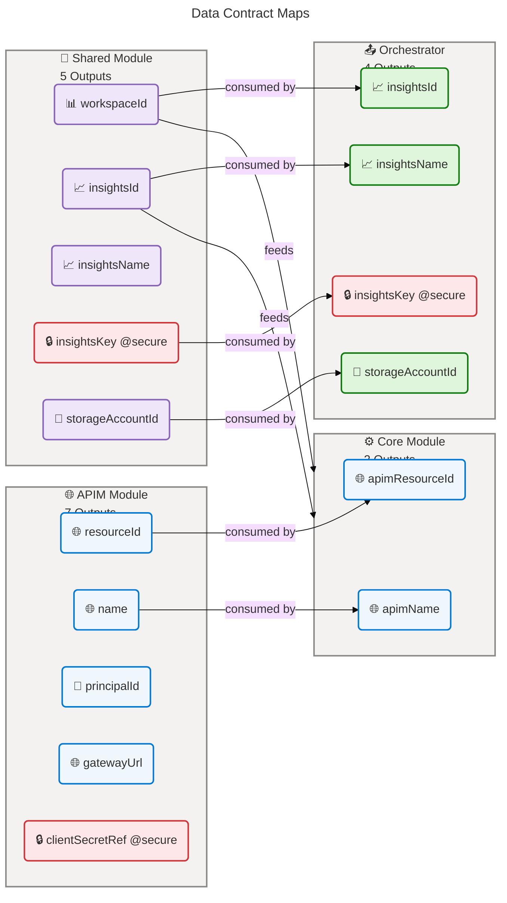
```mermaid
---
title: Data Contract Maps
config:
  theme: base
  look: classic
  layout: dagre
  themeVariables:
    fontSize: "16px"
---
flowchart LR
    accTitle: Data Contract Maps
    accDescr: Shows the module output contract relationships between shared, core, inventory, and orchestrator modules with their typed output specifications

    %% ═══════════════════════════════════════════════════════════════════════════
    %% AZURE / FLUENT ARCHITECTURE PATTERN v1.1
    %% (Semantic + Structural + Font + Accessibility Governance)
    %% ═══════════════════════════════════════════════════════════════════════════
    %% PHASE 1 - FLUENT UI: All styling uses approved Fluent UI palette only
    %% PHASE 2 - GROUPS: Every subgraph has semantic color via style directive
    %% PHASE 3 - COMPONENTS: Every node has semantic classDef + icon prefix
    %% PHASE 4 - ACCESSIBILITY: accTitle/accDescr present, WCAG AA contrast
    %% PHASE 5 - STANDARD: Governance block present, classDefs centralized
    %% ═══════════════════════════════════════════════════════════════════════════

    subgraph sharedContract["🔧 Shared Module<br>5 Outputs"]
        shOut1("📊 workspaceId"):::data
        shOut2("📈 insightsId"):::data
        shOut3("📈 insightsName"):::data
        shOut4("🔒 insightsKey @secure"):::danger
        shOut5("💾 storageAccountId"):::data
    end

    subgraph coreContract["⚙️ Core Module<br>2 Outputs"]
        coOut1("🌐 apimResourceId"):::core
        coOut2("🌐 apimName"):::core
    end

    subgraph apimContract["🌐 APIM Module<br>7 Outputs"]
        apimOut1("🌐 resourceId"):::core
        apimOut2("🌐 name"):::core
        apimOut3("🔑 principalId"):::core
        apimOut4("🌐 gatewayUrl"):::core
        apimOut5("🔒 clientSecretRef @secure"):::danger
    end

    subgraph orchContract["📤 Orchestrator<br>4 Outputs"]
        orchOut1("📈 insightsId"):::success
        orchOut2("📈 insightsName"):::success
        orchOut3("🔒 insightsKey @secure"):::danger
        orchOut4("💾 storageAccountId"):::success
    end

    shOut1 -->|"consumed by"| orchOut1
    shOut2 -->|"consumed by"| orchOut2
    shOut4 -->|"consumed by"| orchOut3
    shOut5 -->|"consumed by"| orchOut4
    shOut1 -->|"feeds"| coreContract
    shOut2 -->|"feeds"| coreContract
    apimOut1 -->|"consumed by"| coOut1
    apimOut2 -->|"consumed by"| coOut2

    classDef core fill:#EFF6FC,stroke:#0078D4,stroke-width:2px,color:#323130
    classDef data fill:#F0E6FA,stroke:#8764B8,stroke-width:2px,color:#323130
    classDef success fill:#DFF6DD,stroke:#107C10,stroke-width:2px,color:#323130
    classDef danger fill:#FDE7E9,stroke:#D13438,stroke-width:2px,color:#323130

    style sharedContract fill:#F3F2F1,stroke:#8A8886,stroke-width:2px,color:#323130
    style coreContract fill:#F3F2F1,stroke:#8A8886,stroke-width:2px,color:#323130
    style apimContract fill:#F3F2F1,stroke:#8A8886,stroke-width:2px,color:#323130
    style orchContract fill:#F3F2F1,stroke:#8A8886,stroke-width:2px,color:#323130
```

### Summary

The Component Catalog documents 93 data assets across all 11 canonical data component types. The distribution reveals strong coverage in Data Governance (15 components), Data Entities (10), Data Quality Rules (10), Data Transformations (10), and Data Contracts (10). The dominant storage pattern is Document Store (Bicep/YAML configuration files), with Data Warehouse patterns for monitoring services (Log Analytics, App Insights). Classification shows predominantly Internal data with Confidential markings for security-sensitive outputs and PII for contact information in governance tags.

Key risks include the concentration of security-critical data in output chains (instrumentation keys, client secrets) and the reliance on a single YAML configuration file as the source of truth for all deployment parameters. Recommendations include implementing Key Vault integration for all sensitive outputs, introducing schema versioning for the YAML configuration, and establishing automated data quality gates in CI/CD pipelines.

---

## Section 8: Dependencies & Integration

### Overview

The APIM Accelerator data architecture follows a hierarchical dependency model where configuration data flows from a centralized YAML source through Bicep orchestration modules into Azure resource deployments. The integration architecture is built on three primary patterns: parameter passing (Bicep module inputs/outputs), resource references (existing resource declarations), and Azure-native service integration (diagnostic settings, API source sync).

Data dependencies are structured as a directed acyclic graph (DAG) enforced by Bicep's deployment sequencing. The shared monitoring infrastructure must deploy first, followed by the core APIM platform (which depends on monitoring outputs), and finally the inventory management layer (which depends on APIM outputs). This sequencing ensures all required data stores and service endpoints are available before dependent components attempt to reference them.

The integration patterns are predominantly configuration-driven (batch) with monitoring telemetry providing the only real-time data flows. Cross-layer dependencies are managed through module output contracts, where each module exposes strongly-typed outputs consumed by downstream modules.

### Data Flow Patterns

```mermaid
---
title: Data Dependencies and Integration Flows
config:
  theme: base
  look: classic
  layout: dagre
  themeVariables:
    fontSize: "16px"
---
flowchart LR
    accTitle: Data Dependencies and Integration Flows
    accDescr: Shows the data flow patterns between configuration sources, deployment modules, and Azure services including parameter chains, monitoring telemetry, and API discovery integration

    %% ═══════════════════════════════════════════════════════════════════════════
    %% AZURE / FLUENT ARCHITECTURE PATTERN v1.1
    %% (Semantic + Structural + Font + Accessibility Governance)
    %% ═══════════════════════════════════════════════════════════════════════════
    %% PHASE 1 - FLUENT UI: All styling uses approved Fluent UI palette only
    %% PHASE 2 - GROUPS: Every subgraph has semantic color via style directive
    %% PHASE 3 - COMPONENTS: Every node has semantic classDef + icon prefix
    %% PHASE 4 - ACCESSIBILITY: accTitle/accDescr present, WCAG AA contrast
    %% PHASE 5 - STANDARD: Governance block present, classDefs centralized
    %% ═══════════════════════════════════════════════════════════════════════════

    subgraph config["📂 Configuration"]
        settingsYaml("📄 settings.yaml"):::data
        commonTypes("📋 common-types.bicep"):::data
        constants("📦 constants.bicep"):::data
    end

    subgraph deploy["⚙️ Deployment Chain"]
        orchMain("🔧 infra/main.bicep"):::core
        sharedDeploy("🔧 shared/main.bicep"):::core
        coreDeploy("🔧 core/main.bicep"):::core
        invDeploy("🔧 inventory/main.bicep"):::core
    end

    subgraph services["🌐 Azure Services"]
        logAnalytics("📊 Log Analytics"):::success
        appInsights("📈 App Insights"):::success
        storageSvc("💾 Storage Account"):::data
        apimService("🌐 APIM Gateway"):::core
        apiCenter("📚 API Center"):::core
        devPortal("👤 Developer Portal"):::neutral
    end

    settingsYaml -->|"loadYamlContent()"| orchMain
    commonTypes -->|"import types"| sharedDeploy
    commonTypes -->|"import types"| coreDeploy
    commonTypes -->|"import types"| invDeploy
    constants -->|"import functions"| sharedDeploy
    constants -->|"import functions"| coreDeploy

    orchMain -->|"params + tags"| sharedDeploy
    orchMain -->|"params + monitoring IDs"| coreDeploy
    orchMain -->|"params + APIM refs"| invDeploy

    sharedDeploy -->|"provisions"| logAnalytics
    sharedDeploy -->|"provisions"| appInsights
    sharedDeploy -->|"provisions"| storageSvc
    coreDeploy -->|"provisions"| apimService
    coreDeploy -->|"provisions"| devPortal
    invDeploy -->|"provisions"| apiCenter

    apimService -->|"diagnostics"| logAnalytics
    apimService -->|"telemetry"| appInsights
    apimService -->|"log archival"| storageSvc
    apiCenter -->|"API sync"| apimService

    classDef core fill:#EFF6FC,stroke:#0078D4,stroke-width:2px,color:#323130
    classDef data fill:#F0E6FA,stroke:#8764B8,stroke-width:2px,color:#323130
    classDef success fill:#DFF6DD,stroke:#107C10,stroke-width:2px,color:#323130
    classDef neutral fill:#FAFAFA,stroke:#8A8886,stroke-width:2px,color:#323130

    style config fill:#F3F2F1,stroke:#8A8886,stroke-width:2px,color:#323130
    style deploy fill:#F3F2F1,stroke:#8A8886,stroke-width:2px,color:#323130
    style services fill:#F3F2F1,stroke:#8A8886,stroke-width:2px,color:#323130
```

### Producer-Consumer Relationships

| Producer          | Consumer             | Data                          | Flow Type | Contract            |
| ----------------- | -------------------- | ----------------------------- | --------- | ------------------- |
| settings.yaml     | infra/main.bicep     | Solution config               | Batch     | YAML schema         |
| infra/main.bicep  | shared/main.bicep    | Shared settings, tags         | Batch     | Shared type         |
| infra/main.bicep  | core/main.bicep      | APIM settings, monitoring IDs | Batch     | Module params       |
| infra/main.bicep  | inventory/main.bicep | Inventory settings, APIM refs | Batch     | Module params       |
| shared/main.bicep | infra/main.bicep     | 5 monitoring outputs          | Batch     | Output contract     |
| core/main.bicep   | infra/main.bicep     | APIM ID and name              | Batch     | Output contract     |
| APIM Service      | Log Analytics        | Diagnostic logs and metrics   | Real-time | Diagnostic settings |
| APIM Service      | App Insights         | Performance telemetry         | Real-time | Logger integration  |
| APIM Service      | API Center           | API definitions               | Batch     | API source sync     |
| Azure AD          | Developer Portal     | Auth tokens                   | Real-time | OAuth2/MSAL-2       |

### ETL/ELT Flow Diagram

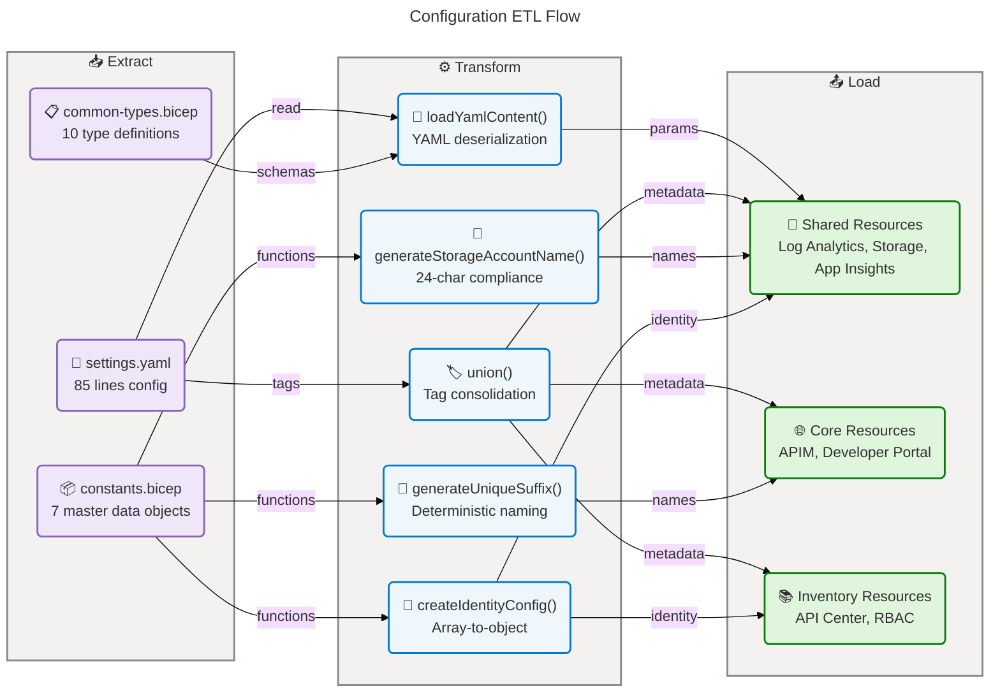
```mermaid
---
title: Configuration ETL Flow
config:
  theme: base
  look: classic
  layout: dagre
  themeVariables:
    fontSize: "16px"
---
flowchart LR
    accTitle: Configuration ETL Flow
    accDescr: Shows the extract-transform-load pattern for configuration data flowing from YAML source through Bicep processing functions to Azure resource deployment targets

    %% ═══════════════════════════════════════════════════════════════════════════
    %% AZURE / FLUENT ARCHITECTURE PATTERN v1.1
    %% (Semantic + Structural + Font + Accessibility Governance)
    %% ═══════════════════════════════════════════════════════════════════════════
    %% PHASE 1 - FLUENT UI: All styling uses approved Fluent UI palette only
    %% PHASE 2 - GROUPS: Every subgraph has semantic color via style directive
    %% PHASE 3 - COMPONENTS: Every node has semantic classDef + icon prefix
    %% PHASE 4 - ACCESSIBILITY: accTitle/accDescr present, WCAG AA contrast
    %% PHASE 5 - STANDARD: Governance block present, classDefs centralized
    %% ═══════════════════════════════════════════════════════════════════════════

    subgraph extract["📥 Extract"]
        yamlSrc("📄 settings.yaml<br>85 lines config"):::data
        typesSrc("📋 common-types.bicep<br>10 type definitions"):::data
        constsSrc("📦 constants.bicep<br>7 master data objects"):::data
    end

    subgraph transform["⚙️ Transform"]
        loadYaml("🔄 loadYamlContent()<br>YAML deserialization"):::core
        tagUnion("🏷️ union()<br>Tag consolidation"):::core
        genSuffix("🔢 generateUniqueSuffix()<br>Deterministic naming"):::core
        genStorage("💾 generateStorageAccountName()<br>24-char compliance"):::core
        identityXform("🔑 createIdentityConfig()<br>Array-to-object"):::core
    end

    subgraph load["📤 Load"]
        sharedRes("🔧 Shared Resources<br>Log Analytics, Storage, App Insights"):::success
        coreRes("🌐 Core Resources<br>APIM, Developer Portal"):::success
        invRes("📚 Inventory Resources<br>API Center, RBAC"):::success
    end

    yamlSrc -->|"read"| loadYaml
    yamlSrc -->|"tags"| tagUnion
    constsSrc -->|"functions"| genSuffix
    constsSrc -->|"functions"| genStorage
    constsSrc -->|"functions"| identityXform
    typesSrc -->|"schemas"| loadYaml
    loadYaml -->|"params"| sharedRes
    tagUnion -->|"metadata"| sharedRes
    tagUnion -->|"metadata"| coreRes
    tagUnion -->|"metadata"| invRes
    genSuffix -->|"names"| coreRes
    genStorage -->|"names"| sharedRes
    identityXform -->|"identity"| sharedRes
    identityXform -->|"identity"| invRes

    classDef core fill:#EFF6FC,stroke:#0078D4,stroke-width:2px,color:#323130
    classDef data fill:#F0E6FA,stroke:#8764B8,stroke-width:2px,color:#323130
    classDef success fill:#DFF6DD,stroke:#107C10,stroke-width:2px,color:#323130

    style extract fill:#F3F2F1,stroke:#8A8886,stroke-width:2px,color:#323130
    style transform fill:#F3F2F1,stroke:#8A8886,stroke-width:2px,color:#323130
    style load fill:#F3F2F1,stroke:#8A8886,stroke-width:2px,color:#323130
```

### Producer-Consumer Matrix

```mermaid
---
title: Producer-Consumer Matrix
config:
  theme: base
  look: classic
  layout: dagre
  themeVariables:
    fontSize: "16px"
---
flowchart TB
    accTitle: Producer-Consumer Matrix
    accDescr: Shows the producer-consumer relationships between all data-producing and data-consuming components in the APIM Accelerator deployment pipeline

    %% ═══════════════════════════════════════════════════════════════════════════
    %% AZURE / FLUENT ARCHITECTURE PATTERN v1.1
    %% (Semantic + Structural + Font + Accessibility Governance)
    %% ═══════════════════════════════════════════════════════════════════════════
    %% PHASE 1 - FLUENT UI: All styling uses approved Fluent UI palette only
    %% PHASE 2 - GROUPS: Every subgraph has semantic color via style directive
    %% PHASE 3 - COMPONENTS: Every node has semantic classDef + icon prefix
    %% PHASE 4 - ACCESSIBILITY: accTitle/accDescr present, WCAG AA contrast
    %% PHASE 5 - STANDARD: Governance block present, classDefs centralized
    %% ═══════════════════════════════════════════════════════════════════════════

    subgraph producers["📤 Producers"]
        pYaml("📄 settings.yaml"):::data
        pTypes("📋 common-types.bicep"):::data
        pConsts("📦 constants.bicep"):::data
        pApim("🌐 APIM Service"):::core
        pAad("🔐 Azure AD"):::danger
    end

    subgraph consumers["📥 Consumers"]
        cOrch("🔧 infra/main.bicep"):::core
        cShared("🔧 shared/main.bicep"):::core
        cCore("🔧 core/main.bicep"):::core
        cInv("🔧 inventory/main.bicep"):::core
        cLogAn("📊 Log Analytics"):::success
        cAppIns("📈 App Insights"):::success
        cApiCtr("📚 API Center"):::core
        cPortal("👤 Developer Portal"):::core
    end

    pYaml -->|"config"| cOrch
    pTypes -->|"types"| cShared
    pTypes -->|"types"| cCore
    pTypes -->|"types"| cInv
    pConsts -->|"functions"| cShared
    pConsts -->|"functions"| cCore
    pApim -->|"diagnostics"| cLogAn
    pApim -->|"telemetry"| cAppIns
    pApim -->|"API defs"| cApiCtr
    pAad -->|"auth tokens"| cPortal

    classDef core fill:#EFF6FC,stroke:#0078D4,stroke-width:2px,color:#323130
    classDef data fill:#F0E6FA,stroke:#8764B8,stroke-width:2px,color:#323130
    classDef success fill:#DFF6DD,stroke:#107C10,stroke-width:2px,color:#323130
    classDef danger fill:#FDE7E9,stroke:#D13438,stroke-width:2px,color:#323130

    style producers fill:#F3F2F1,stroke:#8A8886,stroke-width:2px,color:#323130
    style consumers fill:#F3F2F1,stroke:#8A8886,stroke-width:2px,color:#323130
```

### Configuration Change Propagation

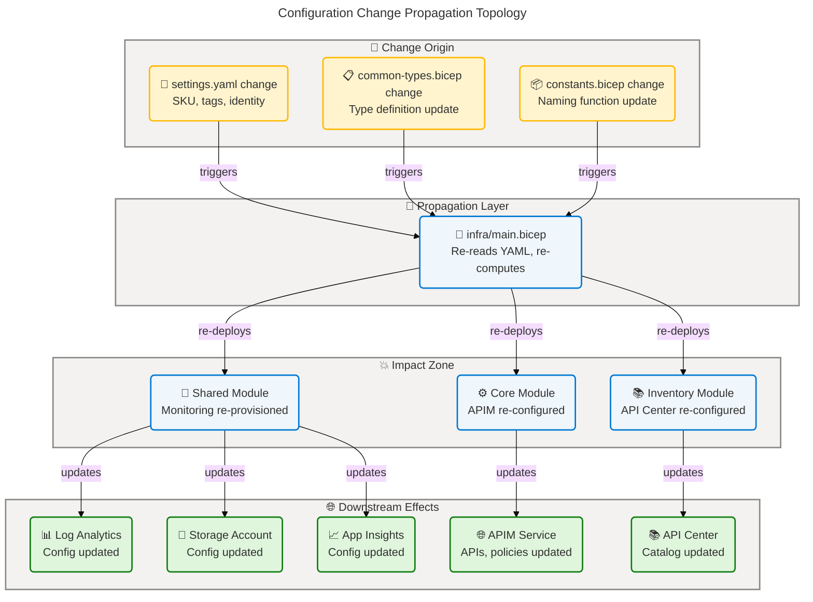
```mermaid
---
title: Configuration Change Propagation Topology
config:
  theme: base
  look: classic
  layout: dagre
  themeVariables:
    fontSize: "16px"
---
flowchart TB
    accTitle: Configuration Change Propagation Topology
    accDescr: Shows how configuration changes in settings.yaml and type definitions propagate through the deployment chain to all downstream Azure resources and monitoring systems

    %% ═══════════════════════════════════════════════════════════════════════════
    %% AZURE / FLUENT ARCHITECTURE PATTERN v1.1
    %% (Semantic + Structural + Font + Accessibility Governance)
    %% ═══════════════════════════════════════════════════════════════════════════
    %% PHASE 1 - FLUENT UI: All styling uses approved Fluent UI palette only
    %% PHASE 2 - GROUPS: Every subgraph has semantic color via style directive
    %% PHASE 3 - COMPONENTS: Every node has semantic classDef + icon prefix
    %% PHASE 4 - ACCESSIBILITY: accTitle/accDescr present, WCAG AA contrast
    %% PHASE 5 - STANDARD: Governance block present, classDefs centralized
    %% ═══════════════════════════════════════════════════════════════════════════

    subgraph changeOrigin["📝 Change Origin"]
        yamlChange("📄 settings.yaml change<br>SKU, tags, identity"):::warning
        typeChange("📋 common-types.bicep change<br>Type definition update"):::warning
        constChange("📦 constants.bicep change<br>Naming function update"):::warning
    end

    subgraph propagation["🔄 Propagation Layer"]
        orchProp("🔧 infra/main.bicep<br>Re-reads YAML, re-computes"):::core
    end

    subgraph impactZone["💥 Impact Zone"]
        sharedImpact("🔧 Shared Module<br>Monitoring re-provisioned"):::core
        coreImpact("⚙️ Core Module<br>APIM re-configured"):::core
        invImpact("📚 Inventory Module<br>API Center re-configured"):::core
    end

    subgraph downstream["🌐 Downstream Effects"]
        logAnEffect("📊 Log Analytics<br>Config updated"):::success
        storageEffect("💾 Storage Account<br>Config updated"):::success
        appInsEffect("📈 App Insights<br>Config updated"):::success
        apimEffect("🌐 APIM Service<br>APIs, policies updated"):::success
        apiCtrEffect("📚 API Center<br>Catalog updated"):::success
    end

    yamlChange -->|"triggers"| orchProp
    typeChange -->|"triggers"| orchProp
    constChange -->|"triggers"| orchProp
    orchProp -->|"re-deploys"| sharedImpact
    orchProp -->|"re-deploys"| coreImpact
    orchProp -->|"re-deploys"| invImpact
    sharedImpact -->|"updates"| logAnEffect
    sharedImpact -->|"updates"| storageEffect
    sharedImpact -->|"updates"| appInsEffect
    coreImpact -->|"updates"| apimEffect
    invImpact -->|"updates"| apiCtrEffect

    classDef core fill:#EFF6FC,stroke:#0078D4,stroke-width:2px,color:#323130
    classDef data fill:#F0E6FA,stroke:#8764B8,stroke-width:2px,color:#323130
    classDef success fill:#DFF6DD,stroke:#107C10,stroke-width:2px,color:#323130
    classDef warning fill:#FFF4CE,stroke:#FFB900,stroke-width:2px,color:#323130

    style changeOrigin fill:#F3F2F1,stroke:#8A8886,stroke-width:2px,color:#323130
    style propagation fill:#F3F2F1,stroke:#8A8886,stroke-width:2px,color:#323130
    style impactZone fill:#F3F2F1,stroke:#8A8886,stroke-width:2px,color:#323130
    style downstream fill:#F3F2F1,stroke:#8A8886,stroke-width:2px,color:#323130
```

### Summary

The integration architecture demonstrates a clean DAG-based dependency model with three deployment tiers: shared infrastructure (monitoring), core platform (APIM), and inventory management (API Center). Data flows are predominantly configuration-driven (batch) with real-time monitoring telemetry providing observability. All cross-module dependencies are managed through strongly-typed output contracts, ensuring compile-time validation of integration points. Key integration risks include the tight coupling between monitoring outputs and core platform parameters, and the absence of retry/resilience patterns for the API Center-to-APIM synchronization flow. Recommendations include implementing health checks for cross-service integrations and documenting data lineage for monitoring telemetry flows.

---
