# Architecture Overview

The Azure API Management Accelerator follows Azure Landing Zone design principles to provide a secure, scalable, and maintainable API management platform.

## 🏗️ High-Level Architecture

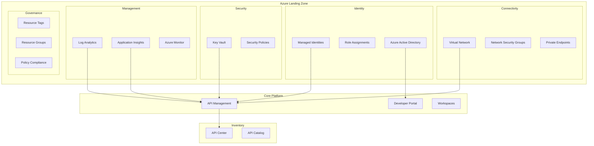

## 🎯 Design Principles

### Landing Zone Alignment
This accelerator implements all five Azure Landing Zone design areas:

| Design Area | Implementation | Benefits |
|-------------|----------------|----------|
| **Identity & Access** | Managed identities, RBAC | Secure, credential-free access |
| **Network Topology** | VNet integration, private endpoints | Network isolation and security |
| **Security** | Key Vault, NSGs, monitoring | Defense in depth |
| **Management** | Centralized logging and monitoring | Operational excellence |
| **Governance** | Resource tagging, policy compliance | Cost management and compliance |

### Core Principles

#### 1. **Security by Default**
- All communications encrypted in transit
- Managed identities eliminate stored credentials
- Least-privilege access controls
- Network segmentation and isolation

#### 2. **Operational Excellence**
- Comprehensive logging and monitoring
- Automated diagnostics and alerting
- Infrastructure as Code (IaC)
- Consistent deployment patterns

#### 3. **Scalability & Performance**
- Horizontal scaling capabilities
- Regional deployment options
- Performance monitoring built-in
- Load balancing and traffic management

#### 4. **Cost Optimization**
- Resource right-sizing options
- Efficient monitoring configuration
- Tag-based cost allocation
- Environment-specific scaling

#### 5. **Reliability**
- Multi-zone deployment options
- Backup and disaster recovery ready
- Health monitoring and alerting
- Self-healing capabilities

## 🏢 Component Architecture

### Simplified Resource Group Structure

The accelerator uses a **single resource group** approach for simplified management while maintaining logical component separation through tagging and naming conventions.

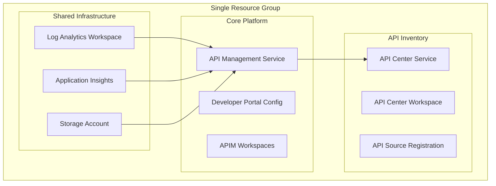

### Resource Organization Benefits
- **Simplified Management**: Single resource group reduces complexity
- **Clear Dependencies**: Resource dependencies are explicit and managed
- **Cost Efficiency**: Reduced resource group overhead
- **Deployment Simplicity**: Single scope for all related resources
- **Component Tagging**: Logical separation through consistent tagging strategy

## 🔧 Technical Architecture

### Shared Infrastructure Layer

#### Connectivity Components
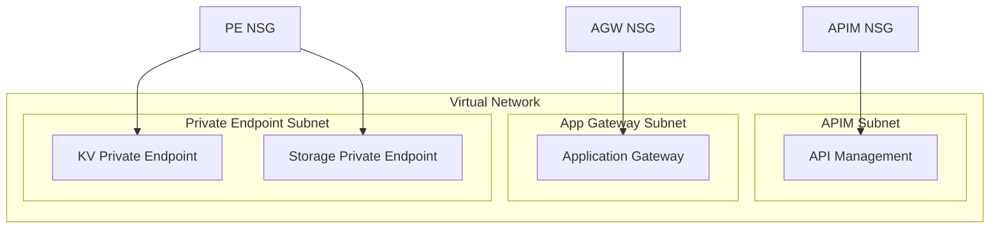

#### Identity & Access Management
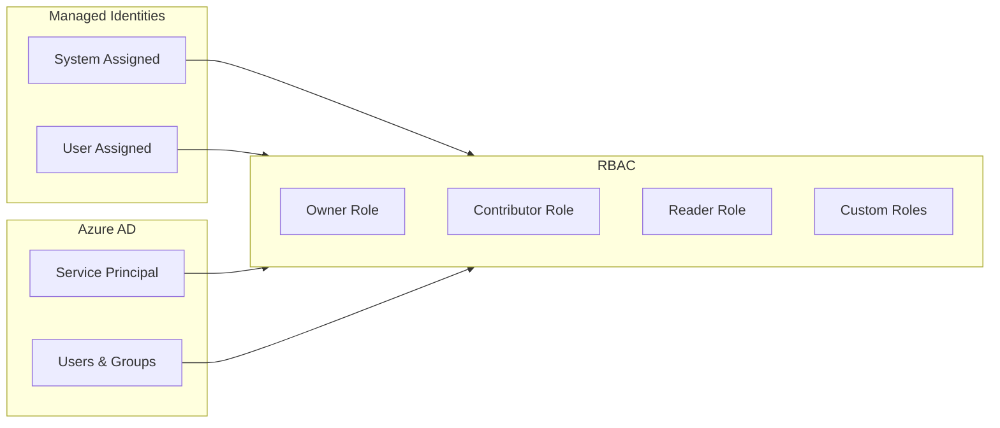

#### Security Layer
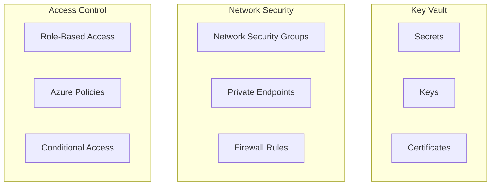

#### Monitoring & Observability
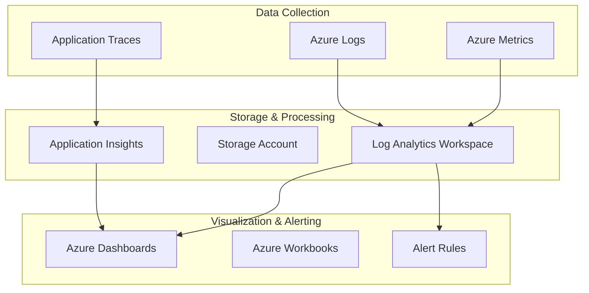

### Core Platform Layer

#### API Management Architecture
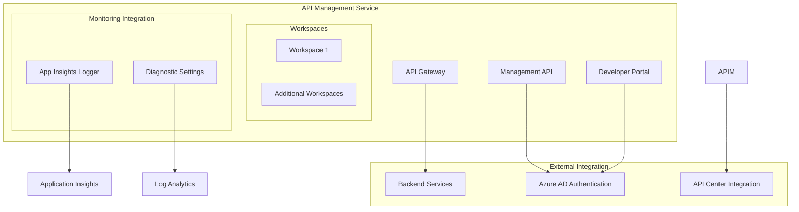

### Inventory Management Layer

#### API Center Integration
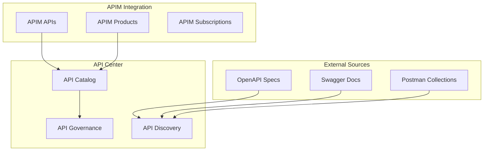

## 🔄 Data Flow Architecture

### Request Flow
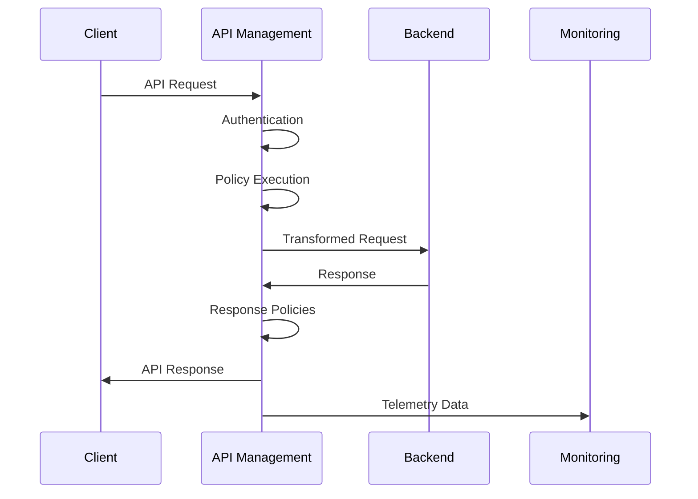

### Monitoring Data Flow
```mermaid
graph LR
    subgraph "Data Sources"
        APIM[API Management]
        KV[Key Vault]
        VNet[Virtual Network]
        NSG[Network Security Groups]
    end
    
    subgraph "Collection"
        Diag[Diagnostic Settings]
        Metrics[Azure Metrics]
    end
    
    subgraph "Storage"
        LA[Log Analytics]
        Storage[Storage Account]
        AI[Application Insights]
    end
    
    subgraph "Consumption"
        Dashboards[Dashboards]
        Alerts[Alerts]
        Reports[Reports]
    end
    
    APIM --> Diag
    KV --> Diag
    VNet --> Diag
    NSG --> Diag
    
    Diag --> LA
    Diag --> Storage
    Metrics --> AI
    
    LA --> Dashboards
    AI --> Dashboards
    LA --> Alerts
    AI --> Alerts
```

## 🚀 Deployment Architecture

### Infrastructure as Code Structure
```
infra/
├── main.bicep                    # Subscription-level orchestration
├── main.parameters.json          # Optional parameters file
├── settings.yaml                 # Centralized configuration
└── azd-hooks/
    └── pre-provision.sh          # Pre-deployment automation

src/
├── shared/                       # Shared infrastructure components
│   ├── main.bicep               # Shared orchestration
│   ├── common-types.bicep       # Bicep type definitions
│   ├── constants.bicep          # Utility functions and constants
│   ├── monitoring/              # Monitoring infrastructure
│   │   ├── main.bicep          # Monitoring orchestration
│   │   ├── operational/
│   │   │   └── main.bicep      # Log Analytics + Storage
│   │   └── insights/
│   │       └── main.bicep      # Application Insights
│   └── networking/              # Network components (placeholder)
│       └── main.bicep
├── core/                         # Core APIM platform
│   ├── main.bicep               # Core platform orchestration
│   ├── apim.bicep               # API Management service
│   ├── developer-portal.bicep   # Developer portal configuration
│   └── workspaces.bicep         # APIM workspace management
└── inventory/                    # API inventory management
    └── main.bicep               # API Center integration
```

### Deployment Flow
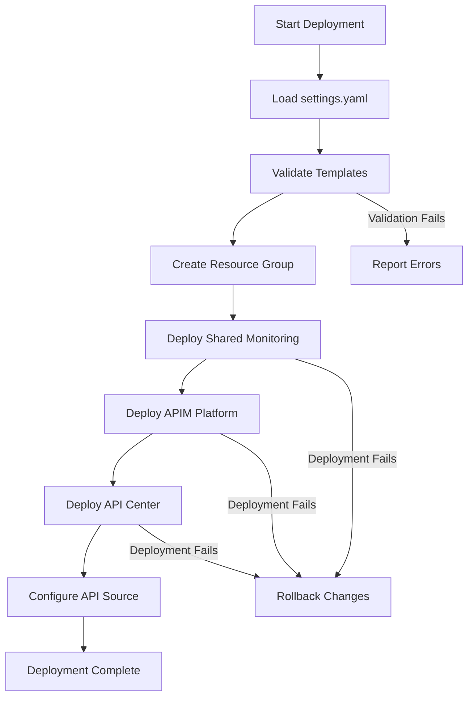

## 🔗 Integration Patterns

### External System Integration
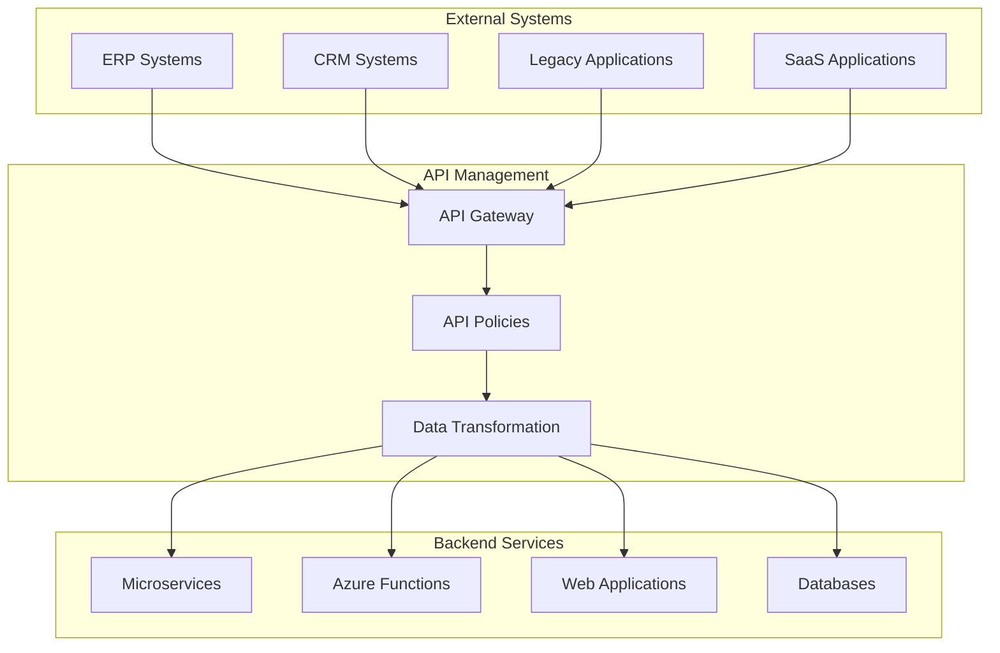

## 📊 Scalability Considerations

### Horizontal Scaling
- **API Management Units**: Scale processing capacity
- **Regional Deployment**: Multi-region for global reach
- **Workspace Isolation**: Separate environments and teams
- **Backend Integration**: Load balancing to backend services

### Vertical Scaling
- **SKU Tiers**: Basic → Standard → Premium
- **Feature Scaling**: Add capabilities as needed
- **Storage Scaling**: Increase log retention and storage
- **Monitoring Scaling**: Enhanced metrics and alerting

## 🎯 Next Steps

To dive deeper into specific architectural components:

- **[Landing Zone Alignment](landing-zones.md)** - Detailed LZ mapping
- **[Component Architecture](components.md)** - Individual component details
- **[Security Model](security.md)** - Security architecture deep dive
- **[Network Design](networking.md)** - Network topology details

---

**Related Documentation:**
- [Getting Started](../getting-started/) - Quick deployment guide
- [Configuration Guide](../user-guide/configuration.md) - Detailed configuration
- [Developer Guide](../developer-guide/) - Customization and extension