# Architecture Overview

The Azure API Management Accelerator follows Azure Landing Zone design principles to provide a secure, scalable, and maintainable API management platform.

## 🏗️ High-Level Architecture

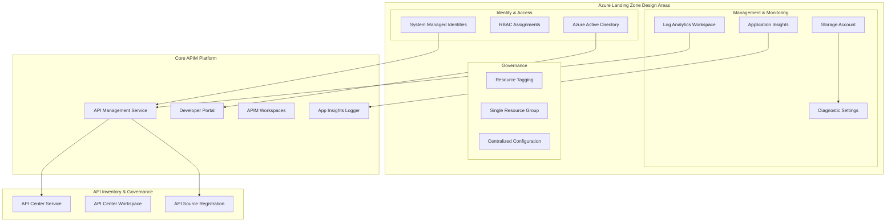

## 🎯 Design Principles

### Landing Zone Alignment
This accelerator implements all five Azure Landing Zone design areas:

| Design Area | Current Implementation | Benefits |
|-------------|----------------------|----------|
| **Identity & Access** | System-assigned managed identities, automated RBAC assignments | Secure, credential-free service authentication |
| **Network Topology** | Public by default, VNet integration configurable | Flexible deployment options (public/private) |
| **Security** | Diagnostic logging, managed identities, HTTPS by default | Defense in depth without complexity |
| **Management** | Log Analytics workspace, Application Insights integration | Comprehensive observability and monitoring |
| **Governance** | Consistent resource tagging, centralized configuration | Cost tracking and operational governance |

### Core Principles

#### 1. **Security by Default**
- All communications encrypted in transit
- Managed identities eliminate stored credentials
- Least-privilege access controls
- Network segmentation and isolation

#### 2. **Operational Excellence**
- Comprehensive logging and monitoring
- Automated diagnostics and alerting
- Infrastructure as Code (IaC)
- Consistent deployment patterns

#### 3. **Scalability & Performance**
- Horizontal scaling capabilities
- Regional deployment options
- Performance monitoring built-in
- Load balancing and traffic management

#### 4. **Cost Optimization**
- Resource right-sizing options
- Efficient monitoring configuration
- Tag-based cost allocation
- Environment-specific scaling

#### 5. **Reliability**
- Multi-zone deployment options
- Backup and disaster recovery ready
- Health monitoring and alerting
- Self-healing capabilities

## 🏢 Component Architecture

### Simplified Resource Group Structure

The accelerator uses a **single resource group** approach for simplified management while maintaining logical component separation through tagging and naming conventions.

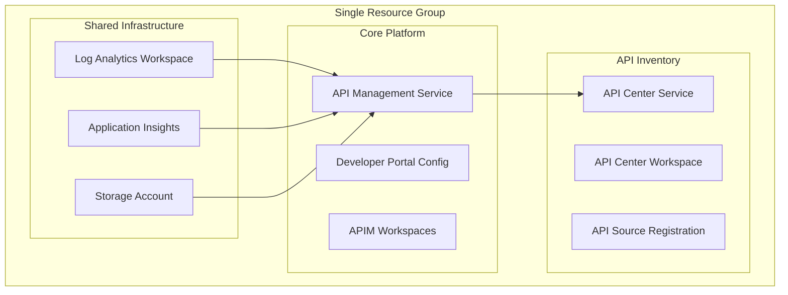

### Resource Organization Benefits
- **Simplified Management**: Single resource group reduces complexity
- **Clear Dependencies**: Resource dependencies are explicit and managed
- **Cost Efficiency**: Reduced resource group overhead
- **Deployment Simplicity**: Single scope for all related resources
- **Component Tagging**: Logical separation through consistent tagging strategy

## 🔧 Technical Architecture

### Shared Infrastructure Layer

#### Connectivity Architecture (Current Implementation)
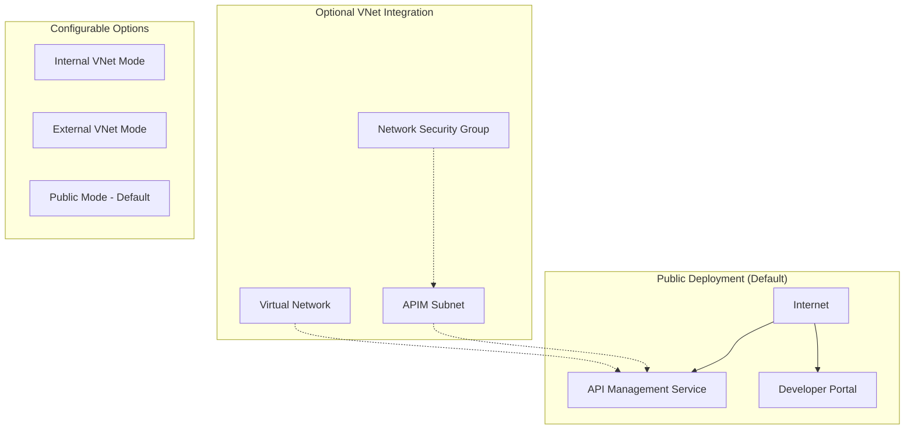

**Note**: Networking components are configurable but not deployed by default. The accelerator supports public deployment (default) with optional VNet integration for private scenarios.

#### Identity & Access Management
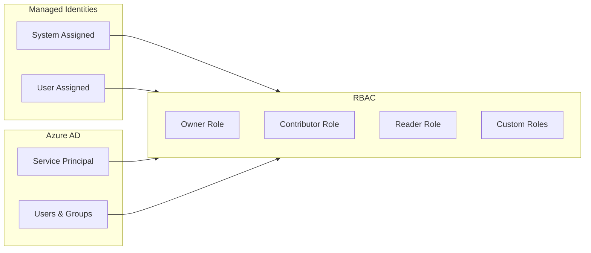

#### Security Architecture (Current Implementation)
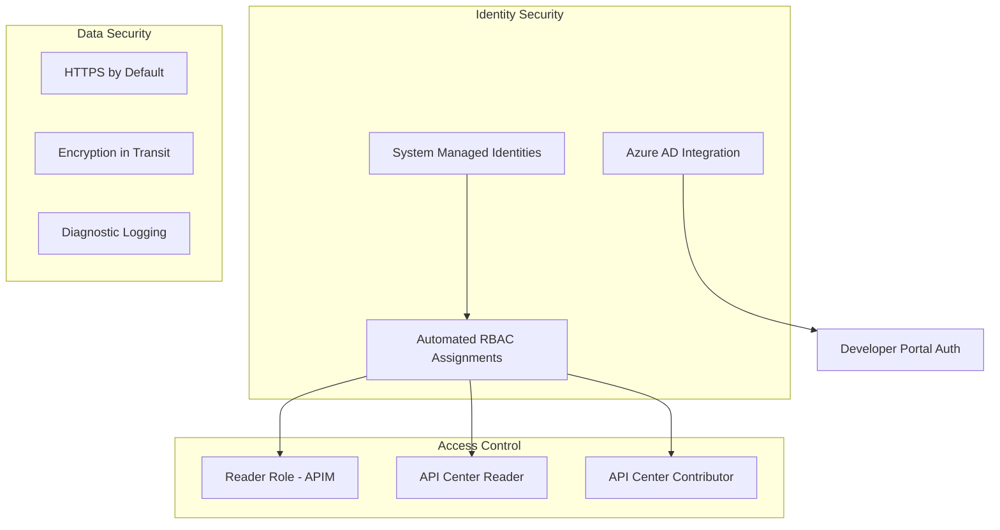

**Security Features**:
- **No Stored Secrets**: All authentication uses managed identities
- **Least Privilege**: Minimal required permissions automatically assigned
- **Comprehensive Logging**: All operations logged to Log Analytics
- **Default Encryption**: HTTPS enforced, data encrypted in transit

#### Monitoring & Observability
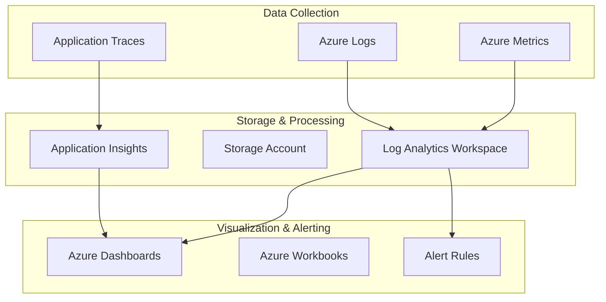

### Core Platform Layer

#### API Management Architecture
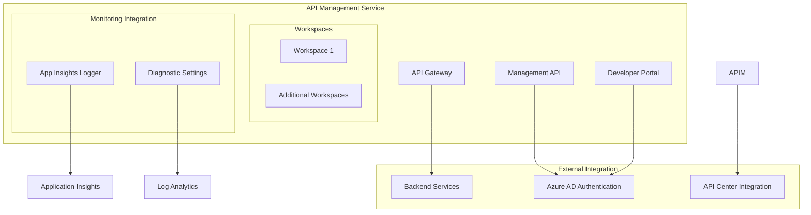

### Inventory Management Layer

#### API Center Integration
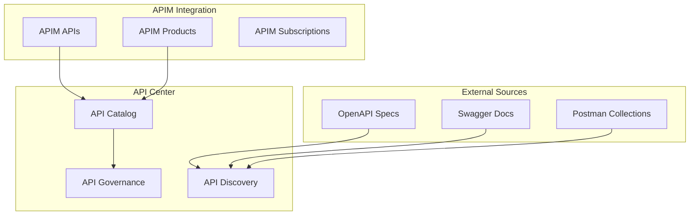

## 🔄 Data Flow Architecture

### Request Flow
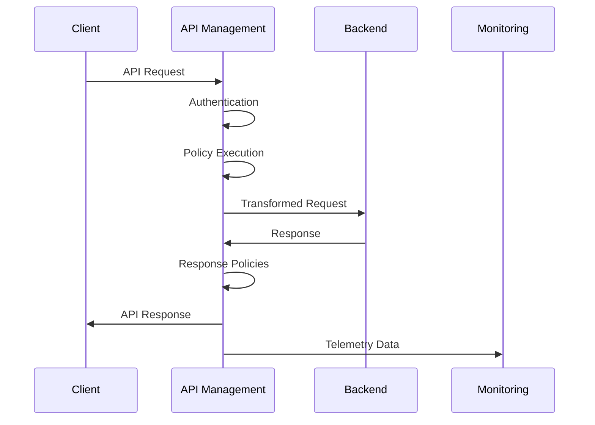

### Monitoring Data Flow (Current Implementation)
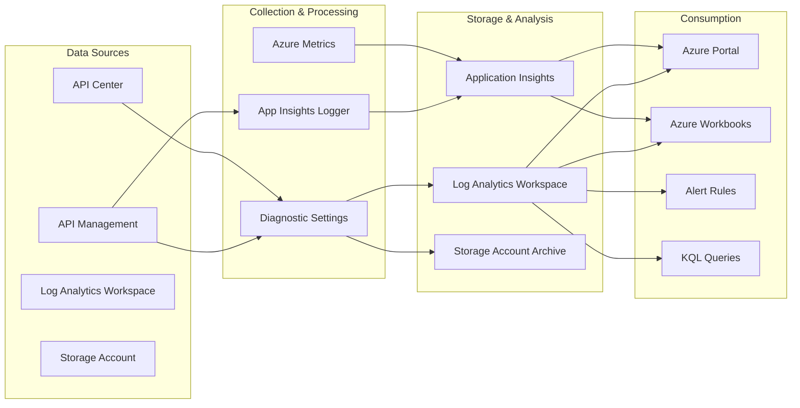

## 🚀 Deployment Architecture

### Infrastructure as Code Structure
```
infra/
├── main.bicep                    # Subscription-level orchestration
├── main.parameters.json          # Optional parameters file
├── settings.yaml                 # Centralized configuration
└── azd-hooks/
    └── pre-provision.sh          # Pre-deployment automation

src/
├── shared/                       # Shared infrastructure components
│   ├── main.bicep               # Shared orchestration
│   ├── common-types.bicep       # Bicep type definitions
│   ├── constants.bicep          # Utility functions and constants
│   ├── monitoring/              # Monitoring infrastructure
│   │   ├── main.bicep          # Monitoring orchestration
│   │   ├── operational/
│   │   │   └── main.bicep      # Log Analytics + Storage
│   │   └── insights/
│   │       └── main.bicep      # Application Insights
│   └── networking/              # Network components (placeholder)
│       └── main.bicep
├── core/                         # Core APIM platform
│   ├── main.bicep               # Core platform orchestration
│   ├── apim.bicep               # API Management service
│   ├── developer-portal.bicep   # Developer portal configuration
│   └── workspaces.bicep         # APIM workspace management
└── inventory/                    # API inventory management
    └── main.bicep               # API Center integration
```

### Deployment Flow
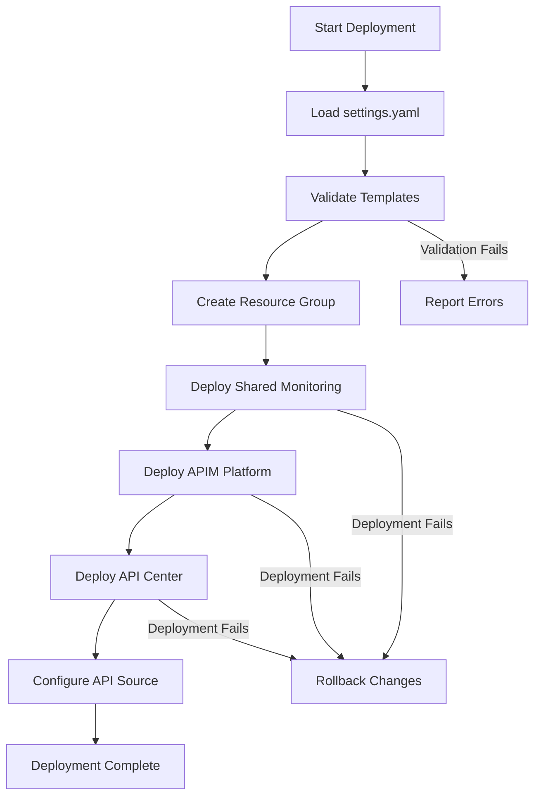

## 🔗 Integration Patterns

### External System Integration
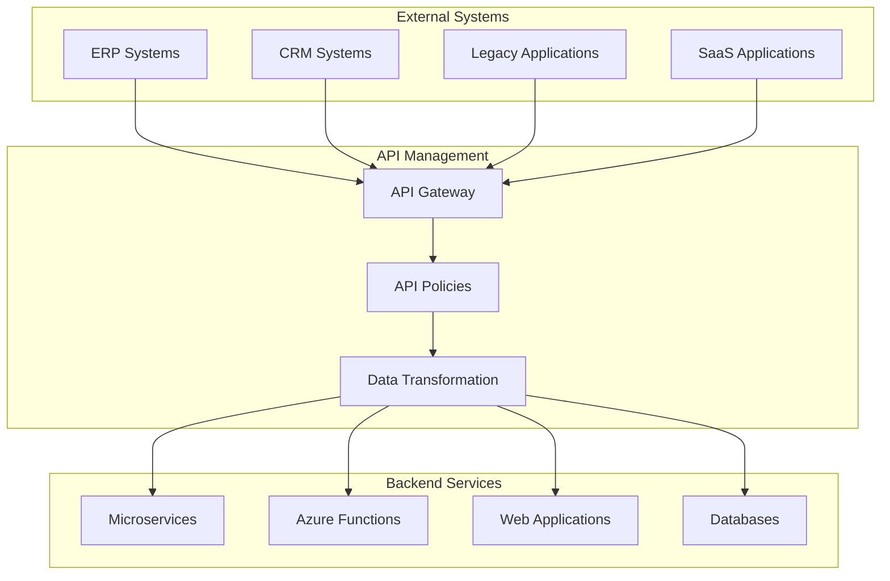

## 📊 Scalability Considerations

### Current Scaling Options

#### API Management Scaling
- **SKU Selection**: Developer (testing) → Premium (production)
- **Capacity Units**: Configurable scale units per environment
- **Workspace Organization**: Multiple workspaces for team isolation
- **Regional Deployment**: Deploy accelerator in multiple regions

#### Monitoring Scaling
- **Log Analytics**: PerGB2018 pricing scales with usage
- **Application Insights**: Automatic scaling with telemetry volume
- **Storage Account**: LRS for cost efficiency, upgrade to GRS if needed
- **Retention Policies**: Configure based on compliance requirements

#### Environment-Specific Scaling
```yaml
# Example scaling configurations
dev:
  apiManagement:
    sku: { name: "Developer", capacity: 1 }
    
staging:
  apiManagement:
    sku: { name: "Standard", capacity: 1 }
    
production:
  apiManagement:
    sku: { name: "Premium", capacity: 3 }
```

### Future Scaling Considerations
- **Multi-Region**: Deploy accelerator template in multiple Azure regions
- **VNet Integration**: Add networking module for enterprise connectivity
- **Advanced Security**: Integrate Key Vault for certificate management
- **CI/CD Integration**: Add Azure DevOps or GitHub Actions templates

## 🎯 Next Steps

To dive deeper into specific implementation details:

- **[Settings Schema Reference](../reference/settings-schema.md)** - Complete configuration reference
- **[Bicep Module Reference](../reference/bicep-modules.md)** - Technical implementation details
- **[Azure Resources Reference](../reference/azure-resources.md)** - Complete resource inventory
- **[RBAC & Permissions Guide](../reference/permissions.md)** - Security configuration details

---

**Related Documentation:**
- [Getting Started](../getting-started/) - Quick deployment guide
- [Configuration Guide](../user-guide/configuration.md) - Detailed configuration
- [Developer Guide](../developer-guide/) - Customization and extension