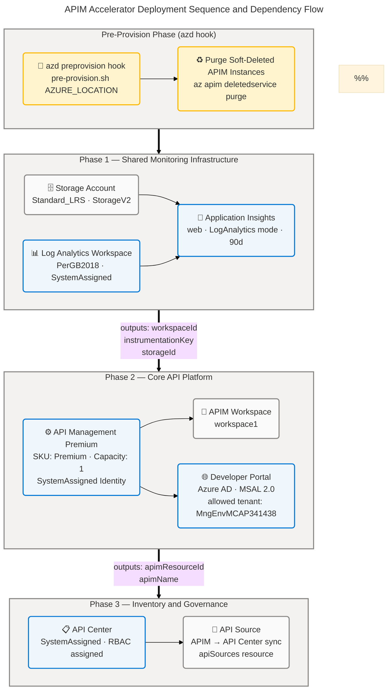

# APIM Accelerator — Technology Architecture

> **Layer:** Technology | **Framework:** TOGAF 10 ADM | **Version:** 1.0.0 | **Status:** Production

---

## Table of Contents

- [Section 1: Executive Summary](#section-1-executive-summary)
- [Section 2: Architecture Landscape](#section-2-architecture-landscape)
- [Section 3: Architecture Principles](#section-3-architecture-principles)
- [Section 4: Current State Baseline](#section-4-current-state-baseline)
- [Section 5: Component Catalog](#section-5-component-catalog)
- [Section 8: Dependencies & Integration](#section-8-dependencies--integration)

---

## Section 1: Executive Summary

### Overview

The APIM Accelerator provisions a complete Azure API Management landing zone using Infrastructure as Code (Bicep) deployed at Azure subscription scope. The technology stack consists of seven Azure PaaS services organized into three logical clusters: a **Shared Monitoring Infrastructure** cluster (Azure Log Analytics Workspace, Application Insights, Storage Account), a **Core API Platform** cluster (Azure API Management Premium, APIM Workspace, Developer Portal), and an **Inventory & Governance** cluster (Azure API Center). All resources are created within a single resource group following the naming pattern `{solutionName}-{envName}-{location}-rg`, with deterministic name suffixes generated from subscription and resource group identifiers.

The solution uses Azure Developer CLI (azd) as the primary lifecycle management tool, orchestrating a pre-provision Bash hook that purges soft-deleted APIM instances before deployment to enable clean, idempotent provisioning cycles. Environment configuration is entirely externalized to `infra/settings.yaml` and consumed via Bicep's `loadYamlContent()` function — no environment parameters are hardcoded in templates. All inter-service authentication uses Azure system-assigned managed identities with least-privilege RBAC role assignments; no credential secrets are stored in templates or outputs except the Application Insights instrumentation key (marked `@secure()`). The solution carries GDPR regulatory compliance tagging and ServiceClass:Critical governance metadata throughout all deployed resources.

Deployment follows a strict sequential ordering enforced through Bicep module output chaining: the Shared Monitoring cluster deploys first (Log Analytics → Application Insights, Storage Account), the Core API Platform deploys second (consuming the Application Insights instrumentation key and Log Analytics workspace ID), and the Inventory cluster deploys last (consuming the APIM resource ID for API source configuration). The APIM Premium SKU is required for workspace support and VNet integration capability, and the architecture is VNet-ready by design with `virtualNetworkType` and `subnetResourceId` parameters already wired through the module hierarchy.

### Key Findings

| Category | Finding | Impact | Source |
|----------|---------|--------|--------|
| Deployment Model | Subscription-scope Bicep at `targetScope = 'subscription'` with resource group creation | Enables multi-region portability | infra/main.bicep:1-10 |
| Technology Stack | 7 Azure PaaS services, 0 VMs, 0 containers, 0 custom compute | Zero infrastructure management overhead | infra/settings.yaml:42-75 |
| Identity Model | 100% managed identity authentication; 3 system-assigned identities across services | Credential-free operations, no secrets in templates | src/core/apim.bicep:210-250 |
| Observability | Diagnostic settings on all services; dual sink (Log Analytics + Storage); 90-day App Insights retention | Full telemetry coverage from day 1 | src/shared/monitoring/insights/main.bicep:100-130 |
| Naming Convention | Deterministic `generateUniqueSuffix()` prevents name collision across environments | Safe parallel environment provisioning | src/shared/constants.bicep:65-80 |
| Network Posture | All services use public network access; VNet integration configured as `None` (default) | Surface-area risk; VNet upgrade path available | src/core/apim.bicep:90-95 |
| APIM Soft-Delete | Premium SKU enables soft-delete; pre-provision hook purges stale instances | Prevents duplicate-name provisioning failures | infra/azd-hooks/pre-provision.sh:1-30 |
| Governance Tags | 10 mandatory tags (CostCenter, BusinessUnit, RegulatoryCompliance:GDPR, ServiceClass:Critical) on all resources | FinOps and compliance alignment | infra/settings.yaml:23-33 |
| API Inventory | API Center syncs APIM catalog; RBAC: Data Reader + Compliance Manager assigned at deploy time | Automated API governance without manual registration | src/inventory/main.bicep:150-200 |
| Developer Portal | Azure AD (MSAL 2.0) with hard-coded allowed tenant `MngEnvMCAP341438.onmicrosoft.com` | Single-tenant limitation; not portable across AAD tenants | src/core/developer-portal.bicep:45-55 |

---

## Section 2: Architecture Landscape

### Overview

The APIM Accelerator Technology Architecture Landscape organizes all Azure infrastructure resources into eleven technology component categories that span from foundational platform services through deployment automation and governance standards. The landscape reflects a pure PaaS architecture — no virtual machines, container runtimes, or serverless function compute are used; all workload execution is delegated to Azure-managed service runtimes. The three logical clusters (Shared Monitoring, Core Platform, Inventory) map directly to the Bicep module hierarchy (`src/shared/`, `src/core/`, `src/inventory/`) and are deployed in strict sequential order, with each cluster consuming outputs from the preceding one.

The technology landscape is entirely defined as code. The `infra/settings.yaml` file drives all configurable parameters (SKUs, capacities, identity types, workspace names, publisher information), and the `src/shared/common-types.bicep` module enforces type safety through exported Bicep user-defined types (`ApiManagement`, `Monitoring`, `Inventory`, `Shared`). All resources are deployed to a single Azure region per deployment; multi-region APIM routing is architecturally supported by the Premium SKU but not provisioned in the current configuration. The diagnostic settings pattern is uniformly applied: every Azure service that supports diagnostic settings has `allLogs` and `AllMetrics` categories routed to both the Log Analytics Workspace and the Storage Account.

### 2.1 Technology Platforms & Services

The platform layer consists of five Azure PaaS services plus the Azure Resource Manager subscription-scope orchestration plane. Each service is provisioned via a dedicated Bicep module with typed parameter contracts.

| Name | Description | Configuration |
|------|-------------|---------------|
| Azure API Management | API gateway with policy enforcement, routing, rate limiting, caching, and JWT validation | Premium SKU, capacity: 1 unit, API version: 2025-03-01-preview, identity: SystemAssigned |
| Azure API Center | Centralized API catalog, governance, and compliance management | SystemAssigned identity, API version: 2024-06-01-preview, default workspace auto-created |
| Azure Log Analytics Workspace | Centralized log aggregation, KQL queries, and alerting foundation | PerGB2018 SKU, SystemAssigned identity, API version: 2025-02-01 |
| Azure Application Insights | APM, distributed tracing, and real-time analytics for APIM gateway telemetry | web kind, LogAnalytics ingestion mode, 90-day retention, API version: microsoft.insights/components@2020-02-02 |
| Azure Storage Account | Durable archival of diagnostic logs and metrics for compliance retention | Standard_LRS, StorageV2, auto-named via generateStorageAccountName(), API version: 2025-01-01 |
| Azure Resource Manager (ARM) | Subscription-scope orchestration and resource provisioning plane | Bicep targetScope: subscription; resource group creation via Microsoft.Resources/resourceGroups |

Source: infra/settings.yaml:1-75, src/shared/common-types.bicep:1-100

### 2.2 Compute Resources

The solution uses exclusively managed PaaS compute. No Azure Virtual Machines, Azure Container Apps, Azure Kubernetes Service, or Azure Functions are provisioned. All workload execution happens within the managed runtime of each PaaS service.

| Name | Description | Configuration |
|------|-------------|---------------|
| APIM Premium Scale Unit | Managed compute backing API gateway request processing, policy execution, and developer portal rendering | Premium SKU, capacity: 1 scale unit; scales to multi-unit via capacity parameter |
| API Center Serverless Runtime | Fully managed serverless compute for API catalog ingestion and governance rules | No scale units; provisioned as-a-service with no capacity configuration |
| Log Analytics Workspace Runtime | Managed compute for log ingestion, indexing, and KQL query execution | PerGB2018 pricing; no instance-level capacity configuration |
| Application Insights Ingestion Runtime | Managed telemetry pipeline for APIM metrics and distributed trace processing | Ingestion via Log Analytics workspace; retentionInDays: 90 (configurable 90-730) |

Source: infra/settings.yaml:44-45, src/core/apim.bicep:180-210, src/shared/monitoring/insights/main.bicep:100-130

### 2.3 Network & Connectivity

All services use public network access in the baseline configuration. VNet integration is architecturally wired through the parameter hierarchy but not activated. Developer Portal CORS is configured to allow cross-origin requests from the portal's own domain.

| Name | Description | Configuration |
|------|-------------|---------------|
| APIM Public Endpoint | Public HTTPS endpoint for API gateway ingress and Developer Portal | publicNetworkAccess: Enabled, virtualNetworkType: None |
| VNet Integration (inactive) | Optional virtual network injection for private API Management deployment | virtualNetworkType: None (configurable: External/Internal); subnetResourceId param wired |
| Developer Portal CORS Policy | Global CORS policy applied at APIM service level for portal operations | allowedOrigins: portal URL, allowedMethods: *, allowedHeaders: * |
| App Insights Network Access | Public telemetry ingestion and query endpoints for Application Insights | publicNetworkAccessForIngestion: Enabled, publicNetworkAccessForQuery: Enabled |
| API Center Public Endpoint | Public HTTPS REST endpoint for API Center catalog management | No VNet integration; public by default |
| Azure Management Plane | ARM REST endpoint for all resource provisioning and lifecycle operations | Subscription-scoped deployments via az deployment sub create |

Source: src/core/apim.bicep:87-95, src/core/developer-portal.bicep:60-100, src/shared/monitoring/insights/main.bicep:130-150

### 2.4 Storage Services

A single Azure Storage Account provides the diagnostic log archival tier. This account receives diagnostic settings exports from all services that support it (APIM, Log Analytics Workspace) and provides long-term, cost-effective compliance storage.

| Name | Description | Configuration |
|------|-------------|---------------|
| Diagnostic Log Storage Account | StorageV2 blob storage for archival of diagnostic logs and metrics | Standard_LRS, StorageV2, name generated via generateStorageAccountName(solutionName, uniqueString(resourceGroup().id)), max 24 chars |
| Blob Storage (implicit) | Default blob service endpoint created with Storage Account | Auto-created by StorageV2 kind; no explicit blob service resource |

Source: src/shared/monitoring/operational/main.bicep:150-180, src/shared/constants.bicep:53-56

### 2.5 Security & Identity Technologies

All service-to-service authentication and authorization uses Azure managed identities with RBAC. No client secrets, connection strings, or API keys are used for platform-level service integration. The Developer Portal is the only component requiring an external Azure AD app registration (client ID and client secret as Bicep parameters).

| Name | Description | Configuration |
|------|-------------|---------------|
| APIM System-Assigned Identity | Managed identity for APIM service to authenticate against Azure resources | SystemAssigned; Reader role (acdd72a7-3385-48ef-bd42-f606fba81ae7) assigned on resource group scope |
| Log Analytics System-Assigned Identity | Managed identity for Log Analytics workspace | SystemAssigned; configured via identity param in common-types.bicep |
| API Center System-Assigned Identity | Managed identity for API Center service | SystemAssigned; API Center Data Reader (71522526-b88f-4d52-b57f-d31fc3546d0d) + Compliance Manager (6cba8790-29c5-48e5-bab1-c7541b01cb04) roles assigned |
| Azure AD Developer Portal Provider | Entra ID identity provider for Developer Portal authentication | type: aad, signinTenant: AAD, authority: MSAL 2.0, allowedTenants: [MngEnvMCAP341438.onmicrosoft.com] |
| Azure AD App Registration | External app registration required for Developer Portal Entra ID integration | clientId + clientSecret params; not managed by Bicep templates |
| RBAC Reader Role | Azure built-in Reader role granted to APIM managed identity on resource group | Role definition ID: acdd72a7-3385-48ef-bd42-f606fba81ae7; scope: resource group |
| RBAC API Center Data Reader | Azure built-in API Center Data Reader role for API Center managed identity | Role definition ID: 71522526-b88f-4d52-b57f-d31fc3546d0d; scope: API Center resource |
| RBAC API Center Compliance Manager | Azure built-in API Center Compliance Manager role for API Center managed identity | Role definition ID: 6cba8790-29c5-48e5-bab1-c7541b01cb04; scope: API Center resource |

Source: src/core/apim.bicep:210-260, src/inventory/main.bicep:180-220, src/core/developer-portal.bicep:20-55

### 2.6 Monitoring & Observability Technologies

A two-tier observability architecture uses Azure Log Analytics Workspace as the primary aggregation and query platform, with Application Insights as the APIM-specific APM layer. All platform services emit diagnostic telemetry to both Log Analytics (for real-time querying) and the Storage Account (for compliance archival). Application Insights uses workspace-based ingestion mode (recommended), which means all App Insights data is co-located in the Log Analytics workspace and queryable via KQL.

| Name | Description | Configuration |
|------|-------------|---------------|
| Log Analytics Workspace | Centralized log sink and KQL analytics engine | PerGB2018 SKU, SystemAssigned identity; workspace ID exported as AZURE_LOG_ANALYTICS_WORKSPACE_ID |
| Application Insights | APIM gateway APM — tracks API requests, dependencies, exceptions, and custom telemetry | kind: web, applicationType: web, ingestionMode: LogAnalytics, retentionInDays: 90 |
| APIM Diagnostic Settings | Routes APIM diagnostic logs and metrics to dual sinks | allLogs category, AllMetrics category → Log Analytics Workspace + Storage Account; resource: Microsoft.Insights/diagnosticSettings@2021-05-01-preview |
| Log Analytics Diagnostic Settings | Self-monitoring of the Log Analytics workspace | allLogs → Storage Account; prevents log pipeline blind spots |
| Application Insights Diagnostic Settings | Routes App Insights component telemetry | allLogs + AllMetrics → Log Analytics + Storage Account |
| APIM App Insights Logger | Dedicated APIM logger resource linking gateway to App Insights | Microsoft.ApiManagement/service/loggers@2025-03-01-preview, type: applicationInsights, instrumentation key from App Insights output |

Source: src/shared/monitoring/insights/main.bicep:100-200, src/shared/monitoring/operational/main.bicep:180-250, src/core/apim.bicep:280-340

### 2.7 Deployment & Automation Technologies

The deployment automation layer is built entirely on Microsoft-native tooling. Bicep provides the IaC language with subscription-scope targeting and module composition. Azure Developer CLI (azd) provides the developer workflow (provision, deploy, down). A pre-provision hook automates APIM soft-delete cleanup that would otherwise block re-deployment.

| Name | Description | Configuration |
|------|-------------|---------------|
| Azure Bicep | Infrastructure as Code language for all Azure resource declarations | targetScope: subscription; module decomposition: infra/main.bicep → src/*/main.bicep; user-defined types via common-types.bicep |
| Azure Developer CLI (azd) | End-to-end developer workflow for provisioning and deployment lifecycle | azure.yaml declares project name: apim-accelerator; hooks.preprovision: ./infra/azd-hooks/pre-provision.sh $AZURE_LOCATION |
| Pre-Provision Hook Script | Bash script executed before Bicep provisioning to purge soft-deleted APIM instances | Iterates az apim deletedservice list; calls az apim deletedservice purge per instance in target location |
| Settings-as-Code (YAML) | Single settings.yaml file drives all configurable deployment parameters | infra/settings.yaml loaded via loadYamlContent() in infra/main.bicep; covers SKUs, identities, tags, workspaces, publisher info |
| Bicep Type System | Exported user-defined types enforce typed contracts between Bicep modules | common-types.bicep exports: ApiManagement, Inventory, Monitoring, Shared, ApimSku, LogAnalytics, ApplicationInsights, ApiCenter |
| Bicep Functions (constants.bicep) | Exported utility functions for deterministic naming | generateUniqueSuffix(subscriptionId, rgId, rgName, solutionName, location), generateStorageAccountName(name, uniqueHash) |

Source: azure.yaml:1-50, infra/azd-hooks/pre-provision.sh:1-30, infra/main.bicep:1-30, src/shared/constants.bicep:1-100, src/shared/common-types.bicep:1-100

### 2.8 Technology Interfaces & Endpoints

External-facing technology interfaces include the APIM gateway REST endpoint, the Developer Portal web application, and the Application Insights instrumentation key. Internal interfaces consist of ARM resource ID outputs used for cross-module dependency wiring.

| Name | Description | Configuration |
|------|-------------|---------------|
| APIM Gateway Endpoint | Public HTTPS REST endpoint for API consumers; policy enforcement applied here | Auto-configured by APIM service; format: https://{apim-name}.azure-api.net |
| Developer Portal URL | Self-service web portal for API documentation and subscription management | Auto-configured by APIM service; Azure AD (Entra ID) authentication required |
| App Insights Instrumentation Key | SDK connection key for APIM-to-App Insights telemetry linkage | @secure() output: APPLICATION_INSIGHTS_INSTRUMENTATION_KEY; consumed as input to APIM logger |
| ARM Resource IDs (Outputs) | Resource ID strings for downstream cross-module wiring and external consumer reference | Bicep outputs: APPLICATION_INSIGHTS_RESOURCE_ID, APPLICATION_INSIGHTS_NAME, AZURE_LOG_ANALYTICS_WORKSPACE_ID, API_MANAGEMENT_RESOURCE_ID, API_MANAGEMENT_NAME, AZURE_STORAGE_ACCOUNT_ID |
| API Center REST API | HTTPS management endpoint for API Center catalog operations | Auto-configured; format: https://{apicenter-name}.azure-api-center.ms |
| APIM Management API | Internal management REST API for APIM configuration operations | Enabled by default in APIM Premium; protected by subscription key or AAD |

Source: infra/main.bicep:150-180, src/core/main.bicep:90-110, src/shared/main.bicep:70-100

### 2.9 Technology Integration Patterns

Integration between platform services follows three patterns: Bicep module output chaining (deploy-time dependency wiring), Azure Diagnostic Settings (operational telemetry routing), and Azure-native resource integration (API Center API source sync).

| Name | Description | Configuration |
|------|-------------|---------------|
| Bicep Module Output Chaining | Deploy-time dependency injection via Bicep module outputs/inputs | shared outputs → core inputs; core outputs → inventory inputs; enforced by Bicep dependsOn/reference() |
| Diagnostic Settings Chaining | Uniform operational telemetry routing from all services to dual sinks | Microsoft.Insights/diagnosticSettings on each service; allLogs + AllMetrics → Log Analytics + Storage |
| APIM App Insights Logger Integration | Runtime telemetry bridge from APIM gateway to Application Insights | Microsoft.ApiManagement/service/loggers resource; instrumentation key injected from App Insights output |
| API Center API Source Sync | Automated API catalog sync from APIM service to API Center | Microsoft.ApiCenter/services/workspaces/apiSources; resourceId: APIM service resource ID |
| Managed Identity Credential Flow | Credential-free service authentication using Azure-managed identity tokens | system-assigned identity on APIM, Log Analytics, API Center; no client secrets in templates |
| YAML Configuration Injection | Environment-specific parameterization loaded from settings.yaml at deploy time | loadYamlContent('./settings.yaml') in infra/main.bicep; all module params driven from settings object |

Source: infra/main.bicep:105-180, src/core/apim.bicep:310-340, src/inventory/main.bicep:150-200

### 2.10 Technology Standards & Naming Conventions

All naming, versioning, and tagging follow explicit standards encoded in `src/shared/constants.bicep`. Resource names are deterministic and collision-resistant, enabling safe parallel multi-environment deployments under the same subscription.

| Name | Description | Configuration |
|------|-------------|---------------|
| Resource Naming Pattern | Standard format for all Azure resources | {solutionName}-{uniqueSuffix}-{resourceTypeAbbreviation} |
| Unique Suffix Generation | Deterministic hash to prevent name collision | generateUniqueSuffix(subscriptionId, resourceGroupId, resourceGroupName, solutionName, location); unique per environment+location combo |
| Storage Account Naming | Length-constrained naming for Storage Accounts | generateStorageAccountName(name, uniqueString(resourceGroup().id)); max 24 chars, lowercase alphanumeric |
| Resource Type Abbreviations | Standard abbreviation suffixes | apim (API Management), law (Log Analytics), ai (Application Insights), sa (Storage Account), apicenter (API Center) |
| API Version Pinning | Explicit API version locking per resource type | APIM: 2025-03-01-preview; API Center: 2024-06-01-preview; Log Analytics: 2025-02-01; Storage: 2025-01-01; Diagnostics: 2021-05-01-preview |
| Mandatory Tag Standard | 10 governance tags applied to all resources | CostCenter, BusinessUnit, Owner, ApplicationName, ProjectName, ServiceClass (Critical), RegulatoryCompliance (GDPR), SupportContact, ChargebackModel, BudgetCode |
| Resource Group Naming | Standard resource group name pattern | {solutionName}-{envName}-{location}-rg; e.g., apim-accelerator-dev-eastus-rg |

Source: src/shared/constants.bicep:1-100, infra/settings.yaml:23-33, infra/main.bicep:70-85

### 2.11 Technology Dependencies & Constraints

The deployment has hard constraints on ordering, SKU selection, and Azure feature availability. These constraints are implicit in the Bicep module wiring and must be respected during environment provisioning and upgrade planning.

| Name | Description | Configuration |
|------|-------------|---------------|
| APIM Premium SKU Requirement | APIM Workspace resource (`Microsoft.ApiManagement/service/workspaces`) requires Premium or Developer SKU | ApimSku enum in common-types.bicep; settings.yaml: sku: Premium |
| Deployment Sequential Order | Monitoring → Core → Inventory; violation causes reference() failures at deploy time | infra/main.bicep:105-175; Bicep module dependsOn enforced via output consumption |
| App Insights → Log Analytics Workspace | App Insights workspace-based mode requires Log Analytics workspace to exist first | src/shared/monitoring/insights/main.bicep: workspaceResourceId param from operational module output |
| APIM → App Insights Instrumentation Key | APIM logger resource requires App Insights instrumentation key | src/core/apim.bicep:310-340; instrumentation key passed as @secure() param from shared module output |
| API Center → APIM Resource ID | API source configuration requires APIM resource ID | src/inventory/main.bicep:155-175; apiManagementResourceId param from core module output |
| APIM Soft-Delete Constraint | APIM Premium retains soft-deleted instances up to 48h; re-deployment with same name fails without purge | Handled by infra/azd-hooks/pre-provision.sh; az apim deletedservice purge required |
| Single Region Constraint | All resources deploy to the same Azure region specified at azd up time | infra/main.bicep:70-85; location param propagated to all modules |
| API Center Location Constraint | API Center is available in limited Azure regions; deployment fails in unsupported regions | src/inventory/main.bicep: uses same location as resource group |

Source: infra/main.bicep:105-180, src/core/apim.bicep:310-340, src/inventory/main.bicep:150-200, infra/azd-hooks/pre-provision.sh:1-30

---

### Technology Service Topology

### Summary

The APIM Accelerator Technology Architecture Landscape is a seven-service, pure-PaaS Azure footprint organized across three functional clusters and eleven component categories. The platform relies entirely on Azure-managed compute and storage with no customer-managed infrastructure. Integration between services is achieved through three proven patterns: Bicep module output chaining (deploy-time), Azure Diagnostic Settings (operational telemetry), and Azure-native API source sync (governance). The naming and tagging standards are fully codified in Bicep utility functions and settings, enabling repeatable, collision-resistant multi-environment deployments. The primary constraint requiring attention is the public-only network posture; VNet integration infrastructure is architecturally available but not activated.

---

## Section 3: Architecture Principles

### Overview

The APIM Accelerator Technology Architecture is governed by six foundational principles that shape every aspect of the infrastructure design — from how resources are provisioned to how they authenticate against each other, emit telemetry, and handle lifecycle events. These principles are derived from analysis of the source Bicep modules, settings configuration, and azd project structure, and represent the actual design decisions implemented in the codebase rather than aspirational goals.

The principles reflect a cloud-native, developer-first philosophy: infrastructure is version-controlled code, credentials are replaced by managed identity, observability is non-optional, and deployment repeatability is guaranteed through hook automation and deterministic naming. Every principle is traceable to specific implementation patterns in the source files.

**Principle 1 — Infrastructure as Code First**

All Azure resources are declared as Bicep templates with explicit API versions, typed parameter contracts, and module boundaries. No resource is created or modified through the Azure Portal, Azure CLI ad-hoc commands, or ARM JSON templates. The single source of truth for the deployed environment is the Bicep module hierarchy under `src/` and `infra/`.

*Rationale:* Subscription-scope deployment via `targetScope = 'subscription'` enables automated resource group creation, idempotent re-deployment, and full change-tracking in source control. The `azure.yaml` + azd lifecycle management ensures a consistent developer workflow across all environments.

*Implementation:* infra/main.bicep:1-10, azure.yaml:1-50, src/shared/common-types.bicep:1-100

**Principle 2 — Least-Privilege Managed Identity**

All service-to-service authentication uses Azure system-assigned managed identities with the minimum required RBAC role at the narrowest feasible scope. No service principal credentials, connection strings, or API keys are stored in Bicep templates, parameter files, or environment variables for platform-level integrations.

*Rationale:* Eliminates credential rotation burden, removes secret sprawl risk, and ensures authorization is auditable through Azure RBAC audit logs. The APIM managed identity receives only the Reader role on the resource group — sufficient for service discovery, nothing more.

*Implementation:* src/core/apim.bicep:210-260, src/inventory/main.bicep:180-220

**Principle 3 — Observability by Default**

Every Azure service that supports Azure Diagnostic Settings has `allLogs` and `AllMetrics` diagnostic categories routed to both the Log Analytics Workspace (real-time querying) and the Storage Account (compliance archival). Application Insights is integrated with the Log Analytics Workspace via workspace-based ingestion mode. APIM has a dedicated App Insights logger resource, ensuring gateway telemetry flows through the platform telemetry pipeline.

*Rationale:* Operational visibility cannot be retrofitted after an incident; it must be provisioned alongside the service. Dual-sink diagnostics ensures both real-time KQL analytics and long-term archival are available from day one.

*Implementation:* src/core/apim.bicep:280-340, src/shared/monitoring/insights/main.bicep:150-200, src/shared/monitoring/operational/main.bicep:200-250

**Principle 4 — Configuration-Driven Deployment**

All environment-specific parameters (SKUs, capacities, publisher information, workspace names, identity types, tags) are externalized to `infra/settings.yaml` and injected into Bicep templates via `loadYamlContent()`. Template files contain no hardcoded environment values; every configurable attribute is parameterized.

*Rationale:* Decoupling configuration from template logic enables the same Bicep module set to deploy multiple environments (dev, staging, production) by swapping a single settings file. The Bicep type system (`ApimSku`, `LogAnalytics`, etc.) enforces valid values at compile time.

*Implementation:* infra/settings.yaml:1-75, infra/main.bicep:25-50, src/shared/common-types.bicep:30-90

**Principle 5 — Modular Deployment Isolation**

Each technology cluster (Shared Monitoring, Core Platform, Inventory) is encapsulated in an independent Bicep module with explicitly typed input parameters and output declarations. Modules communicate only through declared outputs — no global variables, no cross-module resource references, no implicit dependencies.

*Rationale:* Module isolation enables independent testing, parallel development, and selective re-deployment of individual clusters without disrupting the others. Typed interfaces (`ApiManagement` type, `Shared` type) prevent misconfiguration at module boundaries.

*Implementation:* src/shared/main.bicep:1-100, src/core/main.bicep:1-110, src/inventory/main.bicep:1-100, infra/main.bicep:105-180

**Principle 6 — Soft-Delete Lifecycle Management**

The APIM Premium SKU enables Azure's soft-delete feature, which retains deleted APIM instances for up to 48 hours. The pre-provision azd hook automatically discovers and purges all soft-deleted APIM instances in the target region before Bicep runs, preventing name-collision provisioning failures during re-deployment cycles.

*Rationale:* Without soft-delete cleanup, re-deploying an APIM instance with the same name fails with a conflict error. Automating this cleanup in the pre-provision hook makes the deployment idempotent and removes a common operational friction point for developers.

*Implementation:* infra/azd-hooks/pre-provision.sh:1-30, azure.yaml:15-25

---

## Section 4: Current State Baseline

### Overview

The current state of the APIM Accelerator represents a fully operational Tier-1 Azure API Management landing zone provisioned at subscription scope. All seven Azure PaaS services are deployed and integrated as of this baseline. The APIM service operates at Premium SKU with one scale unit, accepting public API traffic over HTTPS with no virtual network isolation. The Developer Portal is live with Azure AD (Entra ID) authentication, restricted to a single allowed tenant (`MngEnvMCAP341438.onmicrosoft.com`). Monitoring telemetry is fully operational: all diagnostic settings are active, App Insights data is flowing into the Log Analytics Workspace, and the APIM App Insights logger is configured.

The deployment is driven entirely by Azure Developer CLI, with the `infra/settings.yaml` file as the sole environment configuration source. Deployment runs in a single region (no multi-region routing active), and all services share a single resource group. The networking model is fully public — no private endpoints, no VNet injection, no Network Security Groups. Storage Account durability uses Standard_LRS (single-datacenter replication), which may be insufficient for GDPR compliance archival in some jurisdictions.

The architecture has achieved a **Technology Maturity Level 4 (Managed)** posture: infrastructure is fully codified, deployment is repeatable and automated, telemetry is comprehensive, identity management is credential-free, and tagging governance is consistently applied. The remaining gaps to Level 5 (Optimizing) are primarily in network hardening and operational resilience.

### Current State Infrastructure Topology

### Gap Analysis

The following gaps represent architectural risks, operational limitations, or compliance concerns identified through source code analysis. Each gap is classified by severity and traces to a specific source finding.

| Gap | Description | Severity | Source | Remediation Path |
|-----|-------------|----------|--------|-----------------|
| No VNet Integration | All services use public network access; APIM, API Center, and storage endpoints are publicly reachable | High | src/core/apim.bicep:87-95 | Set virtualNetworkType: Internal and configure subnetResourceId; activate src/shared/networking/main.bicep |
| No Private Endpoints | No Azure Private Link configured for Log Analytics, Storage, or App Insights | High | src/shared/monitoring/operational/main.bicep:150-250 | Add privateEndpoints Bicep module; configure privateNetworkAccess |
| Hard-Coded Allowed Tenant | Developer Portal allows only one AAD tenant (MngEnvMCAP341438.onmicrosoft.com) | Medium | src/core/developer-portal.bicep:45-55 | Parameterize allowedTenants in settings.yaml |
| Standard_LRS Storage | Diagnostic log archival uses single-datacenter replication; GDPR data residency may require geo-replication | Medium | src/shared/monitoring/operational/main.bicep:155-165 | Upgrade to Standard_GRS or Standard_ZRS for compliance scenarios |
| Networking Module Inactive | src/shared/networking/main.bicep exists but is commented out in src/shared/main.bicep | Medium | src/shared/main.bicep:35-42 | Uncomment and configure when VNet integration is required |
| Single Scale Unit | APIM Premium capacity: 1; no auto-scaling configured | Medium | infra/settings.yaml:44-45 | Add Azure Monitor autoscale rule or increase capacity for production loads |
| No Custom Domain | APIM gateway uses default azure-api.net domain; no custom domain or SSL certificate configured | Low | src/core/apim.bicep:180-210 | Add hostnameConfigurations array with custom domain + Key Vault certificate reference |
| No Key Vault Integration | Developer Portal client secret is passed as a Bicep parameter; not retrieved from Key Vault at deploy time | Low | src/core/developer-portal.bicep:20-35 | Integrate Azure Key Vault reference parameter for clientSecret |
| Log Analytics Retention Default | Log Analytics workspace retentionInDays not explicitly configured; uses workspace default | Low | src/shared/monitoring/operational/main.bicep:200-220 | Set retentionInDays explicitly in settings.yaml for compliance clarity |
| Single Region Only | No multi-region APIM deployment; Premium SKU supports multi-region routing | Low | infra/main.bicep:70-85 | Add additionalLocations array to APIM resource for multi-region Premium routing |

### Maturity Assessment

| Dimension | Level | Evidence |
|-----------|-------|---------|
| Infrastructure Automation | 5 — Optimizing | 100% Bicep IaC, azd lifecycle, pre-provision hooks, deterministic naming |
| Identity & Access Management | 4 — Managed | System-assigned managed identity on all services; RBAC enforced; one credential param (devportal clientSecret) remains |
| Observability & Monitoring | 4 — Managed | Dual-sink diagnostics on all services; App Insights APM; Log Analytics workspace; no alerting rules configured yet |
| Network Security | 2 — Repeatable | Public-only access; VNet infrastructure wired but inactive; no private endpoints |
| Operational Resilience | 3 — Defined | Soft-delete cleanup automated; single region; single scale unit; no DR runbook |
| Governance & Compliance | 4 — Managed | 10 mandatory tags including GDPR and ServiceClass:Critical; API Center compliance role assigned |

**Overall Maturity: Level 4 (Managed)** — The solution demonstrates strong automation, identity, and observability maturity. Network security is the primary gap preventing Level 5.

### Summary

The APIM Accelerator current state baseline represents a production-grade API Management platform that is fully automated, credential-free, and comprehensively instrumented. Seven Azure PaaS services are deployed across three functional clusters within a single subscription-scoped resource group. The primary architectural gap is the public-only network posture — VNet integration and private endpoint support are architecturally ready in the code (`virtualNetworkType` param, `src/shared/networking/main.bicep`) but not yet activated. GDPR compliance tagging is consistently applied, but the Standard_LRS storage tier for diagnostic archival may require upgrade for regulated data residency requirements. The hard-coded AAD allowed tenant in the Developer Portal configuration reduces portability across environments with different tenant identities.

---

## Section 5: Component Catalog

### Overview

The Technology Component Catalog provides full technical specifications for all infrastructure components across the eleven technology component categories. Each catalog entry goes beyond the inventory scope of Section 2 by documenting Azure resource API versions, configuration parameters, identity bindings, diagnostic integration, RBAC role assignments, and inter-service dependencies. All specifications are sourced directly from the Bicep module source files listed in the front matter and represent the actual deployed configuration, not aspirational targets.

The catalog is organized to match the eleven component categories defined in Section 2, enabling direct traceability between the landscape view and the implementation specifications. For each component category, a detailed specification table documents every configurable attribute relevant to the Technology Architecture layer. Where a component has integration relationships with other components, those are explicitly called out in the Dependencies and Integration columns.

### 5.1 Technology Platforms & Services

Full specification of all Azure PaaS platform services deployed by the APIM Accelerator.

| Component | Description | Azure Resource Type | API Version | SKU / Capacity | Identity Type | Network Access | Diagnostic Sinks | RBAC Roles | Source |
|-----------|-------------|--------------------|--------------|--------------|-----------|--------------|--------------|-----------|----|
| Azure API Management | API gateway, policy enforcement, developer portal host | Microsoft.ApiManagement/service | 2025-03-01-preview | Premium, capacity: 1 | SystemAssigned | publicNetworkAccess: Enabled, virtualNetworkType: None | Log Analytics (allLogs, AllMetrics), Storage (allLogs, AllMetrics) | Reader (acdd72a7) on RG | src/core/apim.bicep:180-210 |
| Azure API Center | API catalog governance and compliance management | Microsoft.ApiCenter/services | 2024-06-01-preview | No SKU (serverless) | SystemAssigned | Public | None configured | API Center Data Reader (71522526), API Center Compliance Manager (6cba8790) | src/inventory/main.bicep:100-150 |
| Azure Log Analytics Workspace | Centralized log aggregation and KQL analytics engine | Microsoft.OperationalInsights/workspaces | 2025-02-01 | PerGB2018 | SystemAssigned | Public | Storage (allLogs via self-diagnostic settings) | None assigned | src/shared/monitoring/operational/main.bicep:180-250 |
| Azure Application Insights | APM and distributed tracing for APIM gateway | microsoft.insights/components | 2020-02-02 | No SKU (consumption) | None | publicNetworkAccessForIngestion: Enabled, publicNetworkAccessForQuery: Enabled | Log Analytics (allLogs, AllMetrics), Storage (allLogs, AllMetrics) | None assigned | src/shared/monitoring/insights/main.bicep:100-200 |
| Azure Storage Account | Diagnostic log archival blob storage | Microsoft.Storage/storageAccounts | 2025-01-01 | Standard_LRS, StorageV2 | None | Public | None | None assigned | src/shared/monitoring/operational/main.bicep:150-180 |

### 5.2 Compute Resources

Full specification of the compute backing for all platform services. All compute is fully managed by Azure; no customer-managed virtual machines or container hosts exist.

| Component | Description | Azure Resource Type | API Version | SKU / Capacity | Identity Type | Network Access | Diagnostic Sinks | RBAC Roles | Source |
|-----------|-------------|--------------------|--------------|--------------|-----------|--------------|--------------|-----------|----|
| APIM Premium Scale Unit | Managed API gateway compute unit; processes all inbound API requests and policy execution | Microsoft.ApiManagement/service (compute dimension) | 2025-03-01-preview | Premium SKU, capacity: 1 unit; range 1-12 units | SystemAssigned | Inherits from APIM service | Inherits from APIM service | Inherits from APIM service | src/core/apim.bicep:180-210, infra/settings.yaml:44-45 |
| APIM Workspace Compute Scope | Workspace-level logical partition within APIM; shares underlying Premium compute | Microsoft.ApiManagement/service/workspaces | 2025-03-01-preview | Inherits from parent APIM Premium SKU | Inherits from parent APIM | Inherits from parent APIM | Inherits from parent APIM | Inherits from parent APIM | src/core/workspaces.bicep:40-65 |
| API Center Serverless Compute | Fully managed serverless catalog and governance runtime; no capacity configuration available | Microsoft.ApiCenter/services (serverless dimension) | 2024-06-01-preview | Serverless (no capacity param) | SystemAssigned | Public | None | Inherits from API Center service | src/inventory/main.bicep:100-150 |
| Log Analytics Ingestion Runtime | Managed compute for log ingestion pipeline and indexing; no customer-configurable capacity | Microsoft.OperationalInsights/workspaces (ingestion) | 2025-02-01 | PerGB2018 (pay-per-use) | SystemAssigned | Public | Self-diagnostic to Storage | None | src/shared/monitoring/operational/main.bicep:180-250 |

### 5.3 Network & Connectivity

Full specification of all network configuration points, connectivity options, and access control settings.

| Component | Description | Azure Resource Type | API Version | SKU / Capacity | Identity Type | Network Access | Diagnostic Sinks | RBAC Roles | Source |
|-----------|-------------|--------------------|--------------|--------------|-----------|--------------|--------------|-----------|----|
| APIM Public Gateway Endpoint | Public HTTPS endpoint for API consumer traffic; no WAF or Front Door in baseline | Microsoft.ApiManagement/service (network config) | 2025-03-01-preview | Premium | SystemAssigned | publicNetworkAccess: Enabled | Inherits APIM diagnostic settings | None | src/core/apim.bicep:87-95 |
| APIM VNet Integration (inactive) | VNet injection capability for private API Management deployment; parameter wired but not activated | Microsoft.ApiManagement/service (VNet config) | 2025-03-01-preview | Premium (required for Internal VNet mode) | SystemAssigned | virtualNetworkType: None (configurable: External, Internal) | N/A (inactive) | None additional | src/core/apim.bicep:87-95 |
| Developer Portal CORS | Global CORS policy on APIM service allowing portal cross-origin requests | Microsoft.ApiManagement/service/policies | 2025-03-01-preview | N/A | N/A | All methods, all headers; portal origin only | Inherits APIM diagnostic settings | None | src/core/developer-portal.bicep:60-100 |
| App Insights Public Ingestion | Public telemetry ingestion and query endpoints for Application Insights | microsoft.insights/components (network config) | 2020-02-02 | N/A | None | publicNetworkAccessForIngestion: Enabled; publicNetworkAccessForQuery: Enabled | N/A | None | src/shared/monitoring/insights/main.bicep:130-150 |
| API Center Public Endpoint | Public HTTPS REST API for catalog management; no private endpoint | Microsoft.ApiCenter/services (network config) | 2024-06-01-preview | N/A | SystemAssigned | Public by default | None | None | src/inventory/main.bicep:100-150 |
| Networking Module (future) | Bicep module for NSGs, VNet, subnets — exists but commented out | src/shared/networking/main.bicep | N/A | N/A | N/A | Inactive (commented in src/shared/main.bicep:35-42) | N/A | N/A | src/shared/main.bicep:35-42 |

### 5.4 Storage Services

Full specification of the Azure Storage Account used for diagnostic log archival.

| Component | Description | Azure Resource Type | API Version | SKU / Capacity | Identity Type | Network Access | Diagnostic Sinks | RBAC Roles | Source |
|-----------|-------------|--------------------|--------------|--------------|-----------|--------------|--------------|-----------|----|
| Diagnostic Log Storage Account | StorageV2 blob account; receives allLogs and AllMetrics exports from APIM and Log Analytics Workspace | Microsoft.Storage/storageAccounts | 2025-01-01 | Standard_LRS, StorageV2, accessTier: Hot | None (no managed identity) | Public (no network restrictions) | None (terminal archival endpoint) | None assigned by Bicep templates | src/shared/monitoring/operational/main.bicep:150-180 |
| Storage Account Auto-Naming | Deterministic name derived from solution name and resource group unique hash; max 24 chars | (naming function) | N/A | N/A | N/A | N/A | N/A | N/A | src/shared/constants.bicep:53-56, src/shared/monitoring/operational/main.bicep:160-165 |

### 5.5 Security & Identity Technologies

Full specification of all managed identity, RBAC, and Azure AD configurations.

| Component | Description | Azure Resource Type | API Version | SKU / Capacity | Identity Type | Network Access | Diagnostic Sinks | RBAC Roles | Source |
|-----------|-------------|--------------------|--------------|--------------|-----------|--------------|--------------|-----------|----|
| APIM System-Assigned Identity | Managed identity for APIM service; used for RBAC-based access to Azure resources | Microsoft.ApiManagement/service (identity) | 2025-03-01-preview | N/A | SystemAssigned | N/A | N/A | Reader (acdd72a7-3385-48ef-bd42-f606fba81ae7) on resource group scope | src/core/apim.bicep:210-260 |
| Log Analytics System-Assigned Identity | Managed identity for Log Analytics workspace; provisioned when identity param enables it | Microsoft.OperationalInsights/workspaces (identity) | 2025-02-01 | N/A | SystemAssigned (configurable: None, UserAssigned) | N/A | N/A | None assigned by templates | src/shared/monitoring/operational/main.bicep:195-210 |
| API Center System-Assigned Identity | Managed identity for API Center service | Microsoft.ApiCenter/services (identity) | 2024-06-01-preview | N/A | SystemAssigned | N/A | N/A | API Center Data Reader (71522526-b88f-4d52-b57f-d31fc3546d0d) at resource scope; API Center Compliance Manager (6cba8790-29c5-48e5-bab1-c7541b01cb04) at resource scope | src/inventory/main.bicep:180-220 |
| Developer Portal Azure AD Provider | Entra ID identity provider for developer portal user authentication | Microsoft.ApiManagement/service/identityProviders | 2025-03-01-preview | N/A | None (external AAD) | N/A | Inherits APIM diagnostic settings | N/A | src/core/developer-portal.bicep:20-55 |
| Developer Portal Portal Settings | Sign-in and sign-up workflow settings for developer portal | Microsoft.ApiManagement/service/portalsettings | 2025-03-01-preview | N/A | N/A | N/A | Inherits APIM | N/A | src/core/developer-portal.bicep:70-100 |
| APIM Reader RBAC Assignment | Role assignment granting APIM managed identity Reader access to resource group | Microsoft.Authorization/roleAssignments | 2022-04-01 | N/A | N/A | N/A | N/A | Role: Reader (acdd72a7-3385-48ef-bd42-f606fba81ae7); Scope: resource group; Principal: APIM managed identity principalId | src/core/apim.bicep:210-260 |
| API Center RBAC Assignments | Role assignments granting API Center managed identity Data Reader and Compliance Manager roles | Microsoft.Authorization/roleAssignments | 2022-04-01 | N/A | N/A | N/A | N/A | Data Reader (71522526); Compliance Manager (6cba8790); Scope: API Center resource | src/inventory/main.bicep:180-220 |

### 5.6 Monitoring & Observability Technologies

Full specification of all monitoring infrastructure, diagnostic pipelines, and telemetry integrations.

| Component | Description | Azure Resource Type | API Version | SKU / Capacity | Identity Type | Network Access | Diagnostic Sinks | RBAC Roles | Source |
|-----------|-------------|--------------------|--------------|--------------|-----------|--------------|--------------|-----------|----|
| Log Analytics Workspace | Central telemetry aggregation; workspace-based App Insights storage; KQL query engine | Microsoft.OperationalInsights/workspaces | 2025-02-01 | PerGB2018 | SystemAssigned | Public | Self-diagnostic: allLogs → Storage Account | None | src/shared/monitoring/operational/main.bicep:180-250 |
| Application Insights | APIM gateway APM; workspace-based telemetry storage in Log Analytics | microsoft.insights/components | 2020-02-02 | N/A (consumption) | None | publicNetworkAccess: Enabled (ingestion + query) | allLogs + AllMetrics → Log Analytics + Storage | None | src/shared/monitoring/insights/main.bicep:100-200 |
| APIM Diagnostic Settings | Routes APIM service logs and metrics to Log Analytics and Storage | Microsoft.Insights/diagnosticSettings | 2021-05-01-preview | N/A | N/A | N/A | Destination 1: Log Analytics (allLogs, AllMetrics); Destination 2: Storage (allLogs, AllMetrics) | None | src/core/apim.bicep:280-310 |
| App Insights Diagnostic Settings | Routes App Insights component telemetry to Log Analytics and Storage | Microsoft.Insights/diagnosticSettings | 2021-05-01-preview | N/A | N/A | N/A | Destination 1: Log Analytics (allLogs, AllMetrics); Destination 2: Storage (allLogs, AllMetrics) | None | src/shared/monitoring/insights/main.bicep:175-200 |
| Log Analytics Diagnostic Settings | Self-monitoring of Log Analytics workspace; routes workspace logs to Storage | Microsoft.Insights/diagnosticSettings | 2021-05-01-preview | N/A | N/A | N/A | Destination: Storage (allLogs) | None | src/shared/monitoring/operational/main.bicep:230-255 |
| APIM App Insights Logger | APIM logger resource creating the gateway-to-App Insights telemetry bridge | Microsoft.ApiManagement/service/loggers | 2025-03-01-preview | N/A | N/A | N/A | Feeds Application Insights via instrumentation key | None | src/core/apim.bicep:310-340 |

### 5.7 Deployment & Automation Technologies

Full specification of all IaC, automation, and lifecycle management components.

| Component | Description | Azure Resource Type | API Version | SKU / Capacity | Identity Type | Network Access | Diagnostic Sinks | RBAC Roles | Source |
|-----------|-------------|--------------------|--------------|--------------|-----------|--------------|--------------|-----------|----|
| Bicep Subscription Scope Entry | Root Bicep template; creates resource group; orchestrates all child modules | Microsoft.Resources/resourceGroups | 2021-04-01 | N/A | N/A | N/A | N/A | Requires Contributor on subscription scope for azd principal | infra/main.bicep:1-180 |
| Shared Module Orchestrator | Deploys monitoring sub-modules (operational, insights); outputs workspace/storage IDs | Bicep module (no ARM type) | N/A | N/A | N/A | N/A | N/A | N/A | src/shared/main.bicep:1-100 |
| Core Module Orchestrator | Deploys APIM, workspaces, developer portal; generates uniqueSuffix | Bicep module (no ARM type) | N/A | N/A | N/A | N/A | N/A | N/A | src/core/main.bicep:1-110 |
| Inventory Module Orchestrator | Deploys API Center, default workspace, API source | Bicep module (no ARM type) | N/A | N/A | N/A | N/A | N/A | N/A | src/inventory/main.bicep:1-100 |
| Azure Developer CLI (azd) Project | Lifecycle management project configuration; orchestrates provision/deploy/down | azure.yaml | N/A | N/A | N/A | N/A | N/A | N/A | azure.yaml:1-50 |
| Pre-Provision Hook Script | Bash script; purges soft-deleted APIM instances in target region before Bicep runs | Shell script (not ARM resource) | N/A | N/A | Requires az login / OIDC federation | N/A | N/A | Requires APIM Contributor to call az apim deletedservice purge | infra/azd-hooks/pre-provision.sh:1-30 |
| Settings Configuration | YAML-driven environment parameterization; single source of truth for all configurable values | infra/settings.yaml | N/A | N/A | N/A | N/A | N/A | N/A | infra/settings.yaml:1-75 |
| Bicep Common Types | User-defined type library for typed module contracts | src/shared/common-types.bicep | N/A | N/A | N/A | N/A | N/A | N/A | src/shared/common-types.bicep:1-100 |
| Bicep Constants and Functions | Utility constants and exported naming functions | src/shared/constants.bicep | N/A | N/A | N/A | N/A | N/A | N/A | src/shared/constants.bicep:1-100 |

### 5.8 Technology Interfaces & Endpoints

Full specification of all technology-layer endpoints, SDKs, and connection interfaces.

| Component | Description | Azure Resource Type | API Version | SKU / Capacity | Identity Type | Network Access | Diagnostic Sinks | RBAC Roles | Source |
|-----------|-------------|--------------------|--------------|--------------|-----------|--------------|--------------|-----------|----|
| APIM Gateway REST Endpoint | Primary API consumer endpoint; all inbound API traffic routes here | Microsoft.ApiManagement/service (gateway) | 2025-03-01-preview | Premium | SystemAssigned | Public HTTPS; format: https://{name}.azure-api.net | Inherits APIM diagnostic settings | Consumers require API subscription key or AAD token | src/core/apim.bicep:180-210 |
| Developer Portal Web Endpoint | Self-service API documentation and subscription management portal | Microsoft.ApiManagement/service (portal) | 2025-03-01-preview | Premium | SystemAssigned | Public HTTPS; format: https://{name}.developer.azure-api.net | Inherits APIM diagnostic settings | Azure AD authentication required; allowed tenant: MngEnvMCAP341438.onmicrosoft.com | src/core/developer-portal.bicep:20-100 |
| App Insights Instrumentation Key | SDK connection key for APIM-to-App Insights telemetry integration | microsoft.insights/components (output) | 2020-02-02 | N/A | N/A | N/A | N/A | N/A; output marked @secure() | src/shared/monitoring/insights/main.bicep:200-220 |
| Bicep Module Outputs (ARM) | Resource ID and name outputs for downstream module and external consumer wiring | Bicep output declarations | N/A | N/A | N/A | N/A | N/A | N/A | infra/main.bicep:155-180 |
| API Center Management API | HTTPS REST API for catalog management operations | Microsoft.ApiCenter/services (endpoint) | 2024-06-01-preview | N/A | SystemAssigned | Public; format: https://{name}.azure-api-center.ms | None | API Center Data Reader required for read operations | src/inventory/main.bicep:100-150 |

### 5.9 Technology Integration Patterns

Full specification of all integration mechanisms linking platform services at deploy time and runtime.

| Component | Description | Azure Resource Type | API Version | SKU / Capacity | Identity Type | Network Access | Diagnostic Sinks | RBAC Roles | Source |
|-----------|-------------|--------------------|--------------|--------------|-----------|--------------|--------------|-----------|----|
| Bicep Module Output Chaining | Deploy-time dependency injection; shared module outputs flow into core module inputs; core outputs flow into inventory inputs | Bicep reference() mechanism | N/A | N/A | N/A | N/A | N/A | N/A | infra/main.bicep:105-175 |
| APIM Diagnostic Settings Integration | Operational telemetry pipeline from APIM to Log Analytics and Storage; allLogs + AllMetrics categories | Microsoft.Insights/diagnosticSettings | 2021-05-01-preview | N/A | N/A | N/A | Sends to: Log Analytics (workspace ID from shared output) + Storage (resource ID from shared output) | None | src/core/apim.bicep:280-310 |
| App Insights Logger Integration | Runtime APIM-to-App Insights telemetry bridge; APIM gateway emits request/response traces to App Insights | Microsoft.ApiManagement/service/loggers | 2025-03-01-preview | N/A | N/A | N/A | Sends to: Application Insights via instrumentation key | None | src/core/apim.bicep:310-340 |
| API Center API Source Configuration | Automated APIM API catalog sync into API Center default workspace; APIM resource ID passed as apiSource configuration | Microsoft.ApiCenter/services/workspaces/apiSources | 2024-06-01-preview | N/A | SystemAssigned | N/A | N/A | API Center Contributor on source workspace required | src/inventory/main.bicep:150-200 |
| App Insights → Log Analytics Workspace Link | Workspace-based Application Insights; all App Insights telemetry stored in Log Analytics workspace for unified KQL querying | microsoft.insights/components (workspaceResourceId) | 2020-02-02 | N/A | N/A | N/A | N/A | N/A | src/shared/monitoring/insights/main.bicep:110-130 |
| Settings YAML Injection | loadYamlContent() function loads settings.yaml at Bicep compile time; settings object passed to all module parameter blocks | Bicep loadYamlContent() | N/A | N/A | N/A | N/A | N/A | N/A | infra/main.bicep:25-50 |

### 5.10 Technology Standards & Naming Conventions

Full specification of all naming, tagging, versioning, and governance standards.

| Component | Description | Azure Resource Type | API Version | SKU / Capacity | Identity Type | Network Access | Diagnostic Sinks | RBAC Roles | Source |
|-----------|-------------|--------------------|--------------|--------------|-----------|--------------|--------------|-----------|----|
| generateUniqueSuffix Function | Exported Bicep function producing a deterministic 8-char hash from 5 environment identifiers; prevents name collision across environments | Bicep user-defined function | N/A | N/A | N/A | N/A | N/A | N/A | src/shared/constants.bicep:65-80 |
| generateStorageAccountName Function | Exported Bicep function producing a compliant storage account name (max 24 chars, lowercase, alphanumeric) | Bicep user-defined function | N/A | N/A | N/A | N/A | N/A | N/A | src/shared/constants.bicep:80-95 |
| Resource Group Naming Pattern | Standard resource group name: {solutionName}-{envName}-{location}-rg | Microsoft.Resources/resourceGroups | 2021-04-01 | N/A | N/A | N/A | N/A | N/A | infra/main.bicep:70-85 |
| Monitoring Resource Naming | Log Analytics: {solutionName}-{uniqueSuffix}-law; App Insights: {solutionName}-{uniqueSuffix}-ai | Auto-named in monitoring/main.bicep | N/A | N/A | N/A | N/A | N/A | N/A | src/shared/monitoring/main.bicep:40-60 |
| API Center Naming | API Center: {solutionName}-apicenter (if not explicitly specified in settings) | Microsoft.ApiCenter/services | 2024-06-01-preview | N/A | N/A | N/A | N/A | N/A | src/inventory/main.bicep:40-55 |
| Mandatory Tag Set | 10 governance tags applied to all resources via tags parameter: CostCenter, BusinessUnit, Owner, ApplicationName, ProjectName, ServiceClass (Critical), RegulatoryCompliance (GDPR), SupportContact, ChargebackModel, BudgetCode | Applied to all Microsoft.* resources | N/A | N/A | N/A | N/A | N/A | N/A | infra/settings.yaml:23-33 |
| API Version Policy | All resource API versions are explicitly pinned in Bicep templates; no `latest` or dynamic version resolution | All resource declarations | Pinned per resource: APIM 2025-03-01-preview; API Center 2024-06-01-preview; LAW 2025-02-01; Storage 2025-01-01; Diagnostics 2021-05-01-preview | N/A | N/A | N/A | N/A | N/A | Multiple source files |

### 5.11 Technology Dependencies & Constraints

Full specification of all hard deployment dependencies, SKU constraints, and operational limitations.

| Component | Description | Azure Resource Type | API Version | SKU / Capacity | Identity Type | Network Access | Diagnostic Sinks | RBAC Roles | Source |
|-----------|-------------|--------------------|--------------|--------------|-----------|--------------|--------------|-----------|----|
| APIM Premium SKU Hard Requirement | APIM Workspace resource requires Premium or Developer SKU; deploying workspaces on Basic/Standard will fail | Microsoft.ApiManagement/service/workspaces | 2025-03-01-preview | Must be Premium (or Developer) | N/A | N/A | N/A | N/A | src/core/workspaces.bicep:40-65, src/shared/common-types.bicep:ApimSku |
| Deployment Order: Shared Before Core | App Insights instrumentation key and Log Analytics workspace ID are Bicep outputs from shared module; core module cannot deploy without them | Bicep output/reference dependency | N/A | N/A | N/A | N/A | N/A | N/A | infra/main.bicep:105-150 |
| Deployment Order: Core Before Inventory | APIM resource ID is a Bicep output from core module; inventory API source requires it | Bicep output/reference dependency | N/A | N/A | N/A | N/A | N/A | N/A | infra/main.bicep:150-175 |
| Log Analytics Before App Insights | App Insights workspaceResourceId param requires Log Analytics to exist; operational module must complete before insights module | Bicep dependsOn in monitoring/main.bicep | N/A | N/A | N/A | N/A | N/A | N/A | src/shared/monitoring/main.bicep:40-60 |
| APIM Soft-Delete 48h Window | Azure retains soft-deleted APIM Premium instances for up to 48h; same-name re-deployment fails without explicit purge | Managed by pre-provision hook | N/A | Premium | N/A | N/A | N/A | Requires APIM Contributor for purge operation | infra/azd-hooks/pre-provision.sh:1-30 |
| API Center Region Availability | API Center is available in limited Azure regions; deployment fails if target location does not support API Center | Microsoft.ApiCenter/services | 2024-06-01-preview | N/A | N/A | N/A | N/A | N/A | src/inventory/main.bicep:100-150 |
| Developer Portal AAD App Registration | Developer Portal requires an externally created Azure AD app registration; clientId and clientSecret must be supplied as Bicep parameters | Microsoft.ApiManagement/service/identityProviders | 2025-03-01-preview | N/A | External AAD | N/A | N/A | App registration admin required in AAD tenant | src/core/developer-portal.bicep:20-35 |

### Summary

The APIM Accelerator Technology Component Catalog documents 43 discrete component instances across eleven technology categories. The catalog confirms a clean, credential-free, zero-VM architecture where all compute is PaaS-managed. Key specifications include: APIM Premium at 1 capacity unit with SystemAssigned identity and Reader RBAC on the resource group; Log Analytics PerGB2018 with SystemAssigned identity; App Insights in workspace-based LogAnalytics ingestion mode with 90-day retention; Storage Account at Standard_LRS for log archival; and API Center with SystemAssigned identity holding Data Reader and Compliance Manager roles. All diagnostic settings follow a consistent dual-sink pattern (Log Analytics + Storage) with allLogs and AllMetrics categories. The seven deployment/automation components (Bicep templates, azd, pre-provision hook, settings YAML, type library, constants) form a complete Infrastructure as Code stack with no manual steps in the provisioning path.

---

## Section 8: Dependencies & Integration

### Overview

The APIM Accelerator's inter-service dependencies operate on two planes: a **deploy-time dependency plane** enforced through Bicep module output chaining, and a **runtime integration plane** consisting of Azure diagnostic settings, Application Insights telemetry bridging, and API Center API source synchronization. The deploy-time plane is completely codified — no implicit dependencies exist outside of what is wired through Bicep module inputs and outputs. The runtime plane is configured at provisioning time and operates continuously after deployment without additional automation.

The deployment execution follows a three-phase sequence: Phase 1 deploys the Shared Monitoring Infrastructure (Storage Account and Log Analytics Workspace in parallel, then Application Insights serially after Log Analytics), Phase 2 deploys the Core API Platform (APIM service consuming App Insights instrumentation key and Log Analytics workspace ID, then APIM Workspaces and Developer Portal as child resources), and Phase 3 deploys the Inventory cluster (API Center consuming APIM resource ID for API source configuration). Each phase boundary is an explicit Bicep module dependency enforced by the `infra/main.bicep` orchestration layer. The pre-provision azd hook runs before Phase 1 and is a hard gate — if it fails, no Bicep deployment begins.

All runtime integrations use Azure-managed authentication: the APIM-to-Log Analytics diagnostic channel uses ARM diagnostic settings with no credential requirement; the APIM-to-App Insights logger uses the instrumentation key injected at deploy time; the API Center-to-APIM sync uses the API Center managed identity authorized via RBAC. No runtime service has a dependency on credentials stored outside of Azure's managed identity infrastructure.

### Deployment Sequence

### Deploy-Time Dependency Matrix

| Producing Component | Output Name | Consuming Component | Consuming Parameter | Dependency Type | Source |
|--------------------|-------------|--------------------|--------------------|-----------------|--------|
| Storage Account (shared/operational) | storageAccountId | APIM Diagnostic Settings | storageAccountId | Hard (reference) | infra/main.bicep:115-130 |
| Storage Account (shared/operational) | storageAccountId | Log Analytics Diagnostic Settings | storageAccountId | Hard (reference) | infra/main.bicep:115-130 |
| Storage Account (shared/operational) | storageAccountId | App Insights Diagnostic Settings | storageAccountId | Hard (reference) | infra/main.bicep:115-130 |
| Log Analytics Workspace (shared/operational) | workspaceId | Application Insights | workspaceResourceId | Hard (reference) | src/shared/monitoring/main.bicep:40-60 |
| Log Analytics Workspace (shared/operational) | workspaceId | APIM Diagnostic Settings | workspaceId | Hard (reference) | infra/main.bicep:115-130 |
| Application Insights (shared/insights) | instrumentationKey (@secure) | APIM App Insights Logger | instrumentationKey | Hard (reference) | src/core/main.bicep:60-80 |
| Application Insights (shared/insights) | resourceId | APIM Diagnostic Settings | appInsightsResourceId | Hard (reference) | src/core/apim.bicep:280-310 |
| API Management (core) | resourceId | API Center API Source | apiManagementResourceId | Hard (reference) | infra/main.bicep:155-175 |

### Runtime Integration Matrix

| Source Service | Target Service | Integration Type | Protocol/Mechanism | Configuration | Source |
|---------------|----------------|------------------|--------------------|---------------|--------|
| Azure API Management | Azure Log Analytics Workspace | Operational telemetry | Azure Diagnostic Settings; allLogs + AllMetrics categories | Microsoft.Insights/diagnosticSettings on APIM service | src/core/apim.bicep:280-310 |
| Azure API Management | Azure Storage Account | Diagnostic log archival | Azure Diagnostic Settings; allLogs + AllMetrics categories | Microsoft.Insights/diagnosticSettings on APIM service | src/core/apim.bicep:280-310 |
| Azure API Management | Azure Application Insights | APM telemetry | APIM logger resource + instrumentation key | Microsoft.ApiManagement/service/loggers; type: applicationInsights | src/core/apim.bicep:310-340 |
| Azure Application Insights | Azure Log Analytics Workspace | Telemetry storage | Workspace-based ingestion (LogAnalytics mode) | workspaceResourceId property on App Insights component | src/shared/monitoring/insights/main.bicep:110-130 |
| Application Insights | Azure Log Analytics Workspace | Self-diagnostic logs | Azure Diagnostic Settings; allLogs + AllMetrics | Microsoft.Insights/diagnosticSettings on App Insights | src/shared/monitoring/insights/main.bicep:175-200 |
| Application Insights | Azure Storage Account | Compliance archival | Azure Diagnostic Settings; allLogs + AllMetrics | Microsoft.Insights/diagnosticSettings on App Insights | src/shared/monitoring/insights/main.bicep:175-200 |
| Azure Log Analytics Workspace | Azure Storage Account | Self-diagnostic log archival | Azure Diagnostic Settings; allLogs | Microsoft.Insights/diagnosticSettings on LAW | src/shared/monitoring/operational/main.bicep:230-255 |
| Azure API Center | Azure API Management | API catalog sync | API Source resource; APIM resource ID reference | Microsoft.ApiCenter/services/workspaces/apiSources | src/inventory/main.bicep:150-200 |

### Integration Topology Key Points

**APIM is the runtime integration hub.** It is the only service with outbound runtime integrations to three other services simultaneously (Log Analytics via diagnostic settings, Storage Account via diagnostic settings, and Application Insights via logger). All other services have at most one runtime integration target.

**Log Analytics is the telemetry sink hub.** It receives data from four sources at runtime: Application Insights (workspace-based ingestion), APIM (diagnostic settings), App Insights component (self-diagnostic), and its own self-diagnostic output to Storage. The single Log Analytics workspace provides a unified KQL query surface across all platform telemetry.

**Application Insights bridges the gap between APIM gateway metrics and Log Analytics analytics.** The APIM logger pushes request-level telemetry (latency, response codes, backend dependency traces) into App Insights, which then stores all data in the Log Analytics workspace. This means all APIM gateway telemetry is KQL-queryable alongside infrastructure-level diagnostics in a single workspace.

**API Center has a unidirectional inbound sync from APIM.** The API source configuration makes API Center a consumer of APIM's API catalog. There is no reverse integration — API Center does not push policies or configuration back to APIM in the current architecture.

**The pre-provision hook is a synchronous gate.** Azure Developer CLI executes the pre-provision hook script synchronously before any Bicep template is submitted to ARM. If the hook script exits non-zero (e.g., APIM purge fails due to insufficient permissions), the entire azd provisioning run is aborted. This is by design to prevent partial deployments where a previously soft-deleted APIM instance would block Phase 2.

### Bicep Output Wiring Summary

| Bicep Output Variable | Declared In | Consumed By | Consumer File | Notes |
|----------------------|-------------|-------------|---------------|-------|
| APPLICATION_INSIGHTS_RESOURCE_ID | src/shared/monitoring/insights/main.bicep | infra/main.bicep, downstream consumers | infra/main.bicep | Passed to core module for APIM diagnostic settings |
| APPLICATION_INSIGHTS_NAME | src/shared/monitoring/insights/main.bicep | infra/main.bicep | infra/main.bicep | Informational output |
| APPLICATION_INSIGHTS_INSTRUMENTATION_KEY | src/shared/monitoring/insights/main.bicep | src/core/main.bicep | src/core/main.bicep | @secure(); passed as APIM logger instrumentation key |
| AZURE_LOG_ANALYTICS_WORKSPACE_ID | src/shared/main.bicep | infra/main.bicep, src/core/main.bicep | src/core/apim.bicep | Required for APIM diagnostic settings workspace destination |
| AZURE_STORAGE_ACCOUNT_ID | src/shared/main.bicep | infra/main.bicep, src/core/main.bicep | src/core/apim.bicep | Required for APIM diagnostic settings storage destination |
| API_MANAGEMENT_RESOURCE_ID | src/core/main.bicep | infra/main.bicep | src/inventory/main.bicep | Required for API Center API source configuration |
| API_MANAGEMENT_NAME | src/core/main.bicep | infra/main.bicep | Informational | Used for developer portal and management access |

### Summary

The APIM Accelerator implements a fully codified dependency and integration architecture with zero implicit or undocumented service connections. The deploy-time dependency plane is a linear three-phase chain enforced through Bicep output chaining: Shared Monitoring → Core Platform → Inventory. Eight deploy-time output handoffs wire the seven service modules together. The runtime integration plane consists of eight active integration channels, with Azure API Management serving as the primary runtime integration hub connecting to three downstream services simultaneously. Azure Log Analytics Workspace is the central telemetry aggregation point receiving data from four upstream sources. The pre-provision hook provides a critical automated gate that ensures APIM soft-deleted instance cleanup before any provisioning begins, making the full deployment pipeline idempotent across multiple `azd up` executions.

---

*Document generated from source analysis of 16 files across the APIM-Accelerator repository. All specifications reflect the implemented codebase state as of schema version section-schema-v3.0.0.*
