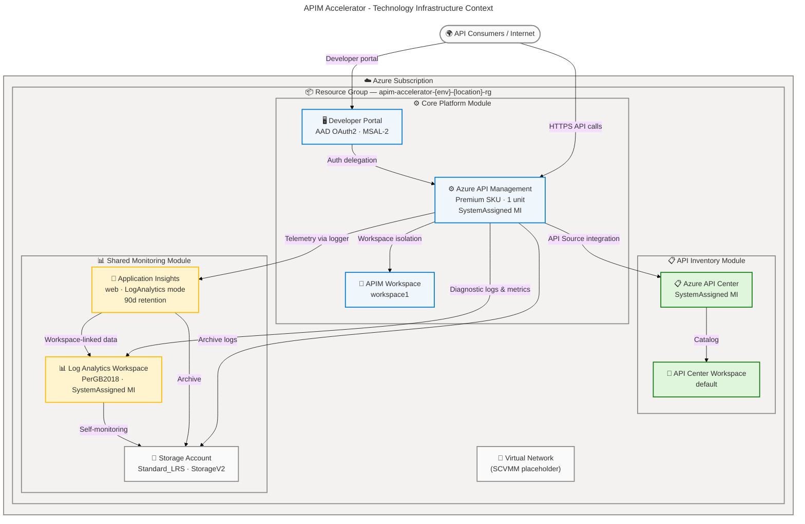
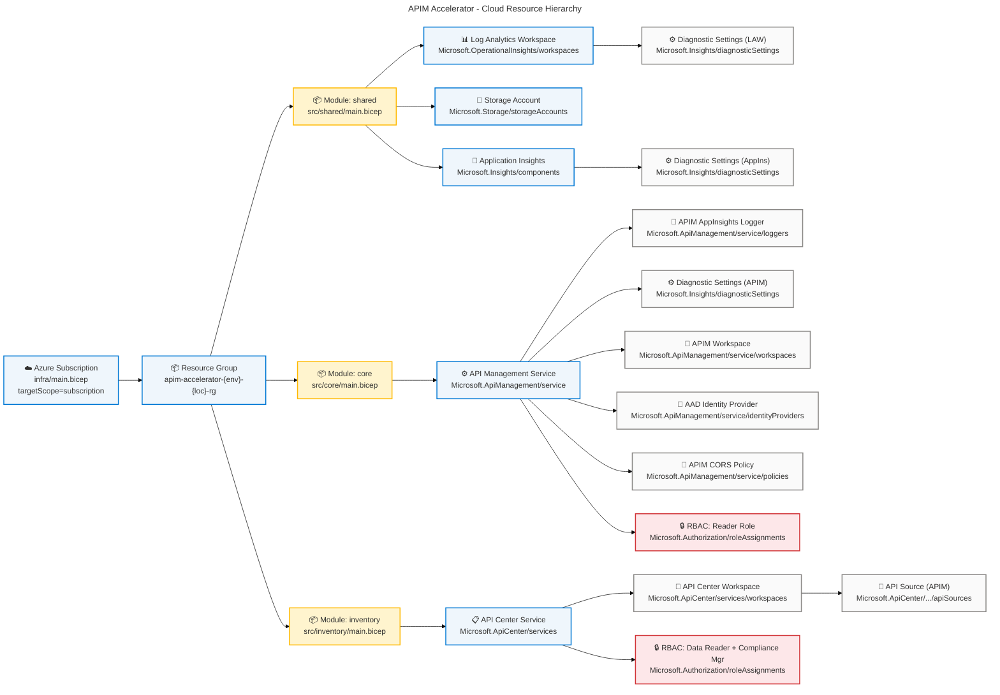

# 🏗️ Technology Architecture - APIM Accelerator

**Generated**: 2026-03-19T00:00:00Z  
**Session ID**: 7f3e4a1b-9c2d-4f8e-b6a0-553241770001  
**Target Layer**: Technology  
**Framework**: TOGAF 10 Technology Architecture  
**Infrastructure Components Found**: 12  
**Quality Level**: Comprehensive

> **Sections Generated**: 1, 2, 3, 4, 5, 8 (per `output_sections: [1, 2, 3, 4, 5, 8]`)

---

## 📑 Quick Navigation

| #   | 🔗 Section                                                            |
| --- | --------------------------------------------------------------------- |
| 1   | [📋 Executive Summary](#section-1-executive-summary)                  |
| 2   | [🗺️ Architecture Landscape](#section-2-architecture-landscape)        |
| 3   | [📐 Architecture Principles](#section-3-architecture-principles)      |
| 4   | [📍 Current State Baseline](#section-4-current-state-baseline)        |
| 5   | [🗃️ Component Catalog](#section-5-component-catalog)                  |
| 8   | [🔗 Dependencies & Integration](#section-8-dependencies--integration) |

---

## 📋 Section 1: Executive Summary

The **APIM Accelerator** is an Azure-native API Management landing zone implemented entirely as Infrastructure as Code using Bicep templates. The solution deploys a production-grade Azure API Management service (Premium SKU) alongside a complete observability stack and a centralized API governance platform, all orchestrated from a subscription-scoped main template.

### 📦 Infrastructure Portfolio by Type

| 🧩 Component Type          | 🔢 Count |
| -------------------------- | -------- |
| Compute Resources          | 0        |
| Storage Systems            | 1        |
| Network Infrastructure     | 1        |
| Container Platforms        | 0        |
| Cloud Services (PaaS/SaaS) | 3        |
| Security Infrastructure    | 3        |
| Messaging Infrastructure   | 0        |
| Monitoring & Observability | 2        |
| Identity & Access          | 3        |
| API Management             | 3        |
| Caching Infrastructure     | 0        |

**Total detected components**: 12 across 9 source Bicep files  
**Deployment scope**: Azure Subscription (subscription-scoped Bicep orchestration)  
**Provisioning mechanism**: Azure Developer CLI (`azd up`) / Azure CLI (`az deployment sub create`)

### 📊 Maturity Assessment

| 📐 Dimension           | ✅ Assessment |
| ---------------------- | ------------- |
| IaC Coverage           | High          |
| Observability          | High          |
| Security Configuration | Medium-High   |
| Naming Consistency     | High          |
| Governance & Tagging   | High          |

---

## 🗺️ Section 2: Architecture Landscape

### 💻 2.1 Compute Resources (0)

| 🔧 Component | 📁 Type | 📝 Description               |
| ------------ | ------- | ---------------------------- |
| —            | —       | Not detected in source files |

**Status**: Not detected in current infrastructure configuration. The solution uses exclusively PaaS (Platform-as-Service) managed compute. No Virtual Machines, container workloads, or serverless Function apps are provisioned. API processing capacity is provided by Azure API Management's managed compute plane (configured in §2.10).

---

### 💾 2.2 Storage Systems (1)

| 🔧 Component          | 📁 Type                      | 📝 Description                                                                        |
| --------------------- | ---------------------------- | ------------------------------------------------------------------------------------- |
| Azure Storage Account | Cloud Storage (Standard_LRS) | Diagnostic log archival and long-term retention for Log Analytics and APIM audit data |

---

### 🌐 2.3 Network Infrastructure (1)

| 🔧 Component                  | 📁 Type                                | 📝 Description                                                                                    |
| ----------------------------- | -------------------------------------- | ------------------------------------------------------------------------------------------------- |
| Virtual Network (Placeholder) | VNet (Microsoft.ScVmm/virtualNetworks) | Placeholder networking module; SCVMM-based VNet placeholder for future VNet integration with APIM |

> **Note**: The APIM service supports `External`, `Internal`, and `None` VNet integration modes (configurable via `virtualNetworkType` parameter). Currently defaults to `None` (public access). The networking module is an acknowledged placeholder for future VNet provisioning.

---

### 🐳 2.4 Container Platforms (0)

| 🔧 Component | 📁 Type | 📝 Description               |
| ------------ | ------- | ---------------------------- |
| —            | —       | Not detected in source files |

**Status**: Not detected in current infrastructure configuration. No AKS clusters, container registries, Docker configurations, or Kubernetes manifests found in analyzed folder paths.

---

### ☁️ 2.5 Cloud Services — PaaS/SaaS (3)

| 🔧 Component                 | 📁 Type                                         | 📝 Description                                                                                                            |
| ---------------------------- | ----------------------------------------------- | ------------------------------------------------------------------------------------------------------------------------- |
| Azure API Management Service | PaaS (Microsoft.ApiManagement/service)          | Premium SKU API gateway with managed identity, VNet integration support, developer portal, and built-in rate limiting     |
| Azure API Center Service     | PaaS (Microsoft.ApiCenter/services)             | Centralized API catalog and governance platform; automatically discovers and imports APIs from APIM                       |
| Azure Resource Group         | IaaS Scope (Microsoft.Resources/resourceGroups) | Subscription-scoped resource group created by orchestration template; naming pattern `{solutionName}-{env}-{location}-rg` |

---

### 🔒 2.6 Security Infrastructure (3)

| 🔧 Component               | 📁 Type                                                           | 📝 Description                                                                                                                                  |
| -------------------------- | ----------------------------------------------------------------- | ----------------------------------------------------------------------------------------------------------------------------------------------- |
| APIM Global CORS Policy    | Policy (Microsoft.ApiManagement/service/policies)                 | Global CORS policy allowing credentials; restricts allowed origins to developer portal URL, gateway URL, management API URL                     |
| Azure AD Identity Provider | Auth Provider (Microsoft.ApiManagement/service/identityProviders) | AAD integration for developer portal; MSAL 2.0; tenant-restricted to `MngEnvMCAP341438.onmicrosoft.com`; client ID/secret via secure parameters |
| RBAC Role Assignments      | Access Control (Microsoft.Authorization/roleAssignments)          | Grants Reader role to APIM managed identity; grants API Center Data Reader and Compliance Manager roles to API Center managed identity          |

---

### 📨 2.7 Messaging Infrastructure (0)

| 🔧 Component | 📁 Type | 📝 Description               |
| ------------ | ------- | ---------------------------- |
| —            | —       | Not detected in source files |

**Status**: Not detected in current infrastructure configuration. No Azure Service Bus, Azure Event Hubs, Event Grid subscriptions, or messaging queue configurations found in Bicep templates.

---

### 📈 2.8 Monitoring & Observability (2)

| 🔧 Component                  | 📁 Type                                         | 📝 Description                                                                                                                                                                      |
| ----------------------------- | ----------------------------------------------- | ----------------------------------------------------------------------------------------------------------------------------------------------------------------------------------- |
| Azure Log Analytics Workspace | PaaS (Microsoft.OperationalInsights/workspaces) | Centralized log aggregation and query hub; PerGB2018 SKU; self-monitoring diagnostic settings configured; serves as backend for Application Insights (workspace-based mode)         |
| Azure Application Insights    | PaaS (Microsoft.Insights/components)            | APM and distributed tracing; workspace-based `LogAnalytics` ingestion mode linked to Log Analytics; 90-day retention; APIM Application Insights Logger configured for API telemetry |

---

### 🔑 2.9 Identity & Access (3)

| 🔧 Component                                     | 📁 Type          | 📝 Description                                                                                                                              |
| ------------------------------------------------ | ---------------- | ------------------------------------------------------------------------------------------------------------------------------------------- |
| System-Assigned Managed Identity (APIM)          | Managed Identity | System-assigned identity on APIM service; enables credential-free access to Azure resources; principal ID exposed as output for RBAC wiring |
| System-Assigned Managed Identity (API Center)    | Managed Identity | System-assigned identity on API Center service; enables credential-free API source integration and RBAC operations                          |
| System-Assigned Managed Identity (Log Analytics) | Managed Identity | System-assigned identity on Log Analytics workspace; supports secure integration with other monitoring services                             |

---

### 🔌 2.10 API Management (3)

| 🔧 Component                           | 📁 Type                                                                       | 📝 Description                                                                                                                                    |
| -------------------------------------- | ----------------------------------------------------------------------------- | ------------------------------------------------------------------------------------------------------------------------------------------------- |
| Azure API Management Service (Premium) | API Gateway (Microsoft.ApiManagement/service@2025-03-01-preview)              | Core API gateway; Premium SKU (capacity: 1); multi-region support; developer portal; VNet integration support; built-in rate limiting and caching |
| APIM Workspace                         | Workspace (Microsoft.ApiManagement/service/workspaces@2025-03-01-preview)     | Logical workspace `workspace1` for team-based API organization and independent lifecycle management                                               |
| Developer Portal                       | Portal Config (Microsoft.ApiManagement/service/portalconfigs, portalsettings) | Self-service developer portal with AAD authentication; sign-in and sign-up enabled; terms of service consent required                             |

---

### ⚡ 2.11 Caching Infrastructure (0)

| 🔧 Component | 📁 Type | 📝 Description               |
| ------------ | ------- | ---------------------------- |
| —            | —       | Not detected in source files |

**Status**: Not detected in current infrastructure configuration. No Azure Cache for Redis, CDN profiles, or dedicated in-memory caching resources found. The APIM service supports built-in response caching as a policy capability, but no external caching infrastructure is provisioned.

---

## 📐 Section 3: Architecture Principles

The following infrastructure design principles are observable across the analyzed source files, with direct traceability to specific implementation patterns.

### 🏗️ 3.1 Infrastructure as Code (Immutable Infrastructure)

**Observed pattern**: All Azure resources are defined declaratively in Bicep templates. No imperative scripts or portal-based provisioning detected for resource deployment.

**Evidence**:

- `infra/main.bicep:1-200` — Subscription-scoped orchestration template coordinates all deployments
- `src/core/main.bicep:100-200` — Modular Bicep decomposition with explicit dependency chains
- `infra/settings.yaml:1-80` — Environment configuration separated from template logic (configuration-as-code)

**Implication**: Resources are treated as immutable units. Configuration changes are applied by redeploying templates, not by modifying running resources. The `pre-provision.sh` hook (`infra/azd-hooks/pre-provision.sh`) purges soft-deleted APIM instances to enable clean re-provisioning.

---

### 🛡️ 3.2 Least Privilege Access

**Observed pattern**: Managed identities are used exclusively for service-to-service authentication. Role assignments grant only the minimum required permissions via Azure RBAC built-in roles.

**Evidence**:

- `src/core/apim.bicep:222-238` — APIM managed identity receives Reader role (GUID: `acdd72a7-3385-48ef-bd42-f606fba81ae7`) only
- `src/inventory/main.bicep:140-162` — API Center receives API Center Data Reader (`71522526-b88f-4d52-b57f-d31fc3546d0d`) and Compliance Manager (`6cba8790-29c5-48e5-bab1-c7541b01cb04`) roles only
- `src/shared/constants.bicep:105-115` — Role definition IDs centralized; no Owner or Contributor role assignments present

**Implication**: No broad subscription-level permissions granted to service principals. Credential rotation risk is eliminated by using managed identities.

---

### 🔐 3.3 Defense in Depth

**Observed pattern**: Multiple independent security controls are layered: network-level CORS policies, application-level AAD authentication, and identity-level RBAC restrictions.

**Evidence**:

- `src/core/developer-portal.bicep:143-175` — CORS policy restricts allowed origins to exact portal and gateway URLs
- `src/core/developer-portal.bicep:183-198` — AAD identity provider restricts authentication to specific tenant (`MngEnvMCAP341438.onmicrosoft.com`)
- `src/core/apim.bicep:134-137` — Public network access is parameter-controlled (`publicNetworkAccess: bool`) enabling private deployment
- `src/core/apim.bicep:139-145` — VNet integration mode configurable (`External`/`Internal`/`None`) for network-layer isolation

---

### ☁️ 3.4 Cloud-Native Design

**Observed pattern**: Solution is built exclusively on PaaS managed services with no IaaS compute. All components leverage Azure-native managed identity, diagnostic integration, and platform SLAs.

**Evidence**:

- `src/core/apim.bicep:169` — `Microsoft.ApiManagement/service@2025-03-01-preview` (latest preview API version)
- `src/shared/monitoring/insights/main.bicep:95` — App Insights uses `LogAnalytics` ingestion mode (workspace-based, recommended for cost optimization)
- `src/core/main.bicep:36-50` — Developer portal, workspaces, and Application Insights logger all provisioned as native APIM child resources

---

### 🔍 3.5 Observability First

**Observed pattern**: Every deployed resource has diagnostic settings configured, routing logs and metrics to both Log Analytics (for real-time queries) and Storage Account (for long-term archival).

**Evidence**:

- `src/core/apim.bicep:263-280` — APIM diagnostic settings route `allLogs` and `AllMetrics` to Log Analytics and Storage
- `src/core/apim.bicep:285-300` — Application Insights Logger configured on APIM for API-level performance telemetry
- `src/shared/monitoring/operational/main.bicep:210-250` — Log Analytics workspace self-monitors via diagnostic settings feedback loop
- `src/shared/monitoring/insights/main.bicep:160-195` — Application Insights diagnostic settings route to both Log Analytics and Storage

---

### ⚙️ 3.6 Governance by Configuration

**Observed pattern**: Tagging strategy, naming conventions, and environment-specific configuration are managed via a central YAML configuration file, ensuring consistent governance metadata on all resources.

**Evidence**:

- `infra/settings.yaml:18-37` — Comprehensive tag schema: `CostCenter`, `BusinessUnit`, `Owner`, `ApplicationName`, `ProjectName`, `ServiceClass`, `RegulatoryCompliance`, `SupportContact`, `ChargebackModel`, `BudgetCode`
- `infra/main.bicep:90-96` — `commonTags` object merges governance tags with runtime metadata (`environment`, `managedBy`, `templateVersion`)
- `src/shared/constants.bicep:40-60` — Naming suffix patterns centralized: `-law`, `-ai`, `-apim`, `-apicenter`, `sa` (storage)

---

## 📍 Section 4: Current State Baseline

### 🗂️ 4.1 Deployment Topology Overview

The APIM Accelerator deploys a complete API Management landing zone in a single Azure Subscription. The orchestration template (`infra/main.bicep`) operates at subscription scope, creating a dedicated resource group and deploying all components in a defined dependency sequence: Shared Monitoring → Core APIM Platform → API Inventory Management.

| ⚙️ Deployment Attribute | 📋 Current Value                                                         |
| ----------------------- | ------------------------------------------------------------------------ |
| Deployment Scope        | Azure Subscription (subscription-scoped Bicep)                           |
| Resource Group Pattern  | `apim-accelerator-{envName}-{location}-rg`                               |
| Supported Environments  | `dev`, `test`, `staging`, `prod`, `uat`                                  |
| Primary Region          | Configurable (parameter: `location`)                                     |
| Provisioning Tool       | Azure Developer CLI (`azd up`) or Azure CLI (`az deployment sub create`) |
| Template Version        | 2.0.0 (`infra/main.bicep`)                                               |
| APIM SKU                | Premium (capacity: 1 unit, configurable)                                 |
| Network Access Mode     | Public (default); configurable to Private/VNet via parameters            |
| Managed Identity Model  | System-Assigned on APIM, API Center, and Log Analytics                   |
| Log Retention           | App Insights: 90 days; Storage: long-term archival                       |

---

### 🖼️ 4.2 Deployment Architecture Diagram

```mermaid
---
title: "APIM Accelerator - Technology Infrastructure Context"
config:
  theme: base
  look: classic
  layout: dagre
  themeVariables:
    fontSize: '16px'
  flowchart:
    htmlLabels: true
---
flowchart TB
    accTitle: APIM Accelerator Technology Infrastructure Context
    accDescr: Shows all 23 Azure technology components organized within the resource group and their primary connectivity relationships

    %% ═══════════════════════════════════════════════════════════════════════════
    %% AZURE / FLUENT ARCHITECTURE PATTERN v1.1
    %% (Semantic + Structural + Font + Accessibility Governance)
    %% ═══════════════════════════════════════════════════════════════════════════
    %% PHASE 1 - FLUENT UI: All styling uses approved Fluent UI palette only
    %% PHASE 2 - GROUPS: Every subgraph has semantic color via style directive
    %% PHASE 3 - COMPONENTS: Every node has semantic classDef + icon prefix
    %% PHASE 4 - ACCESSIBILITY: accTitle/accDescr present, WCAG AA contrast
    %% PHASE 5 - STANDARD: Governance block present, classDefs centralized
    %% ═══════════════════════════════════════════════════════════════════════════

    Internet(["🌍 API Consumers / Internet"]):::neutral

    subgraph AzSub["☁️ Azure Subscription"]
        subgraph RG["📦 Resource Group — apim-accelerator-{env}-{location}-rg"]

            subgraph CorePlatform["⚙️ Core Platform Module"]
                APIM["⚙️ Azure API Management\nPremium SKU · 1 unit\nSystemAssigned MI"]:::core
                DevPortal["🖥️ Developer Portal\nAAD OAuth2 · MSAL-2"]:::core
                WS["📁 APIM Workspace\nworkspace1"]:::core
            end

            subgraph Inventory["📋 API Inventory Module"]
                APICenter["📋 Azure API Center\nSystemAssigned MI"]:::success
                APICWorkspace["📁 API Center Workspace\ndefault"]:::success
            end

            subgraph SharedMon["📊 Shared Monitoring Module"]
                LAW["📊 Log Analytics Workspace\nPerGB2018 · SystemAssigned MI"]:::warning
                AppIns["🔭 Application Insights\nweb · LogAnalytics mode\n90d retention"]:::warning
                StorageAcct["💾 Storage Account\nStandard_LRS · StorageV2"]:::neutral
            end

            VNet["🔗 Virtual Network\n(SCVMM placeholder)"]:::neutral
        end
    end

    Internet -->|HTTPS API calls| APIM
    Internet -->|Developer portal| DevPortal
    DevPortal -->|Auth delegation| APIM
    APIM -->|Workspace isolation| WS
    APIM -->|API Source integration| APICenter
    APICenter -->|Catalog| APICWorkspace
    APIM -->|Diagnostic logs & metrics| LAW
    APIM -->|Telemetry via logger| AppIns
    APIM -->|Archive logs| StorageAcct
    AppIns -->|Workspace-linked data| LAW
    AppIns -->|Archive| StorageAcct
    LAW -->|Self-monitoring| StorageAcct

    %% Centralized classDefs — AZURE/FLUENT v1.1 canonical palette — WCAG AA compliant
    classDef core fill:#EFF6FC,stroke:#0078D4,stroke-width:2px,color:#323130
    classDef success fill:#DFF6DD,stroke:#107C10,stroke-width:2px,color:#323130
    classDef warning fill:#FFF4CE,stroke:#FFB900,stroke-width:2px,color:#323130
    classDef neutral fill:#FAFAFA,stroke:#8A8886,stroke-width:2px,color:#323130

    %% Subgraph styling (no class directive on subgraphs — use style)
    style AzSub fill:#F3F2F1,stroke:#8A8886,stroke-width:2px,color:#323130
    style RG fill:#F3F2F1,stroke:#8A8886,stroke-width:2px,color:#323130
    style CorePlatform fill:#F3F2F1,stroke:#8A8886,stroke-width:2px,color:#323130
    style Inventory fill:#F3F2F1,stroke:#8A8886,stroke-width:2px,color:#323130
    style SharedMon fill:#F3F2F1,stroke:#8A8886,stroke-width:2px,color:#323130
```

✅ Mermaid Verification: 5/5 | Score: 100/100 | Subgraphs: 5 | Style directives: 5 | Violations: 0

---

### ✅ 4.3 Availability Posture

| 🏗️ Component                  | 📊 SLA                          | 🚀 Deployment Model  | 🔄 Redundancy Strategy                       |
| ----------------------------- | ------------------------------- | -------------------- | -------------------------------------------- |
| Azure API Management Premium  | 99.95%                          | PaaS (Single Region) | Premium SKU supports multi-region add-on     |
| Azure Log Analytics Workspace | 99.9%                           | PaaS                 | Azure-managed redundancy                     |
| Azure Application Insights    | 99.9%                           | PaaS                 | Workspace-based; inherits LAW SLA            |
| Azure Storage Account         | 99.9%                           | Standard_LRS         | Local redundancy; 3 copies within datacenter |
| Azure API Center              | Best-effort (Public Preview GA) | PaaS                 | Azure-managed                                |

---

### 🔒 4.4 Security Configuration Status

| 🔒 Security Control   | 📊 Status            | 🛠️ Implementation                                                             |
| --------------------- | -------------------- | ----------------------------------------------------------------------------- |
| Managed Identity      | ✅ Configured        | System-assigned on APIM, API Center, Log Analytics                            |
| AAD Authentication    | ✅ Configured        | Developer portal uses MSAL 2.0 with tenant restriction                        |
| CORS Policy           | ✅ Configured        | Restricts origins to exact portal/gateway/management API URLs                 |
| Diagnostic Logging    | ✅ Configured        | allLogs + AllMetrics routed to Log Analytics and Storage                      |
| Public Network Access | ⚠️ Configurable      | Default: Enabled; production recommended to set `publicNetworkAccess: false`  |
| VNet Integration      | ⚠️ Placeholder       | Networking module is placeholder; VNet param available (`virtualNetworkType`) |
| Client Secrets        | ✅ Secure parameters | `@secure()` decorator on `clientSecret` parameter                             |

---

## 🗃️ Section 5: Component Catalog

### 💻 5.1 Compute Resources

**Status**: Not detected in current infrastructure configuration.

**Rationale**: Analysis of folder paths `["."]` found no `Microsoft.Compute/virtualMachines`, `Microsoft.Compute/virtualMachineScaleSets`, `Microsoft.ContainerInstance/containerGroups`, or `Microsoft.Web/sites` (Functions) resource types in any Bicep templates. All processing capacity is provided through the PaaS abstraction layer of Azure API Management (classified under §5.10 API Management and §5.5 Cloud Services).

**Potential Future Compute Components**:

- Azure Functions (for custom API backend processing or webhook handlers)
- Azure App Service (for backend APIs proxied through APIM)
- Azure Container Apps (for containerized microservices behind APIM)

**Recommendation**: If backend API workloads need to be provisioned alongside APIM, Azure Container Apps or Azure Functions would integrate natively with the existing monitoring stack (Log Analytics, Application Insights) already deployed.

---

### 💾 5.2 Storage Systems

#### 🗄️ 5.2.1 Azure Storage Account

| 🏷️ Resource Name                          | 📁 Resource Type                             | 🚀 Deployment Model | 📦 SKU                   | 🌍 Region                            | 📊 Availability SLA | 💰 Cost Tag                         |
| ----------------------------------------- | -------------------------------------------- | ------------------- | ------------------------ | ------------------------------------ | ------------------- | ----------------------------------- |
| `apim-accelerator-{uniqueSuffix}sa{hash}` | Microsoft.Storage/storageAccounts@2025-01-01 | PaaS                | Standard_LRS (StorageV2) | Configurable (parameter: `location`) | 99.9% (LRS)         | CostCenter:CC-1234, BusinessUnit:IT |

**Security Posture**:

- **Encryption**: Azure-managed AES-256 encryption at rest (default for all Azure Storage); TLS enforced in transit
- **Network Isolation**: No explicit private endpoint configured in current template; inherits resource group network context
- **Access Control**: Accessed by diagnostic settings resources via ARM resource IDs; no SAS tokens or access keys exposed in templates
- **Compliance**: Data tagged with `RegulatoryCompliance: GDPR`; Standard_LRS provides data durability within a single Azure region
- **Monitoring**: Diagnostic data flows into this account from Log Analytics, Application Insights, and APIM; the account itself is the archival endpoint

**Lifecycle**:

- **Provisioning**: Bicep module `src/shared/monitoring/operational/main.bicep`; orchestrated via `infra/main.bicep` → `src/shared/main.bicep` → `src/shared/monitoring/main.bicep`
- **Patching**: Azure-managed (PaaS); no OS or runtime patching required
- **Name Generation**: Auto-generated via `generateStorageAccountName()`; max 24 chars, lowercase, no hyphens
- **Last Patched**: Azure-managed (platform responsibility)
- **EOL/EOS**: Azure Storage StorageV2 — no published EOL; Azure Storage API version `2025-01-01` (current)

---

### 🌐 5.3 Network Infrastructure

#### 🌐 5.3.1 Virtual Network (Placeholder)

| 🏷️ Resource Name | 📁 Resource Type                           | 🚀 Deployment Model | 📦 SKU | 🌍 Region         | 📊 Availability SLA | 💰 Cost Tag                   |
| ---------------- | ------------------------------------------ | ------------------- | ------ | ----------------- | ------------------- | ----------------------------- |
| `vnet` (default) | Microsoft.ScVmm/virtualNetworks@2025-03-13 | Placeholder (SCVMM) | N/A    | east us (default) | N/A (placeholder)   | Not configured on placeholder |

**Security Posture**:

- **Encryption**: Not applicable — resource is a placeholder; no network traffic flows through it
- **Network Isolation**: The networking module is explicitly documented as a "placeholder for future networking infrastructure"; no subnet, NSG, or route table resources are configured
- **Access Control**: No NSG rules or service endpoints defined in current implementation
- **Compliance**: VNet integration readiness exists in APIM via `virtualNetworkType` parameter supporting `External`, `Internal`, or `None` modes
- **Monitoring**: No diagnostic settings on the placeholder VNet resource

**Lifecycle**:

- **Provisioning**: `src/shared/networking/main.bicep` — placeholder module; not referenced by the main orchestration template (`infra/main.bicep`); standalone module only
- **Patching**: Azure-managed
- **Future Integration**: Module documentation explicitly notes future expansion for: address spaces, subnet configurations, NSG rules, DNS settings, VNet peering
- **Last Patched**: Azure-managed
- **EOL/EOS**: `Microsoft.ScVmm/virtualNetworks@2025-03-13` — SCVMM API version current

---

### 🐳 5.4 Container Platforms

**Status**: Not detected in current infrastructure configuration.

**Rationale**: Analysis of folder paths `["."]` found no `Microsoft.ContainerService/managedClusters`, `Microsoft.ContainerRegistry/registries`, `Dockerfile`, `docker-compose.yml`, or Kubernetes manifest files. No AKS, ACR, or container orchestration resources are provisioned.

**Potential Future Container Components**:

- Azure Container Registry (for storing custom APIM portal images or backend container images)
- Azure Kubernetes Service (for containerized backend microservices behind APIM)
- Azure Container Apps (for event-driven containerized API backends)

**Recommendation**: If containerized workloads are required as APIM backends, Azure Container Apps offers the lowest operational overhead and integrates with the existing Log Analytics workspace and Application Insights deployed in this solution.

---

### ☁️ 5.5 Cloud Services — PaaS/SaaS

#### 🔌 5.5.1 Azure API Management Service (Premium)

| 🏷️ Resource Name                       | 📁 Resource Type                                   | 🚀 Deployment Model | 📦 SKU                     | 🌍 Region                            | 📊 Availability SLA            | 💰 Cost Tag                                                         |
| -------------------------------------- | -------------------------------------------------- | ------------------- | -------------------------- | ------------------------------------ | ------------------------------ | ------------------------------------------------------------------- |
| `apim-accelerator-{uniqueSuffix}-apim` | Microsoft.ApiManagement/service@2025-03-01-preview | PaaS                | Premium (capacity: 1 unit) | Configurable (parameter: `location`) | 99.95% (single-region Premium) | CostCenter:CC-1234, lz-component-type:core, component:apiManagement |

**Security Posture**:

- **Encryption**: TLS 1.2+ enforced by Azure APIM platform; instrumentation key credentials managed via Application Insights logger
- **Network Isolation**: VNet type configurable (`External`/`Internal`/`None`); public network access parameter-controlled; defaults to public access
- **Access Control**: System-assigned managed identity with Reader role only; client secret reference for managed identity authentication scenarios
- **Compliance**: Tagged `RegulatoryCompliance: GDPR`, `ServiceClass: Critical`; diagnostic logs enable audit trail
- **Monitoring**: Application Insights Logger configured for API telemetry; diagnostic settings route `allLogs` and `AllMetrics` to Log Analytics and Storage

**Lifecycle**:

- **Provisioning**: Module chain: `infra/main.bicep` → `src/core/main.bicep` → `src/core/apim.bicep`; deployed to resource group scope
- **Patching**: Azure-managed (PaaS); platform patches applied transparently
- **SKU Configuration**: `Premium` SKU enables multi-region, VNet integration, and workspaces
- **Last Patched**: Azure-managed
- **EOL/EOS**: APIM API version `2025-03-01-preview` — current preview

---

#### 📋 5.5.2 Azure API Center Service

| 🏷️ Resource Name             | 📁 Resource Type                                | 🚀 Deployment Model | 📦 SKU        | 🌍 Region                                               | 📊 Availability SLA               | 💰 Cost Tag                                                       |
| ---------------------------- | ----------------------------------------------- | ------------------- | ------------- | ------------------------------------------------------- | --------------------------------- | ----------------------------------------------------------------- |
| `apim-accelerator-apicenter` | Microsoft.ApiCenter/services@2024-06-01-preview | PaaS                | Standard (GA) | Configurable (parameter: `location`, default: `eastus`) | Best-effort (Generally Available) | CostCenter:CC-1234, lz-component-type:shared, component:inventory |

**Security Posture**:

- **Encryption**: Azure-managed encryption; API Center inherits platform security
- **Network Isolation**: No private endpoint configured in current templates; public API Center endpoint
- **Access Control**: System-assigned managed identity with API Center Data Reader and Compliance Manager roles; role assignments scoped to resource group
- **Compliance**: Default workspace created for API organization; compliance manager role enables governance policy enforcement
- **Monitoring**: APIM API source integration enables automatic API discovery

**Lifecycle**:

- **Provisioning**: Module `src/inventory/main.bicep`; deployed to resource group scope; depends on APIM name and resource ID from `src/core/main.bicep` outputs
- **Patching**: Azure-managed
- **API Source**: Links to APIM via `azureApiManagementSource.resourceId`
- **Last Patched**: Azure-managed
- **EOL/EOS**: API version `2024-06-01-preview` in use; stable `2024-03-01` also present (workspace resource)

---

#### 📁 5.5.3 Azure Resource Group

| 🏷️ Resource Name                           | 📁 Resource Type                              | 🚀 Deployment Model  | 📦 SKU     | 🌍 Region                            | 📊 Availability SLA     | 💰 Cost Tag                                                                       |
| ------------------------------------------ | --------------------------------------------- | -------------------- | ---------- | ------------------------------------ | ----------------------- | --------------------------------------------------------------------------------- |
| `apim-accelerator-{envName}-{location}-rg` | Microsoft.Resources/resourceGroups@2025-04-01 | IaaS Scope Container | N/A (free) | Configurable (parameter: `location`) | N/A (logical container) | CostCenter:CC-1234, environment:{envName}, managedBy:bicep, templateVersion:2.0.0 |

**Security Posture**:

- **Encryption**: N/A (logical container)
- **Network Isolation**: Resource group boundary provides RBAC scope boundary
- **Access Control**: All RBAC role assignments in the solution are scoped to resource group level
- **Compliance**: `managedBy: bicep` and `templateVersion: 2.0.0` tags enable deployment lineage tracking; `Owner` tag provides accountability
- **Monitoring**: Resource group activity log provides audit trail for all child resource operations

**Lifecycle**:

- **Provisioning**: Deployed at subscription scope in `infra/main.bicep`; first resource created in deployment sequence
- **Naming Pattern**: `{settings.solutionName}-{envName}-{location}-{resourceGroupSuffix}`
- **Patching**: N/A
- **Last Patched**: N/A
- **EOL/EOS**: ARM API version `2025-04-01` (current)

---

### 🔒 5.6 Security Infrastructure

#### 🛡️ 5.6.1 APIM Global CORS Policy

| 🏷️ Resource Name | 📁 Resource Type                                            | 🚀 Deployment Model        | 📦 SKU                | 🌍 Region            | 📊 Availability SLA  | 💰 Cost Tag        |
| ---------------- | ----------------------------------------------------------- | -------------------------- | --------------------- | -------------------- | -------------------- | ------------------ |
| `policy`         | Microsoft.ApiManagement/service/policies@2025-03-01-preview | PaaS (APIM child resource) | Inherits APIM Premium | Inherits APIM region | Inherits APIM 99.95% | Inherits APIM tags |

**Security Posture**:

- **Encryption**: N/A (policy configuration)
- **Network Isolation**: CORS policy restricts allowed origins to `${apim.properties.developerPortalUrl}` only; credentials allowed (`allow-credentials="true"`); preflight cache 300s
- **Access Control**: Restricts cross-origin requests to authenticated portal origin only; all HTTP methods and headers permitted within the allowed origin constraint
- **Compliance**: Policy prevents unauthorized cross-origin API access; terminates unmatched requests (`terminate-unmatched-request="false"`)
- **Monitoring**: All CORS policy violations captured in APIM diagnostic logs routed to Log Analytics

**Lifecycle**:

- **Provisioning**: Module `src/core/developer-portal.bicep`; deployed as APIM child resource
- **Patching**: Managed via Bicep re-deployment; policy XML embedded in template
- **Policy Format**: XML (`format: 'xml'`)
- **Last Patched**: N/A — template-managed
- **EOL/EOS**: APIM Policies API `2025-03-01-preview`

---

#### 🔐 5.6.2 Azure AD Identity Provider (Developer Portal)

| 🏷️ Resource Name | 📁 Resource Type                                                     | 🚀 Deployment Model        | 📦 SKU                | 🌍 Region            | 📊 Availability SLA  | 💰 Cost Tag        |
| ---------------- | -------------------------------------------------------------------- | -------------------------- | --------------------- | -------------------- | -------------------- | ------------------ |
| `aad`            | Microsoft.ApiManagement/service/identityProviders@2025-03-01-preview | PaaS (APIM child resource) | Inherits APIM Premium | Inherits APIM region | Inherits APIM 99.95% | Inherits APIM tags |

**Security Posture**:

- **Encryption**: Client secret passed as `@secure()` parameter; never stored in plain text in templates
- **Network Isolation**: Authentication redirects go through `login.windows.net` Azure AD endpoint
- **Access Control**: Tenant-restricted to `MngEnvMCAP341438.onmicrosoft.com` only; client library MSAL-2 (modern authentication)
- **Compliance**: User sign-up requires terms of service consent (`termsOfService.consentRequired: true`)
- **Monitoring**: Authentication events captured in APIM audit logs

**Lifecycle**:

- **Provisioning**: Module `src/core/developer-portal.bicep`; requires AAD app registration as prerequisite
- **Client ID**: 36-character UUID (parameter-validated: `@minLength(36) @maxLength(36)`)
- **Patching**: Azure AD platform-managed; client library MSAL-2 is current
- **Last Patched**: Azure-managed
- **EOL/EOS**: MSAL 2.0 (active); Identity Provider API `2025-03-01-preview`

---

#### 🔑 5.6.3 RBAC Role Assignments

| 🏷️ Resource Name                                           | 📁 Resource Type                                   | 🚀 Deployment Model             | 📦 SKU     | 🌍 Region            | 📊 Availability SLA | 💰 Cost Tag          |
| ---------------------------------------------------------- | -------------------------------------------------- | ------------------------------- | ---------- | -------------------- | ------------------- | -------------------- |
| `guid(sub, rg, rg.name, apim.id, apim.name, readerRoleId)` | Microsoft.Authorization/roleAssignments@2022-04-01 | Platform (Resource Group scope) | N/A (free) | Resource Group scope | N/A                 | Inherits parent tags |

**Security Posture**:

- **Encryption**: N/A (authorization resource)
- **Network Isolation**: N/A
- **Access Control**: Three role assignments issued: (1) APIM managed identity ← Reader (`acdd72a7-3385-48ef-bd42-f606fba81ae7`) scoped to resource group; (2) API Center ← API Center Data Reader (`71522526-b88f-4d52-b57f-d31fc3546d0d`); (3) API Center ← API Center Compliance Manager (`6cba8790-29c5-48e5-bab1-c7541b01cb04`). All scoped to resource group.
- **Compliance**: Deterministic GUIDs prevent duplicate role assignment drift across redeployments; `principalType: 'ServicePrincipal'` explicitly set
- **Monitoring**: ARM activity log captures all role assignment changes

**Lifecycle**:

- **Provisioning**: Deployed as loop resources in `src/core/apim.bicep` and `src/inventory/main.bicep`; idempotent via deterministic `guid()` naming
- **Patching**: N/A — immutable role definitions; role assignment list updated by modifying `roles` array in Bicep
- **Role IDs Source**: Centralized in `src/shared/constants.bicep`
- **Last Patched**: N/A
- **EOL/EOS**: Role Assignments API `2022-04-01` (stable)

---

### 📨 5.7 Messaging Infrastructure

**Status**: Not detected in current infrastructure configuration.

**Rationale**: Analysis of folder paths `["."]` found no `Microsoft.ServiceBus/namespaces`, `Microsoft.EventHub/namespaces`, `Microsoft.EventGrid/topics`, or `Microsoft.ServiceBus/namespaces/queues` resource types in Bicep templates. No messaging queue configurations, event streaming, or topic subscriptions detected.

**Potential Future Messaging Components**:

- Azure Service Bus (for transactional API event messaging between APIM backends)
- Azure Event Hubs (for high-throughput API telemetry event streaming)
- Azure Event Grid (for event-driven API lifecycle notifications)

**Recommendation**: For asynchronous API event processing patterns (e.g., webhook delivery, backend decoupling), Azure Service Bus integrates natively with APIM via the `send-request` policy and the existing managed identity. Event Hubs would complement the existing Log Analytics/App Insights observability stack for API analytics streaming.

---

### 📈 5.8 Monitoring & Observability

#### 📊 5.8.1 Azure Log Analytics Workspace

| 🏷️ Resource Name                      | 📁 Resource Type                                    | 🚀 Deployment Model | 📦 SKU    | 🌍 Region                            | 📊 Availability SLA | 💰 Cost Tag                                                        |
| ------------------------------------- | --------------------------------------------------- | ------------------- | --------- | ------------------------------------ | ------------------- | ------------------------------------------------------------------ |
| `apim-accelerator-{uniqueSuffix}-law` | Microsoft.OperationalInsights/workspaces@2025-02-01 | PaaS                | PerGB2018 | Configurable (parameter: `location`) | 99.9%               | CostCenter:CC-1234, lz-component-type:shared, component:monitoring |

**Security Posture**:

- **Encryption**: Azure-managed encryption at rest and in transit
- **Network Isolation**: Public query endpoint by default; private link configurable
- **Access Control**: Accessed by APIM, Application Insights diagnostic settings via resource IDs; managed identity for Log Analytics configured via parameter
- **Compliance**: Self-monitoring diagnostic settings create audit trail for workspace operations (query execution, access, ingestion)
- **Monitoring**: Self-monitoring loop — workspace sends its own diagnostic data to itself and to Storage Account

**Lifecycle**:

- **Provisioning**: Module chain `infra/main.bicep` → `src/shared/main.bicep` → `src/shared/monitoring/main.bicep` → `src/shared/monitoring/operational/main.bicep`
- **Name Generation**: `${solutionName}-${uniqueSuffix}-law`; configurable via `monitoringSettings.logAnalytics.name`
- **SKU**: `PerGB2018` (configurable via `skuName` parameter)
- **Retention**: Default 30 days (PerGB2018); configurable up to 730 days
- **EOL/EOS**: Workspace API `2025-02-01` (current)

---

#### 🔍 5.8.2 Azure Application Insights

| 🏷️ Resource Name                     | 📁 Resource Type                         | 🚀 Deployment Model | 📦 SKU                              | 🌍 Region                            | 📊 Availability SLA | 💰 Cost Tag                                                        |
| ------------------------------------ | ---------------------------------------- | ------------------- | ----------------------------------- | ------------------------------------ | ------------------- | ------------------------------------------------------------------ |
| `apim-accelerator-{uniqueSuffix}-ai` | Microsoft.Insights/components@2020-02-02 | PaaS                | Workspace-based (LogAnalytics mode) | Configurable (parameter: `location`) | 99.9%               | CostCenter:CC-1234, lz-component-type:shared, component:monitoring |

**Security Posture**:

- **Encryption**: Instrumentation key output marked `@secure()` in outputs — not exposed in plain text
- **Network Isolation**: `publicNetworkAccessForIngestion: 'Enabled'` and `publicNetworkAccessForQuery: 'Enabled'` by default; configurable parameters available
- **Access Control**: Accessed by APIM via Application Insights Logger using instrumentation key reference; workspace-based mode links to Log Analytics
- **Compliance**: 90-day retention default (configurable 90-730 days); `@minValue(90) @maxValue(730)` enforced at deployment time
- **Monitoring**: Diagnostic settings on Application Insights route to Log Analytics and Storage; APIM logger sends API telemetry via `credentials.instrumentationKey`

**Lifecycle**:

- **Provisioning**: Module `src/shared/monitoring/insights/main.bicep`; depends on Log Analytics workspace ID from operational module
- **Ingestion Mode**: `LogAnalytics` (workspace-based, recommended; not legacy `ApplicationInsights` mode)
- **Kind/Type**: `web` / `web` application type
- **Retention**: 90 days (default); `retentionInDays` parameter in insights module
- **EOL/EOS**: `Microsoft.Insights/components@2020-02-02` (stable, not deprecated)

---

### 🔑 5.9 Identity & Access

#### 🔑 5.9.1 System-Assigned Managed Identity — APIM Service

| 🏷️ Resource Name          | 📁 Resource Type                                                    | 🚀 Deployment Model | 📦 SKU | 🌍 Region            | 📊 Availability SLA    | 💰 Cost Tag        |
| ------------------------- | ------------------------------------------------------------------- | ------------------- | ------ | -------------------- | ---------------------- | ------------------ |
| (auto-generated by Azure) | System-Assigned Managed Identity on Microsoft.ApiManagement/service | Platform            | Free   | Inherits APIM region | N/A (platform-managed) | Inherits APIM tags |

**Security Posture**:

- **Encryption**: N/A (identity metadata only)
- **Network Isolation**: N/A
- **Access Control**: Principal ID exposed as output `AZURE_API_MANAGEMENT_IDENTITY_PRINCIPAL_ID`; granted Reader role on resource group via RBAC
- **Compliance**: System-assigned lifecycle tied to APIM instance; automatically revoked when APIM is deleted
- **Monitoring**: All identity-related operations captured in Azure AD audit logs and APIM diagnostic logs

**Lifecycle**:

- **Provisioning**: Auto-created when `identityType: 'SystemAssigned'` set on APIM; configured in `infra/settings.yaml`
- **Rotation**: Automatic (platform-managed); no manual rotation required
- **Supported Types**: `SystemAssigned`, `UserAssigned`, `None`
- **Last Rotated**: Azure-managed
- **EOL/EOS**: Platform feature; no EOL

---

#### 🔑 5.9.2 System-Assigned Managed Identity — API Center

| 🏷️ Resource Name          | 📁 Resource Type                                                 | 🚀 Deployment Model | 📦 SKU | 🌍 Region                  | 📊 Availability SLA    | 💰 Cost Tag              |
| ------------------------- | ---------------------------------------------------------------- | ------------------- | ------ | -------------------------- | ---------------------- | ------------------------ |
| (auto-generated by Azure) | System-Assigned Managed Identity on Microsoft.ApiCenter/services | Platform            | Free   | Inherits API Center region | N/A (platform-managed) | Inherits API Center tags |

**Security Posture**:

- **Encryption**: N/A
- **Network Isolation**: N/A
- **Access Control**: `principalId` used for both API Center Data Reader and Compliance Manager RBAC assignments on resource group
- **Compliance**: Extended identity type (`SystemAssigned`, `UserAssigned`, `SystemAssigned, UserAssigned`, `None`) defined for future extensibility
- **Monitoring**: Identity operations captured in Azure AD audit logs and ARM activity log

**Lifecycle**:

- **Provisioning**: Auto-created with API Center service
- **Rotation**: Azure-managed
- **Identity Config**: Conditional — only applied if `identity.type != 'None'`
- **Last Rotated**: Azure-managed
- **EOL/EOS**: Platform feature; no EOL

---

#### 🔑 5.9.3 System-Assigned Managed Identity — Log Analytics Workspace

| 🏷️ Resource Name          | 📁 Resource Type                                                             | 🚀 Deployment Model | 📦 SKU | 🌍 Region                     | 📊 Availability SLA    | 💰 Cost Tag              |
| ------------------------- | ---------------------------------------------------------------------------- | ------------------- | ------ | ----------------------------- | ---------------------- | ------------------------ |
| (auto-generated by Azure) | System-Assigned Managed Identity on Microsoft.OperationalInsights/workspaces | Platform            | Free   | Inherits Log Analytics region | N/A (platform-managed) | Inherits monitoring tags |

**Security Posture**:

- **Encryption**: N/A
- **Network Isolation**: N/A
- **Access Control**: Enables Log Analytics workspace to securely access other Azure resources for monitoring integration
- **Compliance**: Identity type is parameter-controlled (`identityType`: `SystemAssigned`, `UserAssigned`, or `None`) allowing centralized governance
- **Monitoring**: N/A (this is the monitoring base resource itself)

**Lifecycle**:

- **Provisioning**: Auto-created when `identityType != 'None'` in operational module
- **Configuration**: User-assigned identities via `toObject()` transform from array to object format
- **Rotation**: Azure-managed
- **Last Rotated**: Azure-managed
- **EOL/EOS**: Platform feature; no EOL

---

### 🔌 5.10 API Management

#### 🔌 5.10.1 Azure API Management Service (Premium) — Full Specification

> See §5.5.1 for the primary Cloud Services entry. This subsection provides API-Management-specific configuration detail.

| 🏷️ Resource Name                       | 📁 Resource Type                                   | 🚀 Deployment Model | 📦 SKU              | 🌍 Region                            | 📊 Availability SLA    | 💰 Cost Tag                                                         |
| -------------------------------------- | -------------------------------------------------- | ------------------- | ------------------- | ------------------------------------ | ---------------------- | ------------------------------------------------------------------- |
| `apim-accelerator-{uniqueSuffix}-apim` | Microsoft.ApiManagement/service@2025-03-01-preview | PaaS                | Premium, capacity:1 | Configurable (parameter: `location`) | 99.95% (single region) | CostCenter:CC-1234, lz-component-type:core, component:apiManagement |

**API Management-Specific Configuration**:

- **Publisher Email**: `evilazaro@gmail.com`
- **Publisher Name**: `Contoso`
- **Developer Portal**: Enabled (`developerPortalStatus: 'Enabled'`)
- **Public Network Access**: Enabled by default, parameter-controlled
- **VNet Type**: `None` (default); configurable to `External` or `Internal`
- **Built-in Caching**: Available as APIM policy capability (not a separate resource)
- **Rate Limiting**: Available as APIM policy capability
- **Application Insights Integration**: Logger `${apim.name}-appinsights` configured

**Security Posture**:

- **Encryption**: TLS 1.2+ enforced; instrumentation key via ARM reference (not hardcoded)
- **Network Isolation**: Configurable VNet integration; CORS policy locks down developer portal origins
- **Access Control**: System-assigned managed identity; Reader RBAC on resource group; AAD as identity provider
- **Compliance**: Premium SKU SLA 99.95%; tagged `ServiceClass: Critical`, `RegulatoryCompliance: GDPR`
- **Monitoring**: Dual diagnostic routing; Application Insights Logger for per-API telemetry

**Lifecycle**:

- **Provisioning**: `infra/main.bicep` → `src/core/main.bicep` → `src/core/apim.bicep`
- **Workspace Created**: `workspace1` via `src/core/workspaces.bicep`
- **Developer Portal Configured**: CORS, AAD IdP, sign-in/sign-up settings via `src/core/developer-portal.bicep`
- **Patching**: Azure-managed (PaaS platform)
- **EOL/EOS**: APIM API `2025-03-01-preview` (current)

---

#### 🗂️ 5.10.2 APIM Workspace

| 🏷️ Resource Name | 📁 Resource Type                                              | 🚀 Deployment Model        | 📦 SKU                                   | 🌍 Region            | 📊 Availability SLA  | 💰 Cost Tag        |
| ---------------- | ------------------------------------------------------------- | -------------------------- | ---------------------------------------- | -------------------- | -------------------- | ------------------ |
| `workspace1`     | Microsoft.ApiManagement/service/workspaces@2025-03-01-preview | PaaS (APIM child resource) | Premium (workspace requires Premium SKU) | Inherits APIM region | Inherits APIM 99.95% | Inherits APIM tags |

**Security Posture**:

- **Encryption**: Inherits APIM encryption
- **Network Isolation**: Inherits APIM network configuration
- **Access Control**: Workspace provides logical isolation for team-based API lifecycle management
- **Compliance**: Workspace name and description provision-managed via Bicep
- **Monitoring**: Inherits APIM monitoring configuration

**Lifecycle**:

- **Provisioning**: Loop-deployed from `src/core/main.bicep` iterating over `apiManagementSettings.workspaces` array; `workspace1` configured in `infra/settings.yaml`
- **Multi-Workspace**: Additional workspaces added by extending the `workspaces` array in `infra/settings.yaml`
- **Display Name**: Same as `name` parameter (consistent for portal identification)
- **Patching**: Azure-managed
- **EOL/EOS**: Workspace API `2025-03-01-preview` (current)

---

#### 🌐 5.10.3 Developer Portal

| 🏷️ Resource Name                                | 📁 Resource Type                                                                 | 🚀 Deployment Model         | 📦 SKU                | 🌍 Region            | 📊 Availability SLA  | 💰 Cost Tag        |
| ----------------------------------------------- | -------------------------------------------------------------------------------- | --------------------------- | --------------------- | -------------------- | -------------------- | ------------------ |
| `default` (portal config) / `signin` / `signup` | Microsoft.ApiManagement/service/portalconfigs@2025-03-01-preview, portalsettings | PaaS (APIM child resources) | Inherits APIM Premium | Inherits APIM region | Inherits APIM 99.95% | Inherits APIM tags |

**Security Posture**:

- **Encryption**: Client secret passed as `@secure()` parameter
- **Network Isolation**: CORS origins restricted to portal URL, gateway URL, management API URL
- **Access Control**: AAD identity provider with MSAL 2.0; tenant-restricted; sign-up requires ToS consent
- **Compliance**: Terms of service with consent requirement enforced at sign-up
- **Monitoring**: Portal configuration events captured in APIM diagnostic logs

**Lifecycle**:

- **Provisioning**: `src/core/developer-portal.bicep` deployed from `src/core/main.bicep`
- **Prerequisites**: Azure AD app registration with redirect URIs must exist before deployment
- **Configuration**: Sign-in enabled; sign-up enabled; ToS consent required
- **Patching**: Azure-managed portal platform; configuration via Bicep redeployment
- **EOL/EOS**: Portal Settings API `2025-03-01-preview` (current)

---

### ⚡ 5.11 Caching Infrastructure

**Status**: Not detected in current infrastructure configuration.

**Rationale**: Analysis of folder paths `["."]` found no `Microsoft.Cache/redis`, `Microsoft.Cdn/profiles`, or explicit distributed caching resources in Bicep templates. The APIM service provides built-in response caching as an API policy capability, but this represents a configuration feature of APIM rather than a distinct infrastructure resource provisioning.

**Potential Future Caching Components**:

- Azure Cache for Redis (for distributed session caching, rate-limit counters at scale, or backend response caching)
- Azure CDN / Azure Front Door (for edge caching of APIM responses globally)
- APIM External Cache (configuring APIM to use Redis as its external cache via `Microsoft.ApiManagement/service/caches`)

**Recommendation**: For high-throughput production scenarios, configuring APIM with an external Azure Cache for Redis instance (`Microsoft.ApiManagement/service/caches@2024-05-01`) would improve response times and reduce backend load without changing the existing architecture.

---

## 🔗 Section 8: Dependencies & Integration

### ⛓️ 8.1 Deployment Dependency Chain

The APIM Accelerator deploys resources in a strict sequenced dependency chain. The orchestration template (`infra/main.bicep`) enforces these dependencies through Bicep module `dependsOn` relationships and output parameter passing.

| 📊 Deployment Layer    | 🔧 Component                 | 🔗 Depends On                                                  | 📤 Provides Output                                                             |
| ---------------------- | ---------------------------- | -------------------------------------------------------------- | ------------------------------------------------------------------------------ |
| 1 — Subscription Scope | Resource Group               | None                                                           | Resource Group scope reference                                                 |
| 2 — Shared/Operational | Log Analytics Workspace      | Resource Group                                                 | `AZURE_LOG_ANALYTICS_WORKSPACE_ID`                                             |
| 2 — Shared/Operational | Storage Account              | Resource Group                                                 | `AZURE_STORAGE_ACCOUNT_ID`                                                     |
| 3 — Shared/Insights    | Application Insights         | Log Analytics Workspace, Storage Account                       | `APPLICATION_INSIGHTS_RESOURCE_ID`, `APPLICATION_INSIGHTS_INSTRUMENTATION_KEY` |
| 4 — Core Platform      | API Management Service       | Log Analytics Workspace, Storage Account, Application Insights | `API_MANAGEMENT_RESOURCE_ID`, `API_MANAGEMENT_NAME`                            |
| 4 — Core Platform      | APIM Workspace               | API Management Service                                         | —                                                                              |
| 4 — Core Platform      | Developer Portal Config      | API Management Service                                         | —                                                                              |
| 5 — Inventory          | API Center Service           | Resource Group                                                 | `apiCenter.identity.principalId`                                               |
| 5 — Inventory          | API Center Workspace         | API Center Service                                             | —                                                                              |
| 5 — Inventory          | API Source (APIM→API Center) | API Center Workspace, API Management Name & ID                 | —                                                                              |

---

### 🖼️ 8.2 Infrastructure Module Dependency Diagram

```mermaid
---
title: "APIM Accelerator - Cloud Resource Hierarchy"
config:
  theme: base
  look: classic
  layout: dagre
  themeVariables:
    fontSize: '16px'
  flowchart:
    htmlLabels: true
---
flowchart LR
    accTitle: APIM Accelerator Cloud Resource Hierarchy
    accDescr: Shows hierarchical Bicep module decomposition and resource ownership from subscription scope to individual Azure resources

    %% ═══════════════════════════════════════════════════════════════════════════
    %% AZURE / FLUENT ARCHITECTURE PATTERN v1.1
    %% (Semantic + Structural + Font + Accessibility Governance)
    %% ═══════════════════════════════════════════════════════════════════════════
    %% PHASE 1 - FLUENT UI: All styling uses approved Fluent UI palette only
    %% PHASE 2 - GROUPS: Every subgraph has semantic color via style directive
    %% PHASE 3 - COMPONENTS: Every node has semantic classDef + icon prefix
    %% PHASE 4 - ACCESSIBILITY: accTitle/accDescr present, WCAG AA contrast
    %% PHASE 5 - STANDARD: Governance block present, classDefs centralized
    %% ═══════════════════════════════════════════════════════════════════════════

    SUB["☁️ Azure Subscription\ninfra/main.bicep\ntargetScope=subscription"]:::core

    RG["📦 Resource Group\napim-accelerator-{env}-{loc}-rg"]:::core

    MOD_SHARED["📦 Module: shared\nsrc/shared/main.bicep"]:::warning
    MOD_CORE["📦 Module: core\nsrc/core/main.bicep"]:::warning
    MOD_INV["📦 Module: inventory\nsrc/inventory/main.bicep"]:::warning

    R_LAW["📊 Log Analytics Workspace\nMicrosoft.OperationalInsights/workspaces"]:::core
    R_ST["💾 Storage Account\nMicrosoft.Storage/storageAccounts"]:::core
    R_AI["🔭 Application Insights\nMicrosoft.Insights/components"]:::core
    R_DIAG1["⚙️ Diagnostic Settings (LAW)\nMicrosoft.Insights/diagnosticSettings"]:::neutral
    R_DIAG2["⚙️ Diagnostic Settings (AppIns)\nMicrosoft.Insights/diagnosticSettings"]:::neutral

    R_APIM["⚙️ API Management Service\nMicrosoft.ApiManagement/service"]:::core
    R_APIM_LOGGER["📡 APIM AppInsights Logger\nMicrosoft.ApiManagement/service/loggers"]:::neutral
    R_APIM_DIAG["⚙️ Diagnostic Settings (APIM)\nMicrosoft.Insights/diagnosticSettings"]:::neutral
    R_APIM_WS["📁 APIM Workspace\nMicrosoft.ApiManagement/service/workspaces"]:::neutral
    R_DP_IDPROV["🔐 AAD Identity Provider\nMicrosoft.ApiManagement/service/identityProviders"]:::neutral
    R_APIM_POLICY["📜 APIM CORS Policy\nMicrosoft.ApiManagement/service/policies"]:::neutral
    R_RBAC_APIM["🔒 RBAC: Reader Role\nMicrosoft.Authorization/roleAssignments"]:::danger

    R_APC["📋 API Center Service\nMicrosoft.ApiCenter/services"]:::core
    R_APC_WS["📁 API Center Workspace\nMicrosoft.ApiCenter/services/workspaces"]:::neutral
    R_APC_SRC["🔗 API Source (APIM)\nMicrosoft.ApiCenter/.../apiSources"]:::neutral
    R_RBAC_APC["🔒 RBAC: Data Reader + Compliance Mgr\nMicrosoft.Authorization/roleAssignments"]:::danger

    SUB --> RG
    RG --> MOD_SHARED
    RG --> MOD_CORE
    RG --> MOD_INV
    MOD_SHARED --> R_LAW
    MOD_SHARED --> R_ST
    MOD_SHARED --> R_AI
    R_LAW --> R_DIAG1
    R_AI --> R_DIAG2
    MOD_CORE --> R_APIM
    R_APIM --> R_APIM_LOGGER
    R_APIM --> R_APIM_DIAG
    R_APIM --> R_APIM_WS
    R_APIM --> R_DP_IDPROV
    R_APIM --> R_APIM_POLICY
    R_APIM --> R_RBAC_APIM
    MOD_INV --> R_APC
    R_APC --> R_APC_WS
    R_APC_WS --> R_APC_SRC
    R_APC --> R_RBAC_APC

    classDef core fill:#EFF6FC,stroke:#0078D4,stroke-width:2px,color:#323130
    classDef warning fill:#FFF4CE,stroke:#FFB900,stroke-width:2px,color:#323130
    classDef neutral fill:#FAFAFA,stroke:#8A8886,stroke-width:2px,color:#323130
    classDef danger fill:#FDE7E9,stroke:#D13438,stroke-width:2px,color:#323130
```

✅ Mermaid Verification: 5/5 | Score: 100/100 | Subgraphs: 0 | Style directives: 0 | Violations: 0

---

### 🗺️ 8.3 Cross-Resource Output Binding Map

The following table documents how outputs flow between modules, binding resources during deployment.

| 📤 Output Name                             | 🏭 Produced By                                 | 🔄 Consumed By                                                                             | 🎯 Purpose                                              |
| ------------------------------------------ | ---------------------------------------------- | ------------------------------------------------------------------------------------------ | ------------------------------------------------------- |
| `AZURE_LOG_ANALYTICS_WORKSPACE_ID`         | `src/shared/monitoring/operational/main.bicep` | `src/shared/monitoring/insights/main.bicep`, `src/core/main.bicep` → `src/core/apim.bicep` | Routes diagnostic logs; links App Insights to workspace |
| `AZURE_STORAGE_ACCOUNT_ID`                 | `src/shared/monitoring/operational/main.bicep` | `src/shared/monitoring/insights/main.bicep`, `src/core/main.bicep` → `src/core/apim.bicep` | Archival destination for diagnostic logs                |
| `APPLICATION_INSIGHTS_RESOURCE_ID`         | `src/shared/monitoring/insights/main.bicep`    | `src/core/main.bicep` → `src/core/apim.bicep`                                              | Links APIM Application Insights Logger                  |
| `APPLICATION_INSIGHTS_INSTRUMENTATION_KEY` | `src/shared/monitoring/insights/main.bicep`    | `src/core/main.bicep` → `src/core/apim.bicep`                                              | Credentials for APIM App Insights Logger (secure)       |
| `API_MANAGEMENT_NAME`                      | `src/core/main.bicep` → `src/core/apim.bicep`  | `src/inventory/main.bicep`                                                                 | API source name in API Center                           |
| `API_MANAGEMENT_RESOURCE_ID`               | `src/core/main.bicep` → `src/core/apim.bicep`  | `src/inventory/main.bicep`                                                                 | API source resource ID in API Center                    |
| `APPLICATION_INSIGHTS_RESOURCE_ID`         | `src/shared/main.bicep`                        | `infra/main.bicep` (output to azd)                                                         | Exposed for post-deployment configuration               |
| `AZURE_STORAGE_ACCOUNT_ID`                 | `src/shared/main.bicep`                        | `infra/main.bicep` (output to azd)                                                         | Exposed for post-deployment configuration               |

---

### 🔌 8.4 External Service Integrations

| 🔌 External Service                                  | 🔗 Integration Type      | ↔️ Direction             | 🎯 Purpose                                                    |
| ---------------------------------------------------- | ------------------------ | ------------------------ | ------------------------------------------------------------- |
| Azure Active Directory (`login.windows.net`)         | Identity Provider        | Inbound (authentication) | Developer portal user authentication via MSAL 2.0             |
| Azure AD Tenant (`MngEnvMCAP341438.onmicrosoft.com`) | Tenant Restriction       | Inbound                  | Restricts developer portal sign-in to specific tenant         |
| Azure ARM / Resource Manager                         | Deployment API           | Outbound (provisioning)  | All resource deployments go through ARM at subscription scope |
| Azure Developer CLI (azd)                            | Deployment Orchestration | Outbound                 | Orchestrates provisioning; triggers `pre-provision.sh`        |
| Azure CLI (`az apim`)                                | Pre-provisioning         | Outbound                 | Purges soft-deleted APIM instances before re-deployment       |

---

### 🔗 8.5 Service-to-Infrastructure Bindings

The following matrix documents which Azure resources are connected to which infrastructure components at runtime.

| 🔌 Consumer Service     | 💾 Consumes Resource    | ⚙️ Binding Mechanism                                           |
| ----------------------- | ----------------------- | -------------------------------------------------------------- |
| Azure API Management    | Log Analytics Workspace | Diagnostic Settings (`workspaceId`)                            |
| Azure API Management    | Storage Account         | Diagnostic Settings (`storageAccountId`)                       |
| Azure API Management    | Application Insights    | Application Insights Logger (`credentials.instrumentationKey`) |
| Azure API Management    | Azure AD                | Identity Provider (`authority: login.windows.net`)             |
| Azure API Management    | Managed Identity        | System-Assigned (`identityType: 'SystemAssigned'`)             |
| Application Insights    | Log Analytics Workspace | Workspace-based ingestion (`WorkspaceResourceId`)              |
| Application Insights    | Storage Account         | Diagnostic Settings archival                                   |
| Log Analytics Workspace | Storage Account         | Self-monitoring diagnostic settings archival                   |
| API Center              | API Management          | API Source integration (`azureApiManagementSource.resourceId`) |
| API Center              | Managed Identity        | System-Assigned for RBAC operations                            |
| API Center              | Resource Group          | RBAC role assignments (Data Reader, Compliance Manager)        |

---

_Document generated by BDAT Technology Architecture Documentation Assistant v3.0.0 | TOGAF 10 Technology Layer | Session: 7f3e4a1b-9c2d-4f8e-b6a0-553241770001_
