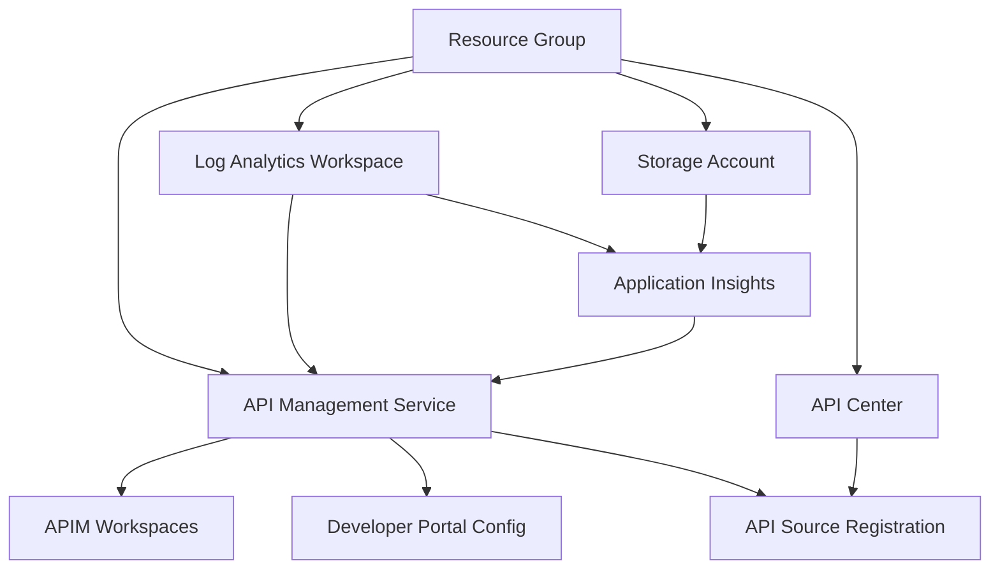

# Azure Resources Reference

This document provides a comprehensive inventory of all Azure resources created by the API Management Landing Zone Accelerator.

## 🎯 Resource Overview

The accelerator creates resources across multiple Azure services, organized by functional area and aligned with Azure Landing Zone design principles.

## 📋 Complete Resource Inventory

### Resource Groups
| Resource Type | Name Pattern | Purpose | Module |
|---------------|--------------|---------|---------|
| `Microsoft.Resources/resourceGroups` | `{solutionName}-{envName}-{location}-rg` | Primary resource container | `infra/main.bicep` |

### Monitoring & Observability

#### Log Analytics Workspace
| Resource Type | Name Pattern | SKU | Purpose | Module |
|---------------|--------------|-----|---------|---------|
| `Microsoft.OperationalInsights/workspaces` | `{solutionName}-{uniqueString}-law` | PerGB2018 (default) | Centralized logging and analytics | `src/shared/monitoring/operational/main.bicep` |

**Key Properties**:
- Data retention: Configurable (30-730 days)
- Identity: System-assigned managed identity
- Diagnostic settings: Enabled for all supported categories

#### Application Insights
| Resource Type | Name Pattern | Kind | Purpose | Module |
|---------------|--------------|------|---------|---------|
| `Microsoft.Insights/components` | `{solutionName}-{uniqueString}-ai` | web | Application performance monitoring | `src/shared/monitoring/insights/main.bicep` |

**Key Properties**:
- Application type: web
- Ingestion mode: LogAnalytics (workspace-based)
- Retention: 90 days (default)
- Public network access: Enabled (configurable)
- Linked workspace: Auto-linked to Log Analytics

#### Storage Account (Monitoring Support)
| Resource Type | Name Pattern | SKU | Purpose | Module |
|---------------|--------------|-----|---------|---------|
| `Microsoft.Storage/storageAccounts` | `{name}sa{uniqueString}` (truncated to 24 chars) | Standard_LRS | Diagnostic data storage | `src/shared/monitoring/operational/main.bicep` |

**Key Properties**:
- Kind: StorageV2
- Access tier: Hot
- Replication: Locally redundant storage (LRS)

### API Management Platform

#### API Management Service
| Resource Type | Name Pattern | SKU | Purpose | Module |
|---------------|--------------|-----|---------|---------|
| `Microsoft.ApiManagement/service` | `{solutionName}-{uniqueString}-apim` | Premium (default) | Core API gateway and management | `src/core/apim.bicep` |

**Key Properties**:
- Capacity: 1 unit (default, configurable)
- Identity: System-assigned managed identity
- Developer portal: Enabled by default
- Public network access: Enabled (configurable)
- VNet integration: None (configurable for Internal/External)

**Associated Resources**:
- **Diagnostic Settings**: `{apim.name}-diag`
  - Logs: allLogs category enabled
  - Metrics: AllMetrics enabled
  - Target: Log Analytics workspace

- **Application Insights Logger**: `looger` (sic)
  - Type: applicationInsights
  - Credentials: Instrumentation key-based

- **Application Insights Diagnostic**: `name`
  - Logger ID: Log Analytics workspace ID

#### API Management Workspaces
| Resource Type | Name Pattern | Purpose | Module |
|---------------|--------------|---------|---------|
| `Microsoft.ApiManagement/service/workspaces` | User-defined (from settings) | Multi-tenant API organization | `src/core/workspaces.bicep` |

**Key Properties**:
- Display name: Same as name
- Description: Same as name
- Parent: APIM service

#### Developer Portal Configuration
| Resource Type | Name Pattern | Purpose | Module |
|---------------|--------------|---------|---------|
| `Microsoft.ApiManagement/service/policies` | `policy` | Global API policies | `src/core/developer-portal.bicep` |
| `Microsoft.ApiManagement/service/identityProviders` | `aad` | Azure AD authentication | `src/core/developer-portal.bicep` |
| `Microsoft.ApiManagement/service/portalsettings` | `signin`, `signup` | Portal authentication settings | `src/core/developer-portal.bicep` |
| `Microsoft.ApiManagement/service/portalconfigs` | `default` | Portal CORS configuration | `src/core/developer-portal.bicep` |

### API Inventory & Governance

#### API Center Service
| Resource Type | Name Pattern | SKU | Purpose | Module |
|---------------|--------------|-----|---------|---------|
| `Microsoft.ApiCenter/services` | `{solutionName}-apicenter-{uniqueString}` | Standard | API catalog and governance | `src/inventory/main.bicep` |

**Key Properties**:
- Identity: System-assigned managed identity (default)
- Location: Same as resource group

#### API Center Workspace
| Resource Type | Name Pattern | Purpose | Module |
|---------------|--------------|---------|---------|
| `Microsoft.ApiCenter/services/workspaces` | `default` | Default API workspace | `src/inventory/main.bicep` |

**Key Properties**:
- Title: "Default workspace"
- Description: "Default workspace"

#### API Source Registration
| Resource Type | Name Pattern | Purpose | Module |
|---------------|--------------|---------|---------|
| `Microsoft.ApiCenter/services/workspaces/apiSources` | `{apiManagementName}` | Links APIM to API Center | `src/inventory/main.bicep` |

**Key Properties**:
- Source type: Azure API Management
- Resource ID: APIM service resource ID

### Identity & Access Management

#### Managed Identities
| Service | Identity Type | Purpose | RBAC Roles Assigned |
|---------|---------------|---------|-------------------|
| API Management | System-assigned | Service authentication | `acdd72a7-3385-48ef-bd42-f606fba81ae7` (Reader) |
| Log Analytics | System-assigned | Workspace operations | N/A |
| API Center | System-assigned | Service operations | `71522526-b88f-4d52-b57f-d31fc3546d0d` (API Center Service Reader) |

#### RBAC Role Assignments
| Resource Type | Scope | Purpose | Module |
|---------------|-------|---------|---------|
| `Microsoft.Authorization/roleAssignments` | Resource Group | APIM managed identity permissions | `src/core/apim.bicep` |
| `Microsoft.Authorization/roleAssignments` | Resource Group | API Center managed identity permissions | `src/inventory/main.bicep` |

### Networking (Placeholder)

#### Virtual Network
| Resource Type | Name Pattern | Purpose | Module | Status |
|---------------|--------------|---------|---------|--------|
| `Microsoft.ScVmm/virtualNetworks` | `vnet` | Network isolation | `src/shared/networking/main.bicep` | Placeholder |

**Note**: The networking module contains placeholder resources and is not fully implemented in the current version.

## 🏷️ Resource Tagging Strategy

### Standard Tags Applied to All Resources

| Tag Name | Source | Example Value | Purpose |
|----------|--------|---------------|---------|
| `CostCenter` | `shared.tags` | "CC-1234" | Cost allocation |
| `BusinessUnit` | `shared.tags` | "IT" | Organizational unit |
| `Owner` | `shared.tags` | "admin@contoso.com" | Resource ownership |
| `ApplicationName` | `shared.tags` | "APIM Platform" | Application context |
| `ProjectName` | `shared.tags` | "APIMForAll" | Project identification |
| `ServiceClass` | `shared.tags` | "Critical" | Service tier |
| `RegulatoryCompliance` | `shared.tags` | "GDPR" | Compliance requirements |
| `SupportContact` | `shared.tags` | "cloudops@contoso.com" | Support escalation |
| `ChargebackModel` | `shared.tags` | "Dedicated" | Cost model |
| `BudgetCode` | `shared.tags` | "FY25-Q1-InitiativeX" | Budget tracking |
| `environment` | Runtime | "dev", "test", "prod" | Environment identification |

### Component-Specific Tags

| Component | Tag | Value | Purpose |
|-----------|-----|-------|---------|
| Monitoring | `lz-component-type` | "shared" | Landing zone categorization |
| Monitoring | `component` | "monitoring" | Component identification |
| API Management | `lz-component-type` | "core" | Landing zone categorization |
| API Management | `component` | "apiManagement" | Component identification |
| API Center | `lz-component-type` | "inventory" | Landing zone categorization |
| API Center | `component` | "inventory" | Component identification |

## 🔧 Resource Configuration Patterns

### Naming Conventions

```bicep
// Auto-generated names follow this pattern
var resourceName = !empty(settings.name) 
  ? settings.name 
  : '${solutionName}-${uniqueString(subscription().id, resourceGroup().id, resourceGroup().name, solutionName, location)}-{suffix}'
```

**Naming Suffixes**:
- API Management: `-apim`
- Log Analytics: `-law` 
- Application Insights: `-ai`
- API Center: `-apicenter`
- Storage Account: `sa` (with unique string, truncated to 24 chars)

### Identity Configuration

```bicep
// System-assigned identity pattern
identity: (identityType != 'None') ? {
  type: identityType
  userAssignedIdentities: (identityType == 'UserAssigned' && !empty(userAssignedIdentities))
    ? toObject(userAssignedIdentities, id => id, id => {})
    : null
} : null
```

### Diagnostic Settings Pattern

```bicep
// Standard diagnostic configuration
resource diagnosticSettings 'Microsoft.Insights/diagnosticSettings@2021-05-01-preview' = {
  name: '${resource.name}-diag'
  scope: resource
  properties: {
    workspaceId: logAnalyticsWorkspaceId
    metrics: [{ category: 'AllMetrics', enabled: true }]
    logs: [{ category: 'allLogs', enabled: true }]
  }
}
```

## 📊 Resource Dependencies



## 🔍 Resource Validation

### Health Check Queries

```bash
# Verify all resources are deployed
az resource list --resource-group "{rgName}" --output table

# Check API Management service status
az apim show --name "{apimName}" --resource-group "{rgName}" --query "provisioningState"

# Verify Log Analytics workspace
az monitor log-analytics workspace show --workspace-name "{lawName}" --resource-group "{rgName}"

# Check Application Insights component
az monitor app-insights component show --app "{aiName}" --resource-group "{rgName}"

# Validate API Center service
az apic service show --service-name "{apiCenterName}" --resource-group "{rgName}"
```

### Cost Estimation

| Resource | SKU | Approximate Monthly Cost (USD) | Notes |
|----------|-----|-------------------------------|--------|
| API Management Premium (1 unit) | Premium | ~$2,000 | Base unit cost |
| Log Analytics (PerGB2018) | PerGB2018 | ~$50-200 | Depends on ingestion volume |
| Application Insights | Standard | ~$20-100 | Depends on telemetry volume |
| API Center | Standard | ~$100 | Fixed monthly cost |
| Storage Account (LRS) | Standard_LRS | ~$5-20 | Depends on storage usage |

**Total Estimated Monthly Cost**: ~$2,175-2,420 USD (excluding data transfer and additional API calls)

## 📚 Related Documentation

- [Settings Schema Reference](settings-schema.md) - Configuration parameters
- [Bicep Module Reference](bicep-modules.md) - Module structure and parameters
- [RBAC & Permissions](permissions.md) - Security and access control