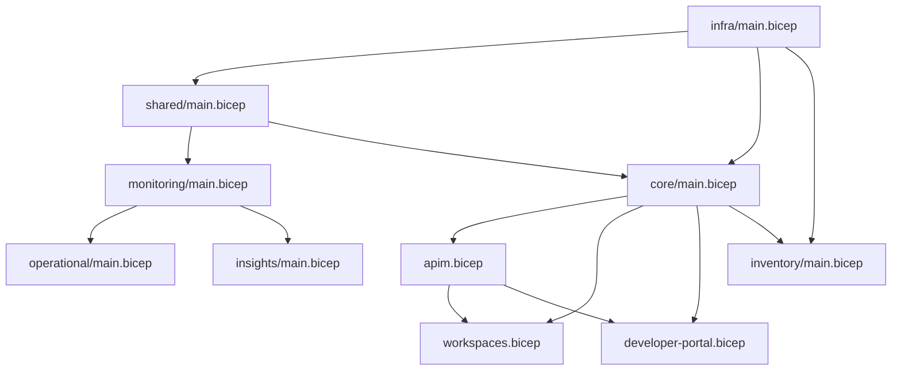

# Bicep Module Reference

This document provides a comprehensive reference for all Bicep modules in the Azure API Management Accelerator.

## 🏗️ Module Architecture

The accelerator uses a hierarchical module structure organized by functional areas:

```
infra/main.bicep              # Subscription-level orchestration
├── src/shared/main.bicep     # Shared infrastructure
│   ├── monitoring/main.bicep # Monitoring orchestration
│   │   ├── operational/main.bicep # Log Analytics workspace
│   │   └── insights/main.bicep    # Application Insights
│   └── networking/main.bicep # Network components (placeholder)
├── src/core/main.bicep       # Core platform
│   ├── apim.bicep           # API Management service
│   ├── developer-portal.bicep # Developer portal config
│   └── workspaces.bicep     # APIM workspaces
└── src/inventory/main.bicep  # API inventory management
```

## 📋 Module Reference

### Infrastructure Orchestration

#### `infra/main.bicep`
**Scope**: `subscription`  
**Purpose**: Creates resource groups and coordinates all deployments

**Parameters**:
| Name | Type | Required | Description |
|------|------|----------|-------------|
| `envName` | string | Yes | Environment name (dev, test, prod) |
| `location` | string | Yes | Azure region for deployment |

**Key Resources**:
- Resource group creation
- Module orchestration for shared, core, and inventory components

**Outputs**:
| Name | Type | Description |
|------|------|-------------|
| `APPLICATION_INSIGHTS_RESOURCE_ID` | string | Application Insights resource ID |
| `APPLICATION_INSIGHTS_NAME` | string | Application Insights name |
| `APPLICATION_INSIGHTS_INSTRUMENTATION_KEY` | string | Instrumentation key |

### Shared Infrastructure

#### `src/shared/main.bicep`
**Purpose**: Orchestrates shared infrastructure components

**Parameters**:
| Name | Type | Required | Description |
|------|------|----------|-------------|
| `solutionName` | string | Yes | Base name for resource naming |
| `location` | string | Yes | Azure region for deployment |
| `sharedSettings` | Shared | Yes | Shared configuration from settings.yaml |

**Key Features**:
- Deploys monitoring infrastructure (Log Analytics, Application Insights)
- Manages shared resource tagging strategy
- Provides essential outputs for dependent modules
- Imports type definitions from common-types.bicep

**Outputs**:
| Name | Type | Description |
|------|------|-------------|
| `AZURE_LOG_ANALYTICS_WORKSPACE_ID` | string | Log Analytics workspace resource ID |
| `APPLICATION_INSIGHTS_RESOURCE_ID` | string | Application Insights resource ID |
| `APPLICATION_INSIGHTS_NAME` | string | Application Insights component name |
| `APPLICATION_INSIGHTS_INSTRUMENTATION_KEY` | string | Application Insights instrumentation key (secure) |
| `AZURE_STORAGE_ACCOUNT_ID` | string | Storage account resource ID |

#### `src/shared/monitoring/main.bicep`
**Purpose**: Monitoring infrastructure orchestration

**Parameters**:
| Name | Type | Required | Description |
|------|------|----------|-------------|
| `location` | string | Yes | Azure region |
| `tags` | object | Yes | Resource tags |
| `solutionName` | string | Yes | Solution identifier |
| `monitoringSettings` | Monitoring | Yes | Monitoring configuration |

**Modules Deployed**:
- `operational/main.bicep` - Log Analytics workspace with storage
- `insights/main.bicep` - Application Insights component

#### `src/shared/monitoring/operational/main.bicep`
**Purpose**: Log Analytics workspace deployment

**Parameters**:
| Name | Type | Required | Default | Description |
|------|------|----------|---------|-------------|
| `name` | string | Yes | - | Workspace name |
| `location` | string | Yes | - | Azure region |
| `skuName` | string | No | `PerGB2018` | Pricing tier |
| `identityType` | string | Yes | - | Identity type |
| `userAssignedIdentities` | array | Yes | - | User-assigned identities |
| `tags` | object | Yes | - | Resource tags |

**Resources Created**:
- Log Analytics workspace
- Storage account (for diagnostic data)

**Outputs**:
| Name | Type | Description |
|------|------|-------------|
| `AZURE_LOG_ANALYTICS_WORKSPACE_ID` | string | Workspace resource ID |
| `AZURE_STORAGE_ACCOUNT_ID` | string | Storage account resource ID |

#### `src/shared/monitoring/insights/main.bicep`
**Purpose**: Application Insights component deployment

**Parameters**:
| Name | Type | Required | Default | Description |
|------|------|----------|---------|-------------|
| `name` | string | Yes | - | Component name |
| `location` | string | Yes | - | Azure region |
| `kind` | string | No | `web` | Application type |
| `applicationType` | string | No | `web` | Insights type |
| `ingestionMode` | string | No | `LogAnalytics` | Data ingestion mode |
| `publicNetworkAccessForIngestion` | string | No | `Enabled` | Ingestion access |
| `publicNetworkAccessForQuery` | string | No | `Enabled` | Query access |
| `retentionInDays` | int | No | `90` | Data retention period |
| `logAnalyticsWorkspaceResourceId` | string | Yes | - | Linked workspace |
| `storageAccountResourceId` | string | Yes | - | Storage account |
| `tags` | object | Yes | - | Resource tags |

**Outputs**:
| Name | Type | Description |
|------|------|-------------|
| `APPLICATION_INSIGHTS_RESOURCE_ID` | string | Component resource ID |
| `APPLICATION_INSIGHTS_NAME` | string | Component name |
| `APPLICATION_INSIGHTS_INSTRUMENTATION_KEY` | string | Instrumentation key |

### Core Platform

#### `src/core/main.bicep`
**Purpose**: Core API Management platform orchestration

**Parameters**:
| Name | Type | Required | Description |
|------|------|----------|-------------|
| `solutionName` | string | Yes | Solution identifier for resource naming |
| `location` | string | Yes | Azure region for deployment |
| `apiManagementSettings` | ApiManagement | Yes | APIM configuration from settings.yaml |
| `logAnalyticsWorkspaceId` | string | Yes | Log Analytics workspace resource ID |
| `storageAccountResourceId` | string | Yes | Storage account resource ID for diagnostics |
| `applicationInsIghtsResourceId` | string | Yes | Application Insights resource ID |
| `tags` | object | Yes | Resource tags for governance |

**Key Features**:
- Imports ApiManagement type and utility functions
- Generates unique resource names using constants.bicep
- Orchestrates APIM service, workspaces, and developer portal
- Ensures proper dependency management between components

**Modules Deployed**:
- `apim.bicep` - API Management service with monitoring integration
- `workspaces.bicep` - APIM workspaces (array deployment from settings)
- `developer-portal.bicep` - Developer portal configuration with Azure AD

**Outputs**:
| Name | Type | Description |
|------|------|-------------|
| `API_MANAGEMENT_RESOURCE_ID` | string | APIM service resource ID |
| `API_MANAGEMENT_NAME` | string | APIM service name for reference |

#### `src/core/apim.bicep`
**Purpose**: Core API Management service deployment with comprehensive configuration

**Parameters**:
| Name | Type | Required | Default | Description |
|------|------|----------|---------|-------------|
| `name` | string | Yes | - | APIM service instance name |
| `location` | string | Yes | - | Azure region for deployment |
| `skuName` | string | Yes | - | APIM pricing tier (Basic, Developer, Premium, etc.) |
| `identityType` | string | Yes | - | Managed identity type (SystemAssigned/UserAssigned/None) |
| `userAssignedIdentities` | array | Yes | - | User-assigned identity resource IDs |
| `skuCapacity` | int | Yes | - | Number of scale units |
| `publisherEmail` | string | Yes | - | Publisher contact email address |
| `publisherName` | string | Yes | - | Publisher organization name |
| `logAnalyticsWorkspaceId` | string | Yes | - | Log Analytics workspace resource ID |
| `storageAccountResourceId` | string | Yes | - | Storage account for diagnostic logs |
| `applicationInsIghtsResourceId` | string | Yes | - | Application Insights resource ID |
| `enableDeveloperPortal` | bool | No | `true` | Enable/disable developer portal |
| `publicNetworkAccess` | bool | No | `true` | Allow public network access |
| `virtualNetworkType` | string | No | `None` | VNet integration (External/Internal/None) |
| `subnetResourceId` | string | No | `''` | Subnet resource ID for VNet integration |
| `tags` | object | Yes | - | Resource governance tags |

**Key Features**:
- Comprehensive identity configuration with conditional logic
- Full diagnostic settings with Log Analytics and Storage integration
- Application Insights logger with instrumentation key configuration
- RBAC role assignment for Reader access
- VNet integration support for private deployments
- Configurable developer portal and network access settings

**Resources Created**:
- API Management service with specified configuration
- Diagnostic settings for logs and metrics
- Application Insights logger integration
- RBAC role assignment for service identity

**Outputs**:
| Name | Type | Description |
|------|------|-------------|
| `API_MANAGEMENT_RESOURCE_ID` | string | APIM service resource ID |
| `API_MANAGEMENT_NAME` | string | APIM service name |
| `AZURE_CLIENT_SECRET_CLIENT_ID` | string | Managed identity client ID |
| `AZURE_API_MANAGEMENT_IDENTITY_PRINCIPAL_ID` | string | Service principal ID |

#### `src/core/workspaces.bicep`
**Purpose**: APIM workspace creation

**Parameters**:
| Name | Type | Required | Description |
|------|------|----------|-------------|
| `name` | string | Yes | Workspace name |
| `apiManagementName` | string | Yes | Parent APIM service name |

**Resources Created**:
- API Management workspace with display name and description

#### `src/core/developer-portal.bicep`
**Purpose**: Developer portal configuration

**Parameters**:
| Name | Type | Required | Description |
|------|------|----------|-------------|
| `apiManagementName` | string | Yes | APIM service name |
| `clientId` | string | Yes | Azure AD client ID |
| `clientSecret` | string | Yes | Azure AD client secret (secure) |
| `tags` | object | Yes | Resource tags |

**Resources Created**:
- Global policy configuration
- Azure AD identity provider
- Portal sign-in settings
- Portal sign-up settings
- Portal configuration with CORS

### API Inventory

#### `src/inventory/main.bicep`
**Purpose**: API Center integration for inventory management

**Parameters**:
| Name | Type | Required | Description |
|------|------|----------|-------------|
| `solutionName` | string | Yes | Solution identifier |
| `location` | string | No | Azure region (default: eastus) |
| `inventorySettings` | Inventory | Yes | API Center configuration |
| `apiManagementName` | string | Yes | APIM service name |
| `apiManagementResourceId` | string | Yes | APIM service resource ID |
| `tags` | object | Yes | Resource tags |

**Resources Created**:
- API Center service with Standard SKU
- System or user-assigned managed identity
- RBAC role assignments
- API Center workspace (default)
- API source registration (links to APIM)

### Type Definitions

#### `src/shared/common-types.bicep`
**Purpose**: Centralized type definitions for consistent parameter structures

**Key Type Definitions**:

```bicep
// Identity types with comprehensive support
type SystemAssignedIdentity = {
  type: 'SystemAssigned' | 'UserAssigned'
  userAssignedIdentities: []
}

type ExtendedIdentity = {
  type: 'SystemAssigned' | 'UserAssigned' | 'SystemAssigned, UserAssigned' | 'None'
  userAssignedIdentities: []
}

// Service configuration types
type ApimSku = {
  name: 'Basic' | 'BasicV2' | 'Developer' | 'Isolated' | 'Standard' | 'StandardV2' | 'Premium' | 'Consumption'
  capacity: int
}

// Main exported types
@export()
type ApiManagement = {
  name: string
  publisherEmail: string
  publisherName: string
  sku: ApimSku
  identity: SystemAssignedIdentity
  workspaces: array
}

@export()
type Inventory = {
  apiCenter: ApiCenter
  tags: object
}

@export()
type Monitoring = {
  logAnalytics: LogAnalytics
  applicationInsights: ApplicationInsights
  tags: object
}

@export()
type Shared = {
  monitoring: Monitoring
  tags: object
}
```

#### `src/shared/constants.bicep`
**Purpose**: Centralized constants, defaults, and utility functions

**Key Constants**:
- Diagnostic settings configuration
- Storage account naming and constraints
- Service defaults and options
- Azure role definition IDs
- Identity type constants

**Utility Functions**:
- `generateUniqueSuffix()` - Consistent resource naming
- `generateStorageAccountName()` - Compliant storage naming
- `createIdentityConfig()` - Proper identity object creation

## 🔧 Module Usage Patterns

### Basic Deployment
```bicep
// Deploy with minimum configuration
module apim 'src/core/apim.bicep' = {
  name: 'deploy-apim'
  params: {
    name: 'my-apim'
    location: 'eastus'
    skuName: 'Developer'
    skuCapacity: 1
    identityType: 'SystemAssigned'
    userAssignedIdentities: []
    publisherEmail: 'admin@contoso.com'
    publisherName: 'Contoso'
    logAnalyticsWorkspaceId: lawId
    ApplicationInsightsResourceId: aiId
    tags: commonTags
  }
}
```

### Advanced Configuration
```bicep
// Deploy with VNet integration and custom settings
module apim 'src/core/apim.bicep' = {
  name: 'deploy-apim-advanced'
  params: {
    name: 'enterprise-apim'
    location: 'eastus'
    skuName: 'Premium'
    skuCapacity: 3
    identityType: 'SystemAssigned'
    userAssignedIdentities: []
    publisherEmail: 'api-ops@contoso.com'
    publisherName: 'Contoso API Operations'
    logAnalyticsWorkspaceId: lawId
    ApplicationInsightsResourceId: aiId
    virtualNetworkType: 'Internal'
    subnetResourceId: subnetId
    publicNetworkAccess: false
    enableDeveloperPortal: true
    tags: commonTags
  }
}
```

## 📊 Resource Dependencies



## 🏷️ Tagging Conventions

All modules support consistent tagging through:

### Module-Level Tags
```bicep
// Applied to all resources in a module
param tags object

resource someResource 'Microsoft.SomeProvider/someType@2024-01-01' = {
  name: resourceName
  location: location
  tags: tags  // Inherited from module parameter
}
```

### Component-Specific Tags
```bicep
// Merge module tags with component-specific tags
tags: union(tags, {
  'component': 'monitoring'
  'lz-design-area': 'management'
})
```

## 🔍 Debugging and Validation

### Template Validation
```bash
# Validate deployment configuration
azd provision --preview

# Preview changes before deployment
azd up --preview
```

## 📚 Related Documentation

- [Settings Schema Reference](settings-schema.md) - Configuration file reference
- [Azure Resources Reference](azure-resources.md) - Complete resource inventory
- [Type Definitions](../../src/shared/common-types.bicep) - Bicep type definitions